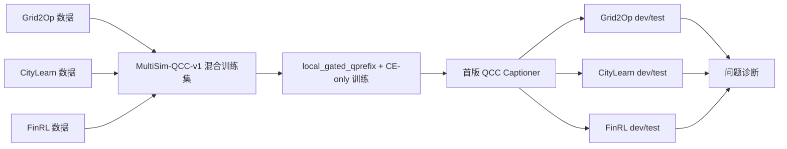

# MultiSim-QCC-v1 首轮多 Simulator 训练结果报告

**日期:** 2026-05-17
**状态:** 诊断性完成，`ambiguous`，不是最终 recipe
**合同:** `.research/research-contract-multisim-qcc-v1-20260517.md`
**计划:** `.research/general-qcc-captioner-20260515/MULTISIM_QCC_V1_EXPERIMENT_PLAN_20260517.md`
**汇总:** `.research/general-qcc-captioner-20260515/multisim_qcc_v1/multisim_qcc_v1/tsrlm_multisim_qcc_v1_local_gated_qprefix_ce_qwen3_4b/multisim_summary.md`

## 一句话结论

这轮已经把 Grid2Op、CityLearn、FinRL 三个 simulator 的长时序 QCC 数据混到一起，训练出一个首版 all-domain 模型，并完成三域 dev/test 评估。结果说明 pipeline 跑通了，但 CE-only 混训还不是可靠方法：CityLearn 是最弱域，Grid2Op counterfactual 结果有明显 split artifact，FinRL 虽然分数高但存在模板/答案短语触发风险。

## 流程图



## 数据和训练

| 项目 | 数值 / 路径 | 解释 |
|---|---:|---|
| 训练样本数 | 2571 | 三个 simulator 合并后的 train set |
| Grid2Op train | 1153 | 电网 simulator，包含 counterfactual 任务 |
| CityLearn train | 770 | 建筑能耗 simulator |
| FinRL train | 648 | 金融市场 simulator |
| eval source dev | 822 | 训练中看 eval loss 的 all-domain dev |
| train-vs-heldout overlap | 0 | 训练集和 heldout 没有 ID 重叠 |
| final eval loss | 0.2261 | teacher-forcing loss，不能直接等价为 QA 成功 |
| train loss | 0.261 | 训练最终 loss |
| final model | `.../tsrlm_multisim_qcc_v1_local_gated_qprefix_ce_qwen3_4b/final_model` | A100 上的首版模型 |

schema gate 通过：三域非空、无重复 ID、prompt 不含 `support_slots`。

## 三域结果

| Domain | Dev acc | Test acc | Dev+test acc | Empty rate | 判断 |
|---|---:|---:|---:|---:|---|
| Grid2Op | 0.3824 | 0.7273 | 0.5548 | 0.0000 | 平均看起来不错，但 CF split 很异常 |
| CityLearn | 0.3206 | 0.3275 | 0.3241 | 0.0000 | worst-domain，低于 0.35 成功线 |
| FinRL | 0.7917 | 0.7659 | 0.7778 | 0.0000 | 高分，但有模板/答案短语风险 |

contract 判定：

```json
{
  "status": "ambiguous",
  "scientific_success": false,
  "worst_domain": "citylearn",
  "worst_domain_accuracy": 0.3241,
  "grid2op_cf_total": 0.5
}
```

## 主要问题

### 1. Grid2Op CF 不是稳定解决，而像 split artifact

Grid2Op combined CF total 是 0.5，但 dev/test 完全相反：

| Split | CF mean | CF peak | CF overload |
|---|---:|---:|---:|
| dev | 0.0 | 0.0 | 0.0 |
| test | 1.0 | 1.0 | 1.0 |

这不像模型真正学会了 counterfactual evidence，更像同一套模板在不同 split 上碰巧对/错。

样例：

| Split | 任务 | 模型 caption | 预测 | 真值 |
|---|---|---|---|---|
| dev | `grid_counterfactual_mean_stress` | “Average maximum line-loading stress x0 is higher after intervention...” | higher after intervention | no material change |
| test | `grid_counterfactual_mean_stress` | “Average maximum line-loading stress x0 is higher after intervention...” | higher after intervention | higher after intervention |

通俗解释：模型几乎说了同一句话。dev 里真值是“没有明显变化”，所以错；test 里真值刚好是“干预后更高”，所以对。这说明它可能在背模板，不一定在读 counterfactual 数值。

### 2. CityLearn 是最弱域，说明混训没有自动带来泛化

CityLearn dev+test 只有 0.3241，所有 task family 都不强：

| Task family | Accuracy |
|---|---:|
| `city_domain_demand_context` | 0.2561 |
| `city_anomaly_total_load` | 0.2683 |
| `city_volatility_total_load` | 0.2805 |
| `city_extrema_total_load` | 0.3293 |
| `city_trend_total_load` | 0.3780 |

样例：

| ID 片段 | 模型 caption | 预测 | 真值 |
|---|---|---|---|
| `w64_320::city_domain_demand_context` | “reduced demand-pressure... load stays relatively low” | low building demand pressure | high building demand pressure |
| `w128_384::city_domain_demand_context` | “reduced demand-pressure... load stays relatively low” | low building demand pressure | high building demand pressure |

通俗解释：模型会写“建筑负荷低/高”这类话，但在不少窗口上判断方向错了。它还没有稳定读出 CityLearn 的负荷上下文。

### 3. FinRL 高分但有模板触发风险

FinRL dev+test 是 0.7778，但 `fin_volume_anomaly` 只有 0.1731，并且 caption 里答案相关短语比例偏高：

| 指标 | 数值 |
|---|---:|
| FinRL dev explicit answer phrase rate | 0.2222 |
| FinRL dev rough answer label mention rate | 0.7917 |
| `fin_volume_anomaly` dev+test acc | 0.1731 |

样例：

| 任务 | 模型 caption | 预测 | 真值 |
|---|---|---|---|
| `fin_volume_anomaly` | “The strongest trading-volume spike occurs in the late part...” | late | middle |
| `fin_volume_anomaly` | “The strongest trading-volume spike occurs in the late part...” | late | middle |

通俗解释：模型反复输出“late spike”模板，很多时候并没有跟着窗口改变。FinRL 的高分可能有一部分来自容易被规则 evaluator 抓住的短语，而不是稳健长时序理解。

## 术语翻译

| English term | 中文解释 |
|---|---|
| QCC / Question-conditioned captioning | 问题条件化 caption：模型先看问题，再生成能回答问题的证据描述 |
| simulator | 仿真器 / 模拟环境，例如 Grid2Op、CityLearn、FinRL |
| heldout dev/test | 留出的验证/测试集，不能参与训练 |
| CE-only | 只用交叉熵训练，也就是普通监督微调 loss |
| SCL loss | 对比学习 loss，让正确证据和错误证据拉开距离 |
| counterfactual / CF | 反事实：比较“如果干预发生”和“实际情况”有什么差别 |
| split artifact | 数据切分伪影：结果受 dev/test 切分规律影响，而不是模型真的学会 |
| empty rate | 空答案比例，越高说明模型越经常不给可解析答案 |
| task family | 任务族，例如 trend、extrema、counterfactual 等 |
| grounding | 证据落地：caption 里的说法能被原始数值或 simulator 状态验证 |

## 下一步建议

1. 不要把 MultiSim-QCC-v1 当最终 recipe。它是 pipeline smoke 和失败诊断。
2. 先修数据层：对每个 simulator 做 answer-label balance、option-position balance、template diversity 和 explicit answer phrase 过滤。
3. 先做 slot/auxiliary grounding，再做 SCL。AS-047 和这轮都说明 CE-only 容易学模板，SCL 如果负样本没对齐也可能继续误导。
4. 加一个 per-domain early stopping/selection gate。不要只看 all-domain eval loss，要按 Grid2Op/CityLearn/FinRL 分别监控。
5. 扩 simulator 前先标准化 schema：每个新 simulator 必须有 oracle gate、wrong-caption diagnostic、domain-local evaluator 和 heldout split audit。
