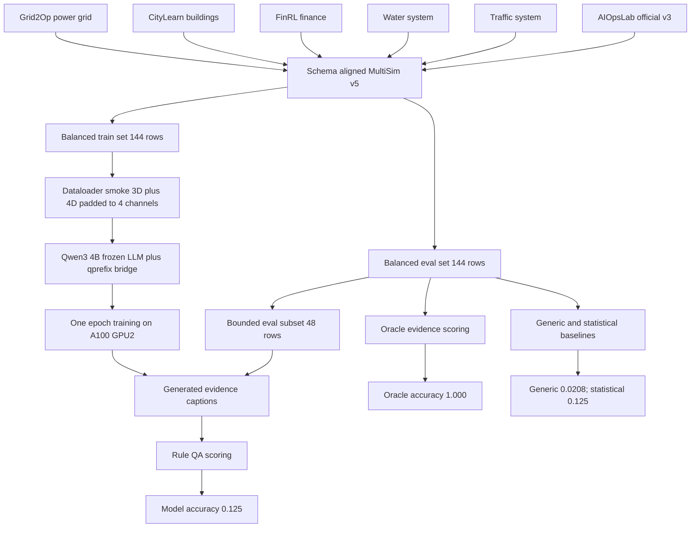

# MultiSim v5 + AIOpsLab v3 扩充训练评估报告（2026-05-18）

## 一句话结论

这轮把 `Grid2Op`、`CityLearn`、`FinRL`、`water`、`traffic` 和扩充后的 `AIOpsLab official v3` 放进了同一个 `MultiSim v5` 数据流，dataloader 和训练链路已经跑通；但训练出来的模型还没有学会稳定生成可验证证据，48 条 balanced bounded test 上的 `Rule-QA accuracy（规则问答准确率）` 只有 **0.125**，没有超过 `statistical_caption（统计摘要基线）`。

这不是方法成功，而是一个明确的工程和诊断结果：多 simulator 数据生成、混合 3/4 维输入、训练和测试路径可以跑；当前训练 recipe 还不能作为论文结果。

## 这轮到底做了什么

## 数据层面的变化

最终合并后的扩充数据集叫 `multisim_qcc_v5_aiops_v3`。

| 项目 | 数值 |
| --- | ---: |
| 总样本数 | 1980 |
| train/dev/test | 1304 / 332 / 344 |
| 来源数 | 6 |
| 3 维时序样本 | 1920 |
| 4 维时序样本 | 60 |
| schema gate | pass |
| split leakage | 0 |
| duplicate id | 0 |

按 simulator/source（模拟器/数据来源）统计：

| 来源 | 样本数 | 说明 |
| --- | ---: | --- |
| `grid2op` | 384 | 电网运行模拟 |
| `citylearn` | 384 | 建筑能耗模拟 |
| `finrl_scaled` | 384 | 金融市场时序 |
| `water` | 384 | 供水系统时序 |
| `traffic` | 384 | 交通系统时序 |
| `aiopslab_official_v3` | 60 | AIOpsLab 官方 incident telemetry |

AIOpsLab v3 这次有 5 个可用 case，共 60 行。`revoke_auth` 两个 case 能跑但导出 CSV 为 0，所以没有放入训练数据；报告里不把它们算作成功数据。

数据和结果文件路径

| 内容 | 路径 |
| --- | --- |
| A100 合并数据目录 | `.research/general-qcc-captioner-20260515/multisim_qcc_v5_aiops_v3/` |
| schema 报告 | `.research/general-qcc-captioner-20260515/multisim_qcc_v5_aiops_v3/schema_report.json` |
| dataloader smoke | `.research/general-qcc-captioner-20260515/multisim_qcc_v5_aiops_v3/dataloader_smoke_balanced_20260518.json` |
| 训练报告 | `.research/general-qcc-captioner-20260515/multisim_qcc_v5_aiops_v3/tsrlm_multisim_v5_aiops_v3_balanced24_qwen3_4b_20260518/multisim_v5_train_smoke_report.json` |
| 生成结果 | `.research/general-qcc-captioner-20260515/multisim_qcc_v5_aiops_v3/generate_eval_balanced8_clean/predictions.jsonl` |
| 规则 QA 评估 | `.research/general-qcc-captioner-20260515/multisim_qcc_v5_aiops_v3/eval_balanced8_clean_ruleqa/qa_metrics.json` |

## 模型和训练设置

为了支持 AIOpsLab 的 4 维 telemetry，同时不破坏已有 3 维 simulator 数据，我加了一个专用 `MultiSim v5` 训练路径：

| 改动 | 通俗解释 |
| --- | --- |
| `target_num_vars=4` | 模型输入统一看成最多 4 个变量 |
| 3 维数据 zero padding | 3 维数据补 0 到 4 维，不强行丢掉 AIOpsLab 的第 4 维 |
| `GroupedBatchSampler` | 同一个 batch 里尽量只放同一个来源，避免混合来源造成形状和分布混乱 |
| frozen Qwen3-4B + qprefix | 冻结大语言模型，只训练时序 encoder、bridge 和 LoRA 小部分参数 |

训练配置：

| 项目 | 值 |
| --- | --- |
| base LLM | `Qwen3-4B-Instruct-2507` |
| bridge | `qprefix` |
| GPU | A100 GPU2 |
| train subset | 144 行，每个来源 24 行 |
| eval subset for loss | 144 行，每个来源 24 行 |
| 训练轮数 | 1 epoch |
| train steps | 144 |
| eval loss | 0.821 |
| 保存内容 | trainable-only checkpoint |

`dataloader smoke（数据加载冒烟测试）` 结果：

| 检查项 | 结果 |
| --- | --- |
| train loaded | 144 |
| eval loaded | 144 |
| train 4D/3D | 24 / 120 |
| eval 4D/3D | 24 / 120 |
| batch shape | `[2, 64, 4]` |
| mixed group violations | 0 |
| smoke pass | true |

## 测试结果

由于完整 144 条、48 token 生成耗时过长，而且脚本是一次性写盘，我改成 bounded evaluation（有边界的小测试）：每个来源抽 8 条，共 48 条，每条最多生成 24 token。这个测试能覆盖六个来源，但不能当成 full benchmark。

| 条件 | QA accuracy | empty answer rate | 解释 |
| --- | ---: | ---: | --- |
| `oracle_evidence_caption`（人工/规则 oracle 证据） | 1.0000 | 0.0000 | 数据标签和规则评估本身是可用的 |
| `generic_caption`（通用 caption） | 0.0208 | 0.8958 | 通用描述几乎不含可回答问题的证据 |
| `statistical_caption`（简单统计摘要） | 0.1250 | 0.6875 | 一些数值题能靠统计摘要猜中 |
| trained model（本轮训练模型） | 0.1250 | 0.5208 | 没超过统计摘要，不能算方法成功 |

按来源看 trained model：

| 来源 | n | accuracy | empty answer rate |
| --- | ---: | ---: | ---: |
| `aiopslab_official_v3` | 8 | 0.125 | 0.875 |
| `citylearn` | 8 | 0.250 | 0.125 |
| `finrl_scaled` | 8 | 0.125 | 0.500 |
| `grid2op` | 8 | 0.125 | 0.375 |
| `traffic` | 8 | 0.125 | 0.625 |
| `water` | 8 | 0.000 | 0.625 |

## 具体样例和中文解释

Case 1：AIOpsLab app context 失败

| 字段 | 内容 |
| --- | --- |
| 来源 | `aiopslab_official_v3` |
| 问题 | Which benchmark application generated this AIOpsLab telemetry case? |
| 中文 | 这个 AIOpsLab 遥测样本来自哪个 benchmark 应用？ |
| 选项 | A. hotel-reservation application / B. astronomy-shop application / C. social-network application / D. unknown application |
| 正确答案 | C，social-network application |
| oracle evidence | The official case metadata ties this telemetry window to the social-network application. |
| 中文 | 官方 case 元数据说明，这个遥测窗口属于 social-network 应用。 |
| 模型生成 | This case is labeled as a memory leak: the incident metadata maps this to the memory-leak application, service name, |
| 中文 | 模型把它说成 memory leak 相关应用，而且句子没说完整。 |

问题所在：模型没有抓住 `application=social-network` 这个元数据证据，反而幻觉出 `memory leak`。这说明 AIOpsLab 的 domain metadata（领域元数据）还没有被当前小训练稳定学到。

Case 2：AIOpsLab window memory 失败

| 字段 | 内容 |
| --- | --- |
| 来源 | `aiopslab_official_v3` |
| 问题 | Is memory working set x1 higher in the first half or the second half of the window? |
| 中文 | 内存工作集 x1 在窗口前半段更高，还是后半段更高？ |
| 正确答案 | A，similar halves |
| oracle evidence | The half-window comparison is similar halves: first-half mean x1 is 797644.80 and second-half mean x1 is 801177.60. |
| 中文 | 前半段均值是 797644.80，后半段均值是 801177.60，二者差不多，所以是 similar halves。 |
| 模型生成 | Memory working set x1 is higher in the second half of the window: first-half mean is 0.00 |
| 中文 | 模型说后半段更高，还错误地说前半段均值是 0。 |

问题所在：模型生成了看起来像统计证据的句子，但数值是错的。这比空答案更危险，因为它会让下游 QA 相信一个错误解释。

Case 3：CityLearn 局部成功

| 字段 | 内容 |
| --- | --- |
| 来源 | `citylearn` |
| 问题 | Which third of the window has the highest volatility in total building load x0? |
| 中文 | 建筑总负载 x0 在窗口的哪三分之一段波动最大？ |
| 正确答案 | B，middle |
| oracle evidence | Total building load x0 varies most in the central third of the window. |
| 中文 | 建筑总负载 x0 在中间三分之一段波动最大。 |
| 模型生成 | 0The total building load x0 varies most in the central third of the window.0Total building load x1 is |
| 中文 | 模型说出了关键事实“中间段波动最大”，但输出有多余字符和截断。 |

问题所在：模型有时能背出/生成正确证据，但格式不干净。这说明训练信号不是完全无效，下一步需要先修输出格式和 evidence grounding（证据落地）。

Case 4：Water 周期性失败

| 字段 | 内容 |
| --- | --- |
| 来源 | `water` |
| 问题 | What cyclic pattern best describes water pressure x0 in this window? |
| 中文 | 这个窗口里的水压 x0 最像哪种周期模式？ |
| 正确答案 | D，no clear cycle |
| oracle evidence | The dominant cyclic pattern is no clear cycle: the strongest autocorrelation peak is at lag 106 with score 0.132. |
| 中文 | 最强自相关峰值也很弱，所以没有明显周期。 |
| 模型生成 | water system state: x0 has a strong upward trend, with no significant autocorrelation.Overall pattern is upward trend |
| 中文 | 模型提到了没有明显自相关，但最后把结论转成了 upward trend。 |

问题所在：模型混淆了 task family（任务类型）。问题问的是周期性，它却用趋势结论回答。

## 指标是什么意思

| 英文术语 | 中文 | 通俗解释 |
| --- | --- | --- |
| `QA accuracy` | 问答准确率 | 用 caption 去回答选择题，答对的比例 |
| `empty_answer_rate` | 空答案率 | 规则评估器从 caption 里抽不出 A/B/C/D 的比例 |
| `oracle_evidence_caption` | oracle 证据 caption | 由规则/真实状态生成的“理想证据句子” |
| `generic_caption` | 通用 caption | 不看具体问题的普通描述 |
| `statistical_caption` | 统计摘要 caption | 均值、方差、最大最小等简单统计描述 |
| `schema gate` | 数据格式门禁 | 检查字段、split、ID、泄漏等基本数据问题 |
| `dataloader smoke` | 数据加载冒烟测试 | 确认训练前数据能被 batch 成模型输入 |
| `bounded evaluation` | 有边界的小测试 | 为了快速诊断而做的小规模测试，不等于完整 benchmark |
| `qprefix bridge` | qprefix 桥接层 | 把时序 encoder 输出接到 LLM 前缀里的模块 |
| `zero padding` | 补零 | 3 维数据补成 4 维，让不同来源能共用模型输入 |

## 审计结论

1. 数据层面：这轮比只跑 Grid2Op 更好。至少已经接入 6 个来源，并且 AIOpsLab official v3 真正进了 schema-aligned 数据流。
2. 工程层面：dataloader、训练、生成、规则 QA 测试都跑通了；混合 3/4 维输入没有 shape 问题。
3. 模型层面：失败。训练模型 accuracy = 0.125，没有超过 `statistical_caption`，远低于 oracle 的 1.0。
4. 失败原因主要不是数据标签错，而是模型生成证据不稳定：幻觉、错数值、任务类型混淆、输出格式脏、很多句子无法被规则抽取答案。
5. 这轮不能支撑“多 simulator QCC 模型泛化成功”的论文 claim，只能支撑“多 simulator 数据流和训练链路已经打通，当前 recipe 暴露出证据生成失败”的工程/诊断 claim。

## 下一步建议

先不要继续盲目加 simulator。下一轮应该先做两个更小、更硬的诊断：

1. `Oracle-format constrained decoding`：训练目标强制成短模板，例如“Evidence: ... Therefore label: ...”，先把 empty answer rate 压低。
2. `per-source overfit gate`：每个来源单独做 24 train / 8 eval，先证明每个来源能被小模型过拟合或近似记住，再合并训练。
3. `AIOpsLab metadata separation`：把 AIOpsLab 的数值任务和 metadata/context 任务分开训练和评估，因为这轮失败最明显的是 metadata hallucination。
4. `full 144-row generation with streaming writer`：修改生成脚本边生成边写盘，避免再次出现长时间无中间文件的问题。

只有当 bounded test 超过 `statistical_caption`，并且 empty answer rate 明显下降后，再考虑更大训练、SCL loss 或更多 simulator。
