# Case Study: Multi-Simulator QCC 数据源特质与规模上限

**日期:** 2026-05-18；2026-05-19 补充每域 2 道 case study
**样本来源:** `multisim_qcc_v5_aiops_v3/balanced_eval_per_source8.jsonl`
**目的:** 用真实 JSONL 样本展示每个 simulator/source 生成的时序数据长什么样、对应 QA 是什么、证据如何验证，以及这些数据源的可扩容上限。2026-05-19 版把每个域从 1 道扩展到 3 道，并补充 repaired question、中文问题、中文选项和时序图。

## 1. 总体结论

当前数据生成已经覆盖 6 个来源：

- `Grid2Op`：电网运行时序，适合压力、负载、反事实干预、跨变量关系。
- `CityLearn`：建筑能耗时序，适合负载、天气/光伏上下文、窗口比较、波动。
- `FinRL`：金融市场历史 OHLCV trace，适合价格/交易量/市场 regime，但不是因果仿真器。
- `water`：供水系统 trace，适合压力、流量、事件恢复、周期性、反事实。
- `traffic`：交通系统 trace，适合速度、排队、占有率、信号干预、周期性。
- `AIOpsLab official v3`：Kubernetes/Prometheus 遥测，适合 CPU/内存/网络、服务上下文、故障上下文，但当前规模最小。

最重要的结论是：**总行数不是唯一瓶颈**。数据源已经能合成到几千行级别；真正的瓶颈是 AIOpsLab official case 数、任务算子均衡、以及 evidence slot 是否显式可验证。

## 2. 当前规模与可扩容上限

### 当前主数据集规模

`multisim_qcc_v5_aiops_v3` 当前规模：

| 来源 | 当前使用 rows | 已加载 rows | 主要限制 |
| --- | ---: | ---: | --- |
| Grid2Op | 384 | 1791 | 可扩，受 chronic/干预场景数限制 |
| CityLearn | 384 | 1344 | 可扩，受 building/weather/window 组合限制 |
| FinRL | 384 | 3348 | 很容易扩，受 ticker/window 数限制 |
| water | 384 | 504 | 可扩，需更多场景/事件参数 |
| traffic | 384 | 504 | 可扩，需更多路网/信号/事件参数 |
| AIOpsLab official v3 | 60 | 60 | 当前最大瓶颈，受成功导出的 official case 数限制 |
| **合计** | **1980** | **7551 左右** | 不平衡明显 |

### 规模上限的保守估计

| 口径 | 估计规模 | 说明 |
| --- | ---: | --- |
| 当前可靠 balanced v5 | `1980` | 已过 schema gate，六源合并，AIOpsLab official 只 60 |
| 当前已有单源全部合并 | `~7551` | 不平衡，FinRL/Grid2Op/CityLearn 远多于 AIOpsLab |
| 短期均衡扩展 | `~2580` | 五个成熟 source 各 504，AIOpsLab 60 |
| 加大 FinRL windows_per_length | `~9500-10000` | 容易堆量，但会强化金融/source prior |
| water/traffic 场景参数扩展后 | `1万+` | 工程上可行，但必须保留 official/fallback 标记 |
| AIOpsLab official 大规模 | 未稳定 | 取决于 Docker/kind/Helm/kubectl runtime 和 case 成功率 |

解释：

- Grid2Op/CityLearn/FinRL/water/traffic 都能通过增加窗口、场景、事件参数继续扩。
- FinRL 最容易扩到几千到上万，但它更像历史市场 trace，不应单独承担“simulator 泛化”主证据。
- AIOpsLab official 的上限目前不是理论问题，而是 runtime 和 case export 成功率问题。
- 如果只追求行数，很快能到 `1万+`；如果追求多 simulator 均衡和可验证，当前更现实的是 `2k-3k` 的高质量 balanced set。

### 每个 simulator 的扩容上限分析

| 数据源 | 当前已验证规模 | 短期可扩规模 | 更高规模的条件 | 主要风险 |
| --- | ---: | ---: | --- | --- |
| Grid2Op | `1791` loaded / `384` used | `3k-5k` | 更多 chronic、更多干预线/时间点、更多窗口长度 | CF label collapse 和任务模板偏置 |
| CityLearn | `1344` loaded / `384` used | `2k-5k` | 更多 building、weather window、控制策略组合 | 与其他 building simulator 语义重叠 |
| FinRL | `3348` loaded / `384` used | `5580+`（`windows_per_length=5`） | 更多 ticker、更多窗口、更多市场周期 | 容易堆量但不是因果 simulator |
| water | `504` loaded / `384` used | `1500-3000` | 更多 leak/event seed、阀门/泵/修复策略组合 | 必须区分 official simulator 和 fallback/smoke |
| traffic | `504` loaded / `384` used | `1500-3000` | 更多 route demand、信号策略、事故/封路场景 | 场景过少时容易学固定模板 |
| AIOpsLab official | `60` loaded / `60` used | `数百到一千级` | 稳定 Docker/kind/Helm/kubectl runtime，并提高 case export 成功率 | 当前最大瓶颈；5 个成功 case，每 case 约 12 rows |

AIOpsLab 的线性估算很直接：当前 5 个成功 case 生成 60 rows，即每个成功 case 约 12 rows。若能稳定得到 100 个 successful official cases，则约 1200 rows；若 500 个 cases，则约 6000 rows。但这依赖 runtime 工程稳定性，不能用 fallback 数据替代 official 口径。

## 3. 具体时序样本与 QA

本节每个域给 3 道 case study：原有代表样例 1 道，新增 2 道。AIOpsLab 只选可由数值时序或窗口统计支撑的样例，避免把 metadata-only 题当作纯时间序列理解案例。

## grid2op：新增 2 道后共 3 道 case study

### 1. Grid2Op power-grid trace（电网运行仿真）

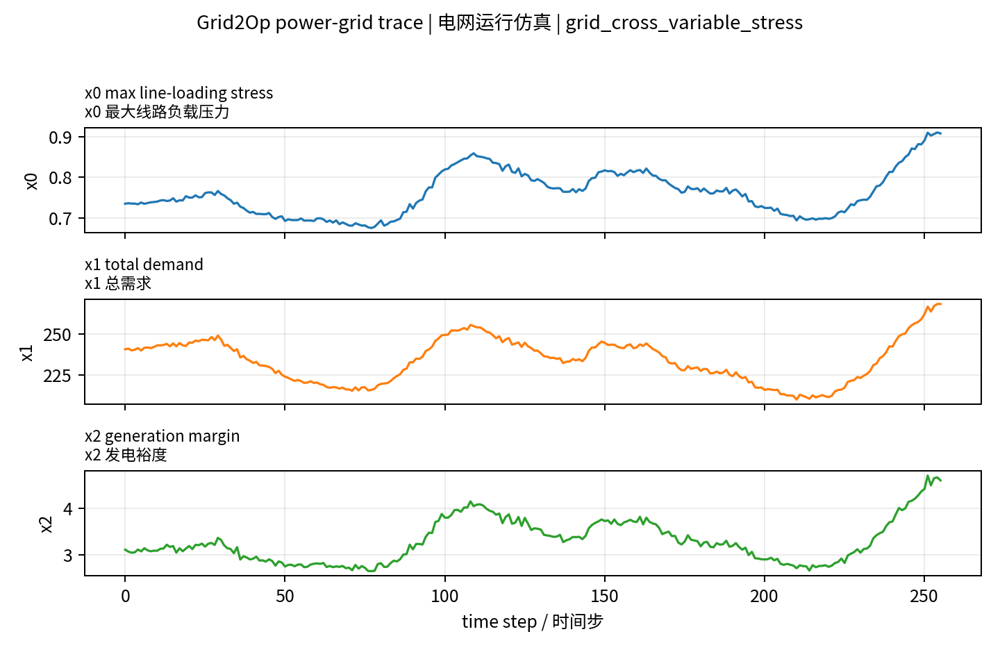

**样本 ID:** `multisim_qcc_v5_aiops_v3::grid2op::grid2op_broad::rte_case14_realistic_chronic2_trace_2048_nooverflow::w128_384::grid_cross_variable_stress`  
**任务:** `grid_cross_variable_stress`  
**窗口长度:** `256` steps，变量数 `3`  
**变量语义:** x0 最大线路负载压力, x1 总需求, x2 发电裕度  
**数据说明:** raw_compact_values 保留电网紧凑变量；values 是按窗口标准化后的模型输入。

**起点 raw 值:** x0=0.7356, x1=240.6, x2=3.119  
**终点 raw 值:** x0=0.9074, x1=268.3, x2=4.6

**Repaired question:** Background: This is a Grid2Op power-grid window. x0 is maximum line-loading stress over grid lines, x1 is total demand, and x2 is generation margin. A line-loading stress value above 1.0 means overload. Task rule: Cross-variable rule: compare absolute correlations between the target signal and each companion signal. Use both weak when both correlations are small, and both similar when the correlations are close. Specific question: Which compact variable is more strongly associated with maximum line-loading stress x0: total demand x1 or generation margin x2?

**中文背景:** 这是一个 Grid2Op 电网窗口。x0 是跨线路的最大线路负载压力，x1 是总需求，x2 是发电裕度。线路负载压力高于 1.0 表示过载。  
**中文判定规则:** 跨变量规则：比较目标信号与每个候选信号之间的绝对相关系数。当两个相关性都很小时选二者都弱；当二者接近时选二者相近。  
**中文具体问题:** 哪个紧凑变量与最大线路负载压力 x0 的关联更强：总需求 x1，还是发电裕度 x2？

**Options / 选项:**

- A. x1（x1）
- B. both similar（二者相近）
- C. x2（x2）
- D. both weak（二者都弱）

**Gold answer:** `C`，`x2`

**Oracle evidence:** x2 is more strongly associated with maximum line-loading stress x0 than x1: corr(x0,x2) is 0.99 versus corr(x0,x1) 0.86.  
**中文证据:** x2 与最大线路负载压力 x0 的关联强于 x1：corr(x0,x2)=0.99，而 corr(x0,x1)=0.86。

**关键 support slots（可验证证据字段）:** `corr_x1=0.859`, `corr_x2=0.99`, `answer_label=x2`, `window_start=128`, `window_end=384`, `source_horizon=2048`

**Question repair status:** `repaired`

### 2. Grid2Op power-grid trace（电网运行仿真）

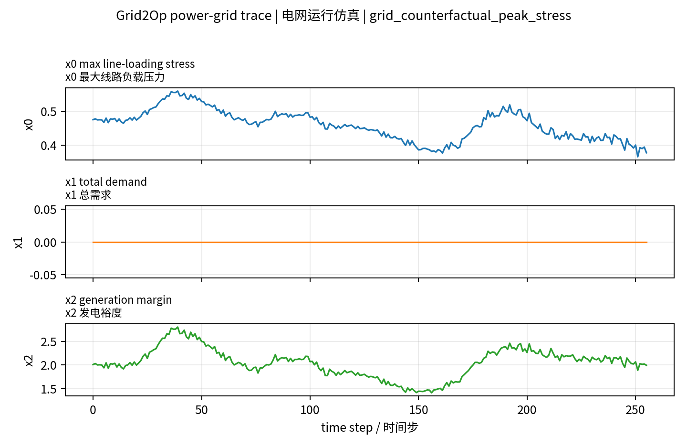

**样本 ID:** `multisim_qcc_v5_aiops_v3::grid2op::grid2op_broad_cf::h2048_c-1_t512_line1::post769_1025::grid_counterfactual_peak_stress`  
**任务:** `grid_counterfactual_peak_stress`  
**窗口长度:** `256` steps，变量数 `3`  
**变量语义:** x0 最大线路负载压力, x1 总需求, x2 发电裕度  
**数据说明:** raw_compact_values 保留电网紧凑变量；values 是按窗口标准化后的模型输入。

**起点 raw 值:** x0=0.475, x1=0, x2=2.011  
**终点 raw 值:** x0=0.378, x1=0, x2=1.995

**Repaired question:** Background: This is a Grid2Op power-grid window. x0 is maximum line-loading stress over grid lines, x1 is total demand, and x2 is generation margin. A line-loading stress value above 1.0 means overload. Task rule: Counterfactual rule: the trace describes intervention-minus-factual post-event stress. Positive deviations mean the intervention raises stress; negative deviations mean it lowers stress. Classify the strongest deviation as upward peak, downward dip, or no material change. Specific question: The provided trace is intervention-minus-factual after disconnecting line 1 at global step 512, shown in segment post769_1025. What is the strongest post-event stress deviation in x0?

**中文背景:** 这是一个 Grid2Op 电网窗口。x0 是跨线路的最大线路负载压力，x1 是总需求，x2 是发电裕度。线路负载压力高于 1.0 表示过载。  
**中文判定规则:** 反事实规则：这条轨迹描述事件后的“干预减事实”压力。正偏差表示干预提高压力，负偏差表示干预降低压力。按最强偏差分类为向上峰值、向下跌幅或没有实质变化。  
**中文具体问题:** 这条轨迹是在全局第 512 步断开 1 号线路后的“干预减事实”结果，显示的是 post769_1025 片段。事件后 x0 最强的压力偏差是什么？

**Options / 选项:**

- A. larger downward dip（更大的向下跌幅）
- B. no material change（没有实质变化）
- C. larger upward peak（更大的向上峰值）
- D. cannot determine（无法判断）

**Gold answer:** `C`，`larger upward peak`

**Oracle evidence:** The strongest post-event stress deviation is larger upward peak: post-event x0 differences range from 0.37 to 0.56.  
**中文证据:** 事件后最强的压力偏差是更大的上升峰值：事件后 x0 差值范围为 0.37 到 0.56。

**关键 support slots（可验证证据字段）:** `max_x0_diff=0.5587`, `min_x0_diff=0.3664`, `answer_label=larger upward peak`, `line_id=1`, `intervention_step=512`, `post_start=0`, `global_post_start=513`, `segment_start=769`, `segment_end=1025`, `segment_tag=post769_1025`

**Question repair status:** `repaired`

### 3. Grid2Op power-grid trace（电网运行仿真）

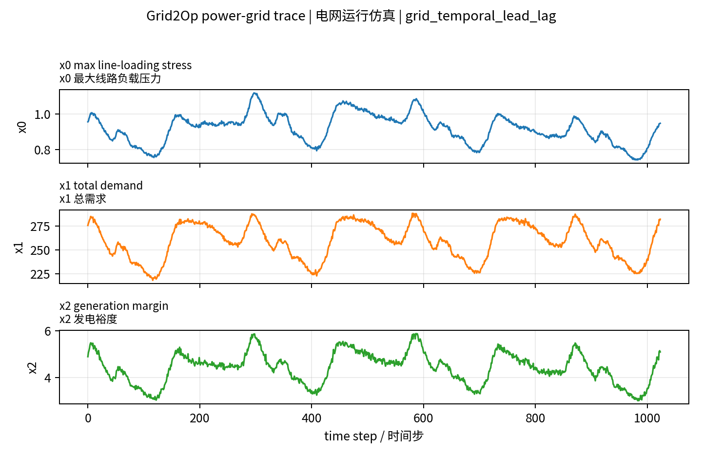

**样本 ID:** `multisim_qcc_v5_aiops_v3::grid2op::grid2op_broad::rte_case14_realistic_chronic4_trace_2048_nooverflow::w512_1536::grid_temporal_lead_lag`  
**任务:** `grid_temporal_lead_lag`  
**窗口长度:** `1024` steps，变量数 `3`  
**变量语义:** x0 最大线路负载压力, x1 总需求, x2 发电裕度  
**数据说明:** raw_compact_values 保留电网紧凑变量；values 是按窗口标准化后的模型输入。

**起点 raw 值:** x0=0.9569, x1=275.6, x2=4.892  
**终点 raw 值:** x0=0.9485, x1=282, x2=5.094

**Repaired question:** Background: This is a Grid2Op power-grid window. x0 is maximum line-loading stress over grid lines, x1 is total demand, and x2 is generation margin. A line-loading stress value above 1.0 means overload. Task rule: Lead-lag rule: compare lagged correlation with zero-lag correlation. Positive lag means x0 leads x1; negative lag means x1 leads x0. If the best lagged correlation is not meaningfully stronger than zero lag, answer no clear lead. Specific question: Does total demand x1 tend to lead or lag maximum line-loading stress x0?

**中文背景:** 这是一个 Grid2Op 电网窗口。x0 是跨线路的最大线路负载压力，x1 是总需求，x2 是发电裕度。线路负载压力高于 1.0 表示过载。  
**中文判定规则:** 先后关系规则：比较滞后相关和零滞后相关。正 lag 表示 x0 领先 x1；负 lag 表示 x1 领先 x0。如果最佳滞后相关没有明显强于零滞后相关，就回答没有清晰领先关系。  
**中文具体问题:** 总需求 x1 倾向于领先还是滞后最大线路负载压力 x0？

**Options / 选项:**

- A. x0 leads x1（x0 领先 x1）
- B. x1 leads x0（x1 领先 x0）
- C. no clear lead（没有清晰领先）
- D. unclear relation（关系不清楚）

**Gold answer:** `C`，`no clear lead`

**Oracle evidence:** There is no clear lead between x0 and x1 because the strongest lagged correlation occurs near zero lag (0 steps) with correlation 0.87.  
**中文证据:** x0 和 x1 之间没有清晰领先关系，因为最强滞后相关出现在接近零滞后的位置（0 步），相关系数为 0.87。

**关键 support slots（可验证证据字段）:** `best_lag=0`, `best_lag_corr=0.8733`, `answer_label=no clear lead`, `window_start=512`, `window_end=1536`, `source_horizon=2048`

**Question repair status:** `repaired`

## citylearn：新增 2 道后共 3 道 case study

### 1. CityLearn building-energy trace（建筑能耗仿真）

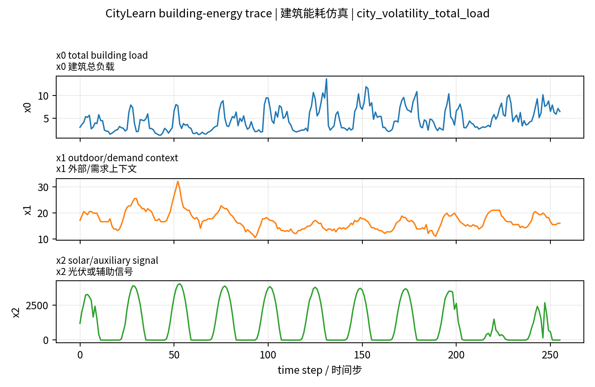

**样本 ID:** `multisim_qcc_v5_aiops_v3::citylearn::citylearn_broad::citylearn_challenge_2022_phase_1_start6144_h2048_b5::w320_576::city_volatility_total_load`  
**任务:** `city_volatility_total_load`  
**窗口长度:** `256` steps，变量数 `3`  
**变量语义:** x0 建筑总负载, x1 外部/需求上下文, x2 光伏或辅助信号  
**数据说明:** raw_compact_values 来自 CityLearn 建筑负载和外部条件；values 是标准化后的模型输入。

**起点 raw 值:** x0=3.008, x1=17.2, x2=1196  
**终点 raw 值:** x0=6.505, x1=16.1, x2=0

**Repaired question:** Background: This is a CityLearn building-energy window. x0 is total building load, x1 is an outdoor/weather support signal, and x2 is solar-generation support. Higher x0 means higher building demand. Task rule: Volatility rule: split the window into first, middle, and final thirds, compute the variability of the named signal in each third, and choose the third with the largest variability. Use similar thirds only when the three variability levels are close. Specific question: Which third of the window has the highest volatility in total building load x0?

**中文背景:** 这是一个 CityLearn 建筑能耗窗口。x0 是建筑总负载，x1 是室外/天气辅助信号，x2 是太阳能发电辅助信号。x0 越高表示建筑需求越高。  
**中文判定规则:** 波动规则：把窗口分成第一段、中间段和最后一段三等份，计算指定信号在每一段里的变动程度，并选择变动最大的那一段。只有三段变动程度接近时才选择三段相近。  
**中文具体问题:** 窗口的哪一个三分之一部分里，建筑总负载 x0 的波动最大？

**Options / 选项:**

- A. early（早期）
- B. middle（中间）
- C. late（后期）
- D. similar thirds（三段相近）

**Gold answer:** `B`，`middle`

**Oracle evidence:** Total building load x0 varies most in the central third of the window.  
**中文证据:** 建筑总负载 x0 在窗口中间三分之一部分波动最大。

**关键 support slots（可验证证据字段）:** `region_stds={'early': 1.8526527548893716, 'middle': 2.828890702869633, 'late': 2.2918834862551143}`, `answer_label=middle`, `window_start=320`, `window_end=576`, `trace_bucket_group=citylearn_challenge_2022_phase_1_start6144_h2048_b5::bucket01`

**Question repair status:** `repaired`

### 2. CityLearn building-energy trace（建筑能耗仿真）

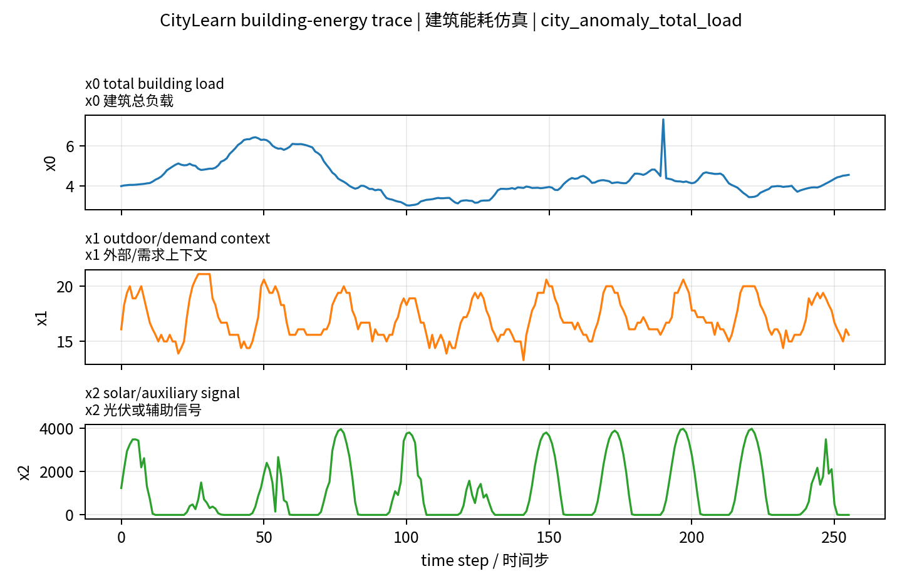

**样本 ID:** `multisim_qcc_v5_aiops_v3::citylearn::citylearn_broad::citylearn_challenge_2022_phase_1_start6144_h2048_b5::w512_768::city_anomaly_total_load`  
**任务:** `city_anomaly_total_load`  
**窗口长度:** `256` steps，变量数 `3`  
**变量语义:** x0 建筑总负载, x1 外部/需求上下文, x2 光伏或辅助信号  
**数据说明:** raw_compact_values 来自 CityLearn 建筑负载和外部条件；values 是标准化后的模型输入。

**起点 raw 值:** x0=3.981, x1=16.1, x2=1240  
**终点 raw 值:** x0=4.548, x1=15.6, x2=0

**Repaired question:** Background: This is a CityLearn building-energy window. x0 is total building load, x1 is an outdoor/weather support signal, and x2 is solar-generation support. Higher x0 means higher building demand. Task rule: Anomaly rule: look for the strongest isolated simulator event or spike in the named signal. Report whether it is in the first, middle, or final third, or say no pronounced event if no isolated event dominates. Specific question: When does the strongest isolated spike in total building load x0 occur?

**中文背景:** 这是一个 CityLearn 建筑能耗窗口。x0 是建筑总负载，x1 是室外/天气辅助信号，x2 是太阳能发电辅助信号。x0 越高表示建筑需求越高。  
**中文判定规则:** 异常规则：寻找指定信号中最强的孤立仿真事件或尖峰。报告它出现在第一段、中间段还是最后一段；如果没有占主导的孤立事件，就回答没有明显事件。  
**中文具体问题:** 建筑总负载 x0 的最强孤立尖峰出现在什么时候？

**Options / 选项:**

- A. early（早期）
- B. middle（中间）
- C. late（后期）
- D. no pronounced spike（没有明显尖峰）

**Gold answer:** `C`，`late`

**Oracle evidence:** The strongest isolated total building load x0 spike is concentrated in the final third of the window.  
**中文证据:** 建筑总负载 x0 的最强孤立尖峰集中在窗口最后三分之一部分。

**关键 support slots（可验证证据字段）:** `event_index=190`, `event_abs_z=3.513`, `horizon=256`, `controlled_anomaly=True`, `injected=True`, `requested_region=late`, `answer_label=late`, `window_start=512`, `window_end=768`, `trace_bucket_group=citylearn_challenge_2022_phase_1_start6144_h2048_b5::bucket02`

**Question repair status:** `repaired`

### 3. CityLearn building-energy trace（建筑能耗仿真）

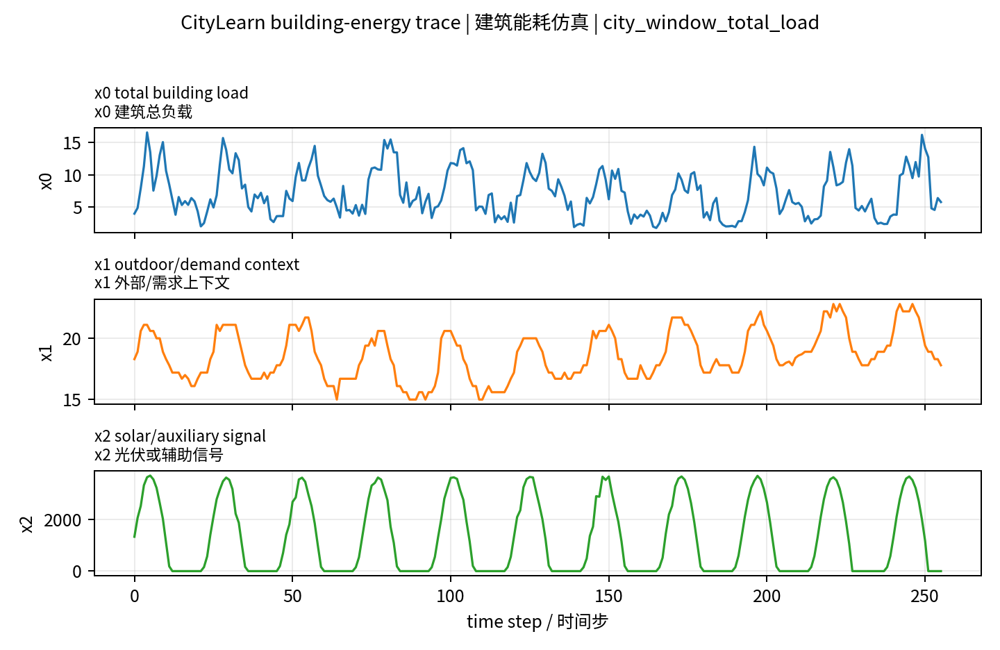

**样本 ID:** `multisim_qcc_v5_aiops_v3::citylearn::citylearn_broad::citylearn_challenge_2022_phase_1_start6144_h2048_b5::w1664_1920::city_window_total_load`  
**任务:** `city_window_total_load`  
**窗口长度:** `256` steps，变量数 `3`  
**变量语义:** x0 建筑总负载, x1 外部/需求上下文, x2 光伏或辅助信号  
**数据说明:** raw_compact_values 来自 CityLearn 建筑负载和外部条件；values 是标准化后的模型输入。

**起点 raw 值:** x0=3.99, x1=18.3, x2=1333  
**终点 raw 值:** x0=5.783, x1=17.8, x2=0

**Repaired question:** Background: This is a CityLearn building-energy window. x0 is total building load, x1 is an outdoor/weather support signal, and x2 is solar-generation support. Higher x0 means higher building demand. Task rule: Window-comparison rule: compare the first-half mean and second-half mean of the named signal. Use similar halves only when the means are close. Specific question: Is total building load x0 higher in the first half or the second half of the window?

**中文背景:** 这是一个 CityLearn 建筑能耗窗口。x0 是建筑总负载，x1 是室外/天气辅助信号，x2 是太阳能发电辅助信号。x0 越高表示建筑需求越高。  
**中文判定规则:** 窗口比较规则：比较指定信号前半段均值和后半段均值。只有两者足够接近时才选择前后两半相近。  
**中文具体问题:** 建筑总负载 x0 在窗口前半段更高，还是后半段更高？

**Options / 选项:**

- A. second half higher（后半段更高）
- B. first half higher（前半段更高）
- C. similar halves（前后两半相近）
- D. cannot determine（无法判断）

**Gold answer:** `B`，`first half higher`

**Oracle evidence:** The average total building load x0 level is higher before the midpoint than after it.  
**中文证据:** 建筑总负载 x0 的平均水平在窗口中点之前高于中点之后。

**关键 support slots（可验证证据字段）:** `first_mean=7.773`, `second_mean=6.645`, `answer_label=first half higher`, `window_start=1664`, `window_end=1920`, `trace_bucket_group=citylearn_challenge_2022_phase_1_start6144_h2048_b5::bucket06`

**Question repair status:** `repaired`

## finrl_scaled：新增 2 道后共 3 道 case study

### 1. FinRL market trace（金融市场时序）

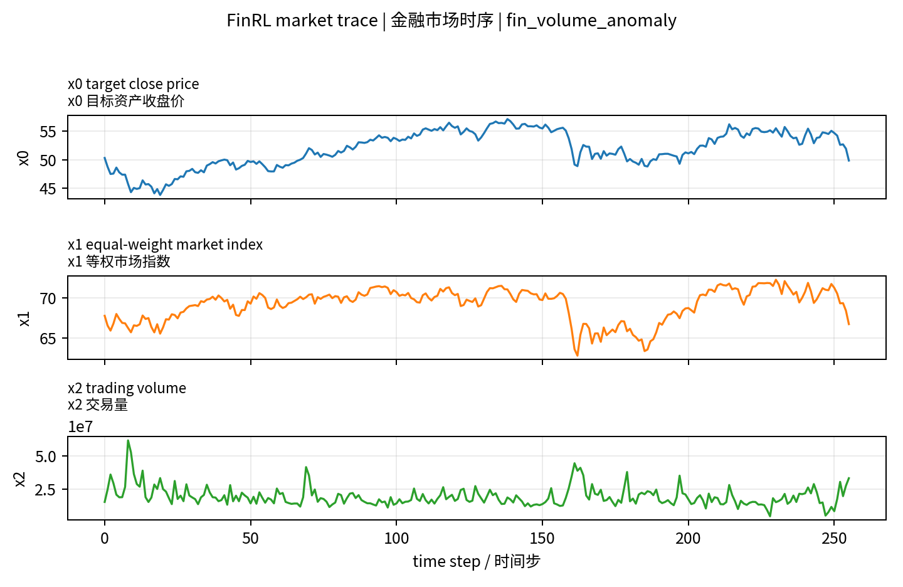

**样本 ID:** `multisim_qcc_v5_aiops_v3::finrl_scaled::finrl_broad::JPM::w0_256::fin_volume_anomaly`  
**任务:** `fin_volume_anomaly`  
**窗口长度:** `256` steps，变量数 `3`  
**变量语义:** x0 目标资产收盘价, x1 等权市场指数, x2 交易量  
**数据说明:** FinRL 使用历史 OHLCV 数据构造，严格说是 market trace，不是因果仿真器。

**起点 raw 值:** x0=50.31, x1=67.74, x2=1.565e+07  
**终点 raw 值:** x0=49.85, x1=66.71, x2=3.337e+07

**Repaired question:** Background: This is a financial-market window for the ticker named in the question. x0 is the target price or return-derived signal, and the task may also use returns, volume, drawdown, or regime evidence. Task rule: Anomaly rule: look for the strongest isolated simulator event or spike in the named signal. Report whether it is in the first, middle, or final third, or say no pronounced event if no isolated event dominates. Specific question: When does the strongest trading-volume spike for JPM occur?

**中文背景:** 这是一个金融市场窗口，股票代码由问题指定。x0 是目标价格或由收益率派生的信号，任务也可能使用收益率、交易量、回撤或市场状态证据。  
**中文判定规则:** 异常规则：寻找指定信号中最强的孤立仿真事件或尖峰。报告它出现在第一段、中间段还是最后一段；如果没有占主导的孤立事件，就回答没有明显事件。  
**中文具体问题:** JPM 最强的交易量尖峰出现在什么时候？

**Options / 选项:**

- A. middle（中间）
- B. early（早期）
- C. late（后期）
- D. no pronounced spike（没有明显尖峰）

**Gold answer:** `B`，`early`

**Oracle evidence:** The strongest trading-volume spike occurs in the early part of the window, at step 8 of 256 with robust z-score 9.00.  
**中文证据:** 最强交易量尖峰出现在窗口早期，即 256 步窗口中的第 8 步，robust z-score 为 9.00。

**关键 support slots（可验证证据字段）:** `event_index=8`, `event_abs_z=8.996`, `horizon=256`, `answer_label=early`, `window_start=0`, `window_end=256`, `date_start=2015-01-02`, `date_end=2016-01-07`

**Question repair status:** `repaired`

### 2. FinRL market trace（金融市场时序）

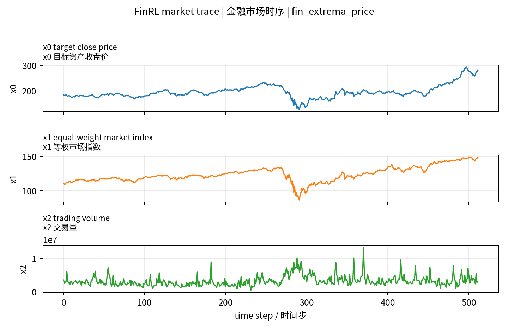

**样本 ID:** `multisim_qcc_v5_aiops_v3::finrl_scaled::finrl_broad::GS::w1022_1534::fin_extrema_price`  
**任务:** `fin_extrema_price`  
**窗口长度:** `512` steps，变量数 `3`  
**变量语义:** x0 目标资产收盘价, x1 等权市场指数, x2 交易量  
**数据说明:** FinRL 使用历史 OHLCV 数据构造，严格说是 market trace，不是因果仿真器。

**起点 raw 值:** x0=183.9, x1=110.6, x2=3.576e+06  
**终点 raw 值:** x0=281.3, x1=148.7, x2=3.128e+06

**Repaired question:** Background: This is a financial-market window for the ticker named in the question. x0 is the target price or return-derived signal, and the task may also use returns, volume, drawdown, or regime evidence. Task rule: Extrema rule: split the window into first, middle, and final thirds, then locate where the named signal reaches the requested highest or lowest point. Specific question: Where in the window does GS target price x0 reach its highest point?

**中文背景:** 这是一个金融市场窗口，股票代码由问题指定。x0 是目标价格或由收益率派生的信号，任务也可能使用收益率、交易量、回撤或市场状态证据。  
**中文判定规则:** 极值规则：把窗口分成第一段、中间段和最后一段三等份，然后定位指定信号在何处达到问题要求的最高点或最低点。  
**中文具体问题:** GS 目标价格 x0 在窗口的什么位置达到最高点？

**Options / 选项:**

- A. late（后期）
- B. early（早期）
- C. middle（中间）
- D. no clear extremum（no clear extremum）

**Gold answer:** `A`，`late`

**Oracle evidence:** Target price x0 reaches its highest point in the late part of the window, at step 497 of 512 with value about 294.79.  
**中文证据:** 目标价格 x0 在窗口后期达到最高点：512 步窗口中的第 497 步，数值约为 294.79。

**关键 support slots（可验证证据字段）:** `extrema_index=497`, `extrema_value=294.8`, `horizon=512`, `answer_label=late`, `window_start=1022`, `window_end=1534`, `date_start=2019-01-25`, `date_end=2021-02-04`

**Question repair status:** `repaired`

### 3. FinRL market trace（金融市场时序）

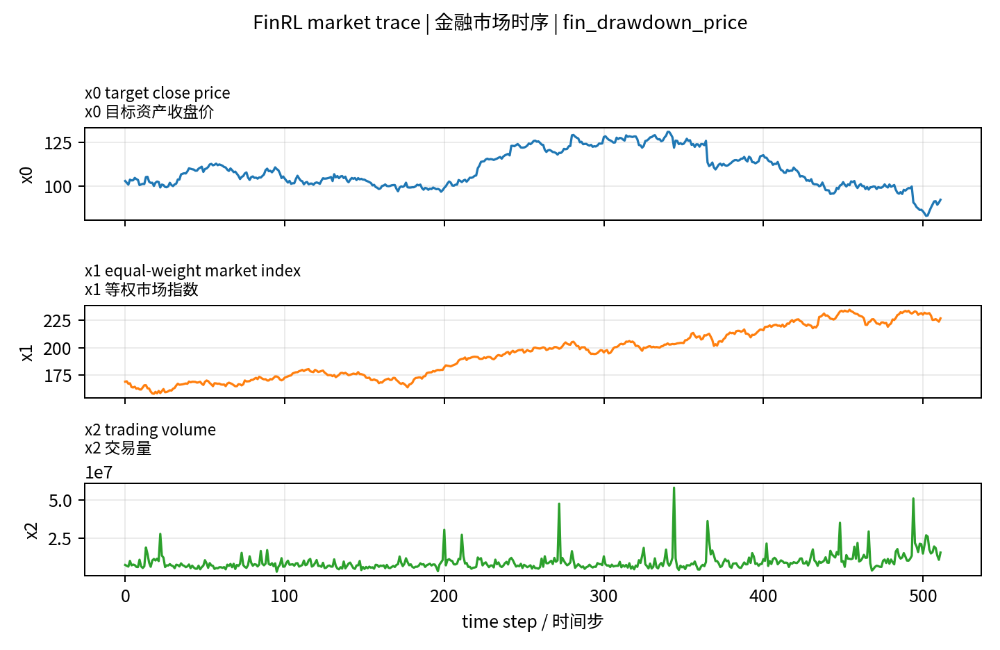

**样本 ID:** `multisim_qcc_v5_aiops_v3::finrl_scaled::finrl_broad::MRK::w2043_2555::fin_drawdown_price`  
**任务:** `fin_drawdown_price`  
**窗口长度:** `512` steps，变量数 `3`  
**变量语义:** x0 目标资产收盘价, x1 等权市场指数, x2 交易量  
**数据说明:** FinRL 使用历史 OHLCV 数据构造，严格说是 market trace，不是因果仿真器。

**起点 raw 值:** x0=103, x1=168.8, x2=7.375e+06  
**终点 raw 值:** x0=92.25, x1=226.9, x2=1.548e+07

**Repaired question:** Background: This is a financial-market window for the ticker named in the question. x0 is the target price or return-derived signal, and the task may also use returns, volume, drawdown, or regime evidence. Task rule: Volatility rule: split the window into first, middle, and final thirds, compute the variability of the named signal in each third, and choose the third with the largest variability. Use similar thirds only when the three variability levels are close. Specific question: What drawdown regime best describes MRK target price x0 in this window?

**中文背景:** 这是一个金融市场窗口，股票代码由问题指定。x0 是目标价格或由收益率派生的信号，任务也可能使用收益率、交易量、回撤或市场状态证据。  
**中文判定规则:** 波动规则：把窗口分成第一段、中间段和最后一段三等份，计算指定信号在每一段里的变动程度，并选择变动最大的那一段。只有三段变动程度接近时才选择三段相近。  
**中文具体问题:** 这个窗口里的 MRK 目标价格 x0 最符合哪种回撤状态？

**Options / 选项:**

- A. moderate drawdown（中等回撤）
- B. mild drawdown（轻微回撤）
- C. severe drawdown（严重回撤）
- D. little drawdown（回撤很小）

**Gold answer:** `C`，`severe drawdown`

**Oracle evidence:** The window shows severe drawdown: the maximum drawdown is about 36.65%, from step 340 to step 502.  
**中文证据:** 这个窗口呈现严重回撤：最大回撤约为 36.65%，从第 340 步到第 502 步。

**关键 support slots（可验证证据字段）:** `max_drawdown=-0.3665`, `drawdown_peak_index=340`, `drawdown_trough_index=502`, `answer_label=severe drawdown`, `window_start=2043`, `window_end=2555`, `date_start=2023-02-14`, `date_end=2025-02-28`

**Question repair status:** `repaired`

## water：新增 2 道后共 3 道 case study

### 1. Water-network trace（供水系统仿真）

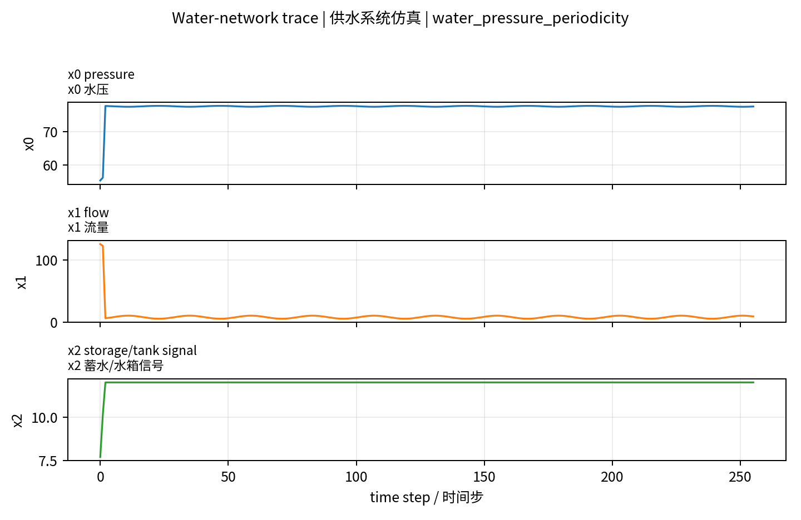

**样本 ID:** `multisim_qcc_v5_aiops_v3::water::water_broad::water_scenario_025::water_pressure_periodicity`  
**任务:** `water_pressure_periodicity`  
**窗口长度:** `256` steps，变量数 `3`  
**变量语义:** x0 水压, x1 流量, x2 蓄水/水箱信号  
**数据说明:** water 当前来源是稳定 dataflow 产物；报告中需区分 official simulator 与 fallback/smoke 场景。

**起点 raw 值:** x0=55.32, x1=125.6, x2=7.7  
**终点 raw 值:** x0=77.69, x1=8.988, x2=12

**Repaired question:** Background: This is a water-network simulation window. x0 is water pressure, x1 is pipe flow, and x2 is tank storage. Low pressure can indicate service risk; unusually high flow can indicate disruption or leak-like stress. Task rule: Periodicity rule: use the strongest autocorrelation peak. If its score is below the predefined weak-cycle threshold, answer no clear cycle. Otherwise classify the peak lag relative to the window length as short, medium, or long. Specific question: What cyclic pattern best describes water pressure x0 in this window?

**中文背景:** 这是一个供水网络仿真窗口。x0 是水压，x1 是管道流量，x2 是水箱蓄水量。低水压可能表示供水服务风险；异常高流量可能表示扰动或类似漏水的压力。  
**中文判定规则:** 周期性规则：使用最强自相关峰。如果它的分数低于预设的弱周期阈值，就回答没有明显周期。否则按峰值 lag 相对窗口长度的位置分类为短周期、中等周期或长周期。  
**中文具体问题:** 这个窗口里的水压 x0 最符合哪种周期模式？

**Options / 选项:**

- A. short cycle（短周期）
- B. medium cycle（中等周期）
- C. long cycle（长周期）
- D. no clear cycle（没有明显周期）

**Gold answer:** `D`，`no clear cycle`

**Oracle evidence:** The dominant cyclic pattern is no clear cycle: the strongest autocorrelation peak is at lag 106 with score 0.132.  
**中文证据:** 主导周期模式是没有明显周期：最强自相关峰在 lag 106，分数只有 0.132。

**关键 support slots（可验证证据字段）:** `best_period=106`, `period_score=0.1322`, `answer_label=no clear cycle`, `window_start=0`, `window_end=256`, `event_index=122`, `event_label=middle`

**Question repair status:** `repaired`

### 2. Water-network trace（供水系统仿真）

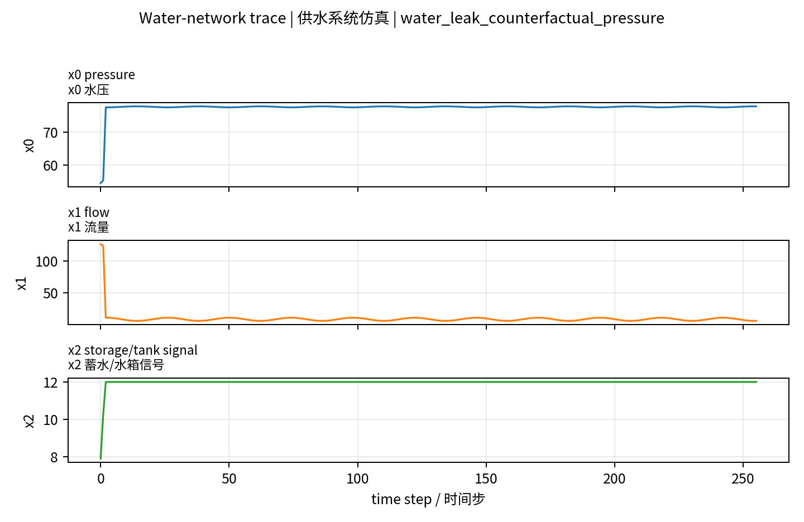

**样本 ID:** `multisim_qcc_v5_aiops_v3::water::water_broad::water_scenario_005::water_leak_counterfactual_pressure`  
**任务:** `water_leak_counterfactual_pressure`  
**窗口长度:** `256` steps，变量数 `3`  
**变量语义:** x0 水压, x1 流量, x2 蓄水/水箱信号  
**数据说明:** water 当前来源是稳定 dataflow 产物；报告中需区分 official simulator 与 fallback/smoke 场景。

**起点 raw 值:** x0=54.44, x1=126.6, x2=7.9  
**终点 raw 值:** x0=77.83, x1=6.441, x2=12

**Repaired question:** Background: This is a water-network simulation window. x0 is water pressure, x1 is pipe flow, and x2 is tank storage. Low pressure can indicate service risk; unusually high flow can indicate disruption or leak-like stress. Task rule: Counterfactual rule: compare the factual simulator trace with the matched baseline or intervention trace for the named quantity. Use the direction and size of the mean difference to decide lower, higher, no material change, or mixed effect. Specific question: Compared with the matched no-leak baseline, how does the leak scenario change mean pressure?

**中文背景:** 这是一个供水网络仿真窗口。x0 是水压，x1 是管道流量，x2 是水箱蓄水量。低水压可能表示供水服务风险；异常高流量可能表示扰动或类似漏水的压力。  
**中文判定规则:** 反事实规则：比较事实仿真轨迹与匹配的基线或干预轨迹中指定量的差异。根据均值差异的方向和大小，判断为更低、更高、没有实质变化或混合影响。  
**中文具体问题:** 与匹配的无漏水基线相比，漏水场景如何改变平均水压？

**Options / 选项:**

- A. lower pressure under leak（漏水下水压更低）
- B. higher pressure under leak（漏水下水压更高）
- C. no material pressure change（没有实质水压变化）
- D. mixed effect（混合影响）

**Gold answer:** `C`，`no material pressure change`

**Oracle evidence:** The matched simulator comparison shows no material pressure change: factual mean is 77.51 versus matched baseline mean 77.51.  
**中文证据:** 匹配仿真器对比显示没有实质水压变化：事实均值为 77.51，匹配基线均值为 77.51。

**关键 support slots（可验证证据字段）:** `factual_mean=77.51`, `counterfactual_mean=77.51`, `delta=0`, `counterfactual_var=0`, `answer_label=no material pressure change`, `window_start=0`, `window_end=256`, `event_index=129`, `event_label=middle`

**Question repair status:** `repaired`

### 3. Water-network trace（供水系统仿真）

**样本 ID:** `multisim_qcc_v5_aiops_v3::water::water_broad::water_scenario_000::water_event_recovery_context`  
**任务:** `water_event_recovery_context`  
**窗口长度:** `256` steps，变量数 `3`  
**变量语义:** x0 水压, x1 流量, x2 蓄水/水箱信号  
**数据说明:** water 当前来源是稳定 dataflow 产物；报告中需区分 official simulator 与 fallback/smoke 场景。

**起点 raw 值:** x0=52.91, x1=124.2, x2=7.5  
**终点 raw 值:** x0=74.87, x1=5.651, x2=12

**Repaired question:** Background: This is a water-network simulation window. x0 is water pressure, x1 is pipe flow, and x2 is tank storage. Low pressure can indicate service risk; unusually high flow can indicate disruption or leak-like stress. Task rule: Event-recovery rule: compare pre-event, event-window, and post-event means of the primary stress signal. Recovery means post-event moves back toward pre-event; persistent stress stays displaced; overshoot moves past the pre-event level. Specific question: After the event window, does the primary stress signal recover, persist, or overshoot?

**中文背景:** 这是一个供水网络仿真窗口。x0 是水压，x1 是管道流量，x2 是水箱蓄水量。低水压可能表示供水服务风险；异常高流量可能表示扰动或类似漏水的压力。  
**中文判定规则:** 事件恢复规则：比较主压力信号在事件前、事件窗口中和事件后的均值。恢复表示事件后回到事件前水平；持续压力表示仍然偏离；过冲表示越过事件前水平。  
**中文具体问题:** 事件窗口之后，主要压力信号是恢复、持续异常，还是过冲？

**Options / 选项:**

- A. pressure recovers（水压恢复）
- B. pressure overshoot（水压过冲）
- C. persistent pressure stress（持续水压压力）
- D. no event recovery（没有事件恢复）

**Gold answer:** `B`，`pressure overshoot`

**Oracle evidence:** The post-event evidence is pressure overshoot: pre-event mean x0 is 74.77, event mean is 74.75, and post-event mean is 74.83.  
**中文证据:** 事件后证据显示水压过冲：事件前 x0 均值为 74.77，事件中均值为 74.75，事件后均值为 74.83。

**关键 support slots（可验证证据字段）:** `pre_mean=74.77`, `event_mean=74.75`, `post_mean=74.83`, `answer_label=pressure overshoot`, `window_start=0`, `window_end=256`, `event_index=43`, `event_label=early`

**Question repair status:** `repaired`

## traffic：新增 2 道后共 3 道 case study

### 1. Traffic-system trace（交通系统仿真）

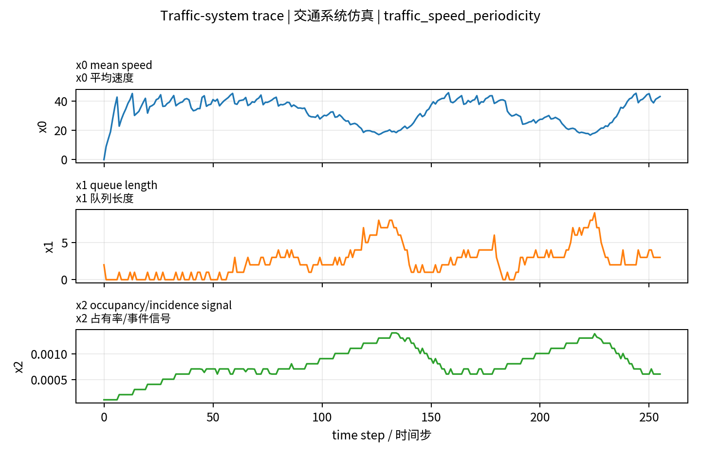

**样本 ID:** `multisim_qcc_v5_aiops_v3::traffic::traffic_broad::traffic_scenario_011::traffic_speed_periodicity`  
**任务:** `traffic_speed_periodicity`  
**窗口长度:** `256` steps，变量数 `3`  
**变量语义:** x0 平均速度, x1 队列长度, x2 占有率/事件信号  
**数据说明:** traffic 当前来源是稳定 dataflow 产物；可表达周期、拥堵、事故、信号反事实等任务。

**起点 raw 值:** x0=0, x1=2, x2=0.0001008  
**终点 raw 值:** x0=43.02, x1=3, x2=0.0006048

**Repaired question:** Background: This is a traffic simulation window. x0 is mean traffic speed, x1 is queue length, and x2 is lane occupancy. Lower speed and higher queue or occupancy indicate congestion. Task rule: Periodicity rule: use the strongest autocorrelation peak. If its score is below the predefined weak-cycle threshold, answer no clear cycle. Otherwise classify the peak lag relative to the window length as short, medium, or long. Specific question: What cyclic pattern best describes mean speed x0 in this window?

**中文背景:** 这是一个交通仿真窗口。x0 是平均车速，x1 是队列长度，x2 是车道占有率。更低车速以及更高队列或占有率表示拥堵。  
**中文判定规则:** 周期性规则：使用最强自相关峰。如果它的分数低于预设的弱周期阈值，就回答没有明显周期。否则按峰值 lag 相对窗口长度的位置分类为短周期、中等周期或长周期。  
**中文具体问题:** 这个窗口里的平均速度 x0 最符合哪种周期模式？

**Options / 选项:**

- A. medium cycle（中等周期）
- B. long cycle（长周期）
- C. no clear cycle（没有明显周期）
- D. short cycle（短周期）

**Gold answer:** `D`，`short cycle`

**Oracle evidence:** The dominant cyclic pattern is short cycle: the strongest autocorrelation peak is at lag 7 with score 0.784.  
**中文证据:** 主导周期模式是短周期：最强自相关峰在 lag 7，分数为 0.784。

**关键 support slots（可验证证据字段）:** `best_period=7`, `period_score=0.784`, `answer_label=short cycle`, `window_start=0`, `window_end=256`, `event_index=None`, `event_label=no pronounced incident`

**Question repair status:** `repaired`

### 2. Traffic-system trace（交通系统仿真）

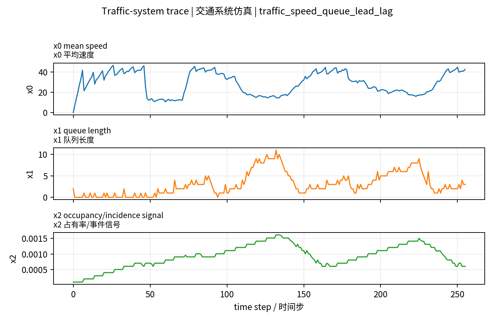

**样本 ID:** `multisim_qcc_v5_aiops_v3::traffic::traffic_broad::traffic_scenario_020::traffic_speed_queue_lead_lag`  
**任务:** `traffic_speed_queue_lead_lag`  
**窗口长度:** `256` steps，变量数 `3`  
**变量语义:** x0 平均速度, x1 队列长度, x2 占有率/事件信号  
**数据说明:** traffic 当前来源是稳定 dataflow 产物；可表达周期、拥堵、事故、信号反事实等任务。

**起点 raw 值:** x0=0, x1=2, x2=0.0001008  
**终点 raw 值:** x0=42.46, x1=3, x2=0.0006048

**Repaired question:** Background: This is a traffic simulation window. x0 is mean traffic speed, x1 is queue length, and x2 is lane occupancy. Lower speed and higher queue or occupancy indicate congestion. Task rule: Lead-lag rule: compare lagged correlation with zero-lag correlation. Positive lag means x0 leads x1; negative lag means x1 leads x0. If the best lagged correlation is not meaningfully stronger than zero lag, answer no clear lead. Specific question: Does speed movement lead queue movement, lag it, or show no clear relation?

**中文背景:** 这是一个交通仿真窗口。x0 是平均车速，x1 是队列长度，x2 是车道占有率。更低车速以及更高队列或占有率表示拥堵。  
**中文判定规则:** 先后关系规则：比较滞后相关和零滞后相关。正 lag 表示 x0 领先 x1；负 lag 表示 x1 领先 x0。如果最佳滞后相关没有明显强于零滞后相关，就回答没有清晰领先关系。  
**中文具体问题:** 速度变化是领先队列变化、滞后队列变化，还是没有清晰关系？

**Options / 选项:**

- A. speed leads queue（速度领先队列）
- B. queue leads speed（队列领先速度）
- C. unclear relation（关系不清楚）
- D. no clear lead（没有清晰领先）

**Gold answer:** `D`，`no clear lead`

**Oracle evidence:** The temporal relation is no clear lead: strongest lagged absolute correlation is -0.462 at lag -3, compared with zero-lag correlation -0.444.  
**中文证据:** 时间关系是没有清晰领先：最强滞后绝对相关为 lag -3 处的 -0.462，而零滞后相关为 -0.444。

**关键 support slots（可验证证据字段）:** `best_lag=-3`, `best_lag_corr=-0.4625`, `zero_lag_corr=-0.4437`, `answer_label=no clear lead`, `window_start=0`, `window_end=256`, `event_index=47`, `event_label=early`

**Question repair status:** `repaired`

### 3. Traffic-system trace（交通系统仿真）

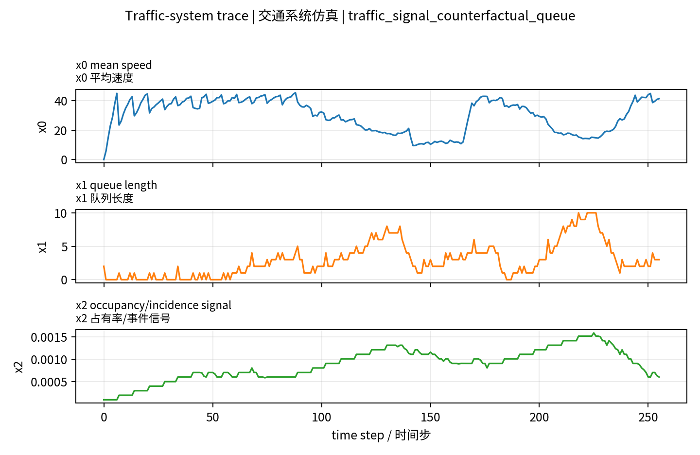

**样本 ID:** `multisim_qcc_v5_aiops_v3::traffic::traffic_broad::traffic_scenario_025::traffic_signal_counterfactual_queue`  
**任务:** `traffic_signal_counterfactual_queue`  
**窗口长度:** `256` steps，变量数 `3`  
**变量语义:** x0 平均速度, x1 队列长度, x2 占有率/事件信号  
**数据说明:** traffic 当前来源是稳定 dataflow 产物；可表达周期、拥堵、事故、信号反事实等任务。

**起点 raw 值:** x0=0, x1=2, x2=0.0001008  
**终点 raw 值:** x0=41.41, x1=3, x2=0.0006048

**Repaired question:** Background: This is a traffic simulation window. x0 is mean traffic speed, x1 is queue length, and x2 is lane occupancy. Lower speed and higher queue or occupancy indicate congestion. Task rule: Counterfactual rule: compare the factual simulator trace with the matched baseline or intervention trace for the named quantity. Use the direction and size of the mean difference to decide lower, higher, no material change, or mixed effect. Specific question: Compared with the matched fixed-signal baseline, how does the traffic-control scenario change mean queue length?

**中文背景:** 这是一个交通仿真窗口。x0 是平均车速，x1 是队列长度，x2 是车道占有率。更低车速以及更高队列或占有率表示拥堵。  
**中文判定规则:** 反事实规则：比较事实仿真轨迹与匹配的基线或干预轨迹中指定量的差异。根据均值差异的方向和大小，判断为更低、更高、没有实质变化或混合影响。  
**中文具体问题:** 与匹配的固定信号基线相比，交通控制场景如何改变平均队列长度？

**Options / 选项:**

- A. lower queue under adaptive signal（自适应信号下队列更低）
- B. no material queue change（没有实质队列变化）
- C. mixed effect（混合影响）
- D. higher queue under adaptive signal（自适应信号下队列更高）

**Gold answer:** `D`，`higher queue under adaptive signal`

**Oracle evidence:** The matched simulator comparison shows higher queue under adaptive signal: factual mean is 2.91 versus matched baseline mean 2.56.  
**中文证据:** 匹配仿真器对比显示自适应信号下队列更高：事实均值为 2.91，匹配基线均值为 2.56。

**关键 support slots（可验证证据字段）:** `factual_mean=2.91`, `counterfactual_mean=2.559`, `delta=0.3516`, `counterfactual_var=1`, `answer_label=higher queue under adaptive signal`, `window_start=0`, `window_end=256`, `event_index=141`, `event_label=middle`

**Question repair status:** `repaired`

## aiopslab_official_v3：新增 2 道后共 3 道 case study

### 1. AIOpsLab official telemetry（AIOpsLab 官方遥测）

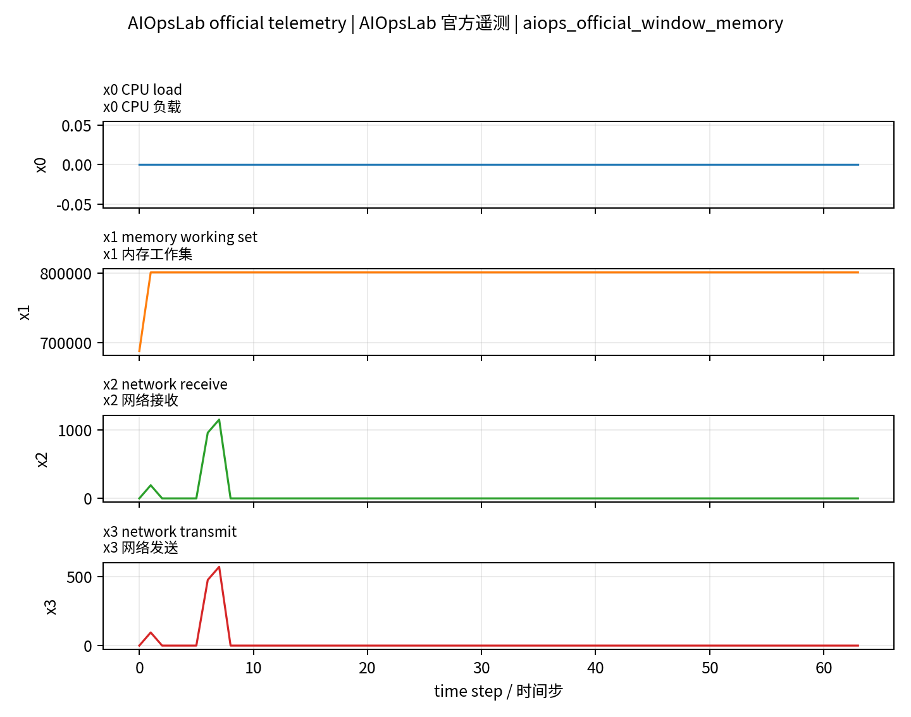

**样本 ID:** `multisim_qcc_v5_aiops_v3::aiopslab_official_v3::aiopslab_official::port_misconfig_seed0_user-service::case000::aiops_official_window_memory`  
**任务:** `aiops_official_window_memory`  
**窗口长度:** `64` steps，变量数 `4`  
**变量语义:** x0 CPU 负载, x1 内存工作集, x2 网络接收, x3 网络发送  
**数据说明:** AIOpsLab v3 来自 Prometheus CSV export；当前 case 数少，是规模瓶颈。

**起点 raw 值:** x0=0, x1=6.881e+05, x2=0, x3=0  
**终点 raw 值:** x0=0, x1=8.012e+05, x2=0, x3=0

**Repaired question:** Background: This is an AIOpsLab microservice telemetry case. Numeric channels usually include service CPU load, memory working set, network receive rate, and network transmit rate. Application, service, fault-family, and provenance questions require official case metadata rather than inference from numeric telemetry alone. Task rule: Window-comparison rule: compare the first-half mean and second-half mean of the named signal. Use similar halves only when the means are close. Specific question: Is memory working set x1 higher in the first half or the second half of the window?

**中文背景:** 这是一个 AIOpsLab 微服务遥测样本。数值通道通常包括服务 CPU 负载、内存工作集、网络接收速率和网络发送速率。应用、服务、故障族和来源问题需要官方 case 元数据，不能只靠数值遥测推断。  
**中文判定规则:** 窗口比较规则：比较指定信号前半段均值和后半段均值。只有两者足够接近时才选择前后两半相近。  
**中文具体问题:** 内存工作集 x1 在窗口前半段更高，还是后半段更高？

**Options / 选项:**

- A. similar halves（前后两半相近）
- B. first half higher（前半段更高）
- C. second half higher（后半段更高）
- D. cannot determine（无法判断）

**Gold answer:** `A`，`similar halves`

**Oracle evidence:** The half-window comparison is similar halves: first-half mean x1 is 797644.80 and second-half mean x1 is 801177.60.  
**中文证据:** 半窗口比较结果是前后两半相近：x1 前半段均值为 797644.80，后半段均值为 801177.60。

**关键 support slots（可验证证据字段）:** `first_mean=7.976e+05`, `second_mean=8.012e+05`, `answer_label=similar halves`, `window_start=0`, `window_end=64`

**Question repair status:** `repaired`

### 2. AIOpsLab official telemetry（AIOpsLab 官方遥测）

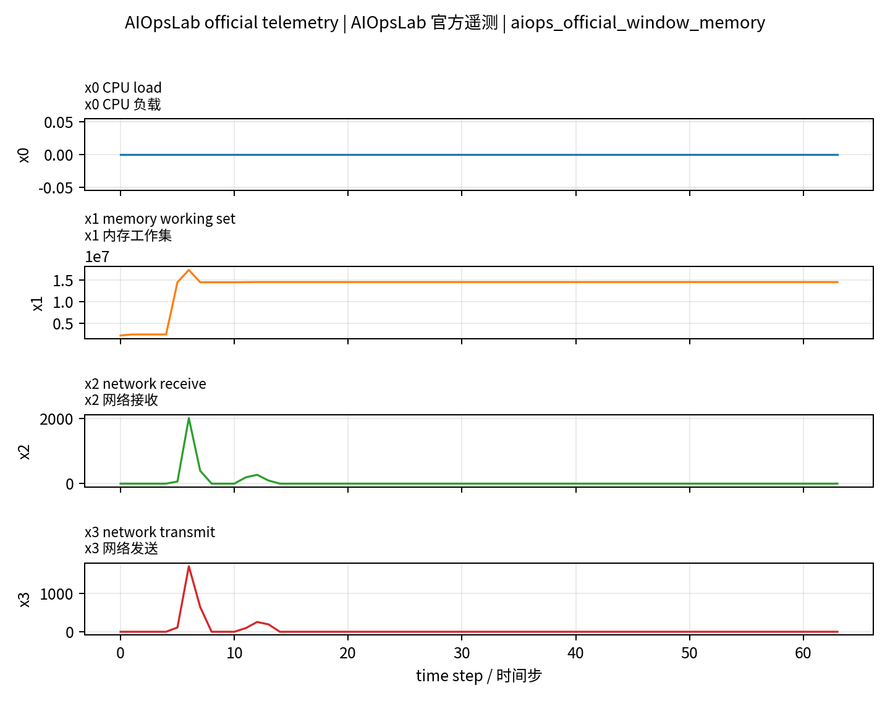

**样本 ID:** `multisim_qcc_v5_aiops_v3::aiopslab_official_v3::aiopslab_official::scale_pod_zero_seed0_user-service::case005::aiops_official_window_memory`  
**任务:** `aiops_official_window_memory`  
**窗口长度:** `64` steps，变量数 `4`  
**变量语义:** x0 CPU 负载, x1 内存工作集, x2 网络接收, x3 网络发送  
**数据说明:** AIOpsLab v3 来自 Prometheus CSV export；当前 case 数少，是规模瓶颈。

**起点 raw 值:** x0=0, x1=2.263e+06, x2=0, x3=0  
**终点 raw 值:** x0=0, x1=1.453e+07, x2=0, x3=0

**Repaired question:** Background: This is an AIOpsLab microservice telemetry case. Numeric channels usually include service CPU load, memory working set, network receive rate, and network transmit rate. Application, service, fault-family, and provenance questions require official case metadata rather than inference from numeric telemetry alone. Task rule: Window-comparison rule: compare the first-half mean and second-half mean of the named signal. Use similar halves only when the means are close. Specific question: Is memory working set x1 higher in the first half or the second half of the window?

**中文背景:** 这是一个 AIOpsLab 微服务遥测样本。数值通道通常包括服务 CPU 负载、内存工作集、网络接收速率和网络发送速率。应用、服务、故障族和来源问题需要官方 case 元数据，不能只靠数值遥测推断。  
**中文判定规则:** 窗口比较规则：比较指定信号前半段均值和后半段均值。只有两者足够接近时才选择前后两半相近。  
**中文具体问题:** 内存工作集 x1 在窗口前半段更高，还是后半段更高？

**Options / 选项:**

- A. first half higher（前半段更高）
- B. second half higher（后半段更高）
- C. similar halves（前后两半相近）
- D. cannot determine（无法判断）

**Gold answer:** `B`，`second half higher`

**Oracle evidence:** The half-window comparison is second half higher: first-half mean x1 is 12725660.44 and second-half mean x1 is 14534246.40.  
**中文证据:** 半窗口比较结果是后半段更高：x1 前半段均值为 12725660.44，后半段均值为 14534246.40。

**关键 support slots（可验证证据字段）:** `first_mean=1.273e+07`, `second_mean=1.453e+07`, `answer_label=second half higher`, `window_start=0`, `window_end=64`

**Question repair status:** `repaired`

### 3. AIOpsLab official telemetry（AIOpsLab 官方遥测）

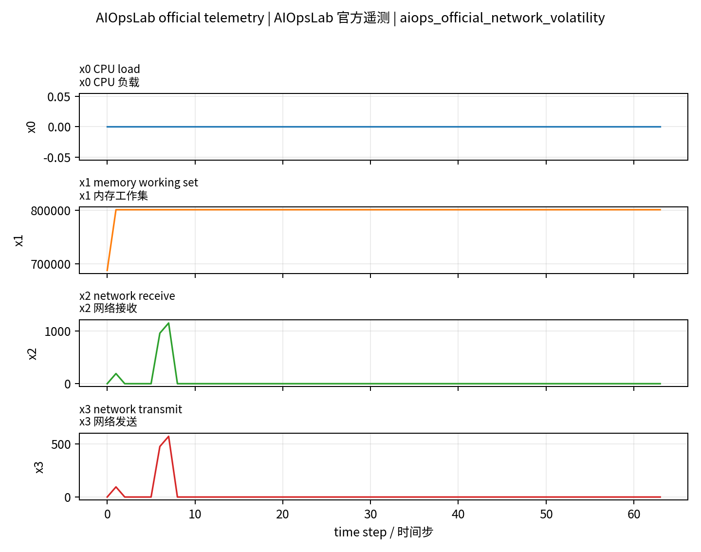

**样本 ID:** `multisim_qcc_v5_aiops_v3::aiopslab_official_v3::aiopslab_official::port_misconfig_seed0_user-service::case000::aiops_official_network_volatility`  
**任务:** `aiops_official_network_volatility`  
**窗口长度:** `64` steps，变量数 `4`  
**变量语义:** x0 CPU 负载, x1 内存工作集, x2 网络接收, x3 网络发送  
**数据说明:** AIOpsLab v3 来自 Prometheus CSV export；当前 case 数少，是规模瓶颈。

**起点 raw 值:** x0=0, x1=6.881e+05, x2=0, x3=0  
**终点 raw 值:** x0=0, x1=8.012e+05, x2=0, x3=0

**Repaired question:** Background: This is an AIOpsLab microservice telemetry case. Numeric channels usually include service CPU load, memory working set, network receive rate, and network transmit rate. Application, service, fault-family, and provenance questions require official case metadata rather than inference from numeric telemetry alone. Task rule: Volatility rule: split the window into first, middle, and final thirds, compute the variability of the named signal in each third, and choose the third with the largest variability. Use similar thirds only when the three variability levels are close. Specific question: Which third of the window has the highest volatility in network receive rate x2?

**中文背景:** 这是一个 AIOpsLab 微服务遥测样本。数值通道通常包括服务 CPU 负载、内存工作集、网络接收速率和网络发送速率。应用、服务、故障族和来源问题需要官方 case 元数据，不能只靠数值遥测推断。  
**中文判定规则:** 波动规则：把窗口分成第一段、中间段和最后一段三等份，计算指定信号在每一段里的变动程度，并选择变动最大的那一段。只有三段变动程度接近时才选择三段相近。  
**中文具体问题:** 窗口哪一个三分之一部分里，网络接收速率 x2 的波动最大？

**Options / 选项:**

- A. middle（中间）
- B. late（后期）
- C. similar thirds（三段相近）
- D. early（早期）

**Gold answer:** `D`，`early`

**Oracle evidence:** Network receive rate x2 has volatility labeled early: early, middle, and late standard deviations are 305.62, 0.00, and 0.00.  
**中文证据:** 网络接收速率 x2 的波动标签是早期：早期、中期、后期标准差分别为 305.62、0.00 和 0.00。

**关键 support slots（可验证证据字段）:** `region_stds={'early': 305.62436094002715, 'middle': 0.0, 'late': 0.0}`, `answer_label=early`, `window_start=0`, `window_end=64`

**Question repair status:** `repaired`

## 4. 数据源特质总结

| 数据源 | 合成数据特质 | 优点 | 遗留问题 |
| --- | --- | --- | --- |
| Grid2Op | 长窗口、多变量、电网状态和反事实干预 | 真实 simulator 语义强，counterfactual 清楚 | 当前模型容易学标签模板，CF label collapse 曾出现 |
| CityLearn | 建筑负载、天气/光伏/需求上下文 | 窗口比较和波动任务稳定 | 与其他 building simulator 有领域重叠 |
| FinRL | 历史市场价格/指数/交易量 | 规模最容易扩大，任务多样 | 不是因果 simulator，不能证明 intervention 泛化 |
| water | 压力/流量/储水信号，事件恢复和泄漏 | 适合反事实和基础设施 reasoning | 当前 smoke 数据规模小，需明确 official/fallback |
| traffic | 速度/排队/占有率/信号事件 | 周期性、lead-lag、干预效果直观 | 当前场景较少，需更多路网和控制策略 |
| AIOpsLab official | Prometheus CPU/内存/网络遥测 + 故障元数据 | 最贴近真实运维异常和 agent 场景 | official case 只有 60 rows，是主要规模瓶颈 |

## 5. 对模型训练的启示

这些数据源足够说明“多 simulator 数据流可以打通”，但还不足以说明模型已经学会泛化。原因是：

1. 不同 simulator 的变量语义差别很大。
2. 不同 task family 需要完全不同的算子，例如均值比较、相关系数、自相关、异常定位、反事实差异、metadata lookup。
3. 目前模型诊断显示 actual time series 不优于 zeroed/permuted time series，说明模型还没有稳定使用时序证据。
4. 下一步数据生成不应只追求更多行，而应为每条样本显式保存 operator slots，例如 `corr_x1/corr_x2`、`region_stds`、`robust_z`、`period_score`、`first_mean/second_mean`。

## 6. 建议的下一步数据生成路线

1. 固定一个 `balanced high-quality v6`：每个成熟 source 约 500 条，AIOpsLab 暂时 60 条，全部带显式 operator slots。
2. 对 water/traffic 增加更多 scenario seed 和事件参数，让它们从 504 提到 1500-3000 条。
3. AIOpsLab 单独作为 official case collection 项目推进，优先提升成功 case 数，而不是用 fallback 冒充 official。
4. 每个 task family 做最小计数门槛，例如每个 source 每类任务至少 50 条，避免模型只学常见任务。
5. 生成训练数据时同时生成 diagnostic controls：actual、zeroed、permuted、oracle-slot verbalization，用于判断模型是否真的看时序。
