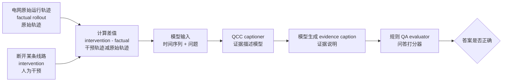
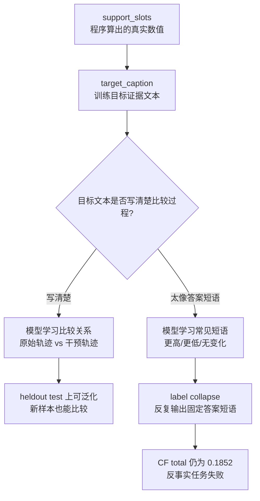

# Case Study: Grid2Op 反事实 QCC 失败机制

时间范围：2026-05-16 至 2026-05-17  
项目方向：General QCC（通用问题条件证据描述）, question-conditioned evidence captioning（根据问题生成证据说明）for medium-horizon TS-QA（中等预测窗口时间序列问答）
当前状态：`not_converged`（尚未收敛）, selected recipe: `None`（尚未选出最终方案）
核心问题：Grid2Op（电网仿真环境）上的 QCC（问题条件证据描述）模型已经能在部分 non-CF（非反事实）和 lead-lag（领先-滞后关系）任务上学习到可用模式，但 counterfactual（反事实）任务仍然出现系统性 label collapse（标签坍缩）。最近两天的实验说明，问题不能简化为“反事实样本数不够”或“某个 architecture（模型结构）不够强”，更像是 CF target evidence（反事实目标证据文本）本身没有迫使模型学习 factual-vs-intervention comparison（原始轨迹与干预轨迹的比较）。

关联 artifact（本地研究文件）：

- Tracker（实验追踪表）: `.research/general-qcc-captioner-20260515/ARCHITECTURE_SEARCH_TRACKER_20260515.md`
- Corrected gate summary（修正版实验门槛汇总）: `.research/general-qcc-captioner-20260515/grid2op_architecture_gate_summary_corrected_20260516/architecture_gate_summary.md`
- v9 failure analysis（v9 失败分析）: `.research/failure-analysis-grid2op-v9-20260517.md`
- AS-043 launch（AS-043 启动记录）: `.research/general-qcc-captioner-20260515/AS043_CF_UNIQUE_CAPPED_LAUNCH_20260517.md`
- AS-043 result（AS-043 结果记录）: `.research/general-qcc-captioner-20260515/AS043_CF_UNIQUE_CAPPED_RESULT_20260517.md`
- AS-043 summary（AS-043 汇总）: `.research/general-qcc-captioner-20260515/grid2op_architecture_gate_summary_as043_20260517/as043_summary.md`

## 先看图：模型到底被要求做什么

这件事可以先不用想成复杂的深度学习问题。我们给模型一段电网运行轨迹，再问它一个问题。模型不应该直接猜答案，而应该先写一句“证据说明”。后面的规则 QA（问答打分器）只读这句证据说明，看能不能推出正确选项。



我们希望模型写的是“证据”，比如：

> 原始轨迹中过载比例是 0，干预后过载比例是 1，所以干预让过载暴露增加。

但现在模型常写成“答案短语”，比如：

> 干预后过载暴露更低。

后一种句子看起来像答案，但没有解释原始轨迹和干预轨迹分别是多少。更严重的是，它可能完全说反。

## 一个真实数据样例长什么样

下面是 AS-043（第 43 轮架构搜索诊断）中一个真实 heldout test（留出测试集）样本的简化版。字段名保持英文，因为它们来自 JSONL 数据文件；括号里给中文解释。

```json
{
  "id": "grid2op_broad_cf::h2048_c-1_t512_line3::post833_961::grid_counterfactual_overload_exposure",
  "task_family": "grid_counterfactual_overload_exposure",
  "question": "After disconnecting line 3 ... does the intervention increase ... overload threshold x0 > 1?",
  "options": [
    "A. greater overload exposure",
    "B. lower overload exposure",
    "C. similar overload exposure",
    "D. cannot determine"
  ],
  "answer_label": "greater overload exposure",
  "answer": "A",
  "target_caption": "The intervention creates greater overload exposure than the factual rollout.",
  "support_slots": {
    "factual_overload_exposure": 0,
    "intervention_overload_exposure": 1,
    "exposure_diff": 1,
    "line_id": 3,
    "intervention_step": 512,
    "segment_start": 833,
    "segment_end": 961
  }
}
```

通俗解释：

- 问题：断开第 3 条线路以后，过载暴露有没有增加？
- `factual_overload_exposure: 0`：原始运行中，过载比例是 0。
- `intervention_overload_exposure: 1`：断线干预后，过载比例是 1。
- `exposure_diff: 1`：干预后明显更高。
- 正确答案：`greater overload exposure`（过载暴露更高）。

这个样本本身并不难。只要比较 `0` 和 `1`，就能知道干预让过载暴露增加。问题是，模型实际输出了相反的方向。

字段解释：

| 字段 | 中文含义 | 在这个实验里做什么 |
|---|---|---|
| `id` | 样本编号 | 标记是哪条电网轨迹、哪个时间窗口、哪个任务 |
| `task_family` | 任务类型 | 例如反事实平均压力、反事实过载暴露、反事实峰值压力 |
| `question` | 问题文本 | 下游 QA 要问模型的问题 |
| `options` | 选项 | A/B/C/D 四个候选答案 |
| `answer_label` | 正确答案文字 | 比如 `greater overload exposure`，即“过载暴露更高” |
| `answer` | 正确选项字母 | 比如 `A` |
| `target_caption` | 训练目标证据说明 | 训练时希望模型输出的标准证据文本 |
| `support_slots` | 支撑数值字段 | 程序从轨迹里算出的关键数值，用来验证答案 |

## 三个真实失败样例

这些样例来自 AS-043 的 heldout test（留出测试集）failure matrix（失败矩阵）。它们说明模型不是随机错，而是在每个反事实任务族里反复输出固定短语。

### 样例 1：平均压力几乎没变，但模型说“更高”

| 字段 | 内容 |
|---|---|
| 样本 ID | `grid2op_broad_cf::h512_c-1_t128_line4::post193_321::grid_counterfactual_mean_stress` |
| 任务 | `grid_counterfactual_mean_stress`（电网反事实平均压力） |
| 问题原文 | `How does average post-event maximum line-loading stress x0 change?` |
| 问题翻译 | 干预后，平均最大线路负载压力 `x0` 怎么变化？ |
| 关键数值 | `mean_x0_diff = -0.0027` |
| 正确答案 | `no material change`（无明显变化） |
| 目标证据 | `The intervention does not materially change average maximum line-loading stress x0.` |
| 目标证据翻译 | 干预没有明显改变平均最大线路负载压力 `x0`。 |
| 模型输出 | `The intervention effect is higher after intervention for average maximum line-loading stress x0.` |
| 模型输出翻译 | 模型说：干预后平均最大线路负载压力 `x0` 更高。 |
| 结论 | 错。差值只有 `-0.0027`，接近 0，应该是“无明显变化”，不是“更高”。 |

### 样例 2：过载暴露从 0 变成 1，但模型说“更低”

| 字段 | 内容 |
|---|---|
| 样本 ID | `grid2op_broad_cf::h2048_c-1_t512_line3::post833_961::grid_counterfactual_overload_exposure` |
| 任务 | `grid_counterfactual_overload_exposure`（电网反事实过载暴露） |
| 问题原文 | `does the intervention increase the fraction of post-event steps where maximum line-loading stress exceeds the overload threshold x0 > 1?` |
| 问题翻译 | 干预是否增加了“最大线路负载压力超过阈值 `x0 > 1`”的时间比例？ |
| 关键数值 | `factual_overload_exposure = 0`, `intervention_overload_exposure = 1`, `exposure_diff = 1` |
| 正确答案 | `greater overload exposure`（过载暴露更高） |
| 目标证据 | `The intervention creates greater overload exposure than the factual rollout.` |
| 目标证据翻译 | 相比原始运行，干预造成了更高的过载暴露。 |
| 模型输出 | `The intervention effect is lower overload exposure after the line disconnection.` |
| 模型输出翻译 | 模型说：断线后过载暴露更低。 |
| 结论 | 错。真实数值是从 `0` 到 `1`，方向非常明确，是增加，不是降低。 |

### 样例 3：压力是向上峰值更大，但模型说“向下跌幅更大”

| 字段 | 内容 |
|---|---|
| 样本 ID | `grid2op_broad_cf::h2048_c-1_t512_line3::post1025_1537::grid_counterfactual_peak_stress` |
| 任务 | `grid_counterfactual_peak_stress`（电网反事实峰值压力） |
| 问题原文 | `What is the strongest post-event stress deviation in x0?` |
| 问题翻译 | 干预后 `x0` 最强的压力偏移是什么方向？ |
| 关键数值 | `max_x0_diff = 0.5762`, `min_x0_diff = 0.3451` |
| 正确答案 | `larger upward peak`（向上峰值更大） |
| 目标证据 | `The intervention creates a larger upward peak in post-event maximum line-loading stress x0.` |
| 目标证据翻译 | 干预造成了更大的向上压力峰值。 |
| 模型输出 | `The intervention creates a larger downward dip in post-event maximum line-loading stress x0.` |
| 模型输出翻译 | 模型说：干预造成了更大的向下跌幅。 |
| 结论 | 错。`max_x0_diff` 和 `min_x0_diff` 都是正值，说明偏移方向是向上，不是向下。 |

这三个例子说明了同一件事：模型没有真正比较“原始运行”和“干预后运行”，而是在输出常见答案短语。

## 再看一张图：问题不是“不会说话”，而是“没学会比较”



这张图对应最近两天的核心判断：模型不是完全不能生成文本，它能生成很流畅的英文句子；问题在于这些句子经常只是“答案标签的改写”，不是“可验证的比较证据”。

## 术语表：英文术语和中文含义

后文保留了一些英文术语和代码名，因为它们对应实验脚本、数据字段或 run 名。这里先给中文解释。

| 英文术语 | 中文解释 | 通俗理解 |
|---|---|---|
| QCC, question-conditioned captioning | 问题条件证据描述 | 先看问题，再写能回答这个问题的证据说明 |
| evidence caption | 证据说明文本 | 模型生成的一句话或几句话，用来支撑答案 |
| TS-QA | 时间序列问答 | 给一段时间序列，问它趋势、峰值、变化等问题 |
| Grid2Op | 电网仿真环境 | 用来模拟电网线路、负载、断线等情况 |
| AS-043 | 第 43 轮架构搜索实验 | 本报告重点讨论的 unique-capped 诊断实验 |
| factual rollout | 原始运行轨迹 | 没有人为干预时，系统自然怎么运行 |
| intervention | 干预 | 人为改变系统，比如断开一条线路 |
| counterfactual, CF | 反事实 | 问“如果做了这个干预，会发生什么变化” |
| non-CF | 非反事实 | 不涉及干预对比的普通问题 |
| lead-lag | 领先-滞后关系 | 一个变量变化是否领先另一个变量 |
| label collapse | 标签坍缩 | 模型反复输出同一个答案短语，不看具体样本 |
| target_caption | 训练目标证据文本 | 训练时希望模型学会输出的标准答案说明 |
| oracle evidence caption |  oracle 证据说明 | 用真实规则/程序生成的理想证据说明 |
| support_slots | 支撑字段 | 程序算出来的关键数值，比如差值、峰值、比例 |
| heldout test | 留出测试集 | 训练时没见过、专门用来评估的数据 |
| CE, cross entropy | 交叉熵损失 | 最常见的文本生成训练目标 |
| SCL | 监督对比学习 | 让正确证据和错误证据拉开距离的训练方法 |
| local_gated_qprefix | 局部门控问题前缀结构 | 一种让模型按问题调节时间序列表示的结构 |
| Qwen3-4B frozen path | 冻结 Qwen3-4B 主干的训练路径 | 大语言模型主体基本不动，只训练小模块/适配层 |
| dev/test/dev+test | 开发集/测试集/二者合并 | 分别看模型在不同评估集合上的准确率 |
| non-CF macro | 非反事实任务宏平均准确率 | 普通任务各类准确率平均，不让某一类样本数主导结果 |
| recipe | 最终实验方案 | 最后能写进论文的方法配置 |
| gate | 实验门槛 | 预先定好的通过标准 |
| failure matrix | 失败矩阵 | 按任务类型统计“真实答案 vs 模型预测”的错误表 |

## 结论先行

这两天的主要结论不是“找到了最佳模型”，而是定位到了一个更具体的失败机制：

1. `local_gated_qprefix + CE`（局部门控问题前缀结构 + 交叉熵训练）在 Grid2Op adaptation（电网任务适配训练）上仍是目前最可用的训练路径之一，但不能直接定为最终 recipe（最终方案）。
2. 仅靠调整 CF（反事实）与 non-CF（非反事实）数据比例，不能同时稳定 counterfactual（反事实）、lead-lag（领先-滞后关系）和普通 non-CF 任务。
3. v9 把 CF 每类样本从 8 增加到 12，没有修复 CF，反而把 CF total（反事实总体准确率）拉到 `0.1852`。
4. AS-043 去掉 rare-label replacement（低频标签重复采样）的重复采样后，overall（总体准确率）和 non-CF 有改善，但 CF total 仍是 `0.1852`，说明“重复采样导致 label prior（标签先验）”只解释了一部分现象。
5. 主要问题更可能在 CF evidence caption（反事实证据说明）的目标形式：当前 caption 太接近最终答案短语，模型学到的是 canonical effect phrase（固定效果短语），而不是 factual trace（原始轨迹）和 intervention trace（干预轨迹）的差分比较。
6. 下一轮应该优先做 CF target repair（反事实目标文本修复），而不是继续 ratio tuning（比例调参）、直接上 SCL（监督对比学习）、或者继续 v9 curriculum（课程式继续训练）。

换句话说，当前研究问题出在“反事实证据的语言接口不够可验证、不够比较式”，而不是单纯出在模型容量、训练步数或 CF 样本数量。

<details>
<summary>1. 研究问题是什么</summary>

General QCC（通用问题条件证据描述）的目标不是让模型直接从时间序列里输出答案，而是让模型在给定时间序列窗口和下游问题后，生成一段短的自然语言 evidence caption（证据说明文本）。这段 caption 应该包含回答问题所需的证据，并且能被 verifier（验证器）或 QA evaluator（问答打分器）检查。

在 Grid2Op broad tasks 中，当前任务族大致包括：

- mean stress（平均压力）
- overload exposure（过载暴露）
- peak stress（峰值压力）
- lead-lag（领先-滞后关系）
- counterfactual mean stress（反事实平均压力）
- counterfactual overload exposure（反事实过载暴露）
- counterfactual peak stress（反事实峰值压力）

前几类任务主要考察统计、极值、趋势、滞后关系等。counterfactual（反事实）任务则要求模型理解 intervention（干预）前后的变化，例如干预后压力是否升高、过载暴露是否降低、峰值压力变化方向是什么。

这里的关键难点是：counterfactual evidence caption 不能只是说“更高”或“更低”。它必须表达：

- factual 状态是什么；
- intervention 状态是什么；
- 二者差值或方向关系是什么；
- 这个差异为什么支持某个答案。

最近两天的实验显示，现有 CF caption（反事实证据文本）目标没有足够强地表达这种比较结构。模型容易把某一类问题映射到一个常见答案短语，而不是根据 trace（轨迹）做 factual-vs-intervention comparison（原始轨迹和干预轨迹比较）。

</details>

<details>
<summary>2. 最近两天实际做了什么</summary>

## 2026-05-16: 重新校准架构搜索结果

首先整理并修正了 Grid2Op architecture gate（电网模型结构实验门槛）的对比结果，重点不是看单个 dev/test（开发集/测试集）数字，而是同时看：

- dev/test/dev+test accuracy（开发集/测试集/合并准确率）；
- CF total（反事实总体准确率）；
- lead-lag（领先-滞后任务准确率）；
- non-CF macro（非反事实任务宏平均准确率）；
- empty generation（空输出比例）；
- SCL train margin（监督对比学习训练间隔）和 heldout QA（留出集问答准确率）是否一致。

关键对比：

| Run（实验名） | 数据/训练设置 | dev+test（开发+测试准确率） | CF total（反事实总体准确率） | lead-lag（领先-滞后准确率） | non-CF macro（非反事实宏平均） | 判断 |
|---|---:|---:|---:|---:|---:|---|
| `v6_cf8_ce` | CF 每类 8, CE | `0.4681` | `0.5556` | `0.2308` | `0.4567` | CF 好一些，但 lead-lag 崩 |
| `v8_cf8_noncf256_ce` | CF 每类 8, non-CF 256, CE | `0.5021` | `0.4259` | `0.9615` | `0.5120` | overall（总体）最好，但 CF retention（反事实保持能力）下降 |
| `v6_cf8_scl` | v6 + SCL | `0.4255` | `0.3704` | `0.0385` | `0.4327` | train margin（训练间隔）好，heldout QA（留出问答）变差 |
| `v6_cf8_task_gated_ce` | task-gated architecture（任务门控结构） | `0.4213` | `0.4630` | `0.0385` | `0.4159` | architecture（结构）负结果 |

这个阶段得到的判断是：`local_gated_qprefix + CE`（局部门控问题前缀 + 交叉熵训练）比 task-gated（任务门控）和当前 SCL（监督对比学习）更稳，但 ratio tradeoff（数据比例权衡）仍然没有解决。v8 能把 lead-lag（领先-滞后）拉起来，却不能充分保持 CF（反事实能力）。

## 2026-05-17: v9 failure analysis 和替代 reviewer 路线

v9 的设计是 `cf12_noncf256`，试图在保留 v8 non-CF/lead-lag 能力的同时，通过增加 CF 每类样本数恢复 CF。

结果是负的：

| Run（实验名） | dev（开发集） | test（测试集） | dev+test（合并） | CF total（反事实总体） | lead-lag（领先-滞后） | non-CF macro（非反事实宏平均） | Gate status（门槛状态） |
|---|---:|---:|---:|---:|---:|---:|---|
| `v9_cf12_noncf256_ce` | `0.4596` | `0.4766` | `0.4681` | `0.1852` | `0.9615` | `0.5048` | `cf_not_sample_count` |

原计划需要 GPT-Pro 做正式 failure analysis。由于执行路线卡住，改用替代 reviewer 路线：先由我做一次结构化 review，再把结论写入 `.research/failure-analysis-grid2op-v9-20260517.md`，解除“不能启动后续实验”的 blocker。

替代 review 的主要结论：

- v9 的 CF（反事实）失败不是随机噪声，而是系统性 label collapse（标签坍缩）。
- 增加 CF 样本数没有改善，说明“样本少”不是充分解释。
- 训练集中部分低频 label（标签）通过 replacement（重复抽样）被重复采样，可能制造了 label prior（标签先验）。
- 但更深的问题是 CF target caption（反事实目标证据文本）太像答案标签，缺少明确的 factual/intervention（原始/干预）对比证据。

基于这个 review（评审/复盘），选择 AS-043 作为下一轮诊断，而不是直接启动 AS-034 curriculum（课程式继续训练）或 AS-035 SCL（监督对比学习）。

## 2026-05-17: AS-043 rare-label unique-capped diagnostic

AS-043 的问题设定：

> 如果 v9 的 CF collapse 主要来自 rare-label replacement 重复采样，那么把 CF 每类样本 cap 在 unique source rows 上，应该能明显恢复 CF total。

AS-043 保持 v9 风格的 `non_cf_count=256`（非反事实样本 256）和 requested `cf_per_label=12`（每个反事实标签最多请求 12 个样本），但新增 `--cap_at_unique`（按唯一原始样本数封顶），避免低频 CF label（反事实标签）被重复扩增。

实现改动：

- 修改 `scripts/generate/build_grid2op_adaptation_v6_cf_contrastive.py`
- 新增参数 `--cap_at_unique`
- 默认行为不变，只有 AS-043 显式开启该参数

AS-043 最终结论是负/部分支持：

- overall（总体准确率）和 non-CF macro（非反事实宏平均）改善；
- lead-lag（领先-滞后）维持高；
- 但 CF total（反事实总体准确率）仍是 `0.1852`，没有达到预设 `>=0.35` 的诊断成功线；
- rare-label replacement（低频标签重复采样）只解释了部分 collapse（坍缩），不是主因。

</details>

<details>
<summary>3. 最近两天构造的数据</summary>

## v9: `cf12_noncf256`

用途：测试“增加 CF 每类样本数是否能在 v8 non-CF/lead-lag 配比下恢复 CF”。

核心设置：

- CF requested per label（每个反事实标签请求样本数）: 12
- non-CF count（非反事实样本数）: 256
- 训练目标：Grid2Op adaptation（电网任务适配）, `local_gated_qprefix + CE`（局部门控问题前缀 + 交叉熵）
- 结果：CF total（反事实总体准确率）掉到 `0.1852`

暴露出的问题：

- 部分 rare CF label（低频反事实标签）的 unique source rows（唯一原始样本行）不足，例如 `lower overload exposure`（过载暴露更低）和 `lower after intervention`（干预后更低）。
- replacement sampling（重复抽样）可能让少数 label（标签）被重复出现，形成训练 prior（先验偏好）。
- heldout（留出集）上这些低方向 label 并不一定出现，导致模型在 dev/test（开发/测试集）上输出错误的 canonical label（固定常见标签）。

## AS-034: curriculum stage2 数据，已构造但未训练

路径：

`.research/general-qcc-captioner-20260515/grid2op_curriculum_stage2_v1/grid2op_stage2_from_v9_gridonly_cf108_noncf256`

数据事实：

- total train rows（训练行数）: 364
- grid non-CF rows（电网非反事实样本数）: 256
- grid CF rows（电网反事实样本数）: 108
- schema pass（格式检查通过）
- train/heldout overlap（训练集和留出集重叠）: 0
- answer-like captions（像答案短语的证据文本）: 0

状态：只构造，未训练。

没有启动的原因：v9 failure analysis（失败分析）尚未完成时，直接 curriculum continuation（课程式继续训练）会把错误的 CF target prior（反事实目标文本先验）继续强化。即使训练成功，也难以解释是 curriculum（课程训练）有效还是 target/data bug（目标文本/数据问题）被放大。

## AS-035: matched SCL hard negatives，已构造但未训练

路径：

`.research/general-qcc-captioner-20260515/grid2op_adaptation_v9_ratio/grid2op_adapt_cf12_noncf256/grid2op_adapt_cf12_noncf256_train_evidence_hard_negatives.jsonl`

数据事实：

- records（样本记录数）: 1782
- negatives（负样本数）: 2686
- rows without negatives（没有负样本的行）: 0
- wrong-answer-label negatives（错误答案标签负样本）: 0
- schema gate pass（格式门槛通过）

状态：只构造，未训练。

没有启动的原因：此前 v6 SCL（监督对比学习）已经出现“train hard-negative margin（训练难负样本间隔）很强，但 heldout QA（留出集问答准确率）下降”的现象。v9 CE（交叉熵训练）本身不是可信 recipe（最终方案），在这种基础上继续 SCL 可能只是优化错误的目标形式。

## AS-043: `cf12cap_noncf256` unique-capped 数据

远端数据路径：

`/cluster/home/user1/hulining/LTSGEN/.research/general-qcc-captioner-20260515/grid2op_adaptation_v10_cf_unique_capped/grid2op_adapt_cf12cap_noncf256`

构造命令：

```bash
python3 scripts/generate/build_grid2op_adaptation_v6_cf_contrastive.py \
  --src_root .research/general-qcc-captioner-20260515/grid2op_adaptation_v5_cf_compact \
  --out_root .research/general-qcc-captioner-20260515/grid2op_adaptation_v10_cf_unique_capped \
  --source_run_name grid2op_adapt_128 \
  --run_name grid2op_adapt_cf12cap_noncf256 \
  --cf_per_label 12 \
  --non_cf_count 256 \
  --seed 46 \
  --format_version grid2op_adaptation_v10_cf_unique_capped \
  --cap_at_unique
```

数据事实：

| Item（项目） | Value（数值） |
|---|---:|
| train rows（训练行数） | 1773 |
| grid non-CF rows（电网非反事实样本数） | 256 |
| grid CF rows（电网反事实样本数） | 99 |
| requested CF per label（每个反事实标签请求样本数） | 12 |
| `lower after intervention` used unique rows（“干预后更低”实际唯一行数） | 9 |
| `lower overload exposure` used unique rows（“过载暴露更低”实际唯一行数） | 6 |
| train/heldout overlap（训练集/留出集重叠） | 0 |
| train base/heldout base overlap（训练基础样本/留出基础样本重叠） | 0 |
| duplicate train ids（重复训练 ID） | 0 |
| answer-like captions（像答案短语的证据文本） | 0 |

这个数据集直接回答一个诊断问题：如果 v9 失败主要来自 replacement duplication（重复抽样导致的重复样本），AS-043 应该恢复 CF（反事实准确率）。实际没有恢复，所以 replacement duplication 不是主因。

</details>

<details>
<summary>4. 最近两天涉及的训练模型</summary>

## 已训练或已评估的主要模型

| Model/run（模型/实验名） | 数据 | Architecture/loss（结构/损失） | 状态 | 关键结果 |
|---|---|---|---|---|
| `v8_cf8_noncf256_ce` | Grid2Op adaptation v8（电网适配 v8） | `local_gated_qprefix + CE`, Qwen3-4B frozen path（冻结 Qwen3-4B 主干） | 已训练，作为 corrected gate（修正门槛）参照 | dev+test `0.5021`, CF `0.4259`, lead-lag `0.9615`, non-CF `0.5120` |
| `v9_cf12_noncf256_ce` | Grid2Op adaptation v9（电网适配 v9） | `local_gated_qprefix + CE`, Qwen3-4B frozen path | 已训练，失败分析对象 | dev+test `0.4681`, CF `0.1852`, lead-lag `0.9615`, non-CF `0.5048` |
| `as043_cf12cap_noncf256_ce` | Grid2Op adaptation v10 unique-capped（唯一样本封顶版本） | `local_gated_qprefix + CE`, Qwen3-4B frozen path | 已训练，诊断实验 | dev+test `0.5000`, CF `0.1852`, lead-lag `0.9615`, non-CF `0.5409` |

## AS-043 训练细节

远端 run dir：

`/cluster/home/user1/hulining/LTSGEN/.research/general-qcc-captioner-20260515/grid2op_adaptation_v10_cf_unique_capped/grid2op_adapt_cf12cap_noncf256/tsrlm_grid2op_adapt_cf12cap_noncf256_local_gated_qprefix_ce_qwen3_4b`

训练配置和日志摘要：

| Item（项目） | Value（数值） |
|---|---:|
| GPU | A100 GPU0 |
| tmux session | `ltsgen_as043_cf12cap_20260517` |
| epochs（训练轮数） | 5 |
| train rows（训练行数） | 1773 |
| train runtime（训练耗时） | 2733 sec |
| train loss（训练损失） | 0.2736 |
| final eval loss（最终评估损失） | 0.2926 |
| empty generation on dev/test（开发/测试集空输出） | 0 |

AS-043 说明训练本身没有明显工程失败：loss（损失）正常下降，生成不是空输出，lead-lag（领先-滞后）和 non-CF（非反事实）也能保持。但 CF（反事实）仍然 collapse（坍缩），因此问题更像是目标和监督信号不对，而不是训练脚本坏了。

## 已准备但没有训练的模型路线

| Planned run（计划实验） | 数据 | 没有启动的原因 |
|---|---|---|
| AS-034 curriculum continuation（课程式继续训练） | `grid2op_stage2_from_v9_gridonly_cf108_noncf256` | v9 target failure（目标失败）未解释前，continuation（继续训练）可能强化错误 prior（先验） |
| AS-035 matched SCL（匹配版监督对比学习） | v9 hard negatives（难负样本） | 旧 SCL 已显示 train margin（训练间隔）与 heldout QA（留出问答）脱钩，v9 CE 又不是可信 base（基础模型） |

</details>

<details>
<summary>5. 失败现象具体是什么</summary>

v9 和 AS-043 的 CF（反事实）失败不是“偶尔答错”，而是每个 CF family（反事实任务族）内出现非常稳定的短语坍缩。

## v9 的 CF collapse

v9 的整体 CF total（反事实总体准确率）是 `0.1852`。failure matrix（失败矩阵）显示模型对不同 counterfactual family（反事实任务族）输出固定方向的 effect phrase（效果短语）：

- counterfactual mean stress（反事实平均压力）: 倾向输出 `lower after intervention`（干预后更低）
- counterfactual overload exposure（反事实过载暴露）: 倾向输出 `lower overload exposure`（过载暴露更低）
- counterfactual peak stress（反事实峰值压力）: 倾向输出 `larger upward spike`（向上峰值更大）

这类输出看起来像“学到了一个答案模板”，而不是读出了 factual（原始）与 intervention（干预）trace（轨迹）的差分。

## AS-043 的 CF collapse

AS-043 去掉了 replacement duplication（重复抽样造成的重复样本），但 CF total（反事实总体准确率）仍是 `0.1852`。collapse（坍缩）模式发生了变化，但没有消失：

| CF family（反事实任务族） | AS-043 behavior（AS-043 行为） | Accuracy（准确率） |
|---|---|---:|
| `grid_counterfactual_mean_stress` | 几乎都预测 `higher after intervention` | `0.5000` |
| `grid_counterfactual_overload_exposure` | 几乎都预测 `lower overload exposure` | `0.0000` |
| `grid_counterfactual_peak_stress` | 几乎都预测 `larger downward dip` | `0.0000` |

这个结果很关键：如果 replacement duplication（重复抽样）是主因，那么 unique-capped（唯一源样本封顶）后应该显著恢复 CF（反事实准确率）。但实际只是 mean-stress（平均压力）从一个 collapse phrase（坍缩短语）换到另一个 collapse phrase，并部分命中；overload（过载）和 peak（峰值）仍然完全失败。

因此，AS-043 支持一个更强的判断：模型没有稳定学习 CF comparison（反事实比较），只是在不同数据分布下换了一个 canonical CF phrase（固定反事实短语）。

</details>

<details>
<summary>6. 问题到底出在哪里</summary>

## 问题 1: CF caption 目标太像答案短语

当前 compact CF evidence（压缩版反事实证据）往往把重点压缩到最终 effect phrase（效果短语），例如“干预后更高/更低”“过载暴露降低/没有实质变化”。这对 QA evaluator（问答打分器）很方便，但对训练 captioner（证据描述模型）不够好。

模型可以通过语言 prior 或训练集 label frequency 猜出一个常见短语，而不需要真正表达：

- factual trace（原始轨迹）的统计状态；
- intervention trace（干预轨迹）的统计状态；
- 二者的差值；
- 差值相对 threshold（阈值）或 answer option（答案选项）的关系。

这违背了 General QCC（通用问题条件证据描述）的初衷。QCC caption（QCC 证据文本）应该是 answer-supporting evidence（支撑答案的证据），而不是 answer-label paraphrase（答案标签改写）。

## 问题 2: ratio tuning（比例调参）在 CF 和 lead-lag 之间制造 tradeoff（权衡）

v6、v8、v9、AS-043 的对比显示：

- v6 `cf8` 可以让 CF total（反事实总体准确率）到 `0.5556`，但 lead-lag（领先-滞后）只有 `0.2308`。
- v8 `cf8_noncf256` 可以让 lead-lag 到 `0.9615`，non-CF macro（非反事实宏平均）到 `0.5120`，但 CF 降到 `0.4259`。
- v9 `cf12_noncf256` 试图加 CF，结果 CF 进一步降到 `0.1852`。
- AS-043 修正 rare-label duplication 后，lead-lag 和 non-CF 更好，但 CF 仍是 `0.1852`。

这说明继续调 CF/non-CF（反事实/非反事实）比例不会自然收敛到一个稳定 recipe（最终方案）。比例变化会改变模型偏好的 phrase prior（短语先验），但没有迫使它学会 CF comparison（反事实比较）。

## 问题 3: rare-label replacement 是局部问题，不是主因

v9 failure analysis（失败分析）发现某些 low-direction label（低方向标签）的 unique rows（唯一行）不足，replacement sampling（重复抽样）可能造成重复暴露。AS-043 正是为了验证这一点。

AS-043 的结果是：

- low-frequency duplication（低频样本重复）被去掉；
- mean-stress（平均压力）的 collapse（坍缩）方向改变，并部分改善；
- overload（过载）和 peak（峰值）仍然完全 collapse；
- CF total（反事实总体准确率）没有提升。

因此 rare-label replacement（低频标签重复采样）可以解释“为什么 v9 某些方向特别容易被预测”，但不能解释“为什么模型整体不学 CF comparison（反事实比较）”。

## 问题 4: SCL 当前不是优先修复点

SCL（监督对比学习）的 train hard-negative（训练难负样本）指标看起来很好，例如 v6 SCL 中 positive win rate（正样本胜率）达到 `1.0`，mean margin（平均间隔）达到 `2.7325`。但 heldout QA（留出集问答准确率）下降到 `0.4255`，lead-lag（领先-滞后）只有 `0.0385`。

这说明当前 hard-negative/SCL（难负样本/监督对比学习）目标与最终 QA 指标没有可靠对齐。若 CF target（反事实目标文本）本身仍是答案短语式，SCL 可能只是更强地分离一些训练内文本模式，而不是提升真实 evidence grounding（证据 grounding，证据与真实数值对齐）。

## 问题 5: architecture 不是最近两天的主 blocker

task-gated（任务门控）负结果和 local-gated（局部门控）的相对稳定性说明，architecture（模型结构）仍然重要，但最近两天的主要瓶颈不在“再换一个 gating module（门控模块）”。

当前更合理的顺序是：

1. 先修 CF target evidence（反事实目标证据），让 supervision（监督信号）变成 comparison evidence（比较式证据）；
2. 再用同一个 `local_gated_qprefix + CE` 做最小对照；
3. 如果 CF 恢复，再重新比较 qprefix、hybrid、local_gated；
4. 最后才考虑 SCL（监督对比学习）或 curriculum（课程式训练）。

</details>

<details>
<summary>7. 为什么这不是一个成功结果</summary>

AS-043 的 dev+test（开发+测试准确率）是 `0.5000`，看起来接近 v8 的 `0.5021`，non-CF macro（非反事实宏平均）还更高。但它不能被选为最终 recipe（最终方案），原因是：

- 预设诊断成功线要求 CF total（反事实总体准确率）`>=0.35`，AS-043 只有 `0.1852`；
- overload exposure CF accuracy（反事实过载暴露准确率）是 `0.0`；
- peak stress CF accuracy（反事实峰值压力准确率）是 `0.0`；
- CF failure matrix（反事实失败矩阵）显示系统性 phrase collapse（短语坍缩）；
- 改善主要来自 non-CF（非反事实），而不是反事实能力恢复。

因此 AS-043 的正确结论是：

> unique-capped sampling（唯一样本封顶采样）没有解决 CF（反事实）；ratio-only tuning（只调数据比例）应该停止；下一步必须修 CF target evidence（反事实目标证据文本）。

不能把 AS-043 包装成“总体精度恢复，所以模型可用”。对于 General QCC（通用问题条件证据描述）论文，counterfactual（反事实）是体现 verifiable evidence（可验证证据）和 simulator-derived QA（仿真器生成问答）价值的关键任务之一。如果 CF 不能稳定，当前 Grid2Op branch（电网实验分支）还不能支撑方法 claim（论文主张）。

</details>

<details>
<summary>8. 下一轮实验应该怎么做</summary>

推荐下一轮是 AS-044: CF comparison-evidence target repair（反事实比较式证据目标修复）。

核心改动不是换模型，而是改 CF caption target（反事实证据文本目标）：

当前问题形式偏向：

> The intervention leads to lower overload exposure.

下一轮应该改成比较式 evidence：

> In the factual rollout, overload exposure is concentrated around line X during the later window. Under the intervention, the same window has fewer overloaded steps and lower maximum loading. This supports a lower overload exposure outcome.

中文意思：

> 在原始运行里，过载暴露集中在后半段窗口的某条线路上。干预后，同一个时间窗口中过载步数更少，最大负载也更低。因此，这支持“过载暴露更低”的答案。

具体要求：

- 保持自然语言 QCC（问题条件证据描述），不引入 inference-time executor（推理时执行器）；
- caption（证据文本）中显式写 factual summary（原始轨迹摘要）；
- caption 中显式写 intervention summary（干预轨迹摘要）；
- caption 中写 signed difference（带方向的差值）或方向比较；
- 避免只输出 answer label（答案标签）的同义改写；
- CE-only（只用交叉熵）先跑，不先叠 SCL（监督对比学习）；
- 使用 `local_gated_qprefix` 作为最小对照 architecture（模型结构）；
- 与 v8/v9/AS-043 在同一 heldout（留出集）上比较。

建议 gate：

| Metric（指标） | Minimum expected direction（最低期望方向） |
|---|---|
| CF total（反事实总体准确率） | 明显高于 `0.1852`，至少先过 `0.35` |
| lead-lag（领先-滞后准确率） | 不应掉回 v6/v7 的低水平 |
| non-CF macro（非反事实宏平均） | 不应显著低于 `0.49` |
| empty generation（空输出比例） | 仍应为 0 |
| CF family matrix（反事实任务族矩阵） | 不应再出现单 family（单任务族）固定输出一个 phrase（短语） |

如果 AS-044 仍失败，则应考虑更强的机制诊断：

- 检查 CF trace（反事实轨迹）特征本身是否区分度不足；
- 检查 heldout label balance（留出集标签平衡）和 train/heldout support（训练/留出支持集）；
- 加 deterministic CF feature slots（确定性反事实特征字段）作为 auxiliary supervision（辅助监督）；
- 重新定义 CF task（反事实任务），使 caption（证据文本）可被 rule verifier（规则验证器）逐项检查；
- 或者将 Grid2Op CF 从主方法指标降级为 diagnostic benchmark（诊断基准），而不是主 claim（主张）支柱。

</details>

## 当前给论文/项目的影响

这两天的结果对论文方向有一个清晰影响：General QCC（通用问题条件证据描述）仍然是合理问题，但当前 Grid2Op branch（电网实验分支）还没有找到能支撑 claim（论文主张）的最终训练 recipe（最终方案）。

可以保留的结论：

- Generic captions（通用描述文本）对 TS-QA（时间序列问答）不稳定；
- Oracle question-conditioned evidence（理想问题条件证据）很强；
- `local_gated_qprefix + CE` 可以在 Grid2Op 上学习到一部分 non-CF（非反事实）和 lead-lag（领先-滞后）evidence（证据）；
- SCL（监督对比学习）的 train margin（训练间隔）不能直接代表 heldout QA（留出问答准确率）；
- 反事实任务暴露了 QCC evidence（QCC 证据文本）是否真正 grounding（和真实数值对齐）的核心问题。

不能声称的结论：

- 不能声称当前 QCC 模型已经解决 Grid2Op broad tasks（电网宽任务集）；
- 不能声称 v9 或 AS-043 是 final recipe（最终方案）；
- 不能声称增加 CF（反事实）样本数可以修复 counterfactual（反事实任务）；
- 不能声称 SCL（监督对比学习）已经验证有效；
- 不能把 `dev+test ~= 0.50` 当成方法成功，因为 CF family（反事实任务族）仍然系统性失败。

下一步最小可执行路线：

1. 构造 AS-044 CF comparison-evidence targets（反事实比较式证据目标）。
2. 先跑 `local_gated_qprefix + CE`。
3. 用同一套 dev/test/failure matrix（开发/测试/失败矩阵）与 v8、v9、AS-043 对比。
4. 只有当 CF family（反事实任务族）不再 collapse（坍缩），再讨论 architecture rerank（结构重排）、SCL（监督对比学习）或 curriculum（课程式训练）。
