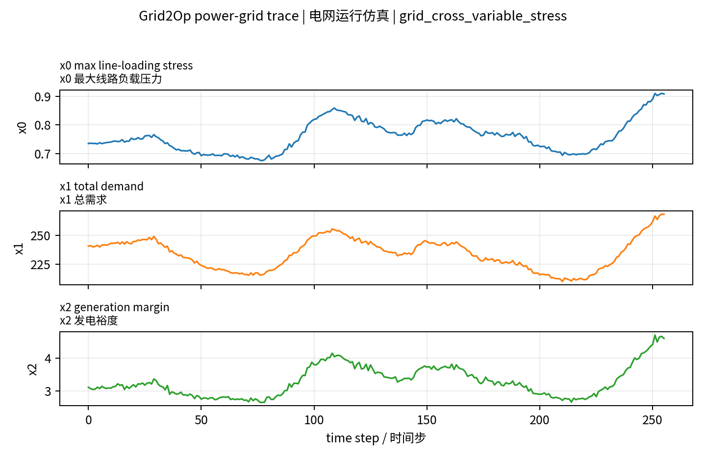
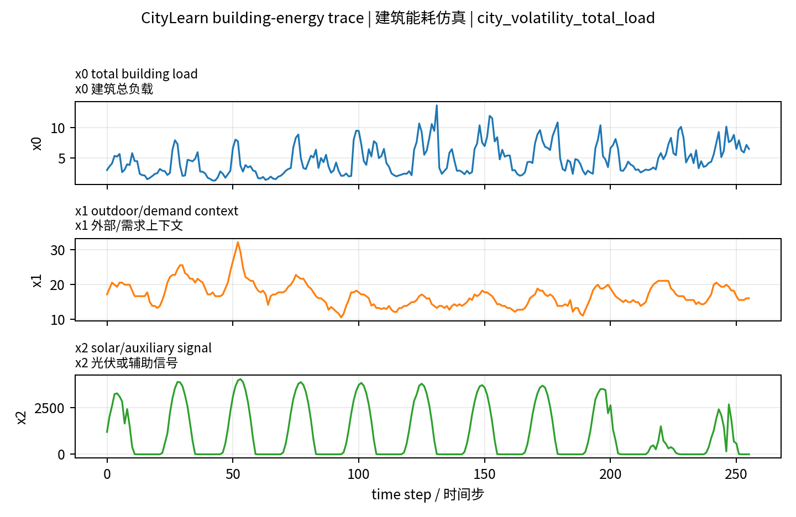
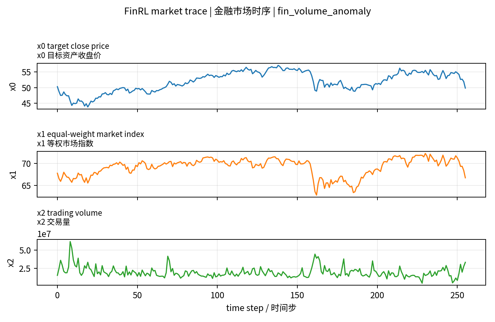
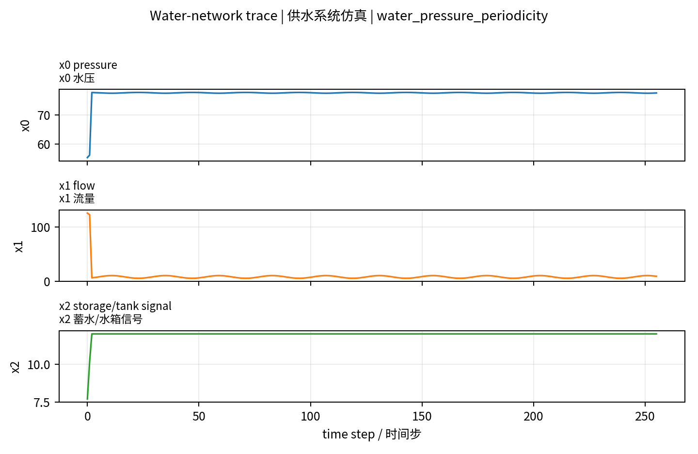
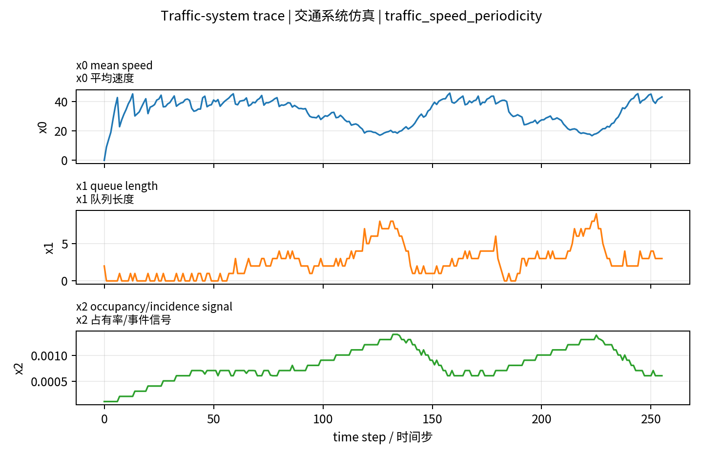
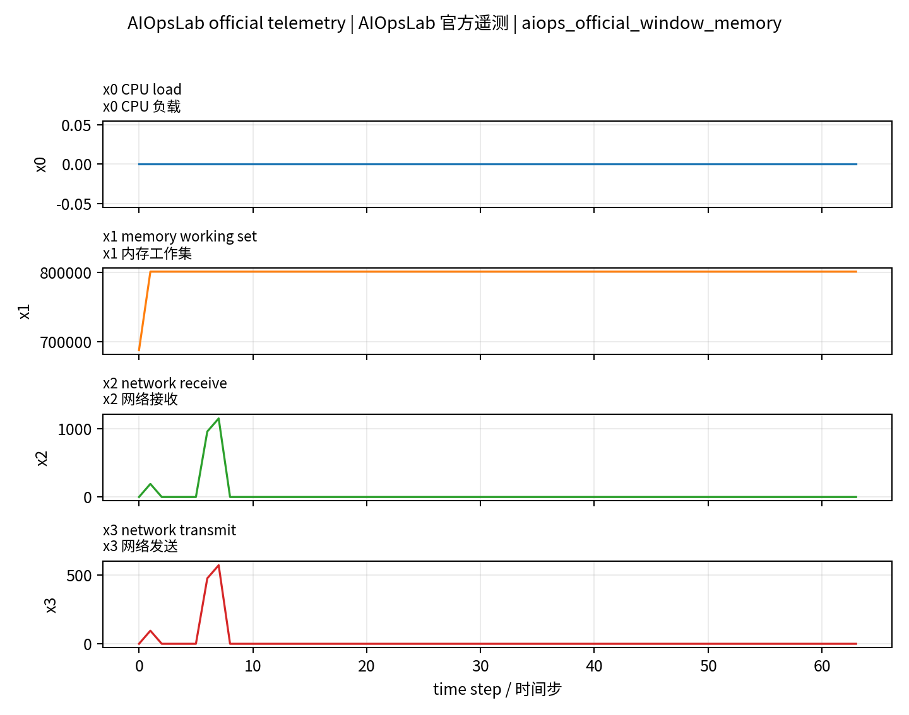

# Case Study: Multi-Simulator QCC 数据源特质与规模上限

**日期:** 2026-05-18
**样本来源:** `multisim_qcc_v5_aiops_v3/balanced_eval_per_source8.jsonl`
**目的:** 用真实 JSONL 样本展示每个 simulator/source 生成的时序数据长什么样、对应 QA 是什么、证据如何验证，以及这些数据源的可扩容上限。

## 1. 总体结论

当前数据生成已经覆盖 6 个来源：

- `Grid2Op`：电网运行时序，适合压力、负载、反事实干预、跨变量关系。
- `CityLearn`：建筑能耗时序，适合负载、天气/光伏上下文、窗口比较、波动。
- `FinRL`：金融市场历史 OHLCV trace，适合价格/交易量/市场 regime，但不是因果仿真器。
- `water`：供水系统 trace，适合压力、流量、事件恢复、周期性、反事实。
- `traffic`：交通系统 trace，适合速度、排队、占有率、信号干预、周期性。
- `AIOpsLab official v3`：Kubernetes/Prometheus 遥测，适合 CPU/内存/网络、服务上下文、故障上下文，但当前规模最小。

最重要的结论是：**总行数不是唯一瓶颈**。数据源已经能合成到几千行级别；真正的瓶颈是 AIOpsLab official case 数、任务算子均衡、以及 evidence slot 是否显式可验证。

## 2. 当前规模与可扩容上限

### 当前主数据集规模

`multisim_qcc_v5_aiops_v3` 当前规模：

| 来源 | 当前使用 rows | 已加载 rows | 主要限制 |
| --- | ---: | ---: | --- |
| Grid2Op | 384 | 1791 | 可扩，受 chronic/干预场景数限制 |
| CityLearn | 384 | 1344 | 可扩，受 building/weather/window 组合限制 |
| FinRL | 384 | 3348 | 很容易扩，受 ticker/window 数限制 |
| water | 384 | 504 | 可扩，需更多场景/事件参数 |
| traffic | 384 | 504 | 可扩，需更多路网/信号/事件参数 |
| AIOpsLab official v3 | 60 | 60 | 当前最大瓶颈，受成功导出的 official case 数限制 |
| **合计** | **1980** | **7551 左右** | 不平衡明显 |

### 规模上限的保守估计

| 口径 | 估计规模 | 说明 |
| --- | ---: | --- |
| 当前可靠 balanced v5 | `1980` | 已过 schema gate，六源合并，AIOpsLab official 只 60 |
| 当前已有单源全部合并 | `~7551` | 不平衡，FinRL/Grid2Op/CityLearn 远多于 AIOpsLab |
| 短期均衡扩展 | `~2580` | 五个成熟 source 各 504，AIOpsLab 60 |
| 加大 FinRL windows_per_length | `~9500-10000` | 容易堆量，但会强化金融/source prior |
| water/traffic 场景参数扩展后 | `1万+` | 工程上可行，但必须保留 official/fallback 标记 |
| AIOpsLab official 大规模 | 未稳定 | 取决于 Docker/kind/Helm/kubectl runtime 和 case 成功率 |

解释：

- Grid2Op/CityLearn/FinRL/water/traffic 都能通过增加窗口、场景、事件参数继续扩。
- FinRL 最容易扩到几千到上万，但它更像历史市场 trace，不应单独承担“simulator 泛化”主证据。
- AIOpsLab official 的上限目前不是理论问题，而是 runtime 和 case export 成功率问题。
- 如果只追求行数，很快能到 `1万+`；如果追求多 simulator 均衡和可验证，当前更现实的是 `2k-3k` 的高质量 balanced set。

### 每个 simulator 的扩容上限分析

| 数据源 | 当前已验证规模 | 短期可扩规模 | 更高规模的条件 | 主要风险 |
| --- | ---: | ---: | --- | --- |
| Grid2Op | `1791` loaded / `384` used | `3k-5k` | 更多 chronic、更多干预线/时间点、更多窗口长度 | CF label collapse 和任务模板偏置 |
| CityLearn | `1344` loaded / `384` used | `2k-5k` | 更多 building、weather window、控制策略组合 | 与其他 building simulator 语义重叠 |
| FinRL | `3348` loaded / `384` used | `5580+`（`windows_per_length=5`） | 更多 ticker、更多窗口、更多市场周期 | 容易堆量但不是因果 simulator |
| water | `504` loaded / `384` used | `1500-3000` | 更多 leak/event seed、阀门/泵/修复策略组合 | 必须区分 official simulator 和 fallback/smoke |
| traffic | `504` loaded / `384` used | `1500-3000` | 更多 route demand、信号策略、事故/封路场景 | 场景过少时容易学固定模板 |
| AIOpsLab official | `60` loaded / `60` used | `数百到一千级` | 稳定 Docker/kind/Helm/kubectl runtime，并提高 case export 成功率 | 当前最大瓶颈；5 个成功 case，每 case 约 12 rows |

AIOpsLab 的线性估算很直接：当前 5 个成功 case 生成 60 rows，即每个成功 case 约 12 rows。若能稳定得到 100 个 successful official cases，则约 1200 rows；若 500 个 cases，则约 6000 rows。但这依赖 runtime 工程稳定性，不能用 fallback 数据替代 official 口径。

## 3. 具体时序样本与 QA

### Grid2Op power-grid trace（电网运行仿真）

**样本 ID:** `multisim_qcc_v5_aiops_v3::grid2op::grid2op_broad::rte_case14_realistic_chronic2_trace_2048_nooverflow::w128_384::grid_cross_variable_stress`
**任务:** `grid_cross_variable_stress`
**窗口长度:** `256` steps，变量数 `3`
**变量语义:** x0 最大线路负载压力, x1 总需求, x2 发电裕度
**数据说明:** raw_compact_values 保留电网紧凑变量；values 是按窗口标准化后的模型输入。

**起点 raw 值:** x0=0.7356, x1=240.6, x2=3.119
**终点 raw 值:** x0=0.9074, x1=268.3, x2=4.6

**Question:** Which compact variable is more strongly associated with maximum line-loading stress x0: total demand x1 or generation margin x2?
**中文:** 哪个紧凑变量与最大线路负载压力 x0 的关联更强：总需求 x1，还是发电裕度 x2？

**Options / 选项:**

- A. x1（x1）
- B. both similar（二者相近）
- C. x2（x2）
- D. both weak（二者都弱）

**Gold answer:** `C`，`x2`

**Oracle evidence:** x2 is more strongly associated with maximum line-loading stress x0 than x1: corr(x0,x2) is 0.99 versus corr(x0,x1) 0.86.
**中文证据:** x2 与最大线路负载压力 x0 的关联强于 x1：corr(x0,x2)=0.99，而 corr(x0,x1)=0.86。

**关键 support slots（可验证证据字段）:** `corr_x1=0.859`, `corr_x2=0.99`, `answer_label=x2`, `window_start=128`, `window_end=384`, `source_horizon=2048`

### CityLearn building-energy trace（建筑能耗仿真）

**样本 ID:** `multisim_qcc_v5_aiops_v3::citylearn::citylearn_broad::citylearn_challenge_2022_phase_1_start6144_h2048_b5::w320_576::city_volatility_total_load`
**任务:** `city_volatility_total_load`
**窗口长度:** `256` steps，变量数 `3`
**变量语义:** x0 建筑总负载, x1 外部/需求上下文, x2 光伏或辅助信号
**数据说明:** raw_compact_values 来自 CityLearn 建筑负载和外部条件；values 是标准化后的模型输入。

**起点 raw 值:** x0=3.008, x1=17.2, x2=1196
**终点 raw 值:** x0=6.505, x1=16.1, x2=0

**Question:** Which third of the window has the highest volatility in total building load x0?
**中文:** 窗口的哪一个三分之一部分里，建筑总负载 x0 的波动最大？

**Options / 选项:**

- A. early（早期）
- B. middle（中间）
- C. late（后期）
- D. similar thirds（similar thirds）

**Gold answer:** `B`，`middle`

**Oracle evidence:** Total building load x0 varies most in the central third of the window.
**中文证据:** 建筑总负载 x0 在窗口中间三分之一部分波动最大。

**关键 support slots（可验证证据字段）:** `region_stds={'early': 1.8526527548893716, 'middle': 2.828890702869633, 'late': 2.2918834862551143}`, `answer_label=middle`, `window_start=320`, `window_end=576`, `trace_bucket_group=citylearn_challenge_2022_phase_1_start6144_h2048_b5::bucket01`

### FinRL market trace（金融市场时序）

**样本 ID:** `multisim_qcc_v5_aiops_v3::finrl_scaled::finrl_broad::JPM::w0_256::fin_volume_anomaly`
**任务:** `fin_volume_anomaly`
**窗口长度:** `256` steps，变量数 `3`
**变量语义:** x0 目标资产收盘价, x1 等权市场指数, x2 交易量
**数据说明:** FinRL 使用历史 OHLCV 数据构造，严格说是 market trace，不是因果仿真器。

**起点 raw 值:** x0=50.31, x1=67.74, x2=1.565e+07
**终点 raw 值:** x0=49.85, x1=66.71, x2=3.337e+07

**Question:** When does the strongest trading-volume spike for JPM occur?
**中文:** JPM 最强的交易量尖峰出现在什么时候？

**Options / 选项:**

- A. middle（中间）
- B. early（早期）
- C. late（后期）
- D. no pronounced spike（没有明显尖峰）

**Gold answer:** `B`，`early`

**Oracle evidence:** The strongest trading-volume spike occurs in the early part of the window, at step 8 of 256 with robust z-score 9.00.
**中文证据:** 最强交易量尖峰出现在窗口早期，即 256 步窗口中的第 8 步，robust z-score 为 9.00。

**关键 support slots（可验证证据字段）:** `event_index=8`, `event_abs_z=8.996`, `horizon=256`, `answer_label=early`, `window_start=0`, `window_end=256`, `date_start=2015-01-02`, `date_end=2016-01-07`

### Water-network trace（供水系统仿真）

**样本 ID:** `multisim_qcc_v5_aiops_v3::water::water_broad::water_scenario_025::water_pressure_periodicity`
**任务:** `water_pressure_periodicity`
**窗口长度:** `256` steps，变量数 `3`
**变量语义:** x0 水压, x1 流量, x2 蓄水/水箱信号
**数据说明:** water 当前来源是稳定 dataflow 产物；报告中需区分 official simulator 与 fallback/smoke 场景。

**起点 raw 值:** x0=55.32, x1=125.6, x2=7.7
**终点 raw 值:** x0=77.69, x1=8.988, x2=12

**Question:** What cyclic pattern best describes water pressure x0 in this window?
**中文:** 这个窗口里的水压 x0 最符合哪种周期模式？

**Options / 选项:**

- A. short cycle（短周期）
- B. medium cycle（中等周期）
- C. long cycle（长周期）
- D. no clear cycle（没有明显周期）

**Gold answer:** `D`，`no clear cycle`

**Oracle evidence:** The dominant cyclic pattern is no clear cycle: the strongest autocorrelation peak is at lag 106 with score 0.132.
**中文证据:** 主导周期模式是没有明显周期：最强自相关峰在 lag 106，分数只有 0.132。

**关键 support slots（可验证证据字段）:** `best_period=106`, `period_score=0.1322`, `answer_label=no clear cycle`, `window_start=0`, `window_end=256`, `event_index=122`, `event_label=middle`

### Traffic-system trace（交通系统仿真）

**样本 ID:** `multisim_qcc_v5_aiops_v3::traffic::traffic_broad::traffic_scenario_011::traffic_speed_periodicity`
**任务:** `traffic_speed_periodicity`
**窗口长度:** `256` steps，变量数 `3`
**变量语义:** x0 平均速度, x1 队列长度, x2 占有率/事件信号
**数据说明:** traffic 当前来源是稳定 dataflow 产物；可表达周期、拥堵、事故、信号反事实等任务。

**起点 raw 值:** x0=0, x1=2, x2=0.0001008
**终点 raw 值:** x0=43.02, x1=3, x2=0.0006048

**Question:** What cyclic pattern best describes mean speed x0 in this window?
**中文:** 这个窗口里的平均速度 x0 最符合哪种周期模式？

**Options / 选项:**

- A. medium cycle（中等周期）
- B. long cycle（长周期）
- C. no clear cycle（没有明显周期）
- D. short cycle（短周期）

**Gold answer:** `D`，`short cycle`

**Oracle evidence:** The dominant cyclic pattern is short cycle: the strongest autocorrelation peak is at lag 7 with score 0.784.
**中文证据:** 主导周期模式是短周期：最强自相关峰在 lag 7，分数为 0.784。

**关键 support slots（可验证证据字段）:** `best_period=7`, `period_score=0.784`, `answer_label=short cycle`, `window_start=0`, `window_end=256`, `event_index=None`, `event_label=no pronounced incident`

### AIOpsLab official telemetry（AIOpsLab 官方遥测）

**样本 ID:** `multisim_qcc_v5_aiops_v3::aiopslab_official_v3::aiopslab_official::port_misconfig_seed0_user-service::case000::aiops_official_window_memory`
**任务:** `aiops_official_window_memory`
**窗口长度:** `64` steps，变量数 `4`
**变量语义:** x0 CPU 负载, x1 内存工作集, x2 网络接收, x3 网络发送
**数据说明:** AIOpsLab v3 来自 Prometheus CSV export；当前 case 数少，是规模瓶颈。

**起点 raw 值:** x0=0, x1=6.881e+05, x2=0, x3=0
**终点 raw 值:** x0=0, x1=8.012e+05, x2=0, x3=0

**Question:** Is memory working set x1 higher in the first half or the second half of the window?
**中文:** 内存工作集 x1 在窗口前半段更高，还是后半段更高？

**Options / 选项:**

- A. similar halves（前后两半相近）
- B. first half higher（前半段更高）
- C. second half higher（后半段更高）
- D. cannot determine（无法判断）

**Gold answer:** `A`，`similar halves`

**Oracle evidence:** The half-window comparison is similar halves: first-half mean x1 is 797644.80 and second-half mean x1 is 801177.60.
**中文证据:** 半窗口比较结果是前后两半相近：x1 前半段均值为 797644.80，后半段均值为 801177.60。

**关键 support slots（可验证证据字段）:** `first_mean=7.976e+05`, `second_mean=8.012e+05`, `answer_label=similar halves`, `window_start=0`, `window_end=64`

## 4. 数据源特质总结

| 数据源 | 合成数据特质 | 优点 | 遗留问题 |
| --- | --- | --- | --- |
| Grid2Op | 长窗口、多变量、电网状态和反事实干预 | 真实 simulator 语义强，counterfactual 清楚 | 当前模型容易学标签模板，CF label collapse 曾出现 |
| CityLearn | 建筑负载、天气/光伏/需求上下文 | 窗口比较和波动任务稳定 | 与其他 building simulator 有领域重叠 |
| FinRL | 历史市场价格/指数/交易量 | 规模最容易扩大，任务多样 | 不是因果 simulator，不能证明 intervention 泛化 |
| water | 压力/流量/储水信号，事件恢复和泄漏 | 适合反事实和基础设施 reasoning | 当前 smoke 数据规模小，需明确 official/fallback |
| traffic | 速度/排队/占有率/信号事件 | 周期性、lead-lag、干预效果直观 | 当前场景较少，需更多路网和控制策略 |
| AIOpsLab official | Prometheus CPU/内存/网络遥测 + 故障元数据 | 最贴近真实运维异常和 agent 场景 | official case 只有 60 rows，是主要规模瓶颈 |

## 5. 对模型训练的启示

这些数据源足够说明“多 simulator 数据流可以打通”，但还不足以说明模型已经学会泛化。原因是：

1. 不同 simulator 的变量语义差别很大。
2. 不同 task family 需要完全不同的算子，例如均值比较、相关系数、自相关、异常定位、反事实差异、metadata lookup。
3. 目前模型诊断显示 actual time series 不优于 zeroed/permuted time series，说明模型还没有稳定使用时序证据。
4. 下一步数据生成不应只追求更多行，而应为每条样本显式保存 operator slots，例如 `corr_x1/corr_x2`、`region_stds`、`robust_z`、`period_score`、`first_mean/second_mean`。

## 6. 建议的下一步数据生成路线

1. 固定一个 `balanced high-quality v6`：每个成熟 source 约 500 条，AIOpsLab 暂时 60 条，全部带显式 operator slots。
2. 对 water/traffic 增加更多 scenario seed 和事件参数，让它们从 504 提到 1500-3000 条。
3. AIOpsLab 单独作为 official case collection 项目推进，优先提升成功 case 数，而不是用 fallback 冒充 official。
4. 每个 task family 做最小计数门槛，例如每个 source 每类任务至少 50 条，避免模型只学常见任务。
5. 生成训练数据时同时生成 diagnostic controls：actual、zeroed、permuted、oracle-slot verbalization，用于判断模型是否真的看时序。
