# Natural QA Balanced8 Case Study 分析报告（2026-05-19）

目标：参考 `natural_qa_pilot_20260519/NATURAL_TSQA_CASE_PILOT_20260519_ZH.md` 的图文格式，把 `natural_multisim_v5_balanced8.jsonl` 中通过 reviewer gate 的自然 TS-QA 样本整理成可直接阅读的 case study。每个 case 都配有时序图、英文问题、中文翻译、双语选项和可验证证据。

## 1. 总体结论

| 指标 | 结果 |
| --- | ---: |
| 总样本数 | `48` |
| review scope | `{'excluded_by_rule': 5, 'gpt55_candidate': 43}` |
| decision | `{'reject': 5, 'keep': 43}` |
| risk | `{'high': 5, 'low': 43}` |
| candidate 正例通过 | `43/43` |

设计原则：

- 场景说明负责交代 domain、变量含义、时间轴和必要规则。
- 问题本身只问一个自然决策，不暴露内部 verifier 实现细节。
- 选项是普通读者能理解的短答案，并保留原始 gold answer letter。
- Evidence 只使用 deterministic support slots 或 raw trace 统计，LLM/reviewer 不决定答案。
- 图中展示的是每个变量按自身 min-max 归一化后的 raw compact values；数值判定仍以 Evidence 和 Support slots 为准。

## 2. 图文 Case Study

### 1. Grid2Op line-disconnection stress check（Grid2Op 断线后的线路压力检查）

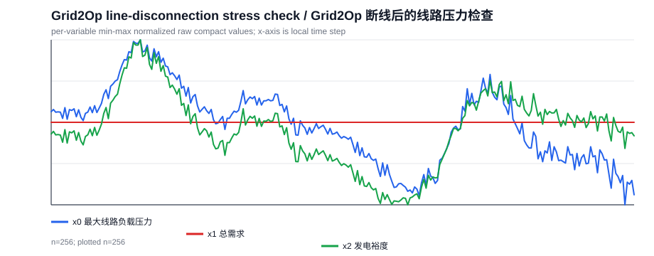

**Domain/source:** `grid2op`

**Task family:** `grid_counterfactual_peak_stress`

**Row ID:** `multisim_qcc_v5_aiops_v3::grid2op::grid2op_broad_cf::h2048_c-1_t512_line1::post769_1025::grid_counterfactual_peak_stress`

**Reviewer:** `decision=keep`, `naturalness=4`, `answerability=5`, `risk=low`

**Scene EN:** A Grid2Op operator is reviewing a power-grid time-series window. x0 is maximum line-loading stress, x1 is total demand, and x2 is generation margin. Stress above 1.0 indicates overload risk. The line disconnection occurred at global step 512; this local plot covers global steps 769 to 1025. In this counterfactual case, x0 is intervention-minus-factual maximum line-loading stress; positive values mean the disconnection raises stress.

**场景中文:** 一名 Grid2Op 电网调度员正在查看电网时序窗口。x0 是最大线路负载压力，x1 是总需求，x2 是发电裕度。压力超过 1.0 表示过载风险。 断线发生在全局第 512 步；这张局部图覆盖全局第 769 到 1025 步。在这个反事实样本中，x0 表示“干预后最大线路负载压力减去事实运行压力”；x0 为正表示断线后压力更高。

**Question EN:** In this post-event window, what is the main effect of disconnecting the line on maximum line-loading stress?

**问题中文:** 在这个事件后窗口里，断开线路对最大线路负载压力的主要影响是什么？

**Options / 选项:**

- A. the intervention lowers the stress / 断线后压力更低
- B. there is no material change / 断线前后压力基本相同
- C. the intervention raises the stress / 断线后压力更高
- D. cannot determine / 无法判断

**Gold:** `C` / the intervention raises the stress / 断线后压力更高

**Evidence EN:** The intervention-minus-factual stress difference ranges from 0.37 to 0.56, so the effect is the intervention raises the stress.

**证据中文:** 干预后与事实运行的压力差值范围为 0.37 到 0.56，因此判断为：断线后压力更高。

**Support slots:** `max_x0_diff=0.5587`, `min_x0_diff=0.3664`, `answer_label=larger upward peak`, `line_id=1`, `intervention_step=512`, `post_start=0`, `global_post_start=513`, `segment_start=769`, `segment_end=1025`, `segment_tag=post769_1025`

**原始问题:** The provided trace is intervention-minus-factual after disconnecting line 1 at global step 512, shown in segment post769_1025. What is the strongest post-event stress deviation in x0?

**设计说明:** 把 global event 和 local window 的关系放进场景说明，问题本身只问调度员关心的反事实影响。

**Reviewer 说明:** 整体像正常的电网调度分析问题，不是明显的 verifier-slot 提示。场景明确说明了断线时间、当前窗口范围，以及 x0 在反事实样本中表示“干预后减事实运行”的压力差，因此可直接根据正负和证据范围判断主要影响。证据给出差值始终为正，答案可由支持槽确定。主要小问题是选项 B 的中文“断线前后压力基本相同”容易被理解成同一轨迹的事件前后比较，而本题实际比较的是干预后与事实运行之间的反事实差异；建议改成“与事实运行相比基本没有变化”。

### 2. Grid2Op demand-stress timing review（Grid2Op 总需求与线路压力先后关系复盘）

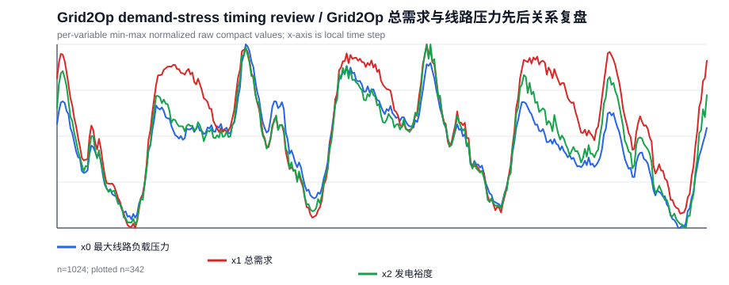

**Domain/source:** `grid2op`

**Task family:** `grid_temporal_lead_lag`

**Row ID:** `multisim_qcc_v5_aiops_v3::grid2op::grid2op_broad::rte_case14_realistic_chronic4_trace_2048_nooverflow::w512_1536::grid_temporal_lead_lag`

**Reviewer:** `decision=keep`, `naturalness=4`, `answerability=5`, `risk=low`

**Scene EN:** A Grid2Op operator is reviewing a power-grid time-series window. x0 is maximum line-loading stress, x1 is total demand, and x2 is generation margin. Stress above 1.0 indicates overload risk. This question compares only x1 total demand and x0 line-loading stress. Lag 0 means synchronous movement; if the strongest relation is at lag 0, choose the synchronous/no-stable-lead option rather than either signal leading.

**场景中文:** 一名 Grid2Op 电网调度员正在查看电网时序窗口。x0 是最大线路负载压力，x1 是总需求，x2 是发电裕度。压力超过 1.0 表示过载风险。 本题只比较 x1 总需求和 x0 最大线路负载压力。滞后 0 表示同步变化；如果最强关系出现在滞后 0，则选择同步/无稳定领先方，而不是判定某个信号领先。

**Question EN:** Do total demand and maximum line-loading stress show a clear timing order in this window?

**问题中文:** 总需求和最大线路负载压力之间是否表现出清晰的先后关系？

**Options / 选项:**

- A. maximum line-loading stress leads total demand / 最大线路负载压力领先总需求
- B. total demand leads maximum line-loading stress / 总需求领先最大线路负载压力
- C. there is no stable timing lead / 同步变化，没有稳定领先方
- D. correlation is too weak to use / 相关性太弱，无法判断先后

**Gold:** `C` / there is no stable timing lead / 同步变化，没有稳定领先方

**Evidence EN:** The strongest tested lag is 0 with correlation 0.87; this supports there is no stable timing lead.

**证据中文:** 最强候选滞后为 0，相关系数为 0.87。因此判断为：同步变化，没有稳定领先方。

**Support slots:** `best_lag=0`, `best_lag_corr=0.8733`, `answer_label=no clear lead`, `window_start=512`, `window_end=1536`, `source_horizon=2048`

**原始问题:** Does total demand x1 tend to lead or lag maximum line-loading stress x0?

**设计说明:** 这是 lead-lag 边界样本：最强关系在 lag 0，因此答案不是某个变量领先，而是同步/无稳定领先方。

**Reviewer 说明:** 题目整体像正常的电网时序复盘问题，变量含义、比较对象和滞后 0 的判定规则都已明确说明。证据直接给出最强滞后为 0 且相关性较强，因此可以根据规则选择“同步变化/无稳定领先方”。主要小问题是英文问题中“Does total demand and...”语法略不自然；此外先后关系题通常风险较高，但本例规则和证据足够清楚。

### 3. CityLearn demand-pressure planning（CityLearn 建筑需求压力判断）

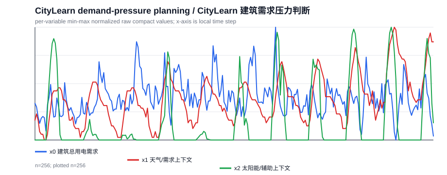

**Domain/source:** `citylearn`

**Task family:** `city_domain_demand_context`

**Row ID:** `multisim_qcc_v5_aiops_v3::citylearn::citylearn_broad::citylearn_challenge_2022_phase_1_start2048_h2048_b5::w1792_2048::city_domain_demand_context`

**Reviewer:** `decision=keep`, `naturalness=4`, `answerability=5`, `risk=low`

**Scene EN:** A building energy controller is reviewing a 256-step CityLearn window. x0 is total building electricity demand. The window is divided into early, middle, and late thirds when a location option is used.

**场景中文:** 建筑能耗控制器正在查看一个 256 步的 CityLearn 窗口。x0 是建筑总用电需求。若问题使用早期/中期/后期选项，则按时间顺序把窗口三等分。

**Question EN:** Using the stated demand-pressure bands, what state should the building controller assume for this window?

**问题中文:** 按照需求压力分档规则，建筑控制器应把这个窗口视为什么需求压力状态？

**Options / 选项:**

- A. high building demand pressure / 高建筑需求压力
- B. low building demand pressure / 低建筑需求压力
- C. moderate building demand pressure / 中等建筑需求压力
- D. unclear demand pressure / 需求压力不清楚

**Gold:** `C` / moderate building demand pressure / 中等建筑需求压力

**Evidence EN:** Demand-pressure rule: high if mean load is at least 8 or peak load is at least 16, low if mean load is below 3 and peak load below 8, otherwise moderate. Mean load is 5.07, peak load is 12.04, and solar/context mean is 443.38.

**证据中文:** 需求压力规则为：平均负载至少 8 或峰值负载至少 16 时为高需求压力；平均负载低于 3 且峰值负载低于 8 时为低需求压力；否则为中等需求压力。本窗口平均负载为 5.07，峰值负载为 12.04，太阳能/上下文均值为 443.38。

**Support slots:** `x0_mean=5.068`, `x0_peak=12.04`, `x2_mean=443.4`, `answer_label=moderate building demand pressure`, `window_start=1792`, `window_end=2048`, `trace_bucket_group=citylearn_challenge_2022_phase_1_start2048_h2048_b5::bucket07`

**原始问题:** What demand-pressure regime best describes this CityLearn window?

**设计说明:** 把负载均值和峰值转成建筑控制器可用的需求压力状态，而不是只问 x0 的统计量。

**Reviewer 说明:** 该样例整体像正常的建筑能耗控制问题：场景说明了 256 步窗口和 x0 的含义，问题要求依据明确给出的需求压力分档规则判断状态，选项也为自然语言类别。证据中给出了判定阈值、平均负载和峰值负载，因此可由场景和证据确定答案。唯一轻微问题是“需求压力分档规则”依赖证据说明，且 x2 的太阳能/上下文均值与本题判断无关，但不影响可答性。

### 4. CityLearn isolated demand spike（CityLearn 建筑用电孤立尖峰定位）

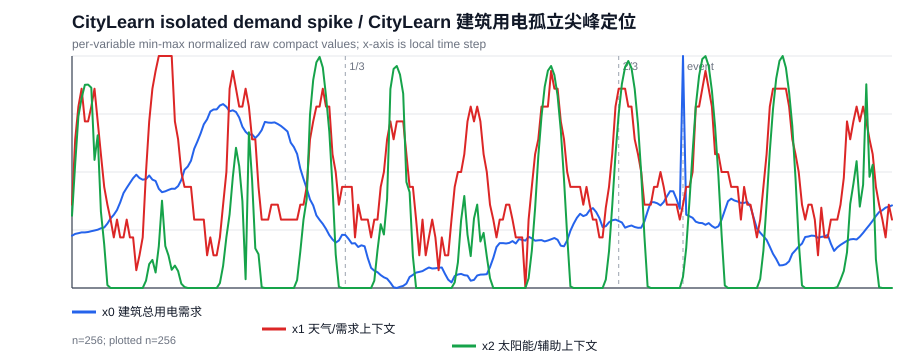

**Domain/source:** `citylearn`

**Task family:** `city_anomaly_total_load`

**Row ID:** `multisim_qcc_v5_aiops_v3::citylearn::citylearn_broad::citylearn_challenge_2022_phase_1_start6144_h2048_b5::w512_768::city_anomaly_total_load`

**Reviewer:** `decision=keep`, `naturalness=4`, `answerability=5`, `risk=low`

**Scene EN:** A building energy controller is reviewing a 256-step CityLearn window. x0 is total building electricity demand. The window is divided into early, middle, and late thirds when a location option is used.

**场景中文:** 建筑能耗控制器正在查看一个 256 步的 CityLearn 窗口。x0 是建筑总用电需求。若问题使用早期/中期/后期选项，则按时间顺序把窗口三等分。

**Question EN:** Where does the strongest isolated building-demand spike occur after splitting this window into early, middle, and late thirds?

**问题中文:** 把这个窗口按时间分成早期、中期和后期后，最明显的建筑用电需求孤立尖峰出现在什么位置？

**Options / 选项:**

- A. early / 早期
- B. middle / 中期
- C. late / 后期
- D. no pronounced spike / 没有明显尖峰

**Gold:** `C` / late / 后期

**Evidence EN:** The demand-spike detector uses absolute z-score 3 as the pronounced-spike cutoff. The strongest candidate has absolute z-score 3.51 at the late third of the window, supporting the late part of the window.

**证据中文:** 尖峰检测器使用绝对 z 分数 3 作为明显尖峰阈值；最强候选尖峰的绝对 z 分数为 3.51，位置在窗口后段，因此判断为后期。

**Support slots:** `event_index=190`, `event_abs_z=3.513`, `horizon=256`, `controlled_anomaly=True`, `injected=True`, `requested_region=late`, `answer_label=late`, `window_start=512`, `window_end=768`, `trace_bucket_group=citylearn_challenge_2022_phase_1_start6144_h2048_b5::bucket02`

**原始问题:** When does the strongest isolated spike in total building load x0 occur?

**设计说明:** 尖峰题必须给出 z-score 阈值和时间三等分规则，避免“明显尖峰”成为主观判断。

**Reviewer 说明:** 问题表述基本像正常的建筑能耗场景诊断问题，变量 x0 已解释为建筑总用电需求，早期/中期/后期的划分也在场景中说明。证据明确给出尖峰判定阈值、最强候选的 z 分数以及其位于窗口后段，因此可由给定信息确定答案。没有明显依赖隐藏内部 ID 或未解释坐标轴的问题。

### 5. FinRL GOOG market-regime review（FinRL GOOG 市场状态复盘）

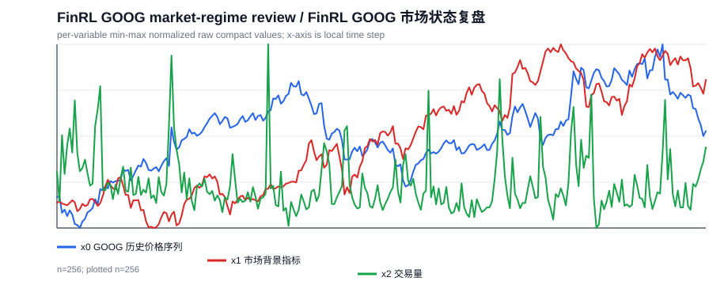

**Domain/source:** `finrl_scaled`

**Task family:** `fin_domain_market_regime`

**Row ID:** `multisim_qcc_v5_aiops_v3::finrl_scaled::finrl_broad::GOOG::w2299_2555::fin_domain_market_regime`

**Reviewer:** `decision=keep`, `naturalness=5`, `answerability=5`, `risk=low`

**Scene EN:** A market analyst is reviewing a historical market window for GOOG from 2024-02-22 to 2025-02-28. x0 is the historical price series for GOOG; return questions use returns computed from that price series. x1 is a market background indicator, and x2 is trading volume. Location questions divide the window into early, middle, and late thirds.

**场景中文:** 市场分析师正在查看 GOOG 在 2024-02-22 至 2025-02-28 期间的历史行情窗口。x0 是 GOOG 的历史价格序列；收益率问题使用从该价格序列计算出的收益。x1 是市场背景指标，x2 是交易量。位置类问题按时间顺序把窗口分为早期、中期和后期三段。

**Question EN:** Using total return first and volatility as tie-breaker, what market regime best describes this asset window?

**问题中文:** 先看总收益、再用波动率辅助判断，GOOG 在这段时间最符合哪种市场状态？

**Options / 选项:**

- A. bearish regime / 熊市/下行状态
- B. bullish regime / 牛市/上行状态
- C. volatile sideways regime / 高波动横盘状态
- D. quiet sideways regime / 低波动横盘状态

**Gold:** `B` / bullish regime / 牛市/上行状态

**Evidence EN:** Regime rule: total return >= 5% is bullish, <= -5% is bearish; otherwise it is sideways, with return volatility >= 0.03 classified as volatile sideways and below 0.03 as quiet sideways. Total return is 18.51% and return volatility is 0.018.

**证据中文:** 市场状态规则为：总收益率 >= 5% 归为牛市/上行，<= -5% 归为熊市/下行；介于其间视为横盘，其中收益波动率 >= 0.03 为高波动横盘，低于 0.03 为低波动横盘。该窗口总收益率为 18.51%，收益波动率为 0.018。

**Support slots:** `total_return=0.1851`, `return_std=0.01789`, `answer_label=bullish regime`, `window_start=2299`, `window_end=2555`, `date_start=2024-02-22`, `date_end=2025-02-28`

**原始问题:** What market regime best describes GOOG in this window?

**设计说明:** 直接把 ticker 放进场景，并用总收益率与波动率规则形成金融分析判断。

**Reviewer 说明:** 问题表述像正常的金融分析问题，场景说明了价格序列、收益率来源和时间范围；证据中明确给出市场状态判定规则、总收益率和波动率，因此无需依赖隐藏阈值或内部编号即可确定答案。x1、x2 虽未用于本题，但不影响理解和作答。

### 6. FinRL MRK drawdown-risk review（FinRL MRK 回撤风险复盘）

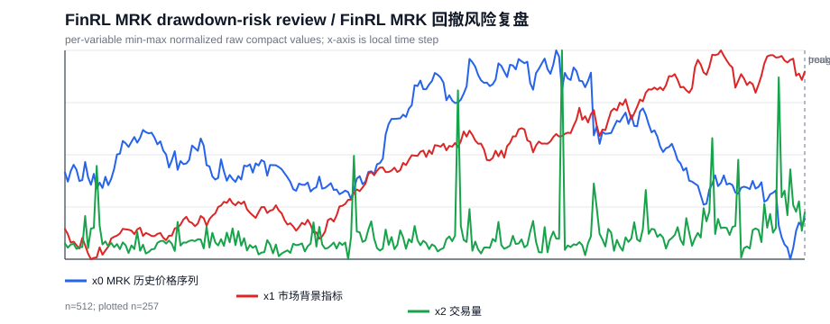

**Domain/source:** `finrl_scaled`

**Task family:** `fin_drawdown_price`

**Row ID:** `multisim_qcc_v5_aiops_v3::finrl_scaled::finrl_broad::MRK::w2043_2555::fin_drawdown_price`

**Reviewer:** `decision=keep`, `naturalness=5`, `answerability=5`, `risk=low`

**Scene EN:** A market analyst is reviewing a historical market window for MRK from 2023-02-14 to 2025-02-28. x0 is the historical price series for MRK; return questions use returns computed from that price series. x1 is a market background indicator, and x2 is trading volume. Location questions divide the window into early, middle, and late thirds.

**场景中文:** 市场分析师正在查看 MRK 在 2023-02-14 至 2025-02-28 期间的历史行情窗口。x0 是 MRK 的历史价格序列；收益率问题使用从该价格序列计算出的收益。x1 是市场背景指标，x2 是交易量。位置类问题按时间顺序把窗口分为早期、中期和后期三段。

**Question EN:** Using the stated drawdown bands, how severe is this price drawdown?

**问题中文:** 按照回撤分档规则，MRK 在这个窗口中的价格回撤应归为哪一类？

**Options / 选项:**

- A. moderate drawdown / 中等回撤
- B. mild drawdown / 轻微回撤
- C. severe drawdown / 严重回撤
- D. little drawdown / 回撤很小

**Gold:** `C` / severe drawdown / 严重回撤

**Evidence EN:** Drawdown bands are: little below 5%, mild 5-15%, moderate 15-30%, severe above 30%. The maximum drawdown is 36.65% during 2023-02-14 to 2025-02-28.

**证据中文:** 回撤分档规则为：小于 5% 为回撤很小，5% 到 15% 为轻微回撤，15% 到 30% 为中等回撤，超过 30% 为严重回撤。该窗口最大回撤为 36.65%。

**Support slots:** `max_drawdown=-0.3665`, `drawdown_peak_index=340`, `drawdown_trough_index=502`, `answer_label=severe drawdown`, `window_start=2043`, `window_end=2555`, `date_start=2023-02-14`, `date_end=2025-02-28`

**原始问题:** What drawdown regime best describes MRK target price x0 in this window?

**设计说明:** 回撤题比最高点位置更接近真实风险复盘，需要把 drawdown band 写清楚。

**Reviewer 说明:** 该样例读起来像正常的金融分析问题，场景说明了标的、时间窗口和价格序列含义；问题询问最大价格回撤按给定分档应归类为何种程度，选项也都是自然的回撤等级。证据中明确给出了分档阈值和最大回撤 36.65%，因此可直接从证据和规则判断，未依赖隐藏索引或内部元数据。

### 7. Traffic speed-queue timing review（交通车速与排队先后关系复盘）

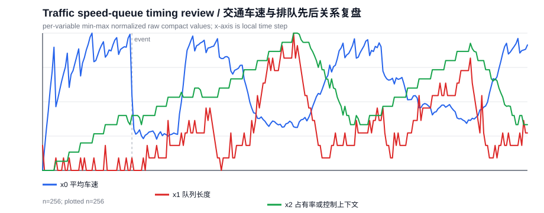

**Domain/source:** `traffic`

**Task family:** `traffic_speed_queue_lead_lag`

**Row ID:** `multisim_qcc_v5_aiops_v3::traffic::traffic_broad::traffic_scenario_020::traffic_speed_queue_lead_lag`

**Reviewer:** `decision=keep`, `naturalness=4`, `answerability=5`, `risk=low`

**Scene EN:** A traffic engineer is reviewing a traffic-system window with mean speed, queue length, and occupancy/control context recorded as aligned time-series signals. Lower queue and higher speed usually indicate better traffic flow. For this timing review, negative lag means speed tends to move earlier, and positive lag means queue length tends to move earlier. Absolute correlation strength below 0.35 is treated as too weak to use; if the best lag improves on the synchronous absolute-correlation strength by less than 0.05, the timing order is treated as not stable.

**场景中文:** 交通工程师正在查看一段交通系统窗口，其中平均车速、排队长度、占有率/控制上下文都作为对齐的时间序列记录。更低队列和更高速度通常表示交通流更好。 对这个先后关系复盘来说，负滞后表示车速更早变化，正滞后表示排队长度更早变化。绝对相关强度低于 0.35 时视为太弱；若最强滞后相对同步绝对相关强度的提升小于 0.05，则视为没有稳定的方向性领先。

**Question EN:** Do speed changes and queue-length changes show a clear timing order in this window?

**问题中文:** 车速变化和排队长度变化之间是否表现出清晰的先后关系？

**Options / 选项:**

- A. speed changes lead queue changes / 车速变化领先排队变化
- B. queue changes lead speed changes / 排队变化领先车速变化
- C. correlation is too weak to use / 相关性低于可用阈值
- D. there is no stable timing lead / 没有稳定的方向性领先

**Gold:** `D` / there is no stable timing lead / 没有稳定的方向性领先

**Evidence EN:** The strongest lag is -3 with correlation -0.46, while the synchronous correlation is -0.44. The absolute-correlation strength improves by only 0.02, below the 0.05 stability margin, so the traffic review should choose there is no stable timing lead.

**证据中文:** 最强滞后为 -3，相关系数为 -0.46；同步相关系数为 -0.44。绝对相关强度只提升了 0.02，低于 0.05 的稳定性余量，因此交通复盘应选择：没有稳定的方向性领先。

**Support slots:** `best_lag=-3`, `best_lag_corr=-0.4625`, `zero_lag_corr=-0.4437`, `answer_label=no clear lead`, `window_start=0`, `window_end=256`, `event_index=47`, `event_label=early`

**原始问题:** Does speed movement lead queue movement, lag it, or show no clear relation?

**设计说明:** 该样本体现 reviewer 的价值：负相关时必须写成绝对相关强度，并说明稳定性余量。

**Reviewer 说明:** 该样例整体像正常的交通时序复盘问题，而不是明显的验证器槽位提示。场景中解释了负/正滞后的含义、相关强度阈值和稳定性余量，问题和选项也能直接对应“车速领先、排队领先、相关太弱、无稳定领先”四类判断。证据明确给出最强滞后、同步相关和提升幅度，并说明低于稳定性余量，因此答案可由给定信息确定。唯一轻微不足是滞后符号约定和相关阈值较技术化，但已在场景中说明，不影响可用性。

### 8. Traffic signal-policy queue comparison（交通信号策略的队列影响比较）

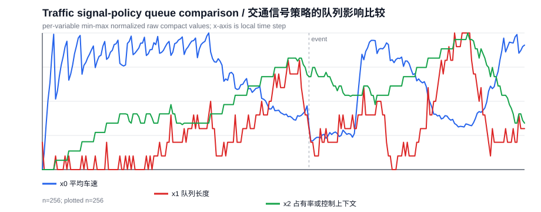

**Domain/source:** `traffic`

**Task family:** `traffic_signal_counterfactual_queue`

**Row ID:** `multisim_qcc_v5_aiops_v3::traffic::traffic_broad::traffic_scenario_025::traffic_signal_counterfactual_queue`

**Reviewer:** `decision=keep`, `naturalness=4`, `answerability=5`, `risk=low`

**Scene EN:** A traffic engineer is reviewing a traffic-system window with mean speed, queue length, and occupancy/control context recorded as aligned time-series signals. Lower queue and higher speed usually indicate better traffic flow.

**场景中文:** 交通工程师正在查看一段交通系统窗口，其中平均车速、排队长度、占有率/控制上下文都作为对齐的时间序列记录。更低队列和更高速度通常表示交通流更好。

**Question EN:** Compared with the fixed-signal baseline, did the adaptive signal policy improve queueing?

**问题中文:** 与固定信号基线相比，自适应信号策略是否改善了排队？

**Options / 选项:**

- A. adaptive signal has the lower mean queue / 自适应信号下队列更低
- B. both policies have about the same queue / 没有实质队列变化
- C. the policy effect is mixed / 混合影响
- D. adaptive signal has the higher mean queue / 自适应信号下队列更高

**Gold:** `D` / adaptive signal has the higher mean queue / 自适应信号下队列更高

**Evidence EN:** The adaptive-signal mean queue is 2.91, compared with fixed baseline 2.56.

**证据中文:** 自适应信号平均队列为 2.91，固定基线为 2.56。

**Support slots:** `factual_mean=2.91`, `counterfactual_mean=2.559`, `delta=0.3516`, `counterfactual_var=1`, `answer_label=higher queue under adaptive signal`, `window_start=0`, `window_end=256`, `event_index=141`, `event_label=middle`

**原始问题:** Compared with the matched fixed-signal baseline, how does the traffic-control scenario change mean queue length?

**设计说明:** 把 factual-vs-baseline 均值比较改成交通工程师关心的策略是否改善排队。

**Reviewer 说明:** 问题整体像正常的交通工程决策问题，场景、变量和比较对象清楚；证据直接给出自适应信号与固定信号基线的平均队列长度，足以支持答案。轻微问题是 x2 的定义“占有率或控制上下文”较泛，但本题不依赖 x2；选项中的“没有实质队列变化”没有说明阈值，不过证据已明确给出两者均值差异，风险较低。

### 9. Water combined-stress state（供水系统综合压力状态判断）

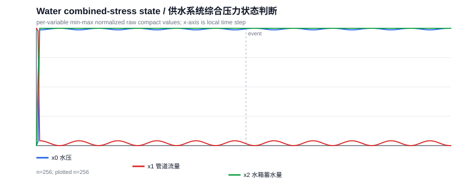

**Domain/source:** `water`

**Task family:** `water_combined_stress_context`

**Row ID:** `multisim_qcc_v5_aiops_v3::water::water_broad::water_scenario_005::water_combined_stress_context`

**Reviewer:** `decision=keep`, `naturalness=4`, `answerability=5`, `risk=low`

**Scene EN:** A water-network operator is reviewing a service window. x0 is water pressure, x1 is pipe flow, and x2 is tank storage. Low pressure can indicate service risk.

**场景中文:** 供水网络运维人员正在查看服务窗口。x0 是水压，x1 是管道流量，x2 是水箱蓄水量。低水压可能表示供水风险。

**Question EN:** Using the stated stress-score rule, what operating state is most plausible for this water-service window?

**问题中文:** 按照综合压力评分规则，这个供水服务窗口最可能处于哪种运行状态？

**Options / 选项:**

- A. critical combined stress / 严重综合压力
- B. stable combined state / 稳定综合状态
- C. moderate combined stress / 中等综合压力
- D. unclear combined state / 综合状态不清楚

**Gold:** `C` / moderate combined stress / 中等综合压力

**Evidence EN:** Stress rule: scores below -50 with a mid-window event indicate moderate combined stress when the severe-low-pressure flag is false; if that flag is true, classify as critical combined stress. The combined stress score is -66.31, the event timing label is middle, and the severe-low-pressure flag is False.

**证据中文:** 综合压力规则为：评分低于 -50 且窗口中段出现事件时，如果严重低压标记为 false，则归为中等综合压力；如果严重低压标记为 true，则归为严重综合压力。本窗口综合压力分数为 -66.31，事件位于中期，严重低压标记为 false。

**Support slots:** `combined_stress_score=-66.31`, `x0_event_indicator=False`, `answer_label=moderate combined stress`, `window_start=0`, `window_end=256`, `event_index=129`, `event_label=middle`

**原始问题:** Considering event timing and multiple signals together, what combined operational state is most plausible?

**设计说明:** 该题结合压力评分、事件时段和严重低压标记，比单变量 extrema 更接近运维判断。

**Reviewer 说明:** 该样例整体像一个供水运维场景下的状态判断问题，场景、变量、规则、选项和证据都较清楚。问题虽然带有“按照综合压力评分规则”的规则判定色彩，但并未暴露内部 ID 或明显 verifier-slot 格式。证据明确给出阈值、事件时段、严重低压标记和综合压力分数，因此可直接由给定规则确定答案，准确性风险较低。

### 10. Water event-recovery review（供水事件后的水压恢复复盘）

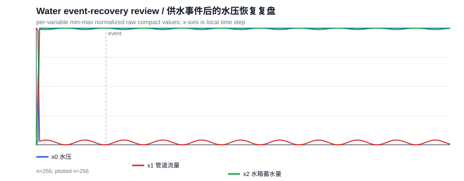

**Domain/source:** `water`

**Task family:** `water_event_recovery_context`

**Row ID:** `multisim_qcc_v5_aiops_v3::water::water_broad::water_scenario_000::water_event_recovery_context`

**Reviewer:** `decision=keep`, `naturalness=4`, `answerability=5`, `risk=low`

**Scene EN:** A water-network operator is reviewing a service window. x0 is water pressure, x1 is pipe flow, and x2 is tank storage. Low pressure can indicate service risk.

**场景中文:** 供水网络运维人员正在查看服务窗口。x0 是水压，x1 是管道流量，x2 是水箱蓄水量。低水压可能表示供水风险。

**Question EN:** Using the stated phase-mean rule, what water-pressure state follows the event?

**问题中文:** 按照事件前、中、后三阶段均值规则，事件后的水压状态最符合哪一种判断？

**Options / 选项:**

- A. pressure recovers / 水压恢复
- B. pressure overshoot / 水压过冲
- C. persistent pressure stress / 持续水压压力
- D. no event recovery / 没有事件恢复

**Gold:** `B` / pressure overshoot / 水压过冲

**Evidence EN:** Recovery rule: any post-event mean above the pre-event mean is overshoot; equal-to or below-but-returning toward pre-event level is recovery; below pre-event while still stressed is persistent pressure stress. Pre-event mean is 74.77, event mean is 74.75, and post-event mean is 74.83.

**证据中文:** 恢复规则为：事件后均值只要高于事件前均值，就视为水压过冲；等于或低于但回到事件前水平附近时视为恢复；低于事件前且仍偏低视为持续承压。事件前均值为 74.77，事件中均值为 74.75，事件后均值为 74.83。

**Support slots:** `pre_mean=74.77`, `event_mean=74.75`, `post_mean=74.83`, `answer_label=pressure overshoot`, `window_start=0`, `window_end=256`, `event_index=43`, `event_label=early`

**原始问题:** After the event window, does the primary stress signal recover, persist, or overshoot?

**设计说明:** 通过事件前、中、后三段均值判断恢复、持续承压或过冲，答案仍可由数值复核。

**Reviewer 说明:** 该样例整体可保留。场景说明了 x0 为水压，并给出低水压的业务含义；问题询问事件后水压状态，选项也是可理解的运维判断。证据中明确给出了判定规则以及事件前、中、后的均值，因此无需隐藏阈值或外部知识即可回答。唯一轻微问题是“事件前、中、后三阶段均值规则”略像数据集规则提示，不完全像自然业务提问，但仍可接受。

### 11. AIOpsLab memory-pressure triage（AIOpsLab 内存压力排查）

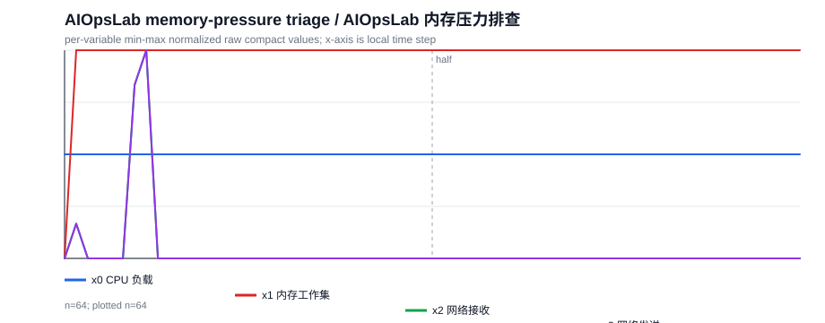

**Domain/source:** `aiopslab_official_v3`

**Task family:** `aiops_official_window_memory`

**Row ID:** `multisim_qcc_v5_aiops_v3::aiopslab_official_v3::aiopslab_official::port_misconfig_seed0_user-service::case000::aiops_official_window_memory`

**Reviewer:** `decision=keep`, `naturalness=4`, `answerability=5`, `risk=low`

**Scene EN:** An SRE is reviewing an AIOpsLab microservice telemetry window. x0 is service CPU load, x1 is memory working set, x2 is network receive rate, and x3 is network transmit rate.

**场景中文:** 一名 SRE 正在查看 AIOpsLab 微服务遥测窗口。x0 是服务 CPU 负载，x1 是内存工作集，x2 是网络接收速率，x3 是网络发送速率。

**Question EN:** Using a 5% relative-difference rule, does the service memory footprint stay about the same, or is one half of the incident window heavier?

**问题中文:** 按 5% 相对差异规则，这个事故窗口中的服务内存占用是前后相近，还是某一半更重？

**Options / 选项:**

- A. similar halves / 前后两半相近
- B. first half higher / 前半段更高
- C. second half higher / 后半段更高
- D. cannot determine / 无法判断

**Gold:** `A` / similar halves / 前后两半相近

**Evidence EN:** Rule: if the two half-window means differ by less than 5% of the larger mean, treat them as similar. The first-half memory mean is 797,644.80, and the second-half mean is 801,177.60.

**证据中文:** 规则：前后两半均值差小于较大均值的 5% 时，视为前后相近。前半段内存均值为 797,644.80，后半段均值为 801,177.60。

**Support slots:** `first_mean=7.976e+05`, `second_mean=8.012e+05`, `answer_label=similar halves`, `window_start=0`, `window_end=64`

**原始问题:** Is memory working set x1 higher in the first half or the second half of the window?

**设计说明:** AIOps 正例必须由遥测窗口本身支持；这里用 5% 相对差异规则判断内存压力是否相近。

**Reviewer 说明:** 题目读起来像正常的 SRE 遥测窗口分析问题，而不是明显的校验槽位提示。变量含义清楚，问题明确指定使用 5% 相对差异规则，证据给出了前后半段内存均值，因此可以根据给定规则确定选项。没有需要额外阈值推断的模糊程度标签，也没有未解释的时间轴或变量含义问题。

### 12. AIOpsLab network-volatility triage（AIOpsLab 网络接收速率波动排查）

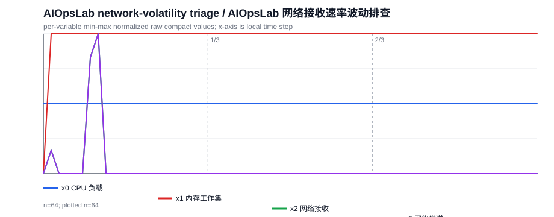

**Domain/source:** `aiopslab_official_v3`

**Task family:** `aiops_official_network_volatility`

**Row ID:** `multisim_qcc_v5_aiops_v3::aiopslab_official_v3::aiopslab_official::port_misconfig_seed0_user-service::case000::aiops_official_network_volatility`

**Reviewer:** `decision=keep`, `naturalness=5`, `answerability=5`, `risk=low`

**Scene EN:** An SRE is reviewing an AIOpsLab microservice telemetry window. x0 is service CPU load, x1 is memory working set, x2 is network receive rate, and x3 is network transmit rate.

**场景中文:** 一名 SRE 正在查看 AIOpsLab 微服务遥测窗口。x0 是服务 CPU 负载，x1 是内存工作集，x2 是网络接收速率，x3 是网络发送速率。

**Question EN:** Which part of the window should the operator treat as the most variable for network receive rate?

**问题中文:** 运维人员应该把窗口的哪一段视为网络接收速率波动最大的部分？

**Options / 选项:**

- A. middle / 中期
- B. late / 后期
- C. similar thirds / 三段相近
- D. early / 早期

**Gold:** `D` / early / 早期

**Evidence EN:** The window is split into three equal time sections, and the standard-deviation comparison across those sections selects the early part of the window.

**证据中文:** 窗口按时间三等分后比较标准差，结果选择早期。

**Support slots:** `region_stds={early=305.6, middle=0, late=0}`, `answer_label=early`, `window_start=0`, `window_end=64`

**原始问题:** Which third of the window has the highest volatility in network receive rate x2?

**设计说明:** 该题保留为纯遥测正例；metadata/provenance/fault-context 类问题则单独排除。

**Reviewer 说明:** 题目读起来像正常的运维分析问题，场景中已说明 x2 是网络接收速率，问题要求判断窗口中网络接收速率波动最大的时间段。选项为早期、中期、后期、三段相近，和证据中的“三等分后比较标准差”一致。支持槽给出了各段标准差并确定早期，答案可由确定性支持信息直接得到，没有明显隐藏元数据或未解释阈值问题。

## 3. 跨域观察

- `Grid2Op` 的关键是把反事实差值方向、global/local 时间轴和 lead-lag 判定规则写清楚。
- `CityLearn` 的高质量问题通常不是简单问均值，而是把负载统计转成控制器的需求压力或尖峰检测判断。
- `FinRL` 必须明确 ticker、价格序列和金融规则，避免出现“股票代码由问题指定”这种不自然描述。
- `Traffic` 的 lead-lag 问题需要特别谨慎；负相关时要写绝对相关强度，并说明同步相关与最佳滞后之间的差距。
- `Water` 适合做供水状态、事件恢复和综合压力判断，这些题天然需要领域状态词和数值证据结合。
- `AIOpsLab` 必须把纯遥测问题和 metadata-only 问题分开；metadata/provenance/fault-context 不应进入纯 TS-QA 正例池。

## 4. 产物索引

| 类型 | 路径 |
| --- | --- |
| 自然化 QA JSONL | `.research/general-qcc-captioner-20260515/natural_qa_balanced8_20260519/natural_multisim_v5_balanced8.jsonl` |
| GPT-5.5 reviewer 报告 | `.research/general-qcc-captioner-20260515/natural_qa_balanced8_20260519/NATURAL_QA_BALANCED8_REVIEW_20260519_ZH.md` |
| 本 case study 报告 | `.research/general-qcc-captioner-20260515/natural_qa_balanced8_20260519/NATURAL_QA_BALANCED8_CASE_STUDY_ANALYSIS_20260519_ZH.md` |
| 时序图目录 | `.research/general-qcc-captioner-20260515/natural_qa_balanced8_20260519/figures/` |
