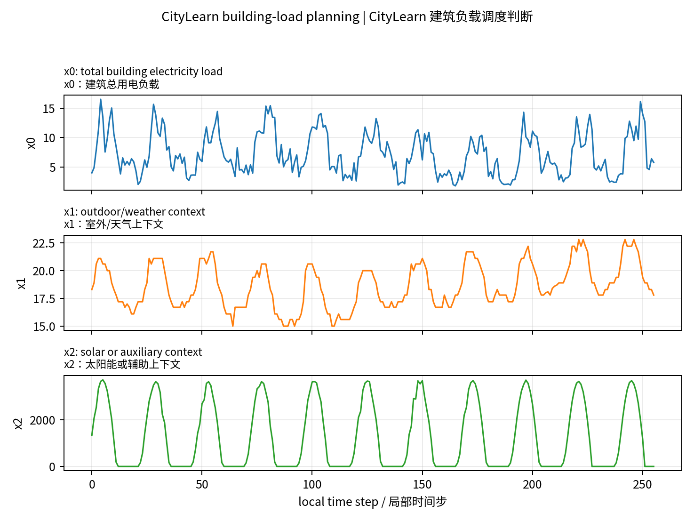
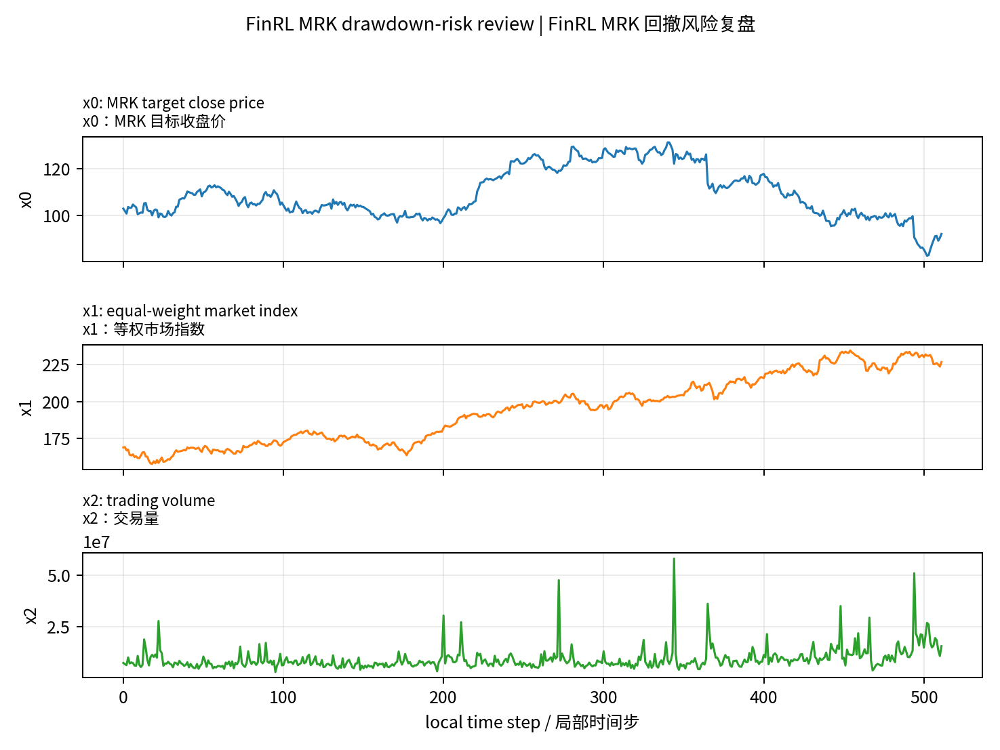
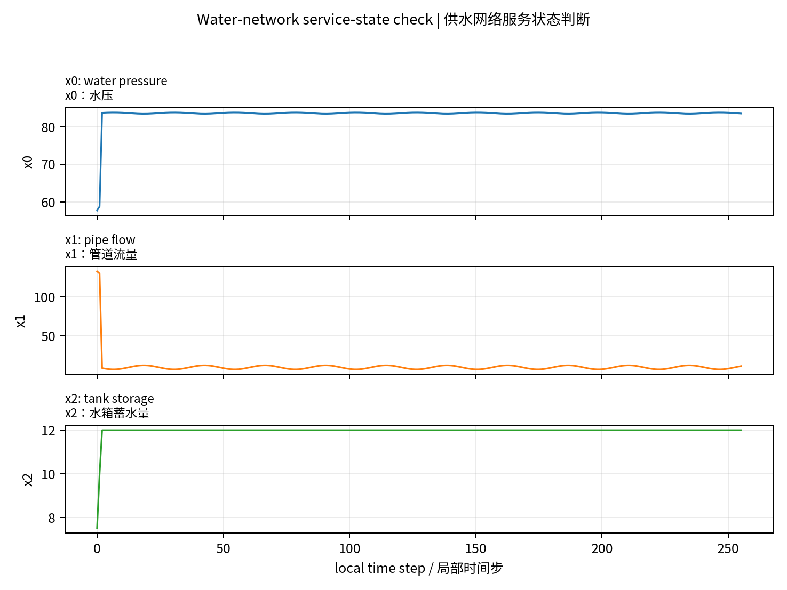
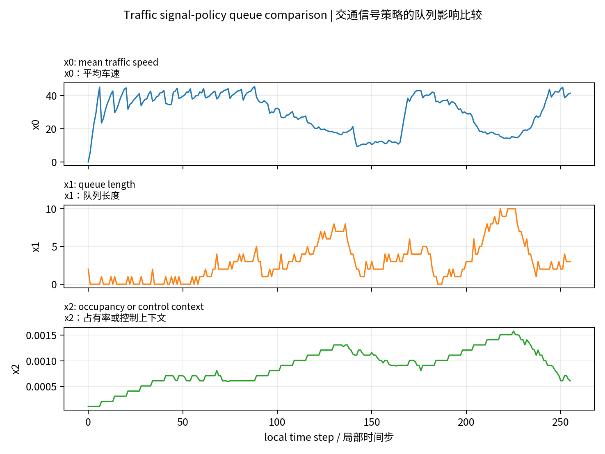
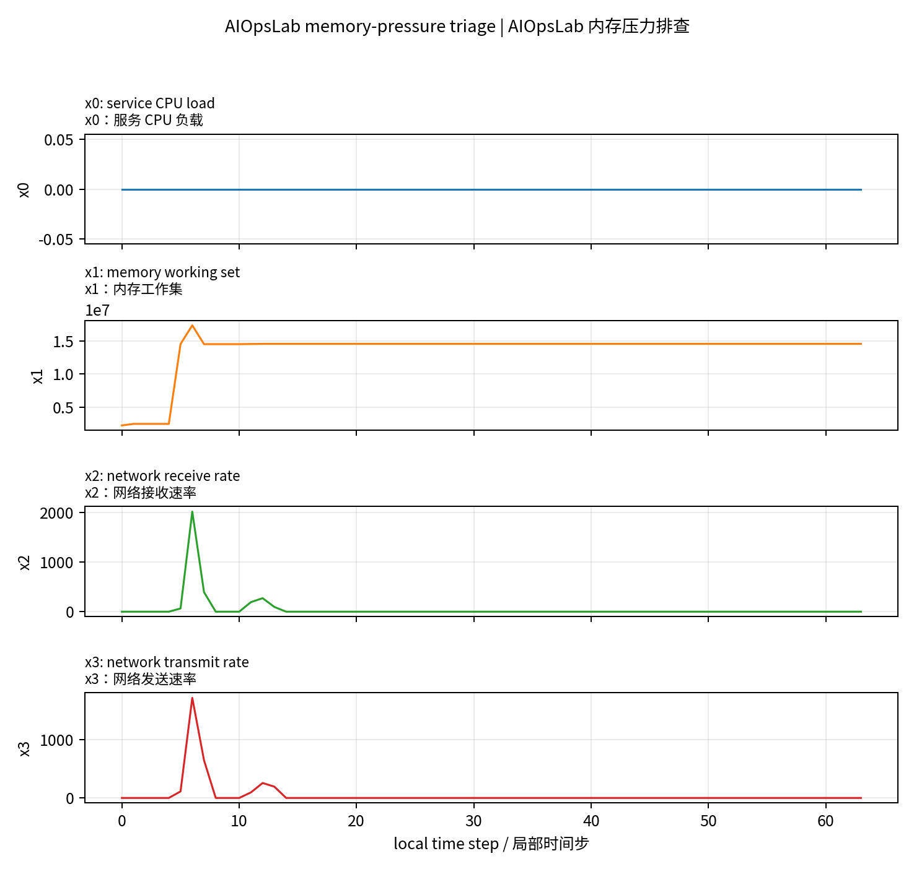

# Natural TS-QA Case Pilot（2026-05-19）

目标：把 MultiSim/QCC case study 从“slot/verifier 拼接题”改成更像正常 QA 的自然语言问题，同时保持答案仍由 deterministic support slots 验证。这里先给 6 个小样本供人工审核；审核通过后再扩展到大规模造数据。

设计原则：

- 场景说明负责交代 domain、变量含义、时间轴和必要背景。
- 问题本身只问一个自然决策，不暴露内部 row id、segment tag、verifier 实现细节。
- 选项是普通读者能理解的短答案，不是 support slot 名称。
- gold answer 不由 LLM 决定，只从原始 support slots 映射。
- reviewer 可以评审自然性和可答性，但不能改 gold。

## 1. Grid2Op line-disconnection stress check（Grid2Op 断线后的线路压力检查）

**Domain/source:** `grid2op`  
**Task family:** `grid_counterfactual_peak_stress`  
**Row ID:** `multisim_qcc_v5_aiops_v3::grid2op::grid2op_broad_cf::h2048_c-1_t512_line1::post769_1025::grid_counterfactual_peak_stress`

**Scene EN:** A Grid2Op operator is reviewing a 256-step local window after line 1 was disconnected. The disconnection happened earlier at global step 512; this plot starts at global step 769, so every point shown is already post-event. In this counterfactual plot, positive x0 means the disconnection makes maximum line-loading stress higher than the original factual run.

**场景中文:** 一名 Grid2Op 电网调度员正在查看 1 号线路断开后的 256 步局部窗口。断线发生在更早的全局第 512 步；这张图从全局第 769 步开始，因此图中所有点都已经是事件后片段。在这张反事实图里，x0 为正表示断线让最大线路负载压力高于原始事实运行。

**Question EN:** In this post-event window, what is the main effect of disconnecting line 1 on maximum line-loading stress?  
**问题中文:** 在这个事件后窗口里，断开 1 号线路对最大线路负载压力的主要影响是什么？

**Options / 选项:**

- A. It mainly lowers the stress. / 主要降低线路压力。
- B. It causes no material stress change. / 没有造成实质压力变化。
- C. It raises the stress with a clear positive deviation. / 产生清晰的正向偏差，使线路压力升高。
- D. The plotted window is not enough to tell. / 仅凭这个窗口无法判断。

**Gold:** `C` / 产生清晰的正向偏差，使线路压力升高。

**Evidence EN:** x0 stays positive throughout the post-event segment, with post-event differences from about 0.37 to 0.56.  
**证据中文:** 事件后片段里 x0 始终为正，差值大约在 0.37 到 0.56 之间。

**Support slots:** `max_x0_diff=0.5586962103843689`, `min_x0_diff=0.3663806915283203`, `answer_label=larger upward peak`, `line_id=1`, `intervention_step=512`, `post_start=0`, `global_post_start=513`, `segment_start=769`, `segment_end=1025`, `segment_tag=post769_1025`

**原始问题:** The provided trace is intervention-minus-factual after disconnecting line 1 at global step 512, shown in segment post769_1025. What is the strongest post-event stress deviation in x0?

**设计说明:** 把 global step 和局部窗口的关系放进场景说明，问题本身只问调度员关心的效果。

## 2. CityLearn building-load planning（CityLearn 建筑负载调度判断）

**Domain/source:** `citylearn`  
**Task family:** `city_window_total_load`  
**Row ID:** `multisim_qcc_v5_aiops_v3::citylearn::citylearn_broad::citylearn_challenge_2022_phase_1_start6144_h2048_b5::w1664_1920::city_window_total_load`

**Scene EN:** A building energy controller uses x0 as the electricity demand signal. Higher average x0 means the controller should reserve more grid or battery supply for that part of the window.

**场景中文:** 建筑能耗控制器把 x0 作为用电需求信号。x0 平均值越高，表示这一段需要预留更多电网或电池供给。

**Question EN:** For this window, when should the controller plan for higher average electricity demand?  
**问题中文:** 在这个窗口里，控制器应该在哪一段为更高的平均用电需求做准备？

**Options / 选项:**

- A. The second half of the window. / 窗口后半段。
- B. The first half of the window. / 窗口前半段。
- C. Both halves are about the same. / 前后两半差不多。
- D. The plot is not enough to determine this. / 仅凭图无法判断。

**Gold:** `B` / 窗口前半段。

**Evidence EN:** The first-half mean of x0 is 7.77, higher than the second-half mean of 6.65.  
**证据中文:** x0 前半段均值为 7.77，高于后半段均值 6.65。

**Support slots:** `first_mean=7.773307588367187`, `second_mean=6.645089904023438`, `answer_label=first half higher`, `window_start=1664`, `window_end=1920`, `trace_bucket_group=citylearn_challenge_2022_phase_1_start6144_h2048_b5::bucket06`

**原始问题:** Is total building load x0 higher in the first half or the second half of the window?

**设计说明:** 从“比较均值”改成“建筑控制器做供能计划”的自然决策问题。

## 3. FinRL MRK drawdown-risk review（FinRL MRK 回撤风险复盘）

**Domain/source:** `finrl_scaled`  
**Task family:** `fin_drawdown_price`  
**Row ID:** `multisim_qcc_v5_aiops_v3::finrl_scaled::finrl_broad::MRK::w2043_2555::fin_drawdown_price`

**Scene EN:** A risk analyst is reviewing the MRK price window. In this setting, drawdown means the largest peak-to-trough percentage loss inside the window; a fall around one third of the price level is treated as severe.

**场景中文:** 一名风险分析师正在复盘 MRK 的价格窗口。这里的回撤指窗口内从峰值到谷值的最大百分比损失；接近三分之一价格水平的下跌应视为严重回撤。

**Question EN:** From a risk-management perspective, how should this MRK window be described?  
**问题中文:** 从风险管理角度看，这段 MRK 窗口应该如何描述？

**Options / 选项:**

- A. Moderate drawdown. / 中等回撤。
- B. Mild drawdown. / 轻微回撤。
- C. Severe drawdown. / 严重回撤。
- D. Little drawdown. / 回撤很小。

**Gold:** `C` / 严重回撤。

**Evidence EN:** The maximum drawdown is about 36.65% during the 2023-02-14 to 2025-02-28 review window.  
**证据中文:** 在 2023-02-14 到 2025-02-28 的复盘窗口中，最大回撤约为 36.65%。

**Support slots:** `max_drawdown=-0.3664664534790538`, `drawdown_peak_index=340`, `drawdown_trough_index=502`, `answer_label=severe drawdown`, `window_start=2043`, `window_end=2555`, `date_start=2023-02-14`, `date_end=2025-02-28`

**原始问题:** What drawdown regime best describes MRK target price x0 in this window?

**设计说明:** 明确股票是 MRK，不再写“ticker named in the question”；问题面向风险管理语境。

## 4. Water-network service-state check（供水网络服务状态判断）

**Domain/source:** `water`  
**Task family:** `water_domain_resilience_context`  
**Row ID:** `multisim_qcc_v5_aiops_v3::water::water_broad::water_scenario_015::water_domain_resilience_context`

**Scene EN:** A water-network operator is checking whether the service looks stressed. Low pressure would suggest service risk, while stable pressure with ordinary flow is consistent with normal operation.

**场景中文:** 供水网络运维人员正在判断服务是否承压。低水压会提示供水风险；水压稳定且流量正常则更符合正常运行。

**Question EN:** Which operational state best matches this water-network window?  
**问题中文:** 这个供水网络窗口最符合哪种运行状态？

**Options / 选项:**

- A. Leak-stressed network. / 漏水压力下的网络。
- B. Low-pressure service risk. / 低水压服务风险。
- C. Unclear hydraulic state. / 水力状态不清楚。
- D. Stable water service. / 稳定供水服务。

**Gold:** `D` / 稳定供水服务。

**Evidence EN:** Mean pressure is 83.43, minimum pressure is 57.73, and mean flow is 10.71, matching a stable-service label.  
**证据中文:** 平均水压为 83.43，最低水压为 57.73，平均流量为 10.71，对应稳定供水服务标签。

**Support slots:** `mean_pressure=83.42916676402092`, `min_pressure=57.73121643066406`, `mean_flow=10.705253700507456`, `answer_label=stable water service`, `window_start=0`, `window_end=256`, `event_index=None`, `event_label=no pronounced leak`

**原始问题:** What operational water-network condition best describes this window?

**设计说明:** 用水务运维状态来表达，而不是直接问某个统计量。

## 5. Traffic signal-policy queue comparison（交通信号策略的队列影响比较）

**Domain/source:** `traffic`  
**Task family:** `traffic_signal_counterfactual_queue`  
**Row ID:** `multisim_qcc_v5_aiops_v3::traffic::traffic_broad::traffic_scenario_025::traffic_signal_counterfactual_queue`

**Scene EN:** A traffic engineer compares an adaptive signal policy against a matched fixed-signal baseline under the same demand window. For queue length, lower is better.

**场景中文:** 交通工程师在相同需求窗口下比较自适应信号策略和匹配的固定信号基线。对队列长度来说，越低越好。

**Question EN:** Did the adaptive signal policy improve queueing in this window?  
**问题中文:** 在这个窗口里，自适应信号策略是否改善了排队情况？

**Options / 选项:**

- A. Yes, it lowered the mean queue. / 是，它降低了平均队列长度。
- B. The two policies have the same mean queue. / 两种策略的平均队列长度相同。
- C. The mean queue values are not enough to decide. / 给出的平均队列长度不足以判断。
- D. No, it raised the mean queue. / 没有，它提高了平均队列长度。

**Gold:** `D` / 没有，它提高了平均队列长度。

**Evidence EN:** The adaptive-signal mean queue is 2.91, higher than the matched fixed-signal baseline mean of 2.56.  
**证据中文:** 自适应信号下平均队列为 2.91，高于匹配固定信号基线的 2.56。

**Support slots:** `factual_mean=2.91015625`, `counterfactual_mean=2.55859375`, `delta=0.3515625`, `counterfactual_var=1`, `answer_label=higher queue under adaptive signal`, `window_start=0`, `window_end=256`, `event_index=141`, `event_label=middle`

**原始问题:** Compared with the matched fixed-signal baseline, how does the traffic-control scenario change mean queue length?

**设计说明:** 把“factual vs baseline”改成交通工程师关心的策略是否改善排队。

## 6. AIOpsLab memory-pressure triage（AIOpsLab 内存压力排查）

**Domain/source:** `aiopslab_official_v3`  
**Task family:** `aiops_official_window_memory`  
**Row ID:** `multisim_qcc_v5_aiops_v3::aiopslab_official_v3::aiopslab_official::scale_pod_zero_seed0_user-service::case005::aiops_official_window_memory`

**Scene EN:** An SRE is triaging an AIOpsLab microservice incident window. The memory working set x1 is used as a memory-pressure signal; a higher second-half average means pressure is building rather than easing.

**场景中文:** 一名 SRE 正在排查 AIOpsLab 微服务事故窗口。内存工作集 x1 用作内存压力信号；后半段平均值更高表示压力在累积，而不是缓解。

**Question EN:** Does memory pressure ease or build up over this incident window?  
**问题中文:** 在这个事故窗口中，内存压力是在缓解还是在累积？

**Options / 选项:**

- A. It is higher in the first half, so pressure eases later. / 前半段更高，因此后面压力缓解。
- B. It is higher in the second half, so pressure builds up. / 后半段更高，因此压力在累积。
- C. Both halves are about the same. / 前后两半差不多。
- D. The telemetry is not enough to tell. / 这些遥测不足以判断。

**Gold:** `B` / 后半段更高，因此压力在累积。

**Evidence EN:** The first-half mean of x1 is 12,725,660.44, while the second-half mean is 14,534,246.40.  
**证据中文:** x1 前半段均值为 12,725,660.44，后半段均值为 14,534,246.40。

**Support slots:** `first_mean=12725660.444444444`, `second_mean=14534246.399999999`, `answer_label=second half higher`, `window_start=0`, `window_end=64`

**原始问题:** Is memory working set x1 higher in the first half or the second half of the window?

**设计说明:** 把窗口均值比较转成 SRE 事故排查中的“压力是否累积”。
