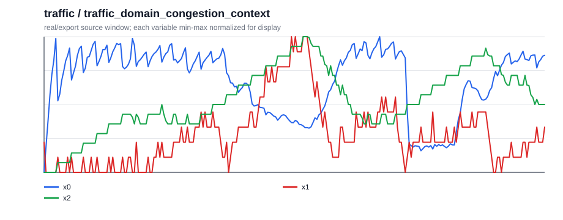
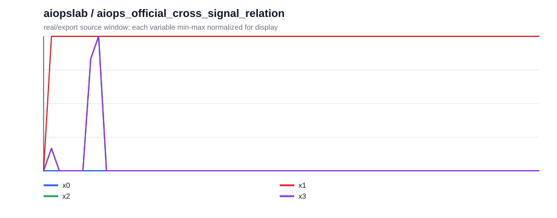
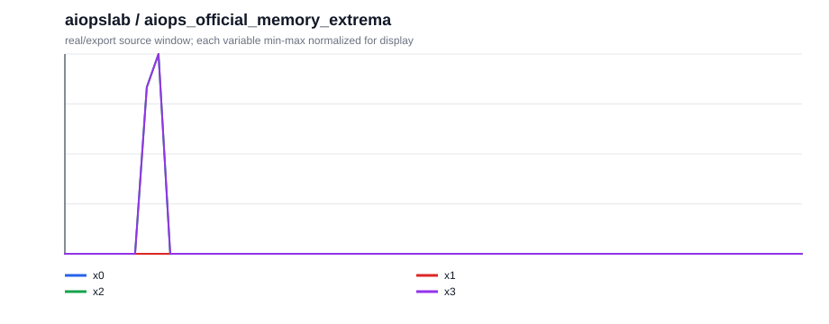

# Natural-QCC Case Quality v1（2026-05-21）

这版不追求扩量，只检查一个更严格的问题：题目是否自足，变量和业务规则是否说清楚，caption 是否围绕问题答案给出时序证据，而不是罗列内部 support slots。

## 设计标准

- 场景必须说明用户是谁、变量是什么、时间窗口怎么看。
- 如果答案需要领域规则，规则必须写在题目前。
- 问题必须像正常业务问题，不暴露 `segment_tag`、`post257_769` 等内部字段。
- caption 必须先描述和问题有关的时序形态，再解释为什么支持答案。
- 少量关键数值可以出现，但 support slots 只做后台 audit，不应成为正文主体。

## Case Studies

### 1. `grid2op` / `grid_counterfactual_overload_exposure`

**场景：** 一名电网调度员在复盘一次断线仿真。图中 x0 表示断线后相对于原运行的线路压力变化，x1 是总需求，x2 是断线后的最大线路负载压力；x0 为正表示断线后压力更高。

**前置规则：** 最大线路负载压力超过 1.0 通常表示线路进入过载风险区。过载暴露指窗口内超过这个阈值的时间比例；比例越高，调度风险越大。图中 x0 是断线后相对原运行的压力差，正值表示断线后压力更高；最终判断看原运行和断线后轨迹的过载暴露差异。

**问题：** 这次断线对事件后窗口的过载风险造成了什么影响？

**选项：**

- A. 过载风险降低
- B. 过载风险接近不变
- C. 过载风险升高
- D. 证据不足

**答案：** `C` / 过载风险升高

**中文 caption：** 断开线路后，干预轨迹中的最大线路负载压力在大部分事件后窗口进入过载区，而原运行几乎没有过载：原运行过载暴露为 0.00，断线后为 0.90。因此这次断线主要是提高过载风险。

**English target caption：** After the line is disconnected, the intervention trace spends much more of the post-event window above the overload threshold, with overload exposure rising from 0.00 to 0.90. This supports the answer that the disconnection increases overload exposure.

**Audit source row：** `grid2op_broad_cf::h1024_c-1_t256_line1::post257_769::grid_counterfactual_overload_exposure`

### 2. `grid2op` / `grid_domain_stress_context`

**场景：** 一名电网调度员在查看一个 Grid2Op 运行窗口。x0 是最大线路负载压力，x1 是总需求，x2 是发电裕度或电网上下文。

**前置规则：** x0 是最大线路负载压力。整段均值接近 0.9 且只有短时峰值超过 1.0，更像中等压力；如果长时间高于 1.0 才更接近高压力运行；如果整体远低于 1.0 则是低压力运行。

**问题：** 从整段窗口看，这次运行更接近哪种电网压力状态？

**选项：**

- A. 高压力运行
- B. 低压力运行
- C. 中等压力运行
- D. 压力状态不清楚

**答案：** `C` / 中等压力运行

**中文 caption：** 这段电网窗口的最大线路负载压力整体处在中等偏高水平：平均 x0 约为 0.86，峰值约为 1.12，峰值短暂超过 1.0 但不是整段持续高压。所以它更像中等电网压力，而不是低压力或持续高压力。

**English target caption：** Maximum line-loading stress is moderate overall: mean x0 is about 0.86, and the peak reaches about 1.12. The window has a short overload-level peak but not sustained high stress.

**Audit source row：** `grid2op_broad::rte_case14_realistic_chronic0_trace_2048_nooverflow::w0_1024::grid_domain_stress_context`

### 3. `citylearn` / `city_domain_demand_context`

**场景：** 建筑能耗控制器在查看 CityLearn 窗口。x0 是建筑总用电负荷，x1 是室外温度/天气上下文，x2 是太阳能或辅助上下文信号。

**前置规则：** 建筑能耗控制里，x0 是总用电负荷；负荷长期偏高且峰值高，意味着需要预留更多电网供电或储能。这个 case 中，平均负荷超过约 6 且峰值超过约 15 时，按高需求压力处理。

**问题：** 从供能预留角度看，这段窗口属于哪种建筑需求压力？

**选项：**

- A. 中等需求压力
- B. 低需求压力
- C. 高需求压力
- D. 需求压力不清楚

**答案：** `C` / 高需求压力

**中文 caption：** 建筑总负荷 x0 在窗口内维持较高水平，平均约 6.54，峰值达到 15.37。这说明控制器应把它看作高需求压力窗口，需要提前考虑供电或储能预留。

**English target caption：** Total building load stays elevated, with mean x0 about 6.54 and a peak near 15.37. The window therefore supports a high demand-pressure planning decision.

**Audit source row：** `citylearn_broad::citylearn_challenge_2022_phase_1_start0_h2048_b5::w0_1024::city_domain_demand_context`

### 4. `citylearn` / `city_window_total_load`

**场景：** 建筑控制器把这个 CityLearn 窗口分成前后两段来安排供能。x0 是总用电负荷，负荷越高，越需要预留电网供电或储能。

**前置规则：** 如果前半段平均负荷高于后半段，控制器应优先关注前半段的供能安排；如果后半段更高，则应把预留资源留到后半段。

**问题：** 如果只能优先为半个窗口预留供能，应该优先覆盖哪一段？

**选项：**

- A. 后半段
- B. 两段接近
- C. 前半段
- D. 无法判断

**答案：** `C` / 前半段

**中文 caption：** 窗口前半段平均负荷约为 6.97，后半段约为 6.11。前半段明显更高，因此供能计划应优先覆盖窗口前半段的需求。

**English target caption：** The first half has higher average load, about 6.97, compared with 6.11 in the second half. This supports prioritizing supply reserve earlier in the window.

**Audit source row：** `citylearn_broad::citylearn_challenge_2022_phase_1_start0_h2048_b5::w0_1024::city_window_total_load`

### 5. `traffic` / `traffic_domain_congestion_context`

**场景：** 交通工程师在查看 SUMO 路网窗口。x0 是平均车速，x1 是排队长度，x2 是车道占有率。

**前置规则：** 交通窗口里，x0 是平均车速，x1 是排队长度，x2 是车道占有率。低车速和长队列表示拥堵加重；在这个 case 中，平均车速约 30 且最大队列接近 9 时，按严重拥堵处理。

**问题：** 从车速和队列看，这段窗口最像哪种交通状态？

**选项：**

- A. 严重拥堵
- B. 中等拥堵
- C. 基本畅通
- D. 状态不清楚

**答案：** `A` / 严重拥堵

**中文 caption：** 这段路网的平均车速只有约 30.96，同时最大队列达到 9.00。低速和长队列同时出现，说明它更接近严重拥堵，而不是自由流或轻中度拥堵。

**English target caption：** The road segment is slow and queued: mean speed is about 30.96, while maximum queue length reaches 9.00. Those signals support a severe congestion interpretation.

**Audit source row：** `traffic_broad::traffic_scenario_002::traffic_domain_congestion_context`

### 6. `traffic` / `traffic_event_recovery_context`

**场景：** 交通工程师在复盘一次事件前后窗口。x0 是平均车速；事件后如果车速回到事件前水平，才算明显恢复。

**前置规则：** 事件恢复判断看事件前、事件中、事件后的平均车速。若事件后速度仍接近事件期低速，而没有回到事件前水平，说明拥堵仍在持续。

**问题：** 事件后，这段交通状态是恢复了、继续拥堵，还是出现速度过冲？

**选项：**

- A. 车速恢复
- B. 拥堵仍在持续
- C. 车速过冲
- D. 没有事件恢复证据

**答案：** `B` / 拥堵仍在持续

**中文 caption：** 事件前平均车速约 42.70，事件中降到 13.68，事件后也只有 15.01。事件后速度没有恢复到事件前水平，所以拥堵仍在持续。

**English target caption：** Speed drops from about 42.70 before the event to 13.68 during it, and remains low at about 15.01 afterward. This indicates persistent congestion rather than recovery.

**Audit source row：** `traffic_broad::traffic_scenario_000::traffic_event_recovery_context`

### 7. `water` / `water_domain_resilience_context`

**场景：** 供水网络运维人员在查看 WNTR 窗口。x0 是服务水压，x1 是管道流量，x2 是水箱蓄水量。

**前置规则：** 供水网络中，x0 是服务水压，x1 是管道流量，x2 是水箱蓄水量。若窗口内最低水压明显低于平均水平，并伴随持续流量，通常更像漏损或服务压力风险，而不是完全稳定服务。

**问题：** 从水压和流量看，这段窗口更像哪种供水服务状态？

**选项：**

- A. 低水压风险
- B. 漏损压力状态
- C. 供水服务稳定
- D. 水力状态不清楚

**答案：** `B` / 漏损压力状态

**中文 caption：** 窗口内平均水压约 80.51，但最低水压降到 56.29，平均流量约 9.46。水压出现明显低点且伴随供水流量，说明网络处于漏损压力状态，而不是稳定服务。

**English target caption：** Pressure is not uniformly stable: mean pressure is about 80.51, but the minimum drops to 56.29, with mean flow about 9.46. This supports a leak-stressed network state.

**Audit source row：** `water_broad::water_scenario_002::water_domain_resilience_context`

### 8. `water` / `water_leak_counterfactual_pressure`

**场景：** 供水运维人员在比较漏损场景和匹配的无漏损基线。x0 是服务水压，比较目标是平均水压是否被漏损明显改变。

**前置规则：** 这里比较漏损场景和匹配的无漏损基线。若两者平均水压几乎相同，则不能说漏损显著改变了服务压力。

**问题：** 与无漏损基线相比，这个漏损场景是否明显改变了平均服务水压？

**选项：**

- A. 漏损使水压降低
- B. 漏损使水压升高
- C. 影响方向混合
- D. 水压没有实质变化

**答案：** `D` / 水压没有实质变化

**中文 caption：** 漏损场景的平均水压约 74.61，匹配的无漏损基线也是 74.61，差值约为 0.00。两条条件下的水压几乎相同，因此不能说漏损显著改变了平均服务水压。

**English target caption：** The leak scenario and no-leak baseline have nearly identical mean pressure: 74.61 versus 74.61, with a difference near 0.00. This supports no material pressure change.

**Audit source row：** `water_broad::water_scenario_000::water_leak_counterfactual_pressure`

### 9. `aiopslab` / `aiops_official_cross_signal_relation`

**场景：** 一名 SRE 在查看 AIOpsLab 指标窗口。x0 是 CPU 负载，x1 是内存工作集，x2 是网络接收速率，x3 是网络发送速率。

**前置规则：** AIOps 指标中，CPU 和内存常用于判断计算/资源压力，网络接收和发送常用于判断通信模式。如果网络收发几乎同步，而 CPU-内存关系弱，则主要耦合来自网络侧。

**问题：** 这段 telemetry 里最明显的是哪组指标耦合？

**选项：**

- A. CPU 和内存耦合
- B. 两组关系接近
- C. 两组关系都弱
- D. 网络接收和发送耦合

**答案：** `D` / 网络接收和发送耦合

**中文 caption：** 网络接收 x2 和发送 x3 几乎完全同步，相关约 1.00；CPU x0 与内存 x1 的相关约 0.00。因此这段窗口主要体现网络收发耦合，而不是 CPU-内存耦合。

**English target caption：** Network receive and transmit move together with correlation about 1.00, while CPU-memory correlation is about 0.00. The evidence therefore points to network rx-tx coupling.

**Audit source row：** `aiopslab_official::port_misconfig_seed0_user-service::case000::aiops_official_cross_signal_relation`

### 10. `aiopslab` / `aiops_official_memory_extrema`

**场景：** SRE 只关注服务内存工作集 x1 的峰值位置。窗口从左到右分为早段、中段和后段。

**前置规则：** 内存工作集 x1 越高，表示服务占用内存越多。这个问题只判断峰值位置：最高点在哪个阶段出现。

**问题：** 服务内存工作集的最高点出现在窗口哪个阶段？

**选项：**

- A. 中段
- B. 早段
- C. 后段
- D. 没有清晰峰值

**答案：** `B` / 早段

**中文 caption：** 内存工作集 x1 的最高值出现在窗口最开始的早段，峰值约 798720.00。后续中段和后段没有超过这个早段峰值，所以答案是早段。

**English target caption：** Memory working set x1 peaks at the very beginning of the window, with value about 798720.00. The middle and late portions do not exceed that early peak.

**Audit source row：** `aiopslab_official::port_misconfig_seed0_post-storage-service::case002::aiops_official_memory_extrema`

### 11. `finrl` / `fin_domain_market_regime`

**场景：** 市场分析师在复盘 MSFT 的历史 OHLCV 窗口。x0 是 MSFT 价格，x1 是市场背景价格信号，x2 是成交量。

**前置规则：** 金融窗口中，x0 是 MSFT 价格，x1 是市场背景价格信号，x2 是成交量。行情状态同时看总收益和收益波动：收益接近零但波动较高，更像高波动横盘。

**问题：** 从收益方向和波动看，这段 MSFT 窗口最像哪种行情？

**选项：**

- A. 偏多行情
- B. 高波动横盘
- C. 偏空行情
- D. 低波动横盘

**答案：** `B` / 高波动横盘

**中文 caption：** MSFT 在这个窗口里的总收益接近零，约 0.19%，但收益波动约 0.065。也就是说价格没有明确单边上涨或下跌，却有明显波动，因此更像高波动横盘。

**English target caption：** MSFT has little net direction in this window, with total return about 0.19%, but return volatility is about 0.065. That combination supports a volatile sideways regime.

**Audit source row：** `finrl_broad::MSFT::w0_32::fin_domain_market_regime`

### 12. `finrl` / `fin_drawdown_price`

**场景：** 市场分析师在查看 MSFT 价格风险。x0 是目标资产价格；回撤表示价格从阶段高点跌到后续低点的比例。

**前置规则：** 回撤表示价格从阶段高点跌到后续低点的幅度。这个 case 采用透明阈值：5% 以下是很小回撤，5%-15% 是轻微回撤，15%-25% 是中等回撤，25% 以上是严重回撤。

**问题：** 从最大回撤看，这段 MSFT 价格风险属于哪一档？

**选项：**

- A. 严重回撤
- B. 中等回撤
- C. 很小回撤
- D. 轻微回撤

**答案：** `D` / 轻微回撤

**中文 caption：** MSFT 在窗口后段从阶段高点回落到低点，最大回撤约 13.08%。这个幅度超过很小回撤，但还不到严重回撤，因此更适合标为轻微回撤。

**English target caption：** MSFT falls from a local peak to a later trough with maximum drawdown about 13.08%. That is more than a tiny dip but not severe, supporting a mild drawdown label.

**Audit source row：** `finrl_broad::MSFT::w0_32::fin_drawdown_price`
