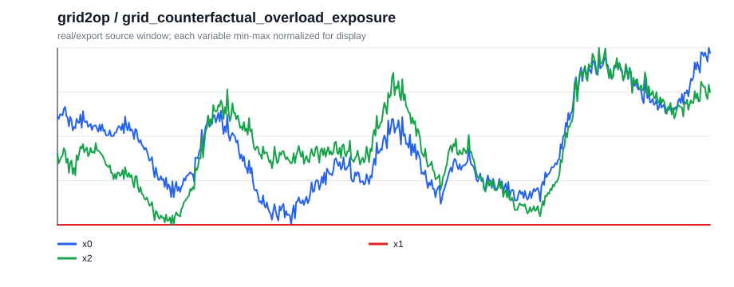
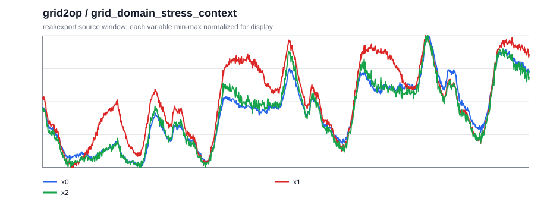
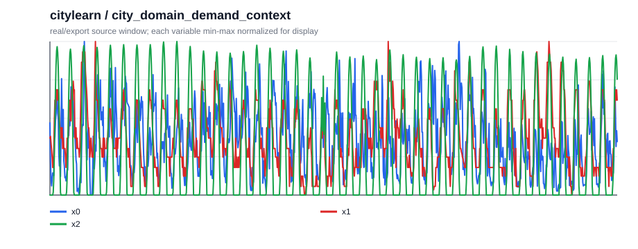
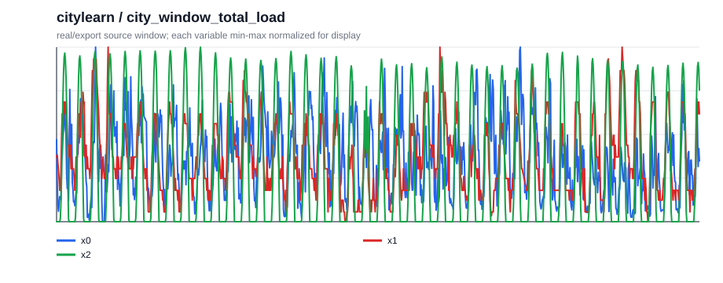
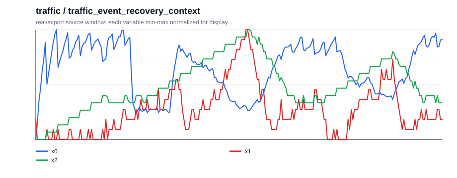
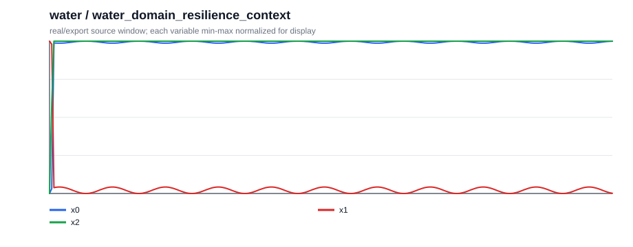
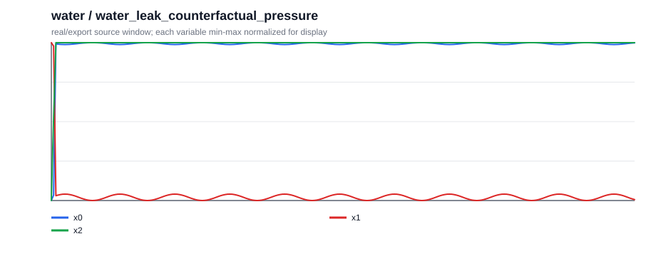
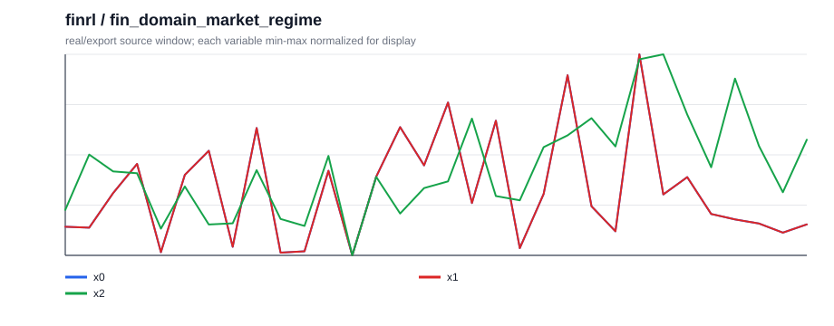
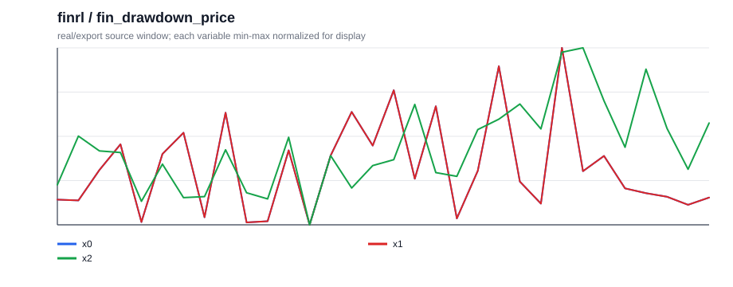

# Natural-QCC Case Quality v2（2026-05-21）

## 这版修了什么

v2 专门回应上一轮 case 的可读性问题：去掉 simulator 名称，补清变量含义，说明对照/基线，删除英文 caption 的 answer-support 模板句，并让中英文 caption 聚焦同一组证据。

- case 数量：12
- 分域：{'grid2op': 2, 'citylearn': 2, 'traffic': 2, 'water': 2, 'aiopslab': 2, 'finrl': 2}
- audit pass：True

## Case Studies

### 1. `grid2op` / `grid_counterfactual_overload_exposure`

**场景：** 一名电网调度员在复盘计划断线。图中正常基线表示同一负荷条件下不执行断线的运行，断线轨迹表示执行计划断线后的运行；x0 是断线轨迹减正常基线的线路压力差，x2 是断线后的最大线路负载压力。

**前置规则：** 最大线路负载压力超过 1.0 表示进入过载风险区。过载暴露是窗口内高于 1.0 的时间比例。比较断线轨迹和正常基线时，如果断线后的过载暴露明显更高，就说明计划断线提高了过载风险。

**问题：** 和正常基线相比，这次计划断线会怎样改变事件后窗口的过载风险？

**选项：**

- A. 过载风险降低
- B. 过载风险接近不变
- C. 过载风险升高
- D. 证据不足

**答案：** `C` / 过载风险升高

**中文 caption：** 同一负荷条件下的正常基线在事件后窗口没有进入过载区，而计划断线后的最大线路负载压力大部分时间超过 1.0。过载暴露从基线的 0.00 变为断线后的 0.90，因此这段时序证据指向过载风险升高。

**English target caption：** The matched normal baseline stays below the overload threshold for this post-event window, while the planned-outage trace is above 1.0 for most of it. Overload exposure changes from 0.00 in the baseline to 0.90 after the outage, so the relevant time-series evidence points to higher overload risk.

**Audit source row：** `grid2op_broad_cf::h1024_c-1_t256_line1::post257_769::grid_counterfactual_overload_exposure`

### 2. `grid2op` / `grid_domain_stress_context`

**场景：** 一名电网调度员在查看运行窗口。x0 是最大线路负载率，数值越接近或超过 1.0，线路压力越高；x1 是总需求；x2 是备用裕度指标，数值越低表示调度余量越紧。

**前置规则：** 从整段窗口判断电网压力时，先看 x0 的整体水平，再看是否长时间超过 1.0。均值接近 0.9 且只有短暂峰值超过 1.0，更像中等压力；若长时间高于 1.0，则更接近高压力运行。

**问题：** 从整段窗口看，这次运行更接近哪种电网压力状态？

**选项：**

- A. 高压力运行
- B. 低压力运行
- C. 中等压力运行
- D. 压力状态不清楚

**答案：** `C` / 中等压力运行

**中文 caption：** 最大线路负载率整体偏高但没有长时间处在过载区：x0 均值约 0.86，峰值约 1.12。曲线只是短暂超过 1.0，而不是形成持续高压平台，因此更符合中等压力运行。

**English target caption：** Maximum line-loading stress is elevated but not sustained at overload level: mean x0 is about 0.86, and the peak is about 1.12. The series has a short excursion above 1.0 rather than a long high-stress plateau, which matches a medium-stress operating state.

**Audit source row：** `grid2op_broad::rte_case14_realistic_chronic0_trace_2048_nooverflow::w0_1024::grid_domain_stress_context`

### 3. `citylearn` / `city_domain_demand_context`

**场景：** 建筑能耗控制器在查看建筑负荷窗口。x0 是建筑总用电负荷；x1 是室外温度，代表天气带来的用能压力；x2 是本地太阳能发电强度，可抵消部分电网供电需求。

**前置规则：** 供能预留看总负荷的整体水平和峰值。若 x0 长时间偏高，且峰值超过约 15，控制器应按高需求压力准备更多电网供电或储能。

**问题：** 从供能预留角度看，这段窗口属于哪种建筑需求压力？

**选项：**

- A. 中等需求压力
- B. 低需求压力
- C. 高需求压力
- D. 需求压力不清楚

**答案：** `C` / 高需求压力

**中文 caption：** 建筑总负荷不是单个孤立尖峰，而是在窗口内整体维持较高水平。x0 平均约 6.54，峰值达到 15.37，超过高需求参考水平，因此这段窗口应按高需求压力做供能预留。

**English target caption：** Building load stays high across the window rather than appearing as a single isolated spike. Mean x0 is about 6.54, and the peak reaches 15.37, above the high-demand reference level. This pattern points to a high demand-pressure planning window.

**Audit source row：** `citylearn_broad::citylearn_challenge_2022_phase_1_start0_h2048_b5::w0_1024::city_domain_demand_context`

### 4. `citylearn` / `city_window_total_load`

**场景：** 建筑控制器把同一负荷窗口分成前半段和后半段来安排供能。x0 是总用电负荷；平均负荷更高的一段更需要提前预留电网供电或储能。

**前置规则：** 如果前半段平均负荷高于后半段，控制器应优先关注前半段的供能安排；如果后半段更高，则应把预留资源留到后半段。

**问题：** 如果只能优先为半个窗口预留供能，应该优先覆盖哪一段？

**选项：**

- A. 后半段
- B. 两段接近
- C. 前半段
- D. 无法判断

**答案：** `C` / 前半段

**中文 caption：** 这段负荷曲线前半段更重：前半段平均 x0 约 6.97，后半段约 6.11。由于更大的用电需求集中在前半段，供能预留应优先覆盖前半段。

**English target caption：** The load profile is front-heavy: average x0 is about 6.97 in the first half and 6.11 in the second half. Because the earlier half carries the larger demand, the reserve plan should prioritize the first half.

**Audit source row：** `citylearn_broad::citylearn_challenge_2022_phase_1_start0_h2048_b5::w0_1024::city_window_total_load`

### 5. `traffic` / `traffic_domain_congestion_context`

**场景：** 交通工程师在查看路网监测窗口。x0 是平均车速，越低表示车辆移动越慢；x1 是排队长度，越高表示等待车辆越多；x2 是车道占有率，越高表示道路被车辆占用越充分。

**前置规则：** 交通状态同时看车速和队列。低车速配合长队列说明拥堵较重；如果平均车速约 30 且最大队列接近 9，应按严重拥堵处理。

**问题：** 从车速和队列看，这段窗口最像哪种交通状态？

**选项：**

- A. 严重拥堵
- B. 中等拥堵
- C. 基本畅通
- D. 状态不清楚

**答案：** `A` / 严重拥堵

**中文 caption：** 这段路网同时表现出低速和长队列：平均车速约 30.96，最大队列达到 9.00。低车速与长队列同时出现，是这里严重拥堵的主要时序证据。

**English target caption：** The road segment is both slow and queued: mean speed is about 30.96, while maximum queue length reaches 9.00. Low speed together with a long queue is the time-series signature of severe congestion here.

**Audit source row：** `traffic_broad::traffic_scenario_002::traffic_domain_congestion_context`

### 6. `traffic` / `traffic_event_recovery_context`

**场景：** 交通工程师在复盘一次事件前后窗口。x0 是平均车速；如果事件后车速回到事件前水平，才算明显恢复，否则说明拥堵影响仍在延续。

**前置规则：** 事件恢复判断看事件前、事件中、事件后的平均车速。若事件后速度仍接近事件期低速，而没有回到事件前水平，说明拥堵仍在持续。

**问题：** 事件后，这段交通状态是恢复了、继续拥堵，还是出现速度过冲？

**选项：**

- A. 车速恢复
- B. 拥堵仍在持续
- C. 车速过冲
- D. 没有事件恢复证据

**答案：** `B` / 拥堵仍在持续

**中文 caption：** 车速从事件前约 42.70 明显降到事件中的 13.68，事件后也只有 15.01 左右。事件后仍接近事件期低速，而不是回到事件前水平，因此拥堵仍在持续。

**English target caption：** Speed drops sharply from about 42.70 before the event to 13.68 during the event, then remains low at about 15.01 afterward. The post-event segment stays near the event-period speed, so the congestion has not recovered.

**Audit source row：** `traffic_broad::traffic_scenario_000::traffic_event_recovery_context`

### 7. `water` / `water_domain_resilience_context`

**场景：** 供水网络运维人员在查看服务窗口。x0 是服务水压，越低表示用户侧压力越差；x1 是管道流量；x2 是水箱蓄水量，用来判断系统是否还有缓冲。

**前置规则：** 供水服务状态不能只看平均水压，也要看最低水压和流量。若平均水压看似正常，但最低水压明显跌落，并且窗口内仍有持续流量，更像漏损压力状态；若水压始终稳定且没有异常低点，才更像稳定服务。

**问题：** 从水压和流量看，这段窗口更像哪种供水服务状态？

**选项：**

- A. 低水压风险
- B. 漏损压力状态
- C. 供水服务稳定
- D. 水力状态不清楚

**答案：** `B` / 漏损压力状态

**中文 caption：** 这段水压并不是均匀稳定：平均水压约 80.51，但最低水压降到 56.29，平均流量约 9.46。明显低压点和持续流量同时出现，因此更像漏损压力状态。

**English target caption：** Pressure is not uniformly stable: mean pressure is about 80.51, but the minimum falls to 56.29, with mean flow about 9.46. The combination of a clear pressure low point and continuing flow points to a leak-pressure state.

**Audit source row：** `water_broad::water_scenario_002::water_domain_resilience_context`

### 8. `water` / `water_leak_counterfactual_pressure`

**场景：** 供水运维人员在比较两个匹配窗口：一个是发生漏损的窗口，另一个是在相同需求条件下没有漏损的基线窗口。x0 是服务水压，判断重点是平均水压是否被漏损明显改变。

**前置规则：** 如果漏损窗口和无漏损基线的平均水压几乎相同，就不能说漏损显著改变了服务压力；只有平均水压差异达到可观幅度时，才判断为漏损使水压升高或降低。

**问题：** 与无漏损基线相比，这个漏损场景是否明显改变了平均服务水压？

**选项：**

- A. 漏损使水压降低
- B. 漏损使水压升高
- C. 需要现场复核
- D. 水压没有实质变化

**答案：** `D` / 水压没有实质变化

**中文 caption：** 漏损窗口和匹配的无漏损基线平均水压几乎相同：漏损窗口约 74.61，无漏损基线约 74.61，差值约 0.00。这个反事实对照说明平均服务水压没有实质变化。

**English target caption：** The leak window and the matched no-leak baseline have almost the same mean pressure: 74.61 versus 74.61, with a difference near 0.00. The counterfactual comparison points to no material pressure change.

**Audit source row：** `water_broad::water_scenario_000::water_leak_counterfactual_pressure`

### 9. `aiopslab` / `aiops_official_cross_signal_relation`

**场景：** SRE 在查看在线服务的遥测窗口。x0 是 CPU 负载，x1 是内存工作集，x2 是网络接收速率，x3 是网络发送速率；如果接收和发送同步变化，通常说明主要耦合来自网络通信侧。

**前置规则：** 排障时比较两组关系：CPU-内存关系代表计算/资源压力，网络接收-发送关系代表通信模式。若网络收发相关远高于 CPU-内存相关，应优先认为网络侧耦合更明显。

**问题：** 这段 telemetry 里最明显的是哪组指标耦合？

**选项：**

- A. CPU 和内存耦合
- B. 两组关系接近
- C. 两组关系都弱
- D. 网络接收和发送耦合

**答案：** `D` / 网络接收和发送耦合

**中文 caption：** 网络接收 x2 和发送 x3 几乎同步变化，相关约 1.00；CPU x0 与内存 x1 的相关只有约 0.00。网络收发关系明显更强，因此主要耦合来自网络侧。

**English target caption：** Network receive and transmit move almost in lockstep, with correlation about 1.00. CPU-memory correlation is only about 0.00. The much stronger rx-tx relationship identifies network-side coupling.

**Audit source row：** `aiopslab_official::port_misconfig_seed0_user-service::case000::aiops_official_cross_signal_relation`

### 10. `aiopslab` / `aiops_official_memory_extrema`

**场景：** SRE 在检查在线服务的内存工作集。x1 是服务实际占用的内存量；窗口从左到右分为早段、中段和后段，问题只关心峰值出现在哪一段。

**前置规则：** 内存工作集 x1 越高，表示服务占用内存越多。这个问题只判断峰值位置：最高点在哪个阶段出现。

**问题：** 服务内存工作集的最高点出现在窗口哪个阶段？

**选项：**

- A. 中段
- B. 早段
- C. 后段
- D. 没有清晰峰值

**答案：** `B` / 早段

**中文 caption：** 内存工作集 x1 的最高点出现在窗口开头的早段，峰值约 798720.00。中段和后段都没有超过这个早段峰值，因此峰值位置是早段。

**English target caption：** Memory working set x1 reaches its maximum at the beginning of the window, with a peak near 798720.00. The middle and late portions stay below that early peak, so the peak location is the early segment.

**Audit source row：** `aiopslab_official::port_misconfig_seed0_post-storage-service::case002::aiops_official_memory_extrema`

### 11. `finrl` / `fin_domain_market_regime`

**场景：** 市场分析师在复盘 MSFT 的历史价格窗口。x0 是 MSFT 价格，x1 是同步市场基准价格，用来提供大盘背景，x2 是成交量；问题重点是 MSFT 自身收益方向和波动。

**前置规则：** 行情状态同时看总收益和收益波动。总收益接近零说明方向不明显；若收益波动较高，则更像高波动横盘，而不是低波动横盘。

**问题：** 从收益方向和波动看，这段 MSFT 窗口最像哪种行情？

**选项：**

- A. 偏多行情
- B. 高波动横盘
- C. 偏空行情
- D. 低波动横盘

**答案：** `B` / 高波动横盘

**中文 caption：** MSFT 在这个窗口里方向性很弱，总收益约 0.19%；但收益波动约 0.065，并不平静。接近横盘的方向加上较明显波动，更符合高波动横盘。

**English target caption：** MSFT has little net direction in this window: total return is about 0.19%. At the same time, return volatility is about 0.065, so the series is not quiet. Near-flat direction plus visible volatility matches a volatile sideways regime.

**Audit source row：** `finrl_broad::MSFT::w0_32::fin_domain_market_regime`

### 12. `finrl` / `fin_drawdown_price`

**场景：** 市场分析师在查看 MSFT 的价格风险。x0 是目标资产价格；最大回撤表示价格从阶段高点跌到后续低点的最大比例。

**前置规则：** 回撤表示价格从阶段高点跌到后续低点的幅度。这个 case 采用透明阈值：5% 以下是很小回撤，5%-15% 是轻微回撤，15%-25% 是中等回撤，25% 以上是严重回撤。

**问题：** 从最大回撤看，这段 MSFT 价格风险属于哪一档？

**选项：**

- A. 严重回撤
- B. 中等回撤
- C. 很小回撤
- D. 轻微回撤

**答案：** `D` / 轻微回撤

**中文 caption：** MSFT 从阶段高点回落到后续低点，最大回撤约 13.08%。这个幅度超过很小回撤，但低于中等和严重回撤阈值，因此属于轻微回撤。

**English target caption：** MSFT falls from a local high to a later low, producing a maximum drawdown of about 13.08%. That drawdown is above the tiny-dip range but below the medium and severe thresholds, so the risk level is mild drawdown.

**Audit source row：** `finrl_broad::MSFT::w0_32::fin_drawdown_price`

## 产物

- case JSONL: `.research/general-qcc-captioner-20260515/natural_qcc_case_quality_v2_20260521/natural_qcc_case_quality_v2.jsonl`
- SFT JSONL: `.research/general-qcc-captioner-20260515/natural_qcc_case_quality_v2_20260521/natural_qcc_case_quality_v2_sft.jsonl`
- audit JSON: `.research/general-qcc-captioner-20260515/natural_qcc_case_quality_v2_20260521/natural_qcc_case_quality_v2_audit.json`

