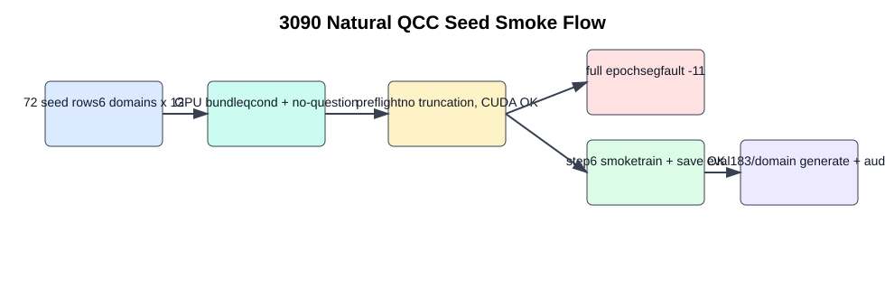
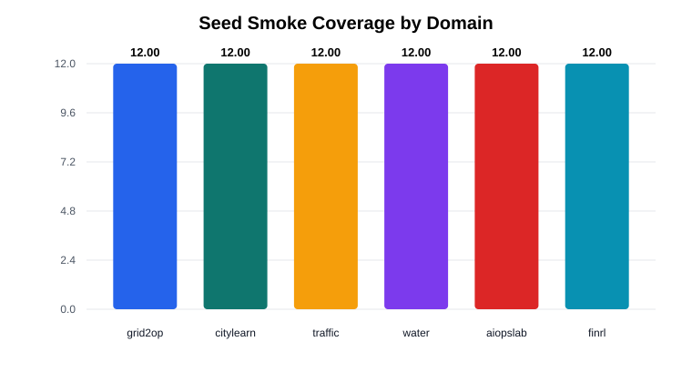
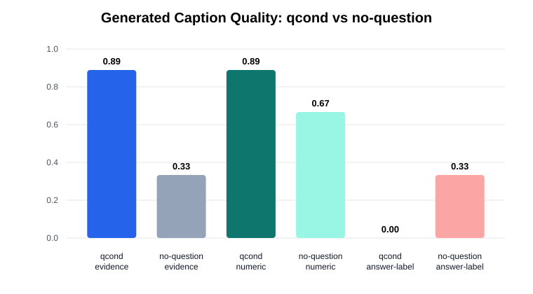
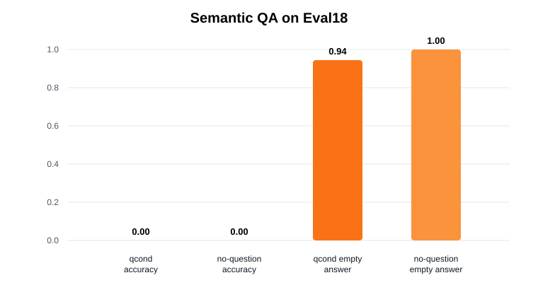

# Natural QCC Seed 3090 Smoke 训练报告（2026-05-21）

## 一句话结论

这次已经把 72 条 Natural QCC seed 放到 3090 上真实跑了 TS-RLM/Qwen3-4B smoke。数据和 token budget 没问题，短步数训练可以完成并生成 caption；但是完整 1 epoch 训练在 3090 上发生了底层 `segfault -11`，所以本轮还不能算“完整训练成功”。

从短步数结果看，`qcond` 比 `no-question` 更像是在写 evidence caption：更长、更常带数字、更少答案标签投机；但 semantic QA 仍是 0，说明 6 step 只学到一点输出形态，还没有学会稳定生成能支持正确答案的证据。



## 这次实际做了什么

- 使用 3090 备份 SSH 配置连到 `head2`，确认 8 张 RTX 3090 可用；默认 SSH 别名不可达，备份配置可用。
- 把 `caption-model-longline` 当前分支 archive 到远端独立目录：`/cluster/home/hulining/LTSGEN_caption_model_longline_seed_smoke_20260521_164648`。
- 构造 GPU smoke bundle：72 条 seed，6 个域各 12 条；同时准备 `qcond` 和 `no-question` 两套输入。
- 在 3090 上跑 preflight：确认路径、CUDA、Qwen/transformers/peft、prefix bridge、token budget 都通过。
- 尝试完整 1 epoch qcond 训练：preflight 过了，但训练进程在加载 Qwen 权重后 segfault。
- 追加诊断：2 条 1 step、72 条 1 step 都能训练成功；随后跑 72 条 step6 的 qcond/no-question 成对 smoke，并在每域 3 条、共 18 条上生成和评估。

## 数据覆盖



| 项目 | 结果 |
| --- | ---: |
| seed 总数 | 72 |
| qcond 训练行 | 72 |
| no-question 训练行 | 72 |
| 4 变量窗口 | 52 |
| 3 变量窗口 | 20 |
| 缺英文选项、由中文选项补齐 | 12 |

## 训练前检查

| 检查项 | 结果 |
| --- | --- |
| 3090 access | pass |
| preflight | `True` |
| zero output kept | `0` |
| output truncated | `0` |
| prompt truncated | `0` |
| max needed tokens | `408`，小于 `max_text_length=768` |

通俗地说：这次不是之前那种“训练标签被截没了”的问题。caption 监督确实进入了 loss。

## 完整训练为什么没算成功

完整 72 条、1 epoch 的 qcond pipeline 在 `train` 步骤停止：

```text
stopped_after = train
train_returncode = -11
```

`-11` 是段错误，属于 Python / PyTorch / CUDA / 底层库层面的进程崩溃，不是 QA 分数低，也不是数据 schema 校验失败。远端 `dmesg` 里也记录了 `python3 segfault`。

为了确认不是数据本身完全不能训，我又做了两个诊断：2 条 1 step 成功，72 条 1 step 成功。所以问题更像是 3090 环境或较长训练过程中的底层稳定性问题，而不是“这批 seed 一读就错”。

## 可完成 smoke 结果

我保守地跑了 `max_steps=6` 的 qcond/no-question 对照。它不是完整收敛训练，只是验证真实链路：训练 -> 保存 -> 加载 -> 生成 -> 评估。





| 指标 | qcond | no-question | 怎么理解 |
| --- | ---: | ---: | --- |
| 生成条数 | 18 | 18 | 每域 3 条，共 18 条 |
| semantic QA accuracy | 0.0000 | 0.0000 | 两者都没答对，不能说模型已经会做 QA |
| empty answer rate | 0.9444 | 1.0000 | 评估器几乎抽不出正确答案 |
| mean caption chars | 217.9 | 52.0 | qcond 明显更像正常 caption |
| numeric evidence rate | 0.8889 | 0.6667 | qcond 更常带数值证据 |
| evidence shape rate | 0.8889 | 0.3333 | qcond 通过 caption 形态 gate，no-question 未通过 |
| answer-label-only rate | 0.0000 | 0.3333 | no-question 更容易输出短标签/碎片 |

## 生成样例

### grid2op

**qcond 生成：**

> Evidence: The x0 series shows a consistent pattern of increasing stress differences, with the mean x0 rising from -0.02 to +0.13 over time. The mean x1 increases from 0.04 to 0.75, indicating that more blocks have significant positive deviations.

**no-question 生成：**

> .

**目标 caption 摘要：**

> Across the compact blocks, the outage run is consistently less stressful than the matched normal run. Mean x0 is -0.11, with 0.0% of blocks above +0.05, 100.0% below -0.05, and maximum absolute difference 0.12. Those values support the risk decreases decision…

### citylearn

**qcond 生成：**

> The time-series pattern shows a consistent increase in net grid load from the early to middle third, with a slight decrease in the late third. The largest mean net grid load is in the middle third (0.42), followed by the early third (0.

**no-question 生成：**

> (x0 - 0.15*x2); x4 block mean net grid load with solar support; x5 block mean net load without solar support.

**目标 caption 摘要：**

> The net-load profile has a distinct early peak rather than a balanced shape. Early, middle, and late mean net loads are 6.33, 5.14, and 5.10; the top-minus-second gap is 1.20, compared with the 0.30 reserve threshold. This evidence supports reserve early.

### traffic

**qcond 生成：**

> The congestion score is calculated as x3 = x1 + 8*x2 - 0.05*x0, where x1 is queue length (higher worse), x2 is lane occupancy (higher worse) and x0 is speed (higher better). The event phase is the time block with the highest

**no-question 生成：**

> x1 + 8*x2 - 0.05*x0.

**目标 caption 摘要：**

> The event period does not create a clear congestion-score jump over the pre-event baseline. Mean congestion scores are 6.50 before the event, 6.78 during it, and 6.67 afterward; the event lift is 0.29, below the 0.50 shock threshold. This evidence supports no…

### water

**qcond 生成：**

> Evidence: The pressure and flow data show a consistent pattern of decreasing pressure with increasing flow during the event period. The minimum pressure drops below 55, indicating potential leakage.

**no-question 生成：**

> ; x0_pre, x1_pre: pre-event mean pressure and flow; x0_event, x1_event: event mean pressure and pipe flow; x2_event: event minimum pressure.

**目标 caption 摘要：**

> Pressure drops during the disturbance but rebounds by the post-event segment. Pre-event, event, and post-event pressure means are 69.23, 58.75, and 71.23; minimum pressure is 55.15 and event flow change is 3.45. These values support pressure recovers after di…

### aiopslab

**qcond 生成：**

> Evidence: The time series shows a consistent increase in memory working set (x1) over the 24-hour window, with an average growth rate of 15% or more. Network receive and transmit rates (x2 and x3) fluctuate but do not exceed thresholds for bursts.

**no-question 生成：**

> .

**目标 caption 摘要：**

> Memory rises from the first half to the second half, while other peaks are secondary. Memory changes from 11389551.05 to 14870914.40 (30.6%), receive and transmit peak/median ratios are 1.29 and 1.30, and max CPU is 0.43. This evidence supports memory leak pa…

### finrl

**qcond 生成：**

> Evidence: The asset price starts at $100 and ends at $95, resulting in a total return of -5%. The maximum drawdown is 25% from the initial peak.

**no-question 生成：**

> ; x4 block maximum asset price.

**目标 caption 摘要：**

> The price path rises strongly while drawdown stays below the severe-risk threshold. Total return is 76.0% and maximum drawdown is -6.6%; the -20% drawdown override is not triggered unless the drawdown crosses that level. These values support bullish regime.

## 通俗解释

这轮像是在检查一条生产线：机器能不能读数据、装模型、训练一点点、保存、再生成文本。答案是：短流程能跑通，完整 1 epoch 在当前 3090 环境会崩。

qcond 的输出已经不像 no-question 那样经常只吐变量定义、点号或者答案标签，它更像一段 evidence caption。但它还没有把 evidence 对准正确答案，很多数字和趋势是“看起来像”，不是“真的和目标一致”。所以这不是方法成功，而是一个有用的中间信号：问题条件确实改变了输出形态，但还没带来可用 QA。

## 下一步建议

1. 先处理 3090 训练稳定性：固定 `max_steps` 逐步拉长到 12、24、36，定位 segfault 发生的步数；同时尝试 `CUDA_VISIBLE_DEVICES=3/4`、`fp16`、关闭 eval during train 或减少 `gradient_accumulation_steps`。
2. 等训练能稳定跑完后，不要马上扩数据；先做 20-30 条 overfit，要求 generated caption 能贴近 target 的关键证据。
3. QA evaluator 需要补充自然 caption 到选项的映射规则，尤其是这批新 seed 的答案标签和中文/英文选项；但不能用 evaluator 改 gold answer。
4. 对 qcond 输出做人工 review：现在它会编一些“像证据”的数字，下一步应重点查 factuality，而不是只看 evidence-shape rate。

## 关键文件

- GPU bundle summary: `gpu_bundle/seed_gpu_smoke_bundle_summary.json`
- 完整 epoch 失败记录: `train_seed72_ep1_tok768/qcond_seed72/natural_qcc_smoke_pipeline_summary.json`
- qcond step6 predictions: `train_seed72_step6_tok768/qcond_seed72/generate_eval18_clean/predictions.jsonl`
- no-question step6 predictions: `train_seed72_step6_tok768/no_question_seed72/generate_eval18_clean/predictions.jsonl`
- qcond quality audit: `train_seed72_step6_tok768/qcond_seed72/natural_qcc_caption_quality_eval18_audit.json`
- no-question quality audit: `train_seed72_step6_tok768/no_question_seed72/natural_qcc_caption_quality_eval18_audit.json`
- remote reproducible runner: `scripts/remote/run_natural_qcc_seed_smoke_3090.sh`

## 本轮结论

这轮不是“模型已经学会 Natural QCC”，而是“3090 真实链路已经推进到可训练、可保存、可生成的阶段，并发现了两个具体问题”：完整 epoch 的底层 segfault，以及短训练生成的 factual alignment 还不够。qcond 比 no-question 更像 evidence caption，这是好信号；但 QA 仍为 0，所以还不能宣称训练有效。
