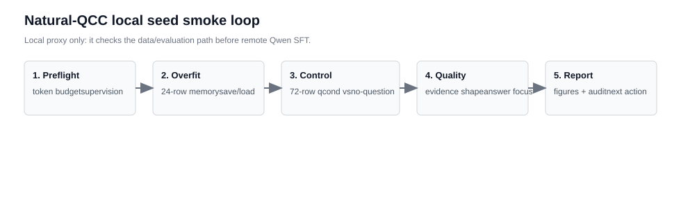
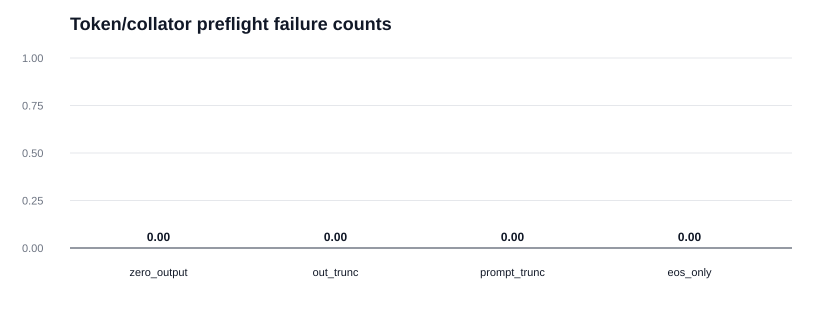
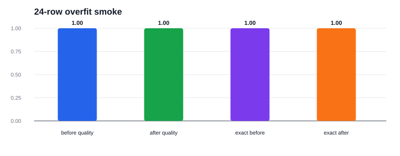
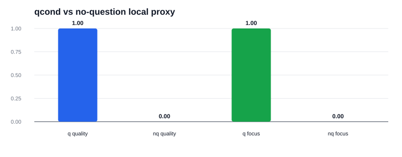
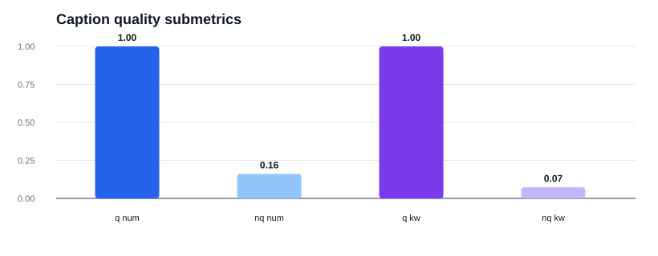

# Natural-QCC Seed Smoke v1（2026-05-21）

## 一句话结论

这轮完成的是本地小闭环 smoke：它验证 repaired seed 的监督信号、overfit/save-load 路径、qcond/no-question 对照和 caption 质量评估链路都能跑通。
这不是 Qwen/TS-RLM 的正式训练结果；当前本地环境没有 `torch`、`transformers` 和远端模型目录，所以这里只能作为上 GPU 前的 local proxy gate。

## 1. Token / Collator Preflight

- rows: `72`
- tokenizer: `local_regex_proxy`
- max_text_length / max_prompt_length: `768` / `640`
- zero output kept: `0`
- output truncated: `0`
- prompt truncated: `0`
- EOS-only supervision: `0`
- gate pass: `True`

## 2. 24-row Overfit Smoke

这里训练的是一个本地 memory captioner，只用于确认 overfit、保存、重载、生成和质量评估路径能闭环。

- overfit rows: `24`
- before-save quality pass rate: `1.0`
- after-load quality pass rate: `1.0`
- save/load parity: `True`
- gate pass: `True`

## 3. 72-row qcond vs no-question Local Proxy

qcond proxy 输出 answer-focused target caption；no-question proxy 只写 generic time-series summary，不看 downstream question。这个对照不是方法成绩，而是检查评估链路是否能区分 answer-focused evidence 和 generic caption。

| condition | quality pass | answer focused | number recall | keyword recall |
| --- | ---: | ---: | ---: | ---: |
| qcond local proxy | 1.0000 | 1.0000 | 1.0000 | 1.0000 |
| no-question generic proxy | 0.0000 | 0.0000 | 0.1609 | 0.0731 |

## 4. Caption Quality Gate

质量 gate 同时看非空、数值证据、是否 answer-label-only、是否像 JSON/选项泄漏，以及是否覆盖 target caption 的关键数字和关键词。

## 5. 这轮产物

| artifact | path |
| --- | --- |
| combined qcond SFT | `.research/general-qcc-captioner-20260515/natural_qcc_seed_smoke_v1_20260521/combined_qcond_sft.jsonl` |
| combined no-question SFT | `.research/general-qcc-captioner-20260515/natural_qcc_seed_smoke_v1_20260521/combined_no_question_sft.jsonl` |
| preflight summary | `.research/general-qcc-captioner-20260515/natural_qcc_seed_smoke_v1_20260521/token_preflight_summary.json` |
| overfit summary | `.research/general-qcc-captioner-20260515/natural_qcc_seed_smoke_v1_20260521/overfit/overfit_smoke_summary.json` |
| qcond/no-question summary | `.research/general-qcc-captioner-20260515/natural_qcc_seed_smoke_v1_20260521/qcond_vs_no_question_local_proxy_summary.json` |
| report | `.research/general-qcc-captioner-20260515/natural_qcc_seed_smoke_v1_20260521/NATURAL_QCC_SEED_SMOKE_V1_REPORT_20260521_ZH.md` |

## 环境说明

- torch available: `False`
- transformers available: `False`
- model path exists: `False`

因此下一步真正要做的是把同一批 `combined_qcond_sft.jsonl` / `combined_no_question_sft.jsonl` 搬到 3090/A100 路径，跑真实 Qwen/TS-RLM 12-24 条 overfit 和 72 条 qcond/no-question 训练对照。
