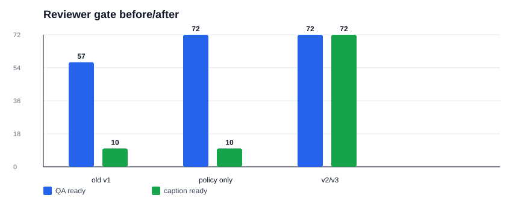
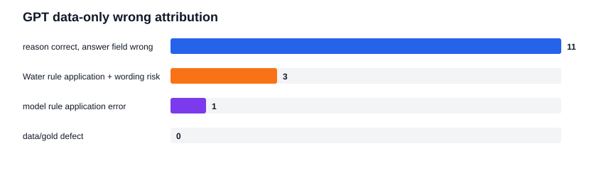
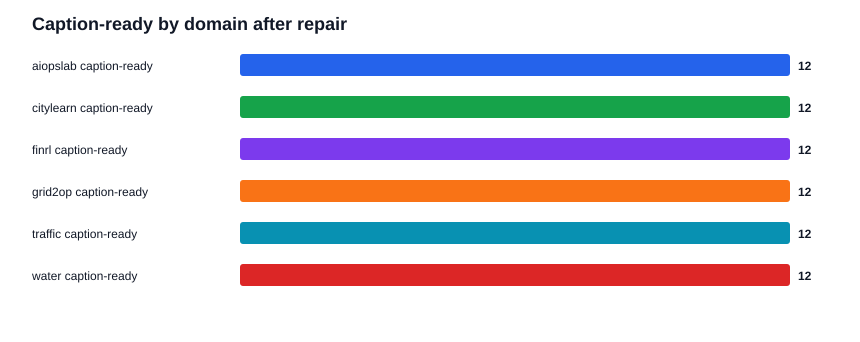
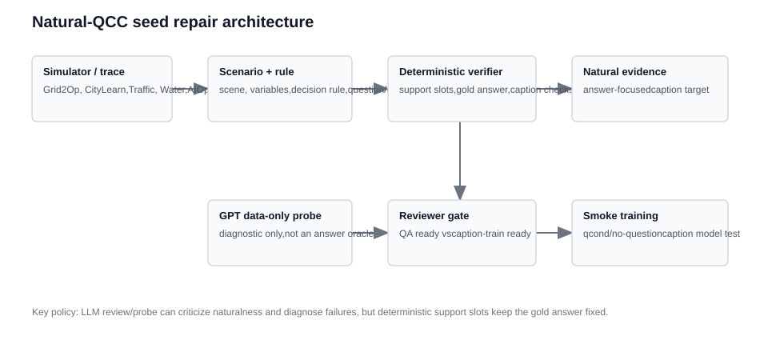

# Natural-QCC Seed Repair Round Report（2026-05-21）

## 一句话结论

这轮做的不是继续堆数据，而是把小规模 seed 从“看起来像规则槽位拼接”修成可以进入下一步 smoke test 的自然 QA/caption seed。
修完后，72 条 seed 全部通过 QA-ready 和 caption-train-ready gate；但 15 条 GPT data-only 错误仍保留为诊断项，用于后续扩增时重点复核。

## 这轮具体做了什么

### 1. 修 reviewer gate

旧 gate 把 `gpt_data_only_wrong` 直接当成 QA 不可用，导致一些本来 deterministic gold 没问题的样本被误判。
现在它只触发 `needs_manual_error_attribution`，不再单独阻塞 QA seed。

### 2. 生成 self-contained reasoning QA v3

保留 v2 的题面、规则、选项、gold 和 support slots，只清洗 caption 训练目标：删除 `Answer label`，删除 `the rule maps this to`，把 caption 改成“时序形态 + 关键数值 + 为什么支持判断”。

- 样本数：60
- 分域：Grid2Op、CityLearn、Traffic、Water、AIOpsLab、FinRL 每域 10 条
- bad phrase 检查：`Answer label` / `the rule maps this to` / `supports the answer` 全部为 0

### 3. 做 GPT data-only 错误归因

15 条 GPT data-only 错误没有被直接删掉，而是逐条归因。

归因结果很关键：11 条是模型 reason 已经算到正确答案，但最终 JSON answer 填错；3 条是 Water 规则应用错误并提示规则措辞要更硬；1 条是普通规则应用错误。没有一条被判为确定性 data/gold defect。

### 4. 修 12 条 case-study v2

case-study v2 保留每域 2 条和原有时序图，但改了读者看到的文本：去 simulator 名称，补清变量含义，说明对照/基线，删掉英文 caption 的模板句，让中英文 caption 聚焦同一组证据。

### 5. 复跑 reviewer gate

- 原始 v1 结论：QA ready 57/72，caption ready 10/72。
- 只修 gate 策略后：QA ready 72/72，caption ready 10/72。
- v2/v3 数据修复后：QA ready 72/72，caption ready 72/72。

这说明：QA-ready 的改善主要来自 reviewer gate 策略修正；caption-ready 的改善主要来自 v3 caption target 清洗和 v2 case 改写。

## 当前架构

这张图的核心是：simulator/trace 和 deterministic verifier 仍负责 gold 和 support slots；LLM probe/reviewer 只负责自然性、可答性和失败诊断，不决定正确答案。

## 代表时序 case

下面这些图来自 case-study v2，每个域 2 条。报告正文在 `natural_qcc_case_quality_v2_20260521` 里包含完整场景、问题、中文选项、答案、中文 caption 和 English target caption。

### 01_grid2op_grid_counterfactual_overload_exposure

### 02_grid2op_grid_domain_stress_context

### 03_citylearn_city_domain_demand_context

### 04_citylearn_city_window_total_load

### 05_traffic_traffic_domain_congestion_context

### 06_traffic_traffic_event_recovery_context

### 07_water_water_domain_resilience_context

### 08_water_water_leak_counterfactual_pressure

### 09_aiopslab_aiops_official_cross_signal_relation

### 10_aiopslab_aiops_official_memory_extrema

### 11_finrl_fin_domain_market_regime

### 12_finrl_fin_drawdown_price

## 产物清单

| 类型 | 路径 |
| --- | --- |
| reviewer script | `scripts/eval/review_natural_qcc_seed_quality.py` |
| error attribution script | `scripts/eval/attribute_self_contained_data_only_errors.py` |
| self-contained v3 generator | `scripts/generate/build_self_contained_reasoning_tsqa_v3.py` |
| case-study v2 generator | `scripts/generate/build_natural_qcc_case_quality_v2.py` |
| self-contained v3 data | `.research/general-qcc-captioner-20260515/self_contained_reasoning_qa_v3_20260521/` |
| case-study v2 data/report | `.research/general-qcc-captioner-20260515/natural_qcc_case_quality_v2_20260521/` |
| error attribution report | `.research/general-qcc-captioner-20260515/self_contained_error_attribution_v1_20260521/` |
| reviewer gate v2 | `.research/general-qcc-captioner-20260515/seed_quality_review_v2_20260521/` |
| illustrated round report | `.research/general-qcc-captioner-20260515/natural_qcc_v3_seed_repair_report_20260521/` |

## 下一步

下一步不应该直接上大训练。更稳的是用这 72 条作为 smoke seed，做一个小扩增和 qcond/no-question 对照：先验证 caption model 能否生成非空、自然、可验证的 evidence caption，再决定是否扩大到每域更多真实 simulator/exporter adapter 样本。
