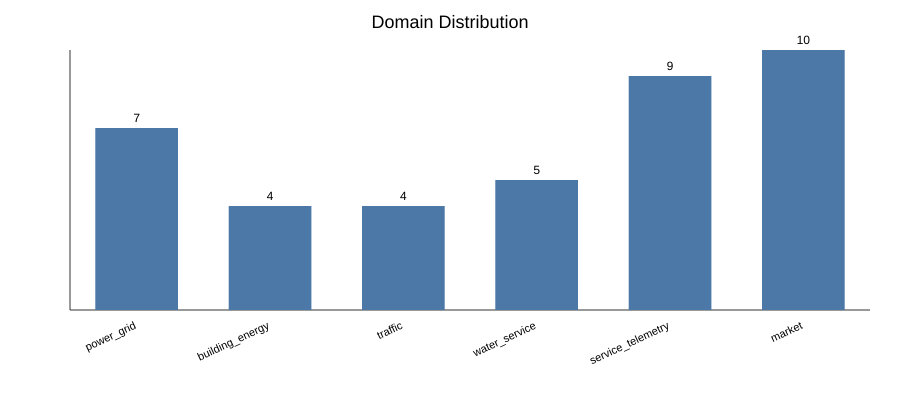
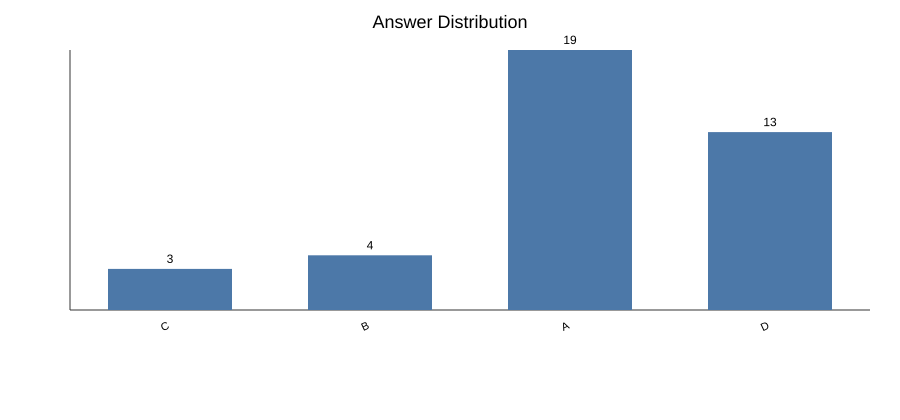
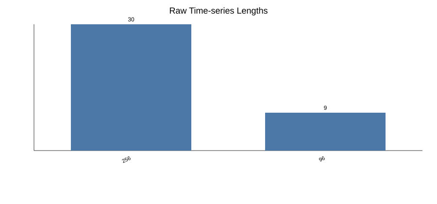
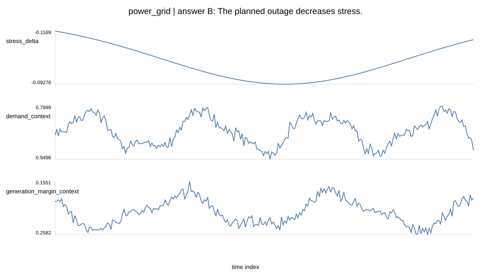
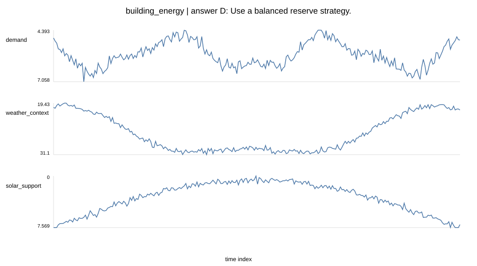
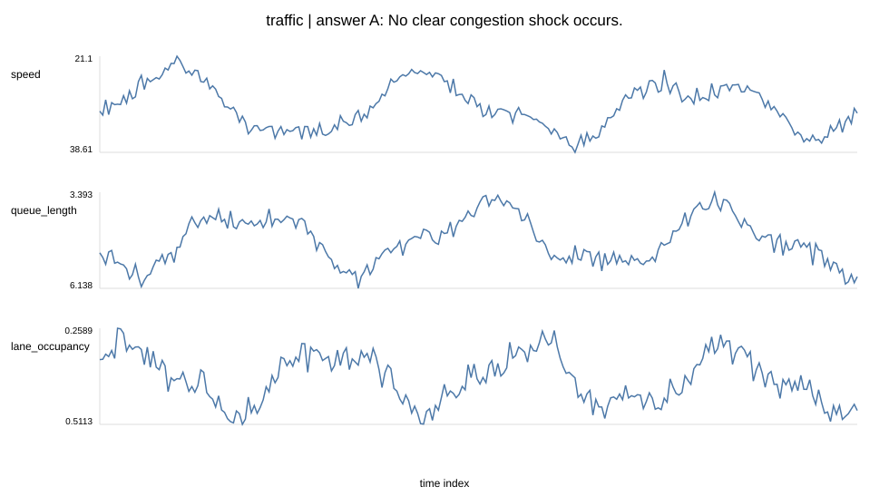
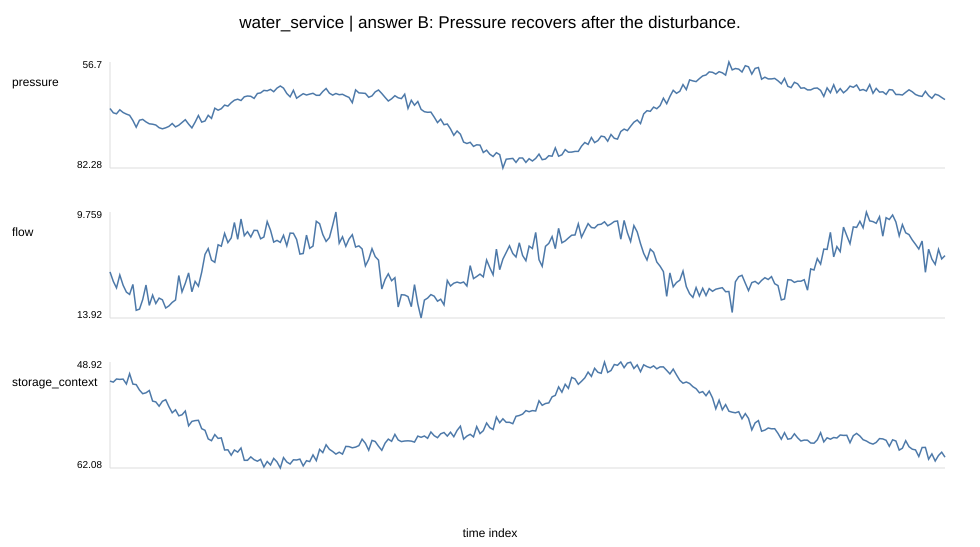
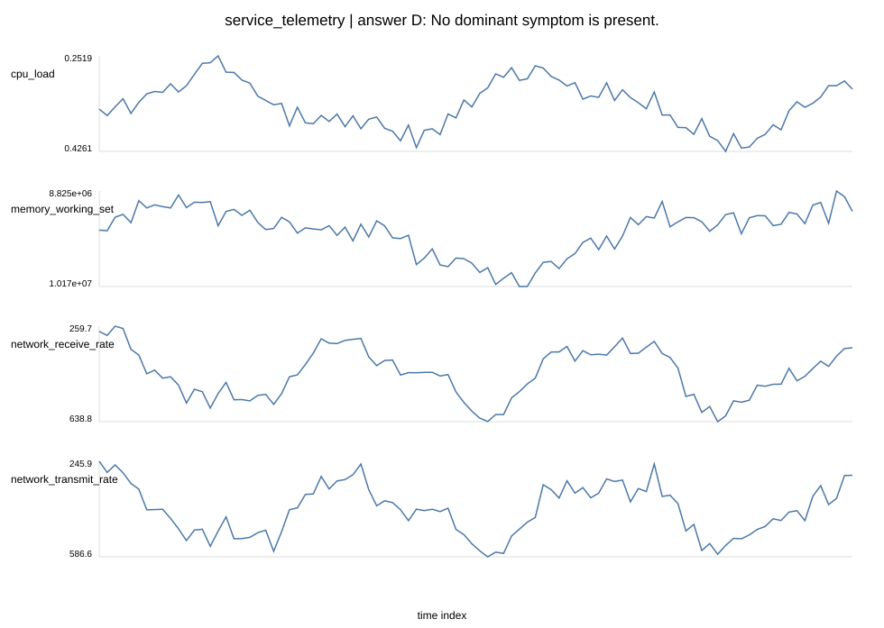
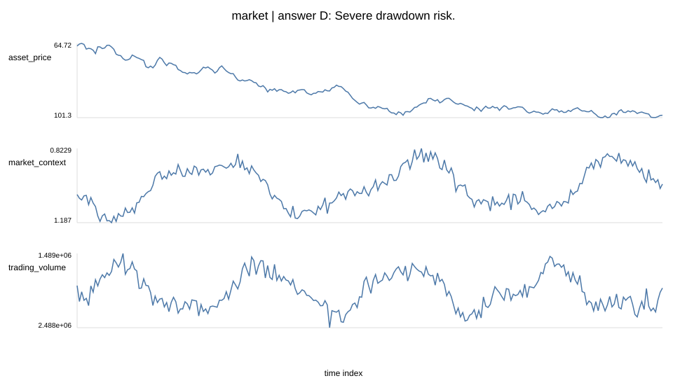

# Public Raw TSQA v4 图文报告与 Case Study（2026-05-21）

## 一句话结论

本轮已把 benchmark 标准从 v3 的技术验证格式推进到 public raw time-series QA 格式：同一条 canonical raw-series 样本同时导出 LLM text view 和 TS-LLM array view，内部审计证据和 oracle evidence 不进入主评测 prompt。

## 产物结构

| 文件 | 用途 |
| --- | --- |
| `canonical_raw_tsqa_v4.jsonl` | 一份标准 raw time-series QA 数据 |
| `llm_text_view.jsonl` | 普通 LLM 使用：完整时序转 CSV 文本并放入 prompt |
| `tsllm_array_view.jsonl` | TS-LLM 使用：原始数组 + 同一问题文本 |
| `oracle_evidence.jsonl` | oracle evidence / upper-bound 条件 |
| `audit_support.jsonl` | 内部审计证据字段、verifier rule、source 和 reviewer trace |
| `mismatch_audit.jsonl` | 被排除样本及原因 |

## 规模与覆盖

- canonical rows: `39`
- raw/v3 gold mismatch or excluded: `2`
- public forbidden issues: `0`
- sanity check pass: `True`
- raw series length: `{'min': 96, 'max': 256}`
- answer distribution: `{"C": 3, "B": 4, "A": 19, "D": 13}`







## 为什么 LLM 和 TS-LLM 可以复用同一批数据

同一个 canonical record 保存原始时序、变量解释、问题、选项和 gold answer。LLM view 只是把 `time_series.values` 序列化成 CSV 文本；TS-LLM view 则直接保留同一个数组。两者不改变问题、不改变选项、不改变答案。

这保证了评测比较的是模型输入接口差异，而不是两套数据差异。

## Case Study

### Case 1: `power_grid`



**Context EN**

A grid operator is assessing how a planned line outage changes line stress compared with normal operation.

**问题中文**

根据完整压力差序列，调度员应如何判断这次计划断线的影响？

**Options EN**

- A. The planned outage increases stress.
- B. The planned outage decreases stress.
- C. The effect is broadly unchanged.
- D. The case needs manual review.

**Gold**: `B` / `The planned outage decreases stress.`

**Oracle evidence（audit-only，不进入主评测 prompt）**

The mean stress difference is -0.107113; 0.0% of readings are above +0.05 and 100.0% are below -0.05. The largest absolute deviation is 0.116853.

**内部审计证据字段摘要**

`{"stress_delta_mean": -0.10711293475739925, "share_above_pos_threshold": 0.0, "share_below_neg_threshold": 1.0, "max_abs_stress_delta": 0.11685291610575388, "verifier_answer_label": "risk decreases"}`

**LLM view 片段**

```text
Time series values are serialized as CSV in `llm_text_view.jsonl`; the public prompt contains raw series, context, variables, decision guide, question, and options.
```

**TS-LLM view 片段**

```json
{
  "columns": [
    "stress_delta",
    "demand_context",
    "generation_margin_context"
  ],
  "timeseries_shape": [
    256,
    3
  ],
  "text_question": "Based on the full stress-delta series, what should the operator conclude about the planned outage?"
}
```

### Case 2: `building_energy`



**Context EN**

A building energy planner needs to decide whether supply should be reserved for the early, middle, late, or evenly across the operating window.

**问题中文**

根据完整需求和太阳能支持序列，哪种供能预留策略最合适？

**Options EN**

- A. Reserve more supply for the early part of the window.
- B. Reserve more supply for the middle part of the window.
- C. Reserve more supply for the late part of the window.
- D. Use a balanced reserve strategy.

**Gold**: `D` / `Use a balanced reserve strategy.`

**Oracle evidence（audit-only，不进入主评测 prompt）**

The early, middle, and late net-load means are 5.32557, 4.74602, and 5.25447. The top-second gap is 0.0711006 against the 0.30 threshold.

**内部审计证据字段摘要**

`{"early_net_load_mean": 5.325574036735931, "middle_net_load_mean": 4.746020988170356, "late_net_load_mean": 5.254473457602158, "top_second_gap": 0.07110057913377332, "verifier_answer_label": "balanced reserve"}`

**LLM view 片段**

```text
Time series values are serialized as CSV in `llm_text_view.jsonl`; the public prompt contains raw series, context, variables, decision guide, question, and options.
```

**TS-LLM view 片段**

```json
{
  "columns": [
    "demand",
    "weather_context",
    "solar_support"
  ],
  "timeseries_shape": [
    256,
    3
  ],
  "text_question": "From the full demand and solar-support series, which reserve strategy is most appropriate?"
}
```

### Case 3: `traffic`



**Context EN**

A traffic analyst is reviewing road readings before, during, and after an event.

**问题中文**

事件阶段之后，拥堵状态如何变化？

**Options EN**

- A. No clear congestion shock occurs.
- B. Congestion recovers after the event.
- C. Congestion partially recovers.
- D. Congestion persists after the event.

**Gold**: `A` / `No clear congestion shock occurs.`

**Oracle evidence（audit-only，不进入主评测 prompt）**

The pre-event, event, and post-event congestion-score means are 6.39527, 6.42351, and 6.14901. The event rise over pre-event is 0.0282388.

**内部审计证据字段摘要**

`{"pre_event_score_mean": 6.39526655427803, "event_score_mean": 6.423505394523074, "post_event_score_mean": 6.149007909702109, "event_minus_pre": 0.028238840245044194, "post_minus_pre": -0.24625864457592073, "event_minus_post": 0.2744974848209649, "verifier_answer_label": "no clear congestion shock"}`

**LLM view 片段**

```text
Time series values are serialized as CSV in `llm_text_view.jsonl`; the public prompt contains raw series, context, variables, decision guide, question, and options.
```

**TS-LLM view 片段**

```json
{
  "columns": [
    "speed",
    "queue_length",
    "lane_occupancy"
  ],
  "timeseries_shape": [
    256,
    3
  ],
  "text_question": "What happened to congestion after the event phase?"
}
```

### Case 4: `water_service`



**Context EN**

A water-service operator is reviewing pressure and flow readings around a disturbance event.

**问题中文**

这段扰动窗口最符合哪种供水服务状态？

**Options EN**

- A. Persistent leak pressure risk.
- B. Pressure recovers after the disturbance.
- C. Service remains stable.
- D. Manual review is needed.

**Gold**: `B` / `Pressure recovers after the disturbance.`

**Oracle evidence（audit-only，不进入主评测 prompt）**

Pressure moves from 71.8994 before the event to 64.7325 during the event and 76.6573 afterward. Minimum pressure is 56.6995, and event flow changes by -0.031266.

**内部审计证据字段摘要**

`{"pre_pressure_mean": 71.89942459366053, "event_pressure_mean": 64.73250268368636, "post_pressure_mean": 76.65727518549527, "min_pressure": 56.699496625046166, "event_flow_change": -0.03126601814196839, "verifier_answer_label": "pressure recovers after disturbance"}`

**LLM view 片段**

```text
Time series values are serialized as CSV in `llm_text_view.jsonl`; the public prompt contains raw series, context, variables, decision guide, question, and options.
```

**TS-LLM view 片段**

```json
{
  "columns": [
    "pressure",
    "flow",
    "storage_context"
  ],
  "timeseries_shape": [
    256,
    3
  ],
  "text_question": "Which service state best describes this disturbance window?"
}
```

### Case 5: `service_telemetry`



**Context EN**

An SRE is triaging one service telemetry window.

**问题中文**

SRE 应优先关注哪种症状？

**Options EN**

- A. Prioritize a memory-leak pattern.
- B. Prioritize a network-burst pattern.
- C. Prioritize CPU saturation.
- D. No dominant symptom is present.

**Gold**: `D` / `No dominant symptom is present.`

**Oracle evidence（audit-only，不进入主评测 prompt）**

Memory changes from 9.66323e+06 to 9.55701e+06 (-1.1%). Receive and transmit peak-to-median ratios are 1.41425 and 1.41602, and max CPU is 0.426087.

**内部审计证据字段摘要**

`{"memory_first_half_mean": 9663229.94833505, "memory_second_half_mean": 9557010.608610492, "memory_growth_ratio": -0.010992115503042417, "rx_peak_median_ratio": 1.4142464153882728, "tx_peak_median_ratio": 1.4160240046921517, "cpu_max": 0.4260868713772379, "verifier_answer_label": "no dominant symptom"}`

**LLM view 片段**

```text
Time series values are serialized as CSV in `llm_text_view.jsonl`; the public prompt contains raw series, context, variables, decision guide, question, and options.
```

**TS-LLM view 片段**

```json
{
  "columns": [
    "cpu_load",
    "memory_working_set",
    "network_receive_rate",
    "network_transmit_rate"
  ],
  "timeseries_shape": [
    96,
    4
  ],
  "text_question": "Which symptom should the SRE prioritize?"
}
```

### Case 6: `market`



**Context EN**

A market analyst is reviewing an asset price window.

**问题中文**

这段价格窗口应如何分类？

**Options EN**

- A. Bullish regime.
- B. Bearish regime.
- C. Sideways regime.
- D. Severe drawdown risk.

**Gold**: `D` / `Severe drawdown risk.`

**Oracle evidence（audit-only，不进入主评测 prompt）**

Total return is -34.1%, and maximum drawdown from the running peak is -36.1%.

**内部审计证据字段摘要**

`{"total_return": -0.34099546875088815, "max_drawdown": -0.3608915249726842, "verifier_answer_label": "severe drawdown risk"}`

**LLM view 片段**

```text
Time series values are serialized as CSV in `llm_text_view.jsonl`; the public prompt contains raw series, context, variables, decision guide, question, and options.
```

**TS-LLM view 片段**

```json
{
  "columns": [
    "asset_price",
    "market_context",
    "trading_volume"
  ],
  "timeseries_shape": [
    256,
    3
  ],
  "text_question": "How should this price window be classified?"
}
```

## 本轮剩余问题

- 当前 v4 只有 39 条，是 schema/pipeline 样板，不是最终 benchmark 规模。
- answer distribution 仍偏 A，需要扩增时做全局 answer balance。
- building_energy / traffic 的 ready seed 数量偏少，需要优先补齐。
- 下一步应在 v4 schema 上扩增，而不是继续扩 v3 compact-style 数据。
