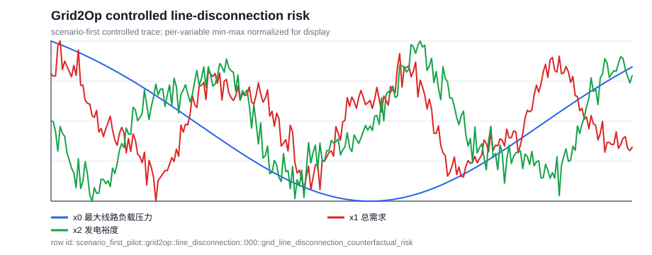
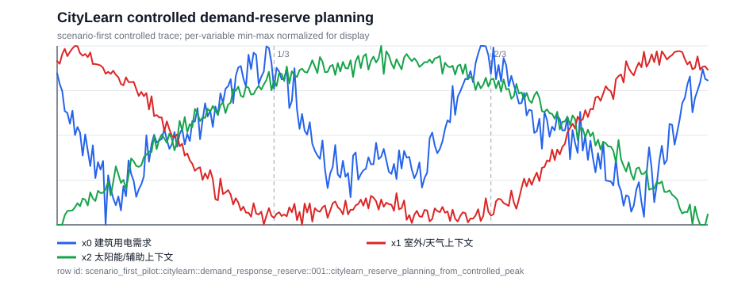
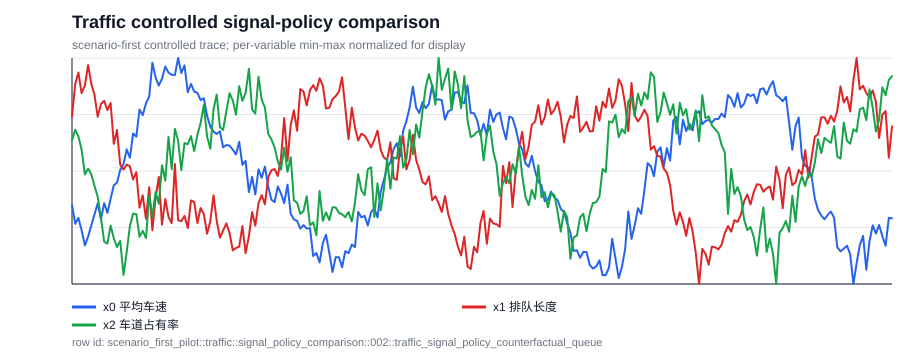
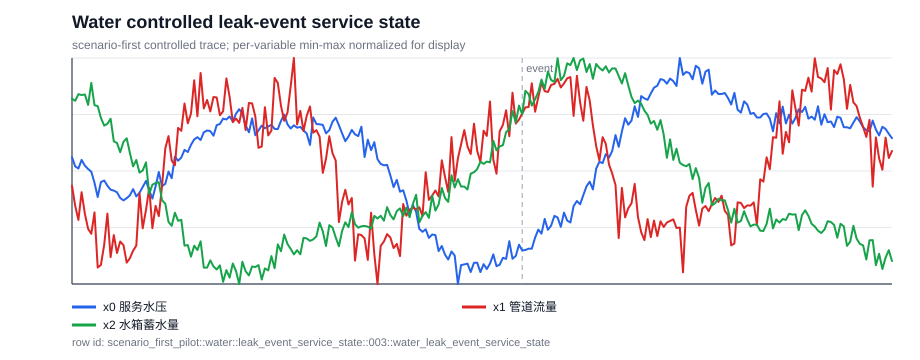
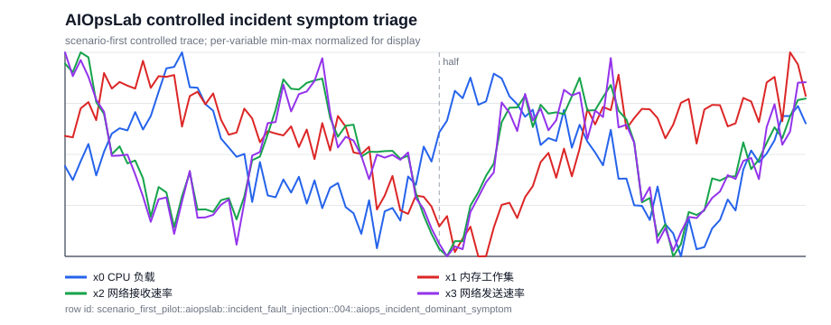
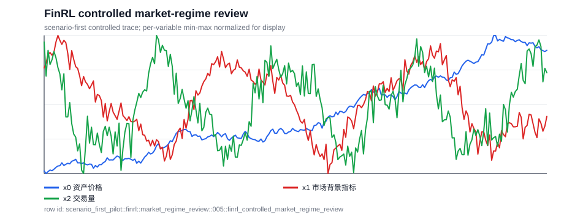

# Scenario-first Natural-QCC 六域 Smoke v2（2026-05-20）

这份 smoke v2 是对上一版 Grid2Op-only real adapter 的补齐：跨域 smoke 至少要覆盖每个目标域，并且每个域要有约 10 条样本，才有资格检查 Natural QA/QCC 的字段、caption、中文翻译和 SFT 形状是否稳定。

## 1. 本轮结论

- 总样本数：`60`。
- 覆盖域：`grid2op, citylearn, traffic, water, aiopslab, finrl`。
- 每域目标：`10` 条；本轮所有域都达到该门槛：`True`。
- caption empty：`0`；中文 QA/evidence 缺失：`0`。

这轮可以叫做“六域数据协议 smoke”：它能检查跨域字段、自然问题、中文翻译、caption、support-slot 审计和 SFT 输入输出是否能跑通。它还不能叫最终真实 simulator benchmark，因为除 Grid2Op 的 2 条 adapter sanity row 外，其余主要来自 controlled scenario-first generator。

## 2. Domain 覆盖

| domain | rows | controlled scenario-first | real adapter |
| --- | ---: | ---: | ---: |
| `grid2op` | `10` | `8` | `2` |
| `citylearn` | `10` | `10` | `0` |
| `traffic` | `10` | `10` | `0` |
| `water` | `10` | `10` | `0` |
| `aiopslab` | `10` | `10` | `0` |
| `finrl` | `10` | `10` | `0` |

## 3. 生成流程

本轮采用的主流程是 scenario-first：

1. 先确定领域场景、干预或运行状态。
2. 再生成或采集对应的时序窗口。
3. 然后用确定性程序计算 support slots，例如差值均值、峰值、事件前后均值、回撤等。
4. 最后把这些 support slots 写成自然 evidence caption，并生成自然问题、四选项和中文翻译。

这里的 support slots 不是面向用户的问题模板，而是答案和 caption 的审计锚点。换句话说，它们应该站在后台做校验，而不是把题目写成 slot 拼接。

## 4. 代表性 Case Study

下面每个域展示 1 条 controlled scenario-first 代表样本，用来检查问题是否像正常业务问题、中文翻译是否可读、图和证据是否能支持答案。

### 1. `grid2op` / `grid_line_disconnection_counterfactual_risk`

**场景中文：** 一名 Grid2Op 电网调度员正在查看一个受控电网运行窗口。x0 是最大线路负载压力，x1 是总需求，x2 是发电裕度。压力超过 1.0 表示存在过载风险。 场景设置：1 号线路在该事件后局部窗口之前被断开；x0 表示干预后减事实运行的线路压力差。

**问题中文：** 计划断开 1 号线路后，在这个事件后窗口里调度员应该预期什么运行影响？

**选项中文：**

- A. 提高过载风险
- B. 降低过载风险
- C. 对线路压力影响不明显
- D. 证据不足

**Gold：** `B` / 降低过载风险

**Evidence caption EN：** The intervention-minus-factual stress difference has mean -0.11 and ranges from -0.12 to -0.09, so the disconnection reduces overload risk.

**证据 caption 中文：** 干预后减事实运行的压力差均值为 -0.11，范围为 -0.12 到 -0.09，因此断线降低过载风险。

**Scenario-first 参数：** `{"line_id": 1, "severity": "stress_down", "intervention_step": 512, "scene_en": "line 1 is disconnected before this post-event local window; x0 is intervention-minus-factual stress.", "scene_zh": "1 号线路在该事件后局部窗口之前被断开；x0 表示干预后减事实运行的线路压力差。"}`

**Support slots：** `{"line_id": 1, "mean_stress_diff": -0.10711293475739925, "min_stress_diff": -0.11685291610575388, "max_stress_diff": -0.092755822908823, "answer_label": "reduces overload risk"}`

### 2. `citylearn` / `citylearn_reserve_planning_from_controlled_peak`

**场景中文：** 建筑能耗控制器正在查看一个受控 CityLearn 窗口。x0 是建筑总用电需求；x0 持续偏高表示需要预留更多供能。 场景设置：控制器设置了 pre-cool 型需求模式，用于测试供能预留计划。

**问题中文：** 在这个受控需求响应场景下，建筑控制器应该如何为窗口内用电预留供能？

**选项中文：**

- A. 应优先为后段预留供能
- B. 可按均衡供能准备
- C. 证据不足
- D. 应优先为早段预留供能

**Gold：** `D` / 应优先为早段预留供能

**Evidence caption EN：** The early, middle, and late mean demands are 6.84, 6.15, and 5.58; this supports early reserve needed.

**证据 caption 中文：** 早段、中段、后段平均用电需求分别为 6.84、6.15、5.58，因此判断为：应优先为早段预留供能。

**Scenario-first 参数：** `{"regime": "pre-cool", "scene_en": "the controller injected a pre-cool demand pattern to test supply-reserve planning.", "scene_zh": "控制器设置了 pre-cool 型需求模式，用于测试供能预留计划。"}`

**Support slots：** `{"early_mean": 6.8416032112418845, "middle_mean": 6.14899210748311, "late_mean": 5.584332358837151, "answer_label": "early reserve needed", "markers": [{"index": 85, "label": "1/3"}, {"index": 170, "label": "2/3"}]}`

### 3. `traffic` / `traffic_signal_policy_counterfactual_queue`

**场景中文：** 交通工程师正在查看一个受控道路网络窗口。x0 是平均车速，x1 是排队长度，x2 是车道占有率；车速更低且队列更长表示拥堵更重。 场景设置：在相同交通需求下，将自适应信号策略与匹配的固定信号基线进行比较。

**问题中文：** 与匹配的固定信号基线相比，自适应信号策略在这个窗口里对排队产生了什么影响？

**选项中文：**

- A. 自适应信号改善排队
- B. 队列没有实质变化
- C. 自适应信号加重排队
- D. 证据不足

**Gold：** `C` / 自适应信号加重排队

**Evidence caption EN：** The adaptive-signal mean queue is 5.03, versus 4.24 under the fixed-signal baseline; the difference is 0.79, supporting adaptive signal worsens queueing.

**证据 caption 中文：** 自适应信号下平均队列为 5.03，固定信号基线为 4.24，差值为 0.79，因此判断为：自适应信号加重排队。

**Scenario-first 参数：** `{"policy_effect": "adaptive hurts", "scene_en": "an adaptive signal policy is evaluated against a matched fixed-signal baseline under the same demand pattern.", "scene_zh": "在相同交通需求下，将自适应信号策略与匹配的固定信号基线进行比较。"}`

**Support slots：** `{"adaptive_mean_queue": 5.031436290556045, "fixed_baseline_mean_queue": 4.242318976779945, "delta": 0.7891173137761003, "answer_label": "adaptive signal worsens queueing"}`

### 4. `water` / `water_leak_event_service_state`

**场景中文：** 供水网络运维人员正在查看一个受控服务窗口。x0 是服务水压，x1 是管道流量，x2 是水箱蓄水量；低水压可能表示供水服务风险。 场景设置：在局部第 140 步附近设置了 recovered leak 条件。

**问题中文：** 在这个受控漏水事件场景后，该供水网络窗口最符合哪种服务状态？

**选项中文：**

- A. 事件后水压恢复
- B. 存在供水压力风险
- C. 供水服务稳定
- D. 证据不足

**Gold：** `A` / 事件后水压恢复

**Evidence caption EN：** The minimum pressure is 56.70, with pre-event mean 68.88 and post-event mean 73.81; this supports pressure recovers after event.

**证据 caption 中文：** 最低水压为 56.70，事件前均值为 68.88，事件后均值为 73.81，因此判断为：事件后水压恢复。

**Scenario-first 参数：** `{"leak_state": "recovered leak", "event_index": 140, "scene_en": "a recovered leak condition is injected near local step 140.", "scene_zh": "在局部第 140 步附近设置了 recovered leak 条件。"}`

**Support slots：** `{"event_index": 140, "min_pressure": 56.699496625046166, "pre_event_mean_pressure": 68.88382558114482, "post_event_mean_pressure": 73.81468882040348, "answer_label": "pressure recovers after event", "markers": [{"index": 140, "label": "event"}]}`

### 5. `aiopslab` / `aiops_incident_dominant_symptom`

**场景中文：** 一名 SRE 正在查看一个受控 AIOpsLab 事故窗口。x0 是 CPU 负载，x1 是内存工作集，x2 是网络接收速率，x3 是网络发送速率。 场景设置：事故注入器先设置 quiet incident 模式，然后采集遥测窗口。

**问题中文：** 在这个注入事故场景下，SRE 应该优先关注哪种运行症状？

**选项中文：**

- A. 内存压力在累积
- B. 网络突发占主导
- C. 证据不足
- D. 遥测整体平稳

**Gold：** `D` / 遥测整体平稳

**Evidence caption EN：** The memory mean moves from 9360458.15 in the first half to 9488369.60 in the second half, and the network receive peak is 640.99; this supports telemetry remains quiet.

**证据 caption 中文：** 内存均值从前半段的 9360458.15 变化到后半段的 9488369.60，网络接收峰值为 640.99，因此判断为：遥测整体平稳。

**Scenario-first 参数：** `{"fault": "quiet incident", "scene_en": "the incident injector sets a quiet incident pattern before telemetry is sampled.", "scene_zh": "事故注入器先设置 quiet incident 模式，然后采集遥测窗口。"}`

**Support slots：** `{"first_half_memory_mean": 9360458.153040925, "second_half_memory_mean": 9488369.60299346, "network_receive_peak": 640.9868988680174, "answer_label": "telemetry remains quiet", "markers": [{"index": 48, "label": "half"}]}`

### 6. `finrl` / `finrl_controlled_market_regime_review`

**场景中文：** 市场分析师正在查看一个受控 FinRL 价格窗口。x0 是资产价格，x1 是市场背景指标，x2 是交易量。 场景设置：先为股票 MSFT 设置 bullish 型价格状态，再计算证据。

**问题中文：** 结合收益率和回撤，分析师应该如何描述 MSFT 的这段价格窗口？

**选项中文：**

- A. 上行市场状态
- B. 下行市场状态
- C. 横盘市场状态
- D. 严重回撤风险

**Gold：** `A` / 上行市场状态

**Evidence caption EN：** For MSFT, total return is 52.57% and maximum drawdown is -11.65%, supporting bullish regime.

**证据 caption 中文：** 对于 MSFT，总收益率为 52.57%，最大回撤为 -11.65%，因此判断为：上行市场状态。

**Scenario-first 参数：** `{"ticker": "MSFT", "regime": "bullish", "scene_en": "a bullish price regime is sampled for ticker MSFT before evidence is computed.", "scene_zh": "先为股票 MSFT 设置 bullish 型价格状态，再计算证据。"}`

**Support slots：** `{"ticker": "MSFT", "total_return": 0.5257067590232909, "max_drawdown": -0.11647166937561637, "answer_label": "bullish regime"}`

## 5. 产物

- smoke JSONL: `.research/general-qcc-captioner-20260515/scenario_first_multidomain_smoke_v2_20260520/scenario_first_multidomain_smoke_v2.jsonl`
- smoke SFT JSONL: `.research/general-qcc-captioner-20260515/scenario_first_multidomain_smoke_v2_20260520/scenario_first_multidomain_smoke_v2_sft.jsonl`
- summary JSON: `.research/general-qcc-captioner-20260515/scenario_first_multidomain_smoke_v2_20260520/scenario_first_multidomain_smoke_v2_summary.json`
- audit JSON: `.research/general-qcc-captioner-20260515/scenario_first_multidomain_smoke_v2_20260520/scenario_first_multidomain_smoke_v2_audit.json`

## 6. 下一步

下一步不应该继续只堆 controlled 数据，而应该把每个域都接上对应的真实 simulator/exporter adapter，并把每域真实样本也扩到约 10 条。当前 v2 的价值是把跨域 smoke 的数量门槛和审计形状先固定下来。
