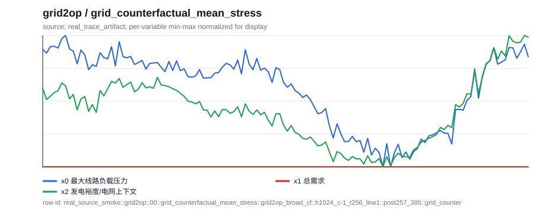
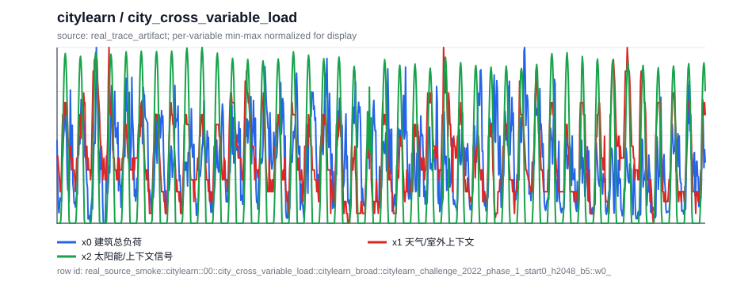
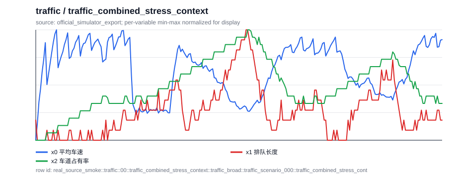
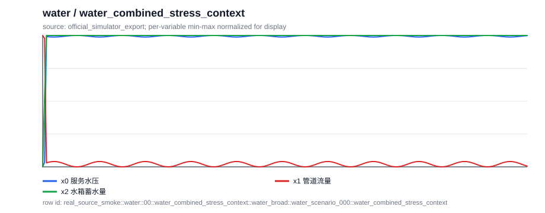
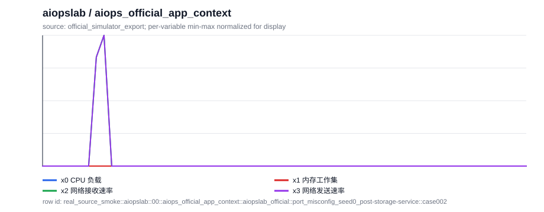
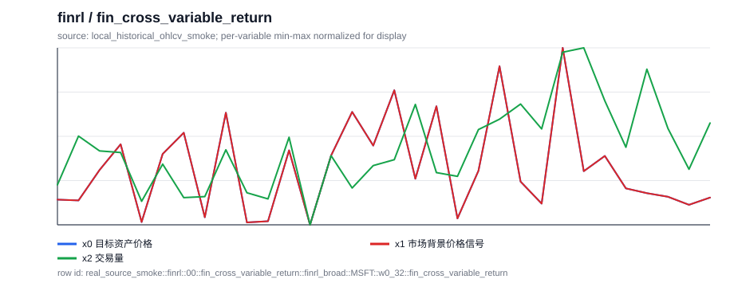

# Real-source Natural-QCC 六域 Smoke 报告（2026-05-21）

## 1. 先回答你的疑问

不是所有上一轮样本都等价于“从每个域的真实 simulator/exporter adapter 里导出来”。上一轮六域 smoke 确实覆盖了 Grid2Op、CityLearn、Traffic、Water、AIOpsLab、FinRL 的领域外观，但大多数窗口来自 controlled scenario-first generator：它先设定一个领域场景，再按程序生成符合该场景的时序。这个流程适合检查题目协议和中文自然化，但它不能代表真实 simulator/exporter 的数据分布。

support slots 的作用也不是“拿答案找问题”。更准确地说，它们是后台审计锚点：真实 trace/export 已经给出了时序窗口，程序再从窗口或 simulator 状态里计算趋势、峰值、相关、反事实差值、阈值判断等确定性证据，用来保证答案可验证。问题和 caption 应该自然地面向业务场景，而不是把这些 slot 名字拼出来。

因此下一步不能只继续堆 controlled 数据。需要把同一套 Natural-QCC 协议接到每个域的真实数据出口上，原因有三个：

1. 避免模型只学到 controlled generator 的规律，而不是各域真实 trace 的噪声、边界和分布。
2. 避免题目越来越模板化；真实出口会暴露更多自然业务问题需要的上下文。
3. 后续 smoke test 才能判断“协议能不能跨真实域运行”，而不是只判断“构造器能不能自洽”。

## 2. 本轮做了什么

- 生成总数：`60` 条。
- 每个域目标：`10` 条。
- 实际域覆盖：`{'grid2op': 10, 'citylearn': 10, 'traffic': 10, 'water': 10, 'aiopslab': 10, 'finrl': 10}`。
- source kind 分布：`{'real_trace_artifact': 20, 'official_simulator_export': 30, 'local_historical_ohlcv_smoke': 10}`。
- controlled source count：`0`。
- injected/controlled anomaly signature count：`0`。
- caption empty count：`0`。
- 中文字段缺失数：`0`。

## 3. 数据来源表

| domain | rows | source kind | source/export adapter | source artifact | 说明 |
| --- | ---: | --- | --- | --- | --- |
| `grid2op` | `10` | `real_trace_artifact` | `Grid2Op` | `.research/general-qcc-captioner-20260515/grid2op_broad_v5_semantic_anchor/grid2op_broad_v5_semantic_anchor.jsonl` | sampled from Grid2Op broad v5 semantic-anchor rows backed by local real Grid2Op traces |
| `citylearn` | `10` | `real_trace_artifact` | `CityLearn` | `.research/general-qcc-captioner-20260515/citylearn_broad_semantic_v3_qual/citylearn_broad_semantic_v3_qual.jsonl` | sampled from CityLearn broad v3 qualitative rows backed by real CityLearn trace exports |
| `traffic` | `10` | `official_simulator_export` | `SUMO` | `.research/general-qcc-captioner-20260515/multisim_qcc_v3_stable_dataflow/traffic_broad_smoke_v1/traffic_broad_smoke_v1.jsonl` | sampled from the SUMO official-simulator export smoke artifact |
| `water` | `10` | `official_simulator_export` | `WNTR` | `.research/general-qcc-captioner-20260515/multisim_qcc_v3_stable_dataflow/water_broad_smoke_v1/water_broad_smoke_v1.jsonl` | sampled from the WNTR official-simulator export smoke artifact |
| `aiopslab` | `10` | `official_simulator_export` | `AIOpsLab` | `.research/general-qcc-captioner-20260515/aiopslab_official_v3/aiopslab_official_v3.jsonl` | sampled from merged AIOpsLab Prometheus export rows; local runtime was not rerun in this script |
| `finrl` | `10` | `local_historical_ohlcv_smoke` | `FinRL-style historical OHLCV` | `.research/general-qcc-captioner-20260515/finrl_local_ohlcv_smoke_20260521/finrl_local_ohlcv_smoke_20260521.jsonl` | local smoke uses a real historical OHLCV sample because the scaled FinRL A100 artifact is not copied locally |

FinRL 的限制需要单独说明：本地没有拷贝 A100 上约 1.1GB 的 scaled FinRL artifact，所以这轮本地 smoke 使用真实历史 OHLCV 小样本。它比 controlled generator 更接近真实数据出口，但还不是最终 FinRL 大规模 exporter benchmark。

## 4. 生成协议

本轮每条样本的顺序是：

1. 读取已有真实/官方 source artifact。
2. 抽取原始时序窗口，不用 controlled generator 替换窗口。
3. 保留或计算 deterministic support slots，作为答案和 caption 的可审计证据。
4. 保留原始 gold answer 和 evidence caption。
5. 补齐自然场景、中文问题、中文选项、中文证据和 SFT prompt/output。

## 5. 代表性 Case Study

### 1. `grid2op` / `grid_counterfactual_mean_stress`

**source kind：** `real_trace_artifact`

**source row：** `grid2op_broad_cf::h1024_c-1_t256_line1::post257_385::grid_counterfactual_mean_stress`

**场景中文：** 一名电网调度员正在查看从 Grid2Op 真实仿真流程导出的局部 trace 窗口。x0 是最大线路负载压力，x1 是总需求，x2 是发电裕度或辅助电网信号。 图中的局部窗口包含 128 个时间步。

**问题中文：** 与对照或反事实基线相比，这个电网调度窗口中的干预主要带来什么影响？

**选项中文：**

- A. 干预后更低
- B. 没有实质变化
- C. 无法判断
- D. 干预后更高

**答案：** `D` / 干预后更高

**证据中文：** 确定性证据支持“干预后更高”。关键数值：全局事件后起点=257，干预步=256，线路编号=1，x0 反事实差均值=0.309，事件后局部起点=0，片段终点=385，片段起点=257。

**英文 evidence caption：** Average maximum line-loading stress x0 is higher after intervention: the mean intervention-minus-factual difference is 0.31.

### 2. `citylearn` / `city_cross_variable_load`

**source kind：** `real_trace_artifact`

**source row：** `citylearn_broad::citylearn_challenge_2022_phase_1_start0_h2048_b5::w0_1024::city_cross_variable_load`

**场景中文：** 建筑能耗控制器正在查看从 CityLearn 数据出口导出的 trace 窗口。x0 是建筑总负荷，x1 是天气/室外上下文，x2 是太阳能或其他上下文信号。 图中的局部窗口覆盖源 trace 的第 0-1024 步。

**问题中文：** 在这个建筑能耗控制窗口中，哪个伴随信号和核心信号的关系更强？

**选项中文：**

- A. x1 更相关
- B. 两者接近
- C. x2 更相关
- D. 两者都弱

**答案：** `B` / 两者接近

**证据中文：** 确定性证据支持“两者接近”。关键数值：窗口起点=0，窗口终点=1024，x1 相关=0.325，x2 相关=0.366，trace 分桶=citylearn_challenge_2022_phase_1_start0_h2048_b5::bucket00。

**英文 evidence caption：** Outdoor temperature x1 and solar support x2 have comparable association strength with total building load x0.

### 3. `traffic` / `traffic_combined_stress_context`

**source kind：** `official_simulator_export`

**source row：** `traffic_broad::traffic_scenario_000::traffic_combined_stress_context`

**场景中文：** 交通工程师正在查看来自 SUMO export adapter 的道路网络窗口。x0 是平均车速，x1 是排队长度，x2 是车道占有率。 图中的局部窗口覆盖源 trace 的第 0-256 步。

**问题中文：** 结合这个交通信号/拥堵管理时序窗口，应选择哪一个最合理的业务判断？

**选项中文：**

- A. 综合拥堵严重
- B. 综合交通状态稳定
- C. 综合拥堵中等
- D. 综合状态不清晰

**答案：** `C` / 综合拥堵中等

**证据中文：** 确定性证据支持“综合拥堵中等”。关键数值：窗口起点=0，窗口终点=256，综合压力分数=4.680，事件位置=60，事件标签=early，x0 事件指示=True。

**英文 evidence caption：** The combined-context evidence is moderate combined congestion: event label is early and the multi-signal stress score is 4.680.

### 4. `water` / `water_combined_stress_context`

**source kind：** `official_simulator_export`

**source row：** `water_broad::water_scenario_000::water_combined_stress_context`

**场景中文：** 供水网络运维人员正在查看 WNTR export 窗口。x0 是服务水压，x1 是管道流量，x2 是水箱蓄水量。 图中的局部窗口覆盖源 trace 的第 0-256 步。

**问题中文：** 结合这个供水网络运维时序窗口，应选择哪一个最合理的业务判断？

**选项中文：**

- A. 综合压力中等
- B. 综合压力严重
- C. 综合状态稳定
- D. 综合状态不清晰

**答案：** `A` / 综合压力中等

**证据中文：** 确定性证据支持“综合压力中等”。关键数值：窗口起点=0，窗口终点=256，综合压力分数=-64.94，事件位置=43，事件标签=early，x0 事件指示=False。

**英文 evidence caption：** The combined-context evidence is moderate combined stress: event label is early and the multi-signal stress score is -64.938.

### 5. `aiopslab` / `aiops_official_app_context`

**source kind：** `official_simulator_export`

**source row：** `aiopslab_official::port_misconfig_seed0_post-storage-service::case002::aiops_official_app_context`

**场景中文：** 一名 SRE 正在查看 AIOpsLab Prometheus 指标 export 窗口。x0 是 CPU 负载，x1 是内存工作集，x2 是网络接收速率，x3 是网络发送速率。 图中的局部窗口覆盖源 trace 的第 0-64 步。

**问题中文：** 从这个 AIOpsLab 指标窗口和事故元信息看，它属于哪个应用场景？

**选项中文：**

- A. social-network 应用
- B. hotel-reservation 应用
- C. astronomy-shop 应用
- D. 未知应用

**答案：** `A` / social-network 应用

**证据中文：** 确定性证据支持“social-network 应用”。关键数值：窗口起点=0，窗口终点=64，应用=social-network，应用上下文=social-network application。

**英文 evidence caption：** The official case metadata ties this telemetry window to the social-network application.

### 6. `finrl` / `fin_cross_variable_return`

**source kind：** `local_historical_ohlcv_smoke`

**source row：** `finrl_broad::MSFT::w0_32::fin_cross_variable_return`

**场景中文：** 市场分析师正在查看 FinRL 数据格式下的真实历史 OHLCV 窗口。x0 是目标资产价格，x1 是市场背景价格信号，x2 是交易量。 图中的局部窗口包含 32 个观测点，时间从 1-Aug-03 到 22-Aug-03。

**问题中文：** 在这个金融交易/风险复盘窗口中，哪个伴随信号和核心信号的关系更强？

**选项中文：**

- A. 与成交量联动
- B. 两者接近
- C. 与市场同向联动
- D. 两者都弱

**答案：** `C` / 与市场同向联动

**证据中文：** 确定性证据支持“与市场同向联动”。关键数值：窗口起点=0，窗口终点=32，开始日期=1-Aug-03，结束日期=22-Aug-03，市场相关=1.000，成交量变化相关=0.407。

**英文 evidence caption：** The best description is market co-movement: corr(target returns, market returns) is 1.000, while corr(target returns, volume changes) is 0.407.

## 6. 这轮结论

这轮解决的是“每个域都接到真实/官方数据出口，并且每域有足够小样本用于 smoke test”的问题。它还不是最终训练集，也还没有经过 LLM reviewer 大规模自然性筛选；下一步应该在这些真实来源上扩大样本量，并对自然问题和 caption 做 reviewer gate。
