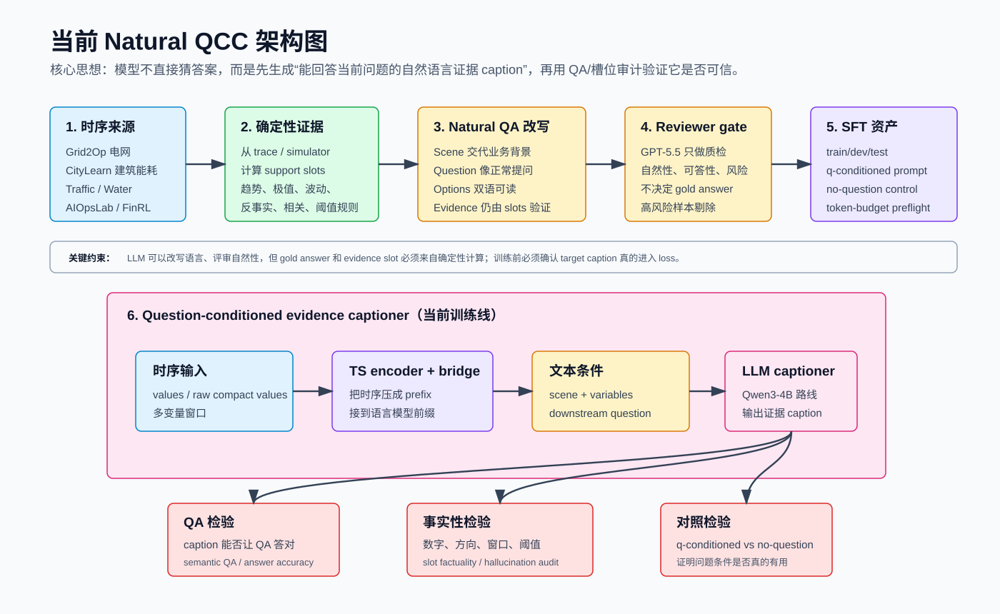
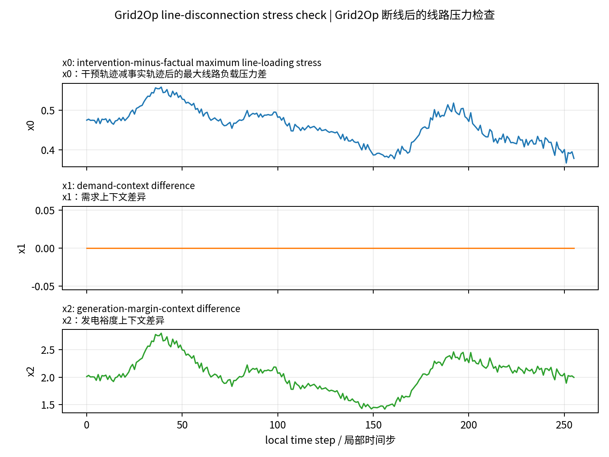
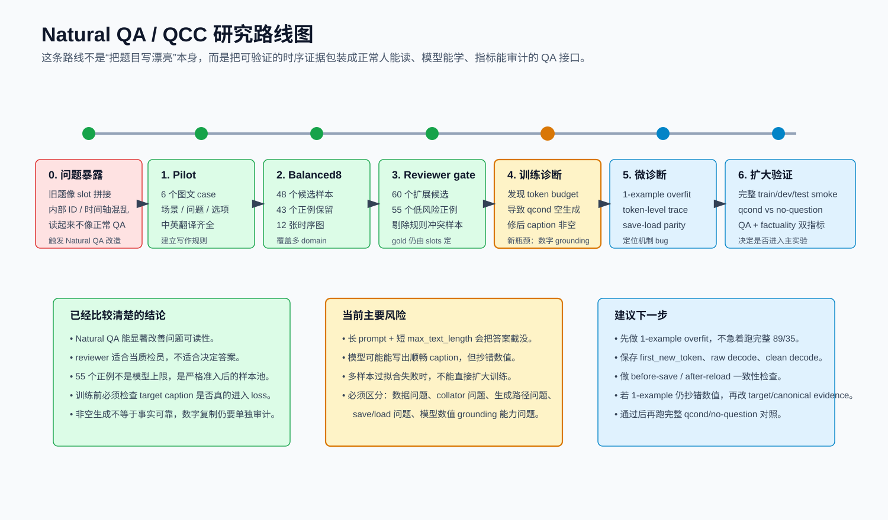

# Natural QA 改造以来的阶段性报告（2026-05-20）

这份文档用通俗语言总结：自从我们把问题从“slot/verifier 拼接题”改成 `Natural QA` 以后，已经做过什么、为什么这么做、目前看到什么问题，以及下一步应该怎么推进。

一句话概括：我们已经把问题形式从“机器内部字段题”推进到“带业务场景、双语问题、双语选项、可验证证据的自然 QA”；但训练侧刚发现并修掉一个很底层的 token-budget 问题，下一步重点不是继续堆数据，而是确认模型能不能稳定复制和使用关键数值证据。

## 1. 为什么要改成 Natural QA

之前的题目有一个明显问题：它们虽然能被程序验证，但读起来不像正常人会问的问题。比如会出现 `post769_1025`、`segment_tag`、`window_start`、`x0/x1` 没解释清楚、全局步和局部窗口混在一起等情况。这样的问题对研究不利，因为模型可能学到的是内部格式，而不是“看时序图、理解场景、提取证据、回答问题”。

Natural QA 改造的目标不是让题目变得好看，而是让它满足三个条件：

- 人能读懂：有业务场景，知道变量是什么，知道问题在问什么。
- 模型能学习：输入里有当前问题，输出是短的自然语言证据 caption。
- 程序能审计：答案和证据仍来自 deterministic support slots，不由 LLM 自己决定。

## 2. 当前总体架构

当前架构可以理解为一条“从时序数据到可验证证据 caption”的流水线：

1. 从 Grid2Op、CityLearn、Traffic、Water、AIOpsLab、FinRL 等来源拿到时序窗口。
2. 用确定性程序从 trace 或 simulator 状态里算出 support slots，例如均值、峰值、相关系数、反事实差值、阈值判断等。
3. 把原始题改写成自然 QA：先写场景，再写一个普通问题，再写四个自然选项，并补充中文翻译。
4. 用 reviewer 检查自然性、可答性和风险。Reviewer 只做质检，不决定 gold answer。
5. 通过 gate 的样本转成 SFT 资产，训练 question-conditioned evidence captioner。
6. 训练后用 QA accuracy、caption quality、slot factuality、q-conditioned vs no-question gap 来判断是否真的学会了。

## 3. 已完成的主要工作

### 3.1 写了 Natural TS-QA 的规则和 pilot

我们先做了一个 6 个样本的小 pilot，文件在：

`.research/general-qcc-captioner-20260515/natural_qa_pilot_20260519/NATURAL_TSQA_CASE_PILOT_20260519_ZH.md`

这个 pilot 做了几件关键事情：

- 每个样本都有时序图。
- 每个样本都有英文场景、中文场景、英文问题、中文问题。
- 每个样本都有 A-D 选项和中文翻译。
- 每个样本都保留原始 row id、原始问题和 support slots。
- gold answer 仍由原始 support slots 映射，不由 LLM 判断。

这一步的意义是确认：自然化不是随便润色，而是有固定模板和审计链路。

### 3.2 做了 balanced8 图文 case study

随后把范围扩大到 balanced8 case study，文件在：

`.research/general-qcc-captioner-20260515/natural_qa_balanced8_20260519/NATURAL_QA_BALANCED8_CASE_STUDY_ANALYSIS_20260519_ZH.md`

结果：

| 项目 | 数量 |
| --- | ---: |
| 总样本 | `48` |
| GPT-5.5 candidate | `43` |
| reviewer keep | `43` |
| excluded/reject | `5` |
| 正例通过率 | `43/43` candidate |

这里最重要的变化是：我们不只是做了 1-2 个漂亮例子，而是跨多个 domain 做了一批可读 case，并且让 reviewer 逐条解释为什么能保留或为什么该剔除。

### 3.3 扩展到 cross-domain Natural QCC 数据集

之后我们做了正式扩展候选池，相关文件在：

`.research/general-qcc-captioner-20260515/natural_qcc_crossdomain_dataset_20260520/`

输入候选是 60 条，经过 GPT-5.5 reviewer gate 后，形成 55 条正例。

| 指标 | 结果 |
| --- | ---: |
| reviewer 输入 | `60` |
| 正例样本 | `55` |
| 剔除样本 | `5` |
| train/dev/test | `31 / 11 / 13` |
| 最大答案占比 | `0.3636` |
| schema gate | `pass` |

按来源分布：

| 来源 | 正例数 |
| --- | ---: |
| `aiopslab_official_v3` | `12` |
| `citylearn` | `9` |
| `grid2op` | `12` |
| `traffic` | `11` |
| `water` | `11` |

这里回答了之前“为什么只有 55 道”的问题：不是只生成了 55 道，而是 60 个扩展候选里，只有 55 个同时满足 `keep`、自然性/可答性分数达标、准确性风险为 `low`。另外 5 个有规则冲突、阈值不清、证据和答案不一致等问题，不能混进训练集。

### 3.4 做了 no-question 对照资产

我们还生成了 no-question control，目录是：

`.research/general-qcc-captioner-20260515/natural_qcc_crossdomain_dataset_20260520/sft_no_question/`

它保留相同 values、target caption 和 split，只把 prompt 里的 downstream question 去掉。作用很简单：如果 no-question 和 q-conditioned 一样强，说明模型没有真正利用问题条件；如果 q-conditioned 明显更强，才说明 QCC 的核心假设成立。

### 3.5 做了训练侧 token-budget 诊断

Natural QA 改造后，prompt 变长了，因为它包含 scene、变量解释、自然问题等内容。训练时暴露了一个底层问题：旧配置的 `max_text_length=224` 太短，q-conditioned prompt 本身已经超过预算，导致 target caption 被截成 0 个 token。

通俗地说：模型训练时看到的是“长问题 + 结束符”，但没有真正看到应该学习输出的 evidence caption。因此它学到的行为就是：看到这种长 prompt 后立刻结束。表现出来就是 qcond 生成全空。

上一轮诊断结论是：

| 配置 | 现象 |
| --- | --- |
| `max_text_length=224` | qcond target caption 全部被截没，监督几乎只剩 EOS |
| `max_text_length=768` | target caption 能完整进入 loss，空生成问题消失 |

修复后做了 5-example overfit：caption 不再为空，caption quality 能过，但严格 slot factuality 仍然偏低。也就是说：底层“空生成”问题已经能解释并修复，但模型还会抄错关键数字或方向，这就是下一阶段要解决的问题。

## 4. 代表性时序 case

下面这些图来自已经完成的 pilot case，目的是说明 Natural QA 现在长什么样。图里展示时序形态；答案仍由 support slots 和 evidence 数值审计。

### 4.1 Grid2Op：断线后的线路压力

**问题中文：** 在这个事件后窗口里，断开 1 号线路对最大线路负载压力的主要影响是什么？

**选项中文：**

- A. 主要降低线路压力。
- B. 没有造成实质压力变化。
- C. 产生清晰的正向偏差，使线路压力升高。
- D. 仅凭这个窗口无法判断。

**答案：** C。  
**证据：** 事件后片段里 intervention-minus-factual 的 x0 始终为正，差值约在 0.37 到 0.56 之间。因此断线让最大线路负载压力升高。

这个例子体现了 Natural QA 的关键改动：不再问 `segment post769_1025` 这种内部字段，而是先解释“图中所有点都是断线后的局部窗口”，再问调度员真正关心的影响方向。

### 4.2 CityLearn：建筑用电需求规划

**问题中文：** 在这个窗口里，控制器应该在哪一段为更高的平均用电需求做准备？

**选项中文：**

- A. 窗口后半段。
- B. 窗口前半段。
- C. 前后两半差不多。
- D. 仅凭图无法判断。

**答案：** B。  
**证据：** x0 前半段均值为 7.77，高于后半段均值 6.65。

这个例子把“比较前后半均值”改成了“能耗控制器应该提前为哪段需求做准备”，更像一个正常业务问题。

### 4.3 FinRL：MRK 回撤风险复盘

**问题中文：** 从风险管理角度看，这段 MRK 窗口应该如何描述？

**选项中文：**

- A. 中等回撤。
- B. 轻微回撤。
- C. 严重回撤。
- D. 回撤很小。

**答案：** C。  
**证据：** 在 2023-02-14 到 2025-02-28 的窗口中，最大回撤约为 36.65%，超过严重回撤阈值。

这个例子修掉了之前“股票代码由问题指定”这种不自然描述，直接把 `MRK` 和时间范围放进场景。

### 4.4 Water：供水网络服务状态

**问题中文：** 这个供水网络窗口最符合哪种运行状态？

**选项中文：**

- A. 漏水压力下的网络。
- B. 低水压服务风险。
- C. 水力状态不清楚。
- D. 稳定供水服务。

**答案：** D。  
**证据：** 平均水压为 83.43，最低水压为 57.73，平均流量为 10.71，对应稳定供水服务。

这个例子不是只问“均值是多少”，而是要求结合供水背景判断服务状态。

### 4.5 Traffic：自适应信号是否改善队列

**问题中文：** 在这个窗口里，自适应信号策略是否改善了排队情况？

**选项中文：**

- A. 是，它降低了平均队列长度。
- B. 两种策略的平均队列长度相同。
- C. 给出的平均队列长度不足以判断。
- D. 没有，它提高了平均队列长度。

**答案：** D。  
**证据：** 自适应信号下平均队列为 2.91，高于匹配固定信号基线的 2.56。

这个例子展示了反事实/基线类问题如何自然化：用户关心的是“策略有没有改善”，不是内部的 factual/counterfactual 变量名。

### 4.6 AIOpsLab：内存压力是否累积

**问题中文：** 在这个事故窗口中，内存压力是在缓解还是在累积？

**选项中文：**

- A. 前半段更高，因此后面压力缓解。
- B. 后半段更高，因此压力在累积。
- C. 前后两半差不多。
- D. 这些遥测不足以判断。

**答案：** B。  
**证据：** x1 前半段均值为 12,725,660.44，后半段均值为 14,534,246.40。

这个例子说明 AIOps 题不应只是“x1 哪半更高”，而应转成 SRE 能理解的事故压力判断。

## 5. 研究路线图

目前路线可以分成三个阶段：

### 已完成：自然化和准入规则

我们已经完成了从“内部字段题”到“自然 QA”的第一轮改造，包括 pilot、balanced8、cross-domain 扩展、GPT-5.5 reviewer gate、SFT 资产和 no-question 对照。

这一阶段最有价值的结论是：问题质量确实能明显改善，而且 reviewer 能有效发现规则冲突、证据矛盾、阈值不清这类样本问题。

### 当前：训练链路诊断

现在主要问题已经不在“题目能不能读懂”，而在“模型训练时有没有真正学到证据”。token-budget 诊断说明，Natural QA 的长 prompt 会让旧训练配置失效；修复后模型能输出非空 caption，但还不稳定，尤其容易抄错数值。

### 下一步：小规模机制验证

不建议现在直接跑大规模完整实验。更合理的是先做三个微诊断：

1. **1-example overfit**：只用一个样本训练到过拟合，看模型能不能精确复述关键数值。
2. **token-level generation trace**：保存第一步生成 token、raw decode、clean decode，确认不是 EOS、切片或 cleaner 问题。
3. **save-load parity**：比较保存前和重新加载后的生成结果，排除 LoRA/checkpoint 加载问题。

只有这些都通过，再跑完整 train/dev/test 和 qcond/no-question 对照，才有解释价值。

## 6. 当前结论

目前的结论可以说得很简单：

- Natural QA 方向是合理的。它解决的是“问题不像正常问题”的质量问题。
- 55 个正例是严格质检后的结果，不是生成能力只能到 55。
- Reviewer 的作用是质检语言和可答性，不能替代 deterministic support slots。
- 训练失败的主因之一已经明确：旧 token budget 把 target caption 截没了。
- 修复 token budget 后，空生成改善了，但事实性还没过关，尤其是关键数字和方向的复制。
- 下一步最该做的是机制诊断，不是直接扩大数据或跑长训练。

## 7. 对下一步的建议

下一轮优先级建议如下：

| 优先级 | 动作 | 为什么 |
| --- | --- | --- |
| P0 | 对 Natural QCC SFT 增加 hard preflight | 防止 target caption 再次被静默截断 |
| P0 | 跑 1-example overfit + token trace | 判断模型是否能学会最小可验证样本 |
| P1 | 做 save-load parity | 排除 checkpoint/LoRA 加载导致的生成异常 |
| P1 | 若仍抄错数值，改 evidence target 格式 | 让关键数值更稳定、更容易被模型复制 |
| P2 | 通过后再跑完整 qcond/no-question | 只有这时大规模结果才有解释价值 |

这里没有使用生图模型生成架构图和路线图。原因是这两张图包含具体研究事实、数值和流程，使用可复现 SVG 更稳，不容易引入幻觉。后续如果需要做展示封面或非事实性视觉背景，再调用生图模型更合适。
