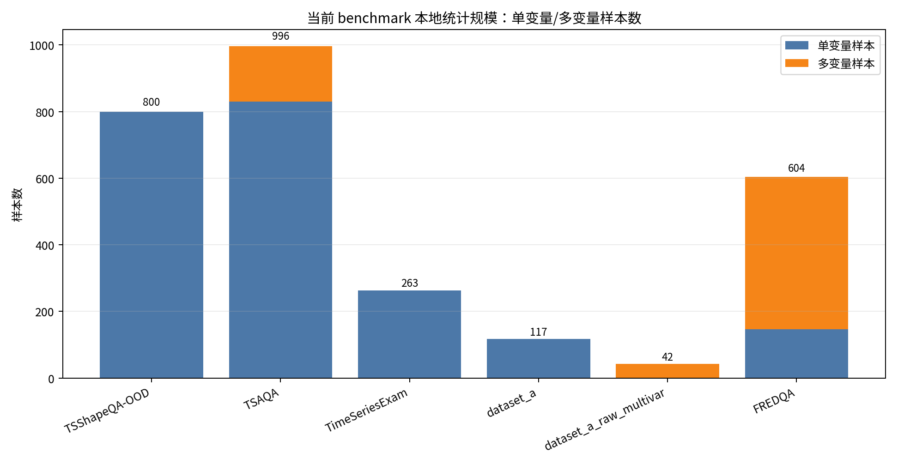
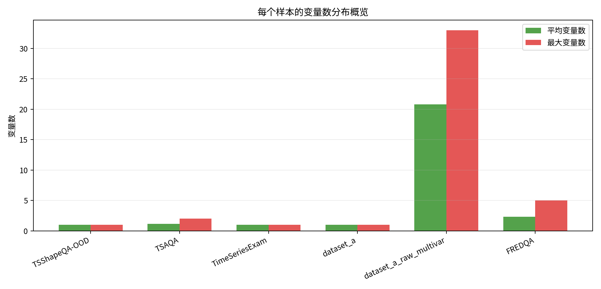
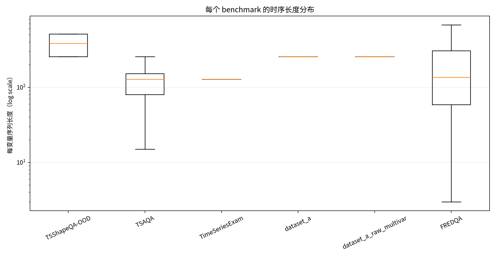
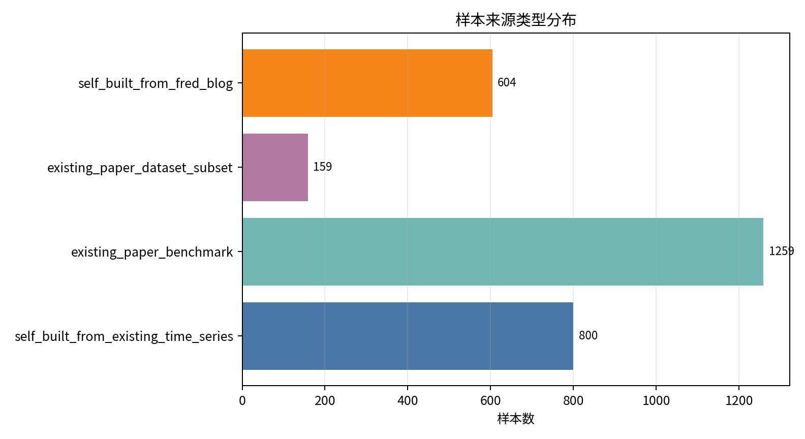

# 当前 Benchmark 数据结构统计报告

本报告只统计当前 LTSGen case study / full-eval 实际使用或单列分析的 benchmark 口径：`TSShapeQA-OOD`、`TSAQA`、`TimeSeriesExam`、`dataset_a`、`dataset_a_raw_multivar`、`FREDQA`。

## 口径说明

- `变量数`：一个 QA 样本输入给模型的时间序列通道数。
- `时序长度`：每个变量的时间步数；若同一样本多变量长度不同，明细表同时记录 `min_length` 和 `max_length`。
- `benchmark 规模`：这里优先报告当前本地评测/分析实际覆盖的规模，同时在来源列说明外部公开 benchmark 的总规模。
- `dataset_a` 和 `dataset_a_raw_multivar` 分开统计：前者是当前 117 条单变量评测集，后者是原始 dataset-A 中 42 条多变量问题。

## 总览

- 当前统计覆盖 `2822` 个本地样本口径。
- 多变量样本 `666` 个，占 `23.6%`。
- 来自现有论文/公开 benchmark 或其数据子集的样本 `1418` 个，占 `50.2%`；其余为本项目自建诊断/领域 QA。

### Benchmark 级汇总
| Benchmark | 本地规模 | 单变量 | 多变量 | 变量数中位数 | 最大变量数 | 长度中位数 | 最短 | 最长 | 来源类型 |
| --- | --- | --- | --- | --- | --- | --- | --- | --- | --- |
| TSShapeQA-OOD | 800 | 800 | 0 | 1.0 | 1 | 384.0 | 256 | 512 | self_built_from_existing_time_series |
| TSAQA | 996 | 830 | 166 | 1.0 | 2 | 128.0 | 15 | 345 | existing_paper_benchmark |
| TimeSeriesExam | 263 | 263 | 0 | 1 | 1 | 128 | 128 | 308 | existing_paper_benchmark |
| dataset_a | 117 | 117 | 0 | 1 | 1 | 256 | 256 | 256 | existing_paper_dataset_subset |
| dataset_a_raw_multivar | 42 | 0 | 42 | 20.5 | 33 | 256.0 | 256 | 256 | existing_paper_dataset_subset |
| FREDQA | 604 | 146 | 458 | 2.0 | 5 | 136.0 | 3 | 1178 | self_built_from_fred_blog |

### 来源与规模说明
| Benchmark | 来源判断 | 当前本地规模 | 外部/原始规模 | 本地数据源 |
| --- | --- | --- | --- | --- |
| TSShapeQA-OOD | 本项目自建诊断 benchmark；底层时间序列来自 Time-MMD、exchange_rate、illness 等现有真实数据，问题由本地规则特征和 GPT 生成/校验。 | 当前 OOD 评测集 800 题。 | 无独立外部论文规模；这是当前项目构造的诊断集。 | LTSGEN-ext-a/data/tsshapeqa/tsshapeqa_v1.jsonl |
| TSAQA | 现有论文/公开数据集 benchmark；当前使用本地 996 条评测子集，每个任务 166 条。 | 当前评测子集 996 题；6 个任务各 166 题。 | TSAQA 数据卡说明其覆盖约 210k samples、13 个领域；Hugging Face 标注规模为 100K<n<1M。 | LTSGEN-ext-a/results/phase_a_rft/*_items.jsonl + results/tsaqa_eval/predictions.jsonl |
| TimeSeriesExam | 现有论文 benchmark；当前使用本地抽样的 263 条题目。 | 当前本地评测子集 263 题。 | 原 TimeSeriesExam 论文报告超过 700 道程序生成的多选题，来自 104 个模板。 | LTSGEN-ext-a/results/q2_timeseriesexam/items_n500.jsonl |
| dataset_a | ChatTS 论文/代码中的 dataset-A；当前 full-eval 使用 117 条单变量子集。 | 当前已评测单变量子集 117 题。 | 本地 raw dataset_a 为 159 题，其中 117 条单变量、42 条多变量。 | LTSGEN-ext-a/data/chatts_bench/dataset_a_uv.json |
| dataset_a_raw_multivar | ChatTS dataset-A 原始多变量部分；当前作为多变量补充分析口径单列。 | 当前多变量子集 42 题。 | 本地 raw dataset_a 为 159 题，其中 42 条多变量。 | LTSGEN-ext-a/data/chatts_bench/dataset/dataset_a.json |
| FREDQA | 本项目整理/构造的宏观经济领域 QA；底层来自 FRED/FRED blog 风格经济序列，本地未发现独立公开 benchmark 论文元信息。 | 当前本地 QA/eval 集 604 题。 | 本地构造口径；无外部论文总规模可引用。 | .research/fredqa-rerun-20260511/fredqa_qa_items.jsonl |

## 变量数分布

| Benchmark | 变量数 | 样本数 | 占比 |
| --- | --- | --- | --- |
| TSShapeQA-OOD | 1 | 800 | 1.0 |
| TSAQA | 1 | 830 | 0.8333 |
| TSAQA | 2 | 166 | 0.1667 |
| TimeSeriesExam | 1 | 263 | 1.0 |
| dataset_a | 1 | 117 | 1.0 |
| dataset_a_raw_multivar | 13 | 3 | 0.0714 |
| dataset_a_raw_multivar | 14 | 5 | 0.119 |
| dataset_a_raw_multivar | 15 | 4 | 0.0952 |
| dataset_a_raw_multivar | 16 | 3 | 0.0714 |
| dataset_a_raw_multivar | 20 | 6 | 0.1429 |
| dataset_a_raw_multivar | 21 | 1 | 0.0238 |
| dataset_a_raw_multivar | 22 | 2 | 0.0476 |
| dataset_a_raw_multivar | 23 | 4 | 0.0952 |
| dataset_a_raw_multivar | 24 | 2 | 0.0476 |
| dataset_a_raw_multivar | 25 | 4 | 0.0952 |
| dataset_a_raw_multivar | 26 | 3 | 0.0714 |
| dataset_a_raw_multivar | 27 | 1 | 0.0238 |
| dataset_a_raw_multivar | 28 | 1 | 0.0238 |
| dataset_a_raw_multivar | 33 | 3 | 0.0714 |
| FREDQA | 1 | 146 | 0.2417 |
| FREDQA | 2 | 233 | 0.3858 |
| FREDQA | 3 | 137 | 0.2268 |
| FREDQA | 4 | 70 | 0.1159 |
| FREDQA | 5 | 18 | 0.0298 |

## 时序长度分布

| Benchmark | 长度区间 | 样本数 | 占比 |
| --- | --- | --- | --- |
| TSShapeQA-OOD | 129-256 | 331 | 0.4138 |
| TSShapeQA-OOD | 257-512 | 469 | 0.5863 |
| TSAQA | <=32 | 38 | 0.0382 |
| TSAQA | 33-64 | 96 | 0.0964 |
| TSAQA | 65-128 | 425 | 0.4267 |
| TSAQA | 129-256 | 305 | 0.3062 |
| TSAQA | 257-512 | 132 | 0.1325 |
| TimeSeriesExam | 65-128 | 251 | 0.9544 |
| TimeSeriesExam | 129-256 | 5 | 0.019 |
| TimeSeriesExam | 257-512 | 7 | 0.0266 |
| dataset_a | 129-256 | 117 | 1.0 |
| dataset_a_raw_multivar | 129-256 | 42 | 1.0 |
| FREDQA | <=32 | 94 | 0.1556 |
| FREDQA | 33-64 | 79 | 0.1308 |
| FREDQA | 65-128 | 123 | 0.2036 |
| FREDQA | 129-256 | 108 | 0.1788 |
| FREDQA | 257-512 | 133 | 0.2202 |
| FREDQA | >512 | 67 | 0.1109 |

## 任务/题型分布

| Benchmark | 任务/属性 | 样本数 | 占比 |
| --- | --- | --- | --- |
| TSShapeQA-OOD | EXTREMA_POS | 267 | 0.3337 |
| TSShapeQA-OOD | TREND | 267 | 0.3337 |
| TSShapeQA-OOD | VOLATILITY_REGION | 266 | 0.3325 |
| TSAQA | classification | 166 | 0.1667 |
| TSAQA | anomaly_detection | 166 | 0.1667 |
| TSAQA | characterization | 166 | 0.1667 |
| TSAQA | temporal_relationship | 166 | 0.1667 |
| TSAQA | comparison | 166 | 0.1667 |
| TSAQA | data_transformation | 166 | 0.1667 |
| TimeSeriesExam | Pattern Recognition | 100 | 0.3802 |
| TimeSeriesExam | Anolmaly Detection | 89 | 0.3384 |
| TimeSeriesExam | Noise Understanding | 74 | 0.2814 |
| dataset_a | causal;causal;causal | 15 | 0.1282 |
| dataset_a | causal;causal | 12 | 0.1026 |
| dataset_a | deductive;deductive | 10 | 0.0855 |
| dataset_a | deductive | 8 | 0.0684 |
| dataset_a | causal | 7 | 0.0598 |
| dataset_a | deductive;deductive;deductive | 5 | 0.0427 |
| dataset_a | causal;causal;causal;causal | 4 | 0.0342 |
| dataset_a | local;noise;season | 3 | 0.0256 |
| dataset_a | local-inductive;trend;local | 2 | 0.0171 |
| dataset_a | local;trend;season | 2 | 0.0171 |
| dataset_a | trend;noise;season | 2 | 0.0171 |
| dataset_a | trend;local;season | 2 | 0.0171 |
| dataset_a_raw_multivar | local-cluster-inductive;local-correlation-inductive | 16 | 0.381 |
| dataset_a_raw_multivar | local-correlation-inductive;local-cluster-inductive | 11 | 0.2619 |
| dataset_a_raw_multivar | shape-cluster-inductive;shape-correlation-inductive | 10 | 0.2381 |
| dataset_a_raw_multivar | shape-correlation-inductive;shape-cluster-inductive | 5 | 0.119 |
| FREDQA | Causal Reasoning - Interventional | 112 | 0.1854 |
| FREDQA | Causal Reasoning - Counterfactual | 102 | 0.1689 |
| FREDQA | Inductive Reasoning;Abductive Reasoning | 67 | 0.1109 |
| FREDQA | Causal Reasoning - Associational | 59 | 0.0977 |
| FREDQA | Abductive Reasoning;Analogical Reasoning | 43 | 0.0712 |
| FREDQA | Deductive Reasoning;Abductive Reasoning | 30 | 0.0497 |
| FREDQA | Abductive Reasoning | 27 | 0.0447 |
| FREDQA | Analogical Reasoning;Abductive Reasoning | 26 | 0.043 |
| FREDQA | Abductive Reasoning;Inductive Reasoning | 18 | 0.0298 |
| FREDQA | Inductive Reasoning;Analogical Reasoning | 13 | 0.0215 |
| FREDQA | Inductive Reasoning;Abductive Reasoning;Analogical Reasoning | 13 | 0.0215 |
| FREDQA | Deductive Reasoning;Analogical Reasoning | 11 | 0.0182 |

完整逐样本明细在 `tables/benchmark_sample_statistics.csv`；完整任务分布在 `tables/benchmark_task_distribution.csv`。

## 原子能力/属性分布

这个表把 Dataset-A 和 FREDQA 中的组合能力标签拆开统计。同一个样本可能同时计入多个原子属性，因此占比相加可以超过 100%。

| Benchmark | 原子能力/属性 | 含该属性样本数 | 占该 benchmark 样本比例 |
| --- | --- | --- | --- |
| TSShapeQA-OOD | EXTREMA_POS | 267 | 0.3337 |
| TSShapeQA-OOD | TREND | 267 | 0.3337 |
| TSShapeQA-OOD | VOLATILITY_REGION | 266 | 0.3325 |
| TSAQA | classification | 166 | 0.1667 |
| TSAQA | anomaly_detection | 166 | 0.1667 |
| TSAQA | characterization | 166 | 0.1667 |
| TSAQA | temporal_relationship | 166 | 0.1667 |
| TSAQA | comparison | 166 | 0.1667 |
| TSAQA | data_transformation | 166 | 0.1667 |
| TimeSeriesExam | Pattern Recognition | 100 | 0.3802 |
| TimeSeriesExam | Anolmaly Detection | 89 | 0.3384 |
| TimeSeriesExam | Noise Understanding | 74 | 0.2814 |
| dataset_a | causal | 92 | 0.7863 |
| dataset_a | deductive | 43 | 0.3675 |
| dataset_a | noise | 42 | 0.359 |
| dataset_a | local | 42 | 0.359 |
| dataset_a | trend | 41 | 0.3504 |
| dataset_a | season | 37 | 0.3162 |
| dataset_a | local-inductive | 30 | 0.2564 |
| dataset_a_raw_multivar | local-cluster-inductive | 27 | 0.6429 |
| dataset_a_raw_multivar | local-correlation-inductive | 27 | 0.6429 |
| dataset_a_raw_multivar | shape-cluster-inductive | 15 | 0.3571 |
| dataset_a_raw_multivar | shape-correlation-inductive | 15 | 0.3571 |
| FREDQA | Abductive Reasoning | 274 | 0.4536 |
| FREDQA | Inductive Reasoning | 157 | 0.2599 |
| FREDQA | Analogical Reasoning | 152 | 0.2517 |
| FREDQA | Causal Reasoning - Interventional | 118 | 0.1954 |
| FREDQA | Causal Reasoning - Counterfactual | 103 | 0.1705 |
| FREDQA | Causal Reasoning - Associational | 84 | 0.1391 |
| FREDQA | Deductive Reasoning | 69 | 0.1142 |
| FREDQA | Comparative or Analogical Reasoning | 1 | 0.0017 |
| FREDQA | Analytical Reasoning | 1 | 0.0017 |

完整原子属性分布在 `tables/benchmark_atomic_attribute_distribution.csv`。

## 关键观察

1. **TSShapeQA-OOD 是自建、单变量、固定窗口诊断集。** 它的变量数恒为 1，长度集中在 256/384/512，适合诊断趋势、极值位置和波动半区等纯形态能力。
2. **TSAQA 是现有公开 benchmark，本地评测子集规模最大。** 当前 996 条覆盖 6 个任务，每类 166 条；其中 comparison 任务带来主要多变量输入。
3. **TimeSeriesExam 是现有论文 benchmark 的本地子集。** 当前 263 条均为单变量，但长度跨度较大，适合观察 LLM 对通用时序概念的理解，而不是领域知识。
4. **dataset_a 的两个口径不能混用。** 当前 full-eval 的 `dataset_a` 是 117 条单变量问题；原始 `dataset_a_raw_multivar` 有 42 条多变量问题，变量数可到 33，任务性质更接近领域/因果/聚类/相关性分析。
5. **FREDQA 是当前最重要的自建领域 QA。** 它覆盖 604 条宏观经济问题，变量数 1-5、长度跨度很大；很多问题需要领域机制或指定窗口数值证据，因此不能只和纯形态 benchmark 混在一起解释。

## 输出文件

- `tables/benchmark_sample_statistics.csv`：逐样本变量数、长度、任务、来源。
- `tables/benchmark_summary.csv`：每个 benchmark 的规模、变量数/长度统计、来源说明。
- `tables/benchmark_nvars_distribution.csv`：每个 benchmark 的变量数分布。
- `tables/benchmark_length_bins.csv`：每个 benchmark 的长度区间分布。
- `tables/benchmark_task_distribution.csv`：任务/属性分布。
- `tables/benchmark_atomic_attribute_distribution.csv`：拆分后的原子能力/属性分布。

## 外部参考

- TSAQA Hugging Face dataset card: https://huggingface.co/datasets/TSAQA/TSAQA-Benchmark
- TSAQA arXiv: https://arxiv.org/abs/2601.23204
- TimeSeriesExam arXiv: https://arxiv.org/abs/2410.14752
- ChatTS PVLDB paper: https://www.vldb.org/pvldb/vol18/p2385-xie.pdf
