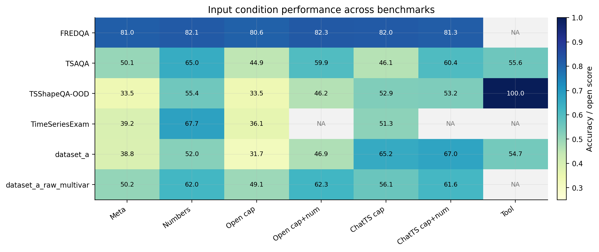
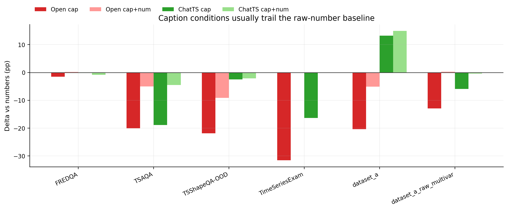
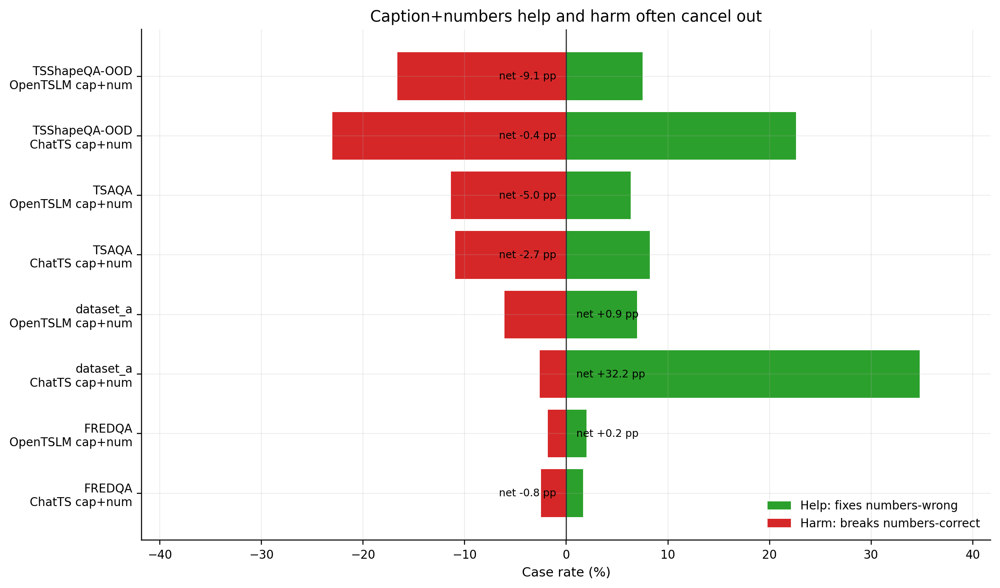
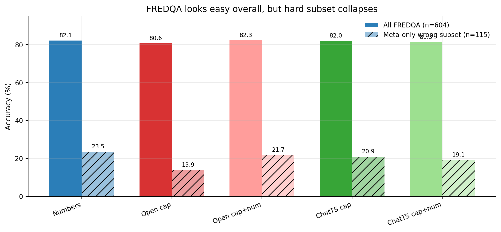
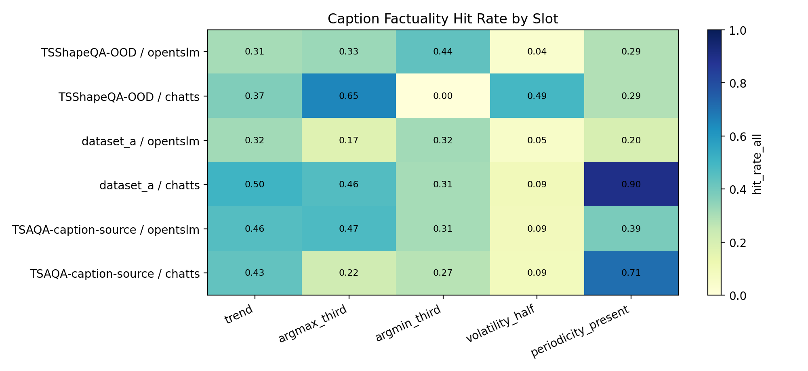
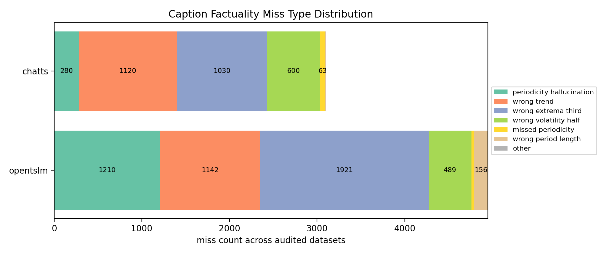
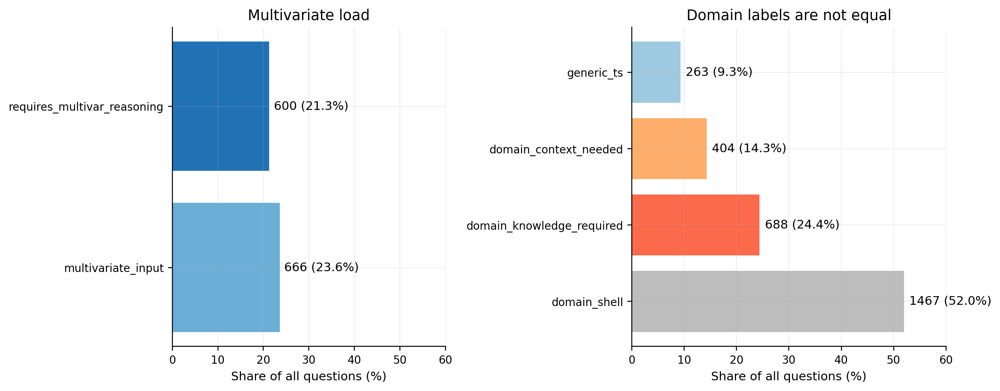
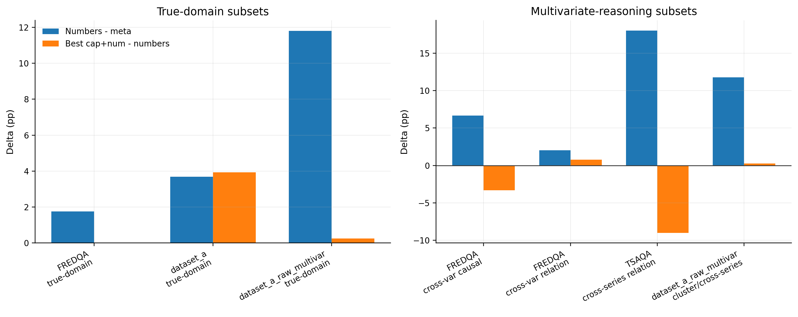

# LTSGen Case Study 与统计综合分析报告

本报告把三份既有报告和两轮最新统计实验放到同一条证据链里，而不是把它们并列拼接。核心问题是：当前 caption interface 在 Time Series QA 中到底失败在哪里，失败规模有多大，哪些 benchmark 的准确率可以解释为真实时序证据使用，哪些主要来自题干、选项或领域先验。

## 0. 证据层级关系

| 层级 | 材料 | 回答的问题 | 在本报告中的作用 |
| --- | --- | --- | --- |
| L0 现象发现 | [Balanced Case Study 中文汇报版](../20260511-balanced-zh/balanced_case_study_zh_notion.md) | 具体 case 中 caption、numbers、caption+numbers、tool-agent 分别怎么错 | 提供跨 TSShapeQA、dataset_a、FREDQA、TSAQA、TimeSeriesExam 的失败模式和代表性 case |
| L1 分布验证 | [Full Eval Statistics](../20260511-full-eval-statistics/full_eval_statistics_report_zh.md) | L0 观察到的失败模式在全量 artifact 中占多少 | 把 case 现象转成全量统计，例如 help/harm、两个 caption 都错但 numbers 对、tool-agent rescue |
| L2 覆盖补洞 | [FREDQA Rerun](../20260512-fredqa-rerun-zh/fredqa_rerun_case_study_zh.md) | Full Eval 当时没有 FREDQA multi-condition eval，补跑后结论是否变化 | 不是第三条平行证据，而是补齐 L1 的 FREDQA 缺口，并引入 meta-only hard subset |
| L3 机制拆解 | [Caption factuality slot table](tables/caption_factuality_full_per_slot.csv) | caption 中每个事实槽位和 numpy GT 是否一致 | 把“caption 幻觉/信息损失”从定性判断推进到 slot-level factuality |
| L4 任务结构拆解 | [Multivariate/domain condition tables](tables/overall_condition_deltas.csv) | benchmark 里到底有多少多变量题、真领域题，以及这些子集上各条件表现如何 | 区分“领域外壳”和“真实领域知识”，并量化多变量负载 |

因此，FREDQA rerun 不能和 Balanced / Full Eval 简单并列。Balanced 先发现 FREDQA 类问题需要指定窗口、比值、反事实和领域机制；Full Eval 明确当时 FREDQA 缺完整多条件评测；FREDQA rerun 是对这个缺口的补实验。最新 factuality 与 multivar/domain 统计则进一步回答机制问题：caption 为什么不稳定，以及哪些问题本来就不是简单形态描述能解决。

## 1. 核心结论

1. **caption-only 不是稳定证据接口。** 在 TSShapeQA-OOD、TSAQA、TimeSeriesExam 上，OpenTSLM caption-only 分别为 33.5%、44.9%、36.1%，均低于 numbers；ChatTS 通常更强，但仍不稳定。dataset_a 是重要例外，ChatTS caption / caption+numbers 的 mean score 达到 0.652 / 0.670，说明更任务化、更具体的 caption 在局部领域样本上确实能帮忙。

2. **caption+numbers 不保证单调提升。** TSShapeQA-OOD 上 OpenTSLM caption+numbers 比 numbers 低 9.1 pp，TSAQA 上 OpenTSLM / ChatTS caption+numbers 分别低 5.0 pp / 4.5 pp。FREDQA 补跑后，OpenTSLM caption+numbers 只比 numbers 高 0.17 pp，ChatTS caption+numbers 反而低 0.83 pp。caption 会改变下游决策，但净效果常被 harm 抵消。

3. **OpenTSLM 的事实性问题已经被 slot-level 统计确认。** 在 full factuality audit 中，OpenTSLM 的 periodicity hallucination rate 达到 TSShapeQA-OOD 69.7%、dataset_a 75.7%、TSAQA-caption-source 59.4%。这说明 Balanced 报告中“把局部 spike / mixed trend 写成周期性或单调趋势”的 case 不是孤例。

4. **ChatTS 更保守，但不是 oracle。** ChatTS 在 TSShapeQA argmax_third 上 hit rate 65.0%，明显高于 OpenTSLM 32.8%；但在 TSAQA-caption-source 上 trend hit rate 只有 43.2%，periodicity hallucination 仍有 24.9%。ChatTS 的优势更像“少犯某些 OpenTSLM 常见错误”，不是全面可靠的中间表示。

5. **FREDQA 的总体 80%+ accuracy 不能直接解释为时序理解。** FREDQA meta-only 已经达到 489/604 = 80.96%。过滤掉 meta-only 能答对的样本后，hard subset 只有 115 题，numbers 只救回 27/115，OpenTSLM caption 16/115，ChatTS caption 24/115。这说明 FREDQA 的总准确率主要受题干、选项和领域先验影响。

6. **多变量和真领域题的规模不小，但不能和“领域外壳”混淆。** 当前纳入统计的 2822 题中，多变量输入 666 题，占 23.6%；真正需要跨序列推理 600 题，占 21.3%；需要领域知识 688 题，占 24.4%；domain_shell 1467 题，占 52.0%。因此，后续分析必须分开汇报“披领域外壳的通用形态题”和“确实需要领域机制的题”。

## 2. 写作组织

本版报告已经合并核心统计和代表性 case。若后续要扩写成更长的 Notion / paper appendix，建议分三批继续：

| 批次 | 内容 | 目的 |
| --- | --- | --- |
| Batch A | 证据关系、全局统计、factuality audit | 给导师快速判断主结论是否站得住 |
| Batch B | 折叠 case bank，按失败机制组织而不是按数据集堆叠 | 展示每个统计结论背后的具体样本 |
| Batch C | 附录表、完整 per-slot/per-domain/per-multivar 表、artifact map | 供复查数字和后续论文写作引用 |

## 3. 全局统计分析

### 3.1 输入条件总览

上面两张图的读法是：第一张把各 benchmark 的输入条件表现放在同一张 heatmap 里，颜色越深表示准确率或 open score 越高；第二张只看相对 `numbers` 的变化，0 线以上表示 caption 条件超过 raw numbers，0 线以下表示 caption 条件弱于 raw numbers。

| Benchmark | 指标 | meta_only | numbers | OpenTSLM caption | OpenTSLM cap+num | ChatTS caption | ChatTS cap+num | numbers 相对 meta | 最优 cap+num 相对 numbers | 统计意义 |
| --- | --- | ---: | ---: | ---: | ---: | ---: | ---: | ---: | ---: | --- |
| FREDQA | accuracy | 0.810 | 0.821 | 0.806 | 0.823 | 0.820 | 0.813 | +0.012 | +0.002 | 总体很高，但 numbers 只比 meta 多 1.2 pp，说明强语言先验存在 |
| TSAQA | accuracy | 0.501 | 0.650 | 0.449 | 0.599 | 0.461 | 0.604 | +0.149 | -0.045 | numbers 明显有用，但 caption+numbers 仍低于 numbers |
| TSShapeQA-OOD | accuracy | 0.335 | 0.554 | 0.335 | 0.463 | 0.529 | 0.532 | +0.219 | -0.021 | 纯形态题中 OpenTSLM caption 几乎退化到 meta-only |
| TimeSeriesExam | accuracy | 0.392 | 0.677 | 0.361 | NA | 0.513 | NA | +0.285 | NA | numbers 是强基线，caption-only 均显著落后 |
| dataset_a | open score | 0.388 | 0.520 | 0.317 | 0.469 | 0.652 | 0.670 | +0.132 | +0.149 | ChatTS 在这个开放题集合上明显提供任务化线索 |
| dataset_a_raw_multivar | open score | 0.502 | 0.620 | 0.491 | 0.623 | 0.561 | 0.616 | +0.118 | +0.003 | 多变量开放题中 cap+num 基本贴近 numbers，caption-only 不够 |

**观察。** numbers 相对 meta 的提升在 TSShapeQA、TSAQA、TimeSeriesExam、dataset_a_raw_multivar 上都为正，说明时间序列证据确实有用。但 caption-only 多数低于 numbers，尤其 OpenTSLM caption 在 TSShapeQA 和 TimeSeriesExam 上分别低 21.9 pp 和 31.6 pp。

**解释。** 自由文本 caption 压缩了时间序列，只有当 caption 恰好保留了任务所需的局部位置、变量关系或领域语义时才有帮助。否则，caption 会丢掉 raw numbers 中仍可被下游模型利用的证据。

**含义。** 不能只报告 caption 是否“流畅”，要报告它是否保留 answer-supporting evidence。dataset_a 上 ChatTS 的正向结果说明 caption interface 不是完全没价值，但需要任务化 schema 或更强事实约束。

口径说明：3.1 的 `numbers` 使用综合统计表中的 canonical baseline；3.2 的 help/harm 是逐题配对统计，在 TSShapeQA-OOD 和 TSAQA 上会使用与对应 caption run 匹配的 numbers baseline。因此个别净效应和 3.1 中的总体准确率差值不会完全一一相等，3.2 更适合解释“同一题上 caption 加入后救回还是伤害”。

### 3.2 Caption help/harm

这张图把 `help` 和 `harm` 放在同一条水平轴上：右侧绿色表示 caption+numbers 救回了 numbers 错的样本，左侧红色表示 caption+numbers 把 numbers 对的样本带错。它比单个 accuracy 更适合判断 caption 是否稳定提供净收益。

| Dataset | 条件 | help | harm | 净效应 | 背后意义 |
| --- | --- | ---: | ---: | ---: | --- |
| TSShapeQA-OOD | OpenTSLM cap+num vs numbers | 60 | 133 | -9.1 pp | OpenTSLM caption 更多是在污染数值证据 |
| TSShapeQA-OOD | ChatTS cap+num vs numbers | 181 | 184 | -0.4 pp | ChatTS 有大量 help，但也有同量 harm，净收益接近 0 |
| TSAQA | OpenTSLM cap+num vs numbers | 63 | 113 | -5.0 pp | 混合 QA 中 caption 仍不可靠 |
| TSAQA | ChatTS cap+num vs numbers | 82 | 109 | -2.7 pp | ChatTS 较好但仍为负净效应 |
| dataset_a | OpenTSLM cap+num vs numbers | 8 | 7 | +0.9 pp | OpenTSLM 混合输入基本打平 numbers |
| dataset_a | ChatTS cap+num vs numbers | 40 | 3 | +32.2 pp | ChatTS 对 dataset_a 具有明显任务适配优势 |
| FREDQA | OpenTSLM cap+num vs numbers | 12 | 11 | +0.17 pp | 总体几乎打平，说明成功和伤害互相抵消 |
| FREDQA | ChatTS cap+num vs numbers | 10 | 15 | -0.83 pp | 加 caption 改变决策，但没有稳定收益 |

**观察。** caption+numbers 的净效应在多数 benchmark 上非正，唯一明显正例是 dataset_a 的 ChatTS。

**解释。** caption 会重加权下游 LLM 的注意力。如果 caption 事实正确且表达了任务需要的局部证据，它能救回 numbers 难以直接读出的 case；如果 caption 泛化、幻觉或与问题不对齐，它会覆盖或污染 raw numbers。

**含义。** 后续改进方向应区分两类问题：captioner 事实性差，和下游 LLM 不知道何时信 caption、何时信 numbers。只提高语言流畅性不能解决 help/harm 抵消。

### 3.3 FREDQA hard subset

FREDQA rerun 的关键价值不是“又多了一张 FREDQA 表”，而是把 Full Eval 中缺失的 FREDQA multi-condition eval 补上，并证明总体 accuracy 会被 meta-only shortcut 掩盖。

这张图把 FREDQA 的 overall accuracy 和过滤掉 meta-only 可答对样本后的 hard subset 放在同一组柱子里。overall 看起来所有条件都在 80% 左右，但 hard subset 下降到 14%–23%，说明总体表主要被题干、选项和领域先验抬高。

| 统计口径 | n | numbers | OpenTSLM caption | OpenTSLM cap+num | ChatTS caption | ChatTS cap+num | 统计意义 |
| --- | ---: | ---: | ---: | ---: | ---: | ---: | --- |
| 全部 FREDQA | 604 | 82.12% | 80.63% | 82.28% | 81.95% | 81.29% | 总体差距很小，不足以说明真实证据使用 |
| meta-only 错的 hard subset | 115 | 23.48% | 13.91% | 21.74% | 20.87% | 19.13% | 排除题干和选项先验后，所有证据形式都很弱 |

**观察。** 604 题中 489 题 meta-only 已经答对。hard subset 中所有非 meta 条件都答错的样本有 74/115，至少一种证据形式能救回的只有 41/115。

**解释。** FREDQA 的很多题目包含强领域背景、选项排除线索或常识先验。只有过滤 meta-only 后，才能看出模型是否真的使用了时序证据。

**含义。** 以后 FREDQA 不应只报告 overall accuracy。更有诊断价值的是 hard subset、按变量数、按问题类型，以及 help/harm vs numbers。

## 4. Caption factuality audit

### 4.1 覆盖范围

| Dataset | Captioner | Scored items | 覆盖率 | 备注 |
| --- | --- | ---: | ---: | --- |
| TSShapeQA-OOD | ChatTS | 800 | 100.0% | 与 eval split 对齐 |
| TSShapeQA-OOD | OpenTSLM | 763 | 95.4% | 37 条缺 OpenTSLM caption |
| dataset_a | ChatTS | 117 | 100.0% | 与 dataset_a artifact 对齐 |
| dataset_a | OpenTSLM | 111 | 94.9% | 6 条缺 OpenTSLM caption |
| TSAQA-caption-source | ChatTS | 1000 | 100.0% | 是 caption-source subset，不完全等同于 996 eval split |
| TSAQA-caption-source | OpenTSLM | 1000 | 100.0% | 同上 |

`unclear` 表示 caption 没有明确断言该槽位，不等价于事实错误。对 QA 来说，unclear 仍然重要，因为没有断言就意味着 caption 没有把该证据交给下游模型。

### 4.2 核心 slot 统计

| Dataset | Captioner | trend hit | argmax_third hit | volatility unclear | periodicity hallucination | 统计意义 |
| --- | --- | ---: | ---: | ---: | ---: | --- |
| TSShapeQA-OOD | OpenTSLM | 30.5% | 32.8% | 59.0% | 69.7% | 纯形态题中，OpenTSLM 同时有趋势/极值错误和周期幻觉 |
| TSShapeQA-OOD | ChatTS | 37.4% | 65.0% | 1.1% | 2.9% | ChatTS 对峰值位置更强，周期幻觉少很多 |
| dataset_a | OpenTSLM | 31.5% | 17.1% | 63.1% | 75.7% | dataset_a 中 OpenTSLM 周期幻觉最严重 |
| dataset_a | ChatTS | 50.4% | 46.2% | 77.8% | 6.8% | ChatTS 少幻觉，但经常不明确描述波动半区 |
| TSAQA-caption-source | OpenTSLM | 45.9% | 47.3% | 74.0% | 59.4% | TSAQA 中 OpenTSLM 周期幻觉仍然过半 |
| TSAQA-caption-source | ChatTS | 43.2% | 22.1% | 72.4% | 24.9% | ChatTS 仍有明显 periodicity hallucination，且 extrema slot 弱 |

**观察。** OpenTSLM 的 periodicity hallucination 是最稳定的事实性问题，在三个数据源上都超过 59%。ChatTS 在周期性上显著更保守，但在 TSAQA 的 argmax_third hit rate 只有 22.1%。

**解释。** OpenTSLM caption 很可能学到了“周期性/季节性”模板，并在不需要时也输出；ChatTS 更少编造周期，但有时选择省略或者压缩局部细节。

**含义。** Balanced 报告中“OpenTSLM 把 local spike 写成 seasonality”“mixed trend 被压成 upward/flat”等 case 现在有分布证据支撑。下一步应把 slot-level miss 与 QA wrong case join，区分信息损失、事实幻觉和 LLM integration failure。

## 5. 多变量与领域问题统计

### 5.1 Benchmark 结构

这张图把“多变量输入/多变量推理”和“领域知识层级”分开画。它强调两个口径差异：不是所有多序列输入都需要跨序列推理，也不是所有带领域名词的问题都是真领域知识题。

| 统计项 | n | 占全部 2822 题比例 | 意义 |
| --- | ---: | ---: | --- |
| multivariate input | 666 | 23.6% | 题目输入包含多条时间序列 |
| requires multivar reasoning | 600 | 21.3% | 题目需要跨序列比较、聚类或关系判断 |
| domain knowledge required | 688 | 24.4% | 可靠回答需要领域机制或专业语义 |
| domain context needed | 404 | 14.3% | 需要理解领域上下文，但核心仍是通用时序或文本语义 |
| domain shell | 1467 | 52.0% | 披着领域外壳，实际问趋势、周期、极值、波动等通用形态 |
| generic TS | 263 | 9.3% | 无具体领域包装的通用时序题 |

**观察。** 一半以上问题是 domain_shell。它们看起来有领域名字，但实际可由通用时序形态解决。

**解释。** 如果把 domain_shell 和 domain_knowledge_required 混在一起，会高估模型的领域推理能力，也会误判 caption 在领域任务上的作用。

**含义。** 后续报告应固定使用三层领域标签：domain_shell、domain_context_needed、domain_knowledge_required。真正回答“领域知识是否有用”的，只应主要看 domain_knowledge_required。

### 5.2 真领域题表现

这张图同时画出两个增量：蓝色是 `numbers - meta_only`，表示原始时序数值是否真的带来额外证据；橙色是最好的 `caption+numbers - numbers`，表示 caption 在已有 raw numbers 之外是否还能提供稳定增益。

| Benchmark / subset | 指标 | meta_only | numbers | OpenTSLM cap+num | ChatTS cap+num | numbers 相对 meta | cap+num 相对 numbers | 解释 |
| --- | --- | ---: | ---: | ---: | ---: | ---: | ---: | --- |
| FREDQA domain_knowledge_required | accuracy | 0.814 | 0.831 | 0.831 | 0.819 | +0.018 | 0.000 / -0.012 | 领域先验很强，numbers 小幅提升，caption 不带来稳定增益 |
| dataset_a domain_knowledge_required | open score | 0.417 | 0.454 | 0.427 | 0.493 | +0.037 | -0.027 / +0.039 | ChatTS 有少量正向作用，OpenTSLM 无优势 |
| dataset_a_raw_multivar domain_knowledge_required | open score | 0.502 | 0.620 | 0.623 | 0.616 | +0.118 | +0.003 / -0.004 | 多变量领域开放题中，caption+numbers 基本等于 numbers |

**观察。** 真领域题中，numbers 往往比 meta_only 高，但 caption+numbers 很少显著超过 numbers。

**解释。** 真领域题需要的是变量选择、公式化计算、机制解释，而不是只说“上升、下降、峰值、波动”。

**含义。** 如果目标是领域 QA，caption schema 应该转向 evidence schema：变量对应关系、指定日期/窗口数值、差值、比值、排序、事件前后变化、领域机制候选。

### 5.3 多变量题表现

| Benchmark / subset | 指标 | meta_only | numbers | OpenTSLM caption | OpenTSLM cap+num | ChatTS caption | ChatTS cap+num | 统计意义 |
| --- | --- | ---: | ---: | ---: | ---: | ---: | ---: | --- |
| FREDQA cross-variable comparison/relation | accuracy | 0.795 | 0.815 | 0.797 | 0.823 | 0.820 | 0.805 | 二变量/多变量关系中 caption 偶有帮助，但净差异很小 |
| FREDQA cross-variable causal candidate | accuracy | 0.733 | 0.800 | 0.733 | 0.767 | 0.733 | 0.767 | causal relation 子集 numbers 最强，caption+num 反而低于 numbers |
| TSAQA cross-series comparison/relation | accuracy | 0.586 | 0.767 | 0.519 | 0.677 | 0.526 | 0.662 | 多序列比较中 caption-only 明显不足，cap+num 也低于 numbers |
| dataset_a_raw_multivar | open score | 0.502 | 0.620 | 0.491 | 0.623 | 0.561 | 0.616 | caption-only 弱，cap+num 基本打平 numbers |

**观察。** 多变量子集里，caption-only 普遍弱于 numbers。尤其 TSAQA cross-series comparison 中，numbers 为 76.7%，OpenTSLM / ChatTS caption-only 只有 51.9% / 52.6%。

**解释。** 多变量任务需要保留“哪个变量和哪个变量在什么窗口、以什么方向、以什么机制相关”。通用 caption 容易只描述每条序列的全局形态，缺少跨变量绑定。

**含义。** 多变量问题不适合只用单序列自然语言摘要。更合理的接口是 cross-series relation table 或 task-conditioned evidence extractor。

## 6. Case study bank

本节不是重复旧报告的全部 27 + 12 个 case，而是按机制选取代表性样本。每个 case 都对应前面某个统计结论。

Case 01: TSShapeQA-OOD mixed trend 被压缩成 flat/upward

| 字段 | 内容 |
| --- | --- |
| 来源 | Balanced Case Study, Case 01 |
| Case ID | `tsshapeqa::0008::exchange_rate:5:w384:s3456` |
| 机制标签 | 趋势信息损失，mixed trend 被低分辨率 caption 压缩 |
| 统计支撑 | TSShapeQA-OOD OpenTSLM trend hit 30.5%，ChatTS trend hit 37.4%；OpenTSLM caption-only 33.5%，等于 meta-only |

这个 case 的问题要求区分 mixed trend，但 caption 把序列压成 flat 或 upward。numbers 能答对，两个 caption-only 错，说明 raw sequence 中可见的局部结构没有被自然语言摘要保留。

它对应 Full Eval 里的 `两个 caption 都错、numbers 对` 模式。TSShapeQA-OOD 中该模式有 122/800 = 15.2%。这不是单个 caption 写坏了，而是自由文本摘要对 answer-supporting shape evidence 的系统性压缩。

Case 02: TSShapeQA-OOD 峰值位置被错误 caption 污染

| 字段 | 内容 |
| --- | --- |
| 来源 | Balanced Case Study, Case 02 |
| Case ID | `tsshapeqa::0005::timemmd:Energy:Weekly_New_England_(:w512:s0` |
| 机制标签 | extrema slot factuality error，caption+numbers evidence fusion |
| 统计支撑 | TSShapeQA-OOD argmax_third hit: OpenTSLM 32.8%，ChatTS 65.0%；OpenTSLM cap+num harm 133/800 |

该 case 中 numbers 本来可以支持正确峰值位置，但错误 caption 让下游模型转向错误答案。这个样本说明问题不只是 caption-only 丢信息，还包括 caption+numbers 条件下 LLM 对冲突证据的错误加权。

对应统计上，OpenTSLM caption+numbers 在 TSShapeQA-OOD 上比 numbers 低 9.1 pp，help 60 但 harm 133。caption 如果事实不稳，加入 numbers 后也不会自动被纠正。

Case 03: dataset_a Oracle 局部 spike 被幻觉成 seasonality

| 字段 | 内容 |
| --- | --- |
| 来源 | Balanced Case Study, Case 07 |
| Case ID | `dataset_a::0000` |
| 机制标签 | periodicity hallucination，局部异常被解释成周期模式 |
| 统计支撑 | dataset_a OpenTSLM periodicity hallucination 75.7%，ChatTS 6.8% |

这个 Oracle database 样本需要识别局部 spike 及其系统含义，但 OpenTSLM 生成了类似强季节性/周期性的描述。ChatTS 更能保留局部事实，因此在 dataset_a 上表现明显更好。

这解释了 dataset_a 为什么和 TSShapeQA/TSAQA 不同：dataset_a 中 ChatTS caption+numbers mean score 0.670，高于 numbers 0.520；但 OpenTSLM caption-only 只有 0.317，低于 numbers。不是 caption interface 天生有效，而是 ChatTS 的具体 caption 风格更接近该任务需要。

Case 04: TimeSeriesExam 异常类型识别失败

| 字段 | 内容 |
| --- | --- |
| 来源 | Balanced Case Study, Case 05 |
| Case ID | `timeseriesexam::tse_0005` |
| 机制标签 | anomaly semantics loss，概念型异常不能靠全局趋势替代 |
| 统计支撑 | TimeSeriesExam numbers 67.7%，OpenTSLM caption 36.1%，ChatTS caption 51.3% |

TimeSeriesExam 的异常题往往需要识别异常类型或模式概念。caption 如果只描述趋势、波动和峰谷，会漏掉“异常类型”的判断依据。

Full Eval 中 TimeSeriesExam 有 49/263 = 18.6% 的两个 caption 都错、numbers 对样本，说明原始数值保留了异常信息，但通用 caption 没有稳定表达出来。

Case 05: FREDQA 1079 资产/负债比值变化，OpenTSLM 错、ChatTS 对

| 字段 | 内容 |
| --- | --- |
| 来源 | FREDQA Rerun, Case 01 |
| Case ID | `fredqa::1079` |
| 机制标签 | 指定年份比值计算，变量关系证据保留不足 |
| 统计支撑 | FREDQA hard subset 中 numbers 27/115，ChatTS caption 24/115，OpenTSLM caption 16/115 |

题目要求比较 2020 与 2022 的资产变化/负债变化比值，并据此判断通胀冲击下资产负债关系的变化。OpenTSLM 的通用趋势描述没有稳定保留这个比值证据，ChatTS 在该样本中更接近正确关系。

这个 case 说明 FREDQA 的关键证据经常不是全局 trend，而是题目指定日期、变量间比值、差值和事件前后变化。FREDQA rerun 的 hard subset 证明，排除 meta-only shortcut 后，这类 evidence extraction 仍然很难。

Case 06: FREDQA 1028 两个 caption 都错，numbers 对

| 字段 | 内容 |
| --- | --- |
| 来源 | FREDQA Rerun, Case 05 |
| Case ID | `fredqa::1028` |
| 机制标签 | caption bottleneck，指定窗口/变量关系被泛化摘要遮蔽 |
| 统计支撑 | FREDQA 中两个 caption 都错但 numbers 对为 13/604；hard subset 中 numbers 也只救回 27/115 |

该样本中两个 caption 都没有保留足够的任务证据，但 numbers 能答对。它是 FREDQA 里最直接的 caption bottleneck 证据：正确答案存在于原始数值中，但自然语言摘要没有把它交给下游模型。

同时也要注意，FREDQA 里这类模式的总体比例不高，只有 13/604 = 2.15%。原因不是 caption 很好，而是许多 FREDQA 样本被 meta-only 先验答对，或者 numbers 本身也无法被下游模型可靠使用。

Case 07: FREDQA 997 少数 OpenTSLM caption 成功样本

| 字段 | 内容 |
| --- | --- |
| 来源 | FREDQA Rerun, Case 03 |
| Case ID | `fredqa::997` |
| 机制标签 | OpenTSLM 正例，但不可泛化为整体优势 |
| 统计支撑 | FREDQA meta-only 错但 OpenTSLM caption 对为 16/604；ChatTS 对为 24/604 |

这个样本中 meta-only 错，只有 OpenTSLM caption 能救回，说明 OpenTSLM 并非总是无用。它有时能把局部变化或趋势方向压缩成下游可用线索。

但全局上 OpenTSLM caption 在 FREDQA 为 80.63%，低于 meta-only 80.96%；hard subset 只有 16/115。这个 case 的意义是说明改进空间存在，而不是证明 OpenTSLM 当前 caption 已经可靠。

Case 08: dataset_a_raw_multivar Oracle 多变量错误点

| 字段 | 内容 |
| --- | --- |
| 来源 | Multivariate and Domain Analysis, dataset_a_raw_multivar |
| 示例 ID | `dataset_a_raw::0011`, `dataset_a_raw::0083` 等 |
| 机制标签 | 变量选择和领域机制解释同时失败 |
| 统计支撑 | dataset_a_raw_multivar numbers 0.620，OpenTSLM cap+num 0.623，ChatTS cap+num 0.616；caption-only 均低于 numbers |

dataset_a_raw_multivar 的 Oracle database 样本要求模型在 20 多条指标中选择相关变量，并解释它们是否具有数据库系统层面的机制关联。错误点经常不是单纯看不出 spike，而是同时选错变量、把无关 wait event 解释成相关、或者给出泛化的“高 I/O / contention”模板。

这类样本说明多变量领域题需要两层证据：第一层是跨序列局部事件对齐，第二层是领域机制判断。通用 caption 只描述每条序列形态，不能稳定完成变量绑定和机制解释。

## 7. 当前证据支持和不支持的 claim

### 7.1 支持的 claim

| Claim | 证据 |
| --- | --- |
| OpenTSLM caption 存在严重事实性问题 | periodicity hallucination 在 TSShapeQA-OOD / dataset_a / TSAQA-caption-source 分别为 69.7% / 75.7% / 59.4% |
| 自由文本 caption 会丢失 raw numbers 中可答题的信息 | TSShapeQA 两个 caption 都错、numbers 对 15.2%；TSAQA 18.9%；TimeSeriesExam 18.6% |
| caption+numbers 不是稳定优于 numbers | 多数 benchmark 的 cap+num 相对 numbers 为负或接近 0，只有 dataset_a ChatTS 是明显正例 |
| FREDQA overall accuracy 受 meta-only shortcut 强烈影响 | meta-only 80.96%；hard subset 中 numbers 只有 23.48%，caption-only 更低 |
| 领域题必须区分 domain_shell 和真正领域知识 | 2822 题中 domain_shell 52.0%，domain_knowledge_required 24.4% |
| 多变量题需要结构化跨变量 evidence，而不是单序列 caption 堆叠 | TSAQA cross-series numbers 76.7%，caption-only 约 52%；dataset_a_raw_multivar cap+num 仅打平 numbers |

### 7.2 目前不应过度声称的 claim

| 不应声称 | 原因 |
| --- | --- |
| caption interface 整体无价值 | dataset_a ChatTS 有明显正效应；FREDQA 也存在少量 caption rescue case |
| ChatTS 是可靠上限 | ChatTS 在 TSAQA、FREDQA、TimeSeriesExam 仍不稳定，且 caption+numbers 经常不优于 numbers |
| FREDQA 80%+ 表示模型具备强时序领域推理 | meta-only 已经 80.96%，hard subset 后所有条件都大幅下降 |
| 只修生成失败就能解决 OpenTSLM | factuality audit 显示即使生成流畅，slot-level 事实仍大量错误 |
| 多变量问题只需更多 caption | 多变量错误集中在变量绑定、窗口对齐、机制解释，应该改 evidence schema 或工具接口 |

## 8. 下一步优先级

1. **Task 2: Information-loss vs hallucination vs integration failure 分离。** 用 factuality audit 的 slot 结果 join QA outcomes，把“两 caption 都错但 numbers 对”和 caption+numbers harm 拆成三类。这会直接回答“该修 captioner、schema，还是下游 prompt/融合策略”。

2. **Task 3: Conditioning-collapse 归因。** 对 caption-only 错样本做 shuffle caption 反事实，量化 caption 是否真的 condition on input。若原配和错配 accuracy 接近，说明主要问题是输入无关或模板化生成。

3. **FREDQA evidence schema pilot。** 对 hard subset 中的 interventional / counterfactual / ratio / window-average 题，生成结构化 evidence：变量、日期、窗口值、差值、比值、排序、事件前后变化。比较 schema vs free-form caption。

4. **Multi-variable relation table。** 对 TSAQA cross-series 和 dataset_a_raw_multivar 输出跨变量矩阵，而不是每条序列单独 caption。指标包括局部事件对齐、相关方向、同源领域机制、冲突证据。

5. **Generation failure × QA failure join。** 把 OpenTSLM 的 token collapse / number dump / premature stop 标记与 QA outcome 合并，分清工程生成失败和方法性事实错误。

6. **Oracle caption upper bound。** 用 GT-derived structured caption 给下游 QA，估计 caption paradigm 的理论上限。如果 oracle caption 很高，瓶颈在 captioner；如果仍低，瓶颈在 interface 或 downstream reasoning。

## 9. Artifact map

| 类型 | 路径 |
| --- | --- |
| 综合报告 | `docs/case-studies/20260512-integrated-analysis-zh/integrated_case_study_statistics_report_zh.md` |
| Balanced case study | `docs/case-studies/20260511-balanced-zh/balanced_case_study_zh_notion.md` |
| Full eval statistics | `docs/case-studies/20260511-full-eval-statistics/full_eval_statistics_report_zh.md` |
| FREDQA rerun | `docs/case-studies/20260512-fredqa-rerun-zh/fredqa_rerun_case_study_zh.md` |
| Caption factuality coverage | `docs/case-studies/20260512-integrated-analysis-zh/tables/caption_factuality_full_coverage.csv` |
| Caption factuality per slot | `docs/case-studies/20260512-integrated-analysis-zh/tables/caption_factuality_full_per_slot.csv` |
| Caption factuality miss types | `docs/case-studies/20260512-integrated-analysis-zh/tables/caption_factuality_full_miss_types.csv` |
| Overall condition deltas | `docs/case-studies/20260512-integrated-analysis-zh/tables/overall_condition_deltas.csv` |
| Domain condition deltas | `docs/case-studies/20260512-integrated-analysis-zh/tables/domain_condition_deltas.csv` |
| Multivar condition deltas | `docs/case-studies/20260512-integrated-analysis-zh/tables/multivar_condition_deltas.csv` |
| Domain level summary | `docs/case-studies/20260512-integrated-analysis-zh/tables/domain_level_summary.csv` |
| Multivar summary | `docs/case-studies/20260512-integrated-analysis-zh/tables/multivar_summary.csv` |
