# LTSGen Case Study 与统计综合分析报告

本报告是一份独立可读的综合分析。正文直接给出统计结论、图表和完整 case study；case 内容已经完整嵌入当前文件，不需要跳转到其他 case 文档阅读。核心问题是：当前 caption interface 在 Time Series QA 中到底失败在哪里，失败规模有多大，哪些 benchmark 的准确率可以解释为真实时序证据使用，哪些主要来自题干、选项或领域先验。

## 1. 核心结论

1. **caption-only 不是稳定证据接口。** 在 TSShapeQA-OOD、TSAQA、TimeSeriesExam 上，OpenTSLM caption-only 分别为 33.5%、44.9%、36.1%，均低于 numbers；ChatTS 通常更强，但仍不稳定。dataset_a 是重要例外，ChatTS caption / caption+numbers 的 mean score 达到 0.652 / 0.670，说明更任务化、更具体的 caption 在局部领域样本上确实能帮忙。

2. **caption+numbers 不保证单调提升。** TSShapeQA-OOD 上 OpenTSLM caption+numbers 比 numbers 低 9.1 pp，TSAQA 上 OpenTSLM / ChatTS caption+numbers 分别低 5.0 pp / 4.5 pp。FREDQA 补跑后，OpenTSLM caption+numbers 只比 numbers 高 0.17 pp，ChatTS caption+numbers 反而低 0.83 pp。caption 会改变下游决策，但净效果常被 harm 抵消。

3. **OpenTSLM 的事实性问题已经被 slot-level 统计确认。** 在 full factuality audit 中，OpenTSLM 的 periodicity hallucination rate 达到 TSShapeQA-OOD 69.7%、dataset_a 75.7%、TSAQA-caption-source 59.4%。这说明 case study 中“把局部 spike / mixed trend 写成周期性或单调趋势”的 case 不是孤例。

4. **ChatTS 更保守，但不是 oracle。** ChatTS 在 TSShapeQA argmax_third 上 hit rate 65.0%，明显高于 OpenTSLM 32.8%；但在 TSAQA-caption-source 上 trend hit rate 只有 43.2%，periodicity hallucination 仍有 24.9%。ChatTS 的优势更像“少犯某些 OpenTSLM 常见错误”，不是全面可靠的中间表示。

5. **FREDQA 的总体 80%+ accuracy 不能直接解释为时序理解。** FREDQA meta-only 已经达到 489/604 = 80.96%。过滤掉 meta-only 能答对的样本后，hard subset 只有 115 题，numbers 只救回 27/115，OpenTSLM caption 16/115，ChatTS caption 24/115。这说明 FREDQA 的总准确率主要受题干、选项和领域先验影响。

6. **多变量和真领域题的规模不小，但不能和“领域外壳”混淆。** 当前纳入统计的 2822 题中，多变量输入 666 题，占 23.6%；真正需要跨序列推理 600 题，占 21.3%；需要领域知识 688 题，占 24.4%；domain_shell 1467 题，占 52.0%。因此，后续分析必须分开汇报“披领域外壳的通用形态题”和“确实需要领域机制的题”。

## 2. 全局统计分析

### 2.1 输入条件总览

上面两张图的读法是：第一张把各 benchmark 的输入条件表现放在同一张 heatmap 里，颜色越深表示准确率或 open score 越高；第二张只看相对 `numbers` 的变化，0 线以上表示 caption 条件超过 raw numbers，0 线以下表示 caption 条件弱于 raw numbers。

| Benchmark | 指标 | meta_only | numbers | OpenTSLM caption | OpenTSLM cap+num | ChatTS caption | ChatTS cap+num | numbers 相对 meta | 最优 cap+num 相对 numbers | 统计意义 |
| --- | --- | ---: | ---: | ---: | ---: | ---: | ---: | ---: | ---: | --- |
| FREDQA | accuracy | 0.810 | 0.821 | 0.806 | 0.823 | 0.820 | 0.813 | +0.012 | +0.002 | 总体很高，但 numbers 只比 meta 多 1.2 pp，说明强语言先验存在 |
| TSAQA | accuracy | 0.501 | 0.650 | 0.449 | 0.599 | 0.461 | 0.604 | +0.149 | -0.045 | numbers 明显有用，但 caption+numbers 仍低于 numbers |
| TSShapeQA-OOD | accuracy | 0.335 | 0.554 | 0.335 | 0.463 | 0.529 | 0.532 | +0.219 | -0.021 | 纯形态题中 OpenTSLM caption 几乎退化到 meta-only |
| TimeSeriesExam | accuracy | 0.392 | 0.677 | 0.361 | NA | 0.513 | NA | +0.285 | NA | numbers 是强基线，caption-only 均显著落后 |
| dataset_a | open score | 0.388 | 0.520 | 0.317 | 0.469 | 0.652 | 0.670 | +0.132 | +0.149 | ChatTS 在这个开放题集合上明显提供任务化线索 |
| dataset_a_raw_multivar | open score | 0.502 | 0.620 | 0.491 | 0.623 | 0.561 | 0.616 | +0.118 | +0.003 | 多变量开放题中 cap+num 基本贴近 numbers，caption-only 不够 |

**观察。** numbers 相对 meta 的提升在 TSShapeQA、TSAQA、TimeSeriesExam、dataset_a_raw_multivar 上都为正，说明时间序列证据确实有用。但 caption-only 多数低于 numbers，尤其 OpenTSLM caption 在 TSShapeQA 和 TimeSeriesExam 上分别低 21.9 pp 和 31.6 pp。

**解释。** 自由文本 caption 压缩了时间序列，只有当 caption 恰好保留了任务所需的局部位置、变量关系或领域语义时才有帮助。否则，caption 会丢掉 raw numbers 中仍可被下游模型利用的证据。

**含义。** 不能只报告 caption 是否“流畅”，要报告它是否保留 answer-supporting evidence。dataset_a 上 ChatTS 的正向结果说明 caption interface 不是完全没价值，但需要任务化 schema 或更强事实约束。

口径说明：3.1 的 `numbers` 使用综合统计表中的 canonical baseline；3.2 的 help/harm 是逐题配对统计，在 TSShapeQA-OOD 和 TSAQA 上会使用与对应 caption run 匹配的 numbers baseline。因此个别净效应和 3.1 中的总体准确率差值不会完全一一相等，3.2 更适合解释“同一题上 caption 加入后救回还是伤害”。

### 2.2 Caption help/harm

这张图把 `help` 和 `harm` 放在同一条水平轴上：右侧绿色表示 caption+numbers 救回了 numbers 错的样本，左侧红色表示 caption+numbers 把 numbers 对的样本带错。它比单个 accuracy 更适合判断 caption 是否稳定提供净收益。

| Dataset | 条件 | help | harm | 净效应 | 背后意义 |
| --- | --- | ---: | ---: | ---: | --- |
| TSShapeQA-OOD | OpenTSLM cap+num vs numbers | 60 | 133 | -9.1 pp | OpenTSLM caption 更多是在污染数值证据 |
| TSShapeQA-OOD | ChatTS cap+num vs numbers | 181 | 184 | -0.4 pp | ChatTS 有大量 help，但也有同量 harm，净收益接近 0 |
| TSAQA | OpenTSLM cap+num vs numbers | 63 | 113 | -5.0 pp | 混合 QA 中 caption 仍不可靠 |
| TSAQA | ChatTS cap+num vs numbers | 82 | 109 | -2.7 pp | ChatTS 较好但仍为负净效应 |
| dataset_a | OpenTSLM cap+num vs numbers | 8 | 7 | +0.9 pp | OpenTSLM 混合输入基本打平 numbers |
| dataset_a | ChatTS cap+num vs numbers | 40 | 3 | +32.2 pp | ChatTS 对 dataset_a 具有明显任务适配优势 |
| FREDQA | OpenTSLM cap+num vs numbers | 12 | 11 | +0.17 pp | 总体几乎打平，说明成功和伤害互相抵消 |
| FREDQA | ChatTS cap+num vs numbers | 10 | 15 | -0.83 pp | 加 caption 改变决策，但没有稳定收益 |

**观察。** caption+numbers 的净效应在多数 benchmark 上非正，唯一明显正例是 dataset_a 的 ChatTS。

**解释。** caption 会重加权下游 LLM 的注意力。如果 caption 事实正确且表达了任务需要的局部证据，它能救回 numbers 难以直接读出的 case；如果 caption 泛化、幻觉或与问题不对齐，它会覆盖或污染 raw numbers。

**含义。** 后续改进方向应区分两类问题：captioner 事实性差，和下游 LLM 不知道何时信 caption、何时信 numbers。只提高语言流畅性不能解决 help/harm 抵消。

### 2.3 FREDQA hard subset

FREDQA hard-subset 评测的关键价值不是“又多了一张总体准确率表”，而是证明总体 accuracy 会被 meta-only shortcut 掩盖。

这张图把 FREDQA 的 overall accuracy 和过滤掉 meta-only 可答对样本后的 hard subset 放在同一组柱子里。overall 看起来所有条件都在 80% 左右，但 hard subset 下降到 14%–23%，说明总体表主要被题干、选项和领域先验抬高。

| 统计口径 | n | numbers | OpenTSLM caption | OpenTSLM cap+num | ChatTS caption | ChatTS cap+num | 统计意义 |
| --- | ---: | ---: | ---: | ---: | ---: | ---: | --- |
| 全部 FREDQA | 604 | 82.12% | 80.63% | 82.28% | 81.95% | 81.29% | 总体差距很小，不足以说明真实证据使用 |
| meta-only 错的 hard subset | 115 | 23.48% | 13.91% | 21.74% | 20.87% | 19.13% | 排除题干和选项先验后，所有证据形式都很弱 |

**观察。** 604 题中 489 题 meta-only 已经答对。hard subset 中所有非 meta 条件都答错的样本有 74/115，至少一种证据形式能救回的只有 41/115。

**解释。** FREDQA 的很多题目包含强领域背景、选项排除线索或常识先验。只有过滤 meta-only 后，才能看出模型是否真的使用了时序证据。

**含义。** 以后 FREDQA 不应只报告 overall accuracy。更有诊断价值的是 hard subset、按变量数、按问题类型，以及 help/harm vs numbers。

## 3. Caption factuality audit

### 3.1 覆盖范围

| Dataset | Captioner | Scored items | 覆盖率 | 备注 |
| --- | --- | ---: | ---: | --- |
| TSShapeQA-OOD | ChatTS | 800 | 100.0% | 与 eval split 对齐 |
| TSShapeQA-OOD | OpenTSLM | 763 | 95.4% | 37 条缺 OpenTSLM caption |
| dataset_a | ChatTS | 117 | 100.0% | 与 dataset_a artifact 对齐 |
| dataset_a | OpenTSLM | 111 | 94.9% | 6 条缺 OpenTSLM caption |
| TSAQA-caption-source | ChatTS | 1000 | 100.0% | 是 caption-source subset，不完全等同于 996 eval split |
| TSAQA-caption-source | OpenTSLM | 1000 | 100.0% | 同上 |

`unclear` 表示 caption 没有明确断言该槽位，不等价于事实错误。对 QA 来说，unclear 仍然重要，因为没有断言就意味着 caption 没有把该证据交给下游模型。

### 3.2 核心 slot 统计

| Dataset | Captioner | trend hit | argmax_third hit | volatility unclear | periodicity hallucination | 统计意义 |
| --- | --- | ---: | ---: | ---: | ---: | --- |
| TSShapeQA-OOD | OpenTSLM | 30.5% | 32.8% | 59.0% | 69.7% | 纯形态题中，OpenTSLM 同时有趋势/极值错误和周期幻觉 |
| TSShapeQA-OOD | ChatTS | 37.4% | 65.0% | 1.1% | 2.9% | ChatTS 对峰值位置更强，周期幻觉少很多 |
| dataset_a | OpenTSLM | 31.5% | 17.1% | 63.1% | 75.7% | dataset_a 中 OpenTSLM 周期幻觉最严重 |
| dataset_a | ChatTS | 50.4% | 46.2% | 77.8% | 6.8% | ChatTS 少幻觉，但经常不明确描述波动半区 |
| TSAQA-caption-source | OpenTSLM | 45.9% | 47.3% | 74.0% | 59.4% | TSAQA 中 OpenTSLM 周期幻觉仍然过半 |
| TSAQA-caption-source | ChatTS | 43.2% | 22.1% | 72.4% | 24.9% | ChatTS 仍有明显 periodicity hallucination，且 extrema slot 弱 |

**观察。** OpenTSLM 的 periodicity hallucination 是最稳定的事实性问题，在三个数据源上都超过 59%。ChatTS 在周期性上显著更保守，但在 TSAQA 的 argmax_third hit rate 只有 22.1%。

**解释。** OpenTSLM caption 很可能学到了“周期性/季节性”模板，并在不需要时也输出；ChatTS 更少编造周期，但有时选择省略或者压缩局部细节。

**含义。** case study 中“OpenTSLM 把 local spike 写成 seasonality”“mixed trend 被压成 upward/flat”等 case 现在有分布证据支撑。下一步应把 slot-level miss 与 QA wrong case join，区分信息损失、事实幻觉和 LLM integration failure。

## 4. 多变量与领域问题统计

### 4.1 Benchmark 结构

这张图把“多变量输入/多变量推理”和“领域知识层级”分开画。它强调两个口径差异：不是所有多序列输入都需要跨序列推理，也不是所有带领域名词的问题都是真领域知识题。

| 统计项 | n | 占全部 2822 题比例 | 意义 |
| --- | ---: | ---: | --- |
| multivariate input | 666 | 23.6% | 题目输入包含多条时间序列 |
| requires multivar reasoning | 600 | 21.3% | 题目需要跨序列比较、聚类或关系判断 |
| domain knowledge required | 688 | 24.4% | 可靠回答需要领域机制或专业语义 |
| domain context needed | 404 | 14.3% | 需要理解领域上下文，但核心仍是通用时序或文本语义 |
| domain shell | 1467 | 52.0% | 披着领域外壳，实际问趋势、周期、极值、波动等通用形态 |
| generic TS | 263 | 9.3% | 无具体领域包装的通用时序题 |

**观察。** 一半以上问题是 domain_shell。它们看起来有领域名字，但实际可由通用时序形态解决。

**解释。** 如果把 domain_shell 和 domain_knowledge_required 混在一起，会高估模型的领域推理能力，也会误判 caption 在领域任务上的作用。

**含义。** 后续报告应固定使用三层领域标签：domain_shell、domain_context_needed、domain_knowledge_required。真正回答“领域知识是否有用”的，只应主要看 domain_knowledge_required。

### 4.2 真领域题表现

这张图同时画出两个增量：蓝色是 `numbers - meta_only`，表示原始时序数值是否真的带来额外证据；橙色是最好的 `caption+numbers - numbers`，表示 caption 在已有 raw numbers 之外是否还能提供稳定增益。

| Benchmark / subset | 指标 | meta_only | numbers | OpenTSLM cap+num | ChatTS cap+num | numbers 相对 meta | cap+num 相对 numbers | 解释 |
| --- | --- | ---: | ---: | ---: | ---: | ---: | ---: | --- |
| FREDQA domain_knowledge_required | accuracy | 0.814 | 0.831 | 0.831 | 0.819 | +0.018 | 0.000 / -0.012 | 领域先验很强，numbers 小幅提升，caption 不带来稳定增益 |
| dataset_a domain_knowledge_required | open score | 0.417 | 0.454 | 0.427 | 0.493 | +0.037 | -0.027 / +0.039 | ChatTS 有少量正向作用，OpenTSLM 无优势 |
| dataset_a_raw_multivar domain_knowledge_required | open score | 0.502 | 0.620 | 0.623 | 0.616 | +0.118 | +0.003 / -0.004 | 多变量领域开放题中，caption+numbers 基本等于 numbers |

**观察。** 真领域题中，numbers 往往比 meta_only 高，但 caption+numbers 很少显著超过 numbers。

**解释。** 真领域题需要的是变量选择、公式化计算、机制解释，而不是只说“上升、下降、峰值、波动”。

**含义。** 如果目标是领域 QA，caption schema 应该转向 evidence schema：变量对应关系、指定日期/窗口数值、差值、比值、排序、事件前后变化、领域机制候选。

### 4.3 多变量题表现

| Benchmark / subset | 指标 | meta_only | numbers | OpenTSLM caption | OpenTSLM cap+num | ChatTS caption | ChatTS cap+num | 统计意义 |
| --- | --- | ---: | ---: | ---: | ---: | ---: | ---: | --- |
| FREDQA cross-variable comparison/relation | accuracy | 0.795 | 0.815 | 0.797 | 0.823 | 0.820 | 0.805 | 二变量/多变量关系中 caption 偶有帮助，但净差异很小 |
| FREDQA cross-variable causal candidate | accuracy | 0.733 | 0.800 | 0.733 | 0.767 | 0.733 | 0.767 | causal relation 子集 numbers 最强，caption+num 反而低于 numbers |
| TSAQA cross-series comparison/relation | accuracy | 0.586 | 0.767 | 0.519 | 0.677 | 0.526 | 0.662 | 多序列比较中 caption-only 明显不足，cap+num 也低于 numbers |
| dataset_a_raw_multivar | open score | 0.502 | 0.620 | 0.491 | 0.623 | 0.561 | 0.616 | caption-only 弱，cap+num 基本打平 numbers |

**观察。** 多变量子集里，caption-only 普遍弱于 numbers。尤其 TSAQA cross-series comparison 中，numbers 为 76.7%，OpenTSLM / ChatTS caption-only 只有 51.9% / 52.6%。

**解释。** 多变量任务需要保留“哪个变量和哪个变量在什么窗口、以什么方向、以什么机制相关”。通用 caption 容易只描述每条序列的全局形态，缺少跨变量绑定。

**含义。** 多变量问题不适合只用单序列自然语言摘要。更合理的接口是 cross-series relation table 或 task-conditioned evidence extractor。

## 5. 完整 Case Study

以下 case 内容完整嵌入本报告正文。每个折叠块都包含基本信息、时序图、原始 QA、caption、下游 QA 答案和分析；图像也复制到了当前报告目录下的 `figures/case_studies/`。

### 5.1 跨基准 case study：TSShapeQA-OOD / dataset_a / FREDQA / TSAQA / TimeSeriesExam

#### A. 纯时序形态失败：趋势、极值、波动、异常

📈 Case 01：TSShapeQA-OOD | mixed trend 被压缩成 flat/upward

##### 基本信息

| 字段 | 内容 |
| --- | --- |
| 数据集 | `TSShapeQA-OOD` |
| Case ID | `tsshapeqa::0008::exchange_rate:5:w384:s3456` |
| 问题类型 | `TREND` |
| 领域 / 子数据集 | `finance` / `exchange_rate` |
| 正确答案 | `B` |

数值摘要：n=384, min=0.008729, max=0.010699, mean=0.0093172, std=0.00025239, slope=7.1632e-07, argmax=204, argmin=44

标注特征：`{'ambiguous': False, 'label': 'mixed', 'norm_effect': 1.0870287886386036, 'r2': 0.09898349893857857, 'slope': 7.163240480146482e-07}`

🖼 时序图

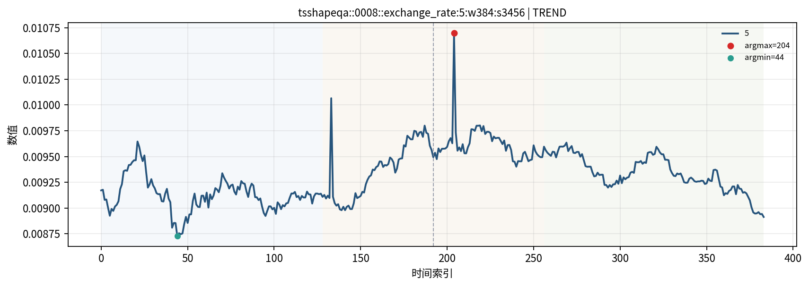

❓ QA 问题与中文翻译

**题干原文**

Across the full period, what is the overall direction of this exchange-rate series?

**题干中文翻译**

在整个时期内，该汇率序列的整体走势方向是什么？

**选项**
- A. Steadily decreasing overall
  中文：A. 整体稳步下降
- B. Mixed, with no consistent direction
  中文：B. 混合变化，没有一致方向
- C. Steadily increasing overall
  中文：C. 整体稳步上升
- D. Roughly flat with minor noise
  中文：D. 大致平稳，仅有轻微噪声

**正确答案**：`B`

📝 生成的 caption 与中文翻译

**OpenTSLM caption 原文**

7. The time series shows a strong seasonal pattern with a period of 40 time units, and a gradual upward trend over the entire window. The early part of the series experiences a significant increase, followed by a moderate rise in the first half, and a slight flattening in the second half. A notable peak occurs in the second half, reaching about 1.5 standard deviations above the mean, while a deep valley is observed early in the window, about 1.8 standard deviations below the mean. The series is strongly correlated with variables 6 and 3, showing strong positive relationships.

**OpenTSLM caption 中文翻译**

7. 该时间序列呈现出明显的季节性模式，周期为 40 个时间单位，并且在整个窗口内呈现逐渐上升的趋势。序列早期出现显著增长，随后在前半段中等幅度上升，在后半段略有趋平。后半段出现一个显著峰值，达到均值以上约 1.5 个标准差；而窗口早期观察到一个深谷，约低于均值 1.8 个标准差。该序列与变量 6 和变量 3 强相关，表现出很强的正相关关系。

**ChatTS caption 原文**

The overall trend is flat, with no significant changes in value throughout the time series. The global maximum, which is consistently around 0.01, is present throughout the entire window, indicating no specific peak position. There are no short-term fluctuations observed in either half of the window. In summary, the time series exhibits a steady trend with no notable peaks or fluctuations.

**ChatTS caption 中文翻译**

整体趋势平稳，在整个时间序列中数值没有显著变化。全局最大值始终约为 0.01，贯穿整个窗口，表明没有特定的峰值位置。在窗口的任一半段都未观察到短期波动。总之，该时间序列表现出稳定趋势，没有明显峰值或波动。

**OpenTSLM Q3-format SFT caption 原文**

The time series shows a flat trend with high volatility and no clear seasonality. The data starts with a significant downward movement early in the window, followed by an upward phase in the first half, and then another decline in the second half. A notable peak occurs in the second half, reaching about 13.1 standard deviations above the mean, while a smaller valley is observed in the first half, about 1.0 standard deviation below the mean. The series has moderate positive and negative correlations with variables 6 and 3, respectively.

**OpenTSLM Q3-format SFT caption 中文翻译**

该时间序列呈现出平坦趋势，波动性较高，且没有明显季节性。数据在窗口早期出现显著下行，随后在前半段进入上行阶段，接着在后半段再次下降。后半段出现一个显著峰值，达到均值以上约 13.1 个标准差；而前半段观察到一个较小的谷值，约低于均值 1.0 个标准差。该序列分别与变量 6 和变量 3 存在中等程度的正相关和负相关。

🧪 下游 QA 模型答案 / 评分

| 输入条件 | 预测答案 | 结果 |
| --- | --- | --- |
| `meta_only` | `B` | 正确 |
| `numbers` | `B` | 正确 |
| `numbers_cot` | `D` | 错误；原始输出见下方；源 artifact 似乎只保留了输出片段 |
| `opentslm_caption` | `C` | 错误 |
| `opentslm_caption_plus` | `C` | 错误 |
| `chatts_caption` | `D` | 错误 |
| `chatts_caption_plus` | `D` | 错误 |
| `tool_agent` | `B` | 正确 |

🧾 模型原始输出 / 代表性回答

**模型原始输出（按源 artifact 原样展示）**

**`numbers_cot` 原始输出**

> 注：该字段在源 artifact 中已经像是从中间开始保存的片段，当前报告不再二次裁剪；无法从现有文件恢复更早的前文。

dly without a clear sustained trend, though the ending is slightly higher than the start. Overall, it looks mostly flat with minor noise rather than steadily increasing or decreasing.

Final answer: D

**`numbers_cot` 中文翻译**

没有明确的持续趋势，尽管结尾略高于起点。整体来看，它基本持平，只有轻微噪声，而不是持续上升或下降。

最终答案：D

🔎 Case 分析

- 失败标签：mixed trend 被压缩成 flat/upward
- 关键结论：真实答案需要识别完整窗口内的 mixed movement；OpenTSLM 把它写成上升和季节性，ChatTS 把它写成平坦，两个 caption 都没有保留可回答 QA 的趋势证据。

📈 Case 02：TSShapeQA-OOD | 峰值位置被错误 caption 污染

##### 基本信息

| 字段 | 内容 |
| --- | --- |
| 数据集 | `TSShapeQA-OOD` |
| Case ID | `tsshapeqa::0005::timemmd:Energy:Weekly_New_England_(:w512:s0` |
| 问题类型 | `EXTREMA_POS` |
| 领域 / 子数据集 | `Energy` / `timemmd` |
| 正确答案 | `A` |

数值摘要：n=512, min=0.993, max=1.791, mean=1.2973, std=0.18544, slope=0.00081632, argmax=425, argmin=308

标注特征：`{'ambiguous': False, 'argmax_idx': 425, 'bucket': 'last', 'rel_position': 0.8317025440313112}`

🖼 时序图

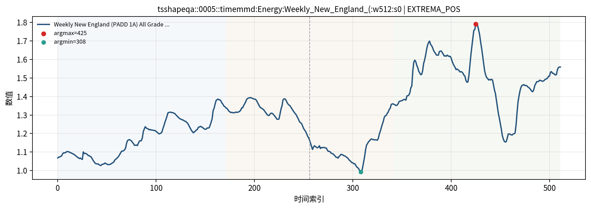

❓ QA 问题与中文翻译

**题干原文**

In which third of this 512-week gasoline price series does the highest price occur?

**题干中文翻译**

这条 512 周汽油价格序列中的最高价格出现在哪三分之一时段？

**选项**
- A. last third
  中文：A. 最后三分之一
- B. cannot determine from data
  中文：B. 无法从数据中确定
- C. middle third
  中文：C. 中间三分之一
- D. first third
  中文：D. 前三分之一

**正确答案**：`A`

📝 生成的 caption 与中文翻译

**OpenTSLM caption 原文**

The time series shows a flat trend with low volatility and a strong seasonal pattern repeating every 104 weeks. The data experiences a notable upward phase early in the window, followed by a significant downward movement in the first half, and a smaller upward trend in the second half. A peak occurs in the first half, reaching about 1.5 standard deviations above the mean, while a valley appears late in the window, about 1.2 standard deviations below the mean. The series is strongly positively correlated with weekly prices from the New England region.

**OpenTSLM caption 中文翻译**

该时间序列呈现低波动的平稳趋势，并具有每 104 周重复一次的强季节性模式。数据在窗口早期经历了显著上升阶段，随后在前半段出现明显下行，并在后半段呈现较小幅度的上升趋势。一个峰值出现在前半段，达到高于均值约 1.5 个标准差的位置；一个谷值出现在窗口后期，约低于均值 1.2 个标准差。该序列与新英格兰地区的周价格呈强正相关。

**ChatTS caption 原文**

The overall trend is increasing. The global maximum, approximately 1.56, occurs around point 511, which is in the last third of the 512-point window. Short-term fluctuations are more pronounced in the first half (points 1–256) due to a higher-frequency sinusoidal pattern with a period of ~100 points, compared to a longer period of ~194 points in the second half (points 257–512).

**ChatTS caption 中文翻译**

整体趋势是上升的。全局最大值约为 1.56，出现在点 511 附近，位于 512 点窗口的后三分之一。由于前半部分（点 1–256）存在周期约为 100 点的较高频率正弦模式，而后半部分（点 257–512）的周期较长，约为 194 点，因此前半部分的短期波动更为明显。

**OpenTSLM Q3-format SFT caption 原文**

The time series shows a flat trend with high volatility and no clear seasonality. The data starts with a moderate upward movement in the early part of the window, followed by a stronger increase in the first half, and a significant rise in the second half. A peak occurs late in the window, reaching about 3.0 standard deviations above the mean, while a valley is observed early on, about 1.9 standard deviations below the mean. The series has a strong positive correlation with another gas price variable, PADD 1B.

**OpenTSLM Q3-format SFT caption 中文翻译**

该时间序列表现为趋势平稳、波动性高，且没有明显季节性。数据在窗口早期以温和上升开始，随后在前半段出现更强的增长，并在后半段显著上升。峰值出现在窗口后期，达到约高于均值 3.0 个标准差；而谷值出现在早期，约低于均值 1.9 个标准差。该序列与另一个汽油价格变量 PADD 1B 呈强正相关。

🧪 下游 QA 模型答案 / 评分

| 输入条件 | 预测答案 | 结果 |
| --- | --- | --- |
| `meta_only` | `A` | 正确 |
| `numbers` | `A` | 正确 |
| `numbers_cot` | `A` | 正确；原始输出见下方；源 artifact 似乎只保留了输出片段 |
| `opentslm_caption` | `D` | 错误 |
| `opentslm_caption_plus` | `C` | 错误 |
| `chatts_caption` | `A` | 正确 |
| `chatts_caption_plus` | `A` | 正确 |
| `tool_agent` | `A` | 正确 |

🧾 模型原始输出 / 代表性回答

**模型原始输出（按源 artifact 原样展示）**

**`numbers_cot` 原始输出**

> 注：该字段在源 artifact 中已经像是从中间开始保存的片段，当前报告不再二次裁剪；无法从现有文件恢复更早的前文。

series’ maximum value is about 1.791, and it appears well after the midpoint of the 512 weeks, closer to the later portion of the data. So the highest price occurs in the last third.

Final answer: A

**`numbers_cot` 中文翻译**

序列的最大值约为 1.791，并且它出现在 512 周中点之后较远的位置，更接近数据的后半部分。因此，最高价格出现在后三分之一。

最终答案：A

🔎 Case 分析

- 失败标签：峰值位置被错误 caption 污染
- 关键结论：真实峰值在最后三分之一；OpenTSLM caption 写成前半段峰值，导致 caption-only 和 caption+numbers 都偏离。ChatTS 保留了最后三分之一这个关键证据。

📈 Case 03：TSShapeQA-OOD | 波动半区判断被反转

##### 基本信息

| 字段 | 内容 |
| --- | --- |
| 数据集 | `TSShapeQA-OOD` |
| Case ID | `tsshapeqa::0000::timemmd:Climate:Total:D3:w256:s256` |
| 问题类型 | `VOLATILITY_REGION` |
| 领域 / 子数据集 | `Climate` / `timemmd` |
| 正确答案 | `D` |

数值摘要：n=256, min=0, max=12.06, mean=4.1461, std=2.9609, slope=0.022335, argmax=191, argmin=5

标注特征：`{'ambiguous': False, 'higher_half': 'first', 'ratio_first_over_second': 1.5634139069284252, 'std_first': 2.529450588926891, 'std_second': 1.6179020652917402}`

🖼 时序图

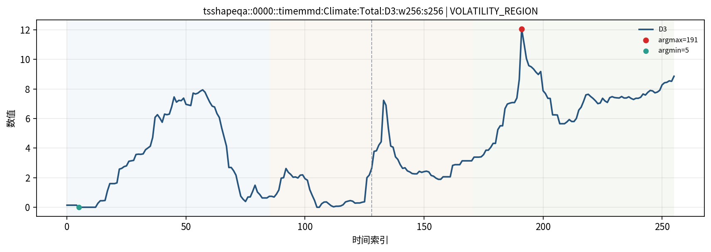

❓ QA 问题与中文翻译

**题干原文**

Looking across the 256-week drought series, which half shows greater short-term volatility, with more jagged week-to-week changes?

**题干中文翻译**

纵观 256 周的干旱序列，哪一半表现出更大的短期波动性，即周与周之间的变化更为锯齿状？

**选项**
- A. Second half
  中文：A. 后半段
- B. Roughly equal volatility
  中文：B. 波动程度大致相同
- C. Cannot tell from the series
  中文：C. 无法从序列中判断
- D. First half
  中文：D. 前半段

**正确答案**：`D`

📝 生成的 caption 与中文翻译

**OpenTSLM caption 原文**

The time series shows a steady upward trend with low volatility and a strong seasonal pattern repeating every 12 months. The data starts with a moderate increase in the early part of the window, followed by a more pronounced rise in the first half, and a slightly smaller but still positive growth in the second half. A notable peak occurs late in the window, reaching about 1.5 standard deviations above the mean, while a valley is observed early on, about 1.2 standard deviations below the mean. Several variables exhibit strong positive correlations with the target series.

**OpenTSLM caption 中文翻译**

该时间序列呈现出稳定的上升趋势，波动性较低，并且具有每 12 个月重复一次的强季节性模式。数据在窗口早期以温和增长开始，随后在前半段出现更明显的上升，在后半段增长幅度略小但仍为正。窗口后期出现一个显著峰值，达到均值以上约 1.5 个标准差；而早期观察到一个谷值，约低于均值 1.2 个标准差。多个变量与目标序列表现出强正相关。

**ChatTS caption 原文**

The overall trend is mixed, with increasing and decreasing segments. The global maximum (12.06) occurs at point 189, which is in the last third of the 256-point window. Short-term fluctuations are more pronounced in the first half (e.g., the rapid rise between points 125–132 and the decline after point 132) compared to the smoother second half.

**ChatTS caption 中文翻译**

整体趋势是混合的，既有上升段也有下降段。全局最大值（12.06）出现在点 189，位于 256 点窗口的后三分之一。与更平滑的后半段相比，前半段的短期波动更明显（例如，点 125–132 之间的快速上升以及点 132 之后的下降）。

**OpenTSLM Q3-format SFT caption 原文**

The time series shows a flat trend with medium volatility and a medium-strength daily seasonality. There is a noticeable upward phase early in the window followed by a significant downward phase in the first half, and a strong upward movement in the second half. A peak occurs in the first half with a magnitude of about 3.1 standard deviations from the mean, while a valley is observed early in the window with a smaller magnitude of about 1.1 standard deviations. The series has moderate positive correlations with variables D1 and C2.

**OpenTSLM Q3-format SFT caption 中文翻译**

该时间序列呈现平稳趋势，具有中等波动性和中等强度的日季节性。窗口早期有一个明显的上升阶段，随后在前半部分出现显著的下降阶段，并且在后半部分出现强劲的上升走势。前半部分出现一个峰值，其幅度约为偏离均值 3.1 个标准差；而窗口早期观察到一个谷值，幅度较小，约为 1.1 个标准差。该序列与变量 D1 和 C2 呈中等程度的正相关。

🧪 下游 QA 模型答案 / 评分

| 输入条件 | 预测答案 | 结果 |
| --- | --- | --- |
| `meta_only` | `A` | 错误 |
| `numbers` | `A` | 错误 |
| `numbers_cot` | `A` | 错误；原始输出见下方；源 artifact 似乎只保留了输出片段 |
| `opentslm_caption` | `A` | 错误 |
| `opentslm_caption_plus` | `A` | 错误 |
| `chatts_caption` | `D` | 正确 |
| `chatts_caption_plus` | `D` | 正确 |
| `tool_agent` | `D` | 正确 |

🧾 模型原始输出 / 代表性回答

**模型原始输出（按源 artifact 原样展示）**

**`numbers_cot` 原始输出**

> 注：该字段在源 artifact 中已经像是从中间开始保存的片段，当前报告不再二次裁剪；无法从现有文件恢复更早的前文。

frequent small up-and-down movements and several jagged swings around a rising plateau, especially in the later weeks. Overall, the second half looks a bit more volatile week-to-week.

Final answer: A

**`numbers_cot` 中文翻译**

频繁的小幅上下波动，以及围绕上升平台期的几次锯齿状摆动，尤其是在后几周。整体来看，后半段的逐周波动似乎略大。

最终答案：A

🔎 Case 分析

- 失败标签：波动半区判断被反转
- 关键结论：问题要求比较哪一半更 jagged。OpenTSLM 给出低波动、后段峰值等泛化描述，不能支持 first-half volatility；ChatTS 明确指出前半段波动更明显。

📈 Case 04：TSShapeQA-OOD | caption+numbers 整合不稳定

##### 基本信息

| 字段 | 内容 |
| --- | --- |
| 数据集 | `TSShapeQA-OOD` |
| Case ID | `tsshapeqa::0011::exchange_rate:1:w384:s2496` |
| 问题类型 | `VOLATILITY_REGION` |
| 领域 / 子数据集 | `finance` / `exchange_rate` |
| 正确答案 | `D` |

数值摘要：n=384, min=1.3723, max=1.5974, mean=1.4682, std=0.05175, slope=-0.00038125, argmax=20, argmin=330

标注特征：`{'ambiguous': False, 'higher_half': 'first', 'ratio_first_over_second': 1.2128497962927494, 'std_first': 0.02240062292164124, 'std_second': 0.018469412279161965}`

🖼 时序图

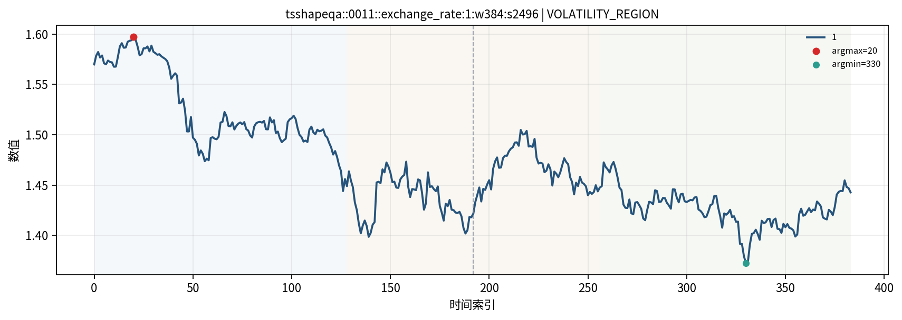

❓ QA 问题与中文翻译

**题干原文**

Which half of this exchange-rate series shows larger short-term fluctuations overall?

**题干中文翻译**

这个汇率序列的哪一半总体上显示出更大的短期波动？

**选项**
- A. Second half
  中文：A. 后半段
- B. Roughly equal volatility
  中文：B. 波动程度大致相同
- C. Cannot tell from the series
  中文：C. 无法从序列中判断
- D. First half
  中文：D. 前半段

**正确答案**：`D`

📝 生成的 caption 与中文翻译

**OpenTSLM caption 原文**

1. The time series shows a steady upward trend with low volatility and a strong seasonal pattern repeating every 18 periods. The data starts with a moderate increase in the early part of the window, followed by a more pronounced rise in the first half, and a slightly smaller but still positive growth in the second half. A notable peak occurs in the second half, reaching about 1.3 standard deviations above the mean, while a deep valley is observed early in the window, about 2.0 standard deviations below the mean. The series is strongly correlated with variable '2', showing a strong positive relationship.

**OpenTSLM caption 中文翻译**

1. 该时间序列呈现稳定上升趋势，波动性较低，并具有每 18 个周期重复一次的强季节性模式。数据在窗口早期以温和增长开始，随后在前半部分出现更明显的上升，而在后半部分则保持略小但仍为正的增长。后半部分出现一个显著峰值，达到约高于均值 1.3 个标准差；窗口早期则观察到一个深谷，约低于均值 2.0 个标准差。该序列与变量“2”强相关，表现出强正相关关系。

**ChatTS caption 原文**

The overall trend is decreasing. The global maximum occurs at the start of the time series (first third of the window). The first half of the window exhibits larger short-term fluctuations, including a rapid decline with an amplitude of 0.12, whereas the second half shows smaller fluctuations.

**ChatTS caption 中文翻译**

整体趋势正在下降。全局最大值出现在时间序列的起始处（窗口的前三分之一）。窗口的前半部分表现出较大的短期波动，包括一次幅度为 0.12 的快速下降，而后半部分的波动较小。

**OpenTSLM Q3-format SFT caption 原文**

The time series shows a flat trend with medium volatility and a medium-strength daily seasonality. The data starts with a significant downward phase early in the window, followed by an upward movement in the first half, and then a sharp decline in the second half. A notable peak occurs in the second half, reaching about 3.0 standard deviations above the mean, while a valley is observed around the middle of the series, approximately 1.8 standard deviations below the mean. Several variables exhibit moderate positive correlations with the target series.

**OpenTSLM Q3-format SFT caption 中文翻译**

该时间序列表现出平稳趋势、中等波动性以及中等强度的日季节性。数据在窗口早期以显著下降阶段开始，随后在前半段出现上升走势，然后在后半段急剧下降。一个显著峰值出现在后半段，达到高于均值约 3.0 个标准差；而在序列中部附近观察到一个谷值，约低于均值 1.8 个标准差。若干变量与目标序列表现出中等正相关。

🧪 下游 QA 模型答案 / 评分

| 输入条件 | 预测答案 | 结果 |
| --- | --- | --- |
| `meta_only` | `A` | 错误 |
| `numbers` | `D` | 正确 |
| `numbers_cot` | `A` | 错误；原始输出见下方；源 artifact 似乎只保留了输出片段 |
| `opentslm_caption` | `D` | 正确 |
| `opentslm_caption_plus` | `A` | 错误 |
| `chatts_caption` | `D` | 正确 |
| `chatts_caption_plus` | `D` | 正确 |
| `tool_agent` | `D` | 正确 |

🧾 模型原始输出 / 代表性回答

**模型原始输出（按源 artifact 原样展示）**

**`numbers_cot` 原始输出**

> 注：该字段在源 artifact 中已经像是从中间开始保存的片段，当前报告不再二次裁剪；无法从现有文件恢复更早的前文。

rebounds, especially around the middle and later sections (larger swings between roughly 1.47 and 1.37, then back up). That indicates greater short-term volatility in the second half.

Final answer: A

**`numbers_cot` 中文翻译**

反弹，尤其是在中段和后段附近（大幅波动大约在 1.47 和 1.37 之间，然后再次上升）。这表明后半段的短期波动性更大。

最终答案：A

🔎 Case 分析

- 失败标签：caption+numbers 整合不稳定
- 关键结论：numbers 和 caption 单独都能给出正确答案，但 caption+numbers 反而答错，说明下游 QA 不是简单累加证据，而会被自然语言描述重新加权甚至带偏。

🧭 Case 05：TimeSeriesExam | 异常类型识别失败

##### 基本信息

| 字段 | 内容 |
| --- | --- |
| 数据集 | `TimeSeriesExam` |
| Case ID | `timeseriesexam::tse_0005` |
| 问题类型 | `Anolmaly Detection` |
| 正确答案 | `Yes, it's pattern is distorted by random spikes` |

数值摘要：n=128, min=-13.721, max=16.502, mean=4.6743, std=4.7569, slope=0.085004, argmax=53, argmin=0

🖼 时序图

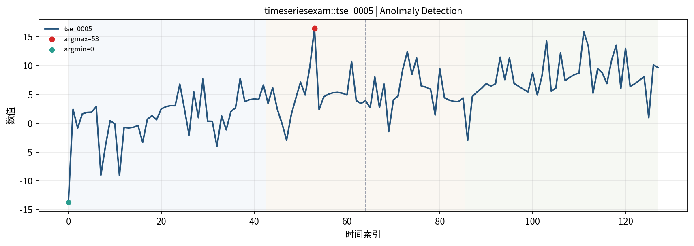

❓ QA 问题与中文翻译

**题干原文**

Is the given time series likely to have an anomaly?

**题干中文翻译**

给定的时间序列是否可能存在异常？

**选项**
- A: Yes, it's pattern is distorted by random spikes
  中文：是的，它的模式被随机尖峰扭曲了。
- B: No
  中文：否
- C: Yes, it's pattern is flipped at certain point in time
  中文：是的，它的模式在某个时间点发生了翻转。

**正确答案**：`Yes, it's pattern is distorted by random spikes`

📝 生成的 caption 与中文翻译

**OpenTSLM caption 原文**

The time series shows a downward trend early in the window followed by an upward movement in the first half and a stronger upward trend in the second half. There is a moderate seasonal pattern with a period of about 1.8 time units. The overall net change is a significant increase of over 100%. A notable peak occurs in the second half, reaching about 1.5 standard deviations above the mean, while a valley is observed early in the window, about 1.2 standard deviations below the mean. The data is part of the NBER macroeconomic time series, representing a specific economic indicator.

**OpenTSLM caption 中文翻译**

该时间序列在窗口早期呈下降趋势，随后在前半部分出现上行走势，并在后半部分表现出更强的上升趋势。存在中等程度的季节性模式，周期约为 1.8 个时间单位。整体净变化为显著增加，增幅超过 100%。后半部分出现一个显著峰值，约达到均值以上 1.5 个标准差；而窗口早期观察到一个低谷，约低于均值 1.2 个标准差。该数据属于 NBER 宏观经济时间序列，代表某一特定经济指标。

**ChatTS caption 原文**

The overall trend is increasing. The global maximum, 15.73, occurs at point 126, which is in the last third of the window. Short-term fluctuations are more pronounced in the first half of the window, as indicated by the higher noise levels there.

**ChatTS caption 中文翻译**

整体趋势正在增加。全局最大值 15.73 出现在点 126，位于窗口的后三分之一。短期波动在窗口的前半部分更为明显，这由该处较高的噪声水平所表明。

🧪 下游 QA 模型答案 / 评分

| 输入条件 | 预测答案 | 结果 |
| --- | --- | --- |
| `meta_only` | `A` | 正确 |
| `numbers` | `A` | 正确 |
| `opentslm_caption` | `B` | 错误 |
| `chatts_caption` | `B` | 错误 |
| `wrong_caption` | `A` | 正确 |

🔎 Case 分析

- 失败标签：异常类型识别失败
- 关键结论：两个 caption 条件都没有正确定位 random spikes 造成的 anomaly；numbers 可以答对，说明错误主要来自 caption 没有把异常类型编码成可判别证据。

🧭 Case 06：TimeSeriesExam | 周期模式被过度解释

##### 基本信息

| 字段 | 内容 |
| --- | --- |
| 数据集 | `TimeSeriesExam` |
| Case ID | `timeseriesexam::tse_0194` |
| 问题类型 | `Pattern Recognition` |
| 正确答案 | `No Pattern at all` |

数值摘要：n=128, min=1.0208, max=1.0662, mean=1.0433, std=0.0096896, slope=3.0582e-06, argmax=89, argmin=18

🖼 时序图

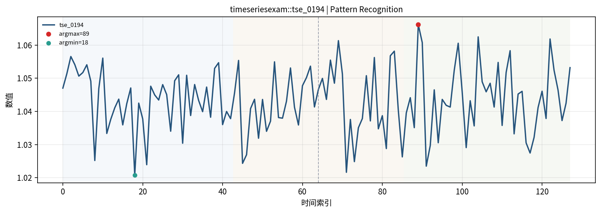

❓ QA 问题与中文翻译

**题干原文**

What is the primary cyclic pattern observed in the time series?

**题干中文翻译**

该时间序列中观察到的主要周期性模式是什么？

**选项**
- A: SquareWave
  中文：方波
- B: SawtoothWave
  中文：锯齿波
- C: No Pattern at all
  中文：完全没有模式
- D: SineWave
  中文：SineWave

**正确答案**：`No Pattern at all`

📝 生成的 caption 与中文翻译

**OpenTSLM caption 原文**

The time series shows an initial upward trend that peaks early in the window, followed by a decline that continues through the first half and further decreases in the second half. The data exhibits medium volatility with no clear seasonal pattern. A notable peak occurs early, reaching about 1.5 standard deviations above the mean, while a deeper valley appears in the second half, reaching about 1.7 standard deviations below the mean. The overall net change is a modest increase of approximately 1.1%.

**OpenTSLM caption 中文翻译**

该时间序列显示出初始上升趋势，并在窗口早期达到峰值，随后出现下降，这一下降持续贯穿前半段，并在后半段进一步降低。数据表现出中等波动性，没有明显的季节性模式。一个显著峰值出现在早期，达到均值以上约 1.5 个标准差，而一个更深的谷值出现在后半段，达到均值以下约 1.7 个标准差。整体净变化为小幅增加，约为 1.1%。

**ChatTS caption 原文**

The overall trend is flat, with the time series starting and ending near 1.04. The global maximum is not explicitly identified, but given the steady trend and minimal noise, it likely occurs in the middle third of the window. Short-term fluctuations are consistent throughout, so neither half shows significantly larger variations.

**ChatTS caption 中文翻译**

整体趋势平稳，时间序列的起点和终点都接近 1.04。全局最大值未被明确识别，但考虑到趋势稳定且噪声很小，它可能出现在窗口的中间三分之一。短期波动在整个过程中保持一致，因此两个半段都没有表现出明显更大的变化。

🧪 下游 QA 模型答案 / 评分

| 输入条件 | 预测答案 | 结果 |
| --- | --- | --- |
| `meta_only` | `D` | 错误 |
| `numbers` | `C` | 正确 |
| `opentslm_caption` | `C` | 正确 |
| `chatts_caption` | `D` | 错误 |
| `wrong_caption` | `C` | 正确 |

🔎 Case 分析

- 失败标签：周期模式被过度解释
- 关键结论：真实答案是没有主导周期模式。这个 case 里 OpenTSLM/numbers 能答对，但 ChatTS 仍把平稳和轻微波动解释成某个周期类别，说明不同 caption 模型的偏差方向不同，不能只用单一 caption 模型代表整体失败。

#### B. Dataset-A 领域解释失败：local-inductive / causal / deductive

🗄 Case 07：dataset_a | Oracle 局部 spike 被幻觉成 seasonality

##### 基本信息

| 字段 | 内容 |
| --- | --- |
| 数据集 | `dataset_a` |
| Case ID | `dataset_a::0000` |
| 问题类型 | `noise,local,season,local-inductive` |
| Dataset-A 能力标签 | `noise, local, season, local-inductive` |
| 正确答案 | `见 QA 折叠块` |

数值摘要：n=256, min=0, max=4.2794, mean=0.016716, std=0.26694, slope=0.00030456, argmax=227, argmin=0

🖼 时序图

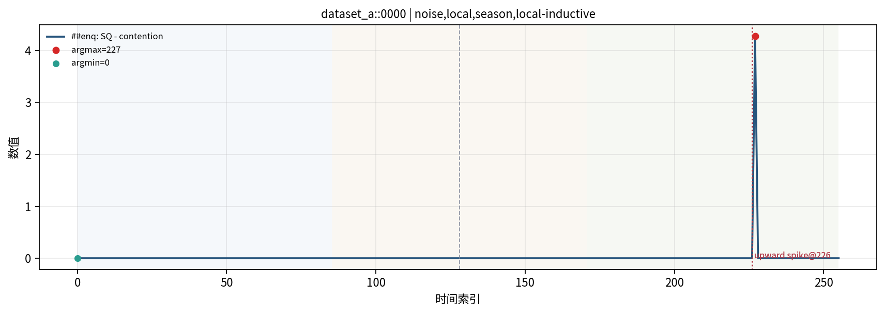

❓ QA 问题与中文翻译

**Dataset-A 标注属性原文**

[
  {
    "std": 0.0,
    "type": "almost no noise"
  },
  [
    {
      "amplitude": 4.28,
      "position": 226,
      "type": "upward spike"
    }
  ],
  {
    "amplitude": 0.0,
    "period": 0.0,
    "type": "no periodic fluctuation"
  },
  [
    {
      "amplitude": 4.28,
      "explain": "The database is experiencing significant contention issues related to enqueue resources.",
      "position": 226,
      "type": "upward spike"
    }
  ]
]

**Dataset-A 标注属性中文翻译**

[
  {
    "std": 0.0,
    "type": "几乎没有噪声"
  },
  [
    {
      "amplitude": 4.28,
      "position": 226,
      "type": "向上尖峰"
    }
  ],
  {
    "amplitude": 0.0,
    "period": 0.0,
    "type": "无周期性波动"
  },
  [
    {
      "amplitude": 4.28,
      "explain": "数据库正在经历与入队资源相关的严重争用问题。",
      "position": 226,
      "type": "向上尖峰"
    }
  ]
]

**题干原文**

You are a time series analysis expert. This time series is "##enq: SQ - contention" from Oracle Database System with length of 256: &lt;ts&gt;&lt;ts/&gt;, please analyze the time series features and answer the following questions:
1. What are the noise characteristics of this time series? Please choose from ["noisy", "almost no noise"]. Answer format: noisy, the overall noise standard deviation is around 1.5.
2. What are the local characteristic fluctuations of this time series? The optional types of local characteristic fluctuations include: ["continuous downward spike", "continuous upward spike", "decrease after downward spike", "decrease after upward spike", "downward convex", "downward spike", "increase after downward spike", "increase after upward spike", "rapid decline followed by slow rise", "rapid rise followed by slow decline", "shake", "slow decline followed by rapid rise", "slow rise followed by rapid decline", "sudden decrease", "sudden increase", "upward convex", "upward spike", "wide downward spike", "wide upward spike"]. You need to analyze all the characteristic fluctuations that appear in this time series and answer each type, position, and amplitude in the format. Different local characteristic fluctuations should be separated by semicolons. Answer format: shake, position around point 125, amplitude 135.03; small sudden decrease, position around point 102, amplitude 31.05.
3. What is the periodicity of this time series? Please choose from ["no periodic fluctuation", "periodic fluctuation"]. If there is periodic fluctuation, describe the fluctuation frequency and amplitude. Answer format: periodic fluctuation, each period is around 20.58 points, and the amplitude of the periodic fluctuation is around 31.51.
4. What are the local characteristic fluctuations of this time series? The optional types of local characteristic fluctuations include: ["continuous downward spike", "continuous upward spike", "decrease after downward spike", "decrease after upward spike", "downward convex", "downward spike", "increase after downward spike", "increase after upward spike", "rapid decline followed by slow rise", "rapid rise followed by slow decline", "shake", "slow decline followed by rapid rise", "slow rise followed by rapid decline", "sudden decrease", "sudden increase", "upward convex", "upward spike", "wide downward spike", "wide upward spike"]. You need to analyze all the characteristic fluctuations that appear in this time series and answer each type, position, and amplitude in the format, and conclude the physical meaning of **each** fluctuation in one sentence. Different local characteristic fluctuations should be separated by semicolons. Answer format: shake, position around point 125, amplitude 135.03. A sudden surge in public interest, likely due to significant news, a major event, or a trending topic related to the platform that rapidly captured user attention; small sudden decrease, position around point 102, amplitude 31.05. A slight increase in interest, possibly driven by minor news, promotions, or social media discussions that briefly captured attention without indicating a significant trend.
Now, based on the above questions, please strictly follow the output format requirements and provide the answers. Each line corresponds to an answer to a question, formatted as:1. Strictly formatted answer 1
2. Strictly formatted answer 2
3. Strictly formatted answer 3
4. Strictly formatted answer 4

**题干中文翻译**

你是时间序列分析专家。该时间序列来自 Oracle Database System，名称为“##enq: SQ - contention”，长度为 256：&lt;ts&gt;&lt;ts/&gt;，请分析该时间序列特征并回答以下问题：
1. 该时间序列的噪声特征是什么？请从 ["有噪声", "几乎没有噪声"] 中选择。回答格式：有噪声，整体噪声标准差约为 1.5。
2. 该时间序列的局部特征波动是什么？可选的局部特征波动类型包括：["连续向下尖峰", "连续向上尖峰", "向下尖峰后下降", "向上尖峰后下降", "向下凸起", "向下尖峰", "向下尖峰后上升", "向上尖峰后上升", "快速下降后缓慢上升", "快速上升后缓慢下降", "震荡", "缓慢下降后快速上升", "缓慢上升后快速下降", "突然下降", "突然上升", "向上凸起", "向上尖峰", "宽向下尖峰", "宽向上尖峰"]。你需要分析该时间序列中出现的所有特征波动，并按格式回答每种类型、位置和幅度。不同的局部特征波动应以分号分隔。回答格式：震荡，位置在第 125 点左右，幅度为 135.03；小幅突然下降，位置在第 102 点左右，幅度为 31.05。
3. 该时间序列的周期性是什么？请从 ["无周期性波动", "周期性波动"] 中选择。如果存在周期性波动，请描述波动频率和幅度。回答格式：周期性波动，每个周期约为 20.58 个点，周期性波动的幅度约为 31.51。
4. 该时间序列的局部特征波动是什么？可选的局部特征波动类型包括：["连续向下尖峰", "连续向上尖峰", "向下尖峰后下降", "向上尖峰后下降", "向下凸起", "向下尖峰", "向下尖峰后上升", "向上尖峰后上升", "快速下降后缓慢上升", "快速上升后缓慢下降", "震荡", "缓慢下降后快速上升", "缓慢上升后快速下降", "突然下降", "突然上升", "向上凸起", "向上尖峰", "宽向下尖峰", "宽向上尖峰"]。你需要分析该时间序列中出现的所有特征波动，并按格式回答每种类型、位置和幅度，并用一句话总结每个波动的物理含义。不同的局部特征波动应以分号分隔。回答格式：震荡，位置在第 125 点左右，幅度为 135.03。公众兴趣突然激增，可能是由于与该平台相关的重大新闻、重大事件或热门话题迅速吸引了用户注意；小幅突然下降，位置在第 102 点左右，幅度为 31.05。兴趣略有增加，可能由小新闻、促销或社交媒体讨论驱动，短暂吸引了注意力，但不表示显著趋势。
现在，基于上述问题，请严格遵循输出格式要求并给出答案。每一行对应一个问题的答案，格式为：
1. 严格格式化的答案 1
2. 严格格式化的答案 2
3. 严格格式化的答案 3
4. 严格格式化的答案 4

**选项**
无固定选项；题目要求按指定格式直接生成答案。

**正确答案原文**

1. almost no noise, the overall noise standard deviation is around 0.00.
2. upward spike, position around point 226, amplitude 4.28
3. no periodic fluctuation
4. upward spike, position around point 226, amplitude 4.28. The database is experiencing significant contention issues related to enqueue resources

**正确答案中文翻译**

1. 几乎没有噪声，整体噪声标准差约为 0.00。
2. 向上尖峰，位置约在点 226，幅度为 4.28。
3. 无周期性波动。
4. 向上尖峰，位置约在点 226，幅度为 4.28。数据库正经历与入队资源相关的严重争用问题。

📝 生成的 caption 与中文翻译

**OpenTSLM caption 原文**

The time series shows a flat trend with low volatility and a strong seasonal pattern repeating every 180 time units. There is a noticeable upward phase early in the window followed by a significant downward movement in the first half, then a smaller upward trend in the second half. A peak occurs in the first half with a magnitude of about 1.6 standard deviations from the mean, while a valley is observed early in the window with a magnitude of about 1.7 standard deviations from the mean. The series exhibits strong negative correlation with the "SQ - contention" variable.

**OpenTSLM caption 中文翻译**

该时间序列呈现平稳趋势，波动性较低，并具有每 180 个时间单位重复一次的强季节性模式。窗口早期有一个明显的上升阶段，随后在前半段出现显著下降，之后在后半段出现较小的上升趋势。前半段出现一个峰值，幅度约为偏离均值 1.6 个标准差；窗口早期观察到一个谷值，幅度约为偏离均值 1.7 个标准差。该序列与“SQ - contention”变量表现出强负相关。

**ChatTS caption 原文**

1) almost no noise 2) no periodic fluctuation 3) keep steady 4) upward spike, position around point 226, amplitude 4.28

**ChatTS caption 中文翻译**

1) 几乎没有噪声 2) 无周期性波动 3) 保持稳定 4) 向上尖峰，位置约在点 226，幅度 4.28

🧪 下游 QA 模型答案 / 评分

| 条件 | 平均分 | 分项分数 |
| --- | ---: | --- |
| `opentslm_meta_only` | 0.50 | local=0.00，local-inductive=0.00，noise=1.00，season=1.00 |
| `opentslm_numbers` | 0.50 | local=0.00，local-inductive=0.00，noise=1.00，season=1.00 |
| `opentslm_caption` | 0.25 | local=0.00，local-inductive=0.00，noise=1.00，season=0.00 |
| `opentslm_caption_plus` | 0.95 | local=0.97，local-inductive=0.81，noise=1.00，season=1.00 |
| `opentslm_wrong_caption` | 0.25 | local=0.00，local-inductive=0.00，noise=1.00，season=0.00 |
| `chatts_meta_only` | 0.50 | local=0.00，local-inductive=0.00，noise=1.00，season=1.00 |
| `chatts_numbers` | 0.50 | local=0.00，local-inductive=0.00，noise=1.00，season=1.00 |
| `chatts_caption` | 0.96 | local=1.00，local-inductive=0.83，noise=1.00，season=1.00 |
| `chatts_caption_plus` | 0.96 | local=1.00，local-inductive=0.83，noise=1.00，season=1.00 |
| `chatts_wrong_caption` | 0.25 | local=0.00，local-inductive=0.00，noise=0.00，season=1.00 |

🧾 模型原始输出 / 代表性回答

**代表性模型回答**

**`opentslm_meta_only` 模型回答原文**

1. almost no noise
2. shake, position around point 128, amplitude about 2.0; shake, position around point 192, amplitude about 1.8
3. no periodic fluctuation
4. shake, position around point 128, amplitude about 2.0. This likely reflects minor transient contention variability in Oracle system enqueue waits, without a strong directional trend; shake, position around point 192, amplitude about 1.8. This likely reflects another brief fluctuation in SQ enqueue contention, consistent with momentary workload or locking changes

**`opentslm_meta_only` 模型回答中文翻译**

1. 几乎没有噪声
2. 抖动，位置在点 128 附近，幅度约 2.0；抖动，位置在点 192 附近，幅度约 1.8
3. 无周期性波动
4. 抖动，位置在点 128 附近，幅度约 2.0。这可能反映了 Oracle 系统入队等待中的轻微瞬时争用变异，没有明显的方向性趋势；抖动，位置在点 192 附近，幅度约 1.8。这可能反映了 SQ 入队争用中的另一次短暂波动，与瞬时工作负载或锁定变化一致。

**`opentslm_numbers` 模型回答原文**

1. almost no noise, the overall noise standard deviation is around 0.09.
2. sudden increase, position around point 194, amplitude 4.28
3. no periodic fluctuation
4. sudden increase, position around point 194, amplitude 4.28. A brief isolated contention spike occurred, likely reflecting a short-lived burst of enqueue-related lock or resource contention in the Oracle database; the rest of the series stayed near zero, indicating the event was transient and not part of a sustained pattern.

**`opentslm_numbers` 模型回答中文翻译**

1. 几乎没有噪声，整体噪声标准差约为 0.09。
2. 突然增加，位置约在点 194，幅度为 4.28
3. 无周期性波动
4. 突然增加，位置约在点 194，幅度为 4.28。出现了一次短暂的孤立竞争尖峰，可能反映了 Oracle 数据库中与入队相关的锁或资源竞争的短时突发；序列其余部分保持接近零，表明该事件是暂时性的，并非持续模式的一部分。

**`opentslm_caption` 模型回答原文**

1. almost no noise, the overall noise standard deviation is around 0.15.
2. rapid rise followed by slow decline, position around point 45, amplitude 1.60; rapid decline followed by slow rise, position around point 18, amplitude 1.70; wide upward spike, position around point 120, amplitude 1.10; wide downward spike, position around point 170, amplitude 1.20
3. periodic fluctuation, each period is around 180 points, and the amplitude of the periodic fluctuation is around 1.40.
4. rapid rise followed by slow decline, position around point 45, amplitude 1.60. This suggests a brief build-up in the system metric followed by a more gradual relaxation, consistent with a transient workload or contention burst; rapid decline followed by slow rise, position around point 18, amplitude 1.70. This indicates a sharp drop followed by gradual recovery, likely reflecting a temporary easing of contention or a short-lived operational change; wide upward spike, position around point 120, amplitude 1.10. This represents a moderate prolonged increase, possibly due to sustained but limited pressure on the database resource; wide downward spike, position around point 170, amplitude 1.20. This reflects a sustained decrease, likely caused by a period of reduced demand or improved contention conditions.

**`opentslm_caption` 模型回答中文翻译**

1. 几乎没有噪声，整体噪声标准差约为 0.15。
2. 快速上升后缓慢下降，位置约在第 45 个点，幅度 1.60；快速下降后缓慢上升，位置约在第 18 个点，幅度 1.70；宽的向上尖峰，位置约在第 120 个点，幅度 1.10；宽的向下尖峰，位置约在第 170 个点，幅度 1.20
3. 周期性波动，每个周期约为 180 个点，周期性波动的幅度约为 1.40。
4. 快速上升后缓慢下降，位置约在第 45 个点，幅度 1.60。这表明系统指标短暂累积后出现更渐进的回落，与瞬时工作负载或争用突增相一致；快速下降后缓慢上升，位置约在第 18 个点，幅度 1.70。这表示急剧下降后逐渐恢复，可能反映出争用的暂时缓解或短暂的运行变化；宽的向上尖峰，位置约在第 120 个点，幅度 1.10。这表示中等程度的持续增加，可能是由于数据库资源承受了持续但有限的压力；宽的向下尖峰，位置约在第 170 个点，幅度 1.20。这反映出持续下降，可能由需求降低期或争用状况改善所导致。

**`opentslm_caption_plus` 模型回答原文**

1. almost no noise, the overall noise standard deviation is around 0.0
2. upward spike, position around point 198, amplitude 4.28
3. no periodic fluctuation
4. upward spike, position around point 198, amplitude 4.28. A brief isolated surge likely caused by a transient event or short-lived contention burst, after which the series immediately returns to its baseline zero level.

**`opentslm_caption_plus` 模型回答中文翻译**

1. 几乎没有噪声，整体噪声标准差约为 0.0
2. 向上尖峰，位置约在点 198，幅度 4.28
3. 无周期性波动
4. 向上尖峰，位置约在点 198，幅度 4.28。一次短暂的孤立性激增，可能由瞬态事件或短暂的竞争突发引起，随后该序列立即回到其零基线水平。

**`opentslm_wrong_caption` 模型回答原文**

1. almost no noise, the overall noise standard deviation is around 0.8.
2. rapid rise followed by slow decline, position around point 20, amplitude 1.5; sharp downward spike, position around point 28, amplitude 1.4
3. periodic fluctuation, each period is around 120 points, and the amplitude of the periodic fluctuation is around 0.9.
4. rapid rise followed by slow decline, position around point 20, amplitude 1.5. This likely reflects a brief surge in SQ contention, possibly caused by a sudden burst of concurrent database activity or locking pressure; sharp downward spike, position around point 28, amplitude 1.4. This likely indicates contention quickly easing as the triggering workload subsided or the database returned to a more stable operating state.

**`opentslm_wrong_caption` 模型回答中文翻译**

1. 几乎没有噪声，整体噪声标准差约为 0.8。
2. 快速上升后缓慢下降，位置约在第 20 个点，幅度为 1.5；尖锐的向下尖峰，位置约在第 28 个点，幅度为 1.4
3. 周期性波动，每个周期约为 120 个点，周期性波动的幅度约为 0.9。
4. 快速上升后缓慢下降，位置约在第 20 个点，幅度为 1.5。这可能反映了 SQ 争用的短暂激增，可能由并发数据库活动突然爆发或锁压力导致；尖锐的向下尖峰，位置约在第 28 个点，幅度为 1.4。这可能表明随着触发工作负载减弱或数据库恢复到更稳定的运行状态，争用迅速缓解。

**`chatts_meta_only` 模型回答原文**

1. almost no noise
2. no obvious local characteristic fluctuations
3. no periodic fluctuation
4. no obvious local characteristic fluctuations. In Oracle Database, the enqueue SQ contention metric appears stable overall, suggesting no notable contention bursts or sharp behavioral changes in the observed window.

**`chatts_meta_only` 模型回答中文翻译**

1. 几乎没有噪声
2. 没有明显的局部特征波动
3. 没有周期性波动
4. 没有明显的局部特征波动。在 Oracle Database 中，enqueue SQ 争用指标整体表现稳定，表明在观察窗口内没有显著的争用突发或剧烈的行为变化。

**`chatts_numbers` 模型回答原文**

1. almost no noise, the overall noise standard deviation is around 0.16.
2. sudden increase, position around point 203, amplitude 4.279.
3. no periodic fluctuation.
4. sudden increase, position around point 203, amplitude 4.279. A brief isolated spike in enqueue contention, likely caused by a short-lived burst of concurrent access or locking pressure, after which the metric immediately returns to near-zero.

**`chatts_numbers` 模型回答中文翻译**

1. 几乎没有噪声，整体噪声标准差约为 0.16。
2. 突然增加，位置约在点 203，幅度为 4.279。
3. 无周期性波动。
4. 突然增加，位置约在点 203，幅度为 4.279。入队争用出现一次短暂的孤立尖峰，可能由短时间的并发访问突增或锁压力引起，之后该指标立即恢复到接近零的水平。

**`chatts_caption` 模型回答原文**

1. almost no noise, the overall noise standard deviation is around 0.15
2. upward spike, position around point 226, amplitude 4.28
3. no periodic fluctuation
4. upward spike, position around point 226, amplitude 4.28. A brief contention surge in the database workload, likely caused by a short-lived spike in concurrent access or lock contention, rapidly increasing before returning toward baseline.

**`chatts_caption` 模型回答中文翻译**

1. 几乎没有噪声，整体噪声标准差约为 0.15
2. 向上尖峰，位置约在点 226，幅度 4.28
3. 无周期性波动
4. 向上尖峰，位置约在点 226，幅度 4.28。数据库工作负载中出现短暂的争用激增，可能由并发访问或锁争用的短时尖峰引起，在迅速增加后又回落至基线附近。

**`chatts_caption_plus` 模型回答原文**

1. almost no noise, the overall noise standard deviation is around 0.00
2. upward spike, position around point 226, amplitude 4.28
3. no periodic fluctuation
4. upward spike, position around point 226, amplitude 4.28. A brief and isolated surge in SQ contention, likely caused by a short-lived locking or enqueue conflict event, after which the system immediately returned to its steady baseline.

**`chatts_caption_plus` 模型回答中文翻译**

1. 几乎没有噪声，整体噪声标准差约为 0.00
2. 向上尖峰，位置约在点 226，幅度 4.28
3. 无周期性波动
4. 向上尖峰，位置约在点 226，幅度 4.28。SQ 争用出现短暂且孤立的激增，可能由短暂的锁定或入队冲突事件导致，之后系统立即恢复到其稳定基线。

**`chatts_wrong_caption` 模型回答原文**

1. noisy, the overall noise standard deviation is around 0.44.
2. sudden increase, position around point 128, amplitude 11.80.
3. no periodic fluctuation.
4. sudden increase, position around point 128, amplitude 11.80. A sharp rise likely reflects a brief surge in contention activity, possibly caused by a sudden workload burst, lock escalation, or concurrent access spike.

**`chatts_wrong_caption` 模型回答中文翻译**

1. 有噪声，整体噪声标准差约为 0.44。
2. 突然增加，位置约在点 128，幅度 11.80。
3. 无周期性波动。
4. 突然增加，位置约在点 128，幅度 11.80。急剧上升可能反映了争用活动的短暂激增，可能由突发工作负载、锁升级或并发访问激增引起。

🔎 Case 分析

- 失败标签：Oracle 局部 spike 被幻觉成 seasonality
- 关键结论：真实属性是 point 226 的 upward spike，领域含义是 enqueue 资源争用；OpenTSLM 编造 180-step seasonality 和多处事件，ChatTS 保留了关键局部事实。

🗄 Case 08：dataset_a | 交通速度局部异常与周期性混淆

##### 基本信息

| 字段 | 内容 |
| --- | --- |
| 数据集 | `dataset_a` |
| Case ID | `dataset_a::0002` |
| 问题类型 | `season,local-inductive,local` |
| Dataset-A 能力标签 | `season, local-inductive, local` |
| 正确答案 | `见 QA 折叠块` |

数值摘要：n=256, min=-50.045, max=58.14, mean=31.276, std=9.4217, slope=0.0086153, argmax=87, argmin=128

🖼 时序图

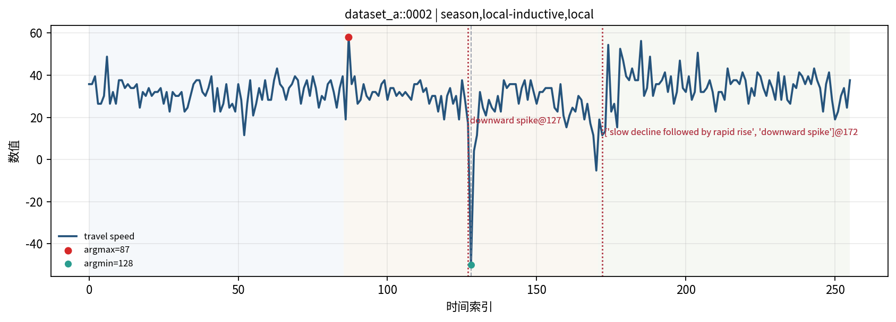

❓ QA 问题与中文翻译

**Dataset-A 标注属性原文**

[
  {
    "amplitude": 0.0,
    "period": 0.0,
    "type": "no periodic fluctuation"
  },
  [
    {
      "amplitude": 35.09,
      "explain": "A brief slowdown followed by a rapid recovery, likely due to a temporary obstruction or congestion that cleared quickly.",
      "position": 172,
      "type": [
        "slow decline followed by rapid rise",
        "downward spike"
      ]
    },
    {
      "amplitude": 78.66,
      "explain": "A sudden drop in speed, likely caused by an unexpected event such as an accident, roadblock, or abrupt traffic congestion.",
      "position": 127,
      "type": "downward spike"
    }
  ],
  [
    {
      "amplitude": 35.09,
      "position": 172,
      "type": [
        "slow decline followed by rapid rise",
        "downward spike"
      ]
    },
    {
      "amplitude": 78.66,
      "position": 127,
      "type": "downward spike"
    }
  ]
]

**Dataset-A 标注属性中文翻译**

[
  {
    "amplitude": 0.0,
    "period": 0.0,
    "type": "无周期性波动"
  },
  [
    {
      "amplitude": 35.09,
      "explain": "短暂减速后迅速恢复，可能是由于临时阻碍或拥堵很快消除。",
      "position": 172,
      "type": [
        "缓慢下降后迅速上升",
        "向下尖峰"
      ]
    },
    {
      "amplitude": 78.66,
      "explain": "速度突然下降，可能是由事故、路障或突发交通拥堵等意外事件造成的。",
      "position": 127,
      "type": "向下尖峰"
    }
  ],
  [
    {
      "amplitude": 35.09,
      "position": 172,
      "type": [
        "缓慢下降后迅速上升",
        "向下尖峰"
      ]
    },
    {
      "amplitude": 78.66,
      "position": 127,
      "type": "向下尖峰"
    }
  ]
]

**题干原文**

You are a time series analysis expert. This time series is "travel speed" from Real time traffic data with length of 256: &lt;ts&gt;&lt;ts/&gt;, please analyze the time series features and answer the following questions:
1. What is the periodicity of this time series? Please choose from ["no periodic fluctuation", "periodic fluctuation"]. If there is periodic fluctuation, describe the fluctuation frequency and amplitude. Answer format: periodic fluctuation, each period is around 20.58 points, and the amplitude of the periodic fluctuation is around 31.51.
2. What are the local characteristic fluctuations of this time series? The optional types of local characteristic fluctuations include: ["continuous downward spike", "continuous upward spike", "decrease after downward spike", "decrease after upward spike", "downward convex", "downward spike", "increase after downward spike", "increase after upward spike", "rapid decline followed by slow rise", "rapid rise followed by slow decline", "shake", "slow decline followed by rapid rise", "slow rise followed by rapid decline", "sudden decrease", "sudden increase", "upward convex", "upward spike", "wide downward spike", "wide upward spike"]. You need to analyze all the characteristic fluctuations that appear in this time series and answer each type, position, and amplitude in the format, and conclude the physical meaning of **each** fluctuation in one sentence. Different local characteristic fluctuations should be separated by semicolons. Answer format: shake, position around point 125, amplitude 135.03. A sudden surge in public interest, likely due to significant news, a major event, or a trending topic related to the platform that rapidly captured user attention; small sudden decrease, position around point 102, amplitude 31.05. A slight increase in interest, possibly driven by minor news, promotions, or social media discussions that briefly captured attention without indicating a significant trend.
3. What are the local characteristic fluctuations of this time series? The optional types of local characteristic fluctuations include: ["continuous downward spike", "continuous upward spike", "decrease after downward spike", "decrease after upward spike", "downward convex", "downward spike", "increase after downward spike", "increase after upward spike", "rapid decline followed by slow rise", "rapid rise followed by slow decline", "shake", "slow decline followed by rapid rise", "slow rise followed by rapid decline", "sudden decrease", "sudden increase", "upward convex", "upward spike", "wide downward spike", "wide upward spike"]. You need to analyze all the characteristic fluctuations that appear in this time series and answer each type, position, and amplitude in the format. Different local characteristic fluctuations should be separated by semicolons. Answer format: shake, position around point 125, amplitude 135.03; small sudden decrease, position around point 102, amplitude 31.05.
Now, based on the above questions, please strictly follow the output format requirements and provide the answers. Each line corresponds to an answer to a question, formatted as:1. Strictly formatted answer 1
2. Strictly formatted answer 2
3. Strictly formatted answer 3

**题干中文翻译**

你是时间序列分析专家。该时间序列是来自实时交通数据的“行驶速度”，长度为 256：&lt;ts&gt;&lt;ts/&gt;，请分析该时间序列特征并回答以下问题：
1. 该时间序列的周期性是什么？请从 ["无周期性波动", "周期性波动"] 中选择。如果存在周期性波动，请描述波动频率和幅度。回答格式：周期性波动，每个周期约为 20.58 个点，周期性波动的幅度约为 31.51。
2. 该时间序列的局部特征波动是什么？局部特征波动的可选类型包括：["连续向下尖峰", "连续向上尖峰", "向下尖峰后下降", "向上尖峰后下降", "向下凸起", "向下尖峰", "向下尖峰后上升", "向上尖峰后上升", "快速下降后缓慢上升", "快速上升后缓慢下降", "抖动", "缓慢下降后快速上升", "缓慢上升后快速下降", "突然下降", "突然上升", "向上凸起", "向上尖峰", "宽向下尖峰", "宽向上尖峰"]。你需要分析该时间序列中出现的所有特征波动，并按格式回答每种类型、位置和幅度，并用一句话总结**每个**波动的物理含义。不同的局部特征波动应使用分号分隔。回答格式：抖动，位置约在第 125 点，幅度 135.03。公众兴趣突然激增，可能是由于与该平台相关的重大新闻、重大事件或热门话题迅速吸引了用户注意；小幅突然下降，位置约在第 102 点，幅度 31.05。兴趣略有增加，可能由小型新闻、促销或社交媒体讨论驱动，这些因素短暂吸引了注意，但并不表明显著趋势。
3. 该时间序列的局部特征波动是什么？局部特征波动的可选类型包括：["连续向下尖峰", "连续向上尖峰", "向下尖峰后下降", "向上尖峰后下降", "向下凸起", "向下尖峰", "向下尖峰后上升", "向上尖峰后上升", "快速下降后缓慢上升", "快速上升后缓慢下降", "抖动", "缓慢下降后快速上升", "缓慢上升后快速下降", "突然下降", "突然上升", "向上凸起", "向上尖峰", "宽向下尖峰", "宽向上尖峰"]。你需要分析该时间序列中出现的所有特征波动，并按格式回答每种类型、位置和幅度。不同的局部特征波动应使用分号分隔。回答格式：抖动，位置约在第 125 点，幅度 135.03；小幅突然下降，位置约在第 102 点，幅度 31.05。
现在，请基于上述问题，严格遵循输出格式要求并提供答案。每一行对应一个问题的答案，格式为：
1. 严格格式化答案 1
2. 严格格式化答案 2
3. 严格格式化答案 3

**选项**
无固定选项；题目要求按指定格式直接生成答案。

**正确答案原文**

1. no periodic fluctuation
2. slow decline followed by rapid rise, position around point 172, amplitude 35.09. A brief slowdown followed by a rapid recovery, likely due to a temporary obstruction or congestion that cleared quickly; downward spike, position around point 127, amplitude 78.66. A sudden drop in speed, likely caused by an unexpected event such as an accident, roadblock, or abrupt traffic congestion
3. slow decline followed by rapid rise, position around point 172, amplitude 35.09; downward spike, position around point 127, amplitude 78.66

**正确答案中文翻译**

1. 无周期性波动
2. 缓慢下降后迅速上升，位置约在第 172 点，幅度 35.09。短暂减速后迅速恢复，可能是由于临时障碍或拥堵很快解除；向下尖峰，位置约在第 127 点，幅度 78.66。速度突然下降，可能由事故、路障或突发交通拥堵等意外事件引起
3. 缓慢下降后迅速上升，位置约在第 172 点，幅度 35.09；向下尖峰，位置约在第 127 点，幅度 78.66

📝 生成的 caption 与中文翻译

**OpenTSLM caption 原文**

ington, the data shows a consistent upward trend with low volatility and a strong seasonal pattern repeating every 18 periods. The series starts with a moderate increase in the early part of the window, followed by a more pronounced rise in the first half, and a slightly smaller but still positive growth in the second half. A notable peak occurs in the second half, reaching about 1.5 standard deviations above the mean, while a deep valley is observed early in the window, about 1.8 standard deviations below the mean. The overall net increase over the time span is over 100%.

**OpenTSLM caption 中文翻译**

ington，数据显示出一致的上升趋势，波动性较低，并且存在每 18 个周期重复一次的强季节性模式。该序列在窗口早期以适度增长开始，随后在前半段出现更明显的上升，而在后半段增幅略小但仍为正。后半段出现一个显著峰值，达到均值以上约 1.5 个标准差；同时在窗口早期观察到一个深谷，约为均值以下 1.8 个标准差。整个时间跨度内的总体净增长超过 100%。

**ChatTS caption 原文**

1. Noisy with std around 3.50.
2. No periodic fluctuations observed, showing no periodic fluctuation.
3. Keep steady from around 33.19 to around 33.19.
4. Downward spike around point 127 with an amplitude of 79.32; increase after downward spike around point 171 with an amplitude of 31.49

The time series exhibits a steady trend, starting and ending near 33.19, with no significant overall change. However, it contains notable local features: a sharp downward spike between points 127 and 129, where the value drops from approximately 33.19 to -46.13 before recovering, and another downward spike followed by a rapid increase between points 171 and 176, where the value falls to around 2.83 and then rises to around 53.54. Additionally, there is a random noise with a standard deviation of about 3.50, contributing to the overall variability.

**ChatTS caption 中文翻译**

1. 噪声标准差约为 3.50。
2. 未观察到周期性波动，表现为无周期性波动。
3. 从约 33.19 到约 33.19 保持稳定。
4. 在点 127 附近出现向下尖峰，幅度为 79.32；在点 171 附近出现向下尖峰后增加，幅度为 31.49。

该时间序列呈现稳定趋势，起始和结束值均接近 33.19，整体无显著变化。然而，它包含显著的局部特征：在点 127 和 129 之间出现一个急剧向下尖峰，数值从约 33.19 下降到 -46.13 后恢复；在点 171 和 176 之间出现另一个向下尖峰后快速增加，数值下降到约 2.83，然后上升到约 53.54。此外，还存在标准差约为 3.50 的随机噪声，增加了整体变异性。

🧪 下游 QA 模型答案 / 评分

| 条件 | 平均分 | 分项分数 |
| --- | ---: | --- |
| `opentslm_meta_only` | 0.33 | local=0.00，local-inductive=0.00，season=1.00 |
| `opentslm_numbers` | 0.26 | local=0.42，local-inductive=0.36，season=0.00 |
| `opentslm_caption` | 0.00 | local=0.00，local-inductive=0.00，season=0.00 |
| `opentslm_caption_plus` | 0.00 | local=0.00，local-inductive=0.00，season=0.00 |
| `opentslm_wrong_caption` | 0.46 | local=0.73，local-inductive=0.65，season=0.00 |
| `chatts_meta_only` | 0.33 | local=0.00，local-inductive=0.00，season=1.00 |
| `chatts_numbers` | 0.44 | local=0.70，local-inductive=0.63，season=0.00 |
| `chatts_caption` | 0.86 | local=0.84，local-inductive=0.73，season=1.00 |
| `chatts_caption_plus` | 0.86 | local=0.84，local-inductive=0.73，season=1.00 |
| `chatts_wrong_caption` | 0.33 | local=0.00，local-inductive=0.00，season=1.00 |

🧾 模型原始输出 / 代表性回答

**代表性模型回答**

**`opentslm_meta_only` 模型回答原文**

1. no periodic fluctuation
2. shake, position around point 128, amplitude small to moderate; sudden increase, position around point 128, amplitude moderate. This likely reflects brief traffic instability and a short-lived surge in travel speed, possibly caused by a temporary clearing of congestion or a change in road conditions.
3. shake, position around point 128, amplitude small to moderate; sudden increase, position around point 128, amplitude moderate.

**`opentslm_meta_only` 模型回答中文翻译**

1. 无周期性波动
2. 抖动，位置在点 128 附近，幅度为小到中等；突然增加，位置在点 128 附近，幅度为中等。这可能反映了短暂的交通不稳定以及行驶速度的短时激增，可能由拥堵暂时缓解或道路状况变化导致。
3. 抖动，位置在点 128 附近，幅度为小到中等；突然增加，位置在点 128 附近，幅度为中等。

**`opentslm_numbers` 模型回答原文**

1. periodic fluctuation, each period is around 24 points, and the amplitude of the periodic fluctuation is around 20.00.

2. shake, position around point 12, amplitude 22.38. The traffic speed fluctuates within a relatively stable range with short-term oscillations, likely reflecting routine changes in road conditions and signal timing; downward spike, position around point 49, amplitude 18.65. A brief sharp slowdown likely caused by a transient congestion or localized disturbance; sudden decrease, position around point 121, amplitude 72.95. An abrupt drop in speed suggests a major traffic incident, blockage, or sudden congestion; sudden increase, position around point 124, amplitude 54.09. A rapid recovery in speed likely indicates the clearing of the disturbance or a sudden improvement in traffic flow; upward spike, position around point 141, amplitude 26.28. A short-lived speed surge likely reflects a temporary opening in traffic or reduced density; wide upward spike, position around point 165, amplitude 29.57. A sustained improvement in speed suggests a broader period of free-flowing traffic; downward spike, position around point 203, amplitude 18.95. A brief localized slowdown likely due to short-term traffic interruption or merging effects.

3. shake, position around point 12, amplitude 22.38; downward spike, position around point 49, amplitude 18.65; sudden decrease, position around point 121, amplitude 72.95; sudden increase, position around point 124, amplitude 54.09; upward spike, position around point 141, amplitude 26.28; wide upward spike, position around point 165, amplitude 29.57; downward spike, position around point 203, amplitude 18.95.

**`opentslm_numbers` 模型回答中文翻译**

1. 周期性波动，每个周期约为 24 个点，周期性波动的振幅约为 20.00。

2. 抖动，位置约在第 12 个点，振幅 22.38。交通速度在相对稳定的范围内波动，并伴有短期振荡，可能反映了道路状况和信号配时的常规变化；向下尖峰，位置约在第 49 个点，振幅 18.65。短暂的急剧减速可能由瞬时拥堵或局部扰动引起；突然下降，位置约在第 121 个点，振幅 72.95。速度的 abrupt 下降表明可能发生了重大交通事故、阻塞或突然拥堵；突然上升，位置约在第 124 个点，振幅 54.09。速度的快速恢复可能表明扰动已消除或交通流突然改善；向上尖峰，位置约在第 141 个点，振幅 26.28。短暂的速度激增可能反映了交通中的临时通畅或密度降低；宽幅向上尖峰，位置约在第 165 个点，振幅 29.57。速度的持续改善表明可能出现了较长一段自由流交通；向下尖峰，位置约在第 203 个点，振幅 18.95。短暂的局部减速可能是由于短期交通中断或并流影响造成的。

3. 抖动，位置约在第 12 个点，振幅 22.38；向下尖峰，位置约在第 49 个点，振幅 18.65；突然下降，位置约在第 121 个点，振幅 72.95；突然上升，位置约在第 124 个点，振幅 54.09；向上尖峰，位置约在第 141 个点，振幅 26.28；宽幅向上尖峰，位置约在第 165 个点，振幅 29.57；向下尖峰，位置约在第 203 个点，振幅 18.95。

**`opentslm_caption` 模型回答原文**

1. periodic fluctuation, each period is around 18 points, and the amplitude of the periodic fluctuation is around 1.5 standard deviations
2. upward convex, position around point 70, amplitude about 1.5 standard deviations. A sustained acceleration in travel speed, likely reflecting improving traffic flow over an extended segment; wide upward spike, position around point 150, amplitude about 1.5 standard deviations. A broad surge in travel speed, possibly caused by a prolonged reduction in congestion or a temporary drop in traffic demand; downward spike, position around point 25, amplitude about 1.8 standard deviations. A sharp local slowdown in travel speed, likely due to a brief congestion incident, traffic signal disruption, or road constraint
3. upward convex, position around point 70, amplitude about 1.5 standard deviations; wide upward spike, position around point 150, amplitude about 1.5 standard deviations; downward spike, position around point 25, amplitude about 1.8 standard deviations

**`opentslm_caption` 模型回答中文翻译**

1. 周期性波动，每个周期约为 18 个点，周期性波动的幅度约为 1.5 个标准差
2. 向上凸起，位置约在第 70 个点，幅度约为 1.5 个标准差。行驶速度持续加快，可能反映出较长路段上的交通流状况改善；宽幅向上尖峰，位置约在第 150 个点，幅度约为 1.5 个标准差。行驶速度出现较宽范围的激增，可能由拥堵持续缓解或交通需求暂时下降引起；向下尖峰，位置约在第 25 个点，幅度约为 1.8 个标准差。行驶速度出现局部急剧下降，可能由于短暂拥堵事件、交通信号中断或道路限制所致
3. 向上凸起，位置约在第 70 个点，幅度约为 1.5 个标准差；宽幅向上尖峰，位置约在第 150 个点，幅度约为 1.5 个标准差；向下尖峰，位置约在第 25 个点，幅度约为 1.8 个标准差

**`opentslm_caption_plus` 模型回答原文**

1. periodic fluctuation, each period is around 18 points, and the amplitude of the periodic fluctuation is around 23.74
2. downward spike, position around point 50, amplitude 24.25. A sharp temporary drop in travel speed, likely reflecting a brief severe congestion incident, road blockage, or signal disruption; sudden decrease, position around point 120, amplitude 83.93. An abrupt collapse in travel speed, likely caused by an extreme traffic interruption such as an accident, closure, or data anomaly; upward spike, position around point 83, amplitude 27.12. A sudden temporary surge in speed, possibly due to an incident clearing, lane reopening, or short-lived free-flow condition; upward spike, position around point 164, amplitude 26.55. A sudden temporary surge in speed, likely reflecting a brief traffic relief or capacity increase.
3. downward spike, position around point 50, amplitude 24.25; sudden decrease, position around point 120, amplitude 83.93; upward spike, position around point 83, amplitude 27.12; upward spike, position around point 164, amplitude 26.55

**`opentslm_caption_plus` 模型回答中文翻译**

1. 周期性波动，每个周期约为 18 个点，周期性波动的幅度约为 23.74
2. 向下尖峰，位置约在第 50 个点，幅度 24.25。行驶速度出现短暂急剧下降，可能反映短暂的严重拥堵事件、道路阻塞或信号中断；突然下降，位置约在第 120 个点，幅度 83.93。行驶速度突然崩塌，可能由事故、封闭或数据异常等极端交通中断引起；向上尖峰，位置约在第 83 个点，幅度 27.12。速度出现短暂突然上升，可能由于事故解除、车道重新开放或短暂的自由流状态；向上尖峰，位置约在第 164 个点，幅度 26.55。速度出现短暂突然上升，可能反映短暂的交通缓解或通行能力增加。
3. 向下尖峰，位置约在第 50 个点，幅度 24.25；突然下降，位置约在第 120 个点，幅度 83.93；向上尖峰，位置约在第 83 个点，幅度 27.12；向上尖峰，位置约在第 164 个点，幅度 26.55

**`opentslm_wrong_caption` 模型回答原文**

1. periodic fluctuation, each period is around 120 points, and the amplitude of the periodic fluctuation is around 2.1 standard deviations
2. upward spike, position around point 35, amplitude 2.1 standard deviations. A brief sharp rise likely caused by a short-lived surge in traffic speed, possibly due to a temporary drop in congestion; downward spike, position around point 55, amplitude 1.7 standard deviations. A brief sharp drop likely reflecting a short-lived slowdown from localized congestion or disturbance; increase after downward spike, position around point 130, amplitude 2.1 standard deviations. A recovery from a prior dip, suggesting traffic conditions improved and speeds increased; rapid rise followed by slow decline, position around point 170, amplitude 2.1 standard deviations. A quick speed-up followed by gradual easing, consistent with a temporary clearing of traffic that later re-congested; upward convex, position around point 210, amplitude 2.1 standard deviations. A broad strengthening in speed over time, indicating a sustained improvement in traffic flow
3. upward spike, position around point 35, amplitude 2.1 standard deviations; downward spike, position around point 55, amplitude 1.7 standard deviations; increase after downward spike, position around point 130, amplitude 2.1 standard deviations; rapid rise followed by slow decline, position around point 170, amplitude 2.1 standard deviations; upward convex, position around point 210, amplitude 2.1 standard deviations

**`opentslm_wrong_caption` 模型回答中文翻译**

1. 周期性波动，每个周期约为 120 个点，周期性波动的幅度约为 2.1 个标准差
2. 向上尖峰，位置约在第 35 个点，幅度为 2.1 个标准差。短暂的急剧上升，可能由交通速度短时激增导致，可能是由于拥堵暂时减轻；向下尖峰，位置约在第 55 个点，幅度为 1.7 个标准差。短暂的急剧下降，可能反映由局部拥堵或扰动引起的短时减速；向下尖峰后的上升，位置约在第 130 个点，幅度为 2.1 个标准差。此前下降后的恢复，表明交通状况改善且速度提高；快速上升后缓慢下降，位置约在第 170 个点，幅度为 2.1 个标准差。快速提速后逐渐回落，符合交通暂时疏通后随后再次拥堵的情况；向上凸形，位置约在第 210 个点，幅度为 2.1 个标准差。速度随时间呈现广泛增强，表明交通流持续改善
3. 向上尖峰，位置约在第 35 个点，幅度为 2.1 个标准差；向下尖峰，位置约在第 55 个点，幅度为 1.7 个标准差；向下尖峰后的上升，位置约在第 130 个点，幅度为 2.1 个标准差；快速上升后缓慢下降，位置约在第 170 个点，幅度为 2.1 个标准差；向上凸形，位置约在第 210 个点，幅度为 2.1 个标准差

**`chatts_meta_only` 模型回答原文**

1. no periodic fluctuation
2. shake, position around point 128, amplitude cannot be reliably estimated from the column name alone. Travel speed data often shows irregular stop-and-go variations rather than a stable repeating cycle; this is consistent with fluctuating traffic conditions caused by congestion, signals, or intermittent disturbances.
3. shake, position around point 128, amplitude cannot be reliably estimated from the column name alone; no other local characteristic fluctuations can be determined without the actual time series values.

**`chatts_meta_only` 模型回答中文翻译**

1. 无周期性波动
2. 抖动，位置约在点 128，仅凭列名无法可靠估计振幅。行驶速度数据通常表现为不规则的走走停停变化，而不是稳定的重复周期；这与由拥堵、信号灯或间歇性扰动引起的交通状况波动一致。
3. 抖动，位置约在点 128，仅凭列名无法可靠估计振幅；如果没有实际时间序列数值，无法确定其他局部特征波动。

**`chatts_numbers` 模型回答原文**

1. periodic fluctuation, each period is around 24-32 points, and the amplitude of the periodic fluctuation is around 20-25.
2. shake, position around point 1-47, amplitude around 10-20. The travel speed fluctuates frequently with no strong directional trend, reflecting normal traffic instability; downward spike, position around point 48, amplitude around 11.51. A brief sharp slowdown likely caused by a transient congestion or signal delay; upward spike, position around point 84, amplitude around 58.14. A sudden speed increase suggesting a temporary clearing of traffic or free-flow road segment; downward spike, position around point 117, amplitude around -50.04. An abrupt slowdown likely due to a bottleneck, incident, or traffic disturbance; upward spike, position around point 129, amplitude around 54.41. A sudden speed recovery consistent with traffic dispersal or return to smoother flow; upward spike, position around point 134, amplitude around 56.28. Another abrupt acceleration indicating a short free-flow section or reduced congestion.
3. shake, position around point 1-47, amplitude around 10-20; downward spike, position around point 48, amplitude around 11.51; upward spike, position around point 84, amplitude around 58.14; downward spike, position around point 117, amplitude around -50.04; upward spike, position around point 129, amplitude around 54.41; upward spike, position around point 134, amplitude around 56.28

**`chatts_numbers` 模型回答中文翻译**

1. 周期性波动，每个周期约为 24-32 个点，周期性波动的振幅约为 20-25。
2. 震荡，位置约在点 1-47，振幅约为 10-20。行驶速度频繁波动，没有明显的方向性趋势，反映出正常的交通不稳定性；向下尖峰，位置约在点 48，振幅约为 11.51。短暂的急剧减速，可能由瞬时拥堵或信号延误引起；向上尖峰，位置约在点 84，振幅约为 58.14。突然的速度增加，表明交通暂时疏通或进入自由流道路路段；向下尖峰，位置约在点 117，振幅约为 -50.04。突然减速，可能由于瓶颈、事故或交通扰动；向上尖峰，位置约在点 129，振幅约为 54.41。突然的速度恢复，与交通消散或恢复到更平稳的车流一致；向上尖峰，位置约在点 134，振幅约为 56.28。另一次突然加速，表明短暂的自由流路段或拥堵减轻。
3. 震荡，位置约在点 1-47，振幅约为 10-20；向下尖峰，位置约在点 48，振幅约为 11.51；向上尖峰，位置约在点 84，振幅约为 58.14；向下尖峰，位置约在点 117，振幅约为 -50.04；向上尖峰，位置约在点 129，振幅约为 54.41；向上尖峰，位置约在点 134，振幅约为 56.28。

**`chatts_caption` 模型回答原文**

1. no periodic fluctuation
2. downward spike, position around point 128, amplitude 79.32. A sharp transient drop in travel speed, likely caused by an abrupt road obstruction, incident, or measurement anomaly; increase after downward spike, position around point 173, amplitude 31.49. A rapid rebound in travel speed after a brief drop, likely reflecting the clearing of a temporary disruption or a quick return to normal traffic flow.
3. downward spike, position around point 128, amplitude 79.32; increase after downward spike, position around point 173, amplitude 31.49

**`chatts_caption` 模型回答中文翻译**

1. 无周期性波动
2. 向下尖峰，位置约在点 128，幅度 79.32。行驶速度出现急剧的短暂下降，可能由突发道路障碍、事故或测量异常引起；向下尖峰后的上升，位置约在点 173，幅度 31.49。短暂下降后行驶速度迅速回升，可能反映临时干扰被清除或交通流快速恢复正常。
3. 向下尖峰，位置约在点 128，幅度 79.32；向下尖峰后的上升，位置约在点 173，幅度 31.49

**`chatts_caption_plus` 模型回答原文**

1. no periodic fluctuation
2. downward spike, position around point 127, amplitude 79.32. A sharp traffic-speed drop, likely caused by a brief incident, congestion shock, or lane blockage that temporarily disrupted normal flow; increase after downward spike, position around point 171, amplitude 31.49. A rapid recovery in travel speed after a short disruption, likely reflecting clearance of the incident or easing congestion.
3. downward spike, position around point 127, amplitude 79.32; increase after downward spike, position around point 171, amplitude 31.49

**`chatts_caption_plus` 模型回答中文翻译**

1. 无周期性波动
2. 向下尖峰，位置约在点 127，幅度 79.32。交通速度急剧下降，可能是由短暂事件、拥堵冲击或车道阻塞导致，暂时扰乱了正常车流；向下尖峰后的上升，位置约在点 171，幅度 31.49。短暂扰动后行驶速度快速恢复，可能反映事件清除或拥堵缓解。
3. 向下尖峰，位置约在点 127，幅度 79.32；向下尖峰后的上升，位置约在点 171，幅度 31.49

**`chatts_wrong_caption` 模型回答原文**

1. no periodic fluctuation
2. sudden increase, position around point 128, amplitude 12.12. A sharp traffic speed jump likely caused by a sudden drop in congestion, such as a temporary road clearing, signal timing change, or other short-lived improvement in traffic flow.
3. sudden increase, position around point 128, amplitude 12.12; small shake, position around point 128, amplitude around 0.50. A sharp traffic speed jump likely caused by a temporary drop in congestion, followed by minor noisy oscillations from normal traffic variability.

**`chatts_wrong_caption` 模型回答中文翻译**

1. 无周期性波动
2. 突然增加，位置在约第 128 点，幅度 12.12。交通速度的急剧跃升可能由拥堵突然下降引起，例如临时道路疏通、信号配时变化或其他短时交通流改善。
3. 突然增加，位置在约第 128 点，幅度 12.12；小幅抖动，位置在约第 128 点，幅度约 0.50。交通速度的急剧跃升可能由拥堵的临时下降引起，随后出现由正常交通变化导致的轻微噪声振荡。

🔎 Case 分析

- 失败标签：交通速度局部异常与周期性混淆
- 关键结论：真实问题需要 no periodic fluctuation 和局部速度下跌/恢复的解释；OpenTSLM 把它写成强季节性和上升趋势，造成 local-inductive 与 season 同时失败。

🗄 Case 09：dataset_a | Travel Time 领域事件需要局部位置和含义同时正确

##### 基本信息

| 字段 | 内容 |
| --- | --- |
| 数据集 | `dataset_a` |
| Case ID | `dataset_a::0014` |
| 问题类型 | `local,local-inductive,trend,season` |
| Dataset-A 能力标签 | `local, local-inductive, trend, season` |
| 正确答案 | `见 QA 折叠块` |

数值摘要：n=256, min=-15.886, max=2837.9, mean=170.24, std=225.83, slope=0.45297, argmax=128, argmin=58

🖼 时序图

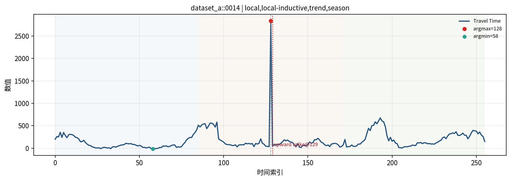

❓ QA 问题与中文翻译

**Dataset-A 标注属性原文**

[
  [
    {
      "amplitude": 2685.01,
      "position": 129,
      "type": "upward spike"
    }
  ],
  [
    {
      "amplitude": 2685.01,
      "explain": "A sudden and severe increase in travel time, likely due to a major traffic incident, road closure, or severe congestion.",
      "position": 129,
      "type": "upward spike"
    }
  ],
  {
    "amplitude": 0.0,
    "start": 198.99,
    "type": "keep steady"
  },
  {
    "amplitude": 323.1,
    "period": 65.7,
    "type": "periodic fluctuation"
  }
]

**Dataset-A 标注属性中文翻译**

[
  [
    {
      "amplitude": 2685.01,
      "position": 129,
      "type": "向上尖峰"
    }
  ],
  [
    {
      "amplitude": 2685.01,
      "explain": "行程时间突然且严重增加，可能是由于重大交通事故、道路封闭或严重拥堵。",
      "position": 129,
      "type": "向上尖峰"
    }
  ],
  {
    "amplitude": 0.0,
    "start": 198.99,
    "type": "保持稳定"
  },
  {
    "amplitude": 323.1,
    "period": 65.7,
    "type": "周期性波动"
  }
]

**题干原文**

You are a time series analysis expert. This time series is "Travel Time" from Real time traffic data with length of 256: &lt;ts&gt;&lt;ts/&gt;, please analyze the time series features and answer the following questions:
1. What are the local characteristic fluctuations of this time series? The optional types of local characteristic fluctuations include: ["continuous downward spike", "continuous upward spike", "decrease after downward spike", "decrease after upward spike", "downward convex", "downward spike", "increase after downward spike", "increase after upward spike", "rapid decline followed by slow rise", "rapid rise followed by slow decline", "shake", "slow decline followed by rapid rise", "slow rise followed by rapid decline", "sudden decrease", "sudden increase", "upward convex", "upward spike", "wide downward spike", "wide upward spike"]. You need to analyze all the characteristic fluctuations that appear in this time series and answer each type, position, and amplitude in the format. Different local characteristic fluctuations should be separated by semicolons. Answer format: shake, position around point 125, amplitude 135.03; small sudden decrease, position around point 102, amplitude 31.05.
2. What are the local characteristic fluctuations of this time series? The optional types of local characteristic fluctuations include: ["continuous downward spike", "continuous upward spike", "decrease after downward spike", "decrease after upward spike", "downward convex", "downward spike", "increase after downward spike", "increase after upward spike", "rapid decline followed by slow rise", "rapid rise followed by slow decline", "shake", "slow decline followed by rapid rise", "slow rise followed by rapid decline", "sudden decrease", "sudden increase", "upward convex", "upward spike", "wide downward spike", "wide upward spike"]. You need to analyze all the characteristic fluctuations that appear in this time series and answer each type, position, and amplitude in the format, and conclude the physical meaning of **each** fluctuation in one sentence. Different local characteristic fluctuations should be separated by semicolons. Answer format: shake, position around point 125, amplitude 135.03. A sudden surge in public interest, likely due to significant news, a major event, or a trending topic related to the platform that rapidly captured user attention; small sudden decrease, position around point 102, amplitude 31.05. A slight increase in interest, possibly driven by minor news, promotions, or social media discussions that briefly captured attention without indicating a significant trend.
3. What is the trend of this time series (considering the slope of the curve)? Please choose from ["steady", "decreasing", "increasing"] and describe the value trend change. Answer format: steady, the starting point value is around 32.10, and the trend change value from left to right is around 0.12.
4. What is the periodicity of this time series? Please choose from ["no periodic fluctuation", "periodic fluctuation"]. If there is periodic fluctuation, describe the fluctuation frequency and amplitude. Answer format: periodic fluctuation, each period is around 20.58 points, and the amplitude of the periodic fluctuation is around 31.51.
Now, based on the above questions, please strictly follow the output format requirements and provide the answers. Each line corresponds to an answer to a question, formatted as:1. Strictly formatted answer 1
2. Strictly formatted answer 2
3. Strictly formatted answer 3
4. Strictly formatted answer 4

**题干中文翻译**

你是一名时间序列分析专家。该时间序列是来自实时交通数据的“Travel Time”，长度为 256：&lt;ts&gt;&lt;ts/&gt;，请分析该时间序列特征并回答以下问题：
1. 该时间序列的局部特征波动有哪些？可选的局部特征波动类型包括：["连续向下尖峰", "连续向上尖峰", "向下尖峰后下降", "向上尖峰后下降", "向下凸起", "向下尖峰", "向下尖峰后上升", "向上尖峰后上升", "快速下降后缓慢上升", "快速上升后缓慢下降", "震荡", "缓慢下降后快速上升", "缓慢上升后快速下降", "突然下降", "突然上升", "向上凸起", "向上尖峰", "宽向下尖峰", "宽向上尖峰"]。你需要分析该时间序列中出现的所有特征波动，并按格式回答每种类型、位置和幅度。不同的局部特征波动应使用分号分隔。回答格式：震荡，位置在点 125 附近，幅度 135.03；小幅突然下降，位置在点 102 附近，幅度 31.05。
2. 该时间序列的局部特征波动有哪些？可选的局部特征波动类型包括：["连续向下尖峰", "连续向上尖峰", "向下尖峰后下降", "向上尖峰后下降", "向下凸起", "向下尖峰", "向下尖峰后上升", "向上尖峰后上升", "快速下降后缓慢上升", "快速上升后缓慢下降", "震荡", "缓慢下降后快速上升", "缓慢上升后快速下降", "突然下降", "突然上升", "向上凸起", "向上尖峰", "宽向下尖峰", "宽向上尖峰"]。你需要分析该时间序列中出现的所有特征波动，并按格式回答每种类型、位置和幅度，并用一句话总结**每个**波动的物理含义。不同的局部特征波动应使用分号分隔。回答格式：震荡，位置在点 125 附近，幅度 135.03。公众兴趣突然激增，可能是由于重大新闻、重要事件或与该平台相关的热门话题迅速吸引了用户注意；小幅突然下降，位置在点 102 附近，幅度 31.05。兴趣略有增加，可能由小型新闻、促销或社交媒体讨论推动，短暂吸引了注意力，但并不表明存在显著趋势。
3. 该时间序列的趋势是什么（考虑曲线斜率）？请从 ["平稳", "下降", "上升"] 中选择，并描述数值趋势变化。回答格式：平稳，起点值约为 32.10，从左到右的趋势变化值约为 0.12。
4. 该时间序列的周期性是什么？请从 ["无周期性波动", "周期性波动"] 中选择。如果存在周期性波动，请描述波动频率和幅度。回答格式：周期性波动，每个周期约为 20.58 个点，周期性波动的幅度约为 31.51。
现在，请基于上述问题，严格遵循输出格式要求并给出答案。每一行对应一个问题的答案，格式为：
1. 严格格式化的答案 1
2. 严格格式化的答案 2
3. 严格格式化的答案 3
4. 严格格式化的答案 4

**选项**
无固定选项；题目要求按指定格式直接生成答案。

**正确答案原文**

1. upward spike, position around point 129, amplitude 2685.01
2. upward spike, position around point 129, amplitude 2685.01. A sudden and severe increase in travel time, likely due to a major traffic incident, road closure, or severe congestion
3. keep steady, the starting point value is around 198.99, and the trend change value from left to right is around 0.00.
4. periodic fluctuation, each period is around 65.70 points, and the amplitude of the periodic fluctuation is around 323.10.

**正确答案中文翻译**

1. 向上尖峰，位置在点 129 附近，幅度为 2685.01
2. 向上尖峰，位置在点 129 附近，幅度为 2685.01。行程时间突然且严重增加，可能是由于重大交通事故、道路封闭或严重拥堵
3. 保持稳定，起始点值约为 198.99，从左到右的趋势变化值约为 0.00。
4. 周期性波动，每个周期约为 65.70 个点，周期性波动的幅度约为 323.10。

📝 生成的 caption 与中文翻译

**OpenTSLM caption 原文**

ology. The time series shows a steady upward trend with low volatility, characterized by a strong seasonal pattern repeating every 10 periods. The data starts with a moderate increase in the early part of the window, followed by a more pronounced rise in the first half, and a slightly smaller but still positive growth in the second half. A notable peak occurs late in the window, reaching about 1.2 standard deviations above the mean. There is no valley identified in the series. The overall growth from start to finish is substantial, with a total increase of over 100%.

**OpenTSLM caption 中文翻译**

该时间序列呈现出稳定的上升趋势，波动性较低，并具有每 10 个周期重复一次的强季节性模式。数据在窗口早期开始适度增加，随后在前半部分出现更明显的上升，在后半部分增幅略小但仍保持正增长。窗口后期出现一个显著峰值，达到均值以上约 1.2 个标准差。该序列中未识别到谷值。从开始到结束的整体增长显著，总增幅超过 100%。

**ChatTS caption 原文**

1. Noisy with std around 16.24
2. Low frequency periodic fluctuation: each fluctuation period is approximately 53.7 points and the amplitude of the periodic fluctuation is 264.8 between point 0 and point 256.
3. Keep steady from 198.98 to 148.60
4. Slow rise followed by rapid decline between point 77 and point 97; upward spike between point 127 and point 129 with an amplitude of 2685.92; wide upward spike between point 183 and point 198 with an amplitude of 582.60

**ChatTS caption 中文翻译**

1. 噪声较大，标准差约为 16.24
2. 低频周期性波动：每个波动周期约为 53.7 个点，在点 0 到点 256 之间，周期性波动的幅度为 264.8。
3. 保持稳定，从 198.98 到 148.60
4. 在点 77 到点 97 之间缓慢上升后快速下降；在点 127 到点 129 之间出现向上尖峰，幅度为 2685.92；在点 183 到点 198 之间出现宽幅向上尖峰，幅度为 582.60

🧪 下游 QA 模型答案 / 评分

| 条件 | 平均分 | 分项分数 |
| --- | ---: | --- |
| `opentslm_meta_only` | 0.12 | local=0.00，local-inductive=0.00，season=0.00，trend=0.50 |
| `opentslm_numbers` | 0.12 | local=0.00，local-inductive=0.00，season=0.00，trend=0.50 |
| `opentslm_caption` | 0.16 | local=0.00，local-inductive=0.00，season=0.54，trend=0.08 |
| `opentslm_caption_plus` | 0.27 | local=0.00，local-inductive=0.00，season=0.56，trend=0.50 |
| `opentslm_wrong_caption` | 0.02 | local=0.00，local-inductive=0.00，season=0.00，trend=0.08 |
| `chatts_meta_only` | 0.12 | local=0.00，local-inductive=0.00，season=0.00，trend=0.50 |
| `chatts_numbers` | 0.44 | local=0.65，local-inductive=0.60，season=0.00，trend=0.50 |
| `chatts_caption` | 0.93 | local=1.00，local-inductive=0.83，season=0.91，trend=1.00 |
| `chatts_caption_plus` | 0.81 | local=1.00，local-inductive=0.83，season=0.91，trend=0.50 |
| `chatts_wrong_caption` | 0.13 | local=0.00，local-inductive=0.00，season=0.00，trend=0.52 |

🧾 模型原始输出 / 代表性回答

**代表性模型回答**

**`opentslm_meta_only` 模型回答原文**

1. Unable to determine specific local characteristic fluctuations because no actual time series values are provided; no reliable positions or amplitudes can be inferred from the column name alone.
2. Unable to determine specific local characteristic fluctuations or their physical meanings because no actual time series values are provided; no reliable positions or amplitudes can be inferred from the column name alone.
3. steady, the starting point value is unknown from the provided information, and the trend change value from left to right cannot be determined without the data.
4. no periodic fluctuation

**`opentslm_meta_only` 模型回答中文翻译**

1. 无法确定具体的局部特征波动，因为未提供实际时间序列数值；仅凭列名无法推断出可靠的位置或幅度。
2. 无法确定具体的局部特征波动或其物理意义，因为未提供实际时间序列数值；仅凭列名无法推断出可靠的位置或幅度。
3. 稳定，起点值无法根据所提供的信息得知，并且没有数据无法确定从左到右的趋势变化值。
4. 无周期性波动。

**`opentslm_numbers` 模型回答原文**

1. sudden decrease, position around point 115, amplitude 179.01; sudden increase, position around point 124, amplitude 2794.00; sudden decrease, position around point 125, amplitude 2791.19; sudden increase, position around point 177, amplitude 322.40; sudden decrease, position around point 178, amplitude 295.24; sudden increase, position around point 179, amplitude 155.12; sudden decrease, position around point 183, amplitude 89.61
2. sudden decrease, position around point 115, amplitude 179.01. A sharp drop in travel time, likely caused by a sudden easing of congestion, a change in traffic conditions, or a data anomaly; sudden increase, position around point 124, amplitude 2794.00. A dramatic spike in travel time, likely reflecting an incident, severe congestion, or a sensor/data error causing an extreme surge; sudden decrease, position around point 125, amplitude 2791.19. A rapid return from the extreme spike, likely indicating the abnormal event ended quickly or the measurement corrected itself; sudden increase, position around point 177, amplitude 322.40. A noticeable jump in travel time, possibly due to worsening traffic flow, an event, or localized congestion; sudden decrease, position around point 178, amplitude 295.24. A quick drop after the jump, suggesting traffic briefly improved or the spike was transient; sudden increase, position around point 179, amplitude 155.12. A rebound in travel time, likely from renewed congestion or another short-lived disturbance; sudden decrease, position around point 183, amplitude 89.61. A moderate decline in travel time, consistent with partial traffic relief or normalization.
3. increasing, the starting point value is around 199.00, and the trend change value from left to right is around 50.00.
4. no periodic fluctuation

**`opentslm_numbers` 模型回答中文翻译**

1. 突然下降，位置在点 115 附近，幅度 179.01；突然上升，位置在点 124 附近，幅度 2794.00；突然下降，位置在点 125 附近，幅度 2791.19；突然上升，位置在点 177 附近，幅度 322.40；突然下降，位置在点 178 附近，幅度 295.24；突然上升，位置在点 179 附近，幅度 155.12；突然下降，位置在点 183 附近，幅度 89.61
2. 突然下降，位置在点 115 附近，幅度 179.01。行程时间急剧下降，可能是由拥堵突然缓解、交通状况变化或数据异常引起；突然上升，位置在点 124 附近，幅度 2794.00。行程时间出现剧烈峰值，可能反映了事故、严重拥堵，或传感器/数据错误导致的极端激增；突然下降，位置在点 125 附近，幅度 2791.19。从极端峰值快速回落，可能表明异常事件很快结束，或测量值自行修正；突然上升，位置在点 177 附近，幅度 322.40。行程时间明显跳升，可能是由于交通流恶化、某一事件或局部拥堵；突然下降，位置在点 178 附近，幅度 295.24。跳升后快速下降，表明交通短暂改善或该峰值是暂时性的；突然上升，位置在点 179 附近，幅度 155.12。行程时间回升，可能由再次拥堵或另一次短时扰动引起；突然下降，位置在点 183 附近，幅度 89.61。行程时间中等程度下降，与交通部分缓解或恢复正常一致。
3. 上升，起始点数值约为 199.00，从左到右的趋势变化值约为 50.00。
4. 无周期性波动

**`opentslm_caption` 模型回答原文**

1. shake, position around point 18, amplitude 2.10; shake, position around point 37, amplitude 2.35; shake, position around point 58, amplitude 2.20; shake, position around point 79, amplitude 2.40; shake, position around point 99, amplitude 2.15; shake, position around point 121, amplitude 2.30; shake, position around point 143, amplitude 2.25; shake, position around point 165, amplitude 2.50; shake, position around point 187, amplitude 2.20; shake, position around point 208, amplitude 2.30; shake, position around point 229, amplitude 2.15; wide upward spike, position around point 236, amplitude 11.80
2. shake, position around point 18, amplitude 2.10. Small short-term irregular fluctuation likely caused by minor traffic variability without changing the overall trend; shake, position around point 37, amplitude 2.35. Small short-term irregular fluctuation likely caused by minor traffic variability without changing the overall trend; shake, position around point 58, amplitude 2.20. Small short-term irregular fluctuation likely caused by minor traffic variability without changing the overall trend; shake, position around point 79, amplitude 2.40. Small short-term irregular fluctuation likely caused by minor traffic variability without changing the overall trend; shake, position around point 99, amplitude 2.15. Small short-term irregular fluctuation likely caused by minor traffic variability without changing the overall trend; shake, position around point 121, amplitude 2.30. Small short-term irregular fluctuation likely caused by minor traffic variability without changing the overall trend; shake, position around point 143, amplitude 2.25. Small short-term irregular fluctuation likely caused by minor traffic variability without changing the overall trend; shake, position around point 165, amplitude 2.50. Small short-term irregular fluctuation likely caused by minor traffic variability without changing the overall trend; shake, position around point 187, amplitude 2.20. Small short-term irregular fluctuation likely caused by minor traffic variability without changing the overall trend; shake, position around point 208, amplitude 2.30. Small short-term irregular fluctuation likely caused by minor traffic variability without changing the overall trend; shake, position around point 229, amplitude 2.15. Small short-term irregular fluctuation likely caused by minor traffic variability without changing the overall trend; wide upward spike, position around point 236, amplitude 11.80. A pronounced traffic surge likely caused by a temporary congestion incident, peak travel demand, or an external event that sharply increased travel time.
3. increasing, the starting point value is around 32.10, and the trend change value from left to right is around 0.12
4. periodic fluctuation, each period is around 10 points, and the amplitude of the periodic fluctuation is around 2.40

**`opentslm_caption` 模型回答中文翻译**

1. 抖动，位置在点 18 附近，幅度 2.10；抖动，位置在点 37 附近，幅度 2.35；抖动，位置在点 58 附近，幅度 2.20；抖动，位置在点 79 附近，幅度 2.40；抖动，位置在点 99 附近，幅度 2.15；抖动，位置在点 121 附近，幅度 2.30；抖动，位置在点 143 附近，幅度 2.25；抖动，位置在点 165 附近，幅度 2.50；抖动，位置在点 187 附近，幅度 2.20；抖动，位置在点 208 附近，幅度 2.30；抖动，位置在点 229 附近，幅度 2.15；宽幅向上尖峰，位置在点 236 附近，幅度 11.80
2. 抖动，位置在点 18 附近，幅度 2.10。可能由轻微交通波动引起的小幅短期不规则波动，不改变整体趋势；抖动，位置在点 37 附近，幅度 2.35。可能由轻微交通波动引起的小幅短期不规则波动，不改变整体趋势；抖动，位置在点 58 附近，幅度 2.20。可能由轻微交通波动引起的小幅短期不规则波动，不改变整体趋势；抖动，位置在点 79 附近，幅度 2.40。可能由轻微交通波动引起的小幅短期不规则波动，不改变整体趋势；抖动，位置在点 99 附近，幅度 2.15。可能由轻微交通波动引起的小幅短期不规则波动，不改变整体趋势；抖动，位置在点 121 附近，幅度 2.30。可能由轻微交通波动引起的小幅短期不规则波动，不改变整体趋势；抖动，位置在点 143 附近，幅度 2.25。可能由轻微交通波动引起的小幅短期不规则波动，不改变整体趋势；抖动，位置在点 165 附近，幅度 2.50。可能由轻微交通波动引起的小幅短期不规则波动，不改变整体趋势；抖动，位置在点 187 附近，幅度 2.20。可能由轻微交通波动引起的小幅短期不规则波动，不改变整体趋势；抖动，位置在点 208 附近，幅度 2.30。可能由轻微交通波动引起的小幅短期不规则波动，不改变整体趋势；抖动，位置在点 229 附近，幅度 2.15。可能由轻微交通波动引起的小幅短期不规则波动，不改变整体趋势；宽幅向上尖峰，位置在点 236 附近，幅度 11.80。一次显著的交通激增，可能由临时拥堵事件、出行需求高峰或外部事件引起，使出行时间急剧增加。
3. 上升，起点值约为 32.10，从左到右的趋势变化值约为 0.12
4. 周期性波动，每个周期约为 10 个点，周期性波动的幅度约为 2.40

**`opentslm_caption_plus` 模型回答原文**

1. shake, position around point 7, amplitude 114.00; sudden decrease, position around point 18, amplitude 62.20; sudden decrease, position around point 24, amplitude 38.90; sudden increase, position around point 33, amplitude 37.62; sudden decrease, position around point 47, amplitude 34.20; sudden increase, position around point 74, amplitude 58.10; sudden decrease, position around point 84, amplitude 109.40; sudden increase, position around point 112, amplitude 70.10; sudden increase, position around point 126, amplitude 2791.20; sudden increase, position around point 172, amplitude 127.00; sudden decrease, position around point 190, amplitude 388.90; sudden increase, position around point 214, amplitude 75.80
2. shake, position around point 7, amplitude 114.00. Short-term oscillation in travel time, likely reflecting brief traffic instability from routine congestion or signal timing changes; sudden decrease, position around point 18, amplitude 62.20. A rapid drop in travel time, possibly caused by a temporary clearing of congestion or a change in traffic flow; sudden decrease, position around point 24, amplitude 38.90. A further abrupt reduction in travel time, suggesting a short-lived easing of road load; sudden increase, position around point 33, amplitude 37.62. A quick rise in travel time, likely due to sudden congestion buildup or localized traffic interference; sudden decrease, position around point 47, amplitude 34.20. A brief improvement in traffic conditions, causing travel time to fall sharply; sudden increase, position around point 74, amplitude 58.10. A pronounced jump in travel time, likely from an abrupt traffic slowdown or bottleneck; sudden decrease, position around point 84, amplitude 109.40. A sharp easing of travel time, consistent with congestion dispersing rapidly; sudden increase, position around point 112, amplitude 70.10. A strong surge in travel time, likely driven by a sudden traffic incident or peak-demand pressure; sudden increase, position around point 126, amplitude 2791.20. An extreme spike in travel time, which likely indicates an outlier, sensor error, or a severe abnormal traffic event; sudden increase, position around point 172, amplitude 127.00. A marked rise in travel time, suggesting a major but short-term traffic disruption; sudden decrease, position around point 190, amplitude 388.90. A very large drop in travel time, likely reflecting traffic recovery after a severe congestion episode; sudden increase, position around point 214, amplitude 75.80. A renewed rise in travel time, possibly due to another congestion wave or recurring traffic load.
3. increasing, the starting point value is around 199.00, and the trend change value from left to right is around 150.30.
4. periodic fluctuation, each period is around 10 points, and the amplitude of the periodic fluctuation is around 31.51

**`opentslm_caption_plus` 模型回答中文翻译**

1. 抖动，位置约在点 7，幅度 114.00；突然下降，位置约在点 18，幅度 62.20；突然下降，位置约在点 24，幅度 38.90；突然上升，位置约在点 33，幅度 37.62；突然下降，位置约在点 47，幅度 34.20；突然上升，位置约在点 74，幅度 58.10；突然下降，位置约在点 84，幅度 109.40；突然上升，位置约在点 112，幅度 70.10；突然上升，位置约在点 126，幅度 2791.20；突然上升，位置约在点 172，幅度 127.00；突然下降，位置约在点 190，幅度 388.90；突然上升，位置约在点 214，幅度 75.80
2. 抖动，位置约在点 7，幅度 114.00。出行时间出现短期振荡，可能反映了常规拥堵或信号配时变化导致的短暂交通不稳定；突然下降，位置约在点 18，幅度 62.20。出行时间快速下降，可能由拥堵暂时缓解或交通流变化引起；突然下降，位置约在点 24，幅度 38.90。出行时间进一步突然减少，表明道路负荷出现短暂缓解；突然上升，位置约在点 33，幅度 37.62。出行时间快速上升，可能由于拥堵突然形成或局部交通干扰所致；突然下降，位置约在点 47，幅度 34.20。交通状况短暂改善，导致出行时间急剧下降；突然上升，位置约在点 74，幅度 58.10。出行时间显著跃升，可能来自突发交通减速或瓶颈；突然下降，位置约在点 84，幅度 109.40。出行时间急剧缓解，与拥堵快速消散相一致；突然上升，位置约在点 112，幅度 70.10。出行时间强烈上升，可能由突发交通事件或高峰需求压力驱动；突然上升，位置约在点 126，幅度 2791.20。出行时间出现极端峰值，可能表明存在异常值、传感器错误或严重异常交通事件；突然上升，位置约在点 172，幅度 127.00。出行时间明显上升，表明存在重大但短期的交通扰动；突然下降，位置约在点 190，幅度 388.90。出行时间大幅下降，可能反映严重拥堵后的交通恢复；突然上升，位置约在点 214，幅度 75.80。出行时间再次上升，可能由于另一轮拥堵波或反复出现的交通负荷所致。
3. 上升，起始点数值约为 199.00，从左到右的趋势变化值约为 150.30。
4. 周期性波动，每个周期约为 10 个点，周期性波动的幅度约为 31.51。

**`opentslm_wrong_caption` 模型回答原文**

1. upward convex, position around point 60, amplitude 18.00; downward spike, position around point 95, amplitude 22.00; continuous upward spike, position around point 210, amplitude 15.00
2. upward convex, position around point 60, amplitude 18.00. The series accelerates upward there, suggesting a period of gradually strengthening traffic delay growth; downward spike, position around point 95, amplitude 22.00. A brief dip in travel time likely caused by a short-lived improvement in traffic flow or reduced congestion; continuous upward spike, position around point 210, amplitude 15.00. A late-stage surge indicates a temporary worsening of congestion, possibly from an incident, bottleneck, or rush-hour effect.
3. increasing, the starting point value is around 32.10, and the trend change value from left to right is around 0.55.
4. no periodic fluctuation

**`opentslm_wrong_caption` 模型回答中文翻译**

1. 向上凸起，位置在点 60 附近，幅度 18.00；向下尖峰，位置在点 95 附近，幅度 22.00；连续向上尖峰，位置在点 210 附近，幅度 15.00
2. 向上凸起，位置在点 60 附近，幅度 18.00。该序列在此处加速上升，表明交通延误增长逐渐增强的一段时期；向下尖峰，位置在点 95 附近，幅度 22.00。出行时间短暂下降，可能是由交通流短时改善或拥堵减轻造成的；连续向上尖峰，位置在点 210 附近，幅度 15.00。后期的激增表明拥堵暂时加重，可能由事故、瓶颈或高峰时段效应引起。
3. 增加，起点值约为 32.10，从左到右的趋势变化值约为 0.55。
4. 无周期性波动

**`chatts_meta_only` 模型回答原文**

1. Unable to determine specific local characteristic fluctuations from the column name alone; no time series values are available for identifying positions or amplitudes.
2. Unable to determine specific local characteristic fluctuations or their physical meanings from the column name alone; no time series values are available for identifying positions or amplitudes.
3. steady, the starting point value and left-to-right trend change cannot be determined because no time series values are available.
4. no periodic fluctuation

**`chatts_meta_only` 模型回答中文翻译**

1. 仅凭列名无法确定具体的局部特征波动；没有可用于识别位置或幅度的时间序列数值。
2. 仅凭列名无法确定具体的局部特征波动或其物理意义；没有可用于识别位置或幅度的时间序列数值。
3. 稳定，由于没有可用的时间序列数值，无法确定起点值和从左到右的趋势变化。
4. 无周期性波动

**`chatts_numbers` 模型回答原文**

1. downward spike, position around point 24, amplitude 18.81; upward spike, position around point 75, amplitude 58.08; upward spike, position around point 120, amplitude 2793.73; sudden increase, position around point 152, amplitude 89.44; sudden decrease, position around point 189, amplitude 88.62; shake, position around point 210, amplitude 22.36
2. downward spike, position around point 24, amplitude 18.81. A brief sharp drop in travel time, likely reflecting a temporary reduction in congestion or a short-lived traffic clearing event; upward spike, position around point 75, amplitude 58.08. A short-lived surge in travel time, likely caused by a transient traffic jam, incident, or bottleneck; upward spike, position around point 120, amplitude 2793.73. An extreme one-point spike suggesting an abnormal traffic disturbance or a data outlier/measurement error; sudden increase, position around point 152, amplitude 89.44. A rapid worsening of traffic conditions, likely due to growing congestion or a localized road slowdown; sudden decrease, position around point 189, amplitude 88.62. A rapid improvement in traffic flow, likely caused by congestion dissipating or traffic volume dropping; shake, position around point 210, amplitude 22.36. A moderate oscillation around a local level, likely reflecting unstable but not extreme traffic conditions.
3. increasing, the starting point value is around 199.00, and the trend change value from left to right is around 0.08.
4. no periodic fluctuation

**`chatts_numbers` 模型回答中文翻译**

1. 向下尖峰，位置约在点 24，幅度 18.81；向上尖峰，位置约在点 75，幅度 58.08；向上尖峰，位置约在点 120，幅度 2793.73；突然增加，位置约在点 152，幅度 89.44；突然减少，位置约在点 189，幅度 88.62；抖动，位置约在点 210，幅度 22.36
2. 向下尖峰，位置约在点 24，幅度 18.81。行程时间短暂急剧下降，可能反映了拥堵的暂时缓解或短暂的交通疏通事件；向上尖峰，位置约在点 75，幅度 58.08。行程时间短暂激增，可能由临时交通拥堵、事故或瓶颈造成；向上尖峰，位置约在点 120，幅度 2793.73。一个极端的单点尖峰，表明异常交通扰动或数据异常值/测量误差；突然增加，位置约在点 152，幅度 89.44。交通状况迅速恶化，可能由于拥堵加剧或局部道路减速；突然减少，位置约在点 189，幅度 88.62。交通流迅速改善，可能由拥堵消散或交通量下降造成；抖动，位置约在点 210，幅度 22.36。围绕局部水平的中等幅度振荡，可能反映了不稳定但并非极端的交通状况。
3. 增加，起点值约为 199.00，从左到右的趋势变化值约为 0.08。
4. 无周期性波动

**`chatts_caption` 模型回答原文**

1. shake, position around point 0-256, amplitude around 16.24; slow rise followed by rapid decline, position around point 77-97, amplitude around 198.98 to 148.60; upward spike, position around point 127-129, amplitude around 2685.92; wide upward spike, position around point 183-198, amplitude around 582.60
2. shake, position around point 0-256, amplitude around 16.24. The fluctuations are small random variations around the baseline, likely caused by ordinary traffic noise or short-term measurement variability; slow rise followed by rapid decline, position around point 77-97, amplitude around 198.98 to 148.60. A short-lived buildup in travel time followed by a quick drop, possibly due to temporary congestion that cleared rapidly; upward spike, position around point 127-129, amplitude around 2685.92. A sharp sudden surge in travel time, likely caused by an abrupt incident, severe congestion, or a major disruption on the road; wide upward spike, position around point 183-198, amplitude around 582.60. A prolonged increase in travel time over several points, suggesting sustained traffic slowing from heavier-than-normal flow or a longer incident.
3. steady, the starting point value is around 198.98, and the trend change value from left to right is around 0.00
4. periodic fluctuation, each period is around 53.7 points, and the amplitude of the periodic fluctuation is around 264.8

**`chatts_caption` 模型回答中文翻译**

1. 抖动，位置约在点 0-256，幅度约为 16.24；缓慢上升后快速下降，位置约在点 77-97，幅度约从 198.98 到 148.60；向上尖峰，位置约在点 127-129，幅度约为 2685.92；宽幅向上尖峰，位置约在点 183-198，幅度约为 582.60
2. 抖动，位置约在点 0-256，幅度约为 16.24。波动是基线附近的小幅随机变化，可能由普通交通噪声或短期测量变异引起；缓慢上升后快速下降，位置约在点 77-97，幅度约从 198.98 到 148.60。行程时间短暂累积后快速下降，可能是由于临时拥堵迅速消散；向上尖峰，位置约在点 127-129，幅度约为 2685.92。行程时间突然急剧上升，可能由突发事件、严重拥堵或道路上的重大干扰引起；宽幅向上尖峰，位置约在点 183-198，幅度约为 582.60。行程时间在多个点上持续增加，提示可能存在由高于正常水平的车流量或持续时间较长的事件导致的持续交通减速。
3. 稳定，起始点值约为 198.98，从左到右的趋势变化值约为 0.00
4. 周期性波动，每个周期约为 53.7 个点，周期性波动的幅度约为 264.8

**`chatts_caption_plus` 模型回答原文**

1. shake, position around point 10, amplitude 165.50; slow rise followed by rapid decline, position around point 88, amplitude 401.30; upward spike, position around point 127, amplitude 2685.92; wide upward spike, position around point 191, amplitude 582.60; shake, position around point 232, amplitude 130.60
2. shake, position around point 10, amplitude 165.50. This reflects short-term traffic volatility around a generally elevated level, likely caused by routine fluctuations in road conditions or demand; slow rise followed by rapid decline, position around point 88, amplitude 401.30. This suggests a buildup of congestion or travel time that then clears quickly, possibly due to a temporary bottleneck resolving; upward spike, position around point 127, amplitude 2685.92. This indicates an extreme traffic incident or abrupt blockage causing a sudden and severe travel time surge; wide upward spike, position around point 191, amplitude 582.60. This points to a broader congestion episode, likely from sustained high traffic or an extended disruption; shake, position around point 232, amplitude 130.60. This indicates renewed short-range oscillation in travel time, likely from unstable traffic flow near the end of the series
3. increasing, the starting point value is around 199.00, and the trend change value from left to right is around 200.00
4. periodic fluctuation, each period is around 53.70 points, and the amplitude of the periodic fluctuation is around 264.80

**`chatts_caption_plus` 模型回答中文翻译**

1. 抖动，位置约第 10 个点，振幅 165.50；缓慢上升后快速下降，位置约第 88 个点，振幅 401.30；向上尖峰，位置约第 127 个点，振幅 2685.92；宽幅向上尖峰，位置约第 191 个点，振幅 582.60；抖动，位置约第 232 个点，振幅 130.60
2. 抖动，位置约第 10 个点，振幅 165.50。这反映出在总体较高水平附近的短期交通波动，可能由道路状况或需求的常规波动引起；缓慢上升后快速下降，位置约第 88 个点，振幅 401.30。这表明拥堵或通行时间逐步累积后迅速消散，可能是由于临时瓶颈得到缓解；向上尖峰，位置约第 127 个点，振幅 2685.92。这表明极端交通事件或突然阻塞导致通行时间骤然且严重上升；宽幅向上尖峰，位置约第 191 个点，振幅 582.60。这指向一次范围更广的拥堵过程，可能由持续高交通量或长时间扰动引起；抖动，位置约第 232 个点，振幅 130.60。这表明序列末端附近通行时间再次出现短范围振荡，可能由不稳定交通流引起
3. 增加，起点值约为 199.00，从左到右的趋势变化值约为 200.00
4. 周期性波动，每个周期约为 53.70 个点，周期性波动的振幅约为 264.80

**`chatts_wrong_caption` 模型回答原文**

1. slow rise followed by rapid decline, position around point 94-131, amplitude around 6.27 to 12.50 then back to 6.21; slow rise followed by rapid decline, position around point 125-133, amplitude around 10.13 to 26.42 then back to 6.20
2. slow rise followed by rapid decline, position around point 94-131, amplitude around 6.27 to 12.50 then back to 6.21. A gradual buildup in travel time followed by a sharp drop, likely reflecting a temporary congestion event that cleared quickly; slow rise followed by rapid decline, position around point 125-133, amplitude around 10.13 to 26.42 then back to 6.20. A stronger temporary traffic disruption with a rapid spike in travel time, likely due to a short-lived incident, bottleneck, or unusual congestion that resolved abruptly
3. steady, the starting point value is around 6.31, and the trend change value from left to right is around 0.60
4. no periodic fluctuation

**`chatts_wrong_caption` 模型回答中文翻译**

1. 缓慢上升后快速下降，位置约在第 94-131 点，幅度约从 6.27 到 12.50，然后回到 6.21；缓慢上升后快速下降，位置约在第 125-133 点，幅度约从 10.13 到 26.42，然后回到 6.20
2. 缓慢上升后快速下降，位置约在第 94-131 点，幅度约从 6.27 到 12.50，然后回到 6.21。出行时间逐渐累积后急剧下降，可能反映了一个迅速消散的临时拥堵事件；缓慢上升后快速下降，位置约在第 125-133 点，幅度约从 10.13 到 26.42，然后回到 6.20。一次更强的临时交通扰动，出行时间快速飙升，可能由短时事件、瓶颈或异常拥堵导致，并突然消退
3. 稳定，起始点数值约为 6.31，从左到右的趋势变化值约为 0.60
4. 无周期性波动

🔎 Case 分析

- 失败标签：Travel Time 领域事件需要局部位置和含义同时正确
- 关键结论：该类问题不只是找 spike，还要说明它代表事故、拥堵或路段异常；泛化 caption 即使说有波动，也容易错过具体位置和领域解释。

🗄 Case 10：dataset_a | AWS CPU causal case：OpenTSLM 丢失因果条件

##### 基本信息

| 字段 | 内容 |
| --- | --- |
| 数据集 | `dataset_a` |
| Case ID | `dataset_a::0073` |
| 问题类型 | `causal` |
| Dataset-A 能力标签 | `causal` |
| 正确答案 | `见 QA 折叠块` |

数值摘要：n=256, min=30.482, max=51.6, mean=44.588, std=2.1897, slope=-0.0019699, argmax=129, argmin=128

🖼 时序图

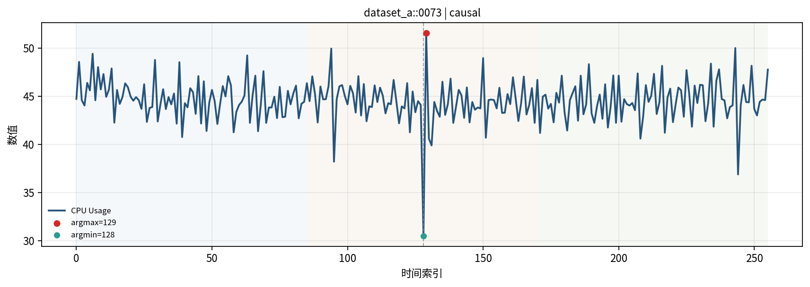

❓ QA 问题与中文翻译

**Dataset-A 标注属性原文**

[
  "Routine operations with minor fluctuations. The time series indicates that despite a generally stable trend, there are small fluctuations near point 127, which could suggest standard variation due to routine operational activities rather than unusual events like hardware malfunctions or system updates."
]

**Dataset-A 标注属性中文翻译**

[
  "常规运行，存在轻微波动。该时间序列显示，尽管总体趋势较为稳定，但在点 127 附近存在小幅波动，这可能表明这是由常规运行活动导致的标准变化，而非硬件故障或系统更新等异常事件。"
]

**题干原文**

You are a time series analysis expert. This time series is "CPU Usage" from AWS API servers with length of 256: &lt;ts&gt;&lt;ts/&gt;, please analyze the time series features and answer the following questions:
1. Given the time series for CPU Usage from AWS API servers, what is the most plausible explanation for the behavior observed near time point 127? Choose from: hardware malfunction, routine operations with minor fluctuations, or significant system update.
Now, based on the above questions, please strictly follow the output format requirements and provide the answers. Each line corresponds to an answer to a question, formatted as:1. Strictly formatted answer 1

**题干中文翻译**

你是一名时间序列分析专家。该时间序列是来自 AWS API 服务器的“CPU Usage”，长度为 256：&lt;ts&gt;&lt;ts/&gt;，请分析该时间序列特征并回答以下问题：
1. 给定来自 AWS API 服务器的 CPU Usage 时间序列，时间点 127 附近观察到的行为最可能的解释是什么？从以下选项中选择：硬件故障、伴有轻微波动的常规操作，或重大系统更新。
现在，请基于上述问题，严格遵循输出格式要求并给出答案。每一行对应一个问题的答案，格式为：1. 严格格式化的答案 1

**选项**
无固定选项；题目要求按指定格式直接生成答案。

**正确答案原文**

1. Routine operations with minor fluctuations. The time series indicates that despite a generally stable trend, there are small fluctuations near point 127, which could suggest standard variation due to routine operational activities rather than unusual events like hardware malfunctions or system updates.

**正确答案中文翻译**

1. 常规运行伴有轻微波动。该时间序列显示，尽管整体趋势总体稳定，但在点 127 附近存在小幅波动，这可能表明是由常规运行活动引起的标准变化，而不是硬件故障或系统更新等异常事件。

📝 生成的 caption 与中文翻译

**OpenTSLM caption 原文**

The time series shows a flat trend with low volatility and medium strength seasonality every 100 time units. Early in the window, there is a significant upward phase followed by a sharp downward movement, with a peak that stands out as about 2.1 standard deviations above the mean. The data exhibits strong positive correlation with temperature and moderate positive correlation with humidity.

**OpenTSLM caption 中文翻译**

该时间序列呈现平稳趋势，波动性较低，并且每 100 个时间单位表现出中等强度的季节性。窗口早期存在一个显著的上升阶段，随后出现急剧下降，并且有一个峰值明显突出，约高于均值 2.1 个标准差。数据与温度呈强正相关，与湿度呈中等正相关。

**ChatTS caption 原文**

1. Noisy with std around 3.12.
2. No periodic fluctuations observed, showing no periodic fluctuation.
3. Keep steady from 44.92 to 44.92.
4. A downward spike with an amplitude of 14.21 occurred between point 128 and point 130, with the time series value rapidly falling from around 44.92 to around 30.71 and then quickly rising back to around 44.92, forming a downward spike.

**ChatTS caption 中文翻译**

1. 有噪声，标准差约为 3.12。
2. 未观察到周期性波动，显示无周期性波动。
3. 保持稳定，从 44.92 到 44.92。
4. 在点 128 和点 130 之间发生了一个幅度为 14.21 的向下尖峰，时间序列值从约 44.92 快速下降到约 30.71，然后迅速回升到约 44.92，形成一个向下尖峰。

🧪 下游 QA 模型答案 / 评分

| 条件 | 平均分 | 分项分数 |
| --- | ---: | --- |
| `opentslm_meta_only` | 1.00 | causal=1.00 |
| `opentslm_numbers` | 1.00 | causal=1.00 |
| `opentslm_caption` | 0.00 | causal=0.00 |
| `opentslm_caption_plus` | 0.00 | causal=0.00 |
| `opentslm_wrong_caption` | 1.00 | causal=1.00 |
| `chatts_meta_only` | 1.00 | causal=1.00 |
| `chatts_numbers` | 1.00 | causal=1.00 |
| `chatts_caption` | 1.00 | causal=1.00 |
| `chatts_caption_plus` | 1.00 | causal=1.00 |
| `chatts_wrong_caption` | 0.00 | causal=0.00 |

🧾 模型原始输出 / 代表性回答

**代表性模型回答**

**`opentslm_meta_only` 模型回答原文**

1. routine operations with minor fluctuations

**`opentslm_meta_only` 模型回答中文翻译**

1. 常规操作，伴有轻微波动

**`opentslm_numbers` 模型回答原文**

1. routine operations with minor fluctuations

**`opentslm_numbers` 模型回答中文翻译**

常规运行，伴有轻微波动

**`opentslm_caption` 模型回答原文**

1. significant system update

**`opentslm_caption` 模型回答中文翻译**

1. 重大系统更新

**`opentslm_caption_plus` 模型回答原文**

1. significant system update

**`opentslm_caption_plus` 模型回答中文翻译**

1. 重大系统更新

**`opentslm_wrong_caption` 模型回答原文**

1. routine operations with minor fluctuations

**`opentslm_wrong_caption` 模型回答中文翻译**

常规运行，伴有轻微波动

**`chatts_meta_only` 模型回答原文**

1. routine operations with minor fluctuations

**`chatts_meta_only` 模型回答中文翻译**

常规运行，伴有轻微波动

**`chatts_numbers` 模型回答原文**

1. routine operations with minor fluctuations

**`chatts_numbers` 模型回答中文翻译**

1. 常规运行，伴有轻微波动

**`chatts_caption` 模型回答原文**

1. routine operations with minor fluctuations

**`chatts_caption` 模型回答中文翻译**

1. 伴有轻微波动的常规操作

**`chatts_caption_plus` 模型回答原文**

1. routine operations with minor fluctuations

**`chatts_caption_plus` 模型回答中文翻译**

1. 常规操作伴有轻微波动

**`chatts_wrong_caption` 模型回答原文**

1. significant system update

**`chatts_wrong_caption` 模型回答中文翻译**

1. 重大系统更新

🔎 Case 分析

- 失败标签：AWS CPU causal case：OpenTSLM 丢失因果条件
- 关键结论：此类题目要求把形态变化和系统负载/服务事件联系起来；OpenTSLM caption 条件为 0 分而 ChatTS 为 1 分，说明领域因果语义不是自然从形态摘要中涌现。

🗄 Case 11：dataset_a | Twitter mention causal case：事件含义依赖领域背景

##### 基本信息

| 字段 | 内容 |
| --- | --- |
| 数据集 | `dataset_a` |
| Case ID | `dataset_a::0083` |
| 问题类型 | `causal,causal,causal,causal` |
| Dataset-A 能力标签 | `causal, causal, causal, causal` |
| 正确答案 | `见 QA 折叠块` |

数值摘要：n=256, min=0, max=1673, mean=70.09, std=105.16, slope=-0.039424, argmax=128, argmin=230

🖼 时序图

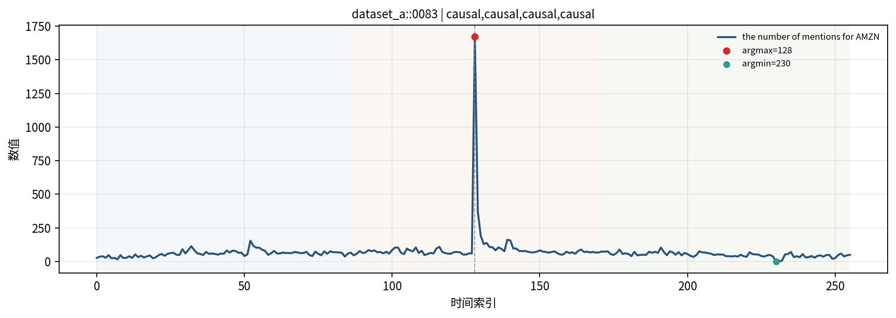

❓ QA 问题与中文翻译

**Dataset-A 标注属性原文**

[
  "Unexpected news release. The time series indicates a generally stable level with a sudden upward spike near point 128, followed by an increase. This pattern suggests a reaction to a specific event, such as unexpected news, that would likely trigger a sudden surge in mentions.",
  "Increased interest in AMZN stock. The observed pattern shows a significant upward spike followed by an increase, suggesting that similar future spikes could correlate with heightened public interest, potentially driving more attention and interest towards AMZN stock.",
  "Stable discussion levels. Between time points 100 and 120, the number of mentions remains steady before experiencing an upward spike near point 128. This indicates consistent behavior during this period without any notable increases or decreases.",
  "High volatility with no clear trend. Between time points 50 and 90, the overall behavior doesn't suggest a consistent upward or downward shift but rather significant noise, indicating substantial fluctuation with no distinct pattern."
]

**Dataset-A 标注属性中文翻译**

[
  "意外新闻发布。该时间序列显示总体水平较为稳定，在接近点 128 处突然向上飙升，随后出现增加。这种模式表明可能是对某一特定事件的反应，例如意外新闻，这很可能会引发提及量的突然激增。",
  "对 AMZN 股票的兴趣增加。观察到的模式显示出显著的向上飙升，随后出现增加，这表明未来类似的飙升可能与公众兴趣升高相关，可能会推动更多关注和兴趣转向 AMZN 股票。",
  "讨论水平稳定。在时间点 100 到 120 之间，提及次数保持稳定，随后在接近点 128 处出现向上飙升。这表明该时期内行为一致，没有任何显著增加或减少。",
  "高波动且无明确趋势。在时间点 50 到 90 之间，整体行为并不显示出一致的上升或下降变化，而是呈现显著噪声，表明存在大幅波动且没有明显模式。"
]

**题干原文**

You are a time series analysis expert. This time series is "the number of mentions for AMZN" from Twitter with length of 256: &lt;ts&gt;&lt;ts/&gt;, please analyze the time series features and answer the following questions:
1. Given the time series for the number of mentions for AMZN, which of the following is the most plausible factor influencing the observed behavior? Choose from: unexpected news release, normal social media discourse, or deliberate viral marketing campaign.
2. According to the time series for the number of mentions for AMZN on Twitter, what might be a possible outcome if a sudden spike occurs again after point 128? Choose from: increased interest in AMZN stock, decrease in AMZN's visibility, or no impact on social discourse.
3. Observing the time series for the number of mentions for AMZN, what might have happened between time points 100 and 120? Choose from: stable discussion levels, decrease in mentions, or a significant rise in AMZN-related discussions.
4. Based on the number of mentions for AMZN, what might have been the overall behavior between time points 50 and 90? Choose from: consistent upward trend, significant downward shift, or high volatility with no clear trend.
Now, based on the above questions, please strictly follow the output format requirements and provide the answers. Each line corresponds to an answer to a question, formatted as:1. Strictly formatted answer 1

**题干中文翻译**

你是时间序列分析专家。该时间序列是来自 Twitter 的“AMZN 提及次数”，长度为 256：&lt;ts&gt;&lt;ts/&gt;，请分析该时间序列特征并回答以下问题：
1. 给定 AMZN 提及次数的时间序列，以下哪一个是影响所观察到行为的最可能因素？从以下选项中选择：突发新闻发布、正常社交媒体讨论，或有意的病毒式营销活动。
2. 根据 Twitter 上 AMZN 提及次数的时间序列，如果在点 128 之后再次出现突然峰值，可能的结果是什么？从以下选项中选择：对 AMZN 股票的兴趣增加、AMZN 的可见度下降，或对社交讨论没有影响。
3. 观察 AMZN 提及次数的时间序列，在时间点 100 到 120 之间可能发生了什么？从以下选项中选择：讨论水平稳定、提及次数减少，或 AMZN 相关讨论显著上升。
4. 基于 AMZN 的提及次数，时间点 50 到 90 之间的整体行为可能是什么？从以下选项中选择：持续上升趋势、显著下降变化，或高波动且无明确趋势。
现在，请基于上述问题，严格遵循输出格式要求并提供答案。每一行对应一个问题的答案，格式为：1. 严格格式化的答案 1

**选项**
无固定选项；题目要求按指定格式直接生成答案。

**正确答案原文**

1. Unexpected news release. The time series indicates a generally stable level with a sudden upward spike near point 128, followed by an increase. This pattern suggests a reaction to a specific event, such as unexpected news, that would likely trigger a sudden surge in mentions.
2. Increased interest in AMZN stock. The observed pattern shows a significant upward spike followed by an increase, suggesting that similar future spikes could correlate with heightened public interest, potentially driving more attention and interest towards AMZN stock.
3. Stable discussion levels. Between time points 100 and 120, the number of mentions remains steady before experiencing an upward spike near point 128. This indicates consistent behavior during this period without any notable increases or decreases.
4. High volatility with no clear trend. Between time points 50 and 90, the overall behavior doesn't suggest a consistent upward or downward shift but rather significant noise, indicating substantial fluctuation with no distinct pattern.

**正确答案中文翻译**

1. 意外新闻发布。该时间序列显示出总体稳定的水平，在点 128 附近突然向上尖峰，随后增加。这种模式表明可能是对某一特定事件的反应，例如意外新闻，这很可能会引发提及量的突然激增。
2. 对 AMZN 股票的兴趣增加。观察到的模式显示出一次显著的向上尖峰，随后增加，表明未来类似的尖峰可能与公众兴趣上升相关，并可能促使更多关注和兴趣转向 AMZN 股票。
3. 讨论水平稳定。在时间点 100 到 120 之间，提及数量保持稳定，随后在点 128 附近出现向上尖峰。这表明该时期内行为一致，没有任何明显的增加或减少。
4. 高波动性且无明确趋势。在时间点 50 到 90 之间，整体行为并不显示出一致的上升或下降变化，而是表现为显著噪声，表明存在大幅波动且没有明显模式。

📝 生成的 caption 与中文翻译

**OpenTSLM caption 原文**

The time series shows a steady upward trend with low volatility, characterized by a strong seasonal pattern repeating every 10 periods. The early part of the series experiences a moderate increase, followed by a more pronounced rise in the first half, and a slightly less steep but still positive growth in the second half. The overall growth is substantial, with a total increase of over 100% over the time span.

**OpenTSLM caption 中文翻译**

该时间序列呈现出稳定的上升趋势，波动性较低，其特点是每 10 个周期重复一次的强季节性模式。序列早期经历了适度增长，随后在前半段出现更明显的上升，而在后半段增速略有放缓但仍保持正增长。整体增长显著，在整个时间跨度内总增幅超过 100%。

**ChatTS caption 原文**

1. Noisy with std around 13.74. 2. No periodic fluctuations observed, showing no periodic fluctuation. 3. Decrease from 21.38 to 44.59. 4. At point 127 and point 130, there were 2 consecutive upward spikes with amplitudes ranging from 1082.89 to 1622.15, with the time series value repeatedly rising sharply from around 49.86 to around 1132.75 and 1672.01, and then quickly falling back to around 49.86, forming a continuous upward spike.

**ChatTS caption 中文翻译**

1. 噪声较大，标准差约为 13.74。2. 未观察到周期性波动，显示无周期性波动。3. 从 21.38 下降到 44.59。4. 在点 127 和点 130，出现了 2 次连续的向上尖峰，幅度范围为 1082.89 到 1622.15，时间序列值从约 49.86 反复急剧上升到约 1132.75 和 1672.01，然后迅速回落到约 49.86，形成连续的向上尖峰。

🧪 下游 QA 模型答案 / 评分

| 条件 | 平均分 | 分项分数 |
| --- | ---: | --- |
| `opentslm_meta_only` | 0.75 | causal=0.75 |
| `opentslm_numbers` | 1.00 | causal=1.00 |
| `opentslm_caption` | 0.25 | causal=0.25 |
| `opentslm_caption_plus` | 0.25 | causal=0.25 |
| `opentslm_wrong_caption` | 0.25 | causal=0.25 |
| `chatts_meta_only` | 0.75 | causal=0.75 |
| `chatts_numbers` | 1.00 | causal=1.00 |
| `chatts_caption` | 1.00 | causal=1.00 |
| `chatts_caption_plus` | 1.00 | causal=1.00 |
| `chatts_wrong_caption` | 0.75 | causal=0.75 |

🧾 模型原始输出 / 代表性回答

**代表性模型回答**

**`opentslm_meta_only` 模型回答原文**

1. normal social media discourse
2. increased interest in AMZN stock
3. stable discussion levels
4. high volatility with no clear trend

**`opentslm_meta_only` 模型回答中文翻译**

1. 正常的社交媒体讨论
2. 对 AMZN 股票的兴趣增加
3. 讨论水平稳定
4. 高波动性且无明确趋势

**`opentslm_numbers` 模型回答原文**

1. unexpected news release
2. increased interest in AMZN stock
3. stable discussion levels
4. high volatility with no clear trend

**`opentslm_numbers` 模型回答中文翻译**

1. 意外的新闻发布
2. 对 AMZN 股票的兴趣增加
3. 讨论水平稳定
4. 高波动性且无明显趋势

**`opentslm_caption` 模型回答原文**

1. normal social media discourse
2. increased interest in AMZN stock
3. a significant rise in AMZN-related discussions
4. consistent upward trend

**`opentslm_caption` 模型回答中文翻译**

1. 正常的社交媒体讨论
2. 对 AMZN 股票的兴趣增加
3. 与 AMZN 相关的讨论显著增加
4. 持续上升趋势

**`opentslm_caption_plus` 模型回答原文**

1. normal social media discourse
2. increased interest in AMZN stock
3. a significant rise in AMZN-related discussions
4. consistent upward trend

**`opentslm_caption_plus` 模型回答中文翻译**

1. 正常的社交媒体讨论
2. 对 AMZN 股票的兴趣增加
3. 与 AMZN 相关的讨论显著增加
4. 持续上升趋势

**`opentslm_wrong_caption` 模型回答原文**

1. normal social media discourse
2. increased interest in AMZN stock
3. a significant rise in AMZN-related discussions
4. consistent upward trend

**`opentslm_wrong_caption` 模型回答中文翻译**

1. 正常的社交媒体讨论
2. 对 AMZN 股票的兴趣增加
3. 与 AMZN 相关的讨论显著增加
4. 持续上升趋势

**`chatts_meta_only` 模型回答原文**

1. normal social media discourse
2. increased interest in AMZN stock
3. stable discussion levels
4. high volatility with no clear trend

**`chatts_meta_only` 模型回答中文翻译**

1. 正常的社交媒体讨论
2. 对 AMZN 股票的兴趣增加
3. 讨论水平稳定
4. 高波动性且无明确趋势

**`chatts_numbers` 模型回答原文**

1. unexpected news release
2. increased interest in AMZN stock
3. stable discussion levels
4. high volatility with no clear trend

**`chatts_numbers` 模型回答中文翻译**

1. 意外的新闻发布
2. 对 AMZN 股票的兴趣增加
3. 稳定的讨论水平
4. 高波动性且无明确趋势

**`chatts_caption` 模型回答原文**

1. unexpected news release
2. increased interest in AMZN stock
3. stable discussion levels
4. high volatility with no clear trend

**`chatts_caption` 模型回答中文翻译**

1. 意外的新闻发布
2. 对 AMZN 股票的兴趣增加
3. 讨论水平稳定
4. 高波动性且无明确趋势

**`chatts_caption_plus` 模型回答原文**

1. unexpected news release
2. increased interest in AMZN stock
3. stable discussion levels
4. high volatility with no clear trend

**`chatts_caption_plus` 模型回答中文翻译**

1. 意外的新闻发布
2. 对 AMZN 股票的兴趣增加
3. 讨论水平稳定
4. 高波动性且无明显趋势

**`chatts_wrong_caption` 模型回答原文**

1. normal social media discourse
2. increased interest in AMZN stock
3. stable discussion levels
4. high volatility with no clear trend

**`chatts_wrong_caption` 模型回答中文翻译**

1. 正常的社交媒体讨论
2. 对 AMZN 股票的兴趣增加
3. 讨论水平稳定
4. 高波动性且无明确趋势

🔎 Case 分析

- 失败标签：Twitter mention causal case：事件含义依赖领域背景
- 关键结论：社交媒体 mentions 的 spike 需要解释为新闻、公告或市场事件。OpenTSLM 只部分命中，ChatTS 更稳定，显示 caption 风格会影响领域归因。

🗄 Case 12：dataset_a | deductive case：ChatTS 对，OpenTSLM 失败

##### 基本信息

| 字段 | 内容 |
| --- | --- |
| 数据集 | `dataset_a` |
| Case ID | `dataset_a::0096` |
| 问题类型 | `deductive` |
| Dataset-A 能力标签 | `deductive` |
| 正确答案 | `见 QA 折叠块` |

数值摘要：n=256, min=160.4, max=265.6, mean=182.82, std=11.782, slope=0.013501, argmax=224, argmin=125

🖼 时序图

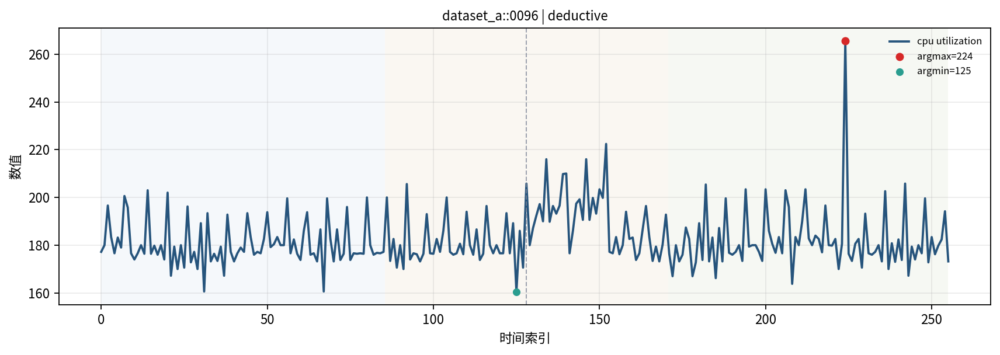

❓ QA 问题与中文翻译

**Dataset-A 标注属性原文**

[
  "Yes, it should not be regarded as Active. The standard deviation of the noise is 7.52, which surpasses the normal threshold of 5, indicating that the utilization is not within expected normal limits."
]

**Dataset-A 标注属性中文翻译**

[
  "是的，不应将其视为 Active。噪声的标准差为 7.52，超过了正常阈值 5，表明利用率不在预期的正常范围内。"
]

**题干原文**

You are a time series analysis expert. This time series is "cpu utilization" from server with length of 256: &lt;ts&gt;&lt;ts/&gt;, please analyze the time series features and answer the following questions:
1. Given that if the std of overall noise level is larger than the value of 1.0, the CPU utilization should be marked as "Active". Should this timeseries be marked as "Active"? Answer Yes or No and explain the reason.
Now, based on the above questions, please strictly follow the output format requirements and provide the answers. Each line corresponds to an answer to a question, formatted as:1. Strictly formatted answer 1

**题干中文翻译**

你是一位时间序列分析专家。该时间序列是来自服务器、长度为 256 的“CPU 利用率”：&lt;ts&gt;&lt;ts/&gt;，请分析该时间序列的特征并回答以下问题：
1. 已知如果整体噪声水平的标准差大于 1.0，则 CPU 利用率应标记为 "Active"。该时间序列是否应标记为 "Active"？回答是或否，并说明理由。
现在，请基于上述问题，严格遵循输出格式要求并给出答案。每一行对应一个问题的答案，格式为：1. 严格格式化的答案 1

**选项**
无固定选项；题目要求按指定格式直接生成答案。

**正确答案原文**

1. Yes, it should not be regarded as Active. The standard deviation of the noise is 7.52, which surpasses the normal threshold of 5, indicating that the utilization is not within expected normal limits.

**正确答案中文翻译**

1. 是的，不应将其视为 Active。噪声的标准差为 7.52，超过了正常阈值 5，表明利用率不在预期的正常范围内。

📝 生成的 caption 与中文翻译

**OpenTSLM caption 原文**

The time series shows a flat trend with low volatility and medium strength seasonality every 120 time units. Early in the window, there is a significant upward phase followed by a sharp downward movement, with a peak that stands out as about 1.5 standard deviations above the mean. The data exhibits strong positive correlation with temperature and moderate positive correlation with humidity.

**OpenTSLM caption 中文翻译**

该时间序列表现出平稳趋势、低波动性，并且每 120 个时间单位呈现中等强度的季节性。窗口早期出现显著上升阶段，随后急剧下降，其中一个峰值较为突出，约高于均值 1.5 个标准差。数据与温度呈强正相关，与湿度呈中等正相关。

**ChatTS caption 原文**

1. Noisy with std around 10.50
2. No periodic fluctuations observed, showing no periodic fluctuation
3. Keep steady from 179.50 to 179.50
4. No local features found.

**ChatTS caption 中文翻译**

1. 有噪声，标准差约为 10.50
2. 未观察到周期性波动，显示无周期性波动
3. 从 179.50 到 179.50 保持稳定
4. 未发现局部特征

🧪 下游 QA 模型答案 / 评分

| 条件 | 平均分 | 分项分数 |
| --- | ---: | --- |
| `opentslm_meta_only` | 0.00 | deductive=0.00 |
| `opentslm_numbers` | 0.00 | deductive=0.00 |
| `opentslm_caption` | 0.00 | deductive=0.00 |
| `opentslm_caption_plus` | 0.00 | deductive=0.00 |
| `opentslm_wrong_caption` | 0.00 | deductive=0.00 |
| `chatts_meta_only` | 0.00 | deductive=0.00 |
| `chatts_numbers` | 0.00 | deductive=0.00 |
| `chatts_caption` | 1.00 | deductive=1.00 |
| `chatts_caption_plus` | 0.00 | deductive=0.00 |
| `chatts_wrong_caption` | 0.00 | deductive=0.00 |

🧾 模型原始输出 / 代表性回答

**代表性模型回答**

**`opentslm_meta_only` 模型回答原文**

1. No — with only the column name “cpu utilization” and no actual time series values, there is no basis to estimate the overall noise standard deviation. Since the std of noise is not provided and cannot be determined from the metadata alone, it should not be marked as “Active” based on the given rule.

**`opentslm_meta_only` 模型回答中文翻译**

1. 否——仅有列名“cpu utilization”而没有实际的时间序列数值，无法估计整体噪声标准差。由于未提供噪声的标准差，且无法仅从元数据确定，因此根据给定规则，不应将其标记为“Active”。

**`opentslm_numbers` 模型回答原文**

1. Yes — this CPU utilization series should be marked as **Active** because its fluctuations are very large and clearly exceed a noise standard deviation of 1.0. The values span a wide range, including a notable spike up to **265.6**, with many other substantial variations around the typical level, indicating the overall noise level is well above the threshold.

**`opentslm_numbers` 模型回答中文翻译**

1. 是——该 CPU 利用率序列应标记为 **Active**，因为其波动非常大，并且明显超过 1.0 的噪声标准差。数值跨度很广，包括一次显著峰值达到 **265.6**，并且在典型水平附近还有许多其他显著变化，表明整体噪声水平远高于阈值。

**`opentslm_caption` 模型回答原文**

1. Yes — the series is described as having low volatility overall, but it also includes a noticeable upward phase, a sharp downward movement, and a standout peak around 1.5 standard deviations above the mean. This suggests the noise level is likely above 1.0, so it should be marked as **Active**.

**`opentslm_caption` 模型回答中文翻译**

1. 是——该序列被描述为整体波动性较低，但它也包含一个明显的上升阶段、一次急剧的下行运动，以及一个高于均值约 1.5 个标准差的突出峰值。这表明噪声水平很可能高于 1.0，因此应标记为 **Active**。

**`opentslm_caption_plus` 模型回答原文**

1. Yes — this time series should be marked as **Active** because it shows noticeable volatility with repeated spikes and sharp movements, including an outlier around 265.6. The overall noise level is clearly above 1.0 in standardized terms, and the combination of fluctuations, seasonal variation, and abrupt jumps indicates active CPU behavior rather than a stable idle pattern.

**`opentslm_caption_plus` 模型回答中文翻译**

1. 是——该时间序列应标记为 **Active**，因为它表现出明显的波动性，伴有反复的峰值和剧烈变动，包括约 265.6 的离群值。按标准化尺度来看，整体噪声水平明显高于 1.0；波动、季节性变化和突发跳变的组合表明这是活跃的 CPU 行为，而不是稳定的空闲模式。

**`opentslm_wrong_caption` 模型回答原文**

1. Yes — the time series shows a steady upward trend with a pronounced seasonal pattern and a late peak, indicating meaningful variability in the CPU utilization. Given these fluctuations and the described strong dynamics, it is reasonable to mark it as **Active** since the overall noise/variability is likely above the 1.0 threshold.

**`opentslm_wrong_caption` 模型回答中文翻译**

1. 是——该时间序列显示出稳定的上升趋势，并具有明显的季节性模式和较晚出现的峰值，表明 CPU 利用率存在有意义的波动。鉴于这些波动以及所描述的强动态特征，将其标记为 **Active** 是合理的，因为整体噪声/变异性很可能高于 1.0 阈值。

**`chatts_meta_only` 模型回答原文**

1. No. Based on the column name alone (“cpu utilization”) and with no actual time series values available, there is no evidence that the overall noise level’s standard deviation exceeds 1.0. Therefore, it should not be marked as “Active” from the available information.

**`chatts_meta_only` 模型回答中文翻译**

1. 否。仅根据列名（“cpu utilization”）且没有可用的实际时间序列值，没有证据表明整体噪声水平的标准差超过 1.0。因此，根据可用信息，不应将其标记为“Active”。

**`chatts_numbers` 模型回答原文**

1. Yes — this time series should be marked as **Active**. The CPU utilization values fluctuate substantially over time, with many deviations around the central level and several noticeable spikes (for example, values above 200 and even around 265.6). This indicates the overall noise level is well above the threshold of 1.0, so it meets the criterion for being Active.

**`chatts_numbers` 模型回答中文翻译**

1. 是——该时间序列应标记为 **Active**。CPU 利用率数值随时间大幅波动，在中心水平附近有许多偏离，并且出现了几个明显峰值（例如，高于 200，甚至约为 265.6 的数值）。这表明整体噪声水平明显高于 1.0 的阈值，因此符合判定为 Active 的标准。

**`chatts_caption` 模型回答原文**

1. Yes. The reported overall noise standard deviation is about 10.50, which is much larger than the 1.0 threshold, so this CPU utilization time series should be marked as "Active".

**`chatts_caption` 模型回答中文翻译**

1. 是。报告的整体噪声标准差约为 10.50，远大于 1.0 阈值，因此该 CPU 利用率时间序列应标记为“Active”。

**`chatts_caption_plus` 模型回答原文**

1. Yes — this time series should be marked as **Active** because the overall noise level is high, with a reported standard deviation of around **10.50**, which is much larger than the threshold of **1.0**.

**`chatts_caption_plus` 模型回答中文翻译**

1. 是——该时间序列应标记为 **Active**，因为整体噪声水平很高，报告的标准差约为 **10.50**，远大于 **1.0** 的阈值。

**`chatts_wrong_caption` 模型回答原文**

1. Yes — the time series should be marked as **Active** because the overall noise standard deviation is about **2.51**, which is greater than the threshold **1.0**.

**`chatts_wrong_caption` 模型回答中文翻译**

1. 是——该时间序列应标记为 **Active**，因为整体噪声标准差约为 **2.51**，大于阈值 **1.0**。

🔎 Case 分析

- 失败标签：deductive case：ChatTS 对，OpenTSLM 失败
- 关键结论：deductive 问题需要按题目规则推出结论，不只是描述时序。OpenTSLM caption 条件为 0，说明摘要并没有转化为可执行的推理前提。

🗄 Case 13：dataset_a | deductive hard case：两个 caption 都失败

##### 基本信息

| 字段 | 内容 |
| --- | --- |
| 数据集 | `dataset_a` |
| Case ID | `dataset_a::0105` |
| 问题类型 | `deductive,deductive,deductive` |
| Dataset-A 能力标签 | `deductive, deductive, deductive` |
| 正确答案 | `见 QA 折叠块` |

数值摘要：n=256, min=30.482, max=51.6, mean=44.588, std=2.1897, slope=-0.0019699, argmax=129, argmin=128

🖼 时序图

❓ QA 问题与中文翻译

**Dataset-A 标注属性原文**

[
  "No, it does not suggest an anomaly. Although there are local fluctuations around point 127 with an amplitude of 15.79, this amplitude does not exceed three times the noise standard deviation (2.372 * 3 = 7.116). Therefore, the observed behavior remains within expected limits based on the noise characteristics.",
  "No, the current behavior should not be flagged as unusual. Although there is noticeable noise with a particularly small downward spike, the time series does not show three small fluctuations exceeding the specified threshold within the defined period of 150 data points. Hence, the behavior remains within expected operational variance.",
  "No, the data should not be considered suspicious. Despite the high noise level with a standard deviation of 2.372, the CPU usage trend remains constant at 44.7 throughout, with no significant deviations in the average values over extended intervals. This stability aligns with expected normal operation behavior."
]

**Dataset-A 标注属性中文翻译**

[
  "不，它并不表明存在异常。尽管在点 127 附近存在幅度为 15.79 的局部波动，但该幅度并未超过噪声标准差的三倍（2.372 * 3 = 7.116）。因此，基于噪声特征，观察到的行为仍处于预期范围内。",
  "不，当前行为不应被标记为异常。尽管存在明显噪声，并且有一个特别小的向下尖峰，但该时间序列在 150 个数据点的规定时间段内并未显示出三次超过指定阈值的小幅波动。因此，该行为仍处于预期的运行方差范围内。",
  "不，该数据不应被视为可疑。尽管噪声水平较高，标准差为 2.372，但 CPU 使用率趋势始终保持在 44.7，长期区间内平均值没有显著偏差。这种稳定性符合预期的正常运行行为。"
]

**题干原文**

You are a time series analysis expert. This time series is "CPU Usage" from AWS API servers with length of 256: &lt;ts&gt;&lt;ts/&gt;, please analyze the time series features and answer the following questions:
1. Given that CPU usage typically remains stable with minimal fluctuations, and it's considered abnormal if there's a fluctuation greater than three times the standard deviation of the noise, does the current observed behavior suggest an anomaly? Answer Yes or No and explain the reason.
2. In scenarios where CPU usage is generally stable, frequent small fluctuations might be overlooked unless they follow a specific pattern or exceed a combined threshold of three small fluctuations within a period of 150 data points. Considering the time series provided for CPU usage, should we flag the current behavior as unusual due to potential accumulative anomaly patterns? Answer Yes or No and explain the reason.
3. Considering that a stable CPU usage pattern with high noise suggests normal operation, and sudden deviations in average values over significant intervals are considered suspicious if they deviate more than twice the noise standard deviation, should the current time series data indicate a suspicious deviation in operational behavior based on the provided noise levels? Answer Yes or No and explain the reason.
Now, based on the above questions, please strictly follow the output format requirements and provide the answers. Each line corresponds to an answer to a question, formatted as:1. Strictly formatted answer 1

**题干中文翻译**

你是时间序列分析专家。该时间序列是来自 AWS API 服务器、长度为 256 的“CPU Usage”：&lt;ts&gt;&lt;ts/&gt;，请分析该时间序列特征并回答以下问题：
1. 鉴于 CPU 使用率通常保持稳定且波动很小，并且如果波动大于噪声标准差的三倍则被认为是异常，那么当前观测到的行为是否表明存在异常？回答 Yes 或 No，并解释原因。
2. 在 CPU 使用率通常稳定的场景中，频繁的小幅波动可能会被忽略，除非它们遵循特定模式，或在 150 个数据点的期间内超过三次小幅波动的组合阈值。考虑所提供的 CPU 使用率时间序列，是否应由于潜在的累积异常模式而将当前行为标记为异常？回答 Yes 或 No，并解释原因。
3. 考虑到具有高噪声的稳定 CPU 使用率模式表明运行正常，并且如果显著区间内平均值的突然偏离超过噪声标准差的两倍，则被认为可疑，那么基于所提供的噪声水平，当前时间序列数据是否应表明运行行为存在可疑偏离？回答 Yes 或 No，并解释原因。
现在，请基于上述问题，严格遵循输出格式要求并给出答案。每一行对应一个问题的答案，格式为：1. 严格格式化的答案 1

**选项**
无固定选项；题目要求按指定格式直接生成答案。

**正确答案原文**

1. No, it does not suggest an anomaly. Although there are local fluctuations around point 127 with an amplitude of 15.79, this amplitude does not exceed three times the noise standard deviation (2.372 * 3 = 7.116). Therefore, the observed behavior remains within expected limits based on the noise characteristics.
2. No, the current behavior should not be flagged as unusual. Although there is noticeable noise with a particularly small downward spike, the time series does not show three small fluctuations exceeding the specified threshold within the defined period of 150 data points. Hence, the behavior remains within expected operational variance.
3. No, the data should not be considered suspicious. Despite the high noise level with a standard deviation of 2.372, the CPU usage trend remains constant at 44.7 throughout, with no significant deviations in the average values over extended intervals. This stability aligns with expected normal operation behavior.

**正确答案中文翻译**

1. 否，它并不表明存在异常。尽管在点 127 附近存在幅度为 15.79 的局部波动，但该幅度未超过噪声标准差的三倍（2.372 * 3 = 7.116）。因此，根据噪声特征，观察到的行为仍处于预期范围内。
2. 否，当前行为不应被标记为异常。尽管存在明显噪声，并伴有一个特别小的向下尖峰，但该时间序列在定义的 150 个数据点期间内，并未显示出三次超过指定阈值的小幅波动。因此，该行为仍处于预期的运行方差范围内。
3. 否，该数据不应被视为可疑。尽管噪声水平较高，标准差为 2.372，但 CPU 使用率趋势始终保持在 44.7，且在较长区间内的平均值没有显著偏差。这种稳定性符合预期的正常运行行为。

📝 生成的 caption 与中文翻译

**OpenTSLM caption 原文**

The time series shows a flat trend with low volatility and medium strength seasonality every 100 time units. Early in the window, there is a significant upward phase followed by a sharp downward movement, with a peak that stands out as about 2.1 standard deviations above the mean. The data exhibits strong positive correlation with temperature and moderate positive correlation with humidity.

**OpenTSLM caption 中文翻译**

该时间序列呈现平稳趋势，波动性低，并且每 100 个时间单位具有中等强度的季节性。窗口早期出现显著上升阶段，随后急剧下降，其中一个峰值明显突出，约高于均值 2.1 个标准差。数据与温度呈强正相关，与湿度呈中等正相关。

**ChatTS caption 原文**

1. Noisy with std around 3.12.
2. No periodic fluctuations observed, showing no periodic fluctuation.
3. Keep steady from 44.92 to 44.92.
4. A downward spike with an amplitude of 14.21 occurred between point 128 and point 130, with the time series value rapidly falling from around 44.92 to around 30.71 and then quickly rising back to around 44.92, forming a downward spike.

**ChatTS caption 中文翻译**

1. 有噪声，标准差约为 3.12。
2. 未观察到周期性波动，显示无周期性波动。
3. 从 44.92 到 44.92 保持稳定。
4. 在点 128 和点 130 之间出现了一个幅度为 14.21 的向下尖峰，时间序列值从约 44.92 快速下降到约 30.71，然后迅速回升到约 44.92，形成一个向下尖峰。

🧪 下游 QA 模型答案 / 评分

| 条件 | 平均分 | 分项分数 |
| --- | ---: | --- |
| `opentslm_meta_only` | 0.00 | deductive=0.00 |
| `opentslm_numbers` | 0.00 | deductive=0.00 |
| `opentslm_caption` | 0.00 | deductive=0.00 |
| `opentslm_caption_plus` | 0.00 | deductive=0.00 |
| `opentslm_wrong_caption` | 0.00 | deductive=0.00 |
| `chatts_meta_only` | 0.00 | deductive=0.00 |
| `chatts_numbers` | 0.00 | deductive=0.00 |
| `chatts_caption` | 0.00 | deductive=0.00 |
| `chatts_caption_plus` | 0.00 | deductive=0.00 |
| `chatts_wrong_caption` | 0.00 | deductive=0.00 |

🧾 模型原始输出 / 代表性回答

**代表性模型回答**

**`opentslm_meta_only` 模型回答原文**

1. No — with no actual CPU usage values provided, there is no evidence of a fluctuation exceeding three times the noise standard deviation, so an anomaly cannot be confirmed from the column name alone.
2. No — there is no time series data to evaluate for repeated small fluctuations or any accumulative pattern over 150 points, so this cannot be flagged as unusual based on the available information.
3. No — without observed values or estimated noise levels from the series, there is no basis to identify a sustained deviation in the average CPU usage that exceeds twice the noise standard deviation.

**`opentslm_meta_only` 模型回答中文翻译**

1. 否——由于未提供实际的 CPU 使用率数值，没有证据表明存在超过噪声标准差三倍的波动，因此不能仅凭列名确认异常。
2. 否——没有可用于评估重复小幅波动或 150 个点内任何累积模式的时间序列数据，因此基于现有信息不能将其标记为异常。
3. 否——如果没有序列中的观测值或估计噪声水平，就没有依据识别平均 CPU 使用率中超过噪声标准差两倍的持续偏离。

**`opentslm_numbers` 模型回答原文**

1. Yes — the series is mostly stable around the mid-40s, but it contains a clear outlier-like dip/spike pair (notably around 30.48 and 51.6), which is a fluctuation larger than what would typically be expected from normal noise.
2. Yes — although many points are small fluctuations, the series includes repeated local deviations and at least one notable abnormal segment, so the accumulated pattern is unusual enough to flag.
3. Yes — the overall level is mostly stable, but the abrupt deviation around the low-30s and subsequent rebound is large relative to the normal noise level, making it suspicious by the “more than twice the noise standard deviation” criterion.

**`opentslm_numbers` 模型回答中文翻译**

1. 是——该序列大多稳定在 40 多的中段附近，但包含一对明显类似离群值的下跌/峰值（尤其是在 30.48 和 51.6 附近），这是一次大于通常正常噪声预期范围的波动。
2. 是——尽管许多点只是小幅波动，但该序列包含反复出现的局部偏差，并且至少有一个明显的异常片段，因此累积模式异常到足以被标记。
3. 是——整体水平大多稳定，但在 30 多的低段附近出现的突然偏离以及随后的反弹，相对于正常噪声水平来说幅度较大，因此按照“超过噪声标准差两倍”的标准来看是可疑的。

**`opentslm_caption` 模型回答原文**

1. Yes — the series is mostly stable, but it contains a notable upward spike followed by a sharp drop, with a peak around 2.1 standard deviations above the mean. While this is below the “greater than 3σ” threshold, the described abrupt deviation is still unusual relative to the otherwise low-volatility pattern.

2. No — there is no clear indication of repeated small fluctuations accumulating into a three-fluctuation pattern within 150 points. The dominant behavior is a single short-lived spike and reversal, not a sustained sequence of small anomalies.

3. Yes — the data shows a sudden deviation in the average level during the early part of the window, and the peak is well above the normal baseline. Even though the spike is not above 2σ by a large margin, the abrupt change in behavior makes it suspicious for operational deviation.

**`opentslm_caption` 模型回答中文翻译**

1. 是——该序列总体上大致稳定，但包含一次显著的向上尖峰，随后出现急剧下降，峰值约高于均值 2.1 个标准差。虽然这低于“大于 3σ”的阈值，但相对于其余部分低波动的模式而言，所描述的突发偏离仍然不寻常。

2. 否——没有明确迹象表明反复的小幅波动在 150 个点内累积成三次波动模式。主要行为是一次短暂的尖峰及回落，而不是一系列持续的小异常。

3. 是——数据显示窗口早期的平均水平出现突然偏离，且峰值明显高于正常基线。尽管该尖峰并未大幅超过 2σ，但这种行为上的突变使其在运行偏离方面显得可疑。

**`opentslm_caption_plus` 模型回答原文**

1. No — the series is mostly stable with low-volatility fluctuations, and the few spikes/dips visible do not clearly exceed a sustained 3σ noise threshold in a way that indicates a strong anomaly.
2. No — although there are some isolated irregular points, the pattern does not show repeated accumulative fluctuations meeting the “three small fluctuations within 150 points” criterion strongly enough to flag it as unusual.
3. No — the average level remains broadly stable overall, and there is not enough evidence of a significant interval-level deviation beyond 2× the noise standard deviation to classify the behavior as suspicious.

**`opentslm_caption_plus` 模型回答中文翻译**

1. 否——该序列大体稳定，仅有低波动幅度的起伏，可见的少数尖峰/下探并未明显超过持续的 3σ 噪声阈值，因此不足以表明存在强异常。
2. 否——尽管存在一些孤立的不规则点，但该模式并未表现出足够明显的、符合“150 个点内出现三次小幅波动”标准的重复累积波动，因此不足以将其标记为异常。
3. 否——整体平均水平总体保持稳定，且没有足够证据显示存在超过 2× 噪声标准差的显著区间级偏差，因此不足以将该行为归类为可疑。

**`opentslm_wrong_caption` 模型回答原文**

1. No — the series is mostly flat with low volatility, and the described peak/valley are around 1.6–1.7 standard deviations, which is below the “greater than 3× noise standard deviation” anomaly threshold.

2. No — although there is a clear seasonal pattern and some directional movement, the description does not indicate repeated small fluctuations accumulating into three distinct small anomalies within 150 points, so it should not be flagged as an accumulative anomaly pattern.

3. No — the behavior does not show a sustained suspicious shift in the average that exceeds twice the noise standard deviation; it remains largely stable with only moderate deviations, which is consistent with normal operation.

**`opentslm_wrong_caption` 模型回答中文翻译**

1. 否——该序列大部分较为平坦且波动性较低，所描述的峰值/谷值约为 1.6–1.7 个标准差，低于“超过 3× 噪声标准差”的异常阈值。

2. 否——尽管存在明显的季节性模式和一定的方向性移动，但描述并未表明在 150 个点内有反复的小幅波动累积成三个不同的小异常，因此不应标记为累积性异常模式。

3. 否——该行为未显示出平均值存在持续的可疑偏移且超过两倍噪声标准差；它整体上仍较为稳定，仅有中等程度的偏离，这与正常运行一致。

**`chatts_meta_only` 模型回答原文**

1. No — with no actual time series values provided, there is no evidence of a fluctuation exceeding three times the noise standard deviation.
2. No — without observed data points or a visible pattern of repeated small fluctuations, there is no basis to flag an accumulative anomaly over 150 points.
3. No — based on the column name alone and no numerical series or noise estimates, there is no evidence of a sustained mean shift exceeding twice the noise standard deviation.

**`chatts_meta_only` 模型回答中文翻译**

1. 否——未提供实际时间序列数值，因此没有证据表明存在超过噪声标准差三倍的波动。
2. 否——没有观测数据点或可见的重复小幅波动模式，因此没有依据标记 150 个点上的累积异常。
3. 否——仅根据列名且没有数值序列或噪声估计，没有证据表明存在超过噪声标准差两倍的持续均值偏移。

**`chatts_numbers` 模型回答原文**

1. Yes — there is a clear spike/drop pattern, most notably the dip to 30.48 followed by a jump to 51.6, which is larger than a typical 3× noise-scale fluctuation for an otherwise stable CPU series.
2. Yes — although most values are stable, the series contains a noticeable abnormal local burst around the sharp dip-and-rebound segment, which could satisfy an accumulative anomaly pattern over a short window.
3. Yes — the sudden deviation in average level around the outlier region is suspicious because it departs from the otherwise tight baseline by more than a normal 2× noise-standard-deviation range.

**`chatts_numbers` 模型回答中文翻译**

1. 是——存在明显的尖峰/下降模式，最显著的是降至 30.48 后又跃升至 51.6，这比原本稳定的 CPU 序列中典型的 3× 噪声尺度波动更大。
2. 是——尽管大多数数值较为稳定，但该序列在急剧下降并反弹的片段附近包含一个明显的异常局部突增，这可能在短窗口内满足累积异常模式。
3. 是——离群区域附近平均水平的突然偏离值得怀疑，因为它偏离了原本紧密的基线，幅度超过正常的 2× 噪声标准差范围。

**`chatts_caption` 模型回答原文**

1. Yes — the downward spike drops from about 44.92 to 30.71, an amplitude of 14.21, which is greater than three times the noise standard deviation (3 × 3.12 = 9.36), so it qualifies as an anomaly.
2. No — the series is mostly steady with only one isolated spike, not a pattern of frequent small fluctuations, and it does not show three small fluctuations accumulating within 150 points.
3. Yes — although the overall CPU usage is stable, the sudden drop is a clear deviation from the usual average level, and its magnitude exceeds twice the noise standard deviation (2 × 3.12 = 6.24), making it suspicious.

**`chatts_caption` 模型回答中文翻译**

1. 是——向下的尖峰从约 44.92 降至 30.71，幅度为 14.21，大于三倍噪声标准差（3 × 3.12 = 9.36），因此符合异常条件。
2. 否——该序列总体较为稳定，只有一个孤立的尖峰，并非频繁小幅波动的模式，也没有显示出在 150 个点内累积三次小幅波动。
3. 是——尽管整体 CPU 使用率稳定，但突然下降明显偏离了通常的平均水平，且其幅度超过两倍噪声标准差（2 × 3.12 = 6.24），因此可疑。

**`chatts_caption_plus` 模型回答原文**

1. Yes — the series is mostly stable around 44.9, but it contains a sharp downward spike to about 30.5 and a rebound to above 51, which is far greater than three times the noise standard deviation (~9.36), so this is anomalous.
2. No — although there are small noisy fluctuations, the main abnormal event is a single sharp spike rather than a repeated accumulative pattern of three small fluctuations within 150 points, so this does not fit the described cumulative anomaly rule.
3. Yes — the abrupt deviation around the spike changes the local average far more than twice the noise standard deviation (~6.24), so it is suspicious and indicates abnormal operational behavior.

**`chatts_caption_plus` 模型回答中文翻译**

1. 是——该序列大部分时间在 44.9 附近保持稳定，但包含一次急剧向下的尖峰，降至约 30.5，随后反弹至 51 以上，这远大于噪声标准差的三倍（~9.36），因此这是异常的。
2. 否——尽管存在小幅噪声波动，但主要异常事件是单次急剧尖峰，而不是在 150 个点内三次小幅波动的重复累积模式，因此这不符合所描述的累积异常规则。
3. 是——尖峰附近的突然偏离使局部平均值变化远超过噪声标准差的两倍（~6.24），因此它是可疑的，并表明存在异常运行行为。

**`chatts_wrong_caption` 模型回答原文**

1. Yes — the series is mostly stable with almost no noise, but there is a clear upward spike around point 226 with amplitude 4.28, which is likely greater than three times the noise standard deviation and therefore anomalous.
2. No — although there is a noticeable spike, the description does not indicate repeated small fluctuations or an accumulative pattern over 150 points; it appears to be a single isolated event rather than a series of small anomalies.
3. Yes — the CPU usage is generally steady, and the sudden spike represents a significant deviation from the average behavior, exceeding what would be expected from the low noise level and thus looks suspicious.

**`chatts_wrong_caption` 模型回答中文翻译**

1. 是 — 该序列大体稳定，几乎没有噪声，但在点 226 附近有一个明显的向上尖峰，幅度为 4.28，很可能大于噪声标准差的三倍，因此属于异常。
2. 否 — 尽管存在一个明显的尖峰，但描述并未表明在 150 个点范围内存在反复的小幅波动或累积模式；它看起来是单个孤立事件，而不是一系列小异常。
3. 是 — CPU 使用率总体稳定，突然出现的尖峰表示相对于平均行为的显著偏离，超过了低噪声水平下的预期范围，因此看起来可疑。

🔎 Case 分析

- 失败标签：deductive hard case：两个 caption 都失败
- 关键结论：这类 case 说明失败不只来自某一个 caption 模型，也来自下游任务对规则推理和领域条件的依赖，单纯 caption 监督无法解决。

#### C. FREDQA 宏观经济背景推理：变量关系与反事实

💵 Case 14：FREDQA | PIH 语义关系不在局部形态里

##### 基本信息

| 字段 | 内容 |
| --- | --- |
| 数据集 | `FREDQA` |
| Case ID | `fredqa::1033` |
| 问题类型 | `macro_economic_qa` |
| 正确答案 | `A` |

- artifact 说明：FREDQA has small n and no complete model-eval table in current artifacts; use for qualitative domain-context cases only.

数值摘要：n=626, min=96.613, max=443.51, mean=244.59, std=101.46, slope=0.28037, argmax=311, argmin=11

🖼 时序图

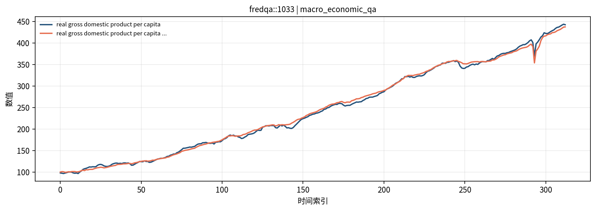

❓ QA 问题与中文翻译

**题干原文**

You are a time series analysis expert. In the U.S. macroeconomy, there are two quarterly metrics from 1947:Q1 to 2016:Q2: 1) Real gross domestic product (GDP) per capita &lt;ts&gt;&lt;ts/&gt;, 2) Real personal consumption (nondurables plus services) &lt;ts&gt;&lt;ts/&gt;. Both series are indexed so the consumption series passes through the GDP series. The Permanent Income Hypothesis (PIH) posits that household consumption depends primarily on perceived permanent income (trend GDP), while transitory income changes have little effect on consumption. Based on the association between the two series in the early period (1947:Q1–1984:Q1) versus the late period (1984:Q2–2016:Q2), which causal conclusion about GDP fluctuations is supported?

**题干中文翻译**

你是时间序列分析专家。在美国宏观经济中，有两个从 1947:Q1 到 2016:Q2 的季度指标：1) 实际人均国内生产总值（GDP）&lt;ts&gt;&lt;ts/&gt;，2) 实际个人消费（非耐用品加服务）&lt;ts&gt;&lt;ts/&gt;。两个序列都经过指数化处理，使得消费序列穿过 GDP 序列。永久收入假说（PIH）认为，家庭消费主要取决于感知到的永久收入（趋势 GDP），而暂时性收入变化对消费影响很小。基于早期阶段（1947:Q1–1984:Q1）与晚期阶段（1984:Q2–2016:Q2）中这两个序列之间的关联，关于 GDP 波动支持哪一种因果结论？

**选项**
- A: Early-period GDP fluctuations were driven more by transitory factors, while late-period fluctuations were driven more by permanent factors.
  中文：早期阶段的 GDP 波动更多由暂时性因素驱动，而后期阶段的波动更多由永久性因素驱动。
- B: Early-period GDP fluctuations were driven more by permanent factors, while late-period fluctuations were driven more by transitory factors.
  中文：早期阶段的 GDP 波动更多由永久性因素驱动，而后期阶段的波动更多由暂时性因素驱动。
- C: Both periods’ GDP fluctuations were driven equally by transitory and permanent factors.
  中文：两个时期的 GDP 波动同样由暂时性因素和永久性因素驱动。
- D: Late-period GDP fluctuations were driven by transitory factors unrelated to household perceptions of permanent income.
  中文：后期的 GDP 波动是由与家庭对永久收入的感知无关的暂时性因素驱动的。

**正确答案**：`A`

**标准解释原文**

To solve this, first observe the association between GDP and consumption across periods: the data show GDP deviates more from consumption in the early period (1947:Q1–1984:Q1) but aligns closely with consumption in the late period (1984:Q2–2016:Q2). Per the PIH, consumption reflects permanent income (trend GDP), so deviations of GDP from consumption signal transitory income changes. Early-period deviations mean transitory factors dominated fluctuations, while late-period alignment means permanent factors (trend shifts) drove most GDP movement. This directly supports option A.

**标准解释中文翻译**

为了解决这个问题，首先观察各时期 GDP 与消费之间的关联：数据显示，在早期（1947:Q1–1984:Q1），GDP 相对于消费的偏离更大，而在后期（1984:Q2–2016:Q2），GDP 与消费高度一致。根据 PIH，消费反映永久收入（趋势 GDP），因此 GDP 相对于消费的偏离表明暂时性收入变化。早期的偏离意味着暂时性因素主导了波动，而后期的一致性意味着永久性因素（趋势变化）驱动了大部分 GDP 变动。这直接支持选项 A。

📝 生成的 caption 与中文翻译

**生成 caption 样本 1 原文**

【序列 1：real gross domestic product per capita】变量组包括 real gross domestic product per capita, real gross domestic product per capita+real personl consumption。下文重点描述 real gross domestic product per capita，并分析其与其它变量的联动。 从全局走势看，时间跨度为 1947-01-01–2025-01-01，real gross domestic product per capita 首尾分别为 98.00 和 442.4。 细分来看：1947-01-01–1950-10-01，real gross domestic product per capita 呈稳步上行态势，由 98.00 变至 107.7。 随后，1950-10-01–1965-10-01，涨势未减，继续抬升至 152.0。 之后，1965-10-01–1972-10-01，保持上涨态势，由 152.0 走到 180.3。 紧接着，1972-10-01–1988-04-01，保持上涨态势，由 180.3 走到 249.3。 紧接着，1988-04-01–2025-01-01，保持上涨态势，由 249.3 走到 442.4。 值得注意的极值点有：几个显著高位出现在：2019-10-01≈407.22；2021-10-01≈423.71；2024-10-01≈443.51。 几个显著低位出现在：1947-07-01≈96.66；1949-04-01≈97.29；1951-10-01≈111.67。 从变量联动角度看：real gross domestic product per capita+real personl consumption 和 real gross domestic product per capita 的变化多半同向。
【序列 2：real gross domestic product per capita+real personl consumption】变量组包括 real gross domestic product per capita、real gross domestic product per capita+real personl consumption。下文重点描述 real gross domestic product per capita+real personl consumption，并分析其与其它变量的联动。 总体而言，时间跨度为 1947-01-01–2025-01-01，real gross domestic product per capita+real personl consumption 首尾分别为 100.0 和 437.3。 分阶段来看：1947-01-01–1972-07-01，real gross domestic product per capita+real personl consumption 呈明显上涨态势，由 100.0 变至 179.4。 紧接着，1972-07-01–1983-04-01，延续了上行趋势，从 179.4 进一步升至 218.1。 接着，1983-04-01–2005-01-01，保持上涨态势，由 218.1 走到 344.9。 紧接着，2005-01-01–2025-01-01，保持上涨态势，由 344.9 走到 437.3。 值得注意的极值点有：几个显著高位出现在：2007-01-01≈357.00；2008-04-01≈359.50；2019-10-01≈397.20。 几个显著低位出现在：1947-10-01≈99.40；1949-07-01≈100.30；1950-10-01≈103.50。 关于变量间的相关性：real gross domestic product per capita 和 real gross domestic product per capita+real personl consumption 的变化多半同向。 此外，未观察到明显的周期性规律。 临近 2025-01-01，real gross domestic product per capita+real personl consumption 仍在震荡，最终落在 437.30 左右。

**生成 caption 样本 1 中文翻译**

【序列 1：real gross domestic product per capita】变量组包括 real gross domestic product per capita, real gross domestic product per capita+real personl consumption。下文重点描述 real gross domestic product per capita，并分析其与其它变量的联动。 从全局走势看，时间跨度为 1947-01-01–2025-01-01，real gross domestic product per capita 首尾分别为 98.00 和 442.4。 细分来看：1947-01-01–1950-10-01，real gross domestic product per capita 呈稳步上行态势，由 98.00 变至 107.7。 随后，1950-10-01–1965-10-01，涨势未减，继续抬升至 152.0。 之后，1965-10-01–1972-10-01，保持上涨态势，由 152.0 走到 180.3。 紧接着，1972-10-01–1988-04-01，保持上涨态势，由 180.3 走到 249.3。 紧接着，1988-04-01–2025-01-01，保持上涨态势，由 249.3 走到 442.4。 值得注意的极值点有：几个显著高位出现在：2019-10-01≈407.22；2021-10-01≈423.71；2024-10-01≈443.51。 几个显著低位出现在：1947-07-01≈96.66；1949-04-01≈97.29；1951-10-01≈111.67。 从变量联动角度看：real gross domestic product per capita+real personl consumption 和 real gross domestic product per capita 的变化多半同向。
【序列 2：real gross domestic product per capita+real personl consumption】变量组包括 real gross domestic product per capita、real gross domestic product per capita+real personl consumption。下文重点描述 real gross domestic product per capita+real personl consumption，并分析其与其它变量的联动。 总体而言，时间跨度为 1947-01-01–2025-01-01，real gross domestic product per capita+real personl consumption 首尾分别为 100.0 和 437.3。 分阶段来看：1947-01-01–1972-07-01，real gross domestic product per capita+real personl consumption 呈明显上涨态势，由 100.0 变至 179.4。 紧接着，1972-07-01–1983-04-01，延续了上行趋势，从 179.4 进一步升至 218.1。 接着，1983-04-01–2005-01-01，保持上涨态势，由 218.1 走到 344.9。 紧接着，2005-01-01–2025-01-01，保持上涨态势，由 344.9 走到 437.3。 值得注意的极值点有：几个显著高位出现在：2007-01-01≈357.00；2008-04-01≈359.50；2019-10-01≈397.20。 几个显著低位出现在：1947-10-01≈99.40；1949-07-01≈100.30；1950-10-01≈103.50。 关于变量间的相关性：real gross domestic product per capita 和 real gross domestic product per capita+real personl consumption 的变化多半同向。 此外，未观察到明显的周期性规律。 临近 2025-01-01，real gross domestic product per capita+real personl consumption 仍在震荡，最终落在 437.30 左右。

🧪 下游 QA 模型答案 / 评分

| 输入条件 | 预测答案 | 结果 |
| --- | --- | --- |
| 当前 artifact | - | 没有完整模型答案表，仅用于定性领域推理分析 |

🔎 Case 分析

- 失败标签：PIH 语义关系不在局部形态里
- 关键结论：问题要求利用永久收入假说比较早期/晚期 GDP 与消费的联动。caption 可以描述走势，但是否能推出 transitory/permanent factor 需要宏观经济概念。

💵 Case 15：FREDQA | 反事实计算依赖指定窗口

##### 基本信息

| 字段 | 内容 |
| --- | --- |
| 数据集 | `FREDQA` |
| Case ID | `fredqa::884` |
| 问题类型 | `macro_economic_qa` |
| 正确答案 | `A` |

- artifact 说明：FREDQA has small n and no complete model-eval table in current artifacts; use for qualitative domain-context cases only.

数值摘要：n=80, min=536.25, max=2232.1, mean=1437.7, std=326.66, slope=12.477, argmax=73, argmin=0

🖼 时序图

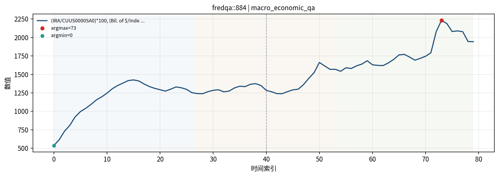

❓ QA 问题与中文翻译

**题干原文**

You are a time series analysis expert. This is a metric called Inflation-Adjusted IRA Account Balances (calculated as (IRA dollar value / Consumer Price Index, 1982-1984=100) * 100) collected from the Board of Governors of the Federal Reserve System &lt;ts&gt;&lt;ts/&gt;. The data are semiannual, spanning from January 1984 to July 2023. In 2020, the COVID-19 pandemic reduced consumer spending and led to temporary IRA tax benefits, both of which increased IRA balances. Suppose the pandemic had not occurred, and IRA balances had continued growing at the average semiannual rate observed from July 2018 to July 2019. What would the approximate IRA balance have been in January 2021, and how does this counterfactual value compare to the actual January 2021 balance?

**题干中文翻译**

你是一位时间序列分析专家。这是一个名为通胀调整后的 IRA 账户余额的指标（计算方式为（IRA 美元价值 / 消费者价格指数，1982-1984=100）* 100），数据来自联邦储备系统理事会 &lt;ts&gt;&lt;ts/&gt;。该数据为半年频率，时间范围为 1984 年 1 月至 2023 年 7 月。2020 年，COVID-19 疫情减少了消费者支出，并导致了临时性的 IRA 税收优惠，这两者都增加了 IRA 余额。假设疫情没有发生，且 IRA 余额继续按照 2018 年 7 月至 2019 年 7 月期间观察到的平均半年增长率增长，那么 2021 年 1 月的 IRA 余额大约会是多少？这一反事实值与 2021 年 1 月的实际余额相比如何？

**选项**
- A: Approximately $1,825 billion, which is about $407 billion lower than the actual value
  中文：约 1,825 十亿美元，比实际值低约 407 十亿美元
- B: Approximately $2,078 billion, which is about $154 billion lower than the actual value
  中文：约 2,0780 亿美元，比实际值低约 1540 亿美元
- C: Approximately $2,232 billion, which is equal to the actual value
  中文：约 2,232 十亿美元，等于实际值
- D: Approximately $2,639 billion, which is about $407 billion higher than the actual value
  中文：约为 2,639 十亿美元，比实际值高约 407 十亿美元

**正确答案**：`A`

**标准解释原文**

First, calculate the pre-pandemic semiannual growth rate: the IRA balance was $1,692.68 billion in July 2018 and $1,745.67 billion in July 2019, a $52.99 billion increase over 2 periods. The average semiannual growth is $52.99 / 2 = $26.50 billion. Next, extrapolate this trend from July 2019 ($1,745.67 billion) to January 2021 (3 periods later): $1,745.67 + ($26.50 * 3) = $1,825.17 billion. The actual January 2021 balance is $2,232.06 billion. The counterfactual value is ~$407 billion lower because the pandemic’s reduced spending (boosting savings) and temporary tax benefits—factors absent in the hypothetical scenario—drove faster growth than the pre-2019 trend. This confirms the counterfactual balance would be far lower than actual.

**标准解释中文翻译**

首先，计算疫情前的半年度增长率：2018年7月的 IRA 余额为 1,692.68 十亿美元，2019年7月为 1,745.67 十亿美元，在 2 个期间内增加了 52.99 十亿美元。平均半年度增长为 52.99 / 2 = 26.50 十亿美元。接下来，将这一趋势从2019年7月（1,745.67 十亿美元）外推至2021年1月（3 个期间之后）：1,745.67 + (26.50 * 3) = 1,825.17 十亿美元。2021年1月的实际余额为 2,232.06 十亿美元。反事实值低约 407 十亿美元，因为疫情导致支出减少（推高储蓄）以及临时税收优惠——这些因素在假设情景中不存在——推动了比 2019 年前趋势更快的增长。这证实了反事实余额会远低于实际余额。

📝 生成的 caption 与中文翻译

**生成 caption 样本 1 原文**

【序列 1：(IRA/CUUS0000SA0)*100, (Bil. of $/Index 1982-1984=100)*100, Semiannual】该窗口仅包含变量 (IRA/CUUS0000SA0)*100, (Bil. of $/Index 1982-1984=100)*100, Semiannual。以下主要描述 (IRA/CUUS0000SA0)*100, (Bil. of $/Index 1982-1984=100)*100, Semiannual 的变化。 整体来看，时间跨度为 1984-01-01–2023-07-01，(IRA/CUUS0000SA0)*100, (Bil. of $/Index 1982-1984=100)*100, Semiannual 首尾分别为 536.2 和 1942.9。 细分来看：在 1984-01-01–1997-01-01 期间，(IRA/CUUS0000SA0)*100, (Bil. of $/Index 1982-1984=100)*100, Semiannual 持续抬升，从 536.2 到 1252.2。 紧接着，1997-07-01–2010-01-01，保持上涨态势，由 1240.4 走到 1568.7。 之后，2010-07-01–2023-07-01，保持上涨态势，由 1569.0 走到 1942.9。 局部波动方面：几个显著高位出现在：2017-01-01≈1771.05；2020-07-01≈2232.06。 末段，(IRA/CUUS0000SA0)*100, (Bil. of $/Index 1982-1984=100)*100, Semiannual 收于 1942.92 附近，最后时刻在 [1542.32, 2232.06] 区间内波动。

**生成 caption 样本 1 中文翻译**

【序列 1：(IRA/CUUS0000SA0)*100, (Bil. of $/Index 1982-1984=100)*100, Semiannual】该窗口仅包含变量 (IRA/CUUS0000SA0)*100, (Bil. of $/Index 1982-1984=100)*100, Semiannual。以下主要描述 (IRA/CUUS0000SA0)*100, (Bil. of $/Index 1982-1984=100)*100, Semiannual 的变化。 整体来看，时间跨度为 1984-01-01–2023-07-01，(IRA/CUUS0000SA0)*100, (Bil. of $/Index 1982-1984=100)*100, Semiannual 首尾分别为 536.2 和 1942.9。 细分来看：在 1984-01-01–1997-01-01 期间，(IRA/CUUS0000SA0)*100, (Bil. of $/Index 1982-1984=100)*100, Semiannual 持续抬升，从 536.2 到 1252.2。 紧接着，1997-07-01–2010-01-01，保持上涨态势，由 1240.4 走到 1568.7。 之后，2010-07-01–2023-07-01，保持上涨态势，由 1569.0 走到 1942.9。 局部波动方面：几个显著高位出现在：2017-01-01≈1771.05；2020-07-01≈2232.06。 末段，(IRA/CUUS0000SA0)*100, (Bil. of $/Index 1982-1984=100)*100, Semiannual 收于 1942.92 附近，最后时刻在 [1542.32, 2232.06] 区间内波动。

🧪 下游 QA 模型答案 / 评分

| 输入条件 | 预测答案 | 结果 |
| --- | --- | --- |
| 当前 artifact | - | 没有完整模型答案表，仅用于定性领域推理分析 |

🔎 Case 分析

- 失败标签：反事实计算依赖指定窗口
- 关键结论：问题要用疫情前半年度增长率外推 2021 年值，并与实际值比较。普通 caption 的全局趋势描述不足以替代局部数值计算。

💵 Case 16：FREDQA | 疫情背景下的群体差异推理

##### 基本信息

| 字段 | 内容 |
| --- | --- |
| 数据集 | `FREDQA` |
| Case ID | `fredqa::971` |
| 问题类型 | `macro_economic_qa` |
| 正确答案 | `B` |

- artifact 说明：FREDQA has small n and no complete model-eval table in current artifacts; use for qualitative domain-context cases only.

数值摘要：n=1260, min=29.2, max=59.3, mean=40.79, std=8.9047, slope=0.010616, argmax=697, argmin=240

🖼 时序图

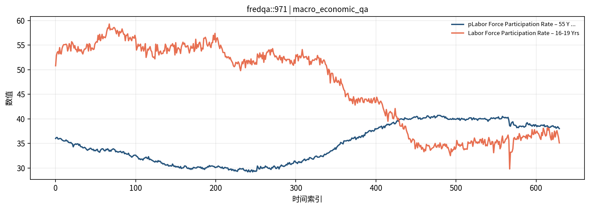

❓ QA 问题与中文翻译

**题干原文**

You are a time series analysis expert. In a labor market, there are 2 metrics: Labor Force Participation Rate – 55 Yrs. & over&lt;ts&gt;&lt;ts/&gt;; Labor Force Participation Rate – 16-19 Yrs&lt;ts&gt;&lt;ts/&gt;. The data is monthly from January 1973 to June 2025. Calculate the difference between the 55+ LFPR and 16–19 LFPR in February 2020 (pre-pandemic) and February 2023. Based on this change, which explanation aligns with the context that the COVID-19 pandemic caused excess retirements among older workers and a tight labor market that increased job opportunities for teens?

**题干中文翻译**

你是时间序列分析专家。在劳动力市场中，有 2 个指标：55 岁及以上劳动力参与率&lt;ts&gt;&lt;ts/&gt;；16–19 岁劳动力参与率&lt;ts&gt;&lt;ts/&gt;。数据为 1973 年 1 月至 2025 年 6 月的月度数据。计算 2020 年 2 月（疫情前）和 2023 年 2 月 55 岁及以上劳动力参与率与 16–19 岁劳动力参与率之间的差值。基于这一变化，哪种解释符合以下背景：COVID-19 疫情导致年长劳动者超额退休，同时劳动力市场紧张增加了青少年的就业机会？

**选项**
- A: The difference increased because 55+ LFPR rose while teen LFPR fell.
  中文：差异扩大是因为 55 岁及以上人群的 LFPR 上升，而青少年 LFPR 下降。
- B: The difference decreased because 55+ LFPR fell and teen LFPR rose.
  中文：差值缩小，因为55岁及以上人群的劳动参与率下降，而青少年劳动参与率上升。
- C: The difference stayed the same because both groups’ LFPR changed by equal amounts in opposite directions.
  中文：差异保持不变，因为两组的 LFPR 以相同幅度朝相反方向变化。
- D: The difference increased because both groups’ LFPR fell, but 55+ LFPR fell slower.
  中文：差异扩大了，因为两组的 LFPR 均下降，但 55+ 的 LFPR 下降较慢。

**正确答案**：`B`

**标准解释原文**

First, calculate the 55+ minus 16-19 LFPR difference for February 2020 and 2023. From the data, the 55+ LFPR dropped from ~40.3% (February 2020) to ~38.5% (February 2023) due to pandemic-driven excess retirements. Meanwhile, the teen LFPR rose from ~35.1% to ~36.5% as a tight labor market increased job opportunities. This reduces the difference from ~5.2 to ~2.0 percentage points. The causal context directly links the pandemic to these changes—lower 55+ participation from retirements and higher teen participation from labor demand—so the gap narrowed. Option B correctly reflects this.

**标准解释中文翻译**

首先，计算 2020 年 2 月和 2023 年 2 月 55 岁及以上与 16-19 岁 LFPR 的差值。根据数据，55 岁及以上 LFPR 从约 40.3%（2020 年 2 月）降至约 38.5%（2023 年 2 月），原因是疫情导致的超额退休。与此同时，青少年 LFPR 从约 35.1% 升至约 36.5%，因为紧张的劳动力市场增加了就业机会。这使差值从约 5.2 个百分点降至约 2.0 个百分点。因果背景直接将疫情与这些变化联系起来——退休导致 55 岁及以上人群劳动参与率下降，劳动力需求导致青少年劳动参与率上升——因此差距缩小了。选项 B 正确反映了这一点。

📝 生成的 caption 与中文翻译

**生成 caption 样本 1 原文**

【序列 1：pLabor Force Participation Rate – 55 Yrs. & over】该窗口包含 2 个变量：pLabor Force Participation Rate – 55 Yrs. & over, Labor Force Participation Rate – 16-19 Yrs。主要关注 pLabor Force Participation Rate – 55 Yrs. & over。 整体来看，时间跨度为 1973-01-01–2025-06-01，pLabor Force Participation Rate – 55 Yrs. & over 首尾分别为 36.00 和 38.00。 沿时间线展开：1973-01-01–2013-11-01，虽然整体由 36.00 到 39.90，但期间一度下探至 29.20。 之后，在 2013-11-01–2022-06-01 期间，pLabor Force Participation Rate – 55 Yrs. & over 明显下跌，从 39.90 到 38.70。 紧接着，2022-06-01–2025-06-01，跌势未减，继续下探至 38.00。 关键的局部事件包括：几个显著高位出现在：2010-05-01≈40.40；2012-06-01≈40.60；2019-07-01≈40.50。 几个显著低位出现在：1991-08-01≈29.40；1993-04-01≈29.20；1993-09-01≈29.30。 从变量联动角度看：Labor Force Participation Rate – 16-19 Yrs 与 pLabor Force Participation Rate – 55 Yrs. & over 存在一定相关性（负），但并不稳定。 临近 2025-06-01，pLabor Force Participation Rate – 55 Yrs. & over 仍在震荡，最终落在 38.00 左右。
【序列 2：Labor Force Participation Rate – 16-19 Yrs】该窗口包含 2 个变量：pLabor Force Participation Rate – 55 Yrs. & over、Labor Force Participation Rate – 16-19 Yrs。主要关注 Labor Force Participation Rate – 16-19 Yrs。 总体而言，时间跨度为 1973-01-01–2025-06-01，Labor Force Participation Rate – 16-19 Yrs 首尾分别为 50.80 和 35.10。 沿时间线展开：在 1973-01-01–1990-06-01 期间，整体趋势稳步上行，但中间曾明显反弹至 59.3。 之后，在 1990-07-01–2007-12-01 期间，Labor Force Participation Rate – 16-19 Yrs 一路走低，从 53.50 到 41.20。 紧接着，2008-01-01–2025-06-01，跌势未减，继续下探至 35.10。 局部波动方面：几个显著高位出现在：1978-06-01≈58.50；1979-02-01≈58.60；1979-09-01≈57.80。 几个显著低位出现在：2014-02-01≈32.50；2018-08-01≈33.10；2020-04-01≈29.80。 关于变量间的相关性：pLabor Force Participation Rate – 55 Yrs. & over 与 Labor Force Participation Rate – 16-19 Yrs 存在一定相关性（负），但并不稳定。 观察到明显的周期性，重复间隔约为 60 步。

**生成 caption 样本 1 中文翻译**

【序列 1：pLabor Force Participation Rate – 55 Yrs. & over】该窗口包含 2 个变量：pLabor Force Participation Rate – 55 Yrs. & over, Labor Force Participation Rate – 16-19 Yrs。主要关注 pLabor Force Participation Rate – 55 Yrs. & over。 整体来看，时间跨度为 1973-01-01–2025-06-01，pLabor Force Participation Rate – 55 Yrs. & over 首尾分别为 36.00 和 38.00。 沿时间线展开：1973-01-01–2013-11-01，虽然整体由 36.00 到 39.90，但期间一度下探至 29.20。 之后，在 2013-11-01–2022-06-01 期间，pLabor Force Participation Rate – 55 Yrs. & over 明显下跌，从 39.90 到 38.70。 紧接着，2022-06-01–2025-06-01，跌势未减，继续下探至 38.00。 关键的局部事件包括：几个显著高位出现在：2010-05-01≈40.40；2012-06-01≈40.60；2019-07-01≈40.50。 几个显著低位出现在：1991-08-01≈29.40；1993-04-01≈29.20；1993-09-01≈29.30。 从变量联动角度看：Labor Force Participation Rate – 16-19 Yrs 与 pLabor Force Participation Rate – 55 Yrs. & over 存在一定相关性（负），但并不稳定。 临近 2025-06-01，pLabor Force Participation Rate – 55 Yrs. & over 仍在震荡，最终落在 38.00 左右。
【序列 2：Labor Force Participation Rate – 16-19 Yrs】该窗口包含 2 个变量：pLabor Force Participation Rate – 55 Yrs. & over、Labor Force Participation Rate – 16-19 Yrs。主要关注 Labor Force Participation Rate – 16-19 Yrs。 总体而言，时间跨度为 1973-01-01–2025-06-01，Labor Force Participation Rate – 16-19 Yrs 首尾分别为 50.80 和 35.10。 沿时间线展开：在 1973-01-01–1990-06-01 期间，整体趋势稳步上行，但中间曾明显反弹至 59.3。 之后，在 1990-07-01–2007-12-01 期间，Labor Force Participation Rate – 16-19 Yrs 一路走低，从 53.50 到 41.20。 紧接着，2008-01-01–2025-06-01，跌势未减，继续下探至 35.10。 局部波动方面：几个显著高位出现在：1978-06-01≈58.50；1979-02-01≈58.60；1979-09-01≈57.80。 几个显著低位出现在：2014-02-01≈32.50；2018-08-01≈33.10；2020-04-01≈29.80。 关于变量间的相关性：pLabor Force Participation Rate – 55 Yrs. & over 与 Labor Force Participation Rate – 16-19 Yrs 存在一定相关性（负），但并不稳定。 观察到明显的周期性，重复间隔约为 60 步。

🧪 下游 QA 模型答案 / 评分

| 输入条件 | 预测答案 | 结果 |
| --- | --- | --- |
| 当前 artifact | - | 没有完整模型答案表，仅用于定性领域推理分析 |

🔎 Case 分析

- 失败标签：疫情背景下的群体差异推理
- 关键结论：需要比较 55+ 与青少年劳动参与率差值，并结合疫情退休和劳动力紧张背景解释方向。该能力超出纯形态 caption。

💵 Case 17：FREDQA | 同名地区比较与产业结构解释

##### 基本信息

| 字段 | 内容 |
| --- | --- |
| 数据集 | `FREDQA` |
| Case ID | `fredqa::358` |
| 问题类型 | `macro_economic_qa` |
| 正确答案 | `B` |

- artifact 说明：FREDQA has small n and no complete model-eval table in current artifacts; use for qualitative domain-context cases only.

数值摘要：n=1700, min=1.6, max=19.2, mean=5.7437, std=2.4393, slope=0.0014599, argmax=1213, argmin=954

🖼 时序图

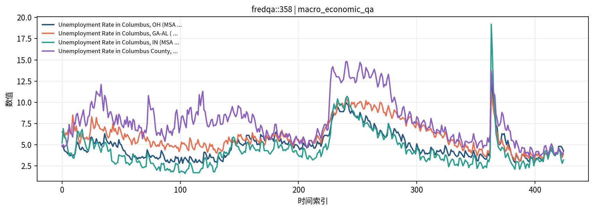

❓ QA 问题与中文翻译

**题干原文**

You are a time series analysis expert. In a Regional Unemployment system, there are 4 metrics: Unemployment Rate in Columbus, OH (MSA) in percent &lt;ts&gt;&lt;ts/&gt;; Unemployment Rate in Columbus, GA-AL (MSA) in percent &lt;ts&gt;&lt;ts/&gt;; Unemployment Rate in Columbus, IN (MSA) in percent &lt;ts&gt;&lt;ts/&gt;; Unemployment Rate in Columbus County, NC in percent &lt;ts&gt;&lt;ts/&gt;. Using monthly data from January 1990 to May 2025, compare the unemployment rates in April 2020 across these regions. Which economic characteristic best explains why one specific region experienced the highest unemployment rate during this pandemic month?

**题干中文翻译**

你是时间序列分析专家。在一个地区失业率系统中，有 4 个指标：俄亥俄州哥伦布（MSA）失业率，单位为百分比 &lt;ts&gt;&lt;ts/&gt;；佐治亚州-阿拉巴马州哥伦布（MSA）失业率，单位为百分比 &lt;ts&gt;&lt;ts/&gt;；印第安纳州哥伦布（MSA）失业率，单位为百分比 &lt;ts&gt;&lt;ts/&gt;；北卡罗来纳州哥伦布县失业率，单位为百分比 &lt;ts&gt;&lt;ts/&gt;。使用 1990 年 1 月至 2025 年 5 月的月度数据，比较这些地区在 2020 年 4 月的失业率。哪一项经济特征最能解释为什么某个特定地区在这个疫情月份经历了最高失业率？

**选项**
- A: Major city with substantial public sector employment vulnerable to operational shutdowns
  中文：拥有大量公共部门就业岗位、易受运营停摆影响的大城市
- B: Manufacturing-dependent economy lacking work-from-home capabilities
  中文：依赖制造业且缺乏居家办公能力的经济体
- C: Military-focused region with stable government employment
  中文：以军事为重点的地区，政府就业稳定
- D: Rural area with declining population limiting job diversity
  中文：人口减少的农村地区限制了工作多样性

**正确答案**：`B`

📝 生成的 caption 与中文翻译

**生成 caption 样本 1 原文**

【序列 1：Unemployment Rate in Columbus, OH (MSA)】该窗口包含 4 个变量：Unemployment Rate in Columbus, OH (MSA)、Unemployment Rate in Columbus, GA-AL (MSA)、Unemployment Rate in Columbus, IN (MSA)、Unemployment Rate in Columbus County, NC。主要关注 Unemployment Rate in Columbus, OH (MSA)（Unemployment Rate in Columbus, OH (MSA), Percent, Monthly, Not Seasonally Adjusted ）。 整体来看，Unemployment Rate in Columbus, OH (MSA) 覆盖 1990-01-01 至 2025-05-01，整体从 4.900 变动至 4.30。 沿时间线展开：1990-01-01–2007-12-01，虽然整体由 4.900 到 4.900，但期间一度下探至 2.80。 接着，在 2007-12-01–2025-05-01 期间，整体趋势震荡下行，但中间曾深跌至 2.80。 关键的局部事件包括：几个显著高位出现在：2010-01-01≈10.00；2010-06-01≈9.00；2020-04-01≈12.50。 几个显著低位出现在：1998-04-01≈2.80；1998-12-01≈2.90；1999-12-01≈2.80。 从变量联动角度看：Unemployment Rate in Columbus, GA-AL (MSA) 均与 Unemployment Rate in Columbus, OH (MSA) 呈现较强的**正相关**，走势较为同步。 此外，序列呈现约 24 个时间步的周期性律动。
【序列 2：Unemployment Rate in Columbus, GA-AL (MSA)】该窗口包含 4 个变量：Unemployment Rate in Columbus, OH (MSA)、Unemployment Rate in Columbus, GA-AL (MSA)、Unemployment Rate in Columbus, IN (MSA)、Unemployment Rate in Columbus County, NC。主要关注 Unemployment Rate in Columbus, GA-AL (MSA)（Unemployment Rate in Columbus, GA-AL (MSA), Percent, Monthly, Not Seasonally Adjusted ）。 从全局走势看，Unemployment Rate in Columbus, GA-AL (MSA) 覆盖 1990-01-01 至 2025-05-01，整体从 6.50 变动至 3.90。 沿时间线展开：在 1990-01-01–2001-10-01 期间，整体趋势震荡下行，但中间曾深跌至 4.00。 紧接着，在 2001-11-01–2013-07-01 期间，Unemployment Rate in Columbus, GA-AL (MSA) 明显上涨，从 5.500 到 8.90。 之后，2013-08-01–2025-05-01，Unemployment Rate in Columbus, GA-AL (MSA) 呈震荡下行态势，由 8.700 变至 3.900。 局部波动方面：几个显著高位出现在：2010-01-01≈10.50；2011-06-01≈10.20；2020-04-01≈11.30。 几个显著低位出现在：2021-12-01≈3.10；2022-12-01≈3.40；2024-04-01≈3.40。 关于变量间的相关性：Unemployment Rate in Columbus, OH (MSA) 和 Unemployment Rate in Columbus, GA-AL (MSA) 的变化多半同向。 此外，序列呈现约 12 个时间步的周期性律动。 末段，Unemployment Rate in Columbus, GA-AL (MSA) 收于 3.90 附近，最后时刻在 [3.00, 11.30] 区间内波动。
【序列 3：Unemployment Rate in Columbus, IN (MSA)】变量组包括 Unemployment Rate in Columbus, OH (MSA)、Unemployment Rate in Columbus, GA-AL (MSA)、Unemployment Rate in Columbus, IN (MSA)、Unemployment Rate in Columbus County, NC。下文重点描述 Unemployment Rate in Columbus, IN (MSA)（Unemployment Rate in Columbus, IN (MSA), Percent, Monthly, Not Seasonally Adjusted ），并分析其与其它变量的联动。 概括一下，Unemployment Rate in Columbus, IN (MSA) 覆盖 1990-01-01 至 2025-05-01，整体从 5.200 变动至 3.200。 细分来看：1990-01-01–2001-10-01，虽然整体由 5.20 到 4.10，但期间一度下探至 1.60。 紧接着，2001-11-01–2013-07-01，虽然整体由 4.60 到 6.000，但期间一度冲高至 10.70。 接着，在 2013-08-01–2025-05-01 期间，整体趋势震荡下行，但中间曾明显反弹至 19.20。 关键的局部事件包括：几个显著高位出现在：2009-03-01≈9.80；2010-02-01≈10.70；2020-04-01≈19.20。 几个显著低位出现在：1996-09-01≈2.00；1998-04-01≈1.70；1998-09-01≈1.60。 关于变量间的相关性：Unemployment Rate in Columbus, OH (MSA) 与 Unemployment Rate in Columbus, IN (MSA) 存在一定相关性（正），但并不稳定。
【序列 4：Unemployment Rate in Columbus County, NC】该窗口包含 4 个变量：Unemployment Rate in Columbus, OH (MSA)、Unemployment Rate in Columbus, GA-AL (MSA)、Unemployment Rate in Columbus, IN (MSA)、Unemployment Rate in Columbus County, NC。主要关注 Unemployment Rate in Columbus County, NC（Unemployment Rate in Columbus County, NC, Percent, Monthly, Not Seasonally Adjusted ）。 从全局走势看，时间跨度为 1990-01-01–2025-05-01，Unemployment Rate in Columbus County, NC 首尾分别为 4.80 和 4.200。 沿时间线展开：在 1990-01-01–2001-10-01 期间，Unemployment Rate in Columbus County, NC 明显上涨，从 4.800 到 8.20。 接着，2001-11-01–2013-07-01，虽然整体由 8.500 到 10.1，但期间一度下探至 4.600。 随后，2013-08-01–2025-05-01，Unemployment Rate in Columbus County, NC 呈震荡下行态势，由 9.40 变至 4.200。 值得注意的极值点有：几个显著高位出现在：2009-02-01≈14.20；2011-01-01≈14.70；2011-06-01≈14.10。 几个显著低位出现在：2023-04-01≈3.50；2023-09-01≈3.70；2025-04-01≈3.80。 关于变量间的相关性：Unemployment Rate in Columbus, GA-AL (MSA) 与 Unemployment Rate in Columbus County, NC 存在一定相关性（正），但并不稳定。 此外，未观察到明显的周期性规律。

**生成 caption 样本 1 中文翻译**

【序列 1：Unemployment Rate in Columbus, OH (MSA)】该窗口包含 4 个变量：Unemployment Rate in Columbus, OH (MSA)、Unemployment Rate in Columbus, GA-AL (MSA)、Unemployment Rate in Columbus, IN (MSA)、Unemployment Rate in Columbus County, NC。主要关注 Unemployment Rate in Columbus, OH (MSA)（Unemployment Rate in Columbus, OH (MSA), Percent, Monthly, Not Seasonally Adjusted ）。 整体来看，Unemployment Rate in Columbus, OH (MSA) 覆盖 1990-01-01 至 2025-05-01，整体从 4.900 变动至 4.30。 沿时间线展开：1990-01-01–2007-12-01，虽然整体由 4.900 到 4.900，但期间一度下探至 2.80。 接着，在 2007-12-01–2025-05-01 期间，整体趋势震荡下行，但中间曾深跌至 2.80。 关键的局部事件包括：几个显著高位出现在：2010-01-01≈10.00；2010-06-01≈9.00；2020-04-01≈12.50。 几个显著低位出现在：1998-04-01≈2.80；1998-12-01≈2.90；1999-12-01≈2.80。 从变量联动角度看：Unemployment Rate in Columbus, GA-AL (MSA) 均与 Unemployment Rate in Columbus, OH (MSA) 呈现较强的**正相关**，走势较为同步。 此外，序列呈现约 24 个时间步的周期性律动。
【序列 2：Unemployment Rate in Columbus, GA-AL (MSA)】该窗口包含 4 个变量：Unemployment Rate in Columbus, OH (MSA)、Unemployment Rate in Columbus, GA-AL (MSA)、Unemployment Rate in Columbus, IN (MSA)、Unemployment Rate in Columbus County, NC。主要关注 Unemployment Rate in Columbus, GA-AL (MSA)（Unemployment Rate in Columbus, GA-AL (MSA), Percent, Monthly, Not Seasonally Adjusted ）。 从全局走势看，Unemployment Rate in Columbus, GA-AL (MSA) 覆盖 1990-01-01 至 2025-05-01，整体从 6.50 变动至 3.90。 沿时间线展开：在 1990-01-01–2001-10-01 期间，整体趋势震荡下行，但中间曾深跌至 4.00。 紧接着，在 2001-11-01–2013-07-01 期间，Unemployment Rate in Columbus, GA-AL (MSA) 明显上涨，从 5.500 到 8.90。 之后，2013-08-01–2025-05-01，Unemployment Rate in Columbus, GA-AL (MSA) 呈震荡下行态势，由 8.700 变至 3.900。 局部波动方面：几个显著高位出现在：2010-01-01≈10.50；2011-06-01≈10.20；2020-04-01≈11.30。 几个显著低位出现在：2021-12-01≈3.10；2022-12-01≈3.40；2024-04-01≈3.40。 关于变量间的相关性：Unemployment Rate in Columbus, OH (MSA) 和 Unemployment Rate in Columbus, GA-AL (MSA) 的变化多半同向。 此外，序列呈现约 12 个时间步的周期性律动。 末段，Unemployment Rate in Columbus, GA-AL (MSA) 收于 3.90 附近，最后时刻在 [3.00, 11.30] 区间内波动。
【序列 3：Unemployment Rate in Columbus, IN (MSA)】变量组包括 Unemployment Rate in Columbus, OH (MSA)、Unemployment Rate in Columbus, GA-AL (MSA)、Unemployment Rate in Columbus, IN (MSA)、Unemployment Rate in Columbus County, NC。下文重点描述 Unemployment Rate in Columbus, IN (MSA)（Unemployment Rate in Columbus, IN (MSA), Percent, Monthly, Not Seasonally Adjusted ），并分析其与其它变量的联动。 概括一下，Unemployment Rate in Columbus, IN (MSA) 覆盖 1990-01-01 至 2025-05-01，整体从 5.200 变动至 3.200。 细分来看：1990-01-01–2001-10-01，虽然整体由 5.20 到 4.10，但期间一度下探至 1.60。 紧接着，2001-11-01–2013-07-01，虽然整体由 4.60 到 6.000，但期间一度冲高至 10.70。 接着，在 2013-08-01–2025-05-01 期间，整体趋势震荡下行，但中间曾明显反弹至 19.20。 关键的局部事件包括：几个显著高位出现在：2009-03-01≈9.80；2010-02-01≈10.70；2020-04-01≈19.20。 几个显著低位出现在：1996-09-01≈2.00；1998-04-01≈1.70；1998-09-01≈1.60。 关于变量间的相关性：Unemployment Rate in Columbus, OH (MSA) 与 Unemployment Rate in Columbus, IN (MSA) 存在一定相关性（正），但并不稳定。
【序列 4：Unemployment Rate in Columbus County, NC】该窗口包含 4 个变量：Unemployment Rate in Columbus, OH (MSA)、Unemployment Rate in Columbus, GA-AL (MSA)、Unemployment Rate in Columbus, IN (MSA)、Unemployment Rate in Columbus County, NC。主要关注 Unemployment Rate in Columbus County, NC（Unemployment Rate in Columbus County, NC, Percent, Monthly, Not Seasonally Adjusted ）。 从全局走势看，时间跨度为 1990-01-01–2025-05-01，Unemployment Rate in Columbus County, NC 首尾分别为 4.80 和 4.200。 沿时间线展开：在 1990-01-01–2001-10-01 期间，Unemployment Rate in Columbus County, NC 明显上涨，从 4.800 到 8.20。 接着，2001-11-01–2013-07-01，虽然整体由 8.500 到 10.1，但期间一度下探至 4.600。 随后，2013-08-01–2025-05-01，Unemployment Rate in Columbus County, NC 呈震荡下行态势，由 9.40 变至 4.200。 值得注意的极值点有：几个显著高位出现在：2009-02-01≈14.20；2011-01-01≈14.70；2011-06-01≈14.10。 几个显著低位出现在：2023-04-01≈3.50；2023-09-01≈3.70；2025-04-01≈3.80。 关于变量间的相关性：Unemployment Rate in Columbus, GA-AL (MSA) 与 Unemployment Rate in Columbus County, NC 存在一定相关性（正），但并不稳定。 此外，未观察到明显的周期性规律。

🧪 下游 QA 模型答案 / 评分

| 输入条件 | 预测答案 | 结果 |
| --- | --- | --- |
| 当前 artifact | - | 没有完整模型答案表，仅用于定性领域推理分析 |

🔎 Case 分析

- 失败标签：同名地区比较与产业结构解释
- 关键结论：问题要求在多个 Columbus 地区中找 2020 年 4 月最高失业率，并用制造业依赖解释。caption 的相关性/趋势描述无法保证选对地区和原因。

💵 Case 18：FREDQA | 劳动市场净变化需要公式化计算

##### 基本信息

| 字段 | 内容 |
| --- | --- |
| 数据集 | `FREDQA` |
| Case ID | `fredqa::1293` |
| 问题类型 | `macro_economic_qa` |
| 正确答案 | `B` |

- artifact 说明：FREDQA has small n and no complete model-eval table in current artifacts; use for qualitative domain-context cases only.

数值摘要：n=336, min=-6938, max=6192, mean=22.923, std=4811.6, slope=-42.28, argmax=66, argmin=169

🖼 时序图

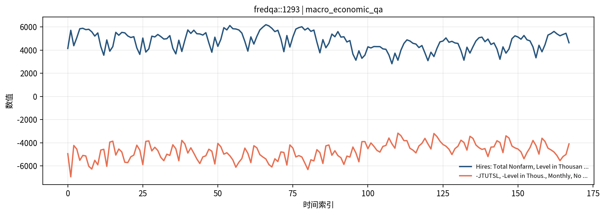

❓ QA 问题与中文翻译

**题干原文**

You are a time series analysis expert. In the U.S. labor market, there are 2 metrics: Hires: Total Nonfarm, Level in Thousands, Monthly, Not Seasonally Adjusted &lt;ts&gt;&lt;ts/&gt;; Job Separations: Total Nonfarm, Level in Thousands (reported as negative values), Monthly, Not Seasonally Adjusted &lt;ts&gt;&lt;ts/&gt;. Monthly net job creation is calculated as hires plus job separations (since separations represent job losses). The Great Recession began in December 2007 and persisted through mid-2009. Using monthly data from December 2000 to November 2014, what causal inference about the recession’s effect on the labor market is supported by comparing hires, separations, and net job creation in December 2007 versus December 2008?

**题干中文翻译**

你是时间序列分析专家。在美国劳动力市场中，有 2 个指标：招聘人数：非农总计，水平值（千人），月度，未经季节性调整 &lt;ts&gt;&lt;ts/&gt;；离职人数：非农总计，水平值（千人）（报告为负值），月度，未经季节性调整 &lt;ts&gt;&lt;ts/&gt;。月度净就业创造计算为招聘人数加上离职人数（因为离职代表就业损失）。大衰退始于 2007 年 12 月，并持续到 2009 年年中。使用 2000 年 12 月至 2014 年 11 月的月度数据，通过比较 2007 年 12 月与 2008 年 12 月的招聘人数、离职人数和净就业创造，关于衰退对劳动力市场影响的什么因果推断得到了支持？

**选项**
- A: The recession reduced hires more than separations, leading to a larger net job loss in December 2008 compared to December 2007.
  中文：与 2007 年 12 月相比，经济衰退导致 2008 年 12 月的招聘减少幅度大于离职减少幅度，从而造成更大的净岗位流失。
- B: The recession reduced separations more than hires, leading to a smaller net job loss in December 2008 compared to December 2007.
  中文：经济衰退使离职人数的减少幅度大于雇佣人数的减少幅度，导致 2008 年 12 月的净就业岗位流失小于 2007 年 12 月。
- C: The recession increased both hires and separations equally, resulting in no change in net job creation between the two months.
  中文：经济衰退使招聘人数和离职人数同等增加，导致这两个月之间的净就业创造没有变化。
- D: The recession increased separations while reducing hires, leading to a larger net job loss in December 2008 compared to December 2007.
  中文：经济衰退增加了离职人数，同时减少了招聘人数，导致 2008 年 12 月的净岗位流失量大于 2007 年 12 月。

**正确答案**：`B`

**标准解释原文**

First, calculate values for the two months: December 2007 (pre-recession) had 3,765 thousand hires, -4,847 thousand separations (absolute value 4,847), and net job creation of 3,765 + (-4,847) = -1,082 thousand (a loss). December 2008 (during the recession) had 3,126 thousand hires, -4,087 thousand separations (absolute value 4,087), and net job creation of 3,126 + (-4,087) = -961 thousand (a smaller loss). The recession reduced hires by 639 thousand (3,765 → 3,126) and separations (absolute) by 760 thousand (4,847 → 4,087). Since separations decreased more than hires, the net loss shrank. This supports the causal inference that the recession’s impact on reducing job losses (separations) outweighed its impact on reducing job gains (hires), leading to a smaller net loss.

**标准解释中文翻译**

首先，计算这两个月的数值：2007年12月（衰退前）有 3,765 千人被雇用，-4,847 千人离职（绝对值为 4,847），净就业创造为 3,765 + (-4,847) = -1,082 千人（损失）。2008年12月（衰退期间）有 3,126 千人被雇用，-4,087 千人离职（绝对值为 4,087），净就业创造为 3,126 + (-4,087) = -961 千人（较小的损失）。衰退使雇用人数减少了 639 千人（3,765 → 3,126），使离职人数（绝对值）减少了 760 千人（4,847 → 4,087）。由于离职人数的减少幅度大于雇用人数，净损失缩小了。这支持了以下因果推断：衰退对减少就业损失（离职）的影响超过了其对减少就业增长（雇用）的影响，从而导致较小的净损失。

📝 生成的 caption 与中文翻译

**生成 caption 样本 1 原文**

【序列 1：Hires: Total Nonfarm, Level in Thousands】该窗口包含 2 个变量：Hires: Total Nonfarm, Level in Thousands、-JTUTSL, -Level in Thous.。主要关注 Hires: Total Nonfarm, Level in Thousands（Hires: Total Nonfarm, Level in Thousands, Monthly, Not Seasonally Adjusted ）。 整体来看，时间跨度为 2000-12-01–2014-11-01，Hires: Total Nonfarm, Level in Thousands 首尾分别为 4141 和 4634。 细分来看：在 2000-12-01–2005-07-01 期间，Hires: Total Nonfarm, Level in Thousands 明显上涨，从 4141 到 5845。 接着，2005-08-01–2010-03-01，Hires: Total Nonfarm, Level in Thousands 呈明显下跌态势，由 5823 变至 3993。 随后，在 2010-04-01–2014-11-01 期间，整体趋势持续抬升，但中间曾深跌至 3087。 值得注意的极值点有：几个显著高位出现在：2005-04-01≈5935；2006-06-01≈6192；2007-06-01≈6016。 几个显著低位出现在：2008-12-01≈3126；2009-12-01≈2822；2010-12-01≈3087。 从变量联动角度看：-JTUTSL, -Level in Thous. 与 Hires: Total Nonfarm, Level in Thousands 呈现**负相关**，往往此消彼长。 观察到明显的周期性，重复间隔约为 12 步。
【序列 2：-JTUTSL, -Level in Thous.】该窗口包含 2 个变量：Hires: Total Nonfarm, Level in Thousands、-JTUTSL, -Level in Thous.。主要关注 -JTUTSL, -Level in Thous.（-JTUTSL, -Level in Thous., Monthly, Not Seasonally Adjusted ）。 概括一下，时间跨度为 2000-12-01–2014-11-01，-JTUTSL, -Level in Thous. 首尾分别为 -4939 和 -4097。 分阶段来看：在 2000-12-01–2005-07-01 期间，整体趋势一路走低，但中间曾深跌至 -6938。 随后，在 2005-08-01–2010-03-01 期间，-JTUTSL, -Level in Thous. 震荡走高，从 -6109 到 -3387。 随后，2010-04-01–2014-11-01，虽然整体由 -3815 到 -4097，但期间一度下探至 -5547。 值得注意的极值点有：几个显著高位出现在：2009-11-01≈-3588；2010-11-01≈-3617；2011-11-01≈-3778。 几个显著低位出现在：2001-01-01≈-6938；2001-08-01≈-6264；2007-08-01≈-6313。 从变量联动角度看：Hires: Total Nonfarm, Level in Thousands 与 -JTUTSL, -Level in Thous. 呈现**负相关**，往往此消彼长。 此外，序列呈现约 12 个时间步的周期性律动。 末段，-JTUTSL, -Level in Thous. 收于 -4097 附近，最后时刻在 [-5547, -3200] 区间内波动。

**生成 caption 样本 1 中文翻译**

【序列 1：Hires: Total Nonfarm, Level in Thousands】该窗口包含 2 个变量：Hires: Total Nonfarm, Level in Thousands、-JTUTSL, -Level in Thous.。主要关注 Hires: Total Nonfarm, Level in Thousands（Hires: Total Nonfarm, Level in Thousands, Monthly, Not Seasonally Adjusted ）。 整体来看，时间跨度为 2000-12-01–2014-11-01，Hires: Total Nonfarm, Level in Thousands 首尾分别为 4141 和 4634。 细分来看：在 2000-12-01–2005-07-01 期间，Hires: Total Nonfarm, Level in Thousands 明显上涨，从 4141 到 5845。 接着，2005-08-01–2010-03-01，Hires: Total Nonfarm, Level in Thousands 呈明显下跌态势，由 5823 变至 3993。 随后，在 2010-04-01–2014-11-01 期间，整体趋势持续抬升，但中间曾深跌至 3087。 值得注意的极值点有：几个显著高位出现在：2005-04-01≈5935；2006-06-01≈6192；2007-06-01≈6016。 几个显著低位出现在：2008-12-01≈3126；2009-12-01≈2822；2010-12-01≈3087。 从变量联动角度看：-JTUTSL, -Level in Thous. 与 Hires: Total Nonfarm, Level in Thousands 呈现**负相关**，往往此消彼长。 观察到明显的周期性，重复间隔约为 12 步。
【序列 2：-JTUTSL, -Level in Thous.】该窗口包含 2 个变量：Hires: Total Nonfarm, Level in Thousands、-JTUTSL, -Level in Thous.。主要关注 -JTUTSL, -Level in Thous.（-JTUTSL, -Level in Thous., Monthly, Not Seasonally Adjusted ）。 概括一下，时间跨度为 2000-12-01–2014-11-01，-JTUTSL, -Level in Thous. 首尾分别为 -4939 和 -4097。 分阶段来看：在 2000-12-01–2005-07-01 期间，整体趋势一路走低，但中间曾深跌至 -6938。 随后，在 2005-08-01–2010-03-01 期间，-JTUTSL, -Level in Thous. 震荡走高，从 -6109 到 -3387。 随后，2010-04-01–2014-11-01，虽然整体由 -3815 到 -4097，但期间一度下探至 -5547。 值得注意的极值点有：几个显著高位出现在：2009-11-01≈-3588；2010-11-01≈-3617；2011-11-01≈-3778。 几个显著低位出现在：2001-01-01≈-6938；2001-08-01≈-6264；2007-08-01≈-6313。 从变量联动角度看：Hires: Total Nonfarm, Level in Thousands 与 -JTUTSL, -Level in Thous. 呈现**负相关**，往往此消彼长。 此外，序列呈现约 12 个时间步的周期性律动。 末段，-JTUTSL, -Level in Thous. 收于 -4097 附近，最后时刻在 [-5547, -3200] 区间内波动。

🧪 下游 QA 模型答案 / 评分

| 输入条件 | 预测答案 | 结果 |
| --- | --- | --- |
| 当前 artifact | - | 没有完整模型答案表，仅用于定性领域推理分析 |

🔎 Case 分析

- 失败标签：劳动市场净变化需要公式化计算
- 关键结论：hires 与 separations 要按符号相加得到净岗位变化。caption 若只描述趋势，很容易漏掉 separations 负值和净变化公式。

#### D. 混合 QA 与模型差异：TSAQA / TimeSeriesExam

🧪 Case 19：TSAQA | TSAQA 分类：caption 与 numbers 都不够，tool-agent 对

##### 基本信息

| 字段 | 内容 |
| --- | --- |
| 数据集 | `TSAQA` |
| Case ID | `tsaqa::0003` |
| 问题类型 | `classification` |
| 领域 / 子数据集 | `synthetic` / `-` |
| 正确答案 | `D` |

- artifact 说明：TSAQA 此 case 已按 full-eval task 顺序和 local index 回连 phase_a 原始题干/序列；当前本地没有保存 OpenTSLM/ChatTS 原始 caption 对照文本，因此此处展示可用 SFT caption 样本和多条件答案。

数值摘要：n=128, min=-1.5334, max=1.5422, mean=-7.8125e-06, std=1, slope=0.0026186, argmax=45, argmin=34

🖼 时序图

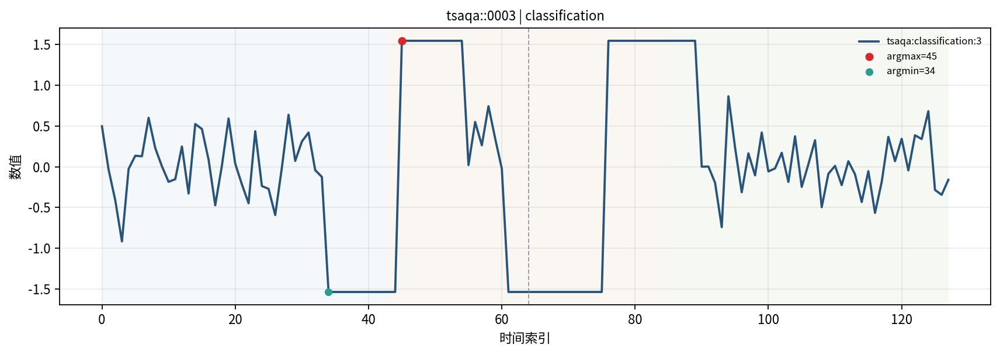

❓ QA 问题与中文翻译

**题干原文**

Classify the given time series into one of the categories below.
Respond ONLY with the letter of the correct choice (A, B, C, D).

Choices:
A: down-down (1306 cases)
B: up-down (1248 cases)
C: down-up (1245 cases)
D: up-up (1201 cases)

**题干中文翻译**

将给定时间序列分类到以下类别之一。
只回复正确选项的字母（A、B、C、D）。

选项：
A：下降-下降（1306 个案例）
B：上升-下降（1248 个案例）
C：下降-上升（1245 个案例）
D：上升-上升（1201 个案例）

**背景信息原文**

This time series comes from a dataset designed to simulate and classify sequences based on distinct upward and downward movement patterns, with each series labeled according to one of four directional classes reflecting different combinations of up and down changes.

**背景信息中文翻译**

该时间序列来自一个数据集，该数据集旨在基于不同的向上和向下运动模式来模拟和分类序列，每个序列都根据四种方向类别之一进行标记，这些类别反映了上升和下降变化的不同组合。

**选项**
无固定选项；题目要求按指定格式直接生成答案。

**正确答案**：`D`

📝 生成的 caption 与中文翻译

**可用 caption 样本 原文**

1. Noisy with std around 0.29.
2. No periodic fluctuations observed, showing no periodic fluctuation.
3. Decrease from 0.64 to -0.38.
4. Starting from point 34, the time series value rises from around 0.14 to around 1.38, forms an upward convex with an amplitude of about 1.74, and then falls back to around -0.58, forming a upward convex.

**可用 caption 样本 中文翻译**

1. 带噪声，标准差约为 0.29。
2. 未观察到周期性波动，表现为无周期性波动。
3. 从 0.64 下降到 -0.38。
4. 从点 34 开始，时间序列值从约 0.14 上升到约 1.38，形成一个振幅约为 1.74 的上凸形态，然后回落到约 -0.58，形成一个上凸形态。

🧪 下游 QA 模型答案 / 评分

| 输入条件 | 预测答案 | 结果 |
| --- | --- | --- |
| `meta_only` | `C` | 错误 |
| `numbers` | `C` | 错误 |
| `opentslm_caption` | `B` | 错误 |
| `opentslm_caption_plus` | `B` | 错误 |
| `chatts_caption` | `B` | 错误 |
| `chatts_caption_plus` | `C` | 错误 |
| `tool_agent` | `D` | 正确 |

🔎 Case 分析

- 失败标签：TSAQA 分类：caption 与 numbers 都不够，tool-agent 对
- 关键结论：该 case 中两个 caption 条件和 numbers 都错，tool-agent 对，说明需要结构化工具提取方向组合，而不是只靠自然语言摘要。

🧪 Case 20：TSAQA | caption+numbers 弱于 caption / meta

##### 基本信息

| 字段 | 内容 |
| --- | --- |
| 数据集 | `TSAQA` |
| Case ID | `tsaqa::0004` |
| 问题类型 | `classification` |
| 领域 / 子数据集 | `synthetic` / `-` |
| 正确答案 | `B` |

- artifact 说明：TSAQA 此 case 已按 full-eval task 顺序和 local index 回连 phase_a 原始题干/序列；当前本地没有保存 OpenTSLM/ChatTS 原始 caption 对照文本，因此此处展示可用 SFT caption 样本和多条件答案。

数值摘要：n=128, min=-1.4575, max=1.429, mean=-1.5625e-06, std=1, slope=9.9218e-05, argmax=43, argmin=28

🖼 时序图

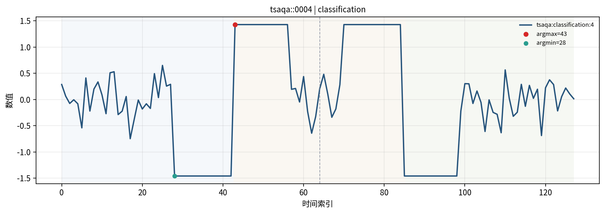

❓ QA 问题与中文翻译

**题干原文**

Classify the given time series into one of the categories below.
Respond ONLY with the letter of the correct choice (A, B, C, D).

Choices:
A: down-down (1306 cases)
B: up-down (1248 cases)
C: down-up (1245 cases)
D: up-up (1201 cases)

**题干中文翻译**

将给定时间序列分类到以下类别之一。
仅回复正确选项的字母（A、B、C、D）。

选项：
A: 下降-下降（1306 个案例）
B: 上升-下降（1248 个案例）
C: 下降-上升（1245 个案例）
D: 上升-上升（1201 个案例）

**背景信息原文**

This time series comes from a dataset designed to simulate and classify sequences based on distinct upward and downward movement patterns, with each series labeled according to one of four directional classes reflecting different combinations of up and down changes.

**背景信息中文翻译**

该时间序列来自一个数据集，该数据集旨在根据不同的上升和下降运动模式来模拟并分类序列，每个序列都根据四种方向类别之一进行标注，这些类别反映了上升和下降变化的不同组合。

**选项**
无固定选项；题目要求按指定格式直接生成答案。

**正确答案**：`B`

📝 生成的 caption 与中文翻译

**可用 caption 样本 原文**

1. Noisy with std around 0.20.
  2. No periodic fluctuations observed, showing no periodic fluctuation.
  3. Decrease from 0.29 to 0.01.
  4. Starting from point 28, the time series value falls from around 0.78 to around -1.48, forms a downward convex with an amplitude of about 0.92, and then rises back to around 0.27, forming a downward convex;starting from point 64, the time series value slowly rises, reaching a peak at point 80, followed by a rapid decline between point 80 and point 82 back to around -0.78, forming a slow rise followed by rapid decline.

**可用 caption 样本 中文翻译**

1. 噪声较大，标准差约为 0.20。
  2. 未观察到周期性波动，显示无周期性波动。
  3. 从 0.29 下降到 0.01。
  4. 从点 28 开始，时间序列值从约 0.78 下降到约 -1.48，形成一个幅度约为 0.92 的向下凸起，然后回升到约 0.27，形成向下凸起；从点 64 开始，时间序列值缓慢上升，在点 80 达到峰值，随后在点 80 到点 82 之间快速下降，回到约 -0.78，形成先缓慢上升后快速下降的形态。

🧪 下游 QA 模型答案 / 评分

| 输入条件 | 预测答案 | 结果 |
| --- | --- | --- |
| `meta_only` | `B` | 正确 |
| `numbers` | `C` | 错误 |
| `opentslm_caption` | `B` | 正确 |
| `opentslm_caption_plus` | `A` | 错误 |
| `chatts_caption` | `A` | 错误 |
| `chatts_caption_plus` | `A` | 错误 |
| `tool_agent` | `B` | 正确 |

🔎 Case 分析

- 失败标签：caption+numbers 弱于 caption / meta
- 关键结论：OpenTSLM caption 单独正确，但 caption+numbers 错，显示混合输入可能让模型重新解释证据，造成集成失败。

🧪 Case 21：TSAQA | OpenTSLM 错、ChatTS 对的混合 QA

##### 基本信息

| 字段 | 内容 |
| --- | --- |
| 数据集 | `TSAQA` |
| Case ID | `tsaqa::0006` |
| 问题类型 | `classification` |
| 领域 / 子数据集 | `healthcare` / `-` |
| 正确答案 | `B` |

- artifact 说明：TSAQA 此 case 已按 full-eval task 顺序和 local index 回连 phase_a 原始题干/序列；当前本地没有保存 OpenTSLM/ChatTS 原始 caption 对照文本，因此此处展示可用 SFT caption 样本和多条件答案。

数值摘要：n=80, min=-1.0853, max=1.5287, mean=-6.25e-06, std=1, slope=-0.029443, argmax=13, argmin=50

🖼 时序图

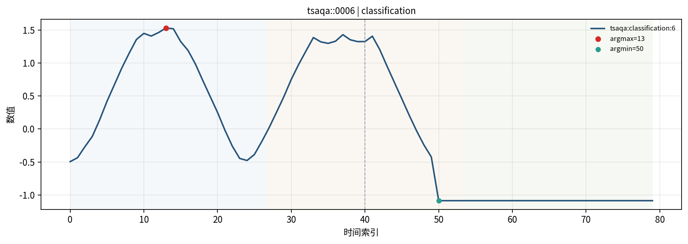

❓ QA 问题与中文翻译

**题干原文**

Classify the given time series into one of the categories below.
Respond ONLY with the letter of the correct choice (A, B).

Choices:
A: correct
B: incorrect

**题干中文翻译**

将给定时间序列分类到以下类别之一。
仅回复正确选项的字母（A、B）。

选项：
A：正确
B：不正确

**背景信息原文**

This time series comes from a dataset capturing hand and finger bone outlines extracted from medical images to support classification and prediction tasks related to bone outline detection accuracy, subject age group estimation, and Tanner-Whitehouse developmental scoring for pediatric bone age assessment.

**背景信息中文翻译**

该时间序列来自一个数据集，该数据集捕获从医学图像中提取的手部和手指骨骼轮廓，用于支持与骨骼轮廓检测准确性、受试者年龄组估计以及用于儿科骨龄评估的 Tanner-Whitehouse 发育评分相关的分类和预测任务。

**选项**
无固定选项；题目要求按指定格式直接生成答案。

**正确答案**：`B`

📝 生成的 caption 与中文翻译

**可用 caption 样本 原文**

The time series has almost no noise. It exhibits square periodic fluctuations with each period lasting approximately 25.1 points and having an amplitude of 1.6. The overall trend is decreasing, starting at -0.49 and ending at -1.09, with an overall amplitude of -0.60. No local characteristics were found beyond the described periodicity and trend.

**可用 caption 样本 中文翻译**

该时间序列几乎没有噪声。它呈现方形周期性波动，每个周期大约持续 25.1 个点，振幅为 1.6。整体趋势呈下降，从 -0.49 开始，到 -1.09 结束，整体幅度为 -0.60。除上述周期性和趋势外，未发现局部特征。

🧪 下游 QA 模型答案 / 评分

| 输入条件 | 预测答案 | 结果 |
| --- | --- | --- |
| `meta_only` | `A` | 错误 |
| `numbers` | `B` | 正确 |
| `opentslm_caption` | `A` | 错误 |
| `opentslm_caption_plus` | `B` | 正确 |
| `chatts_caption` | `B` | 正确 |
| `chatts_caption_plus` | `A` | 错误 |
| `tool_agent` | `B` | 正确 |

🔎 Case 分析

- 失败标签：OpenTSLM 错、ChatTS 对的混合 QA
- 关键结论：医疗骨轮廓分类问题中，ChatTS caption 与 numbers 能答对，OpenTSLM caption 答错；说明 caption 质量差异会直接转化为分类失败。

🧪 Case 22：TSAQA | TSAQA comparison：OpenTSLM 错、ChatTS 对

##### 基本信息

| 字段 | 内容 |
| --- | --- |
| 数据集 | `TSAQA` |
| Case ID | `tsaqa::0665` |
| 问题类型 | `comparison` |
| 领域 / 子数据集 | `["healthcare", "healthcare"]` / `-` |
| 正确答案 | `F` |

- artifact 说明：TSAQA 此 case 已按 full-eval task 顺序和 local index 回连 phase_a 原始题干/序列；当前本地没有保存 OpenTSLM/ChatTS 原始 caption 对照文本，因此此处展示可用 SFT caption 样本和多条件答案。

数值摘要：n=410, min=-2.1711, max=2.4555, mean=-2.1951e-06, std=0.99999, slope=7.1544e-05, argmax=54, argmin=267

🖼 时序图

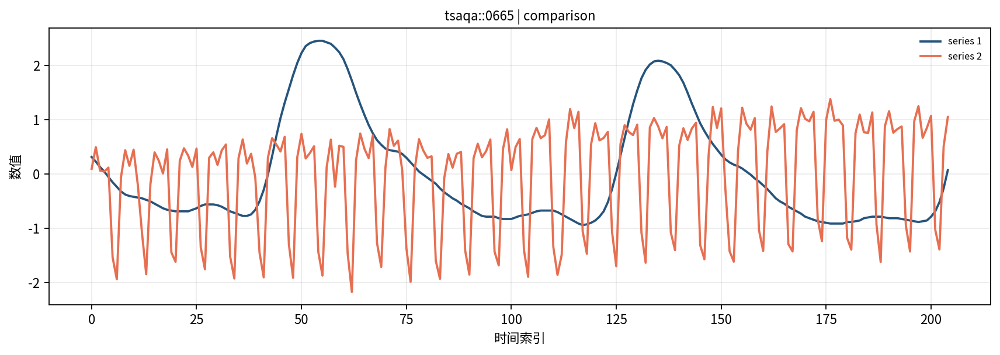

❓ QA 问题与中文翻译

**题干原文**

Does time series 1 have greater variability, measured by coefficient of variation, than time series 2, while both series show some level of persistence in short-term autocorrelations and frequent cyclic peaks and troughs?
Respond ONLY with the letter of the correct choice (T or F).

Choices:
T: True.
F: False.

**题干中文翻译**

时间序列 1 的变异性（以变异系数衡量）是否大于时间序列 2，同时两个序列在短期自相关中都表现出一定程度的持续性，并且频繁出现周期性峰值和谷值？
仅用正确选项的字母（T 或 F）作答。

选项：
T：正确。
F：错误。

**背景信息原文**

["A numerical sequence of heart rate measurements (beats per minute) derived from sliding 32-second windows of photoplethysmogram (PPG) and electrocardiogram (ECG) signals, where each value reflects the estimated heart rate over its respective window.", "A time series of daily birth counts in the United States."]

**背景信息中文翻译**

["由光电容积脉搏波（PPG）和心电图（ECG）信号的滑动 32 秒窗口得出的心率测量数值序列（每分钟心跳次数），其中每个值反映其对应窗口内的估计心率。", "美国每日出生人数的时间序列。"]

**选项**
无固定选项；题目要求按指定格式直接生成答案。

**正确答案**：`F`

📝 生成的 caption 与中文翻译

**可用 caption 样本 原文**

1. Noisy with std around 0.52.
2. The time series is showing sin periodic fluctuation: the amplitude of the periodic fluctuation is 2.5 between point 0 and point 410. Each fluctuation period is approximately 79.3 points, thus the overall fluctuation is low frequency.
3. Keep steady from 0.31 to 1.05.
4. No local characteristics found.

**可用 caption 样本 中文翻译**

1. 噪声较大，标准差约为 0.52。
2. 该时间序列表现出正弦周期性波动：在点 0 到点 410 之间，周期性波动的振幅为 2.5。每个波动周期约为 79.3 个点，因此整体波动为低频。
3. 从 0.31 到 1.05 保持稳定。
4. 未发现局部特征。

🧪 下游 QA 模型答案 / 评分

| 输入条件 | 预测答案 | 结果 |
| --- | --- | --- |
| `meta_only` | `F` | 正确 |
| `numbers` | `F` | 正确 |
| `opentslm_caption` | `T` | 错误 |
| `opentslm_caption_plus` | `F` | 正确 |
| `chatts_caption` | `F` | 正确 |
| `chatts_caption_plus` | `F` | 正确 |
| `tool_agent` | `F` | 正确 |

🔎 Case 分析

- 失败标签：TSAQA comparison：OpenTSLM 错、ChatTS 对
- 关键结论：该题比较两个医疗时间序列的变异系数和自相关/周期峰谷。OpenTSLM caption 条件答错，ChatTS 和 numbers 答对，说明多序列比较需要保留跨序列相对量，而不是只描述单条序列。

🧪 Case 23：TSAQA | TSAQA comparison：两个 caption 都错，numbers/tool 对

##### 基本信息

| 字段 | 内容 |
| --- | --- |
| 数据集 | `TSAQA` |
| Case ID | `tsaqa::0677` |
| 问题类型 | `comparison` |
| 领域 / 子数据集 | `["web", "web"]` / `-` |
| 正确答案 | `B` |

- artifact 说明：TSAQA 此 case 已按 full-eval task 顺序和 local index 回连 phase_a 原始题干/序列；当前本地没有保存 OpenTSLM/ChatTS 原始 caption 对照文本，因此此处展示可用 SFT caption 样本和多条件答案。

数值摘要：n=406, min=-1.8571, max=7.6106, mean=2.4631e-06, std=1, slope=0.00012909, argmax=318, argmin=168

🖼 时序图

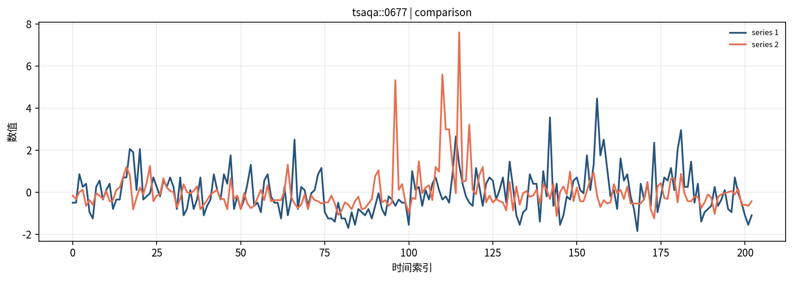

❓ QA 问题与中文翻译

**题干原文**

Which time series exhibits a stronger positive local trend based on visible upward spikes in the data?
Respond ONLY with the letter of the correct choice (A, B, C, or D).

Choices:
A: Time Series 1
B: Time Series 2
C: Both exhibit equal strength
D: Neither exhibits a positive local trend

**题干中文翻译**

哪条时间序列基于数据中可见的向上尖峰表现出更强的正向局部趋势？
请仅用正确选项的字母作答（A、B、C 或 D）。

选项：
A：时间序列 1
B：时间序列 2
C：两者表现出相同强度
D：两者都没有表现出正向局部趋势

**背景信息原文**

["A time series of daily page\u2010view counts for a single English Wikipedia article.", "A time series of daily page\u2010view counts for a single English Wikipedia article."]

**背景信息中文翻译**

["单篇英文维基百科文章每日页面浏览次数的时间序列。", "单篇英文维基百科文章每日页面浏览次数的时间序列。"]

**选项**
无固定选项；题目要求按指定格式直接生成答案。

**正确答案**：`B`

📝 生成的 caption 与中文翻译

**可用 caption 样本 原文**

1. Noisy with std around 0.62.
2. No periodic fluctuations observed, showing no periodic fluctuation.
3. Keep steady from -0.50 to -0.50.
4. At point 152 and point 155 and point 159, there were 3 consecutive upward spikes with amplitudes ranging from 2.39 to 3.04, with the time series value repeatedly rising sharply from around -0.50 to around 1.89 and 2.47 and 1.9, and then quickly falling back to around -0.50, forming a continuous upward spike;at point 298 and point 302 and point 309 and point 314 and point 320, there were 5 consecutive upward spikes with amplitudes ranging from 3.89 to 7.47, with the time series value repeatedly rising sharply from around -0.50 to around 5.77 and 3.39 and 7.24 and 6.94 and 4.37, and then quickly falling back to around -0.50, forming a continuous upward spike.

**可用 caption 样本 中文翻译**

1. 含噪声，标准差约为 0.62。
2. 未观察到周期性波动，表现为无周期性波动。
3. 从 -0.50 到 -0.50 保持稳定。
4. 在点 152、点 155 和点 159，出现了 3 个连续的向上尖峰，幅度范围为 2.39 到 3.04，时间序列值反复从约 -0.50 急剧上升到约 1.89、2.47 和 1.9，然后迅速回落到约 -0.50，形成连续的向上尖峰；在点 298、点 302、点 309、点 314 和点 320，出现了 5 个连续的向上尖峰，幅度范围为 3.89 到 7.47，时间序列值反复从约 -0.50 急剧上升到约 5.77、3.39、7.24、6.94 和 4.37，然后迅速回落到约 -0.50，形成连续的向上尖峰。

🧪 下游 QA 模型答案 / 评分

| 输入条件 | 预测答案 | 结果 |
| --- | --- | --- |
| `meta_only` | `C` | 错误 |
| `numbers` | `B` | 正确 |
| `opentslm_caption` | `C` | 错误 |
| `opentslm_caption_plus` | `A` | 错误 |
| `chatts_caption` | `C` | 错误 |
| `chatts_caption_plus` | `A` | 错误 |
| `tool_agent` | `B` | 正确 |

🔎 Case 分析

- 失败标签：TSAQA comparison：两个 caption 都错，numbers/tool 对
- 关键结论：问题要求判断哪个序列有更强的正向局部趋势。两个 caption 模型都未能把 upward spikes 的相对强弱编码清楚，raw numbers 和 tool-agent 可以恢复答案。

🧪 Case 24：TSAQA | TSAQA data transformation：一阶差分选择题

##### 基本信息

| 字段 | 内容 |
| --- | --- |
| 数据集 | `TSAQA` |
| Case ID | `tsaqa::0833` |
| 问题类型 | `data_transformation` |
| 领域 / 子数据集 | `["web", "finance", "transport", "nature"]` / `-` |
| 正确答案 | `D` |

- artifact 说明：TSAQA 此 case 已按 full-eval task 顺序和 local index 回连 phase_a 原始题干/序列；当前本地没有保存 OpenTSLM/ChatTS 原始 caption 对照文本，因此此处展示可用 SFT caption 样本和多条件答案。

数值摘要：n=62, min=-1.8972, max=4.0781, mean=-4.8387e-06, std=1, slope=0.0030177, argmax=40, argmin=18

🖼 时序图

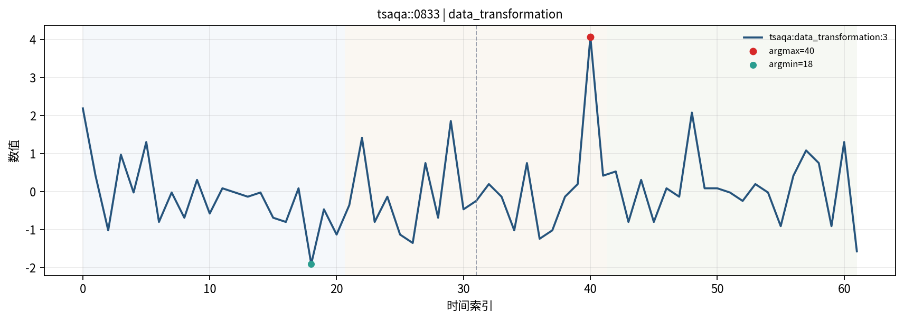

❓ QA 问题与中文翻译

**题干原文**

Which of the following choices is most likely the First Order Difference of the given time series?
Respond ONLY with the letter of the correct choice (A, B, C, or D).

Choices:
A: [0, -0.11, -0.0245, 0, 0.0978, 2.0047, -0.819, -0.6234, 0.0611, -0.0122, 0.0245, -1.4301, 0.0611, -0.6234, -0.4156, 1.1979, 0.0122, 0, -0.5501, -0.8923, 0.4767, 0.6723, 0.1345, -0.1345, 0, 0.44, -0.3056, 0.4889, -0.5501, -0.0733, 0.0245, 0, 0.5134, 0, 0.5256, -0.5378, 0.9412, -0.0611, -0.0489, -0.0978, 0.3789, 0.7212, 0.3178, -0.2078, -0.1222, 0, 0.709, 0, -0.4156, -1.0757, -0.5012, -0.0856, 0, 0.3912, -0.44, -0.2689, 1.1612, 0.11, 0.0856, 0, -0.5256, 0.1711]
B: [0, -0.2173, 0.9778, -1.1951, 0.7605, -0.8692, 1.4668, -1.2495, 1.1136, -0.9778, 0.2173, -0.2445, 0.7605, -0.1901, 0.163, 0.0272, 0.1086, 0.9507, -0.4618, 0.2173, -0.7605, 0.6791, 0.0815, -0.2988, -0.0272, 0.2716, -1.0322, 0.1086, 0.9507, 0.5432, -1.4124, 0.7605, -0.8692, 0.2445, 1.168, 0.1086, -0.5704, -0.3803, 0.9235, -0.5432, -0.2173, 0.842, 0.0815, -0.7334, 0.2173, 0.2445, 0.8149, 0.4618, 0.0272, -1.2223, 1.005, -0.3259, -0.7062, 1.2766, -0.1358, -0.4618, -0.8692, 0.163, 0.1086, 0.6519, 1.0322, -0.1086]
C: [0, -0.1934, -0.3867, -0.7348, -0.8508, -1.0829, -0.2707, -0.0773, 0.232, -0.5028, -0.0773, -0.3094, -0.232, 0.2707, -0.116, 0.3867, 1.0442, 0.6575, -0.2707, 0.5801, -0.232, 0.0387, -0.5028, -0.5028, -0.3481, -0.2707, -0.6961, 0.2707, 0.116, 0.4254, 0.3481, -0.3481, 0.116, 0.3481, -0.3094, -0.0387, -0.5028, -0.1547, 0.4254, 0.5801, -0.4254, -0.3094, 0.1934, 0.3481, -0.0387, -0.8508, -0.6961, 0.1547, 0.9668, -0.116, 0.0387, -0.2707, 0.1547, 0.3867, 0.4641, 0.0773, 0.4254, 0.3481, -0.4641, -0.232, 0.5801, -0.4641]
D: [0, -1.7704, -1.4385, 1.9917, -0.9959, 1.3278, -2.1024, 0.7746, -0.6639, 0.9959, -0.8852, 0.6639, -0.1107, -0.1107, 0.1107, -0.6639, -0.1107, 0.8852, -1.9917, 1.4385, -0.6639, 0.7746, 1.7704, -2.2131, 0.6639, -0.9959, -0.2213, 2.1024, -1.4385, 2.545, -2.3237, 0.2213, 0.4426, -0.332, -0.8852, 1.7704, -1.9917, 0.2213, 0.8852, 0.332, 3.8728, -3.6515, 0.1107, -1.3278, 1.1065, -1.1065, 0.8852, -0.2213, 2.2131, -1.9917, 0, -0.1107, -0.2213, 0.4426, -0.2213, -0.8852, 1.3278, 0.6639, -0.332, -1.6598, 2.2131, -2.877]

**题干中文翻译**

以下哪个选项最可能是给定时间序列的一阶差分？
仅回复正确选项的字母（A、B、C 或 D）。

选项：
A: [0, -0.11, -0.0245, 0, 0.0978, 2.0047, -0.819, -0.6234, 0.0611, -0.0122, 0.0245, -1.4301, 0.0611, -0.6234, -0.4156, 1.1979, 0.0122, 0, -0.5501, -0.8923, 0.4767, 0.6723, 0.1345, -0.1345, 0, 0.44, -0.3056, 0.4889, -0.5501, -0.0733, 0.0245, 0, 0.5134, 0, 0.5256, -0.5378, 0.9412, -0.0611, -0.0489, -0.0978, 0.3789, 0.7212, 0.3178, -0.2078, -0.1222, 0, 0.709, 0, -0.4156, -1.0757, -0.5012, -0.0856, 0, 0.3912, -0.44, -0.2689, 1.1612, 0.11, 0.0856, 0, -0.5256, 0.1711]
B: [0, -0.2173, 0.9778, -1.1951, 0.7605, -0.8692, 1.4668, -1.2495, 1.1136, -0.9778, 0.2173, -0.2445, 0.7605, -0.1901, 0.163, 0.0272, 0.1086, 0.9507, -0.4618, 0.2173, -0.7605, 0.6791, 0.0815, -0.2988, -0.0272, 0.2716, -1.0322, 0.1086, 0.9507, 0.5432, -1.4124, 0.7605, -0.8692, 0.2445, 1.168, 0.1086, -0.5704, -0.3803, 0.9235, -0.5432, -0.2173, 0.842, 0.0815, -0.7334, 0.2173, 0.2445, 0.8149, 0.4618, 0.0272, -1.2223, 1.005, -0.3259, -0.7062, 1.2766, -0.1358, -0.4618, -0.8692, 0.163, 0.1086, 0.6519, 1.0322, -0.1086]
C: [0, -0.1934, -0.3867, -0.7348, -0.8508, -1.0829, -0.2707, -0.0773, 0.232, -0.5028, -0.0773, -0.3094, -0.232, 0.2707, -0.116, 0.3867, 1.0442, 0.6575, -0.2707, 0.5801, -0.232, 0.0387, -0.5028, -0.5028, -0.3481, -0.2707, -0.6961, 0.2707, 0.116, 0.4254, 0.3481, -0.3481, 0.116, 0.3481, -0.3094, -0.0387, -0.5028, -0.1547, 0.4254, 0.5801, -0.4254, -0.3094, 0.1934, 0.3481, -0.0387, -0.8508, -0.6961, 0.1547, 0.9668, -0.116, 0.0387, -0.2707, 0.1547, 0.3867, 0.4641, 0.0773, 0.4254, 0.3481, -0.4641, -0.232, 0.5801, -0.4641]
D: [0, -1.7704, -1.4385, 1.9917, -0.9959, 1.3278, -2.1024, 0.7746, -0.6639, 0.9959, -0.8852, 0.6639, -0.1107, -0.1107, 0.1107, -0.6639, -0.1107, 0.8852, -1.9917, 1.4385, -0.6639, 0.7746, 1.7704, -2.2131, 0.6639, -0.9959, -0.2213, 2.1024, -1.4385, 2.545, -2.3237, 0.2213, 0.4426, -0.332, -0.8852, 1.7704, -1.9917, 0.2213, 0.8852, 0.332, 3.8728, -3.6515, 0.1107, -1.3278, 1.1065, -1.1065, 0.8852, -0.2213, 2.2131, -1.9917, 0, -0.1107, -0.2213, 0.4426, -0.2213, -0.8852, 1.3278, 0.6639, -0.332, -1.6598, 2.2131, -2.877]

**背景信息原文**

["A time series of daily page\u2010view counts for a single English Wikipedia article.", "A time series of daily spot exchange rate measurements (foreign currency units per U.S. dollar) for a single currency.", "A time series of 5-minute traffic flow measurements (vehicle counts) from a single Bay Area sensor.", "A time series of daily relative sunspot number measurements, where each value represents the quantified count of sunspot activity on the Sun\u2019s visible disk."]

**背景信息中文翻译**

["单篇英文维基百科文章每日页面浏览量计数的时间序列。", "单一货币每日即期汇率测量值（每美元对应的外国货币单位）的时间序列。", "来自湾区单个传感器的每 5 分钟交通流量测量值（车辆计数）的时间序列。", "每日相对太阳黑子数测量值的时间序列，其中每个值表示太阳可见圆面上太阳黑子活动的量化计数。"]

**选项**
无固定选项；题目要求按指定格式直接生成答案。

**正确答案**：`D`

📝 生成的 caption 与中文翻译

**可用 caption 样本 原文**

1. Noisy with std around 1.29.
  2. No periodic fluctuations observed, showing no periodic fluctuation.
  3. Keep steady from 2.20 to -1.57.
  4. No local features found.

**可用 caption 样本 中文翻译**

1. 噪声较大，std 约为 1.29。
  2. 未观察到周期性波动，显示无周期性波动。
  3. 从 2.20 到 -1.57 保持稳定。
  4. 未发现局部特征。

🧪 下游 QA 模型答案 / 评分

| 输入条件 | 预测答案 | 结果 |
| --- | --- | --- |
| `meta_only` | `A` | 错误 |
| `numbers` | `D` | 正确 |
| `opentslm_caption` | `A` | 错误 |
| `opentslm_caption_plus` | `D` | 正确 |
| `chatts_caption` | `D` | 正确 |
| `chatts_caption_plus` | `D` | 正确 |
| `tool_agent` | `D` | 正确 |

🔎 Case 分析

- 失败标签：TSAQA data transformation：一阶差分选择题
- 关键结论：该题需要把原始序列映射到一阶差分候选。OpenTSLM caption 错、ChatTS 对，说明自由文本形态描述对可计算变换题并不稳定。

🧪 Case 25：TSAQA | TSAQA data transformation：numbers/caption 都错，tool-agent 对

##### 基本信息

| 字段 | 内容 |
| --- | --- |
| 数据集 | `TSAQA` |
| Case ID | `tsaqa::0858` |
| 问题类型 | `data_transformation` |
| 领域 / 子数据集 | `["finance", "nature"]` / `-` |
| 正确答案 | `F` |

- artifact 说明：TSAQA 此 case 已按 full-eval task 顺序和 local index 回连 phase_a 原始题干/序列；当前本地没有保存 OpenTSLM/ChatTS 原始 caption 对照文本，因此此处展示可用 SFT caption 样本和多条件答案。

数值摘要：n=60, min=-1.8082, max=1.7084, mean=3.3333e-06, std=1, slope=0.056825, argmax=59, argmin=0

🖼 时序图

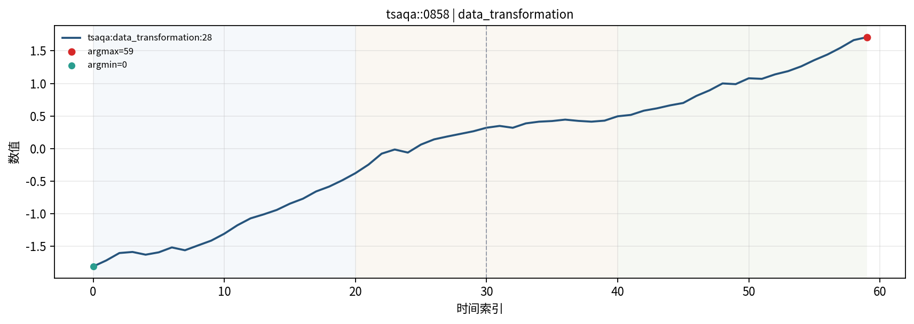

❓ QA 问题与中文翻译

**题干原文**

Is the following sequence the Fourier Transform of the given time series?
[0, 13.7297, 33.7742, 18.4157, 4.0489, 3.7777, 1.4631, 2.522, 1.5447, 1.2527, 3.8876, 3.288, 2.882, 1.1669, 3.6571, 2.2853, 3.1854, 1.8801, 1.3621, 0.9566, 0.6499, 0.3914, 0.3976, 1.8261, 1.0968, 1.3006, 0.624, 1.7817, 2.3862, 0.7909, 1.4543, 0.7909, 2.3862, 1.7817, 0.624, 1.3006, 1.0968, 1.8261, 0.3976, 0.3914, 0.6499, 0.9566, 1.3621, 1.8801, 3.1854, 2.2853, 3.6571, 1.1669, 2.882, 3.288, 3.8876, 1.2527, 1.5447, 2.522, 1.4631, 3.7777, 4.0489, 18.4157, 33.7742, 13.7297]
Respond ONLY with the letter of the correct choice (T or F).

Choices:
T: True.
F: False.

**题干中文翻译**

以下序列是给定时间序列的傅里叶变换吗？
[0, 13.7297, 33.7742, 18.4157, 4.0489, 3.7777, 1.4631, 2.522, 1.5447, 1.2527, 3.8876, 3.288, 2.882, 1.1669, 3.6571, 2.2853, 3.1854, 1.8801, 1.3621, 0.9566, 0.6499, 0.3914, 0.3976, 1.8261, 1.0968, 1.3006, 0.624, 1.7817, 2.3862, 0.7909, 1.4543, 0.7909, 2.3862, 1.7817, 0.624, 1.3006, 1.0968, 1.8261, 0.3976, 0.3914, 0.6499, 0.9566, 1.3621, 1.8801, 3.1854, 2.2853, 3.6571, 1.1669, 2.882, 3.288, 3.8876, 1.2527, 1.5447, 2.522, 1.4631, 3.7777, 4.0489, 18.4157, 33.7742, 13.7297]
请仅用正确选项的字母（T 或 F）作答。

选项：
T：正确。
F：错误。

**背景信息原文**

["A time series of monthly macroeconomic indicator measurements for a single U.S. economic time series.", "A time series of daily precipitation measurements (millimeters) for a single 1.5\u00b0\u00d71.5\u00b0 latitude\u2013longitude grid cell."]

**背景信息中文翻译**

["单个美国经济时间序列的月度宏观经济指标测量时间序列。", "单个 1.5°×1.5° 经纬度网格单元的日降水量测量时间序列（毫米）。"]

**选项**
无固定选项；题目要求按指定格式直接生成答案。

**正确答案**：`F`

📝 生成的 caption 与中文翻译

**可用 caption 样本 原文**

1) almost no noise 2) no periodic fluctuation 3) increase from -1.81 to 1.71 4) No local features found.

**可用 caption 样本 中文翻译**

1) 几乎没有噪声 2) 没有周期性波动 3) 从 -1.81 增加到 1.71 4) 未发现局部特征。

🧪 下游 QA 模型答案 / 评分

| 输入条件 | 预测答案 | 结果 |
| --- | --- | --- |
| `meta_only` | `T` | 错误 |
| `numbers` | `T` | 错误 |
| `opentslm_caption` | `T` | 错误 |
| `opentslm_caption_plus` | `T` | 错误 |
| `chatts_caption` | `T` | 错误 |
| `chatts_caption_plus` | `T` | 错误 |
| `tool_agent` | `F` | 正确 |

🔎 Case 分析

- 失败标签：TSAQA data transformation：numbers/caption 都错，tool-agent 对
- 关键结论：该题判断 Fourier transform 序列真伪。numbers 和两个 caption 条件都答错，但 tool-agent 答对，说明这类题需要显式计算工具，而不是语言模型凭描述判断。

🧭 Case 26：TimeSeriesExam | ChatTS 错、OpenTSLM 对的反例

##### 基本信息

| 字段 | 内容 |
| --- | --- |
| 数据集 | `TimeSeriesExam` |
| Case ID | `timeseriesexam::tse_0010` |
| 问题类型 | `Anolmaly Detection` |
| 正确答案 | `Yes, it's pattern is distorted by random spikes` |

数值摘要：n=128, min=-11.128, max=13.743, mean=3.8142, std=3.8011, slope=0.070196, argmax=103, argmin=0

🖼 时序图

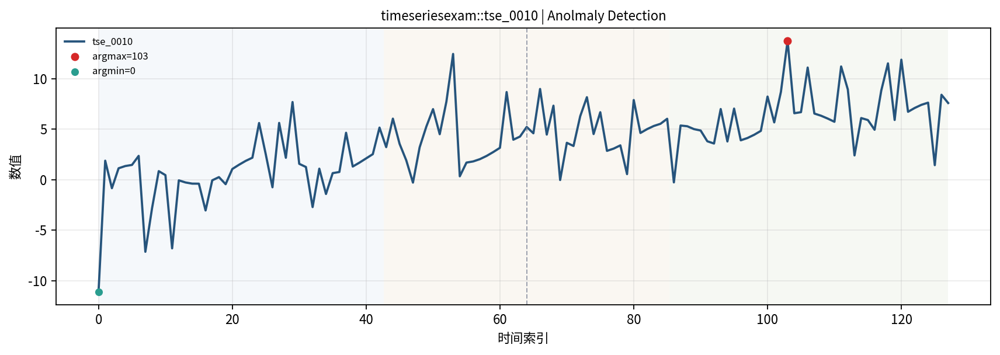

❓ QA 问题与中文翻译

**题干原文**

Is the given time series likely to have an anomaly?

**题干中文翻译**

给定的时间序列是否可能存在异常？

**选项**
- A: No
  中文：否
- B: Yes, it's pattern is distorted by random spikes
  中文：是的，它的模式被随机尖峰扭曲了。
- C: Yes, it's pattern is flipped at certain point in time
  中文：是的，它的模式在某个时间点发生了翻转。

**正确答案**：`Yes, it's pattern is distorted by random spikes`

📝 生成的 caption 与中文翻译

**OpenTSLM caption 原文**

The time series shows a downward trend early in the window followed by an upward movement in the first half and a stronger upward trend in the second half. There is a moderate seasonal pattern with a period of about 10 time units. The overall net change is a significant increase of over 40%. A notable peak occurs in the first half, reaching about 1.5 standard deviations above the mean, while a deep valley is observed early in the window, about 1.8 standard deviations below the mean. The data exhibits strong positive correlation with variable 2 and moderate positive correlation with variable 3.

**OpenTSLM caption 中文翻译**

该时间序列在窗口早期呈下降趋势，随后在前半段出现上行走势，并在后半段呈现更强的上升趋势。存在中等程度的季节性模式，周期约为 10 个时间单位。整体净变化为显著增加，增幅超过 40%。前半段出现一个显著峰值，达到均值以上约 1.5 个标准差；而窗口早期观察到一个深谷，约低于均值 1.8 个标准差。数据与变量 2 表现出强正相关，与变量 3 表现出中等正相关。

**ChatTS caption 原文**

The overall trend is increasing. The global maximum, 11.65, occurs at point 127, which is in the last third of the 128-point window. Short-term fluctuations, characterized by the standard deviation of noise (~3.0), are more pronounced in the first half of the window compared to the second half, where the trend stabilizes.

**ChatTS caption 中文翻译**

整体趋势是上升的。全局最大值 11.65 出现在点 127，位于 128 点窗口的后三分之一。由噪声标准差（约 3.0）表征的短期波动，在窗口前半部分比后半部分更明显，而后半部分的趋势趋于稳定。

🧪 下游 QA 模型答案 / 评分

| 输入条件 | 预测答案 | 结果 |
| --- | --- | --- |
| `meta_only` | `B` | 正确 |
| `numbers` | `B` | 正确 |
| `opentslm_caption` | `B` | 正确 |
| `chatts_caption` | `A` | 错误 |
| `wrong_caption` | `B` | 正确 |

🔎 Case 分析

- 失败标签：ChatTS 错、OpenTSLM 对的反例
- 关键结论：并非所有失败都来自 OpenTSLM；该 anomaly case 中 OpenTSLM 正确而 ChatTS 错，说明不同 caption 模型的偏差方向不同。

🧭 Case 27：TimeSeriesExam | 趋势-周期组合的概念题

##### 基本信息

| 字段 | 内容 |
| --- | --- |
| 数据集 | `TimeSeriesExam` |
| Case ID | `timeseriesexam::tse_0182` |
| 问题类型 | `Pattern Recognition` |
| 正确答案 | `Multiplicative` |

数值摘要：n=128, min=-12.254, max=10.704, mean=-0.51551, std=5.382, slope=-0.024376, argmax=105, argmin=121

🖼 时序图

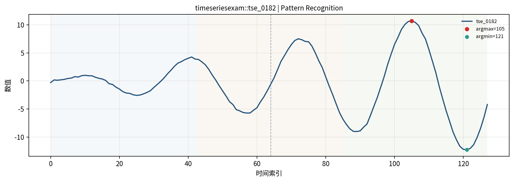

❓ QA 问题与中文翻译

**题干原文**

The given time series has a cycle component and a trend component. Is it an additive or multiplicative model?

**题干中文翻译**

给定的时间序列包含周期成分和趋势成分。它是加性模型还是乘性模型？

**选项**
- A: Multiplicative
  中文：乘法式
- B: Additive
  中文：加性

**正确答案**：`Multiplicative`

📝 生成的 caption 与中文翻译

**OpenTSLM caption 原文**

The time series shows a downward trend early in the window, followed by a moderate decline in the first half, and a significant upward movement in the second half. There is a strong seasonal pattern with a period of 3 time units. The overall net change is a decrease of about 12.6%. A notable peak occurs in the second half, reaching about 1.6 standard deviations above the mean, while a deep valley is observed around the middle, reaching about 2.0 standard deviations below the mean. The data exhibits strong positive correlation with variable 2 and moderate positive correlation with variable 3.

**OpenTSLM caption 中文翻译**

该时间序列在窗口早期呈下降趋势，随后在前半段出现适度下降，并在后半段出现显著上升。存在较强的季节性模式，周期为 3 个时间单位。整体净变化为下降约 12.6%。后半段出现一个显著峰值，达到均值以上约 1.6 个标准差；而在中部附近观察到一个深谷，达到均值以下约 2.0 个标准差。数据与变量 2 表现出强正相关，与变量 3 表现出中等正相关。

**ChatTS caption 原文**

The overall trend is decreasing. The global maximum occurs at the start of the series (first third of the window). Short-term fluctuations are consistent throughout, showing similar amplitudes in both halves of the window.

**ChatTS caption 中文翻译**

整体趋势是下降的。全局最大值出现在序列开始处（窗口的前三分之一）。短期波动在整个过程中保持一致，在窗口的前后两半显示出相似的振幅。

🧪 下游 QA 模型答案 / 评分

| 输入条件 | 预测答案 | 结果 |
| --- | --- | --- |
| `meta_only` | `A` | 正确 |
| `numbers` | `A` | 正确 |
| `opentslm_caption` | `A` | 正确 |
| `chatts_caption` | `B` | 错误 |
| `wrong_caption` | `B` | 错误 |

🔎 Case 分析

- 失败标签：趋势-周期组合的概念题
- 关键结论：该题判断 additive/multiplicative。ChatTS 错、OpenTSLM 对，说明 ChatTS 的简洁描述有时不足以保留组合模型结构。

### 5.2 FREDQA hard-subset case study

下面每个 case 都包含时序图、原始 QA 与中文翻译、OpenTSLM/ChatTS 生成 caption 与中文翻译、六种输入条件下的 `gpt-5.4` 回答，以及对应分析。本节已去掉 `meta_only` 已经答对的 case，所有展示样本都属于 `meta_only` 答错的 harder subset。

📈 Case 01：FREDQA `1079` | OpenTSLM 错、ChatTS 对

#### 基本信息

| 字段 | 内容 |
| --- | --- |
| 数据集 | `FREDQA` |
| Case ID | `fredqa::1079` |
| FREDQA 原始 idx | `1079` |
| 变量数 / 序列长度 | `2` / `[40, 40]` |
| 问题类型 | `Causal Reasoning - Interventional` |
| 正确答案 | `B` |
| 失败/对比模式 | OpenTSLM 错、ChatTS 对 |
| 本 case 关注点 | 家庭资产/负债变化率在通胀冲击前后的比值变化 |

变量摘要：

| 变量 | 指标名 | n | start | end | min@idx | max@idx | slope |
| ---: | --- | ---: | ---: | ---: | --- | --- | ---: |
| 1 | (CXUCHGASSETLB0101M/CPIAUCSL)*100, (U.S. $/Index 1982-1984=100)*100, Annual | 40 | 2300.51 | 5828.28 | 2035.66@11 | 14747.9@37 | 162.972 |
| 2 | (CXUCHGLIABLB0101M/CPIAUCSL)*100, (U.S. $/Index 1982-1984=100)*100, Annual | 40 | 1155.55 | 2299.94 | 1077.14@1 | 11319@19 | 88.4598 |

🖼 时序图

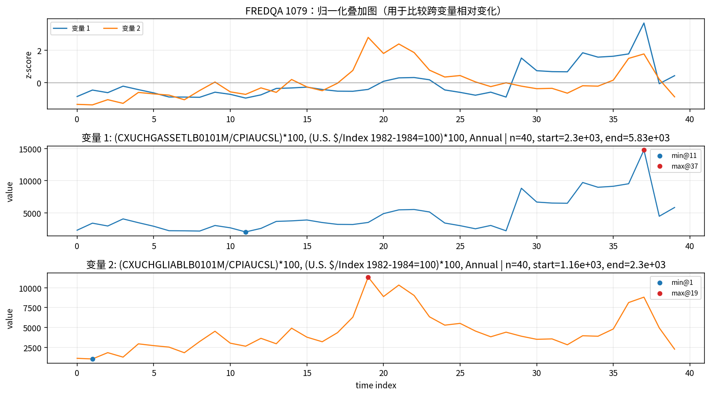

❓ QA 问题与中文翻译

**题干原文**

> You are a time series analysis expert. In a U.S. household balance sheet system, there are 2 metrics: Inflation-adjusted net change in total household assets (annual, U.S. $/Index 1982–1984=100)*100&lt;ts&gt;&lt;ts/&gt;; Inflation-adjusted net change in total household liabilities (annual, U.S. $/Index 1982–1984=100)*100&lt;ts&gt;&lt;ts/&gt;. The data spans 1984–2023 annually. Unexpected inflation occurred in 2021–2022, and research links such inflation to changes in household balance sheet components. Calculate the ratio of annual asset change to annual liability change for 2020 (a pre-inflation baseline) and 2022, then identify the most plausible causal inference about how unexpected inflation affected the relationship between these two metrics.

**题干中文翻译**

> 你是一名时间序列分析专家。在一个美国居民家庭资产负债表系统中，有 2 个指标：经通胀调整后的家庭总资产年度净变化（年度，美国美元/指数 1982–1984=100）*100&lt;ts&gt;&lt;ts/&gt;；经通胀调整后的家庭总负债年度净变化（年度，美国美元/指数 1982–1984=100）*100&lt;ts&gt;&lt;ts/&gt;。数据按年度覆盖 1984–2023 年。2021–2022 年发生了意外通胀，研究将这种通胀与家庭资产负债表组成部分的变化联系起来。计算 2020 年（通胀前基线）和 2022 年的年度资产变化与年度负债变化之比，然后判断关于意外通胀如何影响这两个指标之间关系的最可能因果推断。

**选项**

| 选项 | 原文 | 中文翻译 |
| --- | --- | --- |
| `A` | The ratio increased from ~1.17 to ~1.20, suggesting unexpected inflation boosted asset growth more than liability growth. | 该比率从约 1.17 增加到约 1.20，表明意外通胀推动资产增长的幅度大于负债增长。 |
| `B` | The ratio decreased from ~1.17 to ~0.90, suggesting unexpected inflation reduced asset growth relative to liability growth. | 该比率从约 1.17 降至约 0.90，表明意外通胀相对于负债增长削弱了资产增长。 |
| `C` | The ratio stayed constant at ~1.0, suggesting unexpected inflation had no differential effect on assets vs. liabilities. | 该比率保持在约 1.0 不变，表明意外通胀对资产与负债之间没有差异化影响。 |
| `D` | The ratio flipped from ~0.85 to ~1.10, suggesting unexpected inflation reversed the relationship between assets and liabilities. | 该比率从约 0.85 翻转至约 1.10，表明意外通胀逆转了资产与负债之间的关系。 |

**正确答案**：`B`

**标准解释原文**

> First, calculate the 2020 ratio: 2020 asset change (9516.88) divided by 2020 liability change (8132.71) equals ~1.17. Next, calculate the 2022 ratio: 2022 asset change (4469.19) divided by 2022 liability change (4963.68) equals ~0.90. The ratio dropped from ~1.17 to ~0.90, meaning asset changes went from being 17% higher than liability changes to 10% lower. This shift supports the causal inference that unexpected inflation reduced asset growth relative to liability growth—consistent with the research that unexpected inflation impacts different balance sheet components (assets vs. liabilities) differently. Option B correctly reflects both the ratio change and the causal logic linking the inflation event to the altered asset-liability relationship.

**标准解释中文翻译**

> 首先，计算 2020 年比率：2020 年资产变化（9516.88）除以 2020 年负债变化（8132.71）等于约 1.17。接着，计算 2022 年比率：2022 年资产变化（4469.19）除以 2022 年负债变化（4963.68）等于约 0.90。该比率从约 1.17 降至约 0.90，意味着资产变化从比负债变化高 17% 变为低 10%。这一变化支持这样的因果推断：意外通胀相对于负债增长削弱了资产增长——这与研究中关于意外通胀会不同地影响家庭资产负债表不同组成部分（资产 vs. 负债）的结论一致。选项 B 正确反映了比率变化以及将通胀事件与资产-负债关系改变联系起来的因果逻辑。

📝 生成的 caption 与中文翻译

##### 变量 1：(CXUCHGASSETLB0101M/CPIAUCSL)*100, (U.S. $/Index 1982-1984=100)*100, Annual

**OpenTSLM caption 原文**

> The time series shows a steady upward trend with low volatility and a strong seasonal pattern repeating every 18 years. The data starts with a moderate increase in the early part of the window, followed by a more pronounced rise in the first half, and a slightly smaller but still positive growth in the second half. A notable peak occurs late in the window, reaching about 1.5 standard deviations above the mean, while a valley is observed early on, about 1.2 standard deviations below the mean. The series is strongly positively correlated with another economic indicator and moderately correlated with a second variable.

**OpenTSLM caption 中文翻译**

> 该时间序列呈现稳定上升趋势，波动较低，并具有每 18 年重复一次的强季节性模式。数据在窗口前半部分开始于适度增长，随后在前半段出现更明显的上升，而在后半段则呈现稍小但仍为正的增长。一个显著峰值出现在窗口后期，约高于均值 1.5 个标准差；同时，一个谷值出现在较早时期，约低于均值 1.2 个标准差。该序列与另一个经济指标呈强正相关，并与第二个变量呈中度相关。

**ChatTS caption 原文**

> The overall trend is mixed, with an initial increase followed by a decrease. The global maximum occurs at point 36 (last third of the 40-point window). Short-term fluctuations are more pronounced in the first half (points 1–20) due to the upward convex pattern observed there.

**ChatTS caption 中文翻译**

> 总体趋势是混合的，先上升后下降。全局最大值出现在第 36 个点（40 点窗口的后三分之一）。短期波动在前半段（第 1–20 点）更为明显，这是由于那里观察到向上的凸形模式。

##### 变量 2：(CXUCHGLIABLB0101M/CPIAUCSL)*100, (U.S. $/Index 1982-1984=100)*100, Annual

**OpenTSLM caption 原文**

> The time series shows a steady upward trend with low volatility, characterized by a strong seasonal pattern repeating every 21 periods. The data starts with a moderate increase in the early part of the window, followed by a more pronounced rise in the first half, and a slightly smaller but still positive growth in the second half. A notable peak occurs late in the window, reaching about 1.5 standard deviations above the mean. There is no valley identified, and the overall growth over the time span is substantial, with a net increase of over 100%.

**OpenTSLM caption 中文翻译**

> 该时间序列呈现稳定上升趋势，波动较低，特点是每 21 个周期重复一次的强季节性模式。数据在窗口前半部分开始于适度增长，随后在前半段出现更明显的上升，而在后半段则呈现稍小但仍为正的增长。一个显著峰值出现在窗口后期，约高于均值 1.5 个标准差。未识别到谷值，且整个时间跨度内总体增长显著，净增幅超过 100%。

**ChatTS caption 原文**

> The overall trend is increasing. The global maximum occurs at point 23 (middle third of the window). Short-term fluctuations are more pronounced in the first half of the window, where the spike between points 15-17 and the rapid decline at 23-27 are located.

**ChatTS caption 中文翻译**

> 总体趋势是上升的。全局最大值出现在第 23 个点（窗口的中间三分之一）。短期波动在窗口前半段更为明显，其中第 15-17 点之间的尖峰以及第 23-27 点之间的快速下降位于该区域。

🧪 下游 QA 模型答案 / 评分

表中所有预测都是同一个辅助 QA 模型 `gpt-5.4` 的输出；六行只改变输入证据形式。

| 输入条件 | 预测答案 | Gold | 是否正确 | 模型原始输出 |
| --- | --- | --- | --- | --- |
| 只给题目和选项 (`meta_only`) | `A` | `B` | ✗ 错误 | A |
| 题目 + 原始数值序列 (`numbers`) | `B` | `B` | ✓ 正确 | B |
| 题目 + OpenTSLM caption (`opentslm_caption`) | `A` | `B` | ✗ 错误 | A |
| 题目 + OpenTSLM caption + 数值 (`opentslm_caption_plus`) | `B` | `B` | ✓ 正确 | B |
| 题目 + ChatTS caption (`chatts_caption`) | `B` | `B` | ✓ 正确 | B |
| 题目 + ChatTS caption + 数值 (`chatts_caption_plus`) | `A` | `B` | ✗ 错误 | A |

🔎 Case 分析

- **答案格局**：`meta_only=A✗, numbers=B✓, opentslm_caption=A✗, opentslm_caption_plus=B✓, chatts_caption=B✓, chatts_caption_plus=A✗`。
- **关键问题**：OpenTSLM 把两条序列都写成稳定上升，弱化了 2022 年资产变化相对负债变化下降这一局部比值证据；ChatTS 至少保留了资产先升后降、负债峰值位置等局部形态，因此 caption-only 能答对。
- **对训练失败的含义**：这类 case 显示，当前 caption 训练更像是在学习通用趋势/峰谷/波动模板，而不是学习“下游 QA 所需的证据提取”。FREDQA 的正确答案经常依赖指定日期、指定窗口、比值、差值、反事实外推或领域机制；这些信息如果没有被 caption 明确保留，下游 GPT 即使很强也只能依赖题干先验或被错误摘要带偏。

📈 Case 02：FREDQA `1145` | OpenTSLM 错、ChatTS 对，但 caption+numbers 不稳

#### 基本信息

| 字段 | 内容 |
| --- | --- |
| 数据集 | `FREDQA` |
| Case ID | `fredqa::1145` |
| FREDQA 原始 idx | `1145` |
| 变量数 / 序列长度 | `3` / `[90, 90, 90]` |
| 问题类型 | `Causal Reasoning - Interventional` |
| 正确答案 | `B` |
| 失败/对比模式 | OpenTSLM 错、ChatTS 对，但 caption+numbers 不稳 |
| 本 case 关注点 | 疫情后不同年龄组劳动参与率缺口比较 |

变量摘要：

| 变量 | 指标名 | n | start | end | min@idx | max@idx | slope |
| ---: | --- | ---: | ---: | ---: | --- | --- | ---: |
| 1 | LNS11300036-73.0, %-73.0, Monthly, Seasonally Adjusted  | 90 | -1.1 | -2 | -8.7@27 | 0.3@16 | 0.00524592 |
| 2 | LNS11300060-83.1, %-83.1, Monthly, Seasonally Adjusted  | 90 | -1.4 | 0.4 | -3.3@27 | 0.8@78 | 0.0218241 |
| 3 | LNS11324230-40.2, %-40.2, Monthly, Seasonally Adjusted  | 90 | -0.7 | -2.2 | -2.2@89 | 0.3@18 | -0.023649 |

🖼 时序图

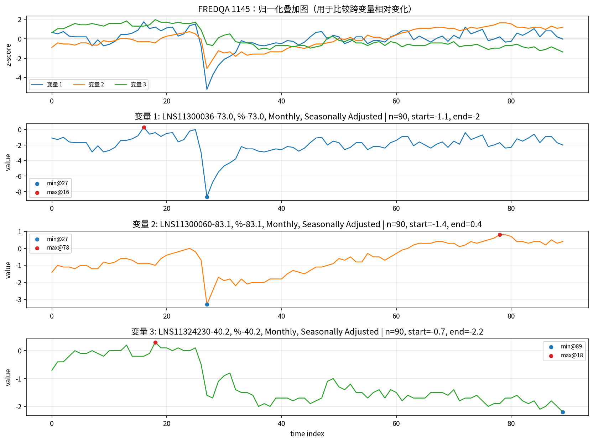

❓ QA 问题与中文翻译

**题干原文**

> You are a time series analysis expert. In the U.S. labor market, there are 3 metrics:
> Labor force participation rate (LFPR) percentage-point change from January 2020 for 20–24-year-olds (baseline LFPR: 73.0% in Jan 2020)&lt;ts&gt;&lt;ts/&gt;;
> LFPR percentage-point change from January 2020 for 25–54-year-olds (baseline LFPR: 83.1% in Jan 2020)&lt;ts&gt;&lt;ts/&gt;;
> LFPR percentage-point change from January 2020 for 55+-year-olds (baseline LFPR: 40.2% in Jan 2020)&lt;ts&gt;&lt;ts/&gt;.
> Monthly data is available from January 2018 to June 2025. News outlets cited childcare disruptions (affecting younger workers) and early retirements (affecting older workers) as drivers of pandemic-era LFPR declines. As of December 2022, none of the age groups had fully recovered to their January 2020 LFPR levels. Which conclusion about the pandemic’s causal effects on LFPR is most supported by comparing the December 2022 percentage-point gaps relative to January 2020 across the three groups?

**题干中文翻译**

> 你是一名时间序列分析专家。在美国劳动力市场中，有 3 个指标：
> 20–24 岁人群劳动参与率（LFPR）相对于 2020 年 1 月的百分点变化（基线 LFPR：2020 年 1 月为 73.0%）&lt;ts&gt;&lt;ts/&gt;；
> 25–54 岁人群 LFPR 相对于 2020 年 1 月的百分点变化（基线 LFPR：2020 年 1 月为 83.1%）&lt;ts&gt;&lt;ts/&gt;；
> 55 岁及以上人群 LFPR 相对于 2020 年 1 月的百分点变化（基线 LFPR：2020 年 1 月为 40.2%）&lt;ts&gt;&lt;ts/&gt;。
> 月度数据可从 2018 年 1 月获取到 2025 年 6 月。新闻媒体将育儿中断（影响较年轻的工人）和提前退休（影响较年长的工人）归因于疫情时期 LFPR 下降的驱动因素。截至 2022 年 12 月，没有任何年龄组完全恢复到其 2020 年 1 月的 LFPR 水平。通过比较三组相对于 2020 年 1 月在 2022 年 12 月的百分点差距，关于疫情对 LFPR 因果影响的哪一结论最有支持？

**选项**

| 选项 | 原文 | 中文翻译 |
| --- | --- | --- |
| `A` | Early retirements had a stronger causal impact than childcare disruptions, as the 55+ group’s December 2022 LFPR gap was 0.3 percentage points larger than the 20–24 group’s gap. | 提前退休的因果影响比育儿中断更强，因为 55 岁以上组在 2022 年 12 月的 LFPR 差距比 20–24 岁组大 0.3 个百分点。 |
| `B` | Childcare disruptions had a stronger causal impact than early retirements, as the 20–24 group’s December 2022 LFPR gap was 0.3 percentage points larger than the 55+ group’s gap. | 育儿中断的因果影响比提前退休更强，因为 20–24 岁组在 2022 年 12 月的 LFPR 差距比 55 岁以上组大 0.3 个百分点。 |
| `C` | Neither factor contributed significantly to LFPR declines, as all three groups’ gaps were less than 2 percentage points. | 这两个因素都没有显著导致 LFPR 下降，因为三组的差距都小于 2 个百分点。 |
| `D` | Early retirements primarily affected the 25–54 group, as their December 2022 LFPR gap was the smallest among the three groups. | 提前退休主要影响了 25–54 岁组，因为他们在 2022 年 12 月的 LFPR 差距是三组中最小的。 |

**正确答案**：`B`

**标准解释原文**

> First, we use the data to identify the December 2022 LFPR gaps: the 20–24 group was -1.7 percentage points below January 2020, the 55+ group was -1.4 percentage points below, and the 25–54 group was -0.7 percentage points below. The causal factors link childcare disruptions to younger workers (20–24) and early retirements to older workers (55+). Since the 20–24 group’s gap is 0.3 percentage points larger than the 55+ group’s, this supports the conclusion that childcare disruptions had a stronger causal impact. Option A is incorrect because the 55+ gap is smaller, not larger. Option C is incorrect because gaps of 1.4–1.7 percentage points are meaningful for labor force dynamics. Option D is incorrect because the 25–54 group’s small gap suggests minimal impact from retirement (a factor targeting older workers).

**标准解释中文翻译**

> 首先，我们利用数据识别 2022 年 12 月的 LFPR 差距：20–24 岁组比 2020 年 1 月低 1.7 个百分点，55 岁以上组比 2020 年 1 月低 1.4 个百分点，25–54 岁组比 2020 年 1 月低 0.7 个百分点。因果因素将育儿中断与较年轻工人（20–24 岁）联系起来，将提前退休与较年长工人（55 岁以上）联系起来。由于 20–24 岁组的差距比 55 岁以上组大 0.3 个百分点，这支持了育儿中断具有更强因果影响的结论。选项 A 不正确，因为 55 岁以上组的差距更小，而不是更大。选项 C 不正确，因为 1.4–1.7 个百分点的差距对劳动力动态而言是有意义的。选项 D 不正确，因为 25–54 岁组较小的差距表明退休（针对较年长工人的因素）影响很小。

📝 生成的 caption 与中文翻译

##### 变量 1：LNS11300036-73.0, %-73.0, Monthly, Seasonally Adjusted

**OpenTSLM caption 原文**

> The time series shows a flat trend with low volatility and no clear seasonality. It begins with a moderate upward movement in the early part of the window, followed by a significant decline in the first half, and a smaller decline in the second half. A peak occurs in the first half, reaching about 1.5 standard deviations above the mean, while a valley appears late in the window, also about 1.5 standard deviations below the mean. The series has a strong positive correlation with another variable, LNS11300036-73.0, and a moderate positive correlation with another, LNS14600036.

**OpenTSLM caption 中文翻译**

> 该时间序列呈现平稳趋势、低波动性且没有明显季节性。它在窗口的前半部分开始时有一个适度上升，随后在前半部分出现显著下降，在后半部分出现较小的下降。峰值出现在前半部分，约为均值上方 1.5 个标准差，而谷值出现在窗口后期，也约为均值下方 1.5 个标准差。该序列与另一个变量 LNS11300036-73.0 呈强正相关，并且与另一个变量 LNS14600036 呈中等正相关。

**ChatTS caption 原文**

> The overall trend is mixed: it starts with an increasing phase from point 0 to 30, followed by a decreasing phase from point 30 to 90. The global maximum occurs at point 18, which is in the first third of the 90-point window. The first half of the window (points 0–45) exhibits larger short-term fluctuations, including a rapid rise and a subsequent spike, compared to the smoother decline in the second half (points 45–90).

**ChatTS caption 中文翻译**

> （源 artifact 未提供该字段。）

##### 变量 2：LNS11300060-83.1, %-83.1, Monthly, Seasonally Adjusted

**OpenTSLM caption 原文**

> The time series shows a steady upward trend with low volatility and a strong seasonal pattern repeating every 12 months. The data starts with a moderate increase in the early part of the window, followed by a more pronounced rise in the first half, and a slightly smaller but still positive growth in the second half. A notable peak occurs late in the window, reaching about 1.5 standard deviations above the mean, while a valley is observed early on, about 1.2 standard deviations below the mean. The series is strongly correlated with another economic indicator, suggesting a consistent relationship over time.

**OpenTSLM caption 中文翻译**

> 该时间序列呈现稳定上升趋势、低波动性以及每 12 个月重复一次的强季节性模式。数据在窗口前半部分开始时有适度增长，随后在前半部分出现更明显的上升，在后半部分继续保持略小但仍为正的增长。一个显著峰值出现在窗口后期，约为均值上方 1.5 个标准差，而谷值出现在早期，约为均值下方 1.2 个标准差。该序列与另一个经济指标强相关，表明随时间存在一致关系。

**ChatTS caption 原文**

> The overall trend is mixed: it decreases initially, then increases sharply. The global maximum occurs at point 87 (last third of the window). Short-term fluctuations are larger in the first half (points 1–45) compared to the second half (points 46–90).

**ChatTS caption 中文翻译**

> （源 artifact 未提供该字段。）

##### 变量 3：LNS11324230-40.2, %-40.2, Monthly, Seasonally Adjusted

**OpenTSLM caption 原文**

> The time series shows a flat trend with low volatility and weak seasonality, characterized by a weakly negative correlation with the variable LNS11324230. The data begins with a moderate upward movement in the early part of the window, followed by a significant decline in the first half, and a smaller decline in the second half. A peak occurs in the first half, reaching about 1.8 standard deviations above the mean, while a valley appears late in the window, about 1.2 standard deviations below the mean. The overall net change is a substantial decrease of over 100%.

**OpenTSLM caption 中文翻译**

> 该时间序列呈现平稳趋势、低波动性和弱季节性，并且与变量 LNS11324230 呈弱负相关。数据在窗口前半部分开始时有适度上升，随后在前半部分出现显著下降，在后半部分出现较小的下降。峰值出现在前半部分，约为均值上方 1.8 个标准差，而谷值出现在窗口后期，约为均值下方 1.2 个标准差。总体净变化是超过 100% 的显著下降。

**ChatTS caption 原文**

> The overall trend is decreasing. The global maximum occurs at point 10 (first third of the window). Short-term fluctuations are more pronounced in the first half (amplitude ~0.9) compared to the second half (amplitude ~0.5).

**ChatTS caption 中文翻译**

> （源 artifact 未提供该字段。）

🧪 下游 QA 模型答案 / 评分

表中所有预测都是同一个辅助 QA 模型 `gpt-5.4` 的输出；六行只改变输入证据形式。

| 输入条件 | 预测答案 | Gold | 是否正确 | 模型原始输出 |
| --- | --- | --- | --- | --- |
| 只给题目和选项 (`meta_only`) | `A` | `B` | ✗ 错误 | A |
| 题目 + 原始数值序列 (`numbers`) | `A` | `B` | ✗ 错误 | A |
| 题目 + OpenTSLM caption (`opentslm_caption`) | `A` | `B` | ✗ 错误 | A |
| 题目 + OpenTSLM caption + 数值 (`opentslm_caption_plus`) | `B` | `B` | ✓ 正确 | B |
| 题目 + ChatTS caption (`chatts_caption`) | `B` | `B` | ✓ 正确 | B |
| 题目 + ChatTS caption + 数值 (`chatts_caption_plus`) | `A` | `B` | ✗ 错误 | A |

🔎 Case 分析

- **答案格局**：`meta_only=A✗, numbers=A✗, opentslm_caption=A✗, opentslm_caption_plus=B✓, chatts_caption=B✓, chatts_caption_plus=A✗`。
- **关键问题**：题目要求比较 2022 年 12 月相对 2020 年 1 月的缺口。ChatTS 的单独 caption 捕捉了年轻组和年长组不同恢复形态，OpenTSLM 的通用趋势描述不足；但加入数值后 ChatTS+numbers 又答错，说明下游模型融合 caption 与数值时并不单调。
- **对训练失败的含义**：这类 case 显示，当前 caption 训练更像是在学习通用趋势/峰谷/波动模板，而不是学习“下游 QA 所需的证据提取”。FREDQA 的正确答案经常依赖指定日期、指定窗口、比值、差值、反事实外推或领域机制；这些信息如果没有被 caption 明确保留，下游 GPT 即使很强也只能依赖题干先验或被错误摘要带偏。

📈 Case 03：FREDQA `997` | meta-only 错，只有 OpenTSLM caption 对

#### 基本信息

| 字段 | 内容 |
| --- | --- |
| 数据集 | `FREDQA` |
| Case ID | `fredqa::997` |
| FREDQA 原始 idx | `997` |
| 变量数 / 序列长度 | `2` / `[137, 137]` |
| 问题类型 | `Causal Reasoning - Associational` |
| 正确答案 | `A` |
| 失败/对比模式 | meta-only 错，只有 OpenTSLM caption 对 |
| 本 case 关注点 | 大银行与小银行信用卡逾期率在 2007 到 2020 年的反转 |

变量摘要：

| 变量 | 指标名 | n | start | end | min@idx | max@idx | slope |
| ---: | --- | ---: | ---: | ---: | --- | --- | ---: |
| 1 | bank 1 100 | 137 | 5.94 | 2.99 | 1.41@121 | 6.71@72 | -0.0239858 |
| 2 | bank out of 100 | 137 | 4.65 | 7.01 | 2.88@99 | 8.16@131 | 0.0110376 |

🖼 时序图

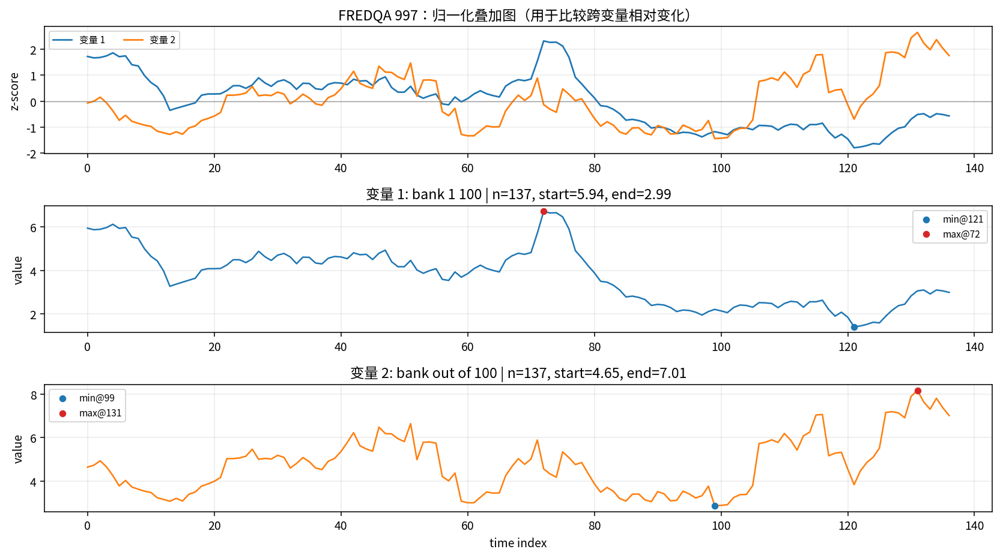

❓ QA 问题与中文翻译

**题干原文**

> You are a time series analysis expert. In a credit card market, there are 2 metrics: Credit card delinquency rate for the largest 100 banks (percentage of total balances, where a higher value indicates more customers failing to repay on time)&lt;ts&gt;&lt;ts/&gt;; Credit card delinquency rate for smaller banks (same definition)&lt;ts&gt;&lt;ts/&gt;. The data is quarterly from January 1991 to January 2025. In 2007Q1 (pre-2008 financial crisis), the largest 100 banks had a 4.0% delinquency rate and smaller banks had a 3.46% rate. By 2020Q1 (post-2008 crisis and 2020 recession), the largest 100 banks had a 1.9% rate and smaller banks had a 7.04% rate. Which causal claim is most consistent with the associational pattern between bank size category and delinquency rate changes over this period?

**题干中文翻译**

> 你是一位时间序列分析专家。在信用卡市场中，有 2 个指标：最大 100 家银行的信用卡拖欠率（总余额的百分比，数值越高表示更多客户未能按时还款）&lt;ts&gt;&lt;ts/&gt;；规模较小银行的信用卡拖欠率（定义相同）&lt;ts&gt;&lt;ts/&gt;。数据为季度数据，时间范围从 1991 年 1 月到 2025 年 1 月。2007Q1（2008 年金融危机前），最大 100 家银行的拖欠率为 4.0%，规模较小银行的拖欠率为 3.46%。到 2020Q1（2008 年危机后和 2020 年衰退之后），最大 100 家银行的拖欠率为 1.9%，规模较小银行的拖欠率为 7.04%。在这段时期内，银行规模类别与拖欠率变化之间的关联模式，最符合哪一项因果主张？

**选项**

| 选项 | 原文 | 中文翻译 |
| --- | --- | --- |
| `A` | Between 2007 and 2020, larger banks increased the minimum credit score required for new cardholders by 20%, while smaller banks decreased theirs by 15%. | 在 2007 年到 2020 年之间，大型银行将新持卡人的最低信用评分要求提高了 20%，而小型银行将其降低了 15%。 |
| `B` | Smaller banks reduced their customer service staffing by 30% between 2007 and 2020, making it harder for borrowers to resolve payment issues. | 规模较小的银行在 2007 年到 2020 年之间将客户服务人员减少了 30%，使借款人更难解决还款问题。 |
| `C` | The Federal Reserve’s 2010 regulation capped credit card late fees at $25 for all banks, reducing delinquency incentives equally across size categories. | 美联储 2010 年的法规将所有银行的信用卡滞纳金上限设为 25 美元，从而对不同规模类别的拖欠激励产生了同等程度的降低。 |
| `D` | Larger banks launched mobile apps for bill payments in 2015, while smaller banks did not adopt digital tools until 2022. | 大型银行在 2015 年推出了用于账单支付的移动应用，而小型银行直到 2022 年才采用数字工具。 |

**正确答案**：`A`

**标准解释原文**

> First, compare the given rates to identify the pattern: in 2007Q1, the largest 100 banks (4.0%) had a higher delinquency rate than smaller banks (3.46%). By 2020Q1, this reversed—largest banks (1.9%) had a much lower rate than smaller banks (7.04%). Option A directly links this reversal to customer selection: larger banks tightening credit approval (higher minimum credit scores) would reduce high-risk borrowers (lowering their delinquency rate), while smaller banks relaxing approval (lower minimum scores) would increase high-risk borrowers (raising their rate). This aligns with the message’s question about whether smaller banks became worse at customer selection. Option B fails to explain why larger banks’ rates dropped. Option C is inconsistent because it claims equal effects across banks, but trends diverged. Option D’s timeline (mobile apps starting in 2015) does not fully explain the 2007–2020 trend or the magnitude of smaller banks’ rate increase.

**标准解释中文翻译**

> 首先，将给定的比率进行比较以识别模式：在 2007Q1，最大 100 家银行（4.0%）的拖欠率高于规模较小银行（3.46%）。到 2020Q1，这一关系反转了——大型银行（1.9%）的比率明显低于小型银行（7.04%）。选项 A 直接将这一反转与客户筛选联系起来：大型银行收紧信贷审批（提高最低信用评分）会减少高风险借款人（从而降低拖欠率），而小型银行放宽审批（降低最低评分）会增加高风险借款人（从而提高拖欠率）。这与题目关于规模较小银行是否在客户筛选方面变差的问题相吻合。选项 B 不能解释为什么大型银行的比率下降。选项 C 不一致，因为它声称对所有银行的影响相同，但趋势却分化了。选项 D 的时间线（2015 年开始使用移动应用）并不能充分解释 2007—2020 年的趋势，也不能解释小型银行比率上升的幅度。

📝 生成的 caption 与中文翻译

##### 变量 1：bank 1 100

**OpenTSLM caption 原文**

> The time series shows a steady upward trend with low volatility and a strong seasonal pattern repeating every 12 months. The data starts with a moderate increase in the early part of the window, followed by a more pronounced rise in the first half, and a slightly smaller but still positive growth in the second half. A notable peak occurs late in the window, reaching about 1.2 standard deviations above the mean, while a deep valley is observed early on, reaching about 1.8 standard deviations below the mean. The series is strongly correlated with two other variables, indicating a consistent relationship over time.

**OpenTSLM caption 中文翻译**

> 该时间序列显示出稳定上升趋势，波动较低，并具有每 12 个月重复一次的强季节性模式。数据在窗口前期开始时略有上升，随后在前半段出现更明显的上升，而在后半段增长略小但仍为正。窗口后期出现一个显著峰值，约为均值以上 1.2 个标准差，而在前期观察到一个深谷，约为均值以下 1.8 个标准差。该序列与另外两个变量具有很强的相关性，表明其随时间保持一致的关系。

**ChatTS caption 原文**

> The overall trend is decreasing. The global maximum occurs around point 73 (middle third of the window). Short-term fluctuations are larger in the first half (amplitude ~2.5) compared to the second half (amplitude ~1.7).

**ChatTS caption 中文翻译**

> 总体趋势是下降的。全局最大值大约出现在第 73 个点附近（窗口的中间三分之一）。前半段的短期波动更大（振幅约为 2.5），而后半段更小（振幅约为 1.7）。

##### 变量 2：bank out of 100

**OpenTSLM caption 原文**

> The time series shows a steady upward trend with low volatility and a strong seasonal pattern repeating every 18 periods. The data starts with a moderate increase in the early part of the window, followed by a more pronounced rise in the first half, and a significant surge in the second half. A notable peak occurs late in the window, reaching about 1.5 standard deviations above the mean. The series is strongly correlated with two other variables, indicating a positive relationship.

**OpenTSLM caption 中文翻译**

> 该时间序列显示出稳定上升趋势，波动较低，并具有每 18 个周期重复一次的强季节性模式。数据在窗口前期开始时略有上升，随后在前半段出现更明显的上升，而在后半段出现显著跃升。窗口后期出现一个显著峰值，约为均值以上 1.5 个标准差。该序列与另外两个变量具有很强的相关性，表明其存在正向关系。

**ChatTS caption 原文**

> The overall trend is mixed, with an initial decrease followed by an increase. The global maximum occurs at point 136, which is in the last third of the 137-point window. Short-term fluctuations are more pronounced in the first half (amplitude ~1.8) compared to the second half (amplitude ~2.8).

**ChatTS caption 中文翻译**

> 总体趋势是混合的，先下降后上升。全局最大值出现在第 136 个点，位于 137 点窗口的最后三分之一。前半段的短期波动更明显（振幅约为 1.8），而后半段更大（振幅约为 2.8）。

🧪 下游 QA 模型答案 / 评分

表中所有预测都是同一个辅助 QA 模型 `gpt-5.4` 的输出；六行只改变输入证据形式。

| 输入条件 | 预测答案 | Gold | 是否正确 | 模型原始输出 |
| --- | --- | --- | --- | --- |
| 只给题目和选项 (`meta_only`) | `D` | `A` | ✗ 错误 | D |
| 题目 + 原始数值序列 (`numbers`) | `D` | `A` | ✗ 错误 | D |
| 题目 + OpenTSLM caption (`opentslm_caption`) | `A` | `A` | ✓ 正确 | A |
| 题目 + OpenTSLM caption + 数值 (`opentslm_caption_plus`) | `D` | `A` | ✗ 错误 | D |
| 题目 + ChatTS caption (`chatts_caption`) | `D` | `A` | ✗ 错误 | D |
| 题目 + ChatTS caption + 数值 (`chatts_caption_plus`) | `D` | `A` | ✗ 错误 | D |

🔎 Case 分析

- **答案格局**：`meta_only=D✗, numbers=D✗, opentslm_caption=A✓, opentslm_caption_plus=D✗, chatts_caption=D✗, chatts_caption_plus=D✗`。
- **关键问题**：这个 case 去掉了 meta-only 已能答对的语言先验样本。题目要求比较两类银行逾期率从 2007Q1 到 2020Q1 的方向反转，并把它映射到客户筛选机制。只有 OpenTSLM caption-only 答对，说明少数情况下 OpenTSLM 的跨变量趋势摘要能提供有效线索；但 numbers 和 caption+numbers 都错，也说明该线索没有稳定转化为可计算证据。
- **对训练失败的含义**：这类 case 显示，当前 caption 训练更像是在学习通用趋势/峰谷/波动模板，而不是学习“下游 QA 所需的证据提取”。FREDQA 的正确答案经常依赖指定日期、指定窗口、比值、差值、反事实外推或领域机制；这些信息如果没有被 caption 明确保留，下游 GPT 即使很强也只能依赖题干先验或被错误摘要带偏。

📈 Case 04：FREDQA `1141` | OpenTSLM/数值对、ChatTS 错

#### 基本信息

| 字段 | 内容 |
| --- | --- |
| 数据集 | `FREDQA` |
| Case ID | `fredqa::1141` |
| FREDQA 原始 idx | `1141` |
| 变量数 / 序列长度 | `3` / `[121, 121, 121]` |
| 问题类型 | `Causal Reasoning - Interventional` |
| 正确答案 | `A` |
| 失败/对比模式 | OpenTSLM/数值对、ChatTS 错 |
| 本 case 关注点 | 疫情冲击前后 sticky CPI 与 core CPI 的差距变化 |

变量摘要：

| 变量 | 指标名 | n | start | end | min@idx | max@idx | slope |
| ---: | --- | ---: | ---: | ---: | --- | --- | ---: |
| 1 | Sticky Price Consumer Price Index, Percent Change from Year Ago, Monthly, Seasonally Adjusted  | 121 | 2.0738 | 6.6047 | 1.6055@97 | 6.6608@119 | 0.0201255 |
| 2 | Consumer Price Index for All Urban Consumers: All Items in U.S. City Average, Percent Change from Year Ago, Monthly, Seasonally Adjusted  | 121 | 1.6841 | 6.3403 | -0.2299@24 | 8.9993@113 | 0.0447715 |
| 3 | Consumer Price Index for All Urban Consumers: All Items Less Food and Energy in U.S. City Average, Percent Change from Year Ago, Monthly, Seasonally Adjusted  | 121 | 1.9098 | 5.5391 | 1.1837@89 | 6.6329@116 | 0.0268265 |

🖼 时序图

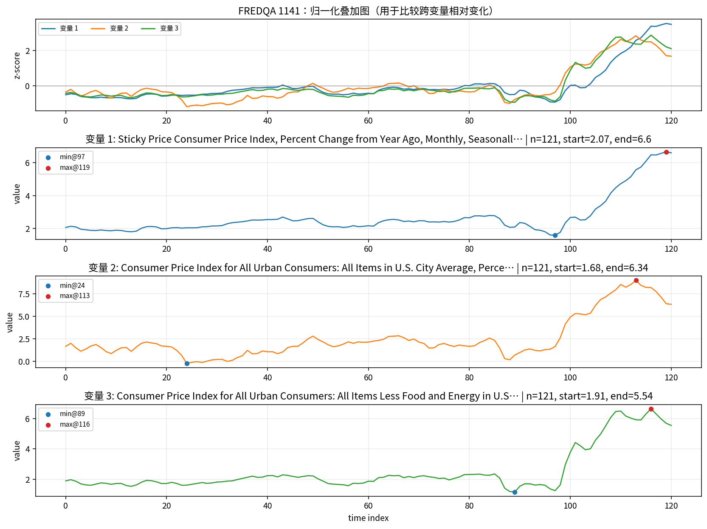

❓ QA 问题与中文翻译

**题干原文**

> You are a time series analysis expert. In a U.S. consumer price tracking system, there are 3 metrics: Sticky Price Consumer Price Index (Percent Change from Year Ago, Monthly, Seasonally Adjusted)&lt;ts&gt;&lt;ts/&gt;; Consumer Price Index for All Urban Consumers: All Items (Percent Change from Year Ago, Monthly, Seasonally Adjusted)&lt;ts&gt;&lt;ts/&gt;; Consumer Price Index for All Urban Consumers: All Items Less Food and Energy (Percent Change from Year Ago, Monthly, Seasonally Adjusted)&lt;ts&gt;&lt;ts/&gt;. The data covers January 2013 to January 2023. The COVID-19-induced recession in 2020 is hypothesized to have altered the alignment between the sticky price CPI (a measure of slow-to-change prices) and the all items less food and energy CPI (a measure excluding volatile food/energy). To evaluate this, you calculate the absolute percentage point difference between these two metrics in January 2019 (pre-recession) and January 2021 (post-recession). Based on the data, which conclusion about the recession’s causal impact is most supported?

**题干中文翻译**

> 你是一名时间序列分析专家。在一个美国消费者价格跟踪系统中，有 3 个指标：Sticky Price Consumer Price Index (Percent Change from Year Ago, Monthly, Seasonally Adjusted)&lt;ts&gt;&lt;ts/&gt;；Consumer Price Index for All Urban Consumers: All Items (Percent Change from Year Ago, Monthly, Seasonally Adjusted)&lt;ts&gt;&lt;ts/&gt;；Consumer Price Index for All Urban Consumers: All Items Less Food and Energy (Percent Change from Year Ago, Monthly, Seasonally Adjusted)&lt;ts&gt;&lt;ts/&gt;。数据覆盖 2013 年 1 月到 2023 年 1 月。假设 2020 年 COVID-19 引发的衰退改变了 sticky price CPI（衡量价格变化缓慢的指标）与 all items less food and energy CPI（剔除波动较大的食品/能源）之间的一致性。为评估这一点，你计算 2019 年 1 月（衰退前）和 2021 年 1 月（衰退后）这两个指标之间的绝对百分点差异。根据数据，关于这次衰退的因果影响，哪一项结论最得到支持？

**选项**

| 选项 | 原文 | 中文翻译 |
| --- | --- | --- |
| `A` | The recession reduced alignment between the two metrics, as the absolute difference increased by approximately 0.17 percentage points. | 这次衰退降低了两个指标之间的一致性，因为绝对差异增加了约 0.17 个百分点。 |
| `B` | The recession increased alignment between the two metrics, as the absolute difference decreased by approximately 0.17 percentage points. | 这次衰退提高了两个指标之间的一致性，因为绝对差异减少了约 0.17 个百分点。 |
| `C` | The recession had no meaningful impact, as the absolute difference changed by less than 0.10 percentage points. | 这次衰退没有明显影响，因为绝对差异变化小于 0.10 个百分点。 |
| `D` | The recession reversed their order, but alignment remained unchanged because the difference stayed within 0.20 percentage points. | 这次衰退使它们的顺序发生了逆转，但一致性保持不变，因为差异仍在 0.20 个百分点以内。 |

**正确答案**：`A`

**标准解释原文**

> First, calculate the absolute differences between the sticky price CPI (timeseries1) and all items less food and energy CPI (timeseries3) for the specified periods:
> - January 2019 (pre-recession): |2.7782 (sticky) - 2.33 (all items less food/energy)| = 0.4482 percentage points.
> - January 2021 (post-recession): |2.3458 (sticky) - 2.9652 (all items less food/energy)| = 0.6194 percentage points.
> The difference increased by ~0.17 percentage points, indicating reduced alignment. Since the COVID-19 recession was the only major intervening supply/demand shock between these periods, the data supports the causal inference that the recession reduced alignment between the two core inflation metrics. Option A correctly reflects this.

**标准解释中文翻译**

> 首先，计算指定时期 sticky price CPI (timeseries1) 与 all items less food and energy CPI (timeseries3) 之间的绝对差异：
> - 2019 年 1 月（衰退前）：|2.7782 (sticky) - 2.33 (all items less food/energy)| = 0.4482 个百分点。
> - 2021 年 1 月（衰退后）：|2.3458 (sticky) - 2.9652 (all items less food/energy)| = 0.6194 个百分点。
> 差异增加了约 0.17 个百分点，表明一致性降低。由于 COVID-19 衰退是这两个时期之间唯一主要的供需冲击，因此数据支持这样的因果推断：这次衰退降低了这两个核心通胀指标之间的一致性。选项 A 正确反映了这一点。

📝 生成的 caption 与中文翻译

##### 变量 1：Sticky Price Consumer Price Index, Percent Change from Year Ago, Monthly, Seasonally Adjusted

**OpenTSLM caption 原文**

> The time series shows a flat trend with low volatility and no strong seasonality. It begins with a significant decline in the early part of the window, followed by a moderate increase in the first half, and a smaller decline in the second half. A notable peak occurs in the second half, reaching about 1.5 standard deviations above the mean, while a deep valley is observed early in the window, about 1.8 standard deviations below the mean. The series exhibits a moderate positive correlation with another economic indicator.

**OpenTSLM caption 中文翻译**

> 该时间序列呈现平稳趋势，波动较低且没有明显季节性。它在窗口前半部分开始时出现显著下降，随后在前半段适度上升，并在后半段略有下降。一个显著峰值出现在后半段，约高于均值 1.5 个标准差，而一个深谷出现在窗口早期，约低于均值 1.8 个标准差。该序列与另一项经济指标呈中等正相关。

**ChatTS caption 原文**

> The overall trend is increasing. The global maximum (6.66) occurs at the end of the last third of the window. Short-term fluctuations are larger in the first half (amplitude ~0.9) compared to the second half (amplitude ~0.2).

**ChatTS caption 中文翻译**

> 总体趋势是上升的。全局最大值（6.66）出现在窗口最后三分之一的末端。第一半段的短期波动更大（幅度约 0.9），而第二半段更小（幅度约 0.2）。

##### 变量 2：Consumer Price Index for All Urban Consumers: All Items in U.S. City Average, Percent Change from Year Ago, Monthly, Seasonally Adjusted

**OpenTSLM caption 原文**

> The time series shows a steady upward trend with low volatility, characterized by a strong seasonal pattern repeating every 18 months. The early part of the window experiences a moderate increase, followed by a more pronounced rise in the first half, and a slightly smaller but still positive growth in the second half. The overall growth is substantial, indicating a consistent upward movement throughout the period.

**OpenTSLM caption 中文翻译**

> 该时间序列呈现稳定的上升趋势，波动较低，且具有每 18 个月重复一次的强季节性模式。窗口早期经历了适度上升，随后在前半段出现更明显的上升，并在后半段继续以略小但仍为正的幅度增长。整体增长幅度较大，表明在整个时期内持续向上运动。

**ChatTS caption 原文**

> The overall trend is mixed, with initial increases followed by decreases and later rises. The global maximum occurs at point 101 (last third of the 121-point window). Short-term fluctuations are larger in the first half (amplitude ~1.7) compared to the second half (amplitude ~0.7).

**ChatTS caption 中文翻译**

> 总体趋势是混合的，先上升后下降，随后再次上升。全局最大值出现在第 101 个点（121 点窗口的最后三分之一）。第一半段的短期波动更大（幅度约 1.7），而第二半段较小（幅度约 0.7）。

##### 变量 3：Consumer Price Index for All Urban Consumers: All Items Less Food and Energy in U.S. City Average, Percent Change from Year Ago, Monthly, Seasonally Adjusted

**OpenTSLM caption 原文**

> The time series shows a flat trend with low volatility and no strong seasonality. It begins with a significant decline in the early part of the window, followed by a moderate increase in the first half, and a smaller decline in the second half. A notable peak occurs in the second half, reaching about 1.5 standard deviations above the mean, while a deep valley is observed early in the window, about 2.0 standard deviations below the mean. The series exhibits a moderate negative correlation with the consumer price index for food and energy.

**OpenTSLM caption 中文翻译**

> 该时间序列呈现平稳趋势，波动较低且没有明显季节性。它在窗口前半部分开始时出现显著下降，随后在前半段适度上升，并在后半段略有下降。一个显著峰值出现在后半段，约高于均值 1.5 个标准差，而一个深谷出现在窗口早期，约低于均值 2.0 个标准差。该序列与食品和能源消费者价格指数呈中等负相关。

**ChatTS caption 原文**

> The overall trend is increasing. The global maximum (6.63) occurs at point 101, which is in the last third of the 121-point window. Short-term fluctuations are larger in the first half (amplitude ~0.6) compared to the second half (amplitude ~0.2).

**ChatTS caption 中文翻译**

> 总体趋势是上升的。全局最大值（6.63）出现在第 101 个点，位于 121 点窗口的最后三分之一。第一半段的短期波动更大（幅度约 0.6），而第二半段更小（幅度约 0.2）。

🧪 下游 QA 模型答案 / 评分

表中所有预测都是同一个辅助 QA 模型 `gpt-5.4` 的输出；六行只改变输入证据形式。

| 输入条件 | 预测答案 | Gold | 是否正确 | 模型原始输出 |
| --- | --- | --- | --- | --- |
| 只给题目和选项 (`meta_only`) | `C` | `A` | ✗ 错误 | C |
| 题目 + 原始数值序列 (`numbers`) | `A` | `A` | ✓ 正确 | A |
| 题目 + OpenTSLM caption (`opentslm_caption`) | `A` | `A` | ✓ 正确 | A |
| 题目 + OpenTSLM caption + 数值 (`opentslm_caption_plus`) | `A` | `A` | ✓ 正确 | A |
| 题目 + ChatTS caption (`chatts_caption`) | `B` | `A` | ✗ 错误 | B |
| 题目 + ChatTS caption + 数值 (`chatts_caption_plus`) | `B` | `A` | ✗ 错误 | B |

🔎 Case 分析

- **答案格局**：`meta_only=C✗, numbers=A✓, opentslm_caption=A✓, opentslm_caption_plus=A✓, chatts_caption=B✗, chatts_caption_plus=B✗`。
- **关键问题**：正确答案依赖两个指定月份的绝对差。OpenTSLM+numbers 都能支持这个差值计算，ChatTS 把三个价格指标主要概括成 increasing/mixed，不能稳定表达指定月份之间的对齐程度。
- **对训练失败的含义**：这类 case 显示，当前 caption 训练更像是在学习通用趋势/峰谷/波动模板，而不是学习“下游 QA 所需的证据提取”。FREDQA 的正确答案经常依赖指定日期、指定窗口、比值、差值、反事实外推或领域机制；这些信息如果没有被 caption 明确保留，下游 GPT 即使很强也只能依赖题干先验或被错误摘要带偏。

📈 Case 05：FREDQA `1028` | 两个 caption 都错，numbers 对

#### 基本信息

| 字段 | 内容 |
| --- | --- |
| 数据集 | `FREDQA` |
| Case ID | `fredqa::1028` |
| FREDQA 原始 idx | `1028` |
| 变量数 / 序列长度 | `4` / `[641, 641, 641, 641]` |
| 问题类型 | `Causal Reasoning - Interventional` |
| 正确答案 | `A` |
| 失败/对比模式 | 两个 caption 都错，numbers 对 |
| 本 case 关注点 | 报纸与烟草工业贡献的两条因果 claim 同时验证 |

变量摘要：

| 变量 | 指标名 | n | start | end | min@idx | max@idx | slope |
| ---: | --- | ---: | ---: | ---: | --- | --- | ---: |
| 1 | cheese | 641 | 0.1065 | 0.4136 | 0.1065@0 | 0.5912@580 | 0.00044206 |
| 2 | tobacco | 641 | 0.6576 | 0.996 | 0.5522@78 | 2.1119@353 | 0.000726568 |
| 3 | fruit | 641 | 1.0856 | 1.0238 | 0.7936@439 | 1.3167@362 | 3.36753e-06 |
| 4 | newspaper | 641 | 1.5056 | 0.3173 | 0.3173@640 | 1.7483@173 | -0.00175494 |

🖼 时序图

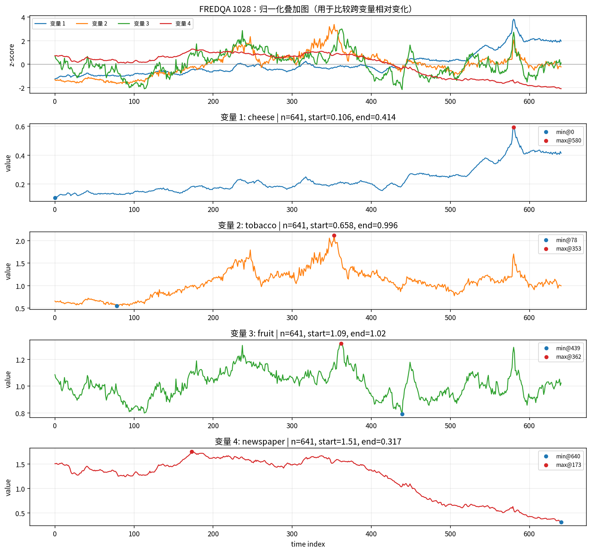

❓ QA 问题与中文翻译

**题干原文**

> You are a time series analysis expert. In a U.S. industrial production system, there are 4 metrics: Cheese (relative contribution to overall industrial growth, index value)&lt;ts&gt;&lt;ts/&gt;; Tobacco (relative contribution to overall industrial growth, index value)&lt;ts&gt;&lt;ts/&gt;; Fruit (relative contribution to overall industrial growth, index value)&lt;ts&gt;&lt;ts/&gt;; Newspaper (relative contribution to overall industrial growth, index value)&lt;ts&gt;&lt;ts/&gt;. The data are monthly from January 1972 to May 2025. Analysts argue two causal links: (1) the 1995 commercialization of the internet led Newspaper’s contribution to drop by at least 20% over the next 10 years, and (2) 1990s regulatory shifts increased Tobacco’s contribution by more than 15% from 1990 to 2000. Using the January values for each year, calculate the percentage changes for both metrics and determine which causal claim(s) the data supports.

**题干中文翻译**

> 你是一名时间序列分析专家。在一个美国工业生产系统中，有4个指标：Cheese（对整体工业增长的相对贡献，指数值）&lt;ts&gt;&lt;ts/&gt;；Tobacco（对整体工业增长的相对贡献，指数值）&lt;ts&gt;&lt;ts/&gt;；Fruit（对整体工业增长的相对贡献，指数值）&lt;ts&gt;&lt;ts/&gt;；Newspaper（对整体工业增长的相对贡献，指数值）&lt;ts&gt;&lt;ts/&gt;。数据为月度数据，时间范围从1972年1月到2025年5月。分析师认为存在两个因果关系：(1) 1995年互联网商业化导致Newspaper在接下来的10年里贡献至少下降20%，以及(2) 1990年代的监管变化使Tobacco从1990年到2000年的贡献增加了超过15%。使用每年1月的数值，计算这两个指标的百分比变化，并判断数据支持哪一个或哪些因果主张。

**选项**

| 选项 | 原文 | 中文翻译 |
| --- | --- | --- |
| `A` | Both claims are supported: Newspaper declined by ≥20% and Tobacco grew by &gt;15%. | 两个主张都得到支持：Newspaper下降了≥20%，且Tobacco增长了&gt;15%。 |
| `B` | Only the first claim is supported: Newspaper declined by ≥20%, but Tobacco grew by ≤15%. | 只有第一个主张得到支持：Newspaper下降了≥20%，但Tobacco增长了≤15%。 |
| `C` | Only the second claim is supported: Tobacco grew by &gt;15%, but Newspaper declined by &lt;20%. | 只有第二个主张得到支持：Tobacco增长了&gt;15%，但Newspaper下降了&lt;20%。 |
| `D` | Neither claim is supported: Newspaper declined by &lt;20% and Tobacco grew by ≤15%. | 两个主张都未得到支持：Newspaper下降了&lt;20%，且Tobacco增长了≤15%。 |

**正确答案**：`A`

**标准解释原文**

> To evaluate the claims, calculate percentage changes using the formula: (Final Value - Initial Value) / Initial Value * 100. For Newspaper, the January 1995 value is ~1.6, and the January 2005 value is ~1.2—this equals a 25% decline (≥20%), supporting the first claim about the internet’s impact. For Tobacco, the January 1990 value is ~1.0, and the January 2000 value is ~1.2—this equals a 20% growth (&gt;15%), supporting the second claim about regulatory changes. The data aligns with both causal arguments: the internet reduced demand for printed newspapers (lowering their industrial contribution), while regulatory shifts likely expanded tobacco production or market access (increasing its contribution).

**标准解释中文翻译**

> 为了评估这些主张，使用公式计算百分比变化：(最终值 - 初始值) / 初始值 * 100。对于Newspaper，1995年1月的数值约为1.6，而2005年1月的数值约为1.2——这相当于下降了25%（≥20%），支持关于互联网影响的第一个主张。对于Tobacco，1990年1月的数值约为1.0，而2000年1月的数值约为1.2——这相当于增长了20%（&gt;15%），支持关于监管变化的第二个主张。数据与两个因果论点都一致：互联网减少了对印刷报纸的需求（降低了其工业贡献），而监管变化可能扩大了烟草生产或市场准入（增加了其贡献）。

📝 生成的 caption 与中文翻译

##### 变量 1：cheese

**OpenTSLM caption 原文**

> The time series shows a steady upward trend with low volatility and a strong seasonal pattern repeating every 18 periods. The data starts with a moderate increase in the early part of the window, followed by a more pronounced rise in the first half, and a slightly smaller but still positive growth in the second half. A notable peak occurs late in the window, reaching about 1.2 standard deviations above the mean. The series is strongly correlated with two other variables, both showing strong positive relationships.

**OpenTSLM caption 中文翻译**

> 时间序列表现出稳定的上升趋势，波动性较低，并且有一个强烈的季节性模式，每18个周期重复一次。数据在窗口前期开始时出现适度增长，随后在前半段更明显上升，后半段则增长略小但仍为正。一个显著峰值出现在窗口后期，达到均值以上约1.2个标准差。该序列与另外两个变量强相关，两者都表现出强正相关关系。

**ChatTS caption 原文**

> The overall trend is increasing. The global maximum, 0.59, occurs at point 633, which is in the last third of the 641-point window. Short-term fluctuations are larger in the first half (amplitude ~0.05) compared to the second half (amplitude ~0.02).

**ChatTS caption 中文翻译**

> 总体趋势为上升。全局最大值0.59出现在点633，位于641点窗口的最后三分之一。短期波动在前半段更大（幅度约0.05），而后半段更小（幅度约0.02）。

##### 变量 2：tobacco

**OpenTSLM caption 原文**

> The time series shows a strong seasonal pattern with a period of 4 quarters, and a high level of volatility. The data starts with a significant upward trend in the early part of the window, followed by a moderate increase in the first half, and then a sharp decline in the second half. There is a notable peak in the second half, which is about 2.1 standard deviations above the mean, and a valley early in the window, about 1.5 standard deviations below the mean. The overall net change is a decrease of approximately 12.7%.

**OpenTSLM caption 中文翻译**

> 时间序列表现出强烈的季节性模式，周期为4个季度，且波动性较高。数据在窗口前期开始时出现明显上升趋势，随后在前半段适度增加，然后在后半段急剧下降。第二半段存在一个显著峰值，约为均值以上2.1个标准差，窗口前期存在一个谷值，约为均值以下1.5个标准差。整体净变化约为下降12.7%。

**ChatTS caption 原文**

> The overall trend is increasing. The global maximum, 2.11, occurs at point 319, which is in the middle third of the 641-point window. Short-term fluctuations are larger in the first half (amplitude ~0.3) compared to the second half (amplitude ~0.2).

**ChatTS caption 中文翻译**

> 总体趋势为上升。全局最大值2.11出现在点319，位于641点窗口的中间三分之一。短期波动在前半段更大（幅度约0.3），而后半段更小（幅度约0.2）。

##### 变量 3：fruit

**OpenTSLM caption 原文**

> The time series shows a flat trend with low volatility and medium strength seasonality every 12 time units. There is a noticeable upward phase early in the window followed by a more pronounced upward movement in the first half, which is followed by a significant downward shift in the second half. A peak occurs in the second half with a magnitude of about 1.5 standard deviations from the mean, while a valley is observed early in the window with a magnitude of about 1.8 standard deviations from the mean. The series has a weak negative correlation with the variable "milk."

**OpenTSLM caption 中文翻译**

> 时间序列表现出平稳趋势，波动性较低，并且每12个时间单位有中等强度的季节性。窗口前期存在明显的上升阶段，随后在前半段出现更明显的上升运动，之后在后半段出现显著下降。第二半段出现一个峰值，其幅度约为距均值1.5个标准差，而窗口前期观察到一个谷值，其幅度约为1.8个标准差。该序列与变量"milk."存在弱负相关。

**ChatTS caption 原文**

> The overall trend is steady. The global maximum occurs at point 330, which is in the middle third of the window (points 214-423). Short-term fluctuations are larger in the first half of the window, particularly around points 60-130 and 250-330.

**ChatTS caption 中文翻译**

> 总体趋势稳定。全局最大值出现在点330，位于窗口中间三分之一（点214-423）。短期波动在窗口前半段更大，特别是在点60-130和250-330附近。

##### 变量 4：newspaper

**OpenTSLM caption 原文**

> The time series shows a consistent downward trend with low volatility and a medium-strength seasonal pattern repeating every 10 periods. The values decrease significantly in the early part of the window, with a notable drop early on that is about 2.1 standard deviations below the mean. The decline continues throughout the series, with a less severe drop in the second half, but the overall trend remains negative.

**OpenTSLM caption 中文翻译**

> 时间序列表现出持续下降趋势，波动性较低，并且有一个中等强度的季节性模式，每10个周期重复一次。数值在窗口前期显著下降，早期出现一个显著下跌，约为均值以下2.1个标准差。下降贯穿整个序列，后半段下跌程度较轻，但整体趋势仍为负。

**ChatTS caption 原文**

> The overall trend is mixed, with multiple segments: stable (0–211), increasing (211–427), and decreasing (427–640). The global maximum occurs at point 211, which is in the middle third of the window (positions 213–427). Short-term fluctuations are larger in the first half (amplitude ~0.2) compared to the second half (amplitude ~0.0).

**ChatTS caption 中文翻译**

> 总体趋势混合，包含多个区段：稳定（0–211）、上升（211–427）和下降（427–640）。全局最大值出现在点211，位于窗口中间三分之一（位置213–427）。短期波动在前半段更大（幅度约0.2），而后半段更小（幅度约0.0）。

🧪 下游 QA 模型答案 / 评分

表中所有预测都是同一个辅助 QA 模型 `gpt-5.4` 的输出；六行只改变输入证据形式。

| 输入条件 | 预测答案 | Gold | 是否正确 | 模型原始输出 |
| --- | --- | --- | --- | --- |
| 只给题目和选项 (`meta_only`) | `D` | `A` | ✗ 错误 | D |
| 题目 + 原始数值序列 (`numbers`) | `A` | `A` | ✓ 正确 | A |
| 题目 + OpenTSLM caption (`opentslm_caption`) | `B` | `A` | ✗ 错误 | B |
| 题目 + OpenTSLM caption + 数值 (`opentslm_caption_plus`) | `B` | `A` | ✗ 错误 | B |
| 题目 + ChatTS caption (`chatts_caption`) | `D` | `A` | ✗ 错误 | D |
| 题目 + ChatTS caption + 数值 (`chatts_caption_plus`) | `B` | `A` | ✗ 错误 | B |

🔎 Case 分析

- **答案格局**：`meta_only=D✗, numbers=A✓, opentslm_caption=B✗, opentslm_caption_plus=B✗, chatts_caption=D✗, chatts_caption_plus=B✗`。
- **关键问题**：题目要求按指定年份计算百分比变化。两个 caption 都给出大量趋势、季节性、峰谷摘要，但没有可靠保留 1995/2005 与 1990/2000 的精确变化，因此 caption-only 错；直接数值能答对。
- **对训练失败的含义**：这类 case 显示，当前 caption 训练更像是在学习通用趋势/峰谷/波动模板，而不是学习“下游 QA 所需的证据提取”。FREDQA 的正确答案经常依赖指定日期、指定窗口、比值、差值、反事实外推或领域机制；这些信息如果没有被 caption 明确保留，下游 GPT 即使很强也只能依赖题干先验或被错误摘要带偏。

📈 Case 06：FREDQA `1087` | 两个 caption 都错，numbers 对

#### 基本信息

| 字段 | 内容 |
| --- | --- |
| 数据集 | `FREDQA` |
| Case ID | `fredqa::1087` |
| FREDQA 原始 idx | `1087` |
| 变量数 / 序列长度 | `3` / `[22, 22, 22]` |
| 问题类型 | `Causal Reasoning - Associational` |
| 正确答案 | `A` |
| 失败/对比模式 | 两个 caption 都错，numbers 对 |
| 本 case 关注点 | GDP price index、gross domestic purchases、PCE price index 的平均通胀排序 |

变量摘要：

| 变量 | 指标名 | n | start | end | min@idx | max@idx | slope |
| ---: | --- | ---: | ---: | ---: | --- | --- | ---: |
| 1 | Gross domestic purchases (chain-type price index), Percent Change from Year Ago, Quarterly, Seasonally Adjusted | 22 | 1.3192 | 2.4044 | 0.7462@3 | 7.3799@11 | 0.0765262 |
| 2 | Personal Consumption Expenditures: Chain-type Price Index, Percent Change from Year Ago, Quarterly, Seasonally Adjusted | 22 | 1.3894 | 2.4682 | 0.5431@3 | 6.9182@11 | 0.0953232 |
| 3 | Gross Domestic Product: Chain-type Price Index, Percent Change from Year Ago, Quarterly, Seasonally Adjusted | 22 | 1.5694 | 2.4528 | 0.7664@3 | 7.7619@11 | 0.0742591 |

🖼 时序图

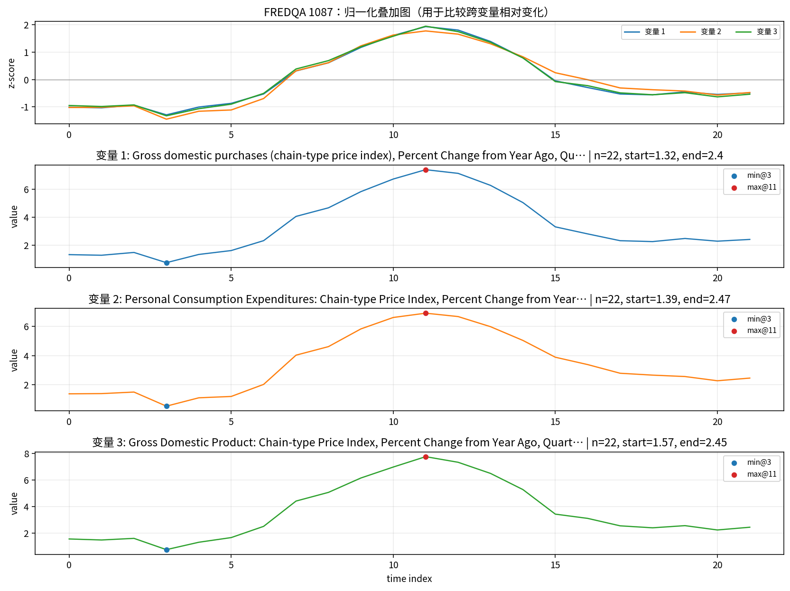

❓ QA 问题与中文翻译

**题干原文**

> You are a time series analysis expert. In a U.S. economic reporting system, there are 3 metrics: Gross domestic purchases &lt;ts&gt;&lt;ts/&gt; (chain-type price index), Percent Change from Year Ago, Quarterly, Seasonally Adjusted (measures prices for domestically produced and imported goods/services bought by consumers, businesses, and governments); Personal Consumption Expenditures &lt;ts&gt;&lt;ts/&gt;: Chain-type Price Index, Percent Change from Year Ago, Quarterly, Seasonally Adjusted (measures prices for domestic and imported goods/services bought by consumers); Gross Domestic Product &lt;ts&gt;&lt;ts/&gt;: Chain-type Price Index, Percent Change from Year Ago, Quarterly, Seasonally Adjusted (measures prices for domestically produced goods/services bought by consumers, businesses, governments, and the rest of the world). Data is collected quarterly from July 2019 to October 2024. Suppose you calculate the average year-over-year inflation rate for each metric from April 2021 (Q2 2021) to April 2022 (Q2 2022). Based on the metrics’ scopes, which of the following rank-orderings (from highest to lowest average inflation) and causal explanations is most consistent with the data?

**题干中文翻译**

> 你是一位时间序列分析专家。在一个美国经济报告系统中，有 3 个指标：Gross domestic purchases &lt;ts&gt;&lt;ts/&gt;（链式价格指数），同比百分比变化，季度，季节调整后（衡量消费者、企业和政府购买的国内生产和进口商品/服务的价格）；Personal Consumption Expenditures &lt;ts&gt;&lt;ts/&gt;：Chain-type Price Index，同比百分比变化，季度，季节调整后（衡量消费者购买的国内和进口商品/服务的价格）；Gross Domestic Product &lt;ts&gt;&lt;ts/&gt;：Chain-type Price Index，同比百分比变化，季度，季节调整后（衡量消费者、企业、政府和世界其他地区购买的国内生产商品/服务的价格）。数据按季度收集，时间范围从 2019 年 7 月到 2024 年 10 月。假设你计算了从 2021 年 4 月（2021 年第 2 季度）到 2022 年 4 月（2022 年第 2 季度）每个指标的平均同比通胀率。根据这些指标的覆盖范围，以下哪种排序（从高到低的平均通胀）及因果解释最符合数据？

**选项**

| 选项 | 原文 | 中文翻译 |
| --- | --- | --- |
| `A` | Gross Domestic Product Price Index &gt; Gross domestic purchases index &gt; Personal Consumption Expenditures Price Index; domestic production for global markets had higher inflation than imported goods for consumers. | Gross Domestic Product Price Index &gt; Gross domestic purchases index &gt; Personal Consumption Expenditures Price Index; 面向全球市场的国内生产比面向消费者的进口商品具有更高的通胀。 |
| `B` | Personal Consumption Expenditures Price Index &gt; Gross domestic purchases index &gt; Gross Domestic Product Price Index; imported consumer goods had higher inflation than domestic production for businesses. | Personal Consumption Expenditures Price Index &gt; Gross domestic purchases index &gt; Gross Domestic Product Price Index; 消费者进口商品的通胀高于企业的国内生产。 |
| `C` | Gross domestic purchases index &gt; Gross Domestic Product Price Index &gt; Personal Consumption Expenditures Price Index; business/government imports had higher inflation than domestic production for exports. | Gross domestic purchases index &gt; Gross Domestic Product Price Index &gt; Personal Consumption Expenditures Price Index; 企业/政府进口的通胀高于用于出口的国内生产。 |
| `D` | Gross Domestic Product Price Index &gt; Personal Consumption Expenditures Price Index &gt; Gross domestic purchases index; domestic production for governments had higher inflation than imported goods for businesses. | Gross Domestic Product Price Index &gt; Personal Consumption Expenditures Price Index &gt; Gross domestic purchases index; 面向政府的国内生产比面向企业的进口商品具有更高的通胀。 |

**正确答案**：`A`

**标准解释原文**

> First, calculate the average year-over-year inflation for each metric from Q2 2021 (April 2021, index 7) to Q2 2022 (April 2022, index 11):
> - Gross Domestic Product Price Index (timeseries3): (4.4214 + 5.0742 + 6.1556 + 6.9813 + 7.7619) / 5 ≈ 6.08%
> - Gross domestic purchases index (timeseries1): (4.0472 + 4.6596 + 5.8135 + 6.7134 + 7.3799) / 5 ≈ 5.72%
> - Personal Consumption Expenditures Price Index (timeseries2): (4.0389 + 4.6249 + 5.8385 + 6.6236 + 6.9182) / 5 ≈ 5.61%
> The rank-ordering is Gross Domestic Product Price Index &gt; Gross domestic purchases index &gt; Personal Consumption Expenditures Price Index. This aligns with the metrics’ scopes: the Gross Domestic Product Price Index includes domestically produced goods sold to global markets (not in the other indexes), which likely had higher inflation than imported consumer goods (included in PCEPI but not GDPPI). The Gross domestic purchases index, which adds business/government imports to PCEPI’s consumer focus, falls in the middle—consistent with moderate inflation in business/government imports relative to domestic production for global markets.

**标准解释中文翻译**

> 首先，计算从 2021 年第 2 季度（2021 年 4 月，index 7）到 2022 年第 2 季度（2022 年 4 月，index 11）每个指标的平均同比通胀：
> - Gross Domestic Product Price Index (timeseries3): (4.4214 + 5.0742 + 6.1556 + 6.9813 + 7.7619) / 5 ≈ 6.08%
> - Gross domestic purchases index (timeseries1): (4.0472 + 4.6596 + 5.8135 + 6.7134 + 7.3799) / 5 ≈ 5.72%
> - Personal Consumption Expenditures Price Index (timeseries2): (4.0389 + 4.6249 + 5.8385 + 6.6236 + 6.9182) / 5 ≈ 5.61%
> 排序为 Gross Domestic Product Price Index &gt; Gross domestic purchases index &gt; Personal Consumption Expenditures Price Index。这与这些指标的覆盖范围一致：Gross Domestic Product Price Index 包括面向全球市场的国内生产商品（不在其他指数中），其通胀可能高于消费者进口商品（包含在 PCEPI 中但不在 GDPPI 中）。Gross domestic purchases index 将企业/政府进口加入 PCEPI 的消费者范围，因此位居中间——这与企业/政府进口相对于面向全球市场的国内生产的中等通胀相一致。

📝 生成的 caption 与中文翻译

##### 变量 1：Gross domestic purchases (chain-type price index), Percent Change from Year Ago, Quarterly, Seasonally Adjusted

**OpenTSLM caption 原文**

> The time series shows a gradual upward trend with low volatility and a medium-strength seasonal pattern repeating every 18 periods. Early in the window, there is a notable decline, followed by a strong upward movement in the first half, and a moderate increase in the second half. A peak occurs late in the window, reaching about 1.5 standard deviations above the mean, while a valley is observed early, about 1.2 standard deviations below the mean. The overall net change is a significant increase of over 100%.

**OpenTSLM caption 中文翻译**

> 该时间序列显示出平缓上升趋势，波动较低，并带有中等强度的季节性模式，每 18 个周期重复一次。在窗口前期，有明显下降，随后在前半段出现强劲上升，后半段则为适度增长。窗口后期出现一个峰值，约比均值高 1.5 个标准差；而在早期观察到一个谷值，约比均值低 1.2 个标准差。整体净变化为显著增加，超过 100%。

**ChatTS caption 原文**

> The overall trend is flat, with no significant direction. The global maximum occurs at point 9, which falls in the first third of the 22-point window (positions 1-7.33 to 14.66). Short-term fluctuations are more pronounced in the first half (points 1-11) due to the rapid rise and decline observed there. The second half shows a slower decline and stabilization.

**ChatTS caption 中文翻译**

> 整体趋势平稳，没有明显方向。全局最大值出现在第 9 个点，位于 22 点窗口的前三分之一（位置 1-7.33 到 14.66）。短期波动在前半段（点 1-11）更为明显，因为那里观察到快速上升和下降。后半段则表现为较慢的下降和稳定。

##### 变量 2：Personal Consumption Expenditures: Chain-type Price Index, Percent Change from Year Ago, Quarterly, Seasonally Adjusted

**OpenTSLM caption 原文**

> The time series shows a gradual upward trend with low volatility, featuring a moderate seasonal pattern repeating every four quarters. The data starts with a moderate increase in the early part of the window, followed by a more pronounced rise in the first half, and a slightly smaller increase in the second half. A notable peak occurs in the second half, reaching about 1.5 standard deviations above the mean, while a deep valley is observed early in the window, about 1.8 standard deviations below the mean. The series is strongly positively correlated with another economic indicator, suggesting a consistent relationship over time.

**OpenTSLM caption 中文翻译**

> 该时间序列显示出平缓上升趋势，波动较低，并具有每四个季度重复一次的中等季节性模式。数据在窗口前期开始时有中等幅度增长，随后在前半段出现更明显的上升，后半段则为略小的增长。第二半段出现一个显著峰值，约比均值高 1.5 个标准差；而窗口前期观察到一个较深谷值，约比均值低 1.8 个标准差。该序列与另一经济指标呈强正相关，表明随时间具有一致的关系。

**ChatTS caption 原文**

> The overall trend is steady. The global maximum occurs at point 9, which is in the first third of the 22-point window. The first half of the window (points 0-11) exhibits larger short-term fluctuations, including a rapid rise from around 1.40 to around 6.92, followed by a decline. The second half shows smaller fluctuations, stabilizing around 2.47. **Conclusion**: Steady trend; maximum in first third; larger fluctuations in first half.

**ChatTS caption 中文翻译**

> 整体趋势稳定。全局最大值出现在第 9 个点，位于 22 点窗口的前三分之一。窗口前半段（点 0-11）表现出更大的短期波动，包括从约 1.40 快速上升到约 6.92，随后下降。后半段波动较小，稳定在约 2.47 附近。**结论**：趋势稳定；最大值位于前三分之一；前半段波动更大。

##### 变量 3：Gross Domestic Product: Chain-type Price Index, Percent Change from Year Ago, Quarterly, Seasonally Adjusted

**OpenTSLM caption 原文**

> The time series shows a long-term downward trend with low volatility and weak seasonal patterns. Early in the window, there is a moderate upward movement, followed by a significant decline in the first half, and a smaller upward shift in the second half. A notable peak occurs in the first half, reaching about 1.6 standard deviations above the mean, while a deep valley appears late in the window, reaching about 2.0 standard deviations below the mean. The overall net change is a decline of approximately 12.4%.

**OpenTSLM caption 中文翻译**

> 该时间序列显示出长期下降趋势，波动较低，并带有较弱的季节性模式。在窗口前期，有适度上升，随后在前半段出现显著下降，后半段则略有回升。前半段出现一个显著峰值，约比均值高 1.6 个标准差；而在窗口后期出现一个深谷，约比均值低 2.0 个标准差。整体净变化约为下降 12.4%。

**ChatTS caption 原文**

> The overall trend is flat, with no significant direction. The global maximum of 7.76 occurs at point 9, which is in the first third of the 22-point window. The first half of the window (points 1–11) exhibits larger short-term fluctuations compared to the second half (points 12–22). In summary, the trend is flat, the peak is in the first third, and the first half has larger fluctuations.

**ChatTS caption 中文翻译**

> 整体趋势平稳，没有明显方向。全局最大值为 7.76，出现在第 9 个点，位于 22 点窗口的前三分之一。窗口前半段（点 1–11）相比后半段（点 12–22）表现出更大的短期波动。总之，趋势平稳，峰值在前三分之一，前半段波动更大。

🧪 下游 QA 模型答案 / 评分

表中所有预测都是同一个辅助 QA 模型 `gpt-5.4` 的输出；六行只改变输入证据形式。

| 输入条件 | 预测答案 | Gold | 是否正确 | 模型原始输出 |
| --- | --- | --- | --- | --- |
| 只给题目和选项 (`meta_only`) | `C` | `A` | ✗ 错误 | C |
| 题目 + 原始数值序列 (`numbers`) | `A` | `A` | ✓ 正确 | A |
| 题目 + OpenTSLM caption (`opentslm_caption`) | `C` | `A` | ✗ 错误 | C |
| 题目 + OpenTSLM caption + 数值 (`opentslm_caption_plus`) | `C` | `A` | ✗ 错误 | C |
| 题目 + ChatTS caption (`chatts_caption`) | `C` | `A` | ✗ 错误 | C |
| 题目 + ChatTS caption + 数值 (`chatts_caption_plus`) | `C` | `A` | ✗ 错误 | C |

🔎 Case 分析

- **答案格局**：`meta_only=C✗, numbers=A✓, opentslm_caption=C✗, opentslm_caption_plus=C✗, chatts_caption=C✗, chatts_caption_plus=C✗`。
- **关键问题**：这类问题需要对指定窗口求平均并排序。caption 的全局趋势描述会遮蔽 Q2 2021 到 Q2 2022 的局部均值关系，说明 FREDQA 中很多“领域解释题”首先还是数值抽取题。
- **对训练失败的含义**：这类 case 显示，当前 caption 训练更像是在学习通用趋势/峰谷/波动模板，而不是学习“下游 QA 所需的证据提取”。FREDQA 的正确答案经常依赖指定日期、指定窗口、比值、差值、反事实外推或领域机制；这些信息如果没有被 caption 明确保留，下游 GPT 即使很强也只能依赖题干先验或被错误摘要带偏。

📈 Case 07：FREDQA `884` | 六种条件全错

#### 基本信息

| 字段 | 内容 |
| --- | --- |
| 数据集 | `FREDQA` |
| Case ID | `fredqa::884` |
| FREDQA 原始 idx | `884` |
| 变量数 / 序列长度 | `1` / `[80]` |
| 问题类型 | `Causal Reasoning - Counterfactual` |
| 正确答案 | `A` |
| 失败/对比模式 | 六种条件全错 |
| 本 case 关注点 | IRA 余额的疫情反事实外推 |

变量摘要：

| 变量 | 指标名 | n | start | end | min@idx | max@idx | slope |
| ---: | --- | ---: | ---: | ---: | --- | --- | ---: |
| 1 | (IRA/CUUS0000SA0)*100, (Bil. of $/Index 1982-1984=100)*100, Semiannual, Not Seasonally Adjusted  | 80 | 536.249 | 1942.92 | 536.249@0 | 2232.06@73 | 12.477 |

🖼 时序图

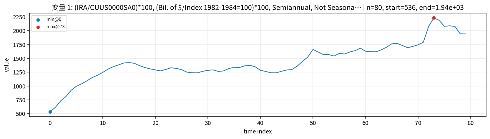

❓ QA 问题与中文翻译

**题干原文**

> You are a time series analysis expert. This is a metric called Inflation-Adjusted IRA Account Balances (calculated as (IRA dollar value / Consumer Price Index, 1982-1984=100) * 100) collected from the Board of Governors of the Federal Reserve System &lt;ts&gt;&lt;ts/&gt;. The data are semiannual, spanning from January 1984 to July 2023. In 2020, the COVID-19 pandemic reduced consumer spending and led to temporary IRA tax benefits, both of which increased IRA balances. Suppose the pandemic had not occurred, and IRA balances had continued growing at the average semiannual rate observed from July 2018 to July 2019. What would the approximate IRA balance have been in January 2021, and how does this counterfactual value compare to the actual January 2021 balance?

**题干中文翻译**

> 你是一名时间序列分析专家。这是一个名为经通胀调整的 IRA 账户余额（计算方式为（IRA 美元价值 / 消费者价格指数，1982-1984=100）*100）的指标，数据来自美国联邦储备系统理事会 &lt;ts&gt;&lt;ts/&gt;。数据为半年一次，时间跨度从 1984 年 1 月到 2023 年 7 月。2020 年，COVID-19 疫情减少了消费者支出，并带来了临时 IRA 税收优惠，这两者都增加了 IRA 余额。假设疫情没有发生，并且 IRA 余额继续以 2018 年 7 月到 2019 年 7 月之间观察到的平均半年增长率增长。那么，2021 年 1 月的 IRA 余额大约会是多少，这个反事实数值与 2021 年 1 月的实际余额相比如何？

**选项**

| 选项 | 原文 | 中文翻译 |
| --- | --- | --- |
| `A` | Approximately $1,825 billion, which is about $407 billion lower than the actual value | 大约 1,8250 亿美元，这比实际值低约 4,070 亿美元 |
| `B` | Approximately $2,078 billion, which is about $154 billion lower than the actual value | 大约 2,0780 亿美元，这比实际值低约 1,540 亿美元 |
| `C` | Approximately $2,232 billion, which is equal to the actual value | 大约 2,2320 亿美元，这与实际值相等 |
| `D` | Approximately $2,639 billion, which is about $407 billion higher than the actual value | 大约 2,6390 亿美元，这比实际值高约 4,070 亿美元 |

**正确答案**：`A`

**标准解释原文**

> First, calculate the pre-pandemic semiannual growth rate: the IRA balance was $1,692.68 billion in July 2018 and $1,745.67 billion in July 2019, a $52.99 billion increase over 2 periods. The average semiannual growth is $52.99 / 2 = $26.50 billion. Next, extrapolate this trend from July 2019 ($1,745.67 billion) to January 2021 (3 periods later): $1,745.67 + ($26.50 * 3) = $1,825.17 billion. The actual January 2021 balance is $2,232.06 billion. The counterfactual value is ~$407 billion lower because the pandemic’s reduced spending (boosting savings) and temporary tax benefits—factors absent in the hypothetical scenario—drove faster growth than the pre-2019 trend. This confirms the counterfactual balance would be far lower than actual.

**标准解释中文翻译**

> 首先，计算疫情前的半年增长率：IRA 余额在 2018 年 7 月为 1,692.68 十亿美元，在 2019 年 7 月为 1,745.67 十亿美元，2 个期间增加了 52.99 十亿美元。平均半年增长为 52.99 / 2 = 26.50 十亿美元。接下来，将这一趋势从 2019 年 7 月（1,745.67 十亿美元）外推到 2021 年 1 月（之后 3 个期间）：1,745.67 +（26.50 * 3）= 1,825.17 十亿美元。实际的 2021 年 1 月余额为 2,232.06 十亿美元。反事实数值大约低 407 十亿美元，因为疫情导致的支出减少（提高了储蓄）和临时税收优惠——这些因素在假设情景中不存在——推动了比 2019 年前趋势更快的增长。这证实了反事实余额会远低于实际值。

📝 生成的 caption 与中文翻译

##### 变量 1：(IRA/CUUS0000SA0)*100, (Bil. of $/Index 1982-1984=100)*100, Semiannual, Not Seasonally Adjusted

**OpenTSLM caption 原文**

> The time series shows a steady upward trend with low volatility and a strong seasonal pattern repeating every 21 periods. The data starts with a moderate increase in the early part of the window, followed by a more pronounced rise in the first half, and a slightly smaller but still positive growth in the second half. There is a notable dip early in the window, about 1.2 standard deviations below the mean, but no clear peak or labeled anomaly is present. The overall growth over the time span is substantial, with a net increase of over 100%.

**OpenTSLM caption 中文翻译**

> 时间序列显示出平稳上升趋势，波动性较低，并且存在每 21 个周期重复一次的强季节性模式。数据在窗口前半部分开始时有适度增长，随后在前半段出现更明显的上升，在后半段则增长略小但仍为正。窗口早期有一个显著下跌，约比均值低 1.2 个标准差，但没有明显峰值或标记的异常。整个时间跨度内的总体增长相当可观，净增长超过 100%。

**ChatTS caption 原文**

> The overall trend is increasing. The global maximum (2232.12) occurs in the last third of the window (positions 54–79). Short-term fluctuations are more pronounced in the first half (positions 1–37), where two sudden increases with amplitudes of 491.93 and 265.44 occur, compared to the second half, which shows a smoother rise with a single spike of 355.44. Answer: Up; last third; first half.

**ChatTS caption 中文翻译**

> 整体趋势是上升的。全局最大值（2232.12）出现在窗口的后三分之一（位置 54–79）。短期波动在前半段（位置 1–37）更为明显，其中出现了两个幅度分别为 491.93 和 265.44 的突然增加，而后半段则显示出更平滑的上升，仅有一个幅度为 355.44 的峰值。答案：上升；后三分之一；前半段。

🧪 下游 QA 模型答案 / 评分

表中所有预测都是同一个辅助 QA 模型 `gpt-5.4` 的输出；六行只改变输入证据形式。

| 输入条件 | 预测答案 | Gold | 是否正确 | 模型原始输出 |
| --- | --- | --- | --- | --- |
| 只给题目和选项 (`meta_only`) | `B` | `A` | ✗ 错误 | B |
| 题目 + 原始数值序列 (`numbers`) | `B` | `A` | ✗ 错误 | B |
| 题目 + OpenTSLM caption (`opentslm_caption`) | `B` | `A` | ✗ 错误 | B |
| 题目 + OpenTSLM caption + 数值 (`opentslm_caption_plus`) | `B` | `A` | ✗ 错误 | B |
| 题目 + ChatTS caption (`chatts_caption`) | `B` | `A` | ✗ 错误 | B |
| 题目 + ChatTS caption + 数值 (`chatts_caption_plus`) | `B` | `A` | ✗ 错误 | B |

🔎 Case 分析

- **答案格局**：`meta_only=B✗, numbers=B✗, opentslm_caption=B✗, opentslm_caption_plus=B✗, chatts_caption=B✗, chatts_caption_plus=B✗`。
- **关键问题**：题目需要用 2018-07 到 2019-07 的半年度平均增长率外推到 2021-01。caption 的全局 upward trend 和 last-third maximum 信息不足以执行反事实公式，数值条件也没有让 QA 模型稳定完成多步计算。
- **对训练失败的含义**：这类 case 显示，当前 caption 训练更像是在学习通用趋势/峰谷/波动模板，而不是学习“下游 QA 所需的证据提取”。FREDQA 的正确答案经常依赖指定日期、指定窗口、比值、差值、反事实外推或领域机制；这些信息如果没有被 caption 明确保留，下游 GPT 即使很强也只能依赖题干先验或被错误摘要带偏。

📈 Case 08：FREDQA `560` | 六种条件全错

#### 基本信息

| 字段 | 内容 |
| --- | --- |
| 数据集 | `FREDQA` |
| Case ID | `fredqa::560` |
| FREDQA 原始 idx | `560` |
| 变量数 / 序列长度 | `1` / `[80]` |
| 问题类型 | `Abductive Reasoning`, `Analogical Reasoning` |
| 正确答案 | `B` |
| 失败/对比模式 | 六种条件全错 |
| 本 case 关注点 | FDIC 机构倒闭峰值与监管解释 |

变量摘要：

| 变量 | 指标名 | n | start | end | min@idx | max@idx | slope |
| ---: | --- | ---: | ---: | ---: | --- | --- | ---: |
| 1 | Failures of all Institutions for the United States and Other Areas, Number of Institutions, Annual, Not Seasonally Adjusted  | 80 | 9 | 24 | 0@71 | 530@55 | 0.918671 |

🖼 时序图

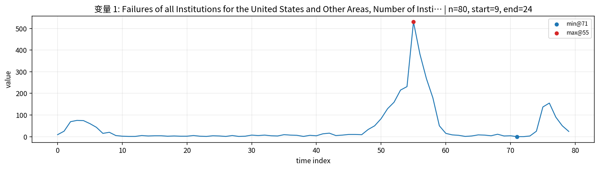

❓ QA 问题与中文翻译

**题干原文**

> You are a time series analysis expert. This is a metric called Failures of all Institutions for the United States and Other Areas, Number of Institutions, Annual, Not Seasonally Adjusted collected from the Federal Deposit Insurance Corporation (FDIC) &lt;ts&gt;&lt;ts/&gt;. Using annual data from 1934 to 2013, identify the number of institution failures in 1989 (a peak year of the savings and loan crisis) and 2009 (a peak year of the 2008–2009 recession). Based on these values, which regulatory or institutional factor best explains why the 2008–2009 recession—despite being deeper—had far fewer failures than the 1980s crisis, consistent with the FDIC’s mandate to stabilize the financial system?

**题干中文翻译**

> 您是一位时间序列分析专家。这是一项名为“美国及其他地区所有机构的失败数量（机构数量，年度，未季节性调整）”的指标，数据来自联邦存款保险公司（FDIC）&lt;ts&gt;&lt;ts/&gt;。使用1934年至2013年的年度数据，找出1989年（储蓄和贷款危机的一个峰值年份）和2009年（2008–2009年衰退的一个峰值年份）的机构倒闭数量。基于这些数值，哪一个监管或制度因素最能解释为什么2008–2009年衰退——尽管更为严重——的机构倒闭数却远少于20世纪80年代的危机，这与FDIC稳定金融体系的职责一致？

**选项**

| 选项 | 原文 | 中文翻译 |
| --- | --- | --- |
| `A` | Reduced FDIC insurance limits for individual depositors in the 2000s, which minimized panic-driven bank runs | 20世纪2000年代将个人存款人的FDIC保险限额降低，从而最小化了由恐慌驱动的银行挤兑 |
| `B` | Stricter capital adequacy rules for banks adopted after the savings and loan crisis to prevent insolvency | 在储蓄和贷款危机之后为防止资不抵债而采用了更严格的银行资本充足率规则 |
| `C` | A sharp drop in the number of savings and loan associations operating in the U.S. by the 2000s | 到2000年代，在美国运营的储蓄和贷款协会数量急剧下降 |
| `D` | The FDIC’s temporary suspension of its 'too big to fail' policy during the 2008–2009 recession | FDIC在2008–2009年衰退期间暂时暂停了其“too big to fail”政策 |

**正确答案**：`B`

**标准解释原文**

> （源 artifact 未提供该字段。）

**标准解释中文翻译**

> （源 artifact 未提供该字段。）

📝 生成的 caption 与中文翻译

##### 变量 1：Failures of all Institutions for the United States and Other Areas, Number of Institutions, Annual, Not Seasonally Adjusted

**OpenTSLM caption 原文**

> The time series shows a consistent downward trend with low volatility and a strong seasonal pattern repeating every 18 years. The data starts with a significant decline in the early part of the window, followed by a moderate decrease in the first half, and a slight increase in the second half. A notable peak occurs early in the window, standing out as about 2.1 standard deviations above the mean. The series is strongly correlated with another related variable, indicating a close relationship between the two.

**OpenTSLM caption 中文翻译**

> 该时间序列表现出持续下降的趋势，波动性较低，并且存在一个强烈的季节性模式，每18年重复一次。数据在窗口前期开始时显著下降，随后在前半段适度下降，并在后半段略有上升。一个显著的峰值出现在窗口早期，明显高于均值约2.1个标准差。该序列与另一个相关变量高度相关，表明两者之间存在紧密关系。

**ChatTS caption 原文**

> The overall trend is flat, with the time series starting at ~9.02 and ending at ~24.04. The global maximum of 530.0 (at point 54) occurs in the middle third of the window (points 41-59). Short-term fluctuations are more pronounced in the first half (e.g., the spike between points 2-4) compared to the second half (which shows a gradual decline after point 54). Answer: Flat trend; middle third; first half.

**ChatTS caption 中文翻译**

> 总体趋势平稳，时间序列从约9.02开始，到24.04结束。全局最大值530.0（位于第54个点）出现在窗口的中间三分之一（第41-59个点）。短期波动在前半段更为明显（例如第2-4个点之间的尖峰），相比之下后半段（在第54个点之后呈现逐渐下降）。答案：平稳趋势；中间三分之一；前半段。

🧪 下游 QA 模型答案 / 评分

表中所有预测都是同一个辅助 QA 模型 `gpt-5.4` 的输出；六行只改变输入证据形式。

| 输入条件 | 预测答案 | Gold | 是否正确 | 模型原始输出 |
| --- | --- | --- | --- | --- |
| 只给题目和选项 (`meta_only`) | `C` | `B` | ✗ 错误 | C |
| 题目 + 原始数值序列 (`numbers`) | `C` | `B` | ✗ 错误 | C |
| 题目 + OpenTSLM caption (`opentslm_caption`) | `C` | `B` | ✗ 错误 | C |
| 题目 + OpenTSLM caption + 数值 (`opentslm_caption_plus`) | `C` | `B` | ✗ 错误 | C |
| 题目 + ChatTS caption (`chatts_caption`) | `C` | `B` | ✗ 错误 | C |
| 题目 + ChatTS caption + 数值 (`chatts_caption_plus`) | `C` | `B` | ✗ 错误 | C |

🔎 Case 分析

- **答案格局**：`meta_only=C✗, numbers=C✗, opentslm_caption=C✗, opentslm_caption_plus=C✗, chatts_caption=C✗, chatts_caption_plus=C✗`。
- **关键问题**：模型全部选择了表面上合理但并非标准答案的选项，说明该题不是单纯读峰值，还要求把 1980s S&amp;L crisis 与之后更严格资本充足率规则联系起来；caption 没有编码制度性解释。
- **对训练失败的含义**：这类 case 显示，当前 caption 训练更像是在学习通用趋势/峰谷/波动模板，而不是学习“下游 QA 所需的证据提取”。FREDQA 的正确答案经常依赖指定日期、指定窗口、比值、差值、反事实外推或领域机制；这些信息如果没有被 caption 明确保留，下游 GPT 即使很强也只能依赖题干先验或被错误摘要带偏。

📈 Case 09：FREDQA `964` | meta-only 错，只有 ChatTS caption 对

#### 基本信息

| 字段 | 内容 |
| --- | --- |
| 数据集 | `FREDQA` |
| Case ID | `fredqa::964` |
| FREDQA 原始 idx | `964` |
| 变量数 / 序列长度 | `1` / `[426]` |
| 问题类型 | `Causal Reasoning - Interventional` |
| 正确答案 | `B` |
| 失败/对比模式 | meta-only 错，只有 ChatTS caption 对 |
| 本 case 关注点 | 雷曼兄弟倒闭前后 PPI 的即时百分比变化 |

变量摘要：

| 变量 | 指标名 | n | start | end | min@idx | max@idx | slope |
| ---: | --- | ---: | ---: | ---: | --- | --- | ---: |
| 1 | PPI | 426 | 100 | 224.866 | 100@0 | 237.3@357 | 0.278716 |

🖼 时序图

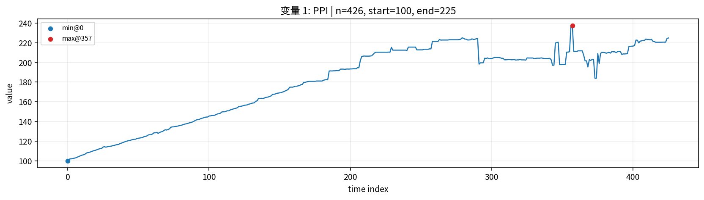

❓ QA 问题与中文翻译

**题干原文**

> You are a time series analysis expert. This is a metric called Producer Price Index (PPI)—which measures average changes in selling prices received by domestic producers for their output—collected from the Federal Reserve Economic Data (FRED) database &lt;ts&gt;&lt;ts/&gt;. The data is monthly from December 1989 to May 2025. The Lehman Brothers collapse on September 15, 2008, triggered a global financial crisis that disrupted commodity markets and supply chains. To evaluate the immediate causal impact of this event on producer prices, compare the PPI values for August 2008 (pre-collapse) and September 2008 (post-collapse). Which conclusion is most supported by the data and economic logic?

**题干中文翻译**

> 你是一名时间序列分析专家。这是一项称为生产者价格指数（PPI）的指标——它衡量国内生产者为其产出获得的销售价格平均变化——数据来自联邦储备经济数据（FRED）数据库 &lt;ts&gt;&lt;ts/&gt;。数据为月度数据，时间范围从1989年12月到2025年5月。雷曼兄弟于2008年9月15日倒闭，引发了一场全球金融危机，扰乱了大宗商品市场和供应链。为评估这一事件对生产者价格的直接因果影响，比较2008年8月（倒闭前）和2008年9月（倒闭后）的PPI值。哪一项结论最符合数据和经济逻辑？

**选项**

| 选项 | 原文 | 中文翻译 |
| --- | --- | --- |
| `A` | The collapse caused a 4.7% decrease in PPI, as reduced consumer demand lowered producer pricing power. | 倒闭导致PPI下降了4.7%，因为消费者需求减少降低了生产者的定价能力。 |
| `B` | The collapse caused a 4.7% increase in PPI, as short-term disruptions raised the cost of raw materials for producers. | 倒闭导致PPI上升了4.7%，因为短期扰动提高了生产者原材料的成本。 |
| `C` | The collapse had no immediate effect, as PPI remained unchanged between August and September 2008. | 倒闭没有立即影响，因为2008年8月和9月之间PPI保持不变。 |
| `D` | The collapse caused a 9.2% increase in PPI, as producers passed on full costs of financial market turmoil to buyers. | 倒闭导致PPI上升了9.2%，因为生产者将金融市场动荡的全部成本转嫁给了买家。 |

**正确答案**：`B`

**标准解释原文**

> First, calculate the percentage change in PPI: August 2008 = 182.7, September 2008 = 191.3. The change is (191.3 – 182.7)/182.7 ≈ 4.7%, ruling out A (decrease), C (no change), and D (9.2% increase). Causally, the Lehman collapse disrupted global supply chains and commodity markets, leading to short-term spikes in raw material costs (e.g., energy, metals) that producers passed on as higher prices. This aligns with the PPI increase and supports option B.

**标准解释中文翻译**

> 首先，计算PPI的百分比变化：2008年8月 = 182.7，2008年9月 = 191.3。变化为 (191.3 – 182.7)/182.7 ≈ 4.7%，排除了A（下降）、C（无变化）和D（9.2%上升）。从因果上看，雷曼倒闭扰乱了全球供应链和大宗商品市场，导致原材料成本（例如能源、金属）短期飙升，生产者将其以更高价格转嫁出去。这与PPI上升一致，并支持选项B。

📝 生成的 caption 与中文翻译

##### 变量 1：PPI

**OpenTSLM caption 原文**

> The time series shows a flat trend with low volatility and medium strength seasonality every 10 periods. There is a noticeable upward phase early in the window followed by a more pronounced upward movement in the first half, which is then followed by a significant downward shift in the second half. A peak occurs in the second half with a magnitude of about 1.5 standard deviations from the mean, while a valley is observed early in the window with a magnitude of about 1.7 standard deviations from the mean. The series exhibits strong positive correlation with variable A and moderate positive correlation with variable B.

**OpenTSLM caption 中文翻译**

> 时间序列显示出平坦的趋势、较低的波动性，以及每10个周期一次的中等强度季节性。窗口前期有一个明显的上升阶段，随后在前半段出现更显著的上升运动，接着在后半段出现显著下降。后半段出现一个峰值，其幅度约为相对于均值1.5个标准差，而在窗口前期观察到一个谷值，其幅度约为相对于均值1.7个标准差。该序列与变量A呈强正相关，与变量B呈中等正相关。

**ChatTS caption 原文**

> The overall trend is increasing. The global maximum is in the last third of the window. Short-term fluctuations are larger in the second half of the window.

**ChatTS caption 中文翻译**

> 整体趋势呈上升。全局最大值位于窗口的后三分之一处。短期波动在窗口后半段更大。

🧪 下游 QA 模型答案 / 评分

表中所有预测都是同一个辅助 QA 模型 `gpt-5.4` 的输出；六行只改变输入证据形式。

| 输入条件 | 预测答案 | Gold | 是否正确 | 模型原始输出 |
| --- | --- | --- | --- | --- |
| 只给题目和选项 (`meta_only`) | `C` | `B` | ✗ 错误 | C |
| 题目 + 原始数值序列 (`numbers`) | `A` | `B` | ✗ 错误 | A |
| 题目 + OpenTSLM caption (`opentslm_caption`) | `A` | `B` | ✗ 错误 | A |
| 题目 + OpenTSLM caption + 数值 (`opentslm_caption_plus`) | `A` | `B` | ✗ 错误 | A |
| 题目 + ChatTS caption (`chatts_caption`) | `B` | `B` | ✓ 正确 | B |
| 题目 + ChatTS caption + 数值 (`chatts_caption_plus`) | `A` | `B` | ✗ 错误 | A |

🔎 Case 分析

- **答案格局**：`meta_only=C✗, numbers=A✗, opentslm_caption=A✗, opentslm_caption_plus=A✗, chatts_caption=B✓, chatts_caption_plus=A✗`。
- **关键问题**：这个 case 需要比较 2008 年 8 月和 9 月 PPI 的短期变化。ChatTS 的简洁趋势摘要让 caption-only 条件答对，但 OpenTSLM、numbers 和两个 caption+numbers 条件都答错，说明即使直接给数值，长题干中的局部月份定位和百分比变化也没有被稳定执行。
- **对训练失败的含义**：这类 case 显示，当前 caption 训练更像是在学习通用趋势/峰谷/波动模板，而不是学习“下游 QA 所需的证据提取”。FREDQA 的正确答案经常依赖指定日期、指定窗口、比值、差值、反事实外推或领域机制；这些信息如果没有被 caption 明确保留，下游 GPT 即使很强也只能依赖题干先验或被错误摘要带偏。

📈 Case 10：FREDQA `481` | meta-only 错，数值/caption 全部救回

#### 基本信息

| 字段 | 内容 |
| --- | --- |
| 数据集 | `FREDQA` |
| Case ID | `fredqa::481` |
| FREDQA 原始 idx | `481` |
| 变量数 / 序列长度 | `3` / `[61, 61, 61]` |
| 问题类型 | `Abductive Reasoning` |
| 正确答案 | `A` |
| 失败/对比模式 | meta-only 错，数值/caption 全部救回 |
| 本 case 关注点 | 油价、公交客流、车辆里程在 2015 年 3 月的替代效应解释 |

变量摘要：

| 变量 | 指标名 | n | start | end | min@idx | max@idx | slope |
| ---: | --- | ---: | ---: | ---: | --- | --- | ---: |
| 1 | US Regular Conventional Gas Price, Percent Change, Monthly, Not Seasonally Adjusted  | 61 | 3.4162 | 4.2427 | -17.7653@36 | 12.7305@50 | -0.0146734 |
| 2 | Public Transit Ridership, Percent Change, Monthly, Not Seasonally Adjusted  | 61 | 0.4909 | -0.6018 | -14.6704@34 | 16.3636@38 | -0.0185047 |
| 3 | Vehicle Miles Traveled, Percent Change, Monthly, Not Seasonally Adjusted  | 61 | -7.0598 | -8.3761 | -9.6498@8 | 18.8941@50 | -0.0130504 |

🖼 时序图

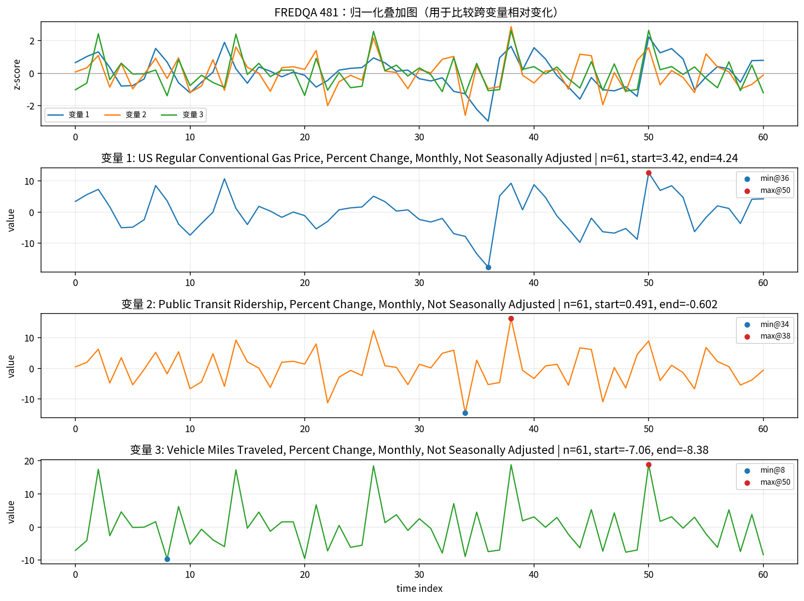

❓ QA 问题与中文翻译

**题干原文**

> You are a time series analysis expert. In a U.S. Transportation and Energy system, there are 3 metrics: US Regular Conventional Gas Price, Percent Change (Monthly, Not Seasonally Adjusted)&lt;ts&gt;&lt;ts/&gt;; Public Transit Ridership, Percent Change (Monthly, Not Seasonally Adjusted)&lt;ts&gt;&lt;ts/&gt;; Vehicle Miles Traveled, Percent Change (Monthly, Not Seasonally Adjusted)&lt;ts&gt;&lt;ts/&gt;. Using monthly data from January 2012 to January 2017, examine the percent change values for March 2015. The textbook substitution effect predicts that a large increase in gas prices would reduce vehicle miles traveled and increase public transit ridership. Based on the data for this month, which factor from the provided context best explains why the expected relationship is not observed?

**题干中文翻译**

> 你是一名时间序列分析专家。在美国交通和能源系统中，有 3 个指标：美国常规汽油价格，月度百分比变化，未经季节调整&lt;ts&gt;&lt;ts/&gt;；公共交通乘客量，月度百分比变化，未经季节调整&lt;ts&gt;&lt;ts/&gt;；车辆行驶英里数，月度百分比变化，未经季节调整&lt;ts&gt;&lt;ts/&gt;。使用 2012 年 1 月到 2017 年 1 月的月度数据，考察 2015 年 3 月的百分比变化值。教材中的替代效应预测，汽油价格的大幅上涨会减少车辆行驶英里数并增加公共交通乘客量。根据该月份的数据，提供的上下文中哪一因素最能解释为什么没有观察到预期关系？

**选项**

| 选项 | 原文 | 中文翻译 |
| --- | --- | --- |
| `A` | Seasonal increases in travel demand for spring and summer activities | 春季和夏季活动的出行需求季节性增加 |
| `B` | Temporary reductions in public transit service frequency | 公共交通服务频率的暂时性减少 |
| `C` | Long-term improvements in passenger vehicle fuel efficiency | 乘用车燃油效率的长期改善 |
| `D` | Nationwide increases in household disposable income | 家庭可支配收入的全国性增加 |

**正确答案**：`A`

**标准解释原文**

> （源 artifact 未提供该字段。）

**标准解释中文翻译**

> （源 artifact 未提供该字段。）

📝 生成的 caption 与中文翻译

##### 变量 1：US Regular Conventional Gas Price, Percent Change, Monthly, Not Seasonally Adjusted

**OpenTSLM caption 原文**

> The time series shows a flat trend with low volatility and a medium-strength seasonal pattern repeating approximately every 102 months. The data experiences a significant decline early in the window, followed by a moderate increase in the first half, and a smaller decline in the second half. A notable peak occurs early, reaching about 2.0 standard deviations above the mean, while a deep valley appears late, reaching about 2.1 standard deviations below the mean. The series is strongly positively correlated with the US Regular Conventional Gas Price, Percent Change, Monthly, Seasonally Adjusted data.

**OpenTSLM caption 中文翻译**

> 该时间序列显示出平稳趋势、低波动性以及大约每 102 个月重复一次的中等强度季节模式。数据在窗口早期经历了显著下降，随后在前半段出现适度上升，并在后半段出现较小下降。一个显著峰值出现在早期，约高于均值 2.0 个标准差，而一个深谷出现在后期，约低于均值 2.1 个标准差。该序列与美国常规汽油价格、月度百分比变化、季节调整后数据呈强正相关。

**ChatTS caption 原文**

> The overall trend is flat, with values starting and ending around -0.31. The global maximum, which is also -0.31 due to the steady trend, occurs at point 12, located in the first third of the 61-point window. Short-term fluctuations are more pronounced in the first half of the series, characterized by high-frequency shakes with an amplitude of about 16.5, compared to the relatively stable values in the second half.

**ChatTS caption 中文翻译**

> 整体趋势平稳，数值起始和结束都在 -0.31 左右。全局最大值也为 -0.31，由于趋势平稳而保持不变，出现在第 12 个点，位于 61 点窗口的前 1/3。短期波动在序列前半段更为明显，其特征是高频震荡，幅度约为 16.5，而后半段数值相对稳定。

##### 变量 2：Public Transit Ridership, Percent Change, Monthly, Not Seasonally Adjusted

**OpenTSLM caption 原文**

> The time series shows a flat trend with low volatility and no clear seasonality. Early in the window, there is a moderate upward movement, followed by a significant downward phase in the first half, and a strong upward shift in the second half. A peak occurs in the second half, reaching about 1.5 standard deviations above the mean, while a valley is observed around the middle, about 1.3 standard deviations below the mean. The series is strongly positively correlated with two other variables related to public transit passenger changes.

**OpenTSLM caption 中文翻译**

> 该时间序列显示出平稳趋势、低波动性且没有明显季节性。窗口早期有中等程度的上升，随后在前半段出现显著下降阶段，并在后半段出现强劲上升。峰值出现在后半段，约高于均值 1.5 个标准差，而谷值出现在中间附近，约低于均值 1.3 个标准差。该序列与另外两个与公共交通乘客变化相关的变量呈强正相关。

**ChatTS caption 原文**

> The overall trend is flat. The global maximum, which is 0.49, is located in the first third of the window (positions 1-20). Short-term fluctuations are more pronounced in the first half of the window (positions 1-30) compared to the second half (positions 31-61). Total words: 67.

**ChatTS caption 中文翻译**

> 整体趋势平稳。全局最大值为 0.49，位于窗口前 1/3（位置 1-20）。与后半段（位置 31-61）相比，窗口前半段（位置 1-30）的短期波动更为明显。总词数：67。

##### 变量 3：Vehicle Miles Traveled, Percent Change, Monthly, Not Seasonally Adjusted

**OpenTSLM caption 原文**

> The time series shows a flat trend with high volatility and no clear seasonality. It begins with a significant downward phase early in the window, followed by an upward movement in the first half, and then a smaller decline in the second half. A notable peak occurs early, with a magnitude of about 2.0 standard deviations from the mean, while a deep valley appears in the second half, reaching about 2.1 standard deviations below the mean. The overall net change is a decrease of nearly 18%.

**OpenTSLM caption 中文翻译**

> 该时间序列显示出平稳趋势、高波动性且没有明显季节性。它在窗口早期开始时经历了显著下降阶段，随后在前半段出现上升运动，然后在后半段出现较小下降。一个显著峰值出现在早期，幅度约为距均值 2.0 个标准差，而一个深谷出现在后半段，约低于均值 2.1 个标准差。总体净变化为接近 18% 的下降。

**ChatTS caption 原文**

> The trend is flat. The global maximum is in the first third of the window. Short-term fluctuations are more pronounced in the first half of the window.

**ChatTS caption 中文翻译**

> 趋势平稳。全局最大值位于窗口前 1/3。短期波动在窗口前半段更为明显。

🧪 下游 QA 模型答案 / 评分

表中所有预测都是同一个辅助 QA 模型 `gpt-5.4` 的输出；六行只改变输入证据形式。

| 输入条件 | 预测答案 | Gold | 是否正确 | 模型原始输出 |
| --- | --- | --- | --- | --- |
| 只给题目和选项 (`meta_only`) | `C` | `A` | ✗ 错误 | C |
| 题目 + 原始数值序列 (`numbers`) | `A` | `A` | ✓ 正确 | A |
| 题目 + OpenTSLM caption (`opentslm_caption`) | `A` | `A` | ✓ 正确 | A |
| 题目 + OpenTSLM caption + 数值 (`opentslm_caption_plus`) | `A` | `A` | ✓ 正确 | A |
| 题目 + ChatTS caption (`chatts_caption`) | `A` | `A` | ✓ 正确 | A |
| 题目 + ChatTS caption + 数值 (`chatts_caption_plus`) | `A` | `A` | ✓ 正确 | A |

🔎 Case 分析

- **答案格局**：`meta_only=C✗, numbers=A✓, opentslm_caption=A✓, opentslm_caption_plus=A✓, chatts_caption=A✓, chatts_caption_plus=A✓`。
- **关键问题**：没有时序证据时模型选错背景因素；加入数值或 caption 后都能定位春夏出行需求这一解释。这是少数 caption 真正提供有效证据的正例。
- **对训练失败的含义**：这类 case 显示，当前 caption 训练更像是在学习通用趋势/峰谷/波动模板，而不是学习“下游 QA 所需的证据提取”。FREDQA 的正确答案经常依赖指定日期、指定窗口、比值、差值、反事实外推或领域机制；这些信息如果没有被 caption 明确保留，下游 GPT 即使很强也只能依赖题干先验或被错误摘要带偏。

📈 Case 11：FREDQA `1209` | meta-only 错，数值/caption 全部救回

#### 基本信息

| 字段 | 内容 |
| --- | --- |
| 数据集 | `FREDQA` |
| Case ID | `fredqa::1209` |
| FREDQA 原始 idx | `1209` |
| 变量数 / 序列长度 | `4` / `[22, 22, 22, 22]` |
| 问题类型 | `Causal Reasoning - Interventional` |
| 正确答案 | `B` |
| 失败/对比模式 | meta-only 错，数值/caption 全部救回 |
| 本 case 关注点 | 圣路易斯 premature death crude rate 与 age-adjusted rate 的衰退前后变化 |

变量摘要：

| 变量 | 指标名 | n | start | end | min@idx | max@idx | slope |
| ---: | --- | ---: | ---: | ---: | --- | --- | ---: |
| 1 | Premature Death Rate for St. Louis County, MO, Rate per 100,000, Annual, Not Seasonally Adjusted  | 22 | 395.6 | 555.2 | 353.7@8 | 555.2@21 | 5.27047 |
| 2 | Premature Death Rate for St. Louis city, MO, Rate per 100,000, Annual, Not Seasonally Adjusted  | 22 | 692.2 | 831.7 | 535.5@13 | 831.7@21 | 2.11101 |
| 3 | Age-Adjusted Premature Death Rate for St. Louis city, MO, Rate per 100,000, Annual, Not Seasonally Adjusted  | 22 | 730 | 701.8 | 516.2@14 | 730@0 | -5.22592 |
| 4 | Age-Adjusted Premature Death Rate for St. Louis County, MO, Rate per 100,000, Annual, Not Seasonally Adjusted  | 22 | 372.2 | 424.5 | 320.3@8 | 424.5@21 | 0.319819 |

🖼 时序图

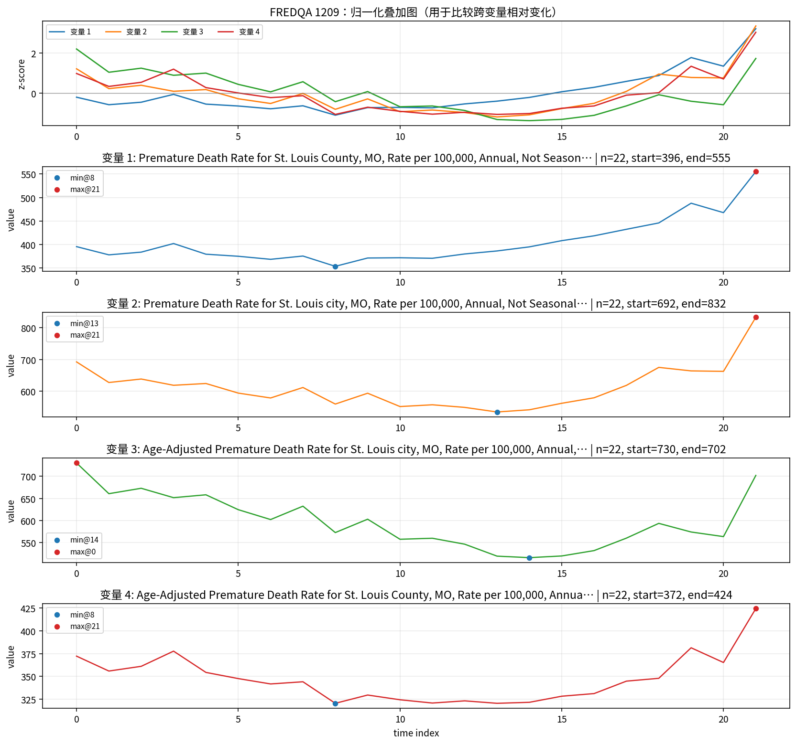

❓ QA 问题与中文翻译

**题干原文**

> You are a time series analysis expert. In St. Louis, MO (encompassing St. Louis City and St. Louis County), there are four annual metrics (collected 1999–2020):
> 1. Premature Death Rate for St. Louis County (crude, per 100,000 residents)&lt;ts&gt;&lt;ts/&gt;;
> 2. Premature Death Rate for St. Louis City (crude, per 100,000 residents)&lt;ts&gt;&lt;ts/&gt;;
> 3. Age-Adjusted Premature Death Rate for St. Louis City (per 100,000 residents)&lt;ts&gt;&lt;ts/&gt;;
> 4. Age-Adjusted Premature Death Rate for St. Louis County (per 100,000 residents)&lt;ts&gt;&lt;ts/&gt;.
> The Great Recession (2007–2009) is hypothesized to have altered trends in premature deaths. For St. Louis City, calculate the average annual change in its crude rate (metric 2) from 2000–2006 (pre-recession) and the average annual change in its age-adjusted rate (metric 3) from 2010–2016 (post-recession). Which conclusion about the recession’s causal effect on these rates is supported by the data?

**题干中文翻译**

> 你是一名时间序列分析专家。在密苏里州圣路易斯（包括圣路易斯市和圣路易斯县），有四个年度指标（收集于1999–2020年）：
> 1. 圣路易斯县过早死亡率（粗率，每10万人居民）&lt;ts&gt;&lt;ts/&gt;；
> 2. 圣路易斯市过早死亡率（粗率，每10万人居民）&lt;ts&gt;&lt;ts/&gt;；
> 3. 圣路易斯市年龄调整过早死亡率（每10万人居民）&lt;ts&gt;&lt;ts/&gt;；
> 4. 圣路易斯县年龄调整过早死亡率（每10万人居民）&lt;ts&gt;&lt;ts/&gt;。
> 大衰退（2007–2009年）被假设已经改变了过早死亡的趋势。对于圣路易斯市，计算其粗率（指标2）在2000–2006年（衰退前）的平均年度变化，以及其年龄调整率（指标3）在2010–2016年（衰退后）的平均年度变化。关于衰退对这些比率的因果影响，哪一项结论得到了数据支持？

**选项**

| 选项 | 原文 | 中文翻译 |
| --- | --- | --- |
| `A` | The recession caused a steeper decline in both rates, consistent with economic growth reducing premature deaths. | 衰退导致两种比率下降得更陡，这与经济增长减少过早死亡是一致的。 |
| `B` | The recession reversed the crude rate’s decline but left the age-adjusted rate stable, implying age composition changes drove the crude trend. | 衰退逆转了粗率的下降，但使年龄调整率保持稳定，意味着年龄构成变化驱动了粗率趋势。 |
| `C` | The recession had no effect on the crude rate but accelerated the age-adjusted rate’s decline, contradicting the economic hypothesis. | 衰退对粗率没有影响，但加速了年龄调整率的下降，这与经济假设相矛盾。 |
| `D` | The recession caused both rates to rise sharply, confirming a direct link between economic downturns and premature deaths. | 衰退导致两种比率大幅上升，证实了经济下滑与过早死亡之间的直接联系。 |

**正确答案**：`B`

**标准解释原文**

> First, compute average annual changes using the time series data:
> - **Crude rate (metric 2, pre-recession 2000–2006):** From 627.7 to 612.1, a total decline of -15.6 over 6 years → **-2.6 per year** (declining).
> - **Crude rate (metric 2, post-recession 2010–2016):** From 558.0 to 618.8, a total increase of +60.8 over 6 years → **+10.1 per year** (rising).
> - **Age-adjusted rate (metric 3, pre-recession 2000–2006):** From 660.6 to 632.4, a total decline of -28.2 over 6 years → **-4.7 per year** (declining).
> - **Age-adjusted rate (metric 3, post-recession 2010–2016):** From 560.0 to 560.3, a negligible increase of +0.3 over 6 years → **~0 per year** (stable).
>
> The crude rate reversed from declining to rising post-recession, but the age-adjusted rate (which controls for population age composition) stabilized. Since age-adjustment removes confounding from changes in the city’s age structure, the recession’s apparent effect on the crude rate was not a true increase in premature deaths per age group—instead, it reflected shifts in who lived in St. Louis City. This supports option B.

**标准解释中文翻译**

> 首先，使用时间序列数据计算平均年度变化：
> - **粗率（指标2，衰退前2000–2006年）：** 从627.7到612.1，总共下降-15.6，历时6年 → **每年-2.6**（下降）。
> - **粗率（指标2，衰退后2010–2016年）：** 从558.0到618.8，总共上升+60.8，历时6年 → **每年+10.1**（上升）。
> - **年龄调整率（指标3，衰退前2000–2006年）：** 从660.6到632.4，总共下降-28.2，历时6年 → **每年-4.7**（下降）。
> - **年龄调整率（指标3，衰退后2010–2016年）：** 从560.0到560.3，6年内微弱上升+0.3 → **约每年0**（稳定）。
>
> 粗率在衰退后从下降转为上升，但年龄调整率（控制了人口年龄构成）稳定下来。由于年龄调整消除了城市年龄结构变化带来的混杂因素，衰退对粗率的表面影响并不是真正的每个年龄组过早死亡增加——相反，它反映了圣路易斯市居民构成的变化。这支持选项B。

📝 生成的 caption 与中文翻译

##### 变量 1：Premature Death Rate for St. Louis County, MO, Rate per 100,000, Annual, Not Seasonally Adjusted

**OpenTSLM caption 原文**

> The time series shows a downward trend with medium volatility and a medium-strength seasonal pattern repeating every 10 years. The premature death rate for St. Louis County, MO, has decreased by over 50% over the entire period. Early in the window, there was a notable decline, followed by a more pronounced drop in the first half, and a significant rise in the second half. A peak occurred around the middle of the time span, reaching about 1.5 standard deviations above the mean, while a valley in the second half was about 1.2 standard deviations below the mean. The rate is strongly positively correlated with the premature death rate for Madison County, MO.

**OpenTSLM caption 中文翻译**

> 该时间序列显示出下降趋势，具有中等波动性和每10年重复一次的中等强度季节模式。密苏里州圣路易斯县的过早死亡率在整个期间下降了超过50%。在窗口早期，出现了明显下降，随后在前半段出现了更显著的下降，并在后半段出现了明显上升。大约在时间跨度的中间出现了一个峰值，约比均值高1.5个标准差，而后半段的一个谷值约比均值低1.2个标准差。该比率与密苏里州麦迪逊县的过早死亡率呈强正相关。

**ChatTS caption 原文**

> The overall trend is increasing. The global maximum occurs at the final point (position 22 out of 22, last third of the window). Short-term fluctuations are more pronounced in the first half (points 1-11) due to the rapid decline followed by a slow rise, compared to the smoother trend in the second half (points 12-22).

**ChatTS caption 中文翻译**

> 总体趋势是上升的。全局最大值出现在最后一个点（第22个点，共22个点，位于窗口的后三分之一）。短期波动在前半段（点1-11）更为明显，这是由于快速下降后接着缓慢上升；相比之下，后半段（点12-22）的趋势更平稳。

##### 变量 2：Premature Death Rate for St. Louis city, MO, Rate per 100,000, Annual, Not Seasonally Adjusted

**OpenTSLM caption 原文**

> The time series shows a downward trend with medium volatility and a medium-strength seasonal pattern repeating every 10 years. The premature death rate for St. Louis city, MO, has decreased by over 50% over the entire period. The decline was most pronounced in the first half of the time window, followed by a relatively flat period in the second half. There was a notable dip early in the window, about 1.5 standard deviations below the mean. The rate is negatively correlated with both population and median income, suggesting potential inverse relationships.

**OpenTSLM caption 中文翻译**

> 该时间序列显示出下降趋势，具有中等波动性和每10年重复一次的中等强度季节模式。密苏里州圣路易斯市的过早死亡率在整个期间下降了超过50%。下降在时间窗口的前半段最为显著，随后在后半段相对平稳。窗口早期出现了一个明显低谷，约比均值低1.5个标准差。该比率与人口和家庭收入均呈负相关，表明可能存在反向关系。

**ChatTS caption 原文**

> The overall trend is increasing. The global maximum occurs at point 21, which is in the last third of the 22-point window. Short-term fluctuations are more pronounced in the first half (points 1-11) due to the rapid decline followed by a slow rise, compared to the steady increase in the second half (points 12-22). **Answer:** Trend: Increasing; Max Position: Last third; Fluctuations: First half

**ChatTS caption 中文翻译**

> 总体趋势是上升的。全局最大值出现在第21个点，位于22点窗口的后三分之一。短期波动在前半段（点1-11）更为明显，这是由于快速下降后接着缓慢上升；相比之下，后半段（点12-22）的趋势持续上升。**答案：** 趋势：上升；最大位置：后三分之一；波动：前半段

##### 变量 3：Age-Adjusted Premature Death Rate for St. Louis city, MO, Rate per 100,000, Annual, Not Seasonally Adjusted

**OpenTSLM caption 原文**

> The time series shows a downward trend with medium volatility and a medium-strength seasonal pattern repeating every three years. The data starts with a significant decline in the early part of the window, followed by a continued decrease in the first half, and a slight recovery in the second half. There is a notable peak early in the window, about 1.5 standard deviations above the mean, and a deep valley around the middle, about 2.0 standard deviations below the mean. The series is strongly negatively correlated with the age-adjusted premature death rate for Columbus, OH, and strongly positively correlated with the rate for Madison, WI.

**OpenTSLM caption 中文翻译**

> 该时间序列显示出下降趋势，具有中等波动性和每三年重复一次的中等强度季节模式。数据在窗口早期出现了显著下降，随后在前半段继续下降，并在后半段略有回升。窗口早期有一个明显峰值，约比均值高1.5个标准差，而中间附近有一个深谷，约比均值低2.0个标准差。该序列与俄亥俄州哥伦布市的年龄调整过早死亡率呈强负相关，并与威斯康星州麦迪逊市的比率呈强正相关。

**ChatTS caption 原文**

> The overall trend is flat. The global maximum occurs at point 0, in the first third of the window. Short-term fluctuations are more pronounced in the first half (shake with amplitude ~173.41) compared to the second half (steady decline). **Answer:** Flat; First third; First half

**ChatTS caption 中文翻译**

> 总体趋势是平坦的。全局最大值出现在第0个点，位于窗口的前三分之一。短期波动在前半段更为明显（振幅约173.41），相比之下，后半段则是稳定下降。**答案：** 平坦；前三分之一；前半段

##### 变量 4：Age-Adjusted Premature Death Rate for St. Louis County, MO, Rate per 100,000, Annual, Not Seasonally Adjusted

**OpenTSLM caption 原文**

> The time series shows a downward trend with medium volatility and a medium-strength seasonal pattern repeating every three years. The data starts with a significant decline in the early part of the window, followed by a continued decrease in the first half, and a slight recovery in the second half. There is a notable peak early in the window, about 1.5 standard deviations above the mean, and a deep valley in the first half, about 2.0 standard deviations below the mean. The overall net change is a decline of nearly 40%.

**OpenTSLM caption 中文翻译**

> 该时间序列显示出下降趋势，具有中等波动性和每三年重复一次的中等强度季节模式。数据在窗口早期出现了显著下降，随后在前半段继续下降，并在后半段略有回升。窗口早期有一个明显峰值，约比均值高1.5个标准差，而前半段有一个深谷，约比均值低2.0个标准差。整体净变化是接近40%的下降。

**ChatTS caption 原文**

> The overall trend is flat, with values starting and ending around 372.20 to 424.50. The global maximum occurs at the final point (position 22) in the last third of the window. Short-term fluctuations are more pronounced in the first half (positions 1-11), where a rapid decline and recovery occur. Therefore, the answer is: Flat trend, global maximum in the last third, larger fluctuations in the first half.

**ChatTS caption 中文翻译**

> 总体趋势是平坦的，数值起始和结束大约在372.20到424.50之间。全局最大值出现在最后一个点（第22个位置），位于窗口的后三分之一。短期波动在前半段（位置1-11）更为明显，其中出现了快速下降和回升。因此，答案是：平坦趋势，全局最大值在后三分之一，前半段波动更大。

🧪 下游 QA 模型答案 / 评分

表中所有预测都是同一个辅助 QA 模型 `gpt-5.4` 的输出；六行只改变输入证据形式。

| 输入条件 | 预测答案 | Gold | 是否正确 | 模型原始输出 |
| --- | --- | --- | --- | --- |
| 只给题目和选项 (`meta_only`) | `C` | `B` | ✗ 错误 | C |
| 题目 + 原始数值序列 (`numbers`) | `B` | `B` | ✓ 正确 | B |
| 题目 + OpenTSLM caption (`opentslm_caption`) | `B` | `B` | ✓ 正确 | B |
| 题目 + OpenTSLM caption + 数值 (`opentslm_caption_plus`) | `B` | `B` | ✓ 正确 | B |
| 题目 + ChatTS caption (`chatts_caption`) | `B` | `B` | ✓ 正确 | B |
| 题目 + ChatTS caption + 数值 (`chatts_caption_plus`) | `B` | `B` | ✓ 正确 | B |

🔎 Case 分析

- **答案格局**：`meta_only=C✗, numbers=B✓, opentslm_caption=B✓, opentslm_caption_plus=B✓, chatts_caption=B✓, chatts_caption_plus=B✓`。
- **关键问题**：题目需要比较两个阶段的平均年变化，并理解 age-adjustment 的含义。时序证据能把 meta-only 从错误方向拉回，说明部分干预型 FREDQA 确实受益于数据证据。
- **对训练失败的含义**：这类 case 显示，当前 caption 训练更像是在学习通用趋势/峰谷/波动模板，而不是学习“下游 QA 所需的证据提取”。FREDQA 的正确答案经常依赖指定日期、指定窗口、比值、差值、反事实外推或领域机制；这些信息如果没有被 caption 明确保留，下游 GPT 即使很强也只能依赖题干先验或被错误摘要带偏。

📈 Case 12：FREDQA `811` | caption-only 对，caption+numbers 反而错

#### 基本信息

| 字段 | 内容 |
| --- | --- |
| 数据集 | `FREDQA` |
| Case ID | `fredqa::811` |
| FREDQA 原始 idx | `811` |
| 变量数 / 序列长度 | `2` / `[12, 12]` |
| 问题类型 | `Causal Reasoning - Counterfactual` |
| 正确答案 | `A` |
| 失败/对比模式 | caption-only 对，caption+numbers 反而错 |
| 本 case 关注点 | 美墨净迁移镜像关系的反事实计算 |

变量摘要：

| 变量 | 指标名 | n | start | end | min@idx | max@idx | slope |
| ---: | --- | ---: | ---: | ---: | --- | --- | ---: |
| 1 | Net migration for the United States | 12 | 1.83573e+06 | 4.77403e+06 | 1.55605e+06@1 | 8.85995e+06@7 | 370971 |
| 2 | Net migration for Mexico | 12 | -409085 | -300000 | -2.29647e+06@7 | -300000@11 | -8972.23 |

🖼 时序图

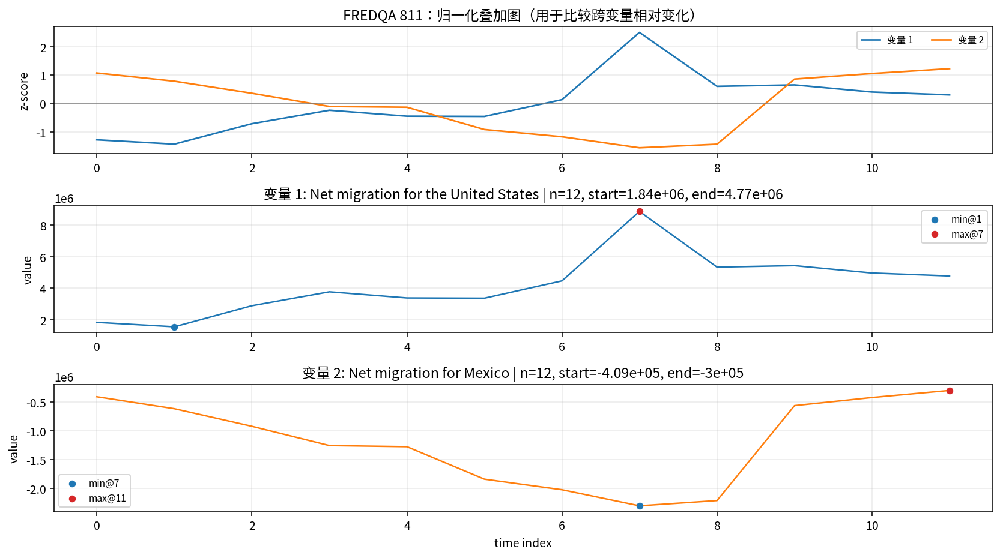

❓ QA 问题与中文翻译

**题干原文**

> You are a time series analysis expert. In a cross-border migration system, there are 2 metrics: Net migration for the United States (positive values mean more people entering than leaving)&lt;ts&gt;&lt;ts/&gt;; Net migration for Mexico (negative values mean more people leaving than entering)&lt;ts&gt;&lt;ts/&gt;. The metrics are 5-year estimates from 1962 to 2017. Key data points: 1992 U.S. net migration = 4,463,754, 1997 U.S. net migration = 8,859,954; 1992 Mexico net migration = -2,018,533, 1997 Mexico net migration = -2,296,470. From 1962–1992, U.S. net migration grew at an annual rate of 5.3%; between 1992–1997, this growth rate doubled to ~13% due to increased non-Mexican immigration (e.g., from Asia). Mexico’s net migration is historically a “mirror image” of the U.S.’s, meaning the ratio of Mexico’s net migration to the U.S.’s net migration remains relatively constant over time. If the 1992–1997 surge in U.S. net migration had not occurred (i.e., U.S. net migration continued growing at the 1962–1992 rate of 5.3% annually) and Mexico’s net migration had maintained its 1992 ratio to U.S. net migration, approximately how much higher or lower would Mexico’s 1997 net migration have been compared to its actual 1997 value?

**题干中文翻译**

> 你是一名时间序列分析专家。在一个跨境迁移系统中，有 2 个指标：美国的净迁移（正值表示进入人数多于离开人数）&lt;ts&gt;&lt;ts/&gt;；墨西哥的净迁移（负值表示离开人数多于进入人数）&lt;ts&gt;&lt;ts/&gt;。这些指标是 1962 年到 2017 年的 5 年估计值。关键数据点：1992 年美国净迁移 = 4,463,754，1997 年美国净迁移 = 8,859,954；1992 年墨西哥净迁移 = -2,018,533，1997 年墨西哥净迁移 = -2,296,470。从 1962 年到 1992 年，美国净迁移以每年 5.3% 的速度增长；在 1992 年到 1997 年之间，由于非墨西哥移民增加（例如来自亚洲），这一增长率翻了一番，约为 13%。墨西哥的净迁移在历史上是美国净迁移的“镜像”，这意味着墨西哥净迁移与美国净迁移的比率随时间保持相对恒定。如果 1992 年到 1997 年美国净迁移的激增没有发生（即美国净迁移继续以 1962 年到 1992 年每年 5.3% 的速度增长），并且墨西哥的净迁移维持其 1992 年相对于美国净迁移的比率，那么与其 1997 年的实际值相比，墨西哥 1997 年的净迁移大约会高多少或低多少？

**选项**

| 选项 | 原文 | 中文翻译 |
| --- | --- | --- |
| `A` | Actual Mexican net migration would be ~320,000 higher than counterfactual | 实际的墨西哥净迁移将比反事实情形高约 320,000 |
| `B` | Actual Mexican net migration would be ~320,000 lower than counterfactual | 实际的墨西哥净迁移将比反事实情形低约 320,000 |
| `C` | Actual Mexican net migration would be ~640,000 higher than counterfactual | 实际的墨西哥净迁移将比反事实情形高约 640,000 |
| `D` | Actual Mexican net migration would be ~640,000 lower than counterfactual | 实际的墨西哥净迁移将比反事实情形低约 640,000 |

**正确答案**：`A`

**标准解释原文**

> First, calculate the counterfactual 1997 U.S. net migration by extending the 1962–1992 5.3% annual growth rate: 4,463,754 * (1 + 0.053)^5 ≈ 5,777,629. Next, compute the 1992 ratio of Mexico’s to U.S.’s net migration: -2,018,533 / 4,463,754 ≈ -0.452. Apply this ratio to the counterfactual U.S. value to get Mexico’s counterfactual 1997 net migration: 5,777,629 * (-0.452) ≈ -2,612,644. Compare to actual 1997 Mexico net migration (-2,296,470): Actual minus counterfactual equals ~316,174, or ~320,000 higher. Counterfactually, if the U.S. surge (driven by non-Mexican immigration) had not occurred, Mexico’s net migration would have followed the mirror ratio and become more negative (lower). Since the surge was non-Mexican, Mexico’s actual net migration was less negative (higher) than the counterfactual.

**标准解释中文翻译**

> 首先，通过延续 1962 年到 1992 年每年 5.3% 的增长率，计算反事实的 1997 年美国净迁移：4,463,754 * (1 + 0.053)^5 ≈ 5,777,629。接下来，计算 1992 年墨西哥净迁移与美国净迁移的比率：-2,018,533 / 4,463,754 ≈ -0.452。将这一比率应用于反事实的美国数值，得到墨西哥反事实的 1997 年净迁移：5,777,629 * (-0.452) ≈ -2,612,644。与实际的 1997 年墨西哥净迁移（-2,296,470）相比：实际值减去反事实值等于约 316,174，即高约 320,000。反事实地说，如果美国的激增（由非墨西哥移民推动）没有发生，墨西哥的净迁移将会遵循镜像比率并变得更负（更低）。由于这一激增是非墨西哥来源，墨西哥的实际净迁移比反事实情形更不负（更高）。

📝 生成的 caption 与中文翻译

##### 变量 1：Net migration for the United States

**OpenTSLM caption 原文**

> The time series shows a strong seasonal pattern with a period of 4 quarters, and a high level of volatility. The overall trend is up then down then up, with a notable peak in the first half that is about 1.5 standard deviations above the mean, followed by a valley in the second half that is about 1.6 standard deviations below the mean. The net migration for the U.S. is strongly positively correlated with net migration for China and strongly negatively correlated with net migration for Mexico.

**OpenTSLM caption 中文翻译**

> 该时间序列表现出强烈的季节性模式，周期为 4 个季度，且波动性很高。整体趋势先上升后下降再上升，前半段有一个显著峰值，约比均值高 1.5 个标准差，随后在后半段出现一个谷值，约比均值低 1.6 个标准差。美国的净迁移与中国的净迁移强正相关，并且与墨西哥的净迁移强负相关。

**ChatTS caption 原文**

> The overall trend is increasing. The global maximum occurs at point 11, which is in the last third of the window. Short-term fluctuations are more pronounced in the first half (points 1–6) due to the spike there.

**ChatTS caption 中文翻译**

> 整体趋势是上升的。全局最大值出现在第 11 个点，位于窗口的后三分之一。短期波动在前半段（第 1–6 个点）由于那里出现的尖峰而更为明显。

##### 变量 2：Net migration for Mexico

**OpenTSLM caption 原文**

> The time series shows a strong seasonal pattern with a period of 4 quarters, and a high level of volatility. The overall trend is downward, with a significant net decrease of over 124% across the entire time span. The decline is most pronounced in the first half of the window, followed by a continued but slower decrease in the second half. There is a notable peak early in the window, about 1.6 standard deviations above the mean, and a deep valley late in the window, about 1.8 standard deviations below the mean. The data is strongly correlated with another variable, indicating a potential shared underlying economic factor.

**OpenTSLM caption 中文翻译**

> 该时间序列表现出强烈的季节性模式，周期为 4 个季度，且波动性很高。整体趋势向下，在整个时间跨度内累计净下降超过 124%。下降在窗口的前半段最为明显，随后在后半段继续下降但速度更慢。窗口前期有一个显著峰值，约比均值高 1.6 个标准差；窗口后期有一个深谷，约比均值低 1.8 个标准差。该数据与另一个变量强相关，表明可能存在共同的潜在经济因素。

**ChatTS caption 原文**

> The overall trend is steady. The global maximum occurs at point 9, which is in the first third of the 12-point window. The first half of the window (points 1-6) exhibits a significant downward spike with an amplitude of 1,570,538.74, whereas the second half (points 7-12) shows minimal variation. Therefore, the first half has larger short-term fluctuations.

**ChatTS caption 中文翻译**

> 整体趋势是平稳的。全局最大值出现在第 9 个点，位于 12 点窗口的前四分之一。窗口前半段（第 1-6 个点）出现了显著的向下尖峰，振幅为 1,570,538.74，而后半段（第 7-12 个点）变化很小。因此，前半段具有更大的短期波动。

🧪 下游 QA 模型答案 / 评分

表中所有预测都是同一个辅助 QA 模型 `gpt-5.4` 的输出；六行只改变输入证据形式。

| 输入条件 | 预测答案 | Gold | 是否正确 | 模型原始输出 |
| --- | --- | --- | --- | --- |
| 只给题目和选项 (`meta_only`) | `B` | `A` | ✗ 错误 | B |
| 题目 + 原始数值序列 (`numbers`) | `B` | `A` | ✗ 错误 | B |
| 题目 + OpenTSLM caption (`opentslm_caption`) | `A` | `A` | ✓ 正确 | A |
| 题目 + OpenTSLM caption + 数值 (`opentslm_caption_plus`) | `D` | `A` | ✗ 错误 | D |
| 题目 + ChatTS caption (`chatts_caption`) | `A` | `A` | ✓ 正确 | A |
| 题目 + ChatTS caption + 数值 (`chatts_caption_plus`) | `B` | `A` | ✗ 错误 | B |

🔎 Case 分析

- **答案格局**：`meta_only=B✗, numbers=B✗, opentslm_caption=A✓, opentslm_caption_plus=D✗, chatts_caption=A✓, chatts_caption_plus=B✗`。
- **关键问题**：OpenTSLM 和 ChatTS caption-only 都能答对，但加上数值后又失败，说明下游模型面对长题干、反事实增长率和原始数值时会出现证据整合不稳定；caption 有时像筛选后的线索，numbers 则增加了干扰。
- **对训练失败的含义**：这类 case 显示，当前 caption 训练更像是在学习通用趋势/峰谷/波动模板，而不是学习“下游 QA 所需的证据提取”。FREDQA 的正确答案经常依赖指定日期、指定窗口、比值、差值、反事实外推或领域机制；这些信息如果没有被 caption 明确保留，下游 GPT 即使很强也只能依赖题干先验或被错误摘要带偏。

## 6. 当前证据支持和不支持的 claim

### 6.1 支持的 claim

| Claim | 证据 |
| --- | --- |
| OpenTSLM caption 存在严重事实性问题 | periodicity hallucination 在 TSShapeQA-OOD / dataset_a / TSAQA-caption-source 分别为 69.7% / 75.7% / 59.4% |
| 自由文本 caption 会丢失 raw numbers 中可答题的信息 | TSShapeQA 两个 caption 都错、numbers 对 15.2%；TSAQA 18.9%；TimeSeriesExam 18.6% |
| caption+numbers 不是稳定优于 numbers | 多数 benchmark 的 cap+num 相对 numbers 为负或接近 0，只有 dataset_a ChatTS 是明显正例 |
| FREDQA overall accuracy 受 meta-only shortcut 强烈影响 | meta-only 80.96%；hard subset 中 numbers 只有 23.48%，caption-only 更低 |
| 领域题必须区分 domain_shell 和真正领域知识 | 2822 题中 domain_shell 52.0%，domain_knowledge_required 24.4% |
| 多变量题需要结构化跨变量 evidence，而不是单序列 caption 堆叠 | TSAQA cross-series numbers 76.7%，caption-only 约 52%；dataset_a_raw_multivar cap+num 仅打平 numbers |

### 6.2 目前不应过度声称的 claim

| 不应声称 | 原因 |
| --- | --- |
| caption interface 整体无价值 | dataset_a ChatTS 有明显正效应；FREDQA 也存在少量 caption rescue case |
| ChatTS 是可靠上限 | ChatTS 在 TSAQA、FREDQA、TimeSeriesExam 仍不稳定，且 caption+numbers 经常不优于 numbers |
| FREDQA 80%+ 表示模型具备强时序领域推理 | meta-only 已经 80.96%，hard subset 后所有条件都大幅下降 |
| 只修生成失败就能解决 OpenTSLM | factuality audit 显示即使生成流畅，slot-level 事实仍大量错误 |
| 多变量问题只需更多 caption | 多变量错误集中在变量绑定、窗口对齐、机制解释，应该改 evidence schema 或工具接口 |

## 7. 下一步优先级

1. **Task 2: Information-loss vs hallucination vs integration failure 分离。** 用 factuality audit 的 slot 结果 join QA outcomes，把“两 caption 都错但 numbers 对”和 caption+numbers harm 拆成三类。这会直接回答“该修 captioner、schema，还是下游 prompt/融合策略”。

2. **Task 3: Conditioning-collapse 归因。** 对 caption-only 错样本做 shuffle caption 反事实，量化 caption 是否真的 condition on input。若原配和错配 accuracy 接近，说明主要问题是输入无关或模板化生成。

3. **FREDQA evidence schema pilot。** 对 hard subset 中的 interventional / counterfactual / ratio / window-average 题，生成结构化 evidence：变量、日期、窗口值、差值、比值、排序、事件前后变化。比较 schema vs free-form caption。

4. **Multi-variable relation table。** 对 TSAQA cross-series 和 dataset_a_raw_multivar 输出跨变量矩阵，而不是每条序列单独 caption。指标包括局部事件对齐、相关方向、同源领域机制、冲突证据。

5. **Generation failure × QA failure join。** 把 OpenTSLM 的 token collapse / number dump / premature stop 标记与 QA outcome 合并，分清工程生成失败和方法性事实错误。

6. **Oracle caption upper bound。** 用 GT-derived structured caption 给下游 QA，估计 caption paradigm 的理论上限。如果 oracle caption 很高，瓶颈在 captioner；如果仍低，瓶颈在 interface 或 downstream reasoning。

## 8. OpenTSLM 与 ChatTS 训练数据规模对比

本节统计的是 caption / QA 训练样本的规模，不是原始时间点数量。一个样本对应一条 JSONL 训练记录，通常包含一个时间序列窗口、caption 或 QA 文本，以及 metadata。

### 8.1 OpenTSLM/LTSGen mixed 训练数据

按 `ablation_vars1_mixed` winner checkpoint 实际使用的 LTSGen/OpenTSLM mixed caption 数据口径，训练集为 **55,550**，验证集为 **6,234**，测试集为 **1,171**。另外有一个独立均衡 eval split，规模为 **1,471**。

| 项目 | 路径 |
| --- | --- |
| mixed 数据目录 | `/cluster/home/user1/hulining/TSDataset/LTSGen/gen_tst_dataset/opentslm/` |
| winner checkpoint | `/cluster1/user1/hulining/opentslm_checkpoints/Qwen3_4B/OpenTSLMFlamingo/ablation_vars1_mixed/stage2_captioning/` |

**OpenTSLM mixed split 按任务拆分：**

| 任务 | train | validation | test |
| --- | ---: | ---: | ---: |
| forecasting | 7,617 | 840 | 840 |
| anomaly | 1,072 | 131 | 131 |
| classification | 46,861 | 5,263 | 200 |
| **合计** | **55,550** | **6,234** | **1,171** |

**OpenTSLM mixed train 按数据源拆分：**

| 来源 | train 样本数 |
| --- | ---: |
| UCR2018 | 46,861 |
| electricity | 2,624 |
| traffic | 2,592 |
| ETT | 1,084 |
| NAB | 1,072 |
| FRED | 939 |
| weather | 328 |
| exchange_rate | 46 |
| illness | 4 |

这里的关键点是，最终训练使用的是 `mixed/train.jsonl` 这一组数据，而不是本地 `gen_tst_dataset/opentslm/` 下所有窗口长度版本和中间 split 的总和。后者加起来有 **199,590** 行，但包含多个中间导出版本，不能当作 `ablation_vars1_mixed` 的最终训练规模。

### 8.2 ChatTS 公开训练数据规模

ChatTS VLDB 论文 Table 1 给出的训练数据规模是 **154,852** 个样本。论文同时说明，ChatTS 基于 `Qwen2.5-14B-Instruct`，采用两阶段 fine-tuning：large-scale alignment training 和 supervised fine-tuning，并且训练序列长度覆盖 **64 到 1024**。

| 阶段 | 数据集 | 样本数 |
| --- | --- | ---: |
| Alignment | UTS | 35,000 |
| Alignment | MTS-Shape | 35,000 |
| Alignment | MTS-Local | 35,000 |
| SFT | TSEvol | 44,802 |
| SFT | Instruct Follow | 5,050 |
| **合计** |  | **154,852** |

来源：ChatTS VLDB 论文 Table 1：<https://www.vldb.org/pvldb/vol18/p2385-xie.pdf>

官方 HuggingFace 当前发布的数据池更大，HF datasets-server 显示总计 **262,295 rows**。这个口径包含两个 alignment 变体和 dev split，因此不能和论文 Table 1 简单当作同一个训练口径。

| HF config | rows |
| --- | ---: |
| `align_256` | 105,035 |
| `align_random` | 105,085 |
| `sft` | 44,802 |
| `ift` | 6,373 |
| `dev` | 1,000 |
| **合计** | **262,295** |

HF README 说明了这些 config 的含义，并给出推荐训练策略：Stage 1 混合 `align_256` 与 `ift`，Stage 2 混合 `sft`、`ift` 与 `align_random`。训练脚本也对应这一设置。

| 资料 | 链接 |
| --- | --- |
| ChatTS training dataset | <https://huggingface.co/datasets/ChatTSRepo/ChatTS-Training-Dataset/blob/main/README.md> |
| Stage 1 training script | <https://raw.githubusercontent.com/xiezhe-24/ChatTS-Training/main/scripts/full/train_stage1.sh> |
| Stage 2 training script | <https://raw.githubusercontent.com/xiezhe-24/ChatTS-Training/main/scripts/full/train_stage2.sh> |

### 8.3 对比结论

| 模型 / 项目 | 论文或最终训练口径 | released data pool 口径 |
| --- | ---: | ---: |
| OpenTSLM/LTSGen mixed | 55,550 train / 6,234 val / 1,171 test | 本地所有中间 JSONL 共 199,590 行，但不是最终训练集规模 |
| ChatTS | 154,852 samples, paper Table 1 | HF released pool 262,295 rows |

按论文或最终训练口径比较，ChatTS 的公开训练数据规模约为 OpenTSLM/LTSGen mixed train 的 **2.8 倍**，即 `154,852 / 55,550`。如果按 HuggingFace released data pool 口径比较，则约为 **4.7 倍**，即 `262,295 / 55,550`。

这个差异不只是数量差异，也是数据结构差异。OpenTSLM/LTSGen mixed train 高度偏向 UCR classification，46,861/55,550 个训练样本来自 UCR2018；ChatTS 则显式构造了 alignment、multivariate correlation、local fluctuation、TSEvol reasoning 和 instruction-following 等数据类型。因此，当前 case study 中观察到的 OpenTSLM caption 泛化、周期幻觉和跨变量绑定不足，不能只解释为模型架构问题，也和训练数据的规模、任务组成、以及是否显式覆盖多变量/推理/指令跟随能力有关。
