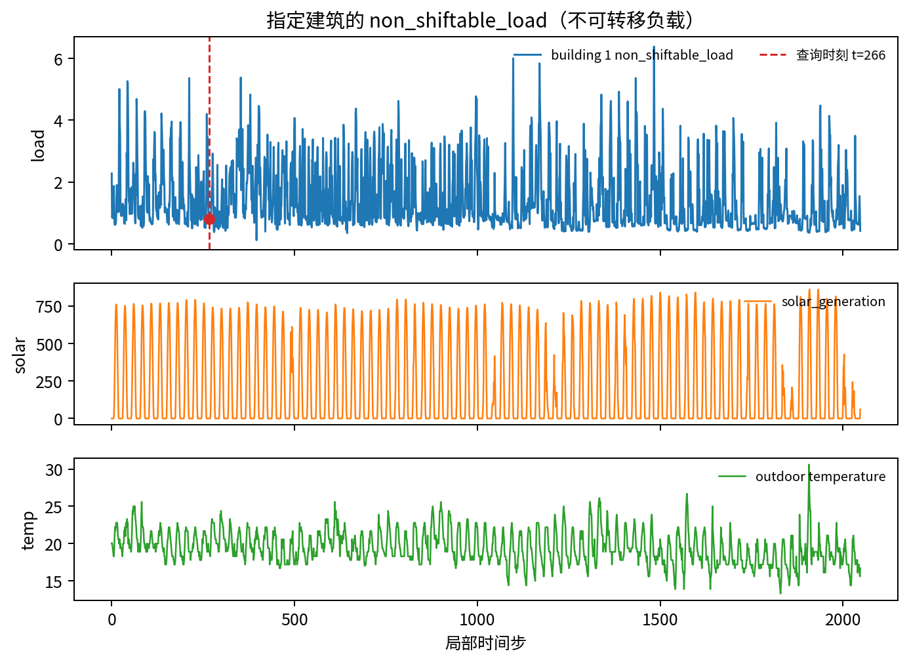
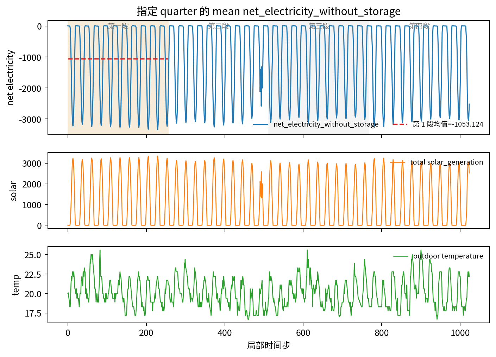
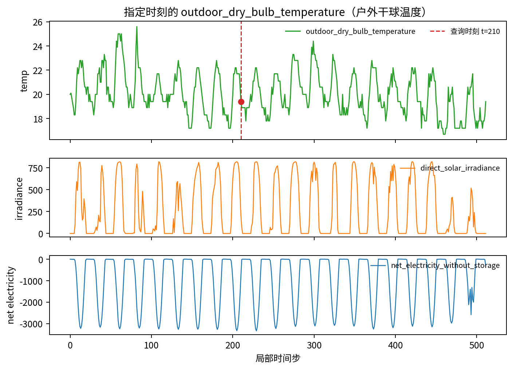
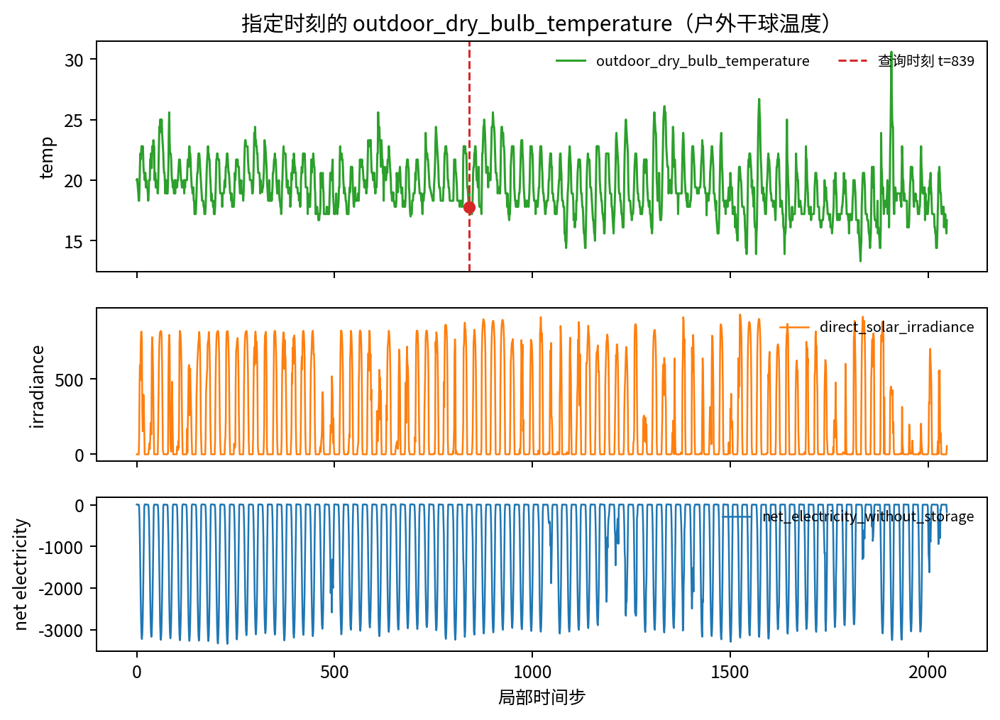
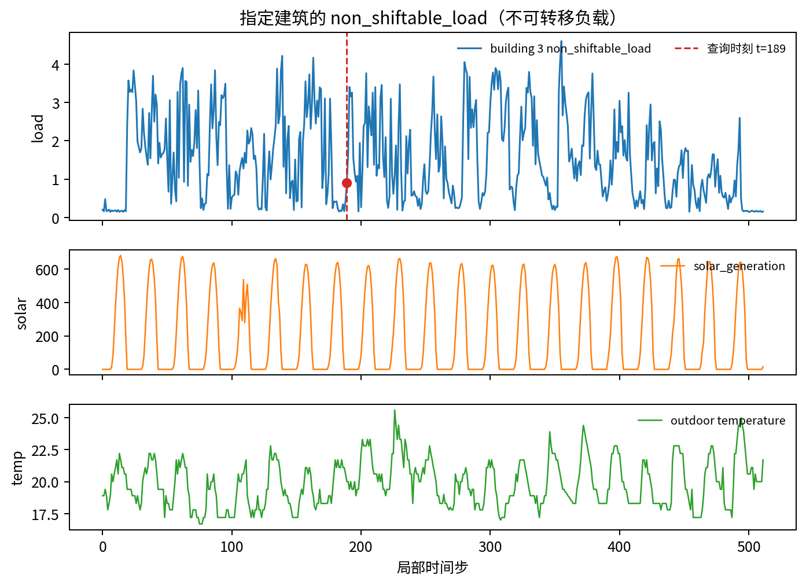

# CityLearn 中文 Case Study：第二个 simulator 的 evidence-caption gate

这个报告展示 CityLearn v2 feasibility gate 中的 5 个代表性案例。所有案例都带有背景卡片，避免“直接问变量名、没有领域背景”的问题；但背景卡片只解释变量和轨迹设置，不包含答案数值。

## 数据与总体结果

- 数据：`.research/real-citylearn-20260513/citylearn_real_v2_slot/citylearn_real_v2_slot.jsonl`
- 预测：`.research/real-citylearn-20260513/citylearn_real_v2_slot/core_sweep_context_v3/predictions.jsonl`
- 样本数：72
- 答案字母分布：{'B': 18, 'A': 18, 'D': 18, 'C': 18}
- 任务分布：{'building_load_value_slot': 24, 'quarter_net_electricity_mean_value_slot': 24, 'outdoor_temperature_value_slot': 24}
- Horizon：512 / 1024 / 2048 小时步

| Condition | Accuracy | Mean prompt chars |
| --- | ---: | ---: |
| `meta_only` | 0.2361 | 1,347.0 |
| `generic_caption` | 0.2500 | 1,532.0 |
| `oracle_evidence_caption` | 1.0000 | 1,425.0 |
| `numbers_sampled_32` | 0.3333 | 9,274.5 |
| `numbers_sampled_64` | 0.3889 | 16,955.5 |
| `numbers_sampled_128` | 0.4583 | 32,339.0 |

## 读法

- `generic_caption`（通用说明文本）只说明这段轨迹包含哪些变量。
- `oracle_evidence_caption`（oracle 证据说明文本）是从程序 ground truth（真值）抽取出的最短证据。
- `sampled numbers`（采样数值）把轨迹按固定数量采样成文本表格，prompt 明显更长。
- 本报告不宣称 raw numbers（原始数值）一定失败；控制样例显示 sampled numbers 有时能答对。当前结论是 evidence caption 更短、更稳定、且可验证。

## 案例

Case 01：建筑负载单点读取：generic caption 和 sampled numbers 都可能错

### 基本信息

| 字段 | 内容 |
| --- | --- |
| Case ID | `simqa::citylearn_real::citylearn_challenge_2022_phase_1_trace_2048::h2048::s0::building_load_value_slot::bb71c3a00d` |
| 数据源 | CityLearn packaged dataset（打包数据集） |
| 任务类型 | `building_load_value_slot` / 指定建筑负载数值 |
| Horizon | 2048 小时步 |
| 窗口 | start=0, end=2048 |
| 案例标签 | 失败样例 |

背景卡片

**CityLearn context card（背景卡片）**
- CityLearn 是 building-energy simulation benchmark（建筑能耗仿真基准）。trace（轨迹）是一段按小时排列的建筑、天气、电价和碳强度变量序列。
- `building` 表示 district/neighborhood（区域或社区）中的某栋建筑编号。
- `non_shiftable_load` 是建筑中不能被控制动作移动的 electricity demand（用电需求）。
- `solar_generation` 是本地 photovoltaic generation（光伏发电）。太阳能发电越大，net electricity（净用电）可能越低，甚至为负。
- `net_electricity_without_storage` 在这个导出轨迹中等于总 non_shiftable_load 减去总 solar_generation，不考虑储能。
- `outdoor_dry_bulb_temperature` 是 outdoor air temperature（室外空气温度）。
- 回答必须使用 trace values（轨迹数值）。背景定义本身不会决定答案。

**Trace setup（轨迹设置）**
- 这是 packaged CityLearn dataset trace（打包数据集轨迹），作为单条 factual observation window（事实观测窗口）导出。
- `local_t` 是所选小时窗口内部的局部时间索引。
- 对 quarter-based questions（四分段问题），把局部窗口划分为四个连续且长度相等的 quarter。

**Task rule（任务规则）**
读取题目指定 building（建筑）和 `local_t` 上的 `non_shiftable_load`。

时序图

QA 问题

**问题（中文）**：在 local_t=266 时，building 1 的 non_shiftable_load（不可转移负载）是多少？

**原始问题**：`At local_t=266, what is non_shiftable_load for building 1?`

**选项**：

- A. 0.643
- B. 0.693
- C. 0.743
- D. 0.803

**正确答案**：`D`，D. 0.803

Caption（说明文本）

**generic caption（通用说明文本）**：

这个 CityLearn 建筑能耗轨迹窗口包含 2048 个小时步，覆盖 5 栋建筑，变量包括建筑负载、太阳能发电、天气、电价和碳强度。

**oracle evidence caption（oracle 证据说明文本）**：

在 local_t=266 时，building 1 的 non_shiftable_load 为 0.803。

各方法回答

| 输入条件 | 原始条件名 | 预测 | 正确性 | Prompt 字符数 | 选项文本 |
| --- | --- | --- | --- | ---: | --- |
| 仅元信息 | `meta_only` | `B` | 错误 | 1336 | B. 0.693 |
| generic caption（通用说明文本） | `generic_caption` | `B` | 错误 | 1521 | B. 0.693 |
| oracle evidence caption（oracle 证据说明文本） | `oracle_evidence_caption` | `D` | 正确 | 1413 | D. 0.803 |
| sampled numbers（采样数值）32 行 | `numbers_sampled_32` | `B` | 错误 | 9262 | B. 0.693 |
| sampled numbers（采样数值）64 行 | `numbers_sampled_64` | `D` | 正确 | 16975 | D. 0.803 |
| sampled numbers（采样数值）128 行 | `numbers_sampled_128` | `B` | 错误 | 32397 | B. 0.693 |

可验证字段

| 验证字段 | 数值 |
| --- | --- |
| `slot_local_t` | `266` |
| `slot_building` | `1` |
| `slot_non_shiftable_load` | `0.8027` |
| `slot_value_mode` | `citylearn_slot_v1` |
| `answer_letter_mode` | `global_hash_balanced_citylearn_v1` |

案例分析

这个问题考察 exact slot value（精确槽位数值）：必须定位到指定 building（建筑）和 local_t（局部时间步），读取 non_shiftable_load（不可转移负载）。背景卡片能解释变量含义，但不会告诉模型该时刻的具体数值。

这个案例的关键点是：oracle evidence caption（oracle 证据说明文本）只保留回答问题所需的证据槽位，
因此 prompt 很短且答案可核验；generic caption（通用说明文本）只描述变量范围，不包含问题所需数值。
sampled numbers（采样数值）如果答错，通常不是因为模型不知道变量含义，而是因为在长窗口里定位或聚合
指定证据不稳定；如果答对，也需要显著更长的 prompt。

Case 02：quarter 均值聚合：稀疏采样难以恢复窗口平均

### 基本信息

| 字段 | 内容 |
| --- | --- |
| Case ID | `simqa::citylearn_real::citylearn_challenge_2022_phase_1_trace_2048::h1024::s0::quarter_net_electricity_mean_value_slot::5b839373e0` |
| 数据源 | CityLearn packaged dataset（打包数据集） |
| 任务类型 | `quarter_net_electricity_mean_value_slot` / 指定 quarter 平均净用电 |
| Horizon | 1024 小时步 |
| 窗口 | start=0, end=1024 |
| 案例标签 | 聚合失败 |

背景卡片

**CityLearn context card（背景卡片）**
- CityLearn 是 building-energy simulation benchmark（建筑能耗仿真基准）。trace（轨迹）是一段按小时排列的建筑、天气、电价和碳强度变量序列。
- `building` 表示 district/neighborhood（区域或社区）中的某栋建筑编号。
- `non_shiftable_load` 是建筑中不能被控制动作移动的 electricity demand（用电需求）。
- `solar_generation` 是本地 photovoltaic generation（光伏发电）。太阳能发电越大，net electricity（净用电）可能越低，甚至为负。
- `net_electricity_without_storage` 在这个导出轨迹中等于总 non_shiftable_load 减去总 solar_generation，不考虑储能。
- `outdoor_dry_bulb_temperature` 是 outdoor air temperature（室外空气温度）。
- 回答必须使用 trace values（轨迹数值）。背景定义本身不会决定答案。

**Trace setup（轨迹设置）**
- 这是 packaged CityLearn dataset trace（打包数据集轨迹），作为单条 factual observation window（事实观测窗口）导出。
- `local_t` 是所选小时窗口内部的局部时间索引。
- 对 quarter-based questions（四分段问题），把局部窗口划分为四个连续且长度相等的 quarter。

**Task rule（任务规则）**
对题目指定 quarter（四分段）中的 `net_electricity_without_storage` 求平均。

时序图

QA 问题

**问题（中文）**：这个轨迹窗口第 1 个 quarter（四分段）的 mean net_electricity_without_storage（平均无储能净用电）是多少？

**原始问题**：`What is the mean net_electricity_without_storage in quarter 1 of this trace window?`

**选项**：

- A. -935.354
- B. -925.816
- C. -909.619
- D. -1053.124

**正确答案**：`D`，D. -1053.124

Caption（说明文本）

**generic caption（通用说明文本）**：

这个 CityLearn 建筑能耗轨迹窗口包含 2048 个小时步，覆盖 5 栋建筑，变量包括建筑负载、太阳能发电、天气、电价和碳强度。

**oracle evidence caption（oracle 证据说明文本）**：

第 1 个 quarter 的 mean net_electricity_without_storage 为 -1053.124。

各方法回答

| 输入条件 | 原始条件名 | 预测 | 正确性 | Prompt 字符数 | 选项文本 |
| --- | --- | --- | --- | ---: | --- |
| 仅元信息 | `meta_only` | `A` | 错误 | 1376 | A. -935.354 |
| generic caption（通用说明文本） | `generic_caption` | `A` | 错误 | 1561 | A. -935.354 |
| oracle evidence caption（oracle 证据说明文本） | `oracle_evidence_caption` | `D` | 正确 | 1461 | D. -1053.124 |
| sampled numbers（采样数值）32 行 | `numbers_sampled_32` | `B` | 错误 | 9307 | B. -925.816 |
| sampled numbers（采样数值）64 行 | `numbers_sampled_64` | `A` | 错误 | 16976 | A. -935.354 |
| sampled numbers（采样数值）128 行 | `numbers_sampled_128` | `C` | 错误 | 32329 | C. -909.619 |

可验证字段

| 验证字段 | 数值 |
| --- | --- |
| `slot_quarter` | `1` |
| `slot_mean_net_electricity_without_storage` | `-1053.1236` |
| `slot_value_mode` | `citylearn_slot_v1` |
| `answer_letter_mode` | `global_hash_balanced_citylearn_v1` |

案例分析

这个问题考察 aggregation（聚合）：要先在每个时间步计算或读取 net_electricity_without_storage（无储能净用电），再对指定 quarter（四分段）求均值。稀疏 sampled numbers（采样数值）如果没有覆盖足够多时间点，就很难稳定恢复窗口均值。

这个案例的关键点是：oracle evidence caption（oracle 证据说明文本）只保留回答问题所需的证据槽位，
因此 prompt 很短且答案可核验；generic caption（通用说明文本）只描述变量范围，不包含问题所需数值。
sampled numbers（采样数值）如果答错，通常不是因为模型不知道变量含义，而是因为在长窗口里定位或聚合
指定证据不稳定；如果答对，也需要显著更长的 prompt。

Case 03：户外温度定位：采样数值有时能答对，但仍比 evidence 冗长

### 基本信息

| 字段 | 内容 |
| --- | --- |
| Case ID | `simqa::citylearn_real::citylearn_challenge_2022_phase_1_trace_2048::h512::s0::outdoor_temperature_value_slot::e898d06e6b` |
| 数据源 | CityLearn packaged dataset（打包数据集） |
| 任务类型 | `outdoor_temperature_value_slot` / 指定时刻户外温度 |
| Horizon | 512 小时步 |
| 窗口 | start=0, end=512 |
| 案例标签 | 对照样例 |

背景卡片

**CityLearn context card（背景卡片）**
- CityLearn 是 building-energy simulation benchmark（建筑能耗仿真基准）。trace（轨迹）是一段按小时排列的建筑、天气、电价和碳强度变量序列。
- `building` 表示 district/neighborhood（区域或社区）中的某栋建筑编号。
- `non_shiftable_load` 是建筑中不能被控制动作移动的 electricity demand（用电需求）。
- `solar_generation` 是本地 photovoltaic generation（光伏发电）。太阳能发电越大，net electricity（净用电）可能越低，甚至为负。
- `net_electricity_without_storage` 在这个导出轨迹中等于总 non_shiftable_load 减去总 solar_generation，不考虑储能。
- `outdoor_dry_bulb_temperature` 是 outdoor air temperature（室外空气温度）。
- 回答必须使用 trace values（轨迹数值）。背景定义本身不会决定答案。

**Trace setup（轨迹设置）**
- 这是 packaged CityLearn dataset trace（打包数据集轨迹），作为单条 factual observation window（事实观测窗口）导出。
- `local_t` 是所选小时窗口内部的局部时间索引。
- 对 quarter-based questions（四分段问题），把局部窗口划分为四个连续且长度相等的 quarter。

**Task rule（任务规则）**
读取题目指定 `local_t` 上的 `outdoor_dry_bulb_temperature`。

时序图

QA 问题

**问题（中文）**：在 local_t=210 时，outdoor_dry_bulb_temperature（户外干球温度）是多少？

**原始问题**：`At local_t=210, what is outdoor_dry_bulb_temperature?`

**选项**：

- A. 18.338
- B. 18.823
- C. 19.997
- D. 19.400

**正确答案**：`D`，D. 19.400

Caption（说明文本）

**generic caption（通用说明文本）**：

这个 CityLearn 建筑能耗轨迹窗口包含 2048 个小时步，覆盖 5 栋建筑，变量包括建筑负载、太阳能发电、天气、电价和碳强度。

**oracle evidence caption（oracle 证据说明文本）**：

在 local_t=210 时，outdoor_dry_bulb_temperature 为 19.400。

各方法回答

| 输入条件 | 原始条件名 | 预测 | 正确性 | Prompt 字符数 | 选项文本 |
| --- | --- | --- | --- | ---: | --- |
| 仅元信息 | `meta_only` | `B` | 错误 | 1330 | B. 18.823 |
| generic caption（通用说明文本） | `generic_caption` | `A` | 错误 | 1515 | A. 18.338 |
| oracle evidence caption（oracle 证据说明文本） | `oracle_evidence_caption` | `D` | 正确 | 1403 | D. 19.400 |
| sampled numbers（采样数值）32 行 | `numbers_sampled_32` | `B` | 错误 | 9254 | B. 18.823 |
| sampled numbers（采样数值）64 行 | `numbers_sampled_64` | `D` | 正确 | 16933 | D. 19.400 |
| sampled numbers（采样数值）128 行 | `numbers_sampled_128` | `D` | 正确 | 32345 | D. 19.400 |

可验证字段

| 验证字段 | 数值 |
| --- | --- |
| `slot_local_t` | `210` |
| `slot_outdoor_dry_bulb_temperature` | `19.4000` |
| `slot_value_mode` | `citylearn_slot_v1` |
| `answer_letter_mode` | `global_hash_balanced_citylearn_v1` |

案例分析

这个问题看似简单，但仍要求从长窗口中定位指定 local_t 的 outdoor_dry_bulb_temperature（户外干球温度）。sampled numbers 能否答对取决于采样点是否接近查询时刻，而不是只取决于 prompt（提示文本）长度。

这个案例的关键点是：oracle evidence caption（oracle 证据说明文本）只保留回答问题所需的证据槽位，
因此 prompt 很短且答案可核验；generic caption（通用说明文本）只描述变量范围，不包含问题所需数值。
sampled numbers（采样数值）如果答错，通常不是因为模型不知道变量含义，而是因为在长窗口里定位或聚合
指定证据不稳定；如果答对，也需要显著更长的 prompt。

Case 04：2048 步窗口：oracle evidence 保持短而稳定

### 基本信息

| 字段 | 内容 |
| --- | --- |
| Case ID | `simqa::citylearn_real::citylearn_challenge_2022_phase_1_trace_2048::h2048::s0::outdoor_temperature_value_slot::c69d53d315` |
| 数据源 | CityLearn packaged dataset（打包数据集） |
| 任务类型 | `outdoor_temperature_value_slot` / 指定时刻户外温度 |
| Horizon | 2048 小时步 |
| 窗口 | start=0, end=2048 |
| 案例标签 | 长窗口样例 |

背景卡片

**CityLearn context card（背景卡片）**
- CityLearn 是 building-energy simulation benchmark（建筑能耗仿真基准）。trace（轨迹）是一段按小时排列的建筑、天气、电价和碳强度变量序列。
- `building` 表示 district/neighborhood（区域或社区）中的某栋建筑编号。
- `non_shiftable_load` 是建筑中不能被控制动作移动的 electricity demand（用电需求）。
- `solar_generation` 是本地 photovoltaic generation（光伏发电）。太阳能发电越大，net electricity（净用电）可能越低，甚至为负。
- `net_electricity_without_storage` 在这个导出轨迹中等于总 non_shiftable_load 减去总 solar_generation，不考虑储能。
- `outdoor_dry_bulb_temperature` 是 outdoor air temperature（室外空气温度）。
- 回答必须使用 trace values（轨迹数值）。背景定义本身不会决定答案。

**Trace setup（轨迹设置）**
- 这是 packaged CityLearn dataset trace（打包数据集轨迹），作为单条 factual observation window（事实观测窗口）导出。
- `local_t` 是所选小时窗口内部的局部时间索引。
- 对 quarter-based questions（四分段问题），把局部窗口划分为四个连续且长度相等的 quarter。

**Task rule（任务规则）**
读取题目指定 `local_t` 上的 `outdoor_dry_bulb_temperature`。

时序图

QA 问题

**问题（中文）**：在 local_t=839 时，outdoor_dry_bulb_temperature（户外干球温度）是多少？

**原始问题**：`At local_t=839, what is outdoor_dry_bulb_temperature?`

**选项**：

- A. 17.800
- B. 17.270
- C. 18.347
- D. 18.792

**正确答案**：`A`，A. 17.800

Caption（说明文本）

**generic caption（通用说明文本）**：

这个 CityLearn 建筑能耗轨迹窗口包含 2048 个小时步，覆盖 5 栋建筑，变量包括建筑负载、太阳能发电、天气、电价和碳强度。

**oracle evidence caption（oracle 证据说明文本）**：

在 local_t=839 时，outdoor_dry_bulb_temperature 为 17.800。

各方法回答

| 输入条件 | 原始条件名 | 预测 | 正确性 | Prompt 字符数 | 选项文本 |
| --- | --- | --- | --- | ---: | --- |
| 仅元信息 | `meta_only` | `B` | 错误 | 1331 | B. 17.270 |
| generic caption（通用说明文本） | `generic_caption` | `B` | 错误 | 1516 | B. 17.270 |
| oracle evidence caption（oracle 证据说明文本） | `oracle_evidence_caption` | `A` | 正确 | 1404 | A. 17.800 |
| sampled numbers（采样数值）32 行 | `numbers_sampled_32` | `D` | 错误 | 9257 | D. 18.792 |
| sampled numbers（采样数值）64 行 | `numbers_sampled_64` | `A` | 正确 | 16970 | A. 17.800 |
| sampled numbers（采样数值）128 行 | `numbers_sampled_128` | `A` | 正确 | 32392 | A. 17.800 |

可验证字段

| 验证字段 | 数值 |
| --- | --- |
| `slot_local_t` | `839` |
| `slot_outdoor_dry_bulb_temperature` | `17.8000` |
| `slot_value_mode` | `citylearn_slot_v1` |
| `answer_letter_mode` | `global_hash_balanced_citylearn_v1` |

案例分析

这个问题看似简单，但仍要求从长窗口中定位指定 local_t 的 outdoor_dry_bulb_temperature（户外干球温度）。sampled numbers 能否答对取决于采样点是否接近查询时刻，而不是只取决于 prompt（提示文本）长度。

这个案例的关键点是：oracle evidence caption（oracle 证据说明文本）只保留回答问题所需的证据槽位，
因此 prompt 很短且答案可核验；generic caption（通用说明文本）只描述变量范围，不包含问题所需数值。
sampled numbers（采样数值）如果答错，通常不是因为模型不知道变量含义，而是因为在长窗口里定位或聚合
指定证据不稳定；如果答对，也需要显著更长的 prompt。

Case 05：控制样例：sampled numbers 可以答对，但成本显著更高

### 基本信息

| 字段 | 内容 |
| --- | --- |
| Case ID | `simqa::citylearn_real::citylearn_challenge_2022_phase_1_trace_2048::h512::s384::building_load_value_slot::f7364c22fc` |
| 数据源 | CityLearn packaged dataset（打包数据集） |
| 任务类型 | `building_load_value_slot` / 指定建筑负载数值 |
| Horizon | 512 小时步 |
| 窗口 | start=384, end=896 |
| 案例标签 | 控制样例 |

背景卡片

**CityLearn context card（背景卡片）**
- CityLearn 是 building-energy simulation benchmark（建筑能耗仿真基准）。trace（轨迹）是一段按小时排列的建筑、天气、电价和碳强度变量序列。
- `building` 表示 district/neighborhood（区域或社区）中的某栋建筑编号。
- `non_shiftable_load` 是建筑中不能被控制动作移动的 electricity demand（用电需求）。
- `solar_generation` 是本地 photovoltaic generation（光伏发电）。太阳能发电越大，net electricity（净用电）可能越低，甚至为负。
- `net_electricity_without_storage` 在这个导出轨迹中等于总 non_shiftable_load 减去总 solar_generation，不考虑储能。
- `outdoor_dry_bulb_temperature` 是 outdoor air temperature（室外空气温度）。
- 回答必须使用 trace values（轨迹数值）。背景定义本身不会决定答案。

**Trace setup（轨迹设置）**
- 这是 packaged CityLearn dataset trace（打包数据集轨迹），作为单条 factual observation window（事实观测窗口）导出。
- `local_t` 是所选小时窗口内部的局部时间索引。
- 对 quarter-based questions（四分段问题），把局部窗口划分为四个连续且长度相等的 quarter。

**Task rule（任务规则）**
读取题目指定 building（建筑）和 `local_t` 上的 `non_shiftable_load`。

时序图

QA 问题

**问题（中文）**：在 local_t=189 时，building 3 的 non_shiftable_load（不可转移负载）是多少？

**原始问题**：`At local_t=189, what is non_shiftable_load for building 3?`

**选项**：

- A. 0.743
- B. 0.902
- C. 0.793
- D. 0.843

**正确答案**：`B`，B. 0.902

Caption（说明文本）

**generic caption（通用说明文本）**：

这个 CityLearn 建筑能耗轨迹窗口包含 2048 个小时步，覆盖 5 栋建筑，变量包括建筑负载、太阳能发电、天气、电价和碳强度。

**oracle evidence caption（oracle 证据说明文本）**：

在 local_t=189 时，building 3 的 non_shiftable_load 为 0.902。

各方法回答

| 输入条件 | 原始条件名 | 预测 | 正确性 | Prompt 字符数 | 选项文本 |
| --- | --- | --- | --- | ---: | --- |
| 仅元信息 | `meta_only` | `D` | 错误 | 1335 | D. 0.843 |
| generic caption（通用说明文本） | `generic_caption` | `A` | 错误 | 1520 | A. 0.743 |
| oracle evidence caption（oracle 证据说明文本） | `oracle_evidence_caption` | `B` | 正确 | 1412 | B. 0.902 |
| sampled numbers（采样数值）32 行 | `numbers_sampled_32` | `B` | 正确 | 9247 | B. 0.902 |
| sampled numbers（采样数值）64 行 | `numbers_sampled_64` | `B` | 正确 | 16912 | B. 0.902 |
| sampled numbers（采样数值）128 行 | `numbers_sampled_128` | `B` | 正确 | 32269 | B. 0.902 |

可验证字段

| 验证字段 | 数值 |
| --- | --- |
| `slot_local_t` | `189` |
| `slot_building` | `3` |
| `slot_non_shiftable_load` | `0.9024` |
| `slot_value_mode` | `citylearn_slot_v1` |
| `answer_letter_mode` | `global_hash_balanced_citylearn_v1` |

案例分析

这个问题考察 exact slot value（精确槽位数值）：必须定位到指定 building（建筑）和 local_t（局部时间步），读取 non_shiftable_load（不可转移负载）。背景卡片能解释变量含义，但不会告诉模型该时刻的具体数值。

这个案例的关键点是：oracle evidence caption（oracle 证据说明文本）只保留回答问题所需的证据槽位，
因此 prompt 很短且答案可核验；generic caption（通用说明文本）只描述变量范围，不包含问题所需数值。
sampled numbers（采样数值）如果答错，通常不是因为模型不知道变量含义，而是因为在长窗口里定位或聚合
指定证据不稳定；如果答对，也需要显著更长的 prompt。

