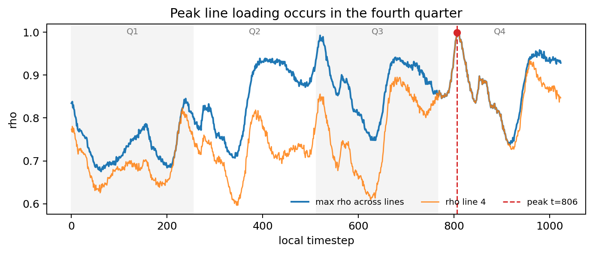
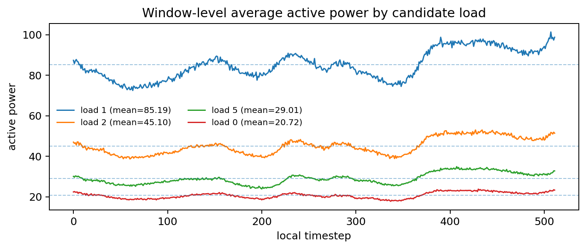
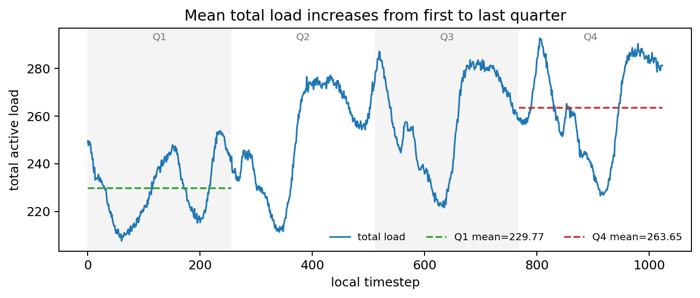
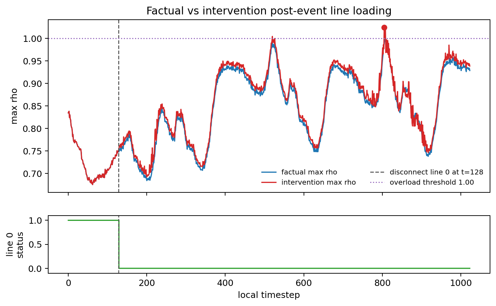
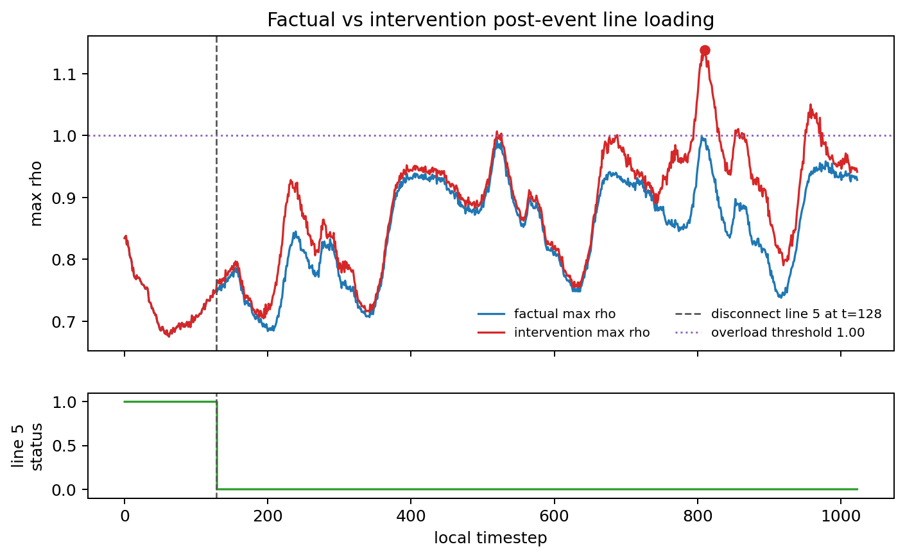

# Grid2Op Medium-Horizon Case Study

This report visualizes selected Grid2Op simulator-derived TS-QA cases. Ground truth is computed from trace arrays or paired factual/counterfactual traces. LLMs are only evaluated as answerers; they do not define the correct answer.

## Coverage

| Dimension | Value |
| --- | --- |
| Environment | `rte_case14_realistic` |
| Horizons | `512`, `1024`, `2048` in the benchmark; selected cases use `512/1024` |
| Observation cases | 3 |
| Counterfactual cases | 2 |
| Methods shown | `meta_only`, `generic_caption`, `oracle_evidence_caption`, sampled numeric prompts |

## Takeaways

- Observation/localization and aggregation cases show the largest gap: oracle evidence is short and correct, while sampled numeric prompts are long and often wrong.
- Counterfactual cases are useful for verifiability and threshold analysis, but current numeric prompts can solve many of them when the relevant facts are explicit in the sampled table.
- Case-level visualizations make the intended evidence clear: peak location, window average, first-vs-last quarter mean, and factual/counterfactual post-intervention max-rho.

## Cases

Case 01: Peak quarter localization: sampled numbers miss the late line-loading peak

### 基本信息

| 字段 | 内容 |
| --- | --- |
| Case ID | `simqa::grid2op_real::rte_case14_realistic_trace_2048_nooverflow::h1024::s0::peak_rho_quarter` |
| Source | `observation` |
| Horizon | `1024` |
| Task family | `peak_rho_quarter` |
| Correct answer | `A` |
| Answer label | `fourth` |
| GT source | `trace_array` |

关键结论：This is the cleanest localization failure. The true peak line loading is on line 4 at local t=806, in the fourth quarter. Generic caption lacks the event location, and all sampled-numbers budgets answer the wrong quarter despite much longer prompts.

时序图

QA 问题

**Question**

Which quarter of this Grid2Op trace window contains the maximum line loading?

**Options**

- A. the fourth quarter of the trace window
- B. the first quarter of the trace window
- C. the second quarter of the trace window
- D. the third quarter of the trace window

**Correct answer**: `A` - A. the fourth quarter of the trace window

Captions / Evidence

**Generic caption**

This Grid2Op power-grid trace window contains line loading, load, generator, and power-flow variables over 1024 steps.

**Oracle evidence caption**

The maximum line loading rho is 0.999 on line 4 at local t=806 (global t=806), which falls in the fourth quarter of the trace window.

**Verification facts**

| Fact | Value |
| --- | --- |
| `peak_rho` | `0.9990` |
| `peak_local_t` | `806` |
| `peak_global_t` | `806` |
| `peak_line` | `4` |
| `quarter` | `fourth` |

模型回答

| 输入条件 | 预测 | 正确性 | Prompt chars | 选项文本 |
| --- | --- | --- | ---: | --- |
| `meta_only` | `D` | ✗ | 382 | D. the third quarter of the trace window |
| `generic_caption` | `C` | ✗ | 521 | C. the second quarter of the trace window |
| `oracle_evidence_caption` | `A` | ✓ | 533 | A. the fourth quarter of the trace window |
| `numbers_sampled_32` | `D` | ✗ | 12813 | D. the third quarter of the trace window |
| `numbers_sampled_64` | `D` | ✗ | 25044 | D. the third quarter of the trace window |
| `numbers_sampled_128` | `D` | ✗ | 49498 | D. the third quarter of the trace window |

Case 分析

This is the cleanest localization failure. The true peak line loading is on line 4 at local t=806, in the fourth quarter. Generic caption lacks the event location, and all sampled-numbers budgets answer the wrong quarter despite much longer prompts.

Case 02: Average load aggregation: seeing sampled rows is not enough for window-level averages

### 基本信息

| 字段 | 内容 |
| --- | --- |
| Case ID | `simqa::grid2op_real::rte_case14_realistic_trace_1024::h512::s0::max_avg_load` |
| Source | `observation` |
| Horizon | `512` |
| Task family | `max_avg_load` |
| Correct answer | `A` |
| Answer label | `load 1` |
| GT source | `trace_array` |

关键结论：This case stresses aggregation over the whole window. The correct evidence is the window-average active power of load 1. Generic caption and all sampled numeric prompts choose a distractor, showing that raw sampled rows do not reliably substitute for the requested statistic.

时序图

QA 问题

**Question**

Which load has the highest average active power in this Grid2Op trace window?

**Options**

- A. load 1
- B. load 2
- C. load 5
- D. load 0

**Correct answer**: `A` - A. load 1

Captions / Evidence

**Generic caption**

This Grid2Op power-grid trace window contains line loading, load, generator, and power-flow variables over 512 steps.

**Oracle evidence caption**

Load 1 has the largest average active power over the window: 85.189.

**Verification facts**

| Fact | Value |
| --- | --- |
| `max_avg_load` | `1` |
| `avg_load_p` | `85.1891` |

模型回答

| 输入条件 | 预测 | 正确性 | Prompt chars | 选项文本 |
| --- | --- | --- | ---: | --- |
| `meta_only` | `D` | ✗ | 255 | D. load 0 |
| `generic_caption` | `D` | ✗ | 393 | D. load 0 |
| `oracle_evidence_caption` | `A` | ✓ | 341 | A. load 1 |
| `numbers_sampled_32` | `B` | ✗ | 12668 | B. load 2 |
| `numbers_sampled_64` | `B` | ✗ | 24875 | B. load 2 |
| `numbers_sampled_128` | `B` | ✗ | 49298 | B. load 2 |

Case 分析

This case stresses aggregation over the whole window. The correct evidence is the window-average active power of load 1. Generic caption and all sampled numeric prompts choose a distractor, showing that raw sampled rows do not reliably substitute for the requested statistic.

Case 03: Trend control case: numeric samples can solve simple aggregate trend questions

### 基本信息

| 字段 | 内容 |
| --- | --- |
| Case ID | `simqa::grid2op_real::rte_case14_realistic_trace_2048_nooverflow::h1024::s0::total_load_trend` |
| Source | `observation` |
| Horizon | `1024` |
| Task family | `total_load_trend` |
| Correct answer | `B` |
| Answer label | `higher` |
| GT source | `trace_array` |

关键结论：This is a control case. Sampled numbers solve the trend question, while generic caption still fails. It prevents overclaiming: numeric prompting does not always fail; the observed weakness is concentrated in localization and aggregation-heavy evidence.

时序图

QA 问题

**Question**

Compared with the first quarter, how does mean total load in the last quarter change?

**Options**

- A. lower than the first quarter
- B. higher than the first quarter
- C. roughly unchanged from the first quarter
- D. not determinable from the trace window

**Correct answer**: `B` - B. higher than the first quarter

Captions / Evidence

**Generic caption**

This Grid2Op power-grid trace window contains line loading, load, generator, and power-flow variables over 1024 steps.

**Oracle evidence caption**

Mean total load is 229.773 in the first quarter and 263.650 in the last quarter, so the last quarter is higher than the first quarter.

**Verification facts**

| Fact | Value |
| --- | --- |
| `first_quarter_mean_total_load` | `229.7730` |
| `last_quarter_mean_total_load` | `263.6496` |

模型回答

| 输入条件 | 预测 | 正确性 | Prompt chars | 选项文本 |
| --- | --- | --- | ---: | --- |
| `meta_only` | `A` | ✗ | 375 | A. lower than the first quarter |
| `generic_caption` | `C` | ✗ | 514 | C. roughly unchanged from the first quarter |
| `oracle_evidence_caption` | `B` | ✓ | 527 | B. higher than the first quarter |
| `numbers_sampled_32` | `B` | ✓ | 12806 | B. higher than the first quarter |
| `numbers_sampled_64` | `B` | ✓ | 25037 | B. higher than the first quarter |
| `numbers_sampled_128` | `B` | ✓ | 49491 | B. higher than the first quarter |

Case 分析

This is a control case. Sampled numbers solve the trend question, while generic caption still fails. It prevents overclaiming: numeric prompting does not always fail; the observed weakness is concentrated in localization and aggregation-heavy evidence.

Case 04: Counterfactual threshold: a small intervention crosses the overload boundary

### 基本信息

| 字段 | 内容 |
| --- | --- |
| Case ID | `simqa::grid2op_real_cf::h1024_t128_line0::cf_intervention_overload_severity` |
| Source | `counterfactual` |
| Horizon | `1024` |
| Task family | `cf_intervention_overload_severity` |
| Correct answer | `B` |
| Answer label | `overload` |
| GT source | `trace_array` |

关键结论：Disconnecting line 0 barely changes max-rho but pushes the post-intervention peak to 1.024, just over the 1.00 overload threshold. Low-budget sampled numbers miss this boundary; the oracle evidence states the threshold-relevant fact directly.

时序图

QA 问题

**Question**

After disconnecting line 0 at t=128, what is the worst overload severity later in the rollout?

**Options**

- A. a severe overload above 1.20
- B. an overload above 1.00 but not above 1.20
- C. no overload above 1.00
- D. not determinable from the paired traces

**Correct answer**: `B` - B. an overload above 1.00 but not above 1.20

Captions / Evidence

**Generic caption**

This paired Grid2Op trace contains a factual rollout and a counterfactual rollout with one power line disconnected during the episode.

**Oracle evidence caption**

After the intervention, the largest post-intervention max-rho is 1.024. That corresponds to an overload above 1.00 but not above 1.20.

**Verification facts**

| Fact | Value |
| --- | --- |
| `paired_steps` | `1024` |
| `post_intervention_steps` | `895` |
| `intervention_step` | `128` |
| `line_id` | `0` |
| `factual_line_status_at_intervention` | `1` |
| `intervention_line_status_after` | `0` |
| `mean_abs_total_load_delta_post` | `0.0000` |
| `max_abs_total_load_delta_post` | `0.0000` |
| `mean_max_rho_delta_post` | `0.0090` |
| `max_abs_max_rho_delta_post` | `0.0479` |
| `factual_max_rho_post` | `0.9990` |
| `intervention_max_rho_post` | `1.0240` |
| `intervention_post_peak_max_rho` | `1.0240` |
| `severity` | `overload` |

模型回答

| 输入条件 | 预测 | 正确性 | Prompt chars | 选项文本 |
| --- | --- | --- | ---: | --- |
| `meta_only` | `D` | ✗ | 382 | D. not determinable from the paired traces |
| `generic_caption` | `B` | ✓ | 537 | B. an overload above 1.00 but not above 1.20 |
| `oracle_evidence_caption` | `B` | ✓ | 534 | B. an overload above 1.00 but not above 1.20 |
| `numbers_sampled_32` | `C` | ✗ | 7926 | C. no overload above 1.00 |
| `numbers_sampled_64` | `C` | ✗ | 15220 | C. no overload above 1.00 |
| `numbers_sampled_128` | `B` | ✓ | 29807 | B. an overload above 1.00 but not above 1.20 |
| `numbers_sampled_256` | `B` | ✓ | 58981 | B. an overload above 1.00 but not above 1.20 |
| `numbers_sampled_512` | `B` | ✓ | 117328 | B. an overload above 1.00 but not above 1.20 |

Case 分析

Disconnecting line 0 barely changes max-rho but pushes the post-intervention peak to 1.024, just over the 1.00 overload threshold. Low-budget sampled numbers miss this boundary; the oracle evidence states the threshold-relevant fact directly.

Case 05: Counterfactual direction: paired traces require comparing factual and intervention peaks

### 基本信息

| 字段 | 内容 |
| --- | --- |
| Case ID | `simqa::grid2op_real_cf::h1024_t128_line5::cf_peak_rho_direction` |
| Source | `counterfactual` |
| Horizon | `1024` |
| Task family | `cf_peak_rho_direction` |
| Correct answer | `C` |
| Answer label | `increase` |
| GT source | `trace_array` |

关键结论：Line 5 is a mild intervention: the post-peak max-rho rises from 0.999 to 1.138. The question requires paired factual/counterfactual comparison with a stated tolerance. Generic caption fails because it never provides the paired outcome facts.

时序图

QA 问题

**Question**

Using a 0.05 max-rho tolerance, if line 5 is disconnected at t=128, how does the post-intervention peak maximum line loading compare with the factual rollout?

**Options**

- A. it decreases by at least 0.05 max-rho relative to the factual rollout
- B. it changes by less than 0.05 max-rho relative to the factual rollout
- C. it increases by at least 0.05 max-rho relative to the factual rollout
- D. it cannot be determined from the paired traces

**Correct answer**: `C` - C. it increases by at least 0.05 max-rho relative to the factual rollout

Captions / Evidence

**Generic caption**

This paired Grid2Op trace contains a factual rollout and a counterfactual rollout with one power line disconnected during the episode.

**Oracle evidence caption**

In the factual rollout, the post-intervention peak max-rho is 0.999; after disconnecting line 5 at t=128, it is 1.138. The difference is +0.139; with a 0.05 tolerance, it increases by at least 0.05 max-rho relative to the factual rollout.

**Verification facts**

| Fact | Value |
| --- | --- |
| `paired_steps` | `1024` |
| `post_intervention_steps` | `895` |
| `intervention_step` | `128` |
| `line_id` | `5` |
| `factual_line_status_at_intervention` | `1` |
| `intervention_line_status_after` | `0` |
| `mean_abs_total_load_delta_post` | `0.0000` |
| `max_abs_total_load_delta_post` | `0.0000` |
| `mean_max_rho_delta_post` | `0.0398` |
| `max_abs_max_rho_delta_post` | `0.1443` |
| `factual_max_rho_post` | `0.9990` |
| `intervention_max_rho_post` | `1.1381` |
| `factual_post_peak_max_rho` | `0.9990` |
| `intervention_post_peak_max_rho` | `1.1381` |
| `post_peak_max_rho_delta` | `0.1391` |
| `mean_post_max_rho_delta` | `0.0398` |

模型回答

| 输入条件 | 预测 | 正确性 | Prompt chars | 选项文本 |
| --- | --- | --- | ---: | --- |
| `meta_only` | `A` | ✗ | 568 | A. it decreases by at least 0.05 max-rho relative to the factual rollout |
| `generic_caption` | `B` | ✗ | 723 | B. it changes by less than 0.05 max-rho relative to the factual rollout |
| `oracle_evidence_caption` | `C` | ✓ | 824 | C. it increases by at least 0.05 max-rho relative to the factual rollout |
| `numbers_sampled_32` | `C` | ✓ | 8112 | C. it increases by at least 0.05 max-rho relative to the factual rollout |
| `numbers_sampled_64` | `C` | ✓ | 15406 | C. it increases by at least 0.05 max-rho relative to the factual rollout |
| `numbers_sampled_128` | `B` | ✗ | 29993 | B. it changes by less than 0.05 max-rho relative to the factual rollout |
| `numbers_sampled_256` | `C` | ✓ | 59167 | C. it increases by at least 0.05 max-rho relative to the factual rollout |
| `numbers_sampled_512` | `C` | ✓ | 117514 | C. it increases by at least 0.05 max-rho relative to the factual rollout |

Case 分析

Line 5 is a mild intervention: the post-peak max-rho rises from 0.999 to 1.138. The question requires paired factual/counterfactual comparison with a stated tolerance. Generic caption fails because it never provides the paired outcome facts.

