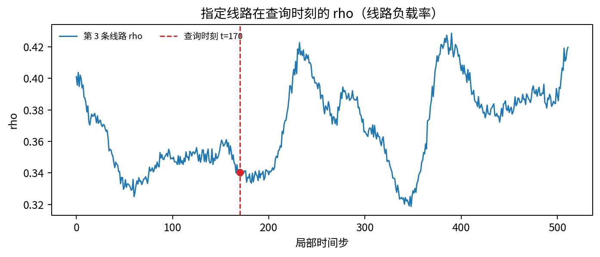
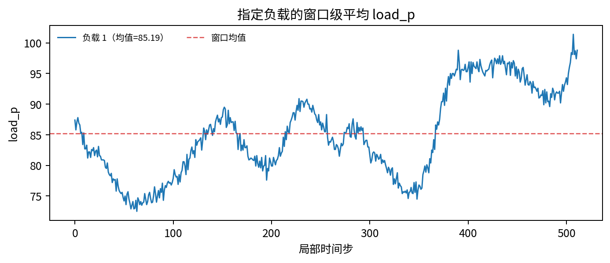
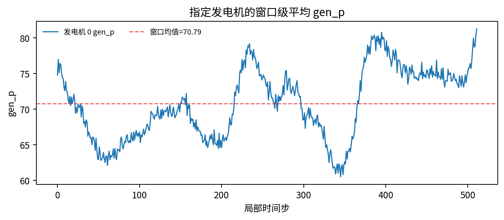
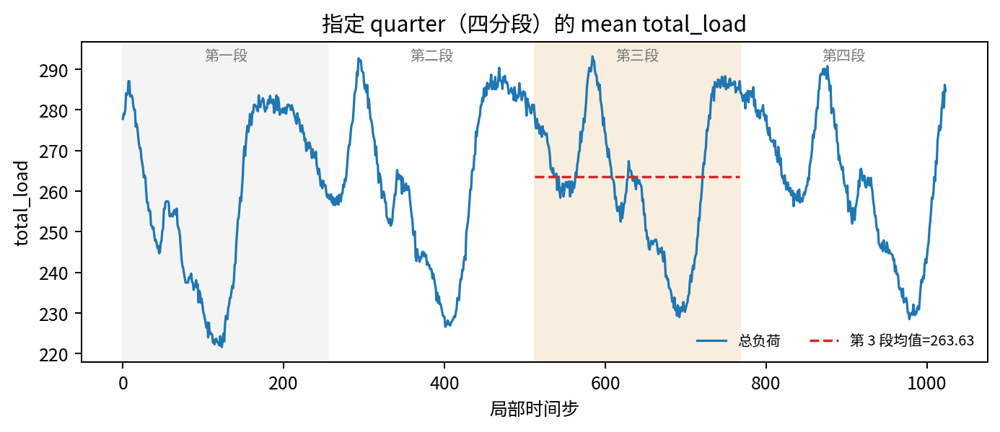
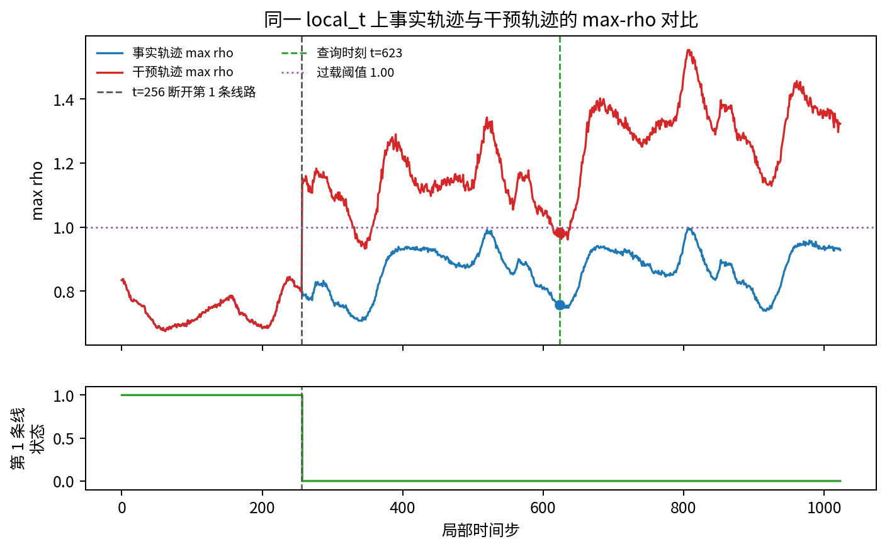

# Grid2Op 中等长度时序 QA 案例分析

这份报告展示当前 Grid2Op simulator-derived（仿真器派生）TS-QA pilot 中选出的代表性案例。所有 ground truth（真值）都来自轨迹数组或 factual/counterfactual（事实/反事实）配对轨迹，LLM 只作为答题模型参与评估，不参与定义正确答案。

## 覆盖范围

| 维度 | 内容 |
| --- | --- |
| 环境 | `rte_case14_realistic` |
| 窗口长度 | 评测集覆盖 `512`、`1024`、`2048`；本报告选取的案例使用 `512/1024` |
| 单轨迹观测案例 | 4 |
| factual/counterfactual（事实/反事实）配对案例 | 1 |
| 展示方法 | `meta_only`、`generic_caption`、`oracle_evidence_caption`、sampled numbers prompt（采样数值提示文本） |

## 主要观察

- 单轨迹的定位题和聚合题差距最大：oracle evidence caption（oracle 证据说明文本）很短且答对，而 sampled numbers prompt（采样数值提示文本）更长却经常答错。
- 这版问题包含显式背景卡片；它解释 Grid2Op、line（线路）、rho（线路负载率）和 factual/counterfactual（事实/反事实）轨迹，但不包含答案事实。
- 报告保留一个对照案例：当采样表覆盖到足够信息时，sampled numbers（采样数值）也能答对。因此当前结论不是“raw numbers（原始数值）必然失败”，而是“question-conditioned evidence（问题条件化证据）更短、更稳定”。
- 逐案例可视化能清楚说明题目真正需要的 evidence（证据）：指定时刻的线路数值、窗口平均值、quarter 均值，以及 factual/counterfactual（事实/反事实）同一时刻的 max-rho 对比。

## 案例

案例 01：单点线路负载率：背景充分后，仍需要定位到具体 line 和 local_t

### 基本信息

| 字段 | 内容 |
| --- | --- |
| 案例 ID | `simqa::grid2op_real::rte_case14_realistic_trace_512::h512::s0::peak_rho_quarter::slot_v4` |
| 数据来源 | 单条观测轨迹 (`observation`) |
| 窗口长度 | `512` |
| 任务类型 | 指定时刻线路 rho 数值 (`rho_value_slot`) |
| 正确答案 | `B` |
| 正确答案标签 | `0.340` |
| ground truth（真值）来源 | `trace_array` / 仿真器轨迹 |

关键结论：这个案例不是问“哪条线路最重要”，而是问指定时刻和指定线路上的 rho 数值。背景卡片解释了 Grid2Op、line（线路）和 rho（线路负载率）的含义，但不会泄漏答案。generic caption（通用说明文本）只说明有哪些变量，因此仍答错；oracle evidence caption（oracle 证据说明文本）给出可核验的 slot value（槽位数值）。

背景卡片

**Grid2Op context card（背景卡片）**
- Grid2Op 是 power-grid simulation environment（电网仿真环境）。trace（轨迹）是一段按时间排序的电网状态 rollout。
- power line（输电线路）负责在电网节点之间传输电力。disconnecting a line（断开线路）会改变 grid topology（电网拓扑），并可能让潮流重新分配到其他线路。
- `rho[line]` 是每条线路的 loading ratio（负载率）。rho 越大表示线路越接近负载上限；在这些问题中，rho >= 1.00 表示 overload（过载），rho > 1.20 表示 severe overload（严重过载）。
- `max_rho` 表示某个时间步所有线路中最大的 rho；`argmax rho line` 是达到该最大 rho 的线路编号。
- `load_p[load]` 是每个负载点的 active power demand（有功功率需求）；`gen_p[generator]` 是每个发电机的 active power output（有功出力）。
- `line_status[line]` 表示线路状态：1 为 connected（连接），0 为 disconnected（断开）。
- 回答必须使用 trace values（轨迹数值）。不要只凭领域直觉推断 intervention（干预）的影响。

**Trace setup（轨迹设置）**
- 这是单条 factual trace window（事实轨迹窗口）。
- `local_t` 是所选窗口内部的局部时间索引；`global_t` 是原始导出轨迹中的全局时间索引。
- 对 quarter-based questions（四分段问题），把局部窗口划分为四个连续且长度相等的 quarter。

**Task rule（任务规则）**
读取题目指定的 line（线路）和 `local_t` 上的 `rho` 数值。

时序图

QA 问题

**问题**

在 local_t=170 时，第 3 条线路的 rho（线路负载率）是多少？

**选项**

- A. 0.364
- B. 0.340
- C. 0.384
- D. 0.396

**正确答案**：`B` - B. 0.340

caption（说明文本）与 evidence（证据）

**generic caption（通用说明文本）**

这个 Grid2Op 电网轨迹窗口包含 512 个时间步上的线路负载率、负载、发电机和潮流变量。

**oracle evidence caption（oracle 证据说明文本）**

在 local_t=170 时，第 3 条线路的 rho（线路负载率）为 0.340。

**可验证事实**

| 验证字段 | 数值 |
| --- | --- |
| `peak_rho` | `0.9388` |
| `peak_local_t` | `394` |
| `peak_global_t` | `394` |
| `peak_line` | `9` |
| `quarter` | `fourth` |
| `slot_local_t` | `170` |
| `slot_line` | `3` |
| `slot_rho` | `0.3403` |
| `slot_value_mode` | `meta_safe_v4` |
| `answer_letter_mode` | `global_hash_balanced_v4b` |

模型回答

| 输入条件 | 原始条件名 | 预测 | 正确性 | Prompt 字符数 | 选项文本 |
| --- | --- | --- | --- | ---: | --- |
| 仅元信息 | `meta_only` | `A` | 错误 | 1440 | A. 0.364 |
| generic caption（通用说明文本） | `generic_caption` | `A` | 错误 | 1578 | A. 0.364 |
| oracle evidence caption（oracle 证据说明文本） | `oracle_evidence_caption` | `B` | 正确 | 1498 | B. 0.340 |
| sampled numbers（采样数值）32 行 | `numbers_sampled_32` | `C` | 错误 | 13853 | C. 0.384 |
| sampled numbers（采样数值）64 行 | `numbers_sampled_64` | `B` | 正确 | 26060 | B. 0.340 |
| sampled numbers（采样数值）128 行 | `numbers_sampled_128` | `B` | 正确 | 50483 | B. 0.340 |

案例分析

这个案例不是问“哪条线路最重要”，而是问指定时刻和指定线路上的 rho 数值。背景卡片解释了 Grid2Op、line（线路）和 rho（线路负载率）的含义，但不会泄漏答案。generic caption（通用说明文本）只说明有哪些变量，因此仍答错；oracle evidence caption（oracle 证据说明文本）给出可核验的 slot value（槽位数值）。

案例 02：平均负载聚合：只看采样行不足以恢复窗口级均值

### 基本信息

| 字段 | 内容 |
| --- | --- |
| 案例 ID | `simqa::grid2op_real::rte_case14_realistic_trace_512::h512::s0::max_avg_load::slot_v4` |
| 数据来源 | 单条观测轨迹 (`observation`) |
| 窗口长度 | `512` |
| 任务类型 | 指定负载窗口平均 load_p (`load_average_value_slot`) |
| 正确答案 | `D` |
| 正确答案标签 | `85.189` |
| ground truth（真值）来源 | `trace_array` / 仿真器轨迹 |

关键结论：这个样例考察整段窗口上的 aggregation（聚合）统计。问题指定 load 1，要求它在整个窗口上的平均 load_p，而不是让模型猜哪个负载最大。所有 sampled numbers（采样数值）条件都选错，说明稀疏采样行不能稳定替代窗口级统计。

背景卡片

**Grid2Op context card（背景卡片）**
- Grid2Op 是 power-grid simulation environment（电网仿真环境）。trace（轨迹）是一段按时间排序的电网状态 rollout。
- power line（输电线路）负责在电网节点之间传输电力。disconnecting a line（断开线路）会改变 grid topology（电网拓扑），并可能让潮流重新分配到其他线路。
- `rho[line]` 是每条线路的 loading ratio（负载率）。rho 越大表示线路越接近负载上限；在这些问题中，rho >= 1.00 表示 overload（过载），rho > 1.20 表示 severe overload（严重过载）。
- `max_rho` 表示某个时间步所有线路中最大的 rho；`argmax rho line` 是达到该最大 rho 的线路编号。
- `load_p[load]` 是每个负载点的 active power demand（有功功率需求）；`gen_p[generator]` 是每个发电机的 active power output（有功出力）。
- `line_status[line]` 表示线路状态：1 为 connected（连接），0 为 disconnected（断开）。
- 回答必须使用 trace values（轨迹数值）。不要只凭领域直觉推断 intervention（干预）的影响。

**Trace setup（轨迹设置）**
- 这是单条 factual trace window（事实轨迹窗口）。
- `local_t` 是所选窗口内部的局部时间索引；`global_t` 是原始导出轨迹中的全局时间索引。
- 对 quarter-based questions（四分段问题），把局部窗口划分为四个连续且长度相等的 quarter。

**Task rule（任务规则）**
对题目指定的 load（负载），计算整个窗口上的平均 `load_p`。

时序图

QA 问题

**问题**

load 1 在整个窗口中的平均 load_p（负载有功功率）是多少？

**选项**

- A. 87.057
- B. 88.694
- C. 90.330
- D. 85.189

**正确答案**：`D` - D. 85.189

caption（说明文本）与 evidence（证据）

**generic caption（通用说明文本）**

这个 Grid2Op 电网轨迹窗口包含 512 个时间步上的线路负载率、负载、发电机和潮流变量。

**oracle evidence caption（oracle 证据说明文本）**

load 1 在整个窗口中的平均 load_p（负载有功功率）为 85.189。

**可验证事实**

| 验证字段 | 数值 |
| --- | --- |
| `max_avg_load` | `1` |
| `avg_load_p` | `85.1891` |
| `slot_load` | `1` |
| `slot_avg_load_p` | `85.1891` |
| `slot_value_mode` | `meta_safe_v4` |
| `answer_letter_mode` | `global_hash_balanced_v4b` |

模型回答

| 输入条件 | 原始条件名 | 预测 | 正确性 | Prompt 字符数 | 选项文本 |
| --- | --- | --- | --- | ---: | --- |
| 仅元信息 | `meta_only` | `B` | 错误 | 1466 | B. 88.694 |
| generic caption（通用说明文本） | `generic_caption` | `A` | 错误 | 1604 | A. 87.057 |
| oracle evidence caption（oracle 证据说明文本） | `oracle_evidence_caption` | `D` | 正确 | 1531 | D. 85.189 |
| sampled numbers（采样数值）32 行 | `numbers_sampled_32` | `B` | 错误 | 13879 | B. 88.694 |
| sampled numbers（采样数值）64 行 | `numbers_sampled_64` | `A` | 错误 | 26086 | A. 87.057 |
| sampled numbers（采样数值）128 行 | `numbers_sampled_128` | `A` | 错误 | 50509 | A. 87.057 |

案例分析

这个样例考察整段窗口上的 aggregation（聚合）统计。问题指定 load 1，要求它在整个窗口上的平均 load_p，而不是让模型猜哪个负载最大。所有 sampled numbers（采样数值）条件都选错，说明稀疏采样行不能稳定替代窗口级统计。

案例 03：发电机窗口均值：长采样提示文本仍可能错过聚合答案

### 基本信息

| 字段 | 内容 |
| --- | --- |
| 案例 ID | `simqa::grid2op_real::rte_case14_realistic_trace_512::h512::s0::max_avg_generator::slot_v4` |
| 数据来源 | 单条观测轨迹 (`observation`) |
| 窗口长度 | `512` |
| 任务类型 | 指定发电机窗口平均 gen_p (`generator_average_value_slot`) |
| 正确答案 | `A` |
| 正确答案标签 | `70.788` |
| ground truth（真值）来源 | `trace_array` / 仿真器轨迹 |

关键结论：这个案例和负载均值类似，但变量换成 generator（发电机）的 gen_p。题目指定 generator 0，要求窗口平均值。sampled numbers prompt（采样数值提示文本）长度达到数万字符仍答错，而 oracle evidence caption 只保留一个可验证数值。

背景卡片

**Grid2Op context card（背景卡片）**
- Grid2Op 是 power-grid simulation environment（电网仿真环境）。trace（轨迹）是一段按时间排序的电网状态 rollout。
- power line（输电线路）负责在电网节点之间传输电力。disconnecting a line（断开线路）会改变 grid topology（电网拓扑），并可能让潮流重新分配到其他线路。
- `rho[line]` 是每条线路的 loading ratio（负载率）。rho 越大表示线路越接近负载上限；在这些问题中，rho >= 1.00 表示 overload（过载），rho > 1.20 表示 severe overload（严重过载）。
- `max_rho` 表示某个时间步所有线路中最大的 rho；`argmax rho line` 是达到该最大 rho 的线路编号。
- `load_p[load]` 是每个负载点的 active power demand（有功功率需求）；`gen_p[generator]` 是每个发电机的 active power output（有功出力）。
- `line_status[line]` 表示线路状态：1 为 connected（连接），0 为 disconnected（断开）。
- 回答必须使用 trace values（轨迹数值）。不要只凭领域直觉推断 intervention（干预）的影响。

**Trace setup（轨迹设置）**
- 这是单条 factual trace window（事实轨迹窗口）。
- `local_t` 是所选窗口内部的局部时间索引；`global_t` 是原始导出轨迹中的全局时间索引。
- 对 quarter-based questions（四分段问题），把局部窗口划分为四个连续且长度相等的 quarter。

**Task rule（任务规则）**
对题目指定的 generator（发电机），计算整个窗口上的平均 `gen_p`。

时序图

QA 问题

**问题**

generator 0 在整个窗口中的平均 gen_p（发电机有功出力）是多少？

**选项**

- A. 70.788
- B. 72.497
- C. 73.857
- D. 74.747

**正确答案**：`A` - A. 70.788

caption（说明文本）与 evidence（证据）

**generic caption（通用说明文本）**

这个 Grid2Op 电网轨迹窗口包含 512 个时间步上的线路负载率、负载、发电机和潮流变量。

**oracle evidence caption（oracle 证据说明文本）**

generator 0 在整个窗口中的平均 gen_p（发电机有功出力）为 70.788。

**可验证事实**

| 验证字段 | 数值 |
| --- | --- |
| `max_avg_generator` | `0` |
| `avg_gen_p` | `70.7879` |
| `slot_generator` | `0` |
| `slot_avg_gen_p` | `70.7879` |
| `slot_value_mode` | `meta_safe_v4` |
| `answer_letter_mode` | `global_hash_balanced_v4b` |

模型回答

| 输入条件 | 原始条件名 | 预测 | 正确性 | Prompt 字符数 | 选项文本 |
| --- | --- | --- | --- | ---: | --- |
| 仅元信息 | `meta_only` | `A` | 正确 | 1474 | A. 70.788 |
| generic caption（通用说明文本） | `generic_caption` | `B` | 错误 | 1612 | B. 72.497 |
| oracle evidence caption（oracle 证据说明文本） | `oracle_evidence_caption` | `A` | 正确 | 1543 | A. 70.788 |
| sampled numbers（采样数值）32 行 | `numbers_sampled_32` | `B` | 错误 | 13887 | B. 72.497 |
| sampled numbers（采样数值）64 行 | `numbers_sampled_64` | `B` | 错误 | 26094 | B. 72.497 |
| sampled numbers（采样数值）128 行 | `numbers_sampled_128` | `B` | 错误 | 50517 | B. 72.497 |

案例分析

这个案例和负载均值类似，但变量换成 generator（发电机）的 gen_p。题目指定 generator 0，要求窗口平均值。sampled numbers prompt（采样数值提示文本）长度达到数万字符仍答错，而 oracle evidence caption 只保留一个可验证数值。

案例 04：控制样例：quarter 均值问题中 sampled numbers（采样数值）可以答对

### 基本信息

| 字段 | 内容 |
| --- | --- |
| 案例 ID | `simqa::grid2op_real::rte_case14_realistic_trace_2048_nooverflow::h1024::s512::peak_total_load_quarter::slot_v4` |
| 数据来源 | 单条观测轨迹 (`observation`) |
| 窗口长度 | `1024` |
| 任务类型 | 指定 quarter 平均 total_load (`quarter_total_load_mean_value_slot`) |
| 正确答案 | `C` |
| 正确答案标签 | `263.625` |
| ground truth（真值）来源 | `trace_array` / 仿真器轨迹 |

关键结论：这是一个对照案例。问题要求第 3 个 quarter（四分段）中的 mean total_load（平均总负荷），三个 sampled numbers 条件都答对，说明我们不能简单宣称 raw numbers（原始数值）总是失败。当前更稳妥的结论是：oracle evidence caption 提供了更短且稳定的答案接口。

背景卡片

**Grid2Op context card（背景卡片）**
- Grid2Op 是 power-grid simulation environment（电网仿真环境）。trace（轨迹）是一段按时间排序的电网状态 rollout。
- power line（输电线路）负责在电网节点之间传输电力。disconnecting a line（断开线路）会改变 grid topology（电网拓扑），并可能让潮流重新分配到其他线路。
- `rho[line]` 是每条线路的 loading ratio（负载率）。rho 越大表示线路越接近负载上限；在这些问题中，rho >= 1.00 表示 overload（过载），rho > 1.20 表示 severe overload（严重过载）。
- `max_rho` 表示某个时间步所有线路中最大的 rho；`argmax rho line` 是达到该最大 rho 的线路编号。
- `load_p[load]` 是每个负载点的 active power demand（有功功率需求）；`gen_p[generator]` 是每个发电机的 active power output（有功出力）。
- `line_status[line]` 表示线路状态：1 为 connected（连接），0 为 disconnected（断开）。
- 回答必须使用 trace values（轨迹数值）。不要只凭领域直觉推断 intervention（干预）的影响。

**Trace setup（轨迹设置）**
- 这是单条 factual trace window（事实轨迹窗口）。
- `local_t` 是所选窗口内部的局部时间索引；`global_t` 是原始导出轨迹中的全局时间索引。
- 对 quarter-based questions（四分段问题），把局部窗口划分为四个连续且长度相等的 quarter。

**Task rule（任务规则）**
先把每个时间步所有 `load_p` 相加得到 total_load（总负荷），再对题目指定的 quarter（四分段）求平均。

时序图

QA 问题

**问题**

这个轨迹窗口第 3 个 quarter（四分段）中的 mean total_load（平均总负荷）是多少？

**选项**

- A. 253.004
- B. 256.499
- C. 263.625
- D. 270.572

**正确答案**：`C` - C. 263.625

caption（说明文本）与 evidence（证据）

**generic caption（通用说明文本）**

这个 Grid2Op 电网轨迹窗口包含 1024 个时间步上的线路负载率、负载、发电机和潮流变量。

**oracle evidence caption（oracle 证据说明文本）**

第 3 个 quarter（四分段）中的 mean total_load（平均总负荷）为 263.625。

**可验证事实**

| 验证字段 | 数值 |
| --- | --- |
| `peak_total_load` | `293.2000` |
| `peak_local_t` | `584` |
| `quarter` | `third` |
| `slot_quarter` | `3` |
| `slot_mean_total_load` | `263.6250` |
| `slot_value_mode` | `meta_safe_v4` |
| `answer_letter_mode` | `global_hash_balanced_v4b` |

模型回答

| 输入条件 | 原始条件名 | 预测 | 正确性 | Prompt 字符数 | 选项文本 |
| --- | --- | --- | --- | ---: | --- |
| 仅元信息 | `meta_only` | `B` | 错误 | 1528 | B. 256.499 |
| generic caption（通用说明文本） | `generic_caption` | `B` | 错误 | 1667 | B. 256.499 |
| oracle evidence caption（oracle 证据说明文本） | `oracle_evidence_caption` | `C` | 正确 | 1590 | C. 263.625 |
| sampled numbers（采样数值）32 行 | `numbers_sampled_32` | `C` | 正确 | 13988 | C. 263.625 |
| sampled numbers（采样数值）64 行 | `numbers_sampled_64` | `C` | 正确 | 26241 | C. 263.625 |
| sampled numbers（采样数值）128 行 | `numbers_sampled_128` | `C` | 正确 | 50746 | C. 263.625 |

案例分析

这是一个对照案例。问题要求第 3 个 quarter（四分段）中的 mean total_load（平均总负荷），三个 sampled numbers 条件都答对，说明我们不能简单宣称 raw numbers（原始数值）总是失败。当前更稳妥的结论是：oracle evidence caption 提供了更短且稳定的答案接口。

案例 05：反事实差值：必须比较同一时刻的事实轨迹和干预轨迹

### 基本信息

| 字段 | 内容 |
| --- | --- |
| 案例 ID | `simqa::grid2op_real_cf::h1024_c-1_t256_line1::cf_peak_rho_direction::slot_v4` |
| 数据来源 | factual/counterfactual（事实/反事实）配对轨迹 (`counterfactual`) |
| 窗口长度 | `1024` |
| 任务类型 | 指定时刻反事实 max-rho 差值 (`cf_delta_max_rho_value_slot`) |
| 正确答案 | `C` |
| 正确答案标签 | `0.225` |
| ground truth（真值）来源 | `trace_array` / 仿真器轨迹 |

关键结论：这个反事实案例要求比较同一个 local_t 上 intervention_max_rho 和 factual_max_rho 的差值。背景卡片说明了 factual/counterfactual（事实/反事实）配对轨迹怎么读，但答案必须来自两条轨迹的逐时刻数值比较。generic caption 没有给出配对数值；高预算 sampled numbers 也不稳定。

背景卡片

**Grid2Op context card（背景卡片）**
- Grid2Op 是 power-grid simulation environment（电网仿真环境）。trace（轨迹）是一段按时间排序的电网状态 rollout。
- power line（输电线路）负责在电网节点之间传输电力。disconnecting a line（断开线路）会改变 grid topology（电网拓扑），并可能让潮流重新分配到其他线路。
- `rho[line]` 是每条线路的 loading ratio（负载率）。rho 越大表示线路越接近负载上限；在这些问题中，rho >= 1.00 表示 overload（过载），rho > 1.20 表示 severe overload（严重过载）。
- `max_rho` 表示某个时间步所有线路中最大的 rho；`argmax rho line` 是达到该最大 rho 的线路编号。
- `load_p[load]` 是每个负载点的 active power demand（有功功率需求）；`gen_p[generator]` 是每个发电机的 active power output（有功出力）。
- `line_status[line]` 表示线路状态：1 为 connected（连接），0 为 disconnected（断开）。
- 回答必须使用 trace values（轨迹数值）。不要只凭领域直觉推断 intervention（干预）的影响。

**Trace setup（轨迹设置）**
- 这是 paired factual/counterfactual setting（事实/反事实配对设置）。
- factual trace（事实轨迹）是原始 rollout。
- intervention trace（干预轨迹）与事实轨迹设置相同，区别是在 intervention time（干预时刻）断开指定输电线路。
- 对 post-intervention questions（干预后问题），比较事实轨迹和干预轨迹在干预时刻之后的时间步。

**Task rule（任务规则）**
在题目指定的 `local_t` 上，用 intervention trace（干预轨迹）的 `max_rho` 减去 factual trace（事实轨迹）的 `max_rho`。

时序图

QA 问题

**问题**

在 local_t=623 时，intervention_max_rho 减去 factual_max_rho 是多少？

**选项**

- A. 0.200
- B. 0.249
- C. 0.225
- D. 0.269

**正确答案**：`C` - C. 0.225

caption（说明文本）与 evidence（证据）

**generic caption（通用说明文本）**

这组 Grid2Op 配对轨迹包含一条事实 rollout，以及一条在 episode 中断开某条输电线路的反事实 rollout。

**oracle evidence caption（oracle 证据说明文本）**

在 local_t=623 时，intervention_max_rho - factual_max_rho 为 0.225。

**可验证事实**

| 验证字段 | 数值 |
| --- | --- |
| `paired_steps` | `1024` |
| `post_intervention_steps` | `767` |
| `intervention_step` | `256` |
| `line_id` | `1` |
| `factual_line_status_at_intervention` | `1` |
| `intervention_line_status_after` | `0` |
| `mean_abs_total_load_delta_post` | `0.0000` |
| `max_abs_total_load_delta_post` | `0.0000` |
| `mean_max_rho_delta_post` | `0.3552` |
| `max_abs_max_rho_delta_post` | `0.5587` |
| `factual_max_rho_post` | `0.9990` |
| `intervention_max_rho_post` | `1.5541` |
| `factual_post_peak_max_rho` | `0.9990` |
| `intervention_post_peak_max_rho` | `1.5541` |
| `post_peak_max_rho_delta` | `0.5551` |
| `mean_post_max_rho_delta` | `0.3552` |
| `slot_local_t` | `623` |
| `slot_factual_max_rho` | `0.7583` |
| `slot_intervention_max_rho` | `0.9835` |
| `slot_delta_max_rho` | `0.2252` |
| `slot_value_mode` | `meta_safe_v4` |
| `answer_letter_mode` | `global_hash_balanced_v4b` |

模型回答

| 输入条件 | 原始条件名 | 预测 | 正确性 | Prompt 字符数 | 选项文本 |
| --- | --- | --- | --- | ---: | --- |
| 仅元信息 | `meta_only` | `D` | 错误 | 1607 | D. 0.269 |
| generic caption（通用说明文本） | `generic_caption` | `B` | 错误 | 1762 | B. 0.249 |
| oracle evidence caption（oracle 证据说明文本） | `oracle_evidence_caption` | `C` | 正确 | 1689 | C. 0.225 |
| sampled numbers（采样数值）32 行 | `numbers_sampled_32` | `C` | 正确 | 9151 | C. 0.225 |
| sampled numbers（采样数值）64 行 | `numbers_sampled_64` | `A` | 错误 | 16445 | A. 0.200 |
| sampled numbers（采样数值）128 行 | `numbers_sampled_128` | `A` | 错误 | 31032 | A. 0.200 |
| sampled numbers（采样数值）256 行 | `numbers_sampled_256` | `A` | 错误 | 60206 | A. 0.200 |

案例分析

这个反事实案例要求比较同一个 local_t 上 intervention_max_rho 和 factual_max_rho 的差值。背景卡片说明了 factual/counterfactual（事实/反事实）配对轨迹怎么读，但答案必须来自两条轨迹的逐时刻数值比较。generic caption 没有给出配对数值；高预算 sampled numbers 也不稳定。

